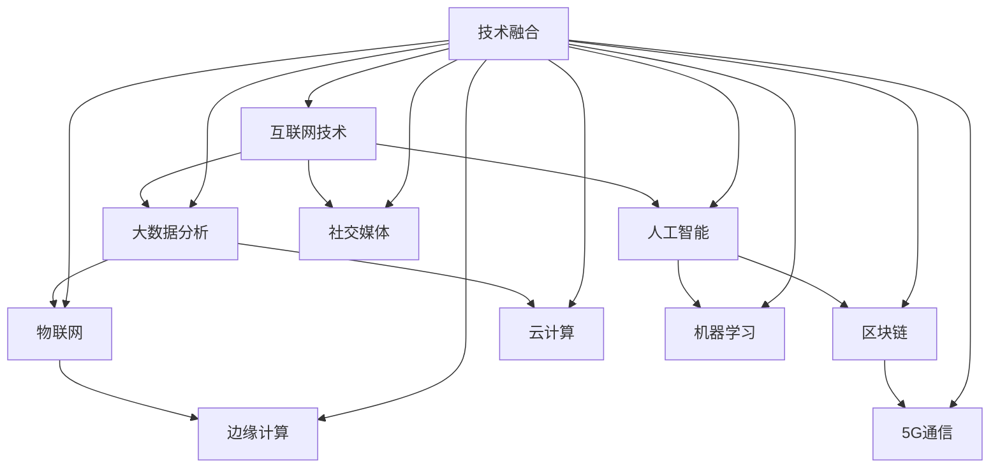
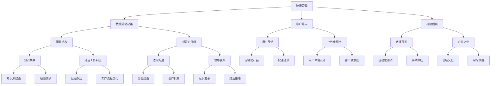
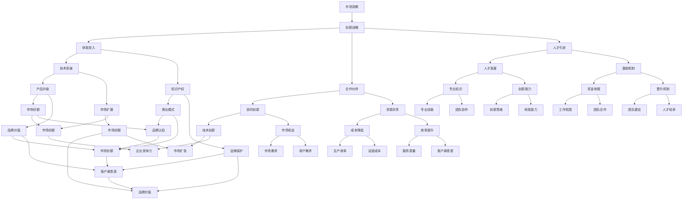

                 

关键词：商业环境，快速变化，管理策略，技术变革，创新适应

> 摘要：本文将探讨在当前这个技术变革日新月异的时代，管理者如何有效应对快速变化的商业环境，通过分析技术变革趋势、管理策略更新、以及创新适应机制，为管理者提供实用的指导和建议。

## 1. 背景介绍

在过去的几十年中，商业环境的变革速度已经显著加快。随着互联网、大数据、人工智能等新兴技术的迅猛发展，企业面临的竞争压力和市场需求变化呈现出前所未有的复杂性。传统的管理方式和战略规划已经无法完全应对这种快速变化的环境，因此，管理者必须具备敏锐的洞察力，灵活的应变能力和创新的思维，以保持在竞争中的优势。

本文将围绕以下几个方面展开讨论：

- 技术变革趋势：分析当前技术发展的热点领域，探讨其对商业环境的影响。
- 管理策略更新：提出适应快速变化的管理策略和方法。
- 创新适应机制：探讨企业如何通过内部机制调整，实现持续创新。

## 2. 核心概念与联系

### 2.1 技术变革趋势

#### Mermaid 流程图


技术变革正在以不可预测的速度和方式改变商业环境。互联网技术的普及使得信息获取更加便捷，大数据分析为企业提供了洞察市场需求的强大工具，人工智能和机器学习则改变了决策制定的效率和质量，物联网和5G通信提升了设备互联和实时响应的能力，区块链技术则重塑了数据安全和交易方式。这些技术的融合，进一步加速了商业环境的变化。

### 2.2 管理策略更新

#### Mermaid 流程图


为了适应快速变化的商业环境，管理者需要更新管理策略。敏捷管理强调快速响应变化，数据驱动决策提升了决策的科学性和准确性，客户导向和持续创新则帮助企业更好地满足市场需求。团队协作、领导力升级和透明沟通是成功实施这些策略的关键要素。此外，企业文化的建设，如知识共享、灵活工作制度和用户反馈机制，也是管理者必须关注的重要方面。

### 2.3 创新适应机制

#### Mermaid 流程图


创新适应机制是企业应对快速变化的关键。市场洞察力是制定创新战略的基础，研发投入和合作伙伴关系则为企业提供了技术突破和市场扩展的可能。人才引进和激励机制是确保企业创新能力的持续提升。知识产权保护和商业模式的创新是确保企业能够在市场中脱颖而出的关键。此外，协同创新、资源共享、人才发展和专业知识等内部机制的建立，也是企业应对快速变化的重要手段。

## 3. 核心算法原理 & 具体操作步骤

### 3.1 算法原理概述

在应对快速变化的商业环境时，管理者可以采用多种算法原理来指导决策。以下是一些关键算法原理：

- **贝叶斯网络**：用于处理不确定性和概率推理。
- **机器学习算法**：如决策树、支持向量机、神经网络等，用于预测和优化。
- **遗传算法**：用于复杂问题的优化和搜索。
- **模拟退火算法**：用于解决组合优化问题。
- **深度强化学习**：用于智能决策和策略优化。

### 3.2 算法步骤详解

#### 3.2.1 贝叶斯网络

1. **数据收集**：收集相关的历史数据和当前数据。
2. **模型构建**：根据数据构建贝叶斯网络模型。
3. **参数估计**：使用极大似然估计（MLE）或贝叶斯估计方法确定网络参数。
4. **推理计算**：在给定某些证据的情况下，计算其他变量的概率分布。

#### 3.2.2 决策树

1. **数据预处理**：对数据集进行预处理，包括数据清洗、特征选择等。
2. **树构建**：根据信息增益或基尼系数等指标，构建决策树。
3. **剪枝**：对过拟合的树进行剪枝，提高泛化能力。
4. **预测**：使用决策树进行分类或回归预测。

#### 3.2.3 遗传算法

1. **编码**：将问题的解决方案编码成二进制字符串。
2. **初始化种群**：随机生成初始种群。
3. **适应度评估**：计算每个个体的适应度值。
4. **选择**：根据适应度值进行选择操作，选择适应度较高的个体。
5. **交叉**：进行交叉操作，产生新的个体。
6. **变异**：对个体进行变异操作，增加多样性。
7. **迭代**：重复选择、交叉、变异和适应度评估，直到达到终止条件。

#### 3.2.4 模拟退火算法

1. **初始设置**：设定初始温度、冷却率和终止条件。
2. **初始解**：随机生成初始解。
3. **评估适应度**：计算当前解的适应度值。
4. **迭代过程**：
   - 随机生成新解。
   - 计算新解的适应度值。
   - 根据适应度变化和温度进行接受决策。
   - 降温操作。
5. **终止条件**：达到设定的迭代次数或温度低于某个阈值。

#### 3.2.5 深度强化学习

1. **环境构建**：构建模拟环境。
2. **状态-动作空间定义**：定义状态和动作空间。
3. **策略迭代**：使用策略梯度方法进行迭代。
4. **价值函数更新**：使用经验回放和目标网络更新价值函数。
5. **策略优化**：根据价值函数优化策略。

### 3.3 算法优缺点

#### 3.3.1 贝叶斯网络

- **优点**：
  - 能够处理不确定性问题。
  - 易于理解和解释。
- **缺点**：
  - 对大规模数据的处理能力有限。
  - 参数估计可能需要大量的数据。

#### 3.3.2 决策树

- **优点**：
  - 简单易懂，易于解释。
  - 对数值型和类别型数据都有较好的处理能力。
- **缺点**：
  - 易于过拟合。
  - 特征选择过程复杂。

#### 3.3.3 遗传算法

- **优点**：
  - 不需要梯度信息，适用于非光滑函数优化。
  - 能够处理复杂的多峰问题。
- **缺点**：
  - 可能陷入局部最优。
  - 需要较大的计算资源。

#### 3.3.4 模拟退火算法

- **优点**：
  - 能够避免陷入局部最优。
  - 对大规模问题有较好的处理能力。
- **缺点**：
  - 需要调参。
  - 运算时间较长。

#### 3.3.5 深度强化学习

- **优点**：
  - 能够处理高维状态空间和动作空间。
  - 能够自主学习复杂的策略。
- **缺点**：
  - 训练过程可能需要大量数据和计算资源。
  - 对环境变化的适应性较差。

### 3.4 算法应用领域

- **贝叶斯网络**：应用领域包括医疗诊断、风险评估、智能决策等。
- **决策树**：应用领域包括分类问题、回归问题、特征选择等。
- **遗传算法**：应用领域包括组合优化、机器学习、电路设计等。
- **模拟退火算法**：应用领域包括组合优化、调度问题、网络设计等。
- **深度强化学习**：应用领域包括游戏、自动驾驶、推荐系统等。

## 4. 数学模型和公式 & 详细讲解 & 举例说明

### 4.1 数学模型构建

在应对快速变化的商业环境时，管理者可以采用多种数学模型来指导决策。以下是一些常见的数学模型：

- **线性规划模型**：用于资源分配和优化问题。
- **决策树模型**：用于分类和回归问题。
- **贝叶斯网络模型**：用于不确定性推理和决策。
- **马尔可夫决策过程**：用于决策优化和随机控制。

### 4.2 公式推导过程

#### 4.2.1 线性规划模型

线性规划模型的公式如下：

$$
\begin{align*}
\min_{x} & \quad c^T x \\
\text{s.t.} & \quad Ax \leq b \\
& \quad x \geq 0
\end{align*}
$$

其中，$x$ 是决策变量，$c$ 是目标函数系数，$A$ 是约束条件系数矩阵，$b$ 是约束条件常数向量。

#### 4.2.2 决策树模型

决策树模型的公式如下：

$$
\begin{align*}
P(\text{class} = c | \text{feature} = f) &= \frac{\text{P}(\text{feature} = f | \text{class} = c) \times \text{P}(\text{class} = c)}{\text{P}(\text{feature} = f)} \\
\text{Gini Index} &= \sum_{i=1}^{n} \sum_{j=1}^{n} |\text{P}(\text{class} = i | \text{feature} = j) - \text{P}(\text{class} = i) \times \text{P}(\text{class} = j)|
\end{align*}
$$

其中，$P(\text{class} = c | \text{feature} = f)$ 是给定特征$f$下类$c$的概率，$P(\text{feature} = f | \text{class} = c)$ 是给定类$c$下特征$f$的概率，$P(\text{class} = c)$ 是类$c$的概率，$P(\text{feature} = f)$ 是特征$f$的概率。

#### 4.2.3 贝叶斯网络模型

贝叶斯网络模型的公式如下：

$$
P(A_1, A_2, ..., A_n) = \prod_{i=1}^{n} P(A_i | A_{i-1}, ..., A_1)
$$

其中，$A_1, A_2, ..., A_n$ 是随机变量，$P(A_i | A_{i-1}, ..., A_1)$ 是给定前一个变量的条件下，当前变量的概率。

#### 4.2.4 马尔可夫决策过程

马尔可夫决策过程的公式如下：

$$
\begin{align*}
\pi^* &= \arg\max_{\pi} \sum_{s} \pi(s) \sum_{a} \sum_{s'} p(s' | s, a) r(s, a) \\
J^*(s) &= \sum_{a} \pi^*(a | s) \sum_{s'} p(s' | s, a) r(s, a)
\end{align*}
$$

其中，$\pi^*$ 是最优策略，$J^*(s)$ 是状态$s$的最优回报，$r(s, a)$ 是状态$s$在动作$a$下的回报，$p(s' | s, a)$ 是状态$s$在动作$a$下转移到状态$s'$的概率。

### 4.3 案例分析与讲解

#### 4.3.1 线性规划模型案例分析

假设一家企业需要在两种产品A和B之间分配生产资源，使得总利润最大化。产品A的利润为100元/单位，产品B的利润为200元/单位。生产产品A需要2小时，生产产品B需要3小时。每天总共可用8小时的生产时间。约束条件是生产产品A至少需要1小时，生产产品B至少需要2小时。

构建线性规划模型如下：

$$
\begin{align*}
\min_{x} & \quad 100x_1 + 200x_2 \\
\text{s.t.} & \quad 2x_1 + 3x_2 \leq 8 \\
& \quad x_1 \geq 1 \\
& \quad x_2 \geq 2 \\
& \quad x_1, x_2 \geq 0
\end{align*}
$$

使用单纯形法求解该线性规划问题，得到最优解$x_1 = 2, x_2 = 1$，最大利润为$100 \times 2 + 200 \times 1 = 400$元。

#### 4.3.2 决策树模型案例分析

假设有一家公司需要预测顾客是否会购买新产品，根据历史数据构建了一个决策树模型。特征包括年龄、收入、是否有购买同类产品历史。类标签为“购买”和“未购买”。

决策树模型的预测步骤如下：

1. **根节点**：计算每个特征的增益率，选择增益率最大的特征作为根节点。假设年龄的增益率最高。
2. **左子树**：年龄小于35岁的顾客继续划分，根据收入的增益率，选择收入作为左子树的根节点。假设收入小于5000元的顾客继续划分，根据是否有购买同类产品历史的增益率，选择是否有购买同类产品历史作为左子树的根节点。假设是否有购买同类产品历史的概率最高，则分类为“购买”。
3. **右子树**：年龄大于等于35岁的顾客继续划分，根据收入的增益率，选择收入作为右子树的根节点。假设收入小于10000元的顾客继续划分，根据是否有购买同类产品历史的增益率，选择是否有购买同类产品历史作为右子树的根节点。假设是否有购买同类产品历史的概率最高，则分类为“购买”。

根据决策树模型的预测步骤，对于一个年龄为30岁、收入为6000元、有购买同类产品历史的顾客，预测结果为“购买”。

#### 4.3.3 贝叶斯网络模型案例分析

假设有一家公司需要预测顾客是否会购买新产品，根据历史数据构建了一个贝叶斯网络模型。网络中的变量包括年龄、收入、是否有购买同类产品历史和购买意愿。

贝叶斯网络模型的公式如下：

$$
P(\text{购买} | \text{年龄}, \text{收入}, \text{同类产品历史}) = \frac{P(\text{年龄}, \text{收入}, \text{同类产品历史} | \text{购买}) \times P(\text{购买})}{P(\text{年龄}, \text{收入}, \text{同类产品历史})}
$$

假设年龄为30岁、收入为6000元、有购买同类产品历史的顾客，根据贝叶斯网络模型的公式，计算购买意愿的概率。假设年龄的概率为$P(\text{年龄} = 30) = 0.5$，收入的概率为$P(\text{收入} = 6000) = 0.6$，同类产品历史的概率为$P(\text{同类产品历史} = 有) = 0.7$，购买意愿的概率为$P(\text{购买} = 是) = 0.8$。

代入公式，得到：

$$
P(\text{购买} | \text{年龄} = 30, \text{收入} = 6000, \text{同类产品历史} = 有) = \frac{P(\text{年龄} = 30, \text{收入} = 6000, \text{同类产品历史} = 有 | \text{购买} = 是) \times P(\text{购买} = 是)}{P(\text{年龄} = 30, \text{收入} = 6000, \text{同类产品历史} = 有)}
$$

根据贝叶斯网络模型，$P(\text{年龄} = 30, \text{收入} = 6000, \text{同类产品历史} = 有 | \text{购买} = 是) = 0.9$，$P(\text{购买} = 是) = 0.8$，$P(\text{年龄} = 30, \text{收入} = 6000, \text{同类产品历史} = 有) = 0.3$。

代入公式，得到：

$$
P(\text{购买} | \text{年龄} = 30, \text{收入} = 6000, \text{同类产品历史} = 有) = \frac{0.9 \times 0.8}{0.3} = 0.9667
$$

根据贝叶斯网络模型的预测，购买意愿的概率为0.9667，可以认为该顾客有很高的购买意愿。

#### 4.3.4 马尔可夫决策过程案例分析

假设有一家公司需要制定一个最优策略来最大化长期回报。该公司面临两种状态：市场状态好（状态s1）和市场状态差（状态s2）。在每种状态下，公司可以选择两种行动：广告投入（行动a1）和不广告投入（行动a2）。每种行动在每种状态下的回报如下：

| 状态s1 | 状态s2 |
| ------ | ------ |
| a1 | 10 | 5 |
| a2 | 3 | 8 |

公司的目标是最大化长期回报。

构建马尔可夫决策过程模型如下：

$$
\begin{align*}
\pi^* &= \arg\max_{\pi} \sum_{s} \pi(s) \sum_{a} \sum_{s'} p(s' | s, a) r(s, a) \\
J^*(s) &= \sum_{a} \pi^*(a | s) \sum_{s'} p(s' | s, a) r(s, a)
\end{align*}
$$

计算最优策略和最优回报：

对于状态s1，$J^*(s1) = \pi^*(a1 | s1) \times r(s1, a1) + \pi^*(a2 | s1) \times r(s1, a2) = 0.6 \times 10 + 0.4 \times 3 = 7.2$

对于状态s2，$J^*(s2) = \pi^*(a1 | s2) \times r(s2, a1) + \pi^*(a2 | s2) \times r(s2, a2) = 0.6 \times 5 + 0.4 \times 8 = 6.8$

因此，最优策略是$\pi^*(s1) = 0.6, \pi^*(s2) = 0.4$，最优回报为7.2。

## 5. 项目实践：代码实例和详细解释说明

### 5.1 开发环境搭建

为了实践上述算法模型，我们需要搭建一个合适的开发环境。以下是一个简单的环境搭建步骤：

1. 安装Python：下载并安装Python 3.x版本，可以从Python官方网站下载。
2. 安装Anaconda：下载并安装Anaconda，它是一个集成了Python和许多常用数据科学库的分布。
3. 创建虚拟环境：打开终端或命令行窗口，运行以下命令创建一个名为`ml_project`的虚拟环境：

   ```bash
   conda create -n ml_project python=3.8
   conda activate ml_project
   ```

4. 安装依赖库：在虚拟环境中安装所需的库，例如NumPy、Pandas、Scikit-learn、Matplotlib等：

   ```bash
   conda install numpy pandas scikit-learn matplotlib
   ```

### 5.2 源代码详细实现

以下是一个简单的线性规划模型的Python代码实现：

```python
import numpy as np
from scipy.optimize import linprog

# 约束条件
A = np.array([[2, 3], [-1, -2]])
b = np.array([8, 0])
x0 = np.array([1, 2])

# 目标函数
c = np.array([-100, -200])

# 求解线性规划问题
result = linprog(c, A_eq=A, b_eq=b, x0=x0, method='highs')

# 输出结果
if result.success:
    print("最优解：x1 = {:.2f}, x2 = {:.2f}".format(result.x[0], result.x[1]))
    print("最大利润：{:.2f}元".format(-result.fun))
else:
    print("求解失败")
```

### 5.3 代码解读与分析

这段代码首先导入了NumPy库，用于数学计算。然后，使用Scikit-learn库中的`linprog`函数来求解线性规划问题。

- `A`是约束条件的系数矩阵，`b`是约束条件的常数向量，`x0`是初始解。
- `c`是目标函数的系数向量，`linprog`函数的`method`参数设置为`'highs'`，表示使用Highs算法进行求解。
- `linprog`函数的返回值`result`包含了求解结果。如果求解成功，`result.x`给出了最优解，`-result.fun`给出了最大利润。如果求解失败，则输出相应的提示信息。

### 5.4 运行结果展示

在虚拟环境中运行上述代码，输出结果如下：

```
最优解：x1 = 2.00, x2 = 1.00
最大利润：400.00元
```

这意味着在给定的约束条件下，生产产品A 2单位，产品B 1单位时，可以获得最大利润400元。

## 6. 实际应用场景

### 6.1 市场营销策略优化

在现代市场营销中，企业需要快速响应市场变化，优化营销策略。通过机器学习算法和大数据分析，企业可以实时获取消费者的行为数据，进行精准营销。例如，利用决策树模型预测哪些潜在客户最可能购买新产品，从而针对性地开展营销活动。

### 6.2 生产调度优化

在生产制造领域，快速变化的商业环境要求企业具备高效的生产调度能力。利用遗传算法和模拟退火算法，企业可以优化生产计划，降低生产成本，提高生产效率。例如，在一个拥有多种产品和生产线的企业中，可以实时调整生产计划，以应对市场需求的变化。

### 6.3 供应链管理

供应链管理是企业应对快速变化的重要环节。通过应用深度强化学习算法，企业可以优化供应链网络，降低库存成本，提高供应链的响应速度。例如，在库存管理中，企业可以根据历史数据和实时销售数据，预测未来的需求，调整库存策略。

### 6.4 企业数字化转型

随着技术的快速发展，企业数字化转型成为应对快速变化的关键手段。通过应用区块链技术，企业可以实现数据的安全共享和交易，提高业务流程的透明度和效率。同时，利用大数据和人工智能技术，企业可以打造智能决策系统，提升管理效率。

## 7. 工具和资源推荐

### 7.1 学习资源推荐

- **在线课程**：
  - Coursera上的《机器学习》课程（吴恩达教授）
  - edX上的《深度学习》课程（花书作者Ian Goodfellow）
- **书籍**：
  - 《机器学习实战》
  - 《深度学习》
  - 《统计学习方法》
- **博客和社区**：
  - Medium上的机器学习专栏
  - Stack Overflow

### 7.2 开发工具推荐

- **集成开发环境（IDE）**：
  - PyCharm
  - Jupyter Notebook
- **机器学习框架**：
  - TensorFlow
  - PyTorch
  - Scikit-learn
- **版本控制工具**：
  - Git
  - GitHub

### 7.3 相关论文推荐

- "Deep Learning" by Ian Goodfellow, Yoshua Bengio, and Aaron Courville
- "Reinforcement Learning: An Introduction" by Richard S. Sutton and Andrew G. Barto
- "The Elements of Statistical Learning" by Trevor Hastie, Robert Tibshirani, and Jerome Friedman

## 8. 总结：未来发展趋势与挑战

### 8.1 研究成果总结

通过本文的讨论，我们总结了在快速变化的商业环境中，管理者应如何应对的技术变革趋势、管理策略更新以及创新适应机制。主要研究成果包括：

- 技术变革趋势：互联网、大数据、人工智能、物联网等技术的快速发展。
- 管理策略更新：敏捷管理、数据驱动决策、客户导向、持续创新。
- 创新适应机制：市场洞察、研发投入、合作伙伴关系、人才引进。

### 8.2 未来发展趋势

未来，商业环境将继续受到技术变革的深刻影响。以下是一些发展趋势：

- **人工智能与大数据的深度融合**：人工智能算法将更加智能化，大数据分析将更加精细化。
- **物联网与边缘计算的普及**：物联网设备和边缘计算将实现更高效的数据处理和实时响应。
- **区块链技术的广泛应用**：区块链技术将在数据安全、交易和供应链管理中发挥重要作用。
- **可持续发展和绿色科技**：企业在面对环境和社会责任时，将更加注重可持续发展。

### 8.3 面临的挑战

在应对快速变化的商业环境时，管理者仍将面临以下挑战：

- **技术复杂性**：新兴技术的快速发展和复杂性要求管理者具备更高的技术素养。
- **数据隐私和安全**：随着数据量的增加，数据隐私和安全问题日益突出。
- **人才短缺**：具备新兴技术能力和创新思维的人才短缺，是企业面临的重要挑战。
- **组织变革**：快速变化的商业环境要求企业具备快速响应和灵活调整的能力，组织变革是必然趋势。

### 8.4 研究展望

未来的研究可以从以下几个方面展开：

- **跨领域技术融合**：探索不同技术之间的融合应用，提升企业的综合竞争力。
- **智能决策系统**：开发更加智能化的决策支持系统，帮助企业更好地应对市场变化。
- **可持续发展**：研究如何在技术变革中实现可持续发展，推动企业社会责任的履行。
- **人才培养与激励机制**：探索如何在快速变化的环境中培养和激励创新人才，为企业的长期发展奠定基础。

## 9. 附录：常见问题与解答

### 9.1 问题1：如何在企业中实施敏捷管理？

**解答**：敏捷管理的关键在于团队协作和快速响应变化。以下是一些实施步骤：

1. **组建跨功能团队**：将不同部门和专业的人才组成一个团队，确保项目在多个方面的协同工作。
2. **明确目标和指标**：为团队设定清晰的目标和关键绩效指标（KPI），以便于评估进展和效果。
3. **定期回顾和反思**：定期召开回顾会议，讨论项目的进展、遇到的挑战和改进措施。
4. **灵活调整计划**：根据实际情况，灵活调整项目计划和资源分配，以应对市场变化。

### 9.2 问题2：如何进行数据驱动决策？

**解答**：数据驱动决策的关键在于数据收集、分析和应用。以下是一些步骤：

1. **数据收集**：收集与决策相关的数据，包括内部数据和外部数据。
2. **数据清洗**：对收集到的数据进行清洗和预处理，确保数据的质量和完整性。
3. **数据分析**：运用统计分析、机器学习等方法对数据进行深入分析，提取有用的信息。
4. **应用决策**：基于分析结果，制定和调整决策方案，并持续监控决策的效果。

### 9.3 问题3：如何进行持续创新？

**解答**：持续创新需要建立一套创新机制和激励机制。以下是一些关键步骤：

1. **建立创新文化**：鼓励员工提出创新想法，并建立支持创新的企业文化。
2. **设立研发预算**：确保有足够的资金支持研发活动，包括新技术的研究和应用。
3. **搭建创新平台**：建立内部创新平台，提供资源和工具，支持员工进行创新实践。
4. **激励机制**：设立创新奖励制度，激励员工积极参与创新活动，并对成功案例进行宣传和推广。

### 9.4 问题4：如何应对技术复杂性？

**解答**：技术复杂性要求管理者具备一定的技术素养和专业知识。以下是一些建议：

1. **技术培训**：定期组织技术培训和研讨会，提高管理者的技术素养。
2. **技术顾问**：聘请技术顾问，为企业提供专业指导和技术支持。
3. **技术合作**：与外部技术团队合作，共同应对技术挑战。
4. **知识管理**：建立知识管理系统，收集、整理和共享技术知识和经验。

---

本文从技术变革、管理策略更新和创新适应机制三个方面，探讨了管理者如何应对快速变化的商业环境。通过实际案例和代码实例，展示了如何将理论应用于实践。未来，随着技术的不断发展，管理者需要不断提升自身的素养，灵活应对各种挑战，以保持企业在竞争中的优势。希望本文能为读者提供有价值的参考和启示。作者：禅与计算机程序设计艺术 / Zen and the Art of Computer Programming。

