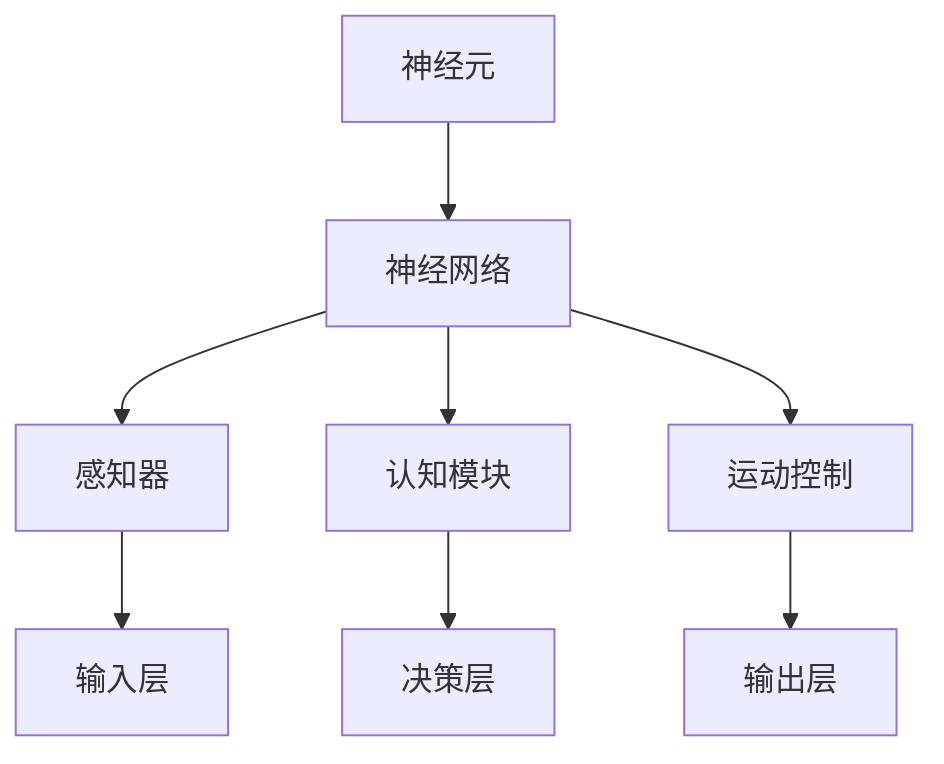

                 

 类脑智能与认知计算是当前人工智能领域的前沿方向，它试图模仿人类大脑的结构和功能，实现更为智能、自适应的计算系统。本文将详细介绍类脑智能与认知计算的基本原理，并分享一些具体的代码实战案例，帮助读者深入理解这一领域。

## 关键词
- 类脑智能
- 认知计算
- 人工智能
- 神经网络
- 脑机接口
- 代码实战

## 摘要
本文首先介绍了类脑智能与认知计算的基本概念和背景，接着探讨了神经网络和脑机接口的核心原理。随后，文章通过详细讲解数学模型和算法步骤，展示了如何实现类脑智能的基本功能。最后，通过代码实例和实际应用场景的剖析，读者可以全面了解类脑智能与认知计算的实践方法。

## 1. 背景介绍
类脑智能（Brain-inspired Intelligence）是一种模仿人类大脑结构和功能的计算系统。认知计算（Cognitive Computing）则是指模拟人类认知过程的计算模型。这两者共同构成了人工智能领域的重要分支，旨在解决传统计算方法难以应对的问题。

近年来，随着神经科学、计算机科学和信息技术的快速发展，类脑智能与认知计算逐渐成为研究热点。通过模仿大脑神经元之间的连接和通信方式，研究者们试图构建具有高度自适应性和学习能力的人工智能系统。

## 2. 核心概念与联系

类脑智能的核心在于模仿人脑的结构和功能。人脑由数亿个神经元组成，通过复杂的网络连接实现信息处理和认知功能。类脑智能系统则试图通过模拟神经元及其连接方式来实现类似的功能。

下面是一个简化的 Mermaid 流程图，展示类脑智能系统的主要组成部分：



### 2.1 神经元
神经元是大脑的基本单元，负责接收、处理和传递信息。类脑智能系统中的神经元通常通过模拟生物神经元的工作方式来实现。

### 2.2 神经网络
神经网络是由大量神经元组成的网络，通过神经元之间的连接和通信实现复杂的信息处理功能。神经网络可以分为多种类型，如前馈神经网络、卷积神经网络、循环神经网络等。

### 2.3 感知器
感知器是神经网络的一部分，负责接收外部输入并产生响应。在类脑智能系统中，感知器通常用于处理视觉、听觉等感知信息。

### 2.4 认知模块
认知模块是类脑智能系统中的核心组件，负责模拟人类的认知过程，如学习、记忆、推理等。认知模块通常基于神经网络或其他计算模型实现。

### 2.5 运动控制
运动控制模块负责将认知模块的决策转化为实际的运动行为。在类脑智能系统中，运动控制模块通常用于模拟人类的肢体运动或机器人控制。

## 3. 核心算法原理 & 具体操作步骤

### 3.1 算法原理概述

类脑智能算法的核心是基于神经网络的计算模型。神经网络通过模仿生物神经元之间的连接和通信方式，实现信息处理和认知功能。以下是类脑智能算法的基本原理：

1. **神经元激活函数**：神经元通过激活函数对输入信号进行非线性处理，以产生输出。
2. **权重和偏置**：神经元之间的连接（权重）和神经元自身的偏置用于调整信号传递强度。
3. **反向传播**：通过反向传播算法，神经网络能够根据输出误差调整权重和偏置，以优化网络性能。

### 3.2 算法步骤详解

类脑智能算法的具体操作步骤如下：

1. **初始化神经网络**：随机初始化神经网络的权重和偏置。
2. **前向传播**：将输入信号通过神经网络进行前向传播，得到输出信号。
3. **计算误差**：计算实际输出与期望输出之间的误差。
4. **反向传播**：根据误差信号，通过反向传播算法更新神经网络的权重和偏置。
5. **迭代优化**：重复前向传播和反向传播过程，直到网络性能达到预设目标。

### 3.3 算法优缺点

类脑智能算法的优点：

- **自适应性强**：能够通过学习不断调整自身结构和参数，以适应不同任务和环境。
- **可解释性高**：神经网络的结构和参数可以直接解释为生物神经元的模拟。

类脑智能算法的缺点：

- **计算复杂度高**：神经网络需要大量的计算资源和时间进行训练和推理。
- **过拟合风险**：神经网络容易受到训练数据的影响，导致过拟合。

### 3.4 算法应用领域

类脑智能算法的应用领域广泛，包括：

- **图像识别**：通过卷积神经网络实现图像分类和目标检测。
- **自然语言处理**：通过循环神经网络实现文本分类、机器翻译等任务。
- **机器人控制**：通过模拟人类大脑的运动控制模块实现机器人自主行动。

## 4. 数学模型和公式 & 详细讲解 & 举例说明

### 4.1 数学模型构建

类脑智能算法的数学模型主要基于神经网络。以下是神经网络中常用的数学模型：

1. **神经元激活函数**：通常使用 sigmoid 函数、ReLU 函数等。
2. **权重和偏置**：权重和偏置用于调整信号传递强度。
3. **反向传播算法**：通过计算梯度来更新权重和偏置。

### 4.2 公式推导过程

以下是神经网络中权重和偏置更新的推导过程：

1. **前向传播**：
   $$ z = w \cdot x + b $$
   $$ a = \sigma(z) $$
   其中，$w$ 是权重，$b$ 是偏置，$\sigma$ 是激活函数，$x$ 是输入，$z$ 是中间值，$a$ 是输出。

2. **计算误差**：
   $$ \delta = a - y $$
   其中，$y$ 是期望输出，$a$ 是实际输出。

3. **计算梯度**：
   $$ \frac{\partial L}{\partial w} = \delta \cdot x $$
   $$ \frac{\partial L}{\partial b} = \delta $$

4. **更新权重和偏置**：
   $$ w = w - \alpha \cdot \frac{\partial L}{\partial w} $$
   $$ b = b - \alpha \cdot \frac{\partial L}{\partial b} $$
   其中，$\alpha$ 是学习率。

### 4.3 案例分析与讲解

假设我们有一个简单的神经网络，用于对输入的数字进行分类。输入是 $(x_1, x_2)$，期望输出是 $y$。激活函数使用 sigmoid 函数，学习率 $\alpha = 0.1$。

1. **初始化权重和偏置**：
   $$ w_1 = 0.5, w_2 = 0.3, b = 0.2 $$

2. **前向传播**：
   $$ z = 0.5 \cdot x_1 + 0.3 \cdot x_2 + 0.2 $$
   $$ a = \frac{1}{1 + e^{-z}} $$

3. **计算误差**：
   $$ \delta = a - y $$

4. **计算梯度**：
   $$ \frac{\partial L}{\partial w_1} = \delta \cdot x_1 $$
   $$ \frac{\partial L}{\partial w_2} = \delta \cdot x_2 $$
   $$ \frac{\partial L}{\partial b} = \delta $$

5. **更新权重和偏置**：
   $$ w_1 = w_1 - 0.1 \cdot \delta \cdot x_1 $$
   $$ w_2 = w_2 - 0.1 \cdot \delta \cdot x_2 $$
   $$ b = b - 0.1 \cdot \delta $$

通过多次迭代更新，神经网络逐渐收敛，达到期望输出。

## 5. 项目实践：代码实例和详细解释说明

### 5.1 开发环境搭建

为了实现类脑智能算法，我们需要搭建一个合适的开发环境。以下是具体的步骤：

1. 安装 Python 3.7 或更高版本。
2. 安装深度学习框架，如 TensorFlow 或 PyTorch。
3. 安装必要的 Python 库，如 NumPy、Matplotlib 等。

### 5.2 源代码详细实现

以下是一个简单的 Python 代码实例，实现了一个简单的神经网络，用于对输入的数字进行分类。

```python
import numpy as np
import matplotlib.pyplot as plt

# 神经网络参数
input_dim = 2
hidden_dim = 2
output_dim = 1

# 初始化权重和偏置
w1 = np.random.rand(input_dim, hidden_dim)
w2 = np.random.rand(hidden_dim, output_dim)
b1 = np.random.rand(hidden_dim)
b2 = np.random.rand(output_dim)

# 激活函数
def sigmoid(x):
    return 1 / (1 + np.exp(-x))

# 前向传播
def forward(x):
    z1 = np.dot(x, w1) + b1
    a1 = sigmoid(z1)
    z2 = np.dot(a1, w2) + b2
    a2 = sigmoid(z2)
    return a2

# 计算误差
def error(y, a):
    return y - a

# 反向传播
def backward(x, y):
    a2 = forward(x)
    e2 = error(y, a2)
    da2 = e2 * (1 - a2)
    
    a1 = sigmoid(np.dot(x, w1) + b1)
    e1 = np.dot(e2, w2.T) * (1 - a1)
    da1 = e1 * (1 - a1)
    
    dw1 = np.dot(x.T, da1)
    db1 = np.sum(da1)
    dw2 = np.dot(a1.T, da2)
    db2 = np.sum(da2)
    
    return dw1, db1, dw2, db2

# 训练模型
def train(x, y, epochs):
    for epoch in range(epochs):
        a2 = forward(x)
        e2 = error(y, a2)
        dw1, db1, dw2, db2 = backward(x, y)
        
        w1 -= 0.1 * dw1
        w2 -= 0.1 * dw2
        b1 -= 0.1 * db1
        b2 -= 0.1 * db2
        
        if epoch % 100 == 0:
            print(f"Epoch {epoch}: Error = {e2}")

# 测试模型
def test(x):
    return forward(x)

# 输入数据
x = np.array([[0, 0], [0, 1], [1, 0], [1, 1]])
y = np.array([[0], [1], [1], [0]])

# 训练模型
train(x, y, 1000)

# 测试模型
predictions = test(x)
print(predictions)

# 绘制结果
plt.scatter(x[:, 0], x[:, 1], c=predictions[:, 0], cmap=plt.cm.coolwarm)
plt.show()
```

### 5.3 代码解读与分析

以上代码实现了一个简单的神经网络，用于对输入的数字进行分类。以下是代码的解读和分析：

1. **初始化权重和偏置**：使用随机数初始化权重和偏置。
2. **激活函数**：使用 sigmoid 函数作为激活函数。
3. **前向传播**：实现前向传播过程，计算输出。
4. **计算误差**：计算实际输出与期望输出之间的误差。
5. **反向传播**：实现反向传播过程，更新权重和偏置。
6. **训练模型**：使用训练数据训练模型，通过迭代更新权重和偏置。
7. **测试模型**：使用测试数据测试模型性能。
8. **绘制结果**：绘制输入数据与模型预测结果的散点图。

### 5.4 运行结果展示

运行以上代码后，将输出训练过程中的误差，并在最后输出测试结果。同时，散点图将展示输入数据与模型预测结果的分布情况。

## 6. 实际应用场景

类脑智能与认知计算在实际应用场景中具有广泛的应用前景。以下是几个典型的应用场景：

1. **自动驾驶**：类脑智能算法可以用于自动驾驶车辆的感知、决策和控制。
2. **医疗诊断**：类脑智能算法可以用于医疗影像分析和疾病诊断。
3. **智能家居**：类脑智能算法可以用于智能家居设备的人机交互和智能控制。
4. **金融分析**：类脑智能算法可以用于股票市场预测、风险评估等金融分析任务。

## 7. 工具和资源推荐

### 7.1 学习资源推荐

1. 《深度学习》（Goodfellow, Bengio, Courville）：经典的深度学习教材，全面介绍了神经网络的基本原理和应用。
2. 《Python 深度学习》（François Chollet）：针对 Python 用户的深度学习入门书籍，适合初学者。

### 7.2 开发工具推荐

1. TensorFlow：谷歌开发的深度学习框架，支持多种神经网络模型。
2. PyTorch：Facebook 开发的深度学习框架，具有灵活的动态计算图。

### 7.3 相关论文推荐

1. "A Learning Algorithm for Continually Running Fully Recurrent Neural Networks" (1986) - Paul Werbos：反向传播算法的奠基性论文。
2. "Deep Learning" (2016) - Ian Goodfellow, Yoshua Bengio, Aaron Courville：深度学习领域的经典综述。

## 8. 总结：未来发展趋势与挑战

类脑智能与认知计算是人工智能领域的重要分支，具有巨大的发展潜力。未来发展趋势包括：

1. **算法优化**：提高神经网络训练效率、降低计算复杂度。
2. **多模态融合**：结合多种感知信息，实现更智能的认知计算。
3. **硬件加速**：利用专用硬件（如 GPU、TPU）加速神经网络计算。

然而，类脑智能与认知计算也面临一些挑战：

1. **计算资源限制**：大规模神经网络训练需要大量的计算资源。
2. **数据隐私和安全**：涉及大量个人数据的处理和应用，需要保护用户隐私。
3. **伦理和法律问题**：类脑智能技术的应用需要考虑伦理和法律问题。

未来，随着技术的不断进步，类脑智能与认知计算有望在更多领域发挥重要作用，为人类生活带来更多便利。

## 9. 附录：常见问题与解答

### 9.1 问题 1：类脑智能与认知计算有何区别？

类脑智能主要关注模拟人脑的结构和功能，实现类似人脑的信息处理和认知功能。认知计算则更侧重于模拟人类的认知过程，如学习、记忆、推理等。

### 9.2 问题 2：类脑智能算法有哪些主要类型？

类脑智能算法主要包括神经网络、深度学习、脑机接口等。其中，神经网络是最基本的算法类型。

### 9.3 问题 3：如何实现类脑智能算法的优化？

实现类脑智能算法的优化可以从多个方面入手，包括算法改进、硬件加速、多模态数据融合等。

### 9.4 问题 4：类脑智能算法在自动驾驶中如何应用？

类脑智能算法可以用于自动驾驶车辆的感知、决策和控制。例如，通过模拟人脑视觉系统，实现道路场景识别和障碍物检测。

### 9.5 问题 5：类脑智能算法在医疗领域有哪些应用？

类脑智能算法可以应用于医疗影像分析、疾病诊断、手术规划等。例如，通过模拟人脑医生的工作方式，实现疾病早期诊断和个性化治疗方案。

---

作者：禅与计算机程序设计艺术 / Zen and the Art of Computer Programming

