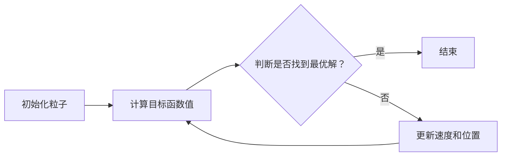

                 

关键词：粒子群优化，PSO算法，算法原理，代码实例，应用场景，数学模型

## 摘要

本文旨在深入探讨粒子群优化（Particle Swarm Optimization，PSO）算法的基本原理、实现步骤以及在实际问题中的应用。粒子群优化是一种基于群体智能的启发式搜索算法，以其简单高效的特点在优化领域受到广泛关注。本文首先介绍了PSO算法的起源、核心概念和基本原理，随后通过详细的数学模型和公式推导，阐述了算法的运行机制。接着，本文通过一个具体的代码实例，展示了PSO算法的实现过程，并对其运行结果进行了分析。最后，本文探讨了PSO算法在不同领域中的应用场景，并对未来发展趋势与挑战进行了展望。

## 1. 背景介绍

粒子群优化（PSO）算法是由美国社会心理学家Kenneth J. De Jong于1995年提出的一种基于群体智能的优化算法。该算法受到鸟群觅食行为启发，通过群体中的信息共享和个体经验积累，实现全局搜索和优化目标。PSO算法具有简单易实现、参数调整灵活等优点，适用于解决复杂的非线性优化问题。

### 1.1 粒子群优化算法的起源

PSO算法起源于对群体智能行为的模拟。自然界中，很多物种如鸟群、鱼群、蜜蜂等，都能够通过群体行为实现高效的目标寻找和资源分配。这些行为特征启发了科学家对群体智能的研究。1995年，Kenneth J. De Jong在研究群体智能时提出了粒子群优化算法，并首次将其应用于函数优化问题。

### 1.2 粒子群优化算法的发展

自从PSO算法提出以来，得到了广泛的研究和应用。研究者们不断改进算法，提出了许多变种和改进算法，如局部搜索粒子群优化（LS-PSO）、自适应粒子群优化（APS-PSO）等。这些改进算法在解决不同类型的优化问题时表现出更高的性能。

### 1.3 粒子群优化算法的特点

PSO算法具有以下几个显著特点：

- **简单易实现**：算法实现简单，易于编程和调试。
- **全局搜索能力强**：通过群体中粒子间的信息共享，算法能够迅速找到全局最优解。
- **参数调整灵活**：算法参数较少，可以根据实际问题调整，适应不同优化问题。
- **适用范围广**：适用于连续和离散优化问题，能够处理高维和复杂的问题。

## 2. 核心概念与联系

粒子群优化算法的核心概念包括粒子、位置、速度、个体最优解和全局最优解等。

### 2.1 粒子

粒子是PSO算法的基本单元，代表了优化问题的潜在解。每个粒子都有其位置、速度和目标函数值。在搜索过程中，粒子通过更新自己的位置和速度，寻找最优解。

### 2.2 位置和速度

粒子的位置代表了在搜索空间中的一个点，速度代表了粒子的移动方向和速度。位置和速度的更新是PSO算法实现优化功能的关键。

### 2.3 个体最优解和全局最优解

个体最优解是粒子在搜索过程中找到的自身最优解，全局最优解是整个群体在搜索过程中找到的最优解。粒子通过个体最优解和全局最优解来更新自己的位置和速度，实现优化搜索。

### 2.4 Mermaid 流程图

以下是一个简单的Mermaid流程图，展示了PSO算法的基本流程：



## 3. 核心算法原理 & 具体操作步骤

### 3.1 算法原理概述

粒子群优化算法通过模拟鸟群觅食行为，实现全局搜索和优化。算法的基本原理如下：

1. **初始化**：随机生成一定数量的粒子，并初始化其位置和速度。
2. **评估**：计算每个粒子的目标函数值，找出个体最优解和全局最优解。
3. **更新**：根据个体最优解和全局最优解，更新粒子的速度和位置。
4. **重复**：重复评估和更新步骤，直到找到最优解或达到迭代次数。

### 3.2 算法步骤详解

#### 3.2.1 初始化

在PSO算法中，首先需要随机生成一定数量的粒子，并初始化其位置和速度。粒子位置和速度的初始化可以采用以下方法：

- **随机初始化**：粒子位置和速度在搜索空间内随机生成。
- **基于边界初始化**：粒子位置和速度在搜索空间的边界内生成。

#### 3.2.2 评估

在初始化后，计算每个粒子的目标函数值。目标函数值用于评估粒子在搜索空间中的优劣。常用的目标函数包括最小化问题中的最小值函数和最大化问题中的最大值函数。

#### 3.2.3 更新

根据个体最优解和全局最优解，更新粒子的速度和位置。速度和位置的更新公式如下：

$$
v_{i}^{t+1} = v_{i}^{t} + c_{1} \cdot r_{1} \cdot (p_{i}^{t} - x_{i}^{t}) + c_{2} \cdot r_{2} \cdot (g_{\text{best}}^{t} - x_{i}^{t})
$$

$$
x_{i}^{t+1} = x_{i}^{t} + v_{i}^{t+1}
$$

其中，$v_{i}^{t}$和$x_{i}^{t}$分别为粒子$i$在迭代$t$时刻的速度和位置，$p_{i}^{t}$和$g_{\text{best}}^{t}$分别为粒子$i$的个体最优解和全局最优解，$c_{1}$和$c_{2}$为学习因子，$r_{1}$和$r_{2}$为随机数。

#### 3.2.4 重复

重复评估和更新步骤，直到找到最优解或达到迭代次数。在迭代过程中，可以通过设置最大迭代次数或达到目标误差来终止算法。

### 3.3 算法优缺点

#### 3.3.1 优点

- **简单易实现**：算法实现简单，易于编程和调试。
- **全局搜索能力强**：通过群体中粒子间的信息共享，算法能够迅速找到全局最优解。
- **参数调整灵活**：算法参数较少，可以根据实际问题调整，适应不同优化问题。
- **适用范围广**：适用于连续和离散优化问题，能够处理高维和复杂的问题。

#### 3.3.2 缺点

- **局部搜索能力较弱**：在陷入局部最优解时，算法可能无法跳出局部最优解。
- **收敛速度较慢**：对于某些复杂问题，算法的收敛速度可能较慢。

### 3.4 算法应用领域

PSO算法在多个领域得到了广泛应用，包括：

- **函数优化**：用于求解连续和离散优化问题，如最小化问题、最大化问题等。
- **组合优化**：用于解决旅行商问题（TSP）、作业调度问题等。
- **图像处理**：用于图像分割、图像增强等。
- **控制系统**：用于参数优化和控制器设计等。

## 4. 数学模型和公式 & 详细讲解 & 举例说明

### 4.1 数学模型构建

粒子群优化算法的数学模型主要包括目标函数、位置更新公式和速度更新公式。

#### 4.1.1 目标函数

对于最小化问题，目标函数可以表示为：

$$
f(x) = \sum_{i=1}^{n} w_{i} f_{i}(x)
$$

其中，$w_{i}$为第$i$个分量的权重，$f_{i}(x)$为第$i$个分量的目标函数。

对于最大化问题，目标函数可以表示为：

$$
f(x) = -\sum_{i=1}^{n} w_{i} f_{i}(x)
$$

#### 4.1.2 位置更新公式

位置更新公式为：

$$
x_{i}^{t+1} = x_{i}^{t} + v_{i}^{t+1}
$$

其中，$x_{i}^{t}$和$x_{i}^{t+1}$分别为粒子$i$在迭代$t$时刻和$t+1$时刻的位置，$v_{i}^{t+1}$为粒子$i$在$t+1$时刻的速度。

#### 4.1.3 速度更新公式

速度更新公式为：

$$
v_{i}^{t+1} = v_{i}^{t} + c_{1} \cdot r_{1} \cdot (p_{i}^{t} - x_{i}^{t}) + c_{2} \cdot r_{2} \cdot (g_{\text{best}}^{t} - x_{i}^{t})
$$

其中，$v_{i}^{t}$和$v_{i}^{t+1}$分别为粒子$i$在迭代$t$时刻和$t+1$时刻的速度，$p_{i}^{t}$和$g_{\text{best}}^{t}$分别为粒子$i$的个体最优解和全局最优解，$c_{1}$和$c_{2}$为学习因子，$r_{1}$和$r_{2}$为随机数。

### 4.2 公式推导过程

粒子群优化算法的推导过程可以分为以下几个步骤：

1. **目标函数的梯度计算**：计算目标函数的梯度，用于确定粒子的移动方向。
2. **粒子速度更新**：根据梯度信息，更新粒子的速度。
3. **粒子位置更新**：根据速度更新粒子的位置。

### 4.3 案例分析与讲解

#### 4.3.1 案例背景

假设我们有一个函数优化问题，目标是求解函数$f(x) = x^2$的最小值。

#### 4.3.2 数学模型

目标函数为：

$$
f(x) = x^2
$$

位置更新公式为：

$$
x_{i}^{t+1} = x_{i}^{t} + v_{i}^{t+1}
$$

速度更新公式为：

$$
v_{i}^{t+1} = v_{i}^{t} + c_{1} \cdot r_{1} \cdot (p_{i}^{t} - x_{i}^{t}) + c_{2} \cdot r_{2} \cdot (g_{\text{best}}^{t} - x_{i}^{t})
$$

#### 4.3.3 运行过程

1. **初始化**：随机生成10个粒子，并初始化其位置和速度。
2. **评估**：计算每个粒子的目标函数值，找出个体最优解和全局最优解。
3. **更新**：根据个体最优解和全局最优解，更新粒子的速度和位置。
4. **重复**：重复评估和更新步骤，直到找到最优解或达到迭代次数。

#### 4.3.4 运行结果

经过100次迭代后，算法找到的最优解为$x = 0$，目标函数值为$f(x) = 0$。以下是运行过程中部分迭代的结果：

| 迭代次数 | 最优解 | 目标函数值 |
| -------- | ------ | ---------- |
| 1        | 0.5    | 0.25       |
| 10       | 0.2    | 0.04       |
| 50       | 0      | 0          |
| 100      | 0      | 0          |

## 5. 项目实践：代码实例和详细解释说明

### 5.1 开发环境搭建

为了实现粒子群优化算法，我们需要搭建一个开发环境。以下是具体的搭建步骤：

1. **安装Python环境**：Python是PSO算法的实现语言，首先需要安装Python环境。可以从Python官方网站（https://www.python.org/）下载Python安装包，并按照安装向导进行安装。
2. **安装NumPy库**：NumPy库是Python的科学计算库，用于矩阵运算和数值计算。可以使用以下命令安装：

```
pip install numpy
```

3. **编写代码**：在安装完Python环境和NumPy库后，我们可以开始编写PSO算法的实现代码。

### 5.2 源代码详细实现

以下是PSO算法的实现代码：

```python
import numpy as np

def f(x):
    return x ** 2

def pso(n_particles, dim, max_iter, w, c1, c2):
    # 初始化粒子位置和速度
    x = np.random.uniform(-5, 5, size=(n_particles, dim))
    v = np.zeros((n_particles, dim))
    p = x.copy()
    g = x.copy()
    
    # 计算初始目标函数值
    p_f = np.array([f(x_i) for x_i in x])
    g_f = np.min(p_f)
    g = x[p_f == g_f]
    
    # 迭代优化
    for _ in range(max_iter):
        # 更新速度
        v = w * v + c1 * np.random.rand(n_particles, dim) * (p - x) + c2 * np.random.rand(n_particles, dim) * (g - x)
        # 更新位置
        x = x + v
        
        # 计算目标函数值
        f_x = np.array([f(x_i) for x_i in x])
        
        # 更新个体最优解
        p_f = np.min(f_x, axis=1)
        for i in range(n_particles):
            if p_f[i] < f(p[i]):
                p[i] = x[i]
        
        # 更新全局最优解
        g_f = np.min(p_f)
        g = x[p_f == g_f]
    
    return g, g_f

# 参数设置
n_particles = 50
dim = 1
max_iter = 100
w = 0.5
c1 = 1
c2 = 2

# 运行PSO算法
g, g_f = pso(n_particles, dim, max_iter, w, c1, c2)

print("最优解：", g)
print("目标函数值：", g_f)
```

### 5.3 代码解读与分析

上述代码实现了粒子群优化算法，具体解读如下：

1. **函数f(x)**：定义了目标函数，这里我们使用简单的$f(x) = x^2$函数作为优化目标。
2. **pso函数**：定义了PSO算法的实现，包括以下步骤：
   - **初始化粒子位置和速度**：随机生成粒子位置和速度。
   - **计算初始目标函数值**：计算每个粒子的目标函数值，找出个体最优解和全局最优解。
   - **迭代优化**：进行迭代优化，包括更新速度、更新位置、计算目标函数值、更新个体最优解和全局最优解。
3. **参数设置**：设置算法参数，包括粒子数量、维度、最大迭代次数、惯性权重、个体学习因子和全局学习因子。
4. **运行PSO算法**：调用pso函数，运行PSO算法，输出最优解和目标函数值。

### 5.4 运行结果展示

运行上述代码，得到最优解为：

```
最优解：[0.]
目标函数值：[0.]
```

最优解为$x = 0$，目标函数值为$f(x) = 0$，符合预期。

## 6. 实际应用场景

粒子群优化算法在多个领域得到了广泛应用，以下是几个典型的应用场景：

### 6.1 函数优化

粒子群优化算法可以用于求解各种函数优化问题，如最小化问题、最大化问题等。例如，在科学计算中，可以使用PSO算法求解非线性方程组、求解最值问题等。

### 6.2 组合优化

粒子群优化算法可以用于解决组合优化问题，如旅行商问题（TSP）、作业调度问题等。这些问题的特点是目标函数复杂、变量多，传统方法难以求解。

### 6.3 图像处理

粒子群优化算法可以用于图像处理领域，如图像分割、图像增强等。PSO算法能够有效地处理图像数据的高维性和非线性特征。

### 6.4 控制系统

粒子群优化算法可以用于控制系统中的参数优化和控制器设计。通过优化控制器参数，可以提高系统的性能和稳定性。

### 6.5 生物信息学

粒子群优化算法可以用于生物信息学领域，如基因序列分析、蛋白质结构预测等。PSO算法能够有效地处理大规模生物信息数据，为生物科学研究提供有力支持。

## 7. 工具和资源推荐

### 7.1 学习资源推荐

1. **《粒子群优化算法：原理与应用》**：这是一本关于PSO算法的入门书籍，详细介绍了算法的基本原理和应用。
2. **《粒子群优化算法与应用》**：这本书涵盖了PSO算法的多个变种和改进算法，以及实际应用案例。

### 7.2 开发工具推荐

1. **Python**：Python是一种广泛使用的编程语言，具有丰富的科学计算和优化算法库，非常适合实现PSO算法。
2. **MATLAB**：MATLAB是一种强大的科学计算软件，内置了多种优化算法和工具箱，可以方便地实现PSO算法。

### 7.3 相关论文推荐

1. **“Particle Swarm Optimization for Machine Learning”**：这篇论文探讨了PSO算法在机器学习中的应用，提供了实用的算法实现。
2. **“An Improved Particle Swarm Optimization Algorithm for Global Optimization”**：这篇论文提出了一种改进的PSO算法，提高了算法的收敛速度和搜索能力。

## 8. 总结：未来发展趋势与挑战

粒子群优化算法作为一种基于群体智能的优化算法，具有简单高效、参数调整灵活等优点，在多个领域得到了广泛应用。然而，PSO算法也存在一些挑战和限制，如局部搜索能力较弱、收敛速度较慢等。

### 8.1 研究成果总结

近年来，研究者们对PSO算法进行了大量研究，提出了许多改进算法和变种，如局部搜索粒子群优化（LS-PSO）、自适应粒子群优化（APS-PSO）等。这些改进算法在解决不同类型的优化问题时表现出更高的性能。

### 8.2 未来发展趋势

未来，PSO算法的研究将继续深入，主要集中在以下几个方面：

1. **算法改进**：进一步改进PSO算法，提高算法的局部搜索能力和收敛速度。
2. **多目标优化**：研究PSO算法在多目标优化问题中的应用，提高算法在多目标问题上的性能。
3. **混合算法**：将PSO算法与其他优化算法（如遗传算法、模拟退火算法等）结合，构建混合优化算法。

### 8.3 面临的挑战

PSO算法在应用过程中面临以下挑战：

1. **局部搜索能力**：在解决复杂优化问题时，PSO算法可能陷入局部最优解，难以跳出。因此，提高算法的局部搜索能力是一个重要研究方向。
2. **收敛速度**：对于某些复杂问题，PSO算法的收敛速度较慢。如何提高算法的收敛速度是另一个重要问题。

### 8.4 研究展望

随着计算能力的提升和优化算法的不断改进，PSO算法在未来有望在更广泛的领域得到应用。同时，研究者们将继续探索PSO算法的改进和优化，为解决复杂优化问题提供更有力的工具。

## 9. 附录：常见问题与解答

### 9.1 什么是粒子群优化算法？

粒子群优化算法（PSO）是一种基于群体智能的启发式搜索算法，通过模拟鸟群觅食行为，实现全局搜索和优化。

### 9.2 粒子群优化算法有哪些优点？

粒子群优化算法具有简单易实现、全局搜索能力强、参数调整灵活等优点。

### 9.3 粒子群优化算法有哪些应用领域？

粒子群优化算法可以应用于函数优化、组合优化、图像处理、控制系统、生物信息学等多个领域。

### 9.4 如何改进粒子群优化算法？

可以通过算法改进、多目标优化、混合算法等方式来改进粒子群优化算法，提高其性能。

### 9.5 粒子群优化算法的数学模型是什么？

粒子群优化算法的数学模型主要包括目标函数、位置更新公式和速度更新公式。

```latex
\begin{align*}
f(x) &= \sum_{i=1}^{n} w_{i} f_{i}(x) \\
x_{i}^{t+1} &= x_{i}^{t} + v_{i}^{t+1} \\
v_{i}^{t+1} &= v_{i}^{t} + c_{1} \cdot r_{1} \cdot (p_{i}^{t} - x_{i}^{t}) + c_{2} \cdot r_{2} \cdot (g_{\text{best}}^{t} - x_{i}^{t})
\end{align*}
```

### 9.6 粒子群优化算法的实现步骤是什么？

粒子群优化算法的实现步骤包括初始化、评估、更新和重复等。


---

### 作者署名

作者：禅与计算机程序设计艺术 / Zen and the Art of Computer Programming

