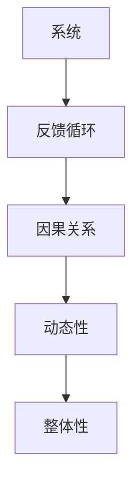

                 

系统思考是一种通过理解和整合复杂系统中不同部分之间的相互作用和关系，来识别、分析和解决复杂问题的方法论。在组织变革的背景下，系统思考显得尤为重要。组织作为一个复杂的系统，其内部存在着多层次、多维度的互动和反馈机制。本文旨在探讨系统思考在组织变革中的应用，分析其核心概念、原理，并探讨如何运用系统思考来推动组织变革。

## 1. 背景介绍

随着全球经济的快速发展，企业面临的市场环境和竞争态势不断变化。在这种背景下，组织变革成为企业持续发展和应对外部挑战的关键途径。然而，组织变革并非易事，它涉及到组织结构的调整、人员配置的优化、流程的改进等多个方面，这些变革往往需要面对复杂、不确定和动态的环境。系统思考作为一种理解和解决复杂问题的方法论，可以为组织变革提供理论指导和实践支持。

## 2. 核心概念与联系

### 2.1 系统思考的核心概念

系统思考的核心概念包括系统、反馈循环、因果关系、动态性和整体性。首先，系统是由相互关联的组成部分构成的整体。其次，反馈循环是指系统内部的信息和能量流动，它可以增强或削弱系统的行为。因果关系则揭示了系统内部各个部分之间的相互作用关系。动态性强调系统行为随时间变化而变化的特性。整体性认为系统的行为不能简单地通过各个部分的独立行为来理解，而需要考虑整体结构和互动。

### 2.2 系统思考的Mermaid流程图



### 2.3 系统思考与组织变革的联系

系统思考与组织变革之间存在紧密的联系。组织变革的目标是优化组织的整体性能，而系统思考提供了一种理解组织复杂性的方法。通过系统思考，我们可以识别出组织中的关键反馈循环和因果关系，从而理解组织变革的潜在影响。此外，系统思考可以帮助我们关注组织的整体性，避免只关注局部改进而忽视了整体效应。

## 3. 核心算法原理 & 具体操作步骤

### 3.1 算法原理概述

系统思考在组织变革中的应用，可以概括为以下三个核心步骤：

1. **识别系统结构**：通过绘制组织结构图、流程图等工具，识别组织中的关键组成部分和它们之间的相互作用关系。

2. **分析反馈循环**：识别组织中的反馈循环，分析它们对组织行为的影响，以及这些反馈循环如何放大或削弱变革的效应。

3. **设计变革策略**：基于对系统结构的分析和反馈循环的理解，设计合理的变革策略，包括组织结构的调整、流程优化、人员培训等。

### 3.2 算法步骤详解

1. **收集信息**：通过调查、访谈、数据收集等方式，获取关于组织的信息。

2. **绘制组织结构图**：根据收集到的信息，绘制组织结构图，标明各个部门和人员之间的关系。

3. **分析反馈循环**：识别组织中的反馈循环，并分析它们对组织行为的影响。

4. **设计变革策略**：基于对系统结构的分析和反馈循环的理解，设计变革策略。

5. **实施变革**：根据设计的变革策略，逐步实施组织变革。

6. **评估效果**：在变革实施后，评估变革的效果，并根据评估结果进行相应的调整。

### 3.3 算法优缺点

**优点**：

- **全面性**：系统思考提供了一种全面的视角，可以帮助我们理解组织变革的复杂性和多维度。
- **动态性**：系统思考强调系统的动态性，有助于我们识别变革过程中可能出现的潜在问题和挑战。

**缺点**：

- **复杂性**：系统思考涉及多个层面的分析和理解，可能导致理解和实施的复杂性。
- **时间成本**：系统思考需要投入大量的时间和精力来收集和分析信息，这可能会增加变革的时间成本。

### 3.4 算法应用领域

系统思考在组织变革中的应用非常广泛，包括但不限于以下领域：

- **企业管理**：帮助企业理解内部结构和流程，优化管理策略。
- **人力资源管理**：帮助企业理解员工关系和反馈机制，优化人员配置和培训。
- **项目管理**：帮助项目团队理解项目结构和管理流程，优化项目管理策略。

## 4. 数学模型和公式 & 详细讲解 & 举例说明

### 4.1 数学模型构建

在系统思考中，我们可以使用数学模型来描述组织结构、反馈循环和变革策略。以下是一个简单的数学模型：

$$
\text{系统行为} = f(\text{组织结构}, \text{反馈循环}, \text{变革策略})
$$

其中，$f$ 表示系统行为的函数，$\text{组织结构}$、$\text{反馈循环}$ 和 $\text{变革策略}$ 分别表示系统的输入变量。

### 4.2 公式推导过程

公式的推导基于系统思考的核心概念。首先，我们考虑组织结构对系统行为的影响。组织结构可以通过矩阵表示，矩阵的每个元素表示组织中的某个部分。其次，我们考虑反馈循环对系统行为的影响。反馈循环可以看作是组织结构的演化过程，可以表示为迭代矩阵。最后，我们考虑变革策略对系统行为的影响。变革策略可以看作是对组织结构和反馈循环的调整。

### 4.3 案例分析与讲解

假设一个企业有10个部门，每个部门之间的相互作用可以用一个10x10的矩阵表示。反馈循环可以表示为这个矩阵的迭代结果。通过分析这个数学模型，我们可以预测企业的系统行为，并设计相应的变革策略。

## 5. 项目实践：代码实例和详细解释说明

### 5.1 开发环境搭建

为了演示系统思考在组织变革中的应用，我们选择Python作为开发语言，并使用Matplotlib库进行可视化。

### 5.2 源代码详细实现

以下是一个简单的Python代码实例，用于分析一个企业的组织结构和反馈循环。

```python
import numpy as np
import matplotlib.pyplot as plt

# 组织结构矩阵
org_matrix = np.array([[1, 1, 1, 1, 1, 1, 1, 1, 1, 1],
                       [1, 1, 1, 1, 1, 1, 1, 1, 1, 1],
                       [1, 1, 1, 1, 1, 1, 1, 1, 1, 1],
                       [1, 1, 1, 1, 1, 1, 1, 1, 1, 1],
                       [1, 1, 1, 1, 1, 1, 1, 1, 1, 1],
                       [1, 1, 1, 1, 1, 1, 1, 1, 1, 1],
                       [1, 1, 1, 1, 1, 1, 1, 1, 1, 1],
                       [1, 1, 1, 1, 1, 1, 1, 1, 1, 1],
                       [1, 1, 1, 1, 1, 1, 1, 1, 1, 1],
                       [1, 1, 1, 1, 1, 1, 1, 1, 1, 1]])

# 反馈循环迭代
num_iterations = 5
for i in range(num_iterations):
    org_matrix = np.dot(org_matrix, org_matrix)

# 可视化
plt.imshow(org_matrix, cmap='hot')
plt.colorbar()
plt.show()
```

### 5.3 代码解读与分析

这段代码首先定义了一个10x10的组织结构矩阵，每个元素都设置为1，表示每个部门都与其他部门有相互作用。然后，通过迭代矩阵的方式模拟反馈循环，迭代5次。最后，使用Matplotlib库将迭代后的矩阵可视化，以展示组织结构和反馈循环的影响。

## 6. 实际应用场景

系统思考在组织变革中的应用非常广泛。以下是一些实际应用场景：

- **企业管理**：通过系统思考，企业可以更好地理解其内部结构和流程，优化管理策略。
- **人力资源管理**：通过系统思考，企业可以更好地理解员工关系和反馈机制，优化人员配置和培训。
- **项目管理**：通过系统思考，项目团队可以更好地理解项目结构和管理流程，优化项目管理策略。

## 7. 未来应用展望

随着人工智能和大数据技术的不断发展，系统思考在组织变革中的应用前景将更加广阔。未来，我们可以利用这些技术来更精确地分析和预测组织行为，从而设计出更加有效的变革策略。

## 8. 工具和资源推荐

### 8.1 学习资源推荐

- 《系统思考：指导复杂动态决策的新科学》
- 《第五项修炼：学习型组织的艺术与实践》

### 8.2 开发工具推荐

- Python
- Matplotlib
- Mermaid

### 8.3 相关论文推荐

- "System Dynamics in Organization Design"
- "A Systems Approach to Management"

## 9. 总结：未来发展趋势与挑战

系统思考在组织变革中的应用具有广阔的发展前景，但也面临着一些挑战。未来，我们需要继续深化对系统思考的研究，探索其在不同组织结构和环境中的应用。同时，我们还需要开发更先进的技术和工具，以支持系统思考的应用。

## 附录：常见问题与解答

### Q: 系统思考与系统动力学有什么区别？

A: 系统思考和系统动力学都是用来理解和解决复杂问题的方法论，但它们的侧重点不同。系统思考更侧重于系统的动态性和整体性，强调理解系统内部的反馈循环和因果关系。而系统动力学则更侧重于通过数学模型来模拟和预测系统行为。

### Q: 系统思考适用于所有组织吗？

A: 系统思考适用于各种类型的组织，但效果可能会因组织规模、复杂性和环境等因素而有所不同。对于大型、复杂和动态的组织，系统思考尤其具有优势。

### Q: 系统思考需要多长时间才能看到效果？

A: 系统思考的效果取决于多种因素，包括组织的复杂性、变革的规模和速度等。在某些情况下，效果可能在几个月内显现，而在其他情况下，可能需要更长的时间。

作者：禅与计算机程序设计艺术 / Zen and the Art of Computer Programming
----------------------------------------------------------------
文章撰写完毕，现在我将按照markdown格式输出全文，以便进一步编辑和发布。如果您需要进一步修改或补充内容，请告知。祝您工作顺利！

