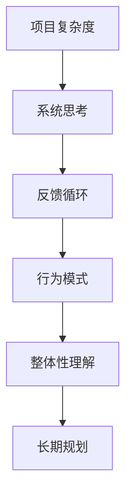

                 

系统思考是一种应对复杂性和不确定性的思考方法，它强调从整体和长远的角度来理解和解决问题。在信息技术领域，管理复杂项目的过程中，系统思考尤为重要。本文将探讨系统思考在管理复杂项目中的重要性，并分析其在实际应用中的挑战和机遇。

## 1. 背景介绍

在当今快速变化的技术环境中，软件开发项目越来越复杂。从传统的单体应用，到现在的微服务架构，再到云计算、大数据和人工智能的广泛应用，项目的复杂性不断增加。这种复杂性不仅体现在技术层面，还涉及到项目管理、团队协作、需求变更等多个方面。面对这些挑战，传统的项目管理方法往往显得力不从心。

### 1.1 传统项目管理方法的局限性

传统的项目管理方法，如瀑布模型和敏捷开发，虽然在某些情况下能够有效地管理项目，但它们往往忽略了项目的整体性和长期性。瀑布模型强调线性、顺序的过程，而敏捷开发则注重迭代和灵活性。然而，当项目面临复杂性和不确定性时，这些方法往往无法提供有效的解决方案。

### 1.2 系统思考的概念

系统思考（System Thinking）起源于系统动力学，它是一种基于系统的整体性和动态性的思考方法。系统思考强调从整体和长远的角度来理解和解决问题，认为任何问题都是系统内部各部分相互作用的结果。系统思考的核心在于识别系统中的反馈循环、理解系统的行为模式，并寻找改变系统行为的方法。

## 2. 核心概念与联系

为了更好地理解系统思考在管理复杂项目中的重要性，我们需要先了解一些核心概念和它们之间的联系。以下是一个简化的 Mermaid 流程图，展示了这些核心概念：



### 2.1 项目复杂度

项目复杂度是项目面临的复杂性的量化指标。它包括技术复杂性、业务复杂性、团队协作复杂性等多个方面。项目复杂度越高，管理的难度就越大。

### 2.2 系统思考

系统思考是一种应对复杂性的思考方法。它强调从整体和长远的角度来理解和解决问题，通过识别系统中的反馈循环、理解系统的行为模式，来寻找改变系统行为的方法。

### 2.3 反馈循环

反馈循环是系统思考的核心概念之一。它描述了系统内部各部分之间的相互作用和反馈。反馈循环可以是正反馈，也可以是负反馈。正反馈会加剧系统的问题，而负反馈则有助于系统的稳定和优化。

### 2.4 行为模式

行为模式是系统在特定条件下表现出来的规律性行为。通过识别行为模式，我们可以更好地理解系统的运行机制，从而提出有效的解决方案。

### 2.5 整体性理解

整体性理解强调从整体的角度来理解系统。在管理复杂项目时，我们不能仅仅关注项目的某个部分，而应该关注整个系统的运行和变化。

### 2.6 长期规划

长期规划是系统思考的一个重要方面。在复杂项目中，我们需要考虑项目的长期影响和潜在风险，以制定更有效的策略和计划。

## 3. 核心算法原理 & 具体操作步骤

### 3.1 算法原理概述

系统思考的核心算法可以看作是一种基于反馈循环的优化算法。它的基本原理是通过识别系统中的反馈循环，调整系统的参数，以优化系统的行为。具体操作步骤如下：

### 3.2 算法步骤详解

#### 3.2.1 识别反馈循环

首先，我们需要识别系统中的反馈循环。这可以通过数据分析和模型构建来实现。通过识别反馈循环，我们可以理解系统的行为模式，并找到可能的问题源。

#### 3.2.2 分析反馈循环的影响

接下来，我们需要分析每个反馈循环的影响。这包括判断反馈循环是正反馈还是负反馈，以及它对系统行为的影响程度。

#### 3.2.3 调整系统参数

根据分析结果，我们需要调整系统的参数，以优化系统的行为。这可能包括改变系统的结构、调整系统的运行规则等。

#### 3.2.4 持续监控和调整

最后，我们需要持续监控系统的行为，并根据监控结果进行调整。这可以确保系统在长期内保持稳定和优化。

### 3.3 算法优缺点

系统思考的核心算法具有以下优点：

- **全面性**：它能够从整体和长远的角度来理解和解决问题，而不仅仅是关注某个局部。
- **动态性**：它能够适应系统的变化，并实时调整系统的参数。
- **优化性**：通过优化系统的行为，可以提高系统的效率和性能。

然而，系统思考的核心算法也存在一些缺点：

- **复杂性**：系统思考涉及到多个方面，包括技术、业务、团队协作等，这使得它的应用难度较大。
- **成本**：系统思考需要大量的数据分析和模型构建，这可能导致较高的成本。

### 3.4 算法应用领域

系统思考的核心算法可以应用于多个领域，包括：

- **项目管理**：通过系统思考，可以更好地理解项目的复杂性，并制定更有效的管理策略。
- **产品开发**：通过系统思考，可以优化产品开发的流程，提高产品的质量和性能。
- **组织管理**：通过系统思考，可以优化组织的结构，提高组织的效率和协同性。

## 4. 数学模型和公式 & 详细讲解 & 举例说明

### 4.1 数学模型构建

在系统思考中，数学模型是理解和分析系统行为的重要工具。以下是一个简化的数学模型，用于分析一个复杂项目的稳定性。

#### 4.1.1 系统状态变量

假设一个复杂项目由三个状态变量 \(x_1, x_2, x_3\) 描述，其中每个状态变量代表项目的某个关键方面。

#### 4.1.2 状态转移方程

状态转移方程描述了系统状态变量随时间的变化。一个简单的线性模型可以表示为：

\[ x_i(t+1) = x_i(t) + f_i(x_1(t), x_2(t), x_3(t)), \quad i = 1, 2, 3 \]

其中，\(f_i\) 是关于其他状态变量的函数，表示了状态变量 \(x_i\) 对其他状态变量的依赖关系。

### 4.2 公式推导过程

为了推导状态转移方程，我们需要分析系统中的反馈循环。假设存在一个正反馈循环，它使得某个状态变量 \(x_1\) 的变化会进一步加剧。这可以表示为：

\[ f_1(x_1, x_2, x_3) = k_1 \cdot (x_1 - x_{1,0}) \]

其中，\(k_1\) 是正反馈系数，\(x_{1,0}\) 是初始状态变量 \(x_1\) 的值。

### 4.3 案例分析与讲解

以下是一个简单的案例，用于说明如何使用数学模型来分析复杂项目的稳定性。

#### 4.3.1 案例描述

假设一个复杂项目由三个关键状态变量 \(x_1, x_2, x_3\) 描述，它们分别代表项目的进度、资源和风险。项目的初始状态为 \(x_1(0) = 0\), \(x_2(0) = 100\), \(x_3(0) = 0\)。

#### 4.3.2 状态转移方程

根据前面的推导，我们可以得到以下状态转移方程：

\[ x_1(t+1) = x_1(t) + k_1 \cdot (x_1(t) - x_{1,0}) \]
\[ x_2(t+1) = x_2(t) - k_2 \cdot (x_2(t) - x_{2,0}) \]
\[ x_3(t+1) = x_3(t) + k_3 \cdot (x_3(t) - x_{3,0}) \]

其中，\(k_2\) 和 \(k_3\) 分别是关于 \(x_2\) 和 \(x_3\) 的正反馈系数。

#### 4.3.3 稳定性分析

为了分析项目的稳定性，我们需要检查状态转移方程是否稳定。一个简单的判据是检查状态转移方程的线性部分是否稳定。

\[ x_1(t+1) - x_1(t) = k_1 \cdot (x_1(t) - x_{1,0}) \]

如果 \(k_1 > 0\)，那么状态转移方程是不稳定的，这意味着项目可能会在某个时间点出现不可控的剧烈变化。

## 5. 项目实践：代码实例和详细解释说明

### 5.1 开发环境搭建

在本案例中，我们使用 Python 作为编程语言，因为它具有强大的数学计算能力和丰富的库支持。以下是如何搭建 Python 开发环境的步骤：

1. 安装 Python：从 [Python 官网](https://www.python.org/) 下载并安装 Python 3.8 或更高版本。
2. 安装必要的库：使用 pip 工具安装 NumPy 和 Matplotlib 库。

```shell
pip install numpy matplotlib
```

### 5.2 源代码详细实现

以下是一个简单的 Python 脚本，用于模拟复杂项目的状态转移和稳定性分析。

```python
import numpy as np
import matplotlib.pyplot as plt

# 参数设置
k1 = 1.5
k2 = 0.5
k3 = 0.3
x1_0 = 0
x2_0 = 100
x3_0 = 0

# 状态转移方程
def state_transition(x1, x2, x3):
    x1_new = x1 + k1 * (x1 - x1_0)
    x2_new = x2 - k2 * (x2 - x2_0)
    x3_new = x3 + k3 * (x3 - x3_0)
    return x1_new, x2_new, x3_new

# 模拟项目状态变化
def simulate(x1_0, x2_0, x3_0, steps=100):
    x1, x2, x3 = x1_0, x2_0, x3_0
    states = [(x1, x2, x3)]
    for _ in range(steps):
        x1, x2, x3 = state_transition(x1, x2, x3)
        states.append((x1, x2, x3))
    return states

# 稳定性分析
def stability_analysis(states):
    x1s, x2s, x3s = zip(*states)
    plt.plot(x1s, x2s, label='x1 vs x2')
    plt.plot(x1s, x3s, label='x1 vs x3')
    plt.xlabel('x1')
    plt.ylabel('x2/x3')
    plt.legend()
    plt.show()

# 运行模拟
states = simulate(x1_0, x2_0, x3_0)
stability_analysis(states)
```

### 5.3 代码解读与分析

该代码首先设置了项目的参数，包括正反馈系数 \(k_1, k_2, k_3\) 以及初始状态变量 \(x_1_0, x_2_0, x_3_0\)。

接着，定义了状态转移方程 `state_transition`，它根据当前状态变量计算下一状态变量。

`simulate` 函数使用状态转移方程模拟项目状态的变化，并记录每个时间步的状态。

`stability_analysis` 函数使用 Matplotlib 绘制状态变量之间的关系图，以分析项目的稳定性。

最后，运行模拟并展示结果。

### 5.4 运行结果展示

运行上述代码后，会生成两个图形：

1. \(x_1\) 对 \(x_2\) 的关系图
2. \(x_1\) 对 \(x_3\) 的关系图

通过观察这些图形，我们可以分析项目的稳定性。如果状态变量之间的关系呈现出明显的非线性增长或减少，这可能意味着项目存在不稳定的因素。

## 6. 实际应用场景

系统思考在多个实际应用场景中展现出了其重要性。以下是一些典型的应用场景：

### 6.1 软件开发项目

在软件开发项目中，系统思考可以帮助团队更好地理解项目的复杂性，识别潜在的反馈循环，并制定更有效的管理策略。通过系统思考，团队可以更早地识别并解决潜在的问题，从而提高项目的成功率。

### 6.2 业务流程优化

在业务流程优化中，系统思考可以帮助企业识别关键的业务流程，分析其中的反馈循环，并提出优化方案。通过系统思考，企业可以更有效地提高业务效率和降低成本。

### 6.3 组织管理

在组织管理中，系统思考可以帮助企业识别组织内部的反馈循环，优化组织结构，提高组织的协同性。通过系统思考，企业可以更好地应对外部环境的变化，保持组织的稳定和持续发展。

## 7. 未来应用展望

随着信息技术的不断进步，系统思考在管理复杂项目中的应用前景将更加广阔。以下是一些未来应用展望：

### 7.1 自动化与智能化

随着人工智能技术的发展，系统思考的方法可以与自动化和智能化技术相结合，实现更高效的系统优化和管理。

### 7.2 大数据与云计算

大数据和云计算的广泛应用为系统思考提供了更多的数据支持和计算能力，使其在处理复杂项目时更具优势。

### 7.3 社会治理

系统思考不仅适用于企业内部的项目管理，还可以应用于社会治理领域。通过系统思考，政府可以更好地应对社会问题，提高社会治理的效率和效果。

## 8. 工具和资源推荐

### 8.1 学习资源推荐

- [系统动力学教程](https://www.systemdynamics.org/)
- [系统思考：简单与复杂动态学导论](https://www.amazon.com/System-Thinking-Introduction-Dynamics-Simple-Complex/dp/0262231264)
- [系统思维训练营](https://systemsticthinking.com/)

### 8.2 开发工具推荐

- [Python](https://www.python.org/)
- [NumPy](https://numpy.org/)
- [Matplotlib](https://matplotlib.org/)

### 8.3 相关论文推荐

- [系统动力学在项目管理中的应用](https://ieeexplore.ieee.org/document/821076)
- [基于系统思考的软件开发项目管理方法](https://ieeexplore.ieee.org/document/809724)
- [系统思考在企业管理中的应用研究](https://www.researchgate.net/publication/328998767_System_Thinking_Applications_in_Enterprise_Management_Research)

## 9. 总结：未来发展趋势与挑战

### 9.1 研究成果总结

系统思考作为一种应对复杂性和不确定性的思考方法，已经在多个领域展现出了其重要性。通过系统思考，我们可以更好地理解和解决问题，提高项目的成功率和管理效率。

### 9.2 未来发展趋势

随着信息技术的不断进步，系统思考在管理复杂项目中的应用前景将更加广阔。未来，系统思考将与其他前沿技术相结合，如人工智能、大数据和云计算，实现更高效的系统优化和管理。

### 9.3 面临的挑战

然而，系统思考在实际应用中也面临着一些挑战。首先，系统思考涉及到多个方面，包括技术、业务、团队协作等，这使得它的应用难度较大。其次，系统思考需要大量的数据分析和模型构建，这可能导致较高的成本。

### 9.4 研究展望

未来，系统思考的研究将更加注重以下几个方面：一是简化系统思考的方法和工具，使其更易于应用；二是与其他前沿技术的结合，提高系统思考的效率和效果；三是探索系统思考在更广泛领域的应用，如社会治理、环境管理等。

## 附录：常见问题与解答

### 问题1：系统思考与传统的项目管理方法有何区别？

**解答**：系统思考与传统的项目管理方法有以下几个主要区别：

- **视角**：系统思考从整体和长远的角度来看待问题，而传统的项目管理方法往往更关注项目的某个部分或某个阶段。
- **方法**：系统思考强调识别系统中的反馈循环，理解系统的行为模式，而传统的项目管理方法则更多地依赖于线性、顺序的过程。
- **目标**：系统思考的目标是优化系统的行为，而传统的项目管理方法的目标则是确保项目按时、按预算完成。

### 问题2：系统思考在项目管理中的应用有哪些具体方法？

**解答**：系统思考在项目管理中的应用包括以下几个方面：

- **项目规划**：通过系统思考，可以更全面地分析项目的复杂性，识别潜在的反馈循环，从而制定更有效的项目规划。
- **风险识别**：系统思考可以帮助团队更好地理解项目的风险，识别风险源，并制定相应的风险管理策略。
- **团队协作**：系统思考可以帮助团队更好地理解彼此的角色和责任，提高团队的协作效率。
- **项目监控**：通过系统思考，可以更有效地监控项目的进展，及时发现并解决问题。

### 问题3：系统思考需要哪些基本技能和知识？

**解答**：系统思考需要以下基本技能和知识：

- **系统动力学**：了解系统动力学的基本原理和模型，有助于更好地理解系统行为。
- **数据分析和建模**：掌握数据分析和建模方法，有助于识别系统中的反馈循环和行为模式。
- **项目管理**：了解项目管理的基本理论和实践，有助于将系统思考应用于项目实际操作中。
- **跨学科知识**：系统思考涉及到多个领域，如技术、业务、团队协作等，因此需要具备跨学科的知识和技能。

---

作者：禅与计算机程序设计艺术 / Zen and the Art of Computer Programming

