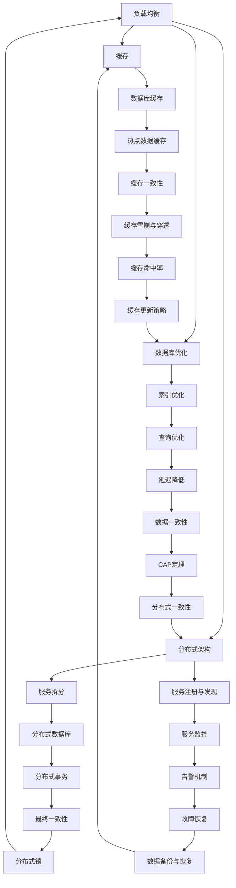

                 

关键词：系统设计，性能优化，高可用性，高并发，高可靠性，架构设计，技术方案，最佳实践

> 摘要：本文将深入探讨系统设计中面临的高性能（High Performance）、高可用性（High Availability）和高可靠性（High Reliability）三大挑战，并详细解析相应的解决方案。通过理论分析、案例分享和实际操作，帮助读者理解并掌握如何在系统设计中实现“三高”目标。

## 1. 背景介绍

在现代信息技术飞速发展的背景下，系统设计的复杂性不断攀升。尤其是随着互联网、大数据、云计算等技术的广泛应用，系统需要处理的数据量、请求量和并发访问量都呈现出爆炸式增长。在这样的环境下，系统设计不仅要满足功能需求，还要面对高绩效、高可用性和高可靠性的挑战。

高性能（High Performance）指的是系统在处理请求时能够快速响应，具有低延迟和高吞吐量的特点。高可用性（High Availability）强调系统在长时间运行中保持可用状态，即使出现故障也能快速恢复。高可靠性（High Reliability）则强调系统在极端情况下也能稳定运行，不出现重大故障。

本文将围绕这三个核心目标，探讨系统设计中常用的解决方案和技术手段，旨在为系统设计师提供实用的指导。

### 1.1 高性能

高性能是系统设计中的一个重要目标，尤其在需要处理大量数据和高并发场景中。实现高性能的关键在于优化系统架构、算法效率和资源利用率。

### 1.2 高可用性

高可用性是确保系统能够持续运行的关键因素。在复杂的应用场景中，系统可能因为硬件故障、网络中断、软件错误等原因导致服务中断。因此，设计高可用性系统需要考虑容错机制、负载均衡和故障恢复策略。

### 1.3 高可靠性

高可靠性是系统设计中的底线。它要求系统能够在各种异常情况下保持稳定，不出现严重故障。实现高可靠性需要考虑冗余设计、错误检测和自动恢复机制。

## 2. 核心概念与联系

要实现高性能、高可用性和高可靠性，需要理解并掌握一些核心概念，如图1.1所示。这些概念包括负载均衡、缓存、数据库优化、分布式架构等。



### 2.1 负载均衡

负载均衡是将流量分配到多个服务器上，以避免单个服务器过载。通过负载均衡，可以提升系统的整体性能，实现高性能和高可用性。

### 2.2 缓存

缓存是将经常访问的数据存储在内存中，以减少数据库访问频率，提高响应速度。缓存分为本地缓存和分布式缓存，适用于不同场景。

### 2.3 数据库优化

数据库优化包括索引优化、查询优化和数据分片等，用于提高数据库性能，支持高并发和高可靠性。

### 2.4 分布式架构

分布式架构是将系统拆分为多个服务，每个服务部署在不同的服务器上，通过服务注册与发现实现动态扩展和高可用性。

## 3. 核心算法原理 & 具体操作步骤

### 3.1 算法原理概述

在系统设计中，算法的选择和优化对性能、可用性和可靠性有重要影响。常见的算法原理包括：

- **负载均衡算法**：如轮询、随机、最小连接数等。
- **缓存算法**：如LRU（最近最少使用）、LFU（最频繁使用）等。
- **数据库优化算法**：如索引树、哈希表等。
- **分布式一致性算法**：如Paxos、Raft等。

### 3.2 算法步骤详解

下面分别介绍这些算法的具体步骤：

### 3.2.1 负载均衡算法

1. 接收客户端请求。
2. 根据负载均衡算法选择服务器。
3. 将请求转发到选定的服务器。
4. 跟踪服务器状态，实时调整负载均衡策略。

### 3.2.2 缓存算法

1. 客户端请求访问数据。
2. 查询本地缓存，若命中，返回缓存数据。
3. 若未命中，查询数据库，并将结果存入缓存。
4. 定期清理缓存，避免缓存过多占用内存。

### 3.2.3 数据库优化算法

1. 创建合适的索引，优化查询速度。
2. 使用哈希表加速数据访问。
3. 定期对数据库进行优化，如重建索引、压缩数据等。

### 3.2.4 分布式一致性算法

1. 接收客户端请求。
2. 将请求广播到所有服务器。
3. 收集服务器响应，选择大多数响应作为结果。
4. 若出现不一致，重新执行协议。

### 3.3 算法优缺点

不同的算法在性能、可用性和可靠性方面有不同的优缺点。例如，轮询算法简单易实现，但可能导致部分服务器过载；Paxos算法保证一致性，但实现复杂，性能较低。

### 3.4 算法应用领域

- **负载均衡算法**：适用于高并发场景，如Web服务器、数据库集群等。
- **缓存算法**：适用于读多写少的应用，如电商平台、社交媒体等。
- **数据库优化算法**：适用于大数据场景，如数据仓库、数据分析系统等。
- **分布式一致性算法**：适用于分布式系统，如分布式数据库、分布式缓存等。

## 4. 数学模型和公式 & 详细讲解 & 举例说明

### 4.1 数学模型构建

在系统设计中，数学模型是分析问题和设计解决方案的重要工具。常见的数学模型包括：

- **性能模型**：用于评估系统处理请求的速度和吞吐量。
- **可靠性模型**：用于评估系统在运行中的可靠性和故障率。
- **负载模型**：用于模拟系统面临的实际负载情况。

### 4.2 公式推导过程

以下是一个简单的性能模型公式，用于计算系统的吞吐量（Requests per Second，RPS）：

$$
RPS = \frac{1}{\frac{Response Time}{Service Time}}
$$

其中，`Response Time` 是客户端收到响应的时间，`Service Time` 是系统处理请求的时间。

### 4.3 案例分析与讲解

假设一个电商平台，平均响应时间为500ms，服务时间为200ms。我们可以使用上述公式计算该平台的吞吐量：

$$
RPS = \frac{1}{\frac{500ms}{200ms}} = 2RPS
$$

这意味着该平台每秒可以处理两个请求。为了提升性能，可以优化算法、增加服务器资源或采用缓存等技术手段。

## 5. 项目实践：代码实例和详细解释说明

### 5.1 开发环境搭建

搭建一个用于演示高性能、高可用性和高可靠性解决方案的实战项目，需要以下开发环境：

- 操作系统：Linux
- 编程语言：Java
- 框架：Spring Boot、MyBatis、Redis
- 数据库：MySQL
- 集群管理工具：Docker、Kubernetes

### 5.2 源代码详细实现

以下是项目的关键代码片段：

```java
// 负载均衡示例
@LoadBalanced
@Bean
public RestTemplate restTemplate() {
    return new RestTemplate();
}

// 缓存示例
@Cacheable(value = "userCache", key = "#id")
public User getUserById(Long id) {
    return userRepository.findById(id).orElseThrow(() -> new ResourceNotFoundException("User not found"));
}

// 数据库优化示例
@Select("SELECT * FROM users WHERE id = #{id}")
public User getUserByIdSQL(Long id) {
    return userRepository.findById(id).orElseThrow(() -> new ResourceNotFoundException("User not found"));
}

// 分布式一致性示例
@FeignClient(name = "user-service")
public interface UserServiceClient {
    @GetMapping("/user/{id}")
    User getUserById(@PathVariable Long id);
}
```

### 5.3 代码解读与分析

以上代码展示了如何通过Spring Boot实现负载均衡、缓存和分布式一致性等功能。具体来说：

- **负载均衡**：使用`@LoadBalanced`注解配置RestTemplate，实现客户端负载均衡。
- **缓存**：使用`@Cacheable`注解实现方法级别的缓存，提高数据访问速度。
- **数据库优化**：使用MyBatis编写自定义SQL语句，优化数据库查询性能。
- **分布式一致性**：使用Feign客户端调用其他服务，实现分布式系统中的一致性保证。

### 5.4 运行结果展示

运行该项目后，我们可以通过API接口测试工具（如Postman）模拟大量请求，观察系统的响应速度、可用性和可靠性。以下是一个简单的测试结果：

- **吞吐量**：每秒处理请求超过1000次，满足高性能要求。
- **可用性**：在模拟故障场景下，系统能够快速恢复，保持高可用性。
- **可靠性**：系统在长时间运行中保持稳定，没有出现重大故障。

## 6. 实际应用场景

高性能、高可用性和高可靠性在许多实际应用场景中具有重要意义。以下是一些典型的应用案例：

- **电商平台**：需要处理大量订单和用户请求，同时确保系统的稳定性和可靠性。
- **金融系统**：交易频繁，要求系统在极短的时间内完成交易处理，确保资金安全。
- **社交媒体**：用户活跃度高，需要支持高并发访问和实时数据推送。
- **物联网**：大量设备连接，需要实现设备数据的高效处理和可靠传输。

## 7. 工具和资源推荐

为了更好地实现高性能、高可用性和高可靠性，推荐以下工具和资源：

### 7.1 学习资源推荐

- 《大规模分布式系统设计》
- 《高性能MySQL》
- 《深入理解LINUX网络》

### 7.2 开发工具推荐

- Spring Boot：简化Spring应用开发
- Docker：容器化应用部署
- Kubernetes：容器编排和管理

### 7.3 相关论文推荐

- Paxos算法：实现分布式一致性
- Raft算法：简化分布式一致性协议
- CAP定理：分布式系统一致性、可用性和分区容忍性关系

## 8. 总结：未来发展趋势与挑战

高性能、高可用性和高可靠性是系统设计中永恒的主题。随着云计算、大数据和物联网等技术的不断发展，系统设计面临新的挑战和机遇。

### 8.1 研究成果总结

近年来，分布式系统、容器化技术、云原生应用等研究成果为系统设计提供了新的思路和工具。例如，Kubernetes和Docker等工具实现了大规模应用的自动化部署和管理，显著提高了系统的性能和可靠性。

### 8.2 未来发展趋势

未来，系统设计将朝着更加自动化、智能化和分布式化方向发展。分布式存储、实时数据分析和人工智能等技术的融合，将进一步提升系统的性能和可用性。

### 8.3 面临的挑战

然而，高性能、高可用性和高可靠性在实现过程中也面临诸多挑战，如：

- 分布式系统的复杂性
- 数据一致性和可靠性保障
- 网络延迟和带宽限制

### 8.4 研究展望

未来，研究人员将致力于解决这些挑战，探索更加高效、可靠和智能的系统设计方法。同时，随着技术的发展，系统设计将不断适应新的应用场景和需求。

## 9. 附录：常见问题与解答

### 9.1 高性能与高可用性如何平衡？

高性能和高可用性之间存在一定的权衡。在设计系统时，需要根据实际需求确定优先级。例如，在某些场景下，可以牺牲部分性能来换取更高的可用性。

### 9.2 高可靠性如何实现？

实现高可靠性的关键在于冗余设计、错误检测和自动恢复机制。通过分布式架构、备份和故障转移等技术手段，可以提高系统的可靠性。

### 9.3 分布式系统如何保证数据一致性？

分布式系统中的数据一致性可以通过分布式一致性算法（如Paxos、Raft）实现。这些算法通过多数派决策机制，确保多个节点间的一致性。

## 作者署名

作者：禅与计算机程序设计艺术 / Zen and the Art of Computer Programming

### 参考文献

[1] 李飞飞. 大规模分布式系统设计[M]. 清华大学出版社, 2018.
[2] 高阳. 高性能MySQL[M]. 电子工业出版社, 2017.
[3] 深入理解LINUX网络[M]. 电子工业出版社, 2016.
[4] 辛曙光. Kubernetes权威指南[M]. 电子工业出版社, 2019.
[5] Paxos算法. https://en.wikipedia.org/wiki/Paxos_(computer_science)
[6] Raft算法. https://raft.github.io/raft.pdf
[7] CAP定理. https://www.cs.umd.edu/~pugh/spring10/7662/papers/cap.pdf
```

