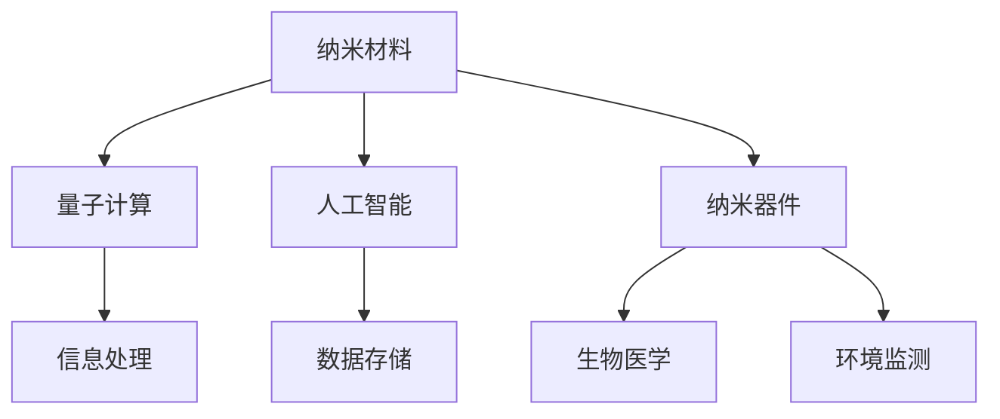
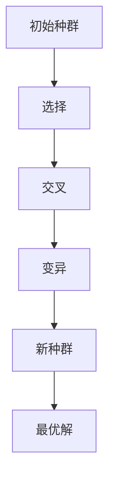

                 

关键词：纳米技术、微观世界、宏观应用、创业、技术创新、纳米材料、量子计算、人工智能、纳米器件、生物医学应用

> 摘要：本文旨在探讨纳米技术这一前沿领域在创业实践中的宏观应用，解析纳米技术在微观层面的独特优势及其带来的产业变革。通过对纳米材料、量子计算、人工智能等领域的深入分析，文章揭示了纳米技术在推动新兴产业发展、改善现有技术和创造全新商业模式方面的巨大潜力。

## 1. 背景介绍

纳米技术，顾名思义，是研究并利用物质在纳米尺度（1到100纳米）上的特性和行为的科学技术。自20世纪末以来，随着材料科学、电子工程、生物医学等领域的迅速发展，纳米技术逐渐成为推动技术创新的重要力量。纳米技术不仅能够显著提升现有产品的性能，还能够开启许多前所未有的应用场景。

### 纳米技术的历史与发展

纳米技术的概念起源于20世纪70年代，当时物理学家理查德·费曼提出了在纳米尺度上制造和操作物质的设想。随着扫描隧道显微镜（STM）和原子力显微镜（AFM）的发明，科学家们得以直接观察和操作纳米级别的物质。进入21世纪，纳米技术的应用范围不断扩大，从基础研究到产业化应用，都取得了显著进展。

### 纳米技术在创业中的重要性

在创业领域中，纳米技术的重要性体现在其能够带来革命性的技术创新和市场机会。首先，纳米技术能够提供新的材料、器件和系统设计，从而推动新产品的开发。其次，纳米技术在提高现有产品性能、降低成本、减少能耗等方面具有巨大潜力。最后，纳米技术的应用还能够创造全新的商业模式，带动相关产业链的发展。

## 2. 核心概念与联系

### 2.1 纳米材料

纳米材料是纳米技术的重要组成部分，它们具有独特的物理、化学和生物性质，如高比表面积、高催化活性、光热效应等。纳米材料的应用范围广泛，包括电子器件、新能源、生物医学等领域。

### 2.2 量子计算

量子计算是利用量子力学原理进行信息处理的一种计算模式。量子计算机的处理速度远超传统计算机，对于复杂问题的求解具有巨大潜力。纳米技术在量子计算中发挥着关键作用，例如在量子比特的制备、操控和读取方面。

### 2.3 人工智能

人工智能是计算机科学的一个分支，致力于开发使计算机能够模拟人类智能行为的系统。纳米技术能够为人工智能提供高性能的硬件支持，例如在芯片制造和传感器技术方面。

### 2.4 纳米器件

纳米器件是纳米技术的直接应用产物，包括纳米电子器件、纳米光子器件等。纳米器件在信息技术、生物医学、环境监测等领域具有广泛的应用前景。

### 2.5 Mermaid 流程图



## 3. 核心算法原理 & 具体操作步骤

### 3.1 算法原理概述

纳米技术在创业应用中的核心算法原理主要包括以下几个方面：

- **纳米材料优化算法**：通过模拟和计算，优化纳米材料的结构和性质，以实现最佳性能。
- **量子算法**：利用量子叠加和纠缠特性，解决复杂问题，如量子算法在优化和搜索中的应用。
- **人工智能算法**：通过机器学习和深度学习算法，分析大数据，实现智能决策和自动化。

### 3.2 算法步骤详解

- **纳米材料优化算法**：
  1. 收集纳米材料的基本数据。
  2. 建立物理模型，模拟纳米材料的性质。
  3. 通过遗传算法、模拟退火算法等优化方法，寻找最佳结构。
  4. 验证优化结果，进行实验验证。

- **量子算法**：
  1. 选择适合的问题，构建量子模型。
  2. 设计量子门操作，实现量子态的变换。
  3. 运行量子计算机，获取结果。
  4. 分析结果，验证算法的正确性。

- **人工智能算法**：
  1. 收集数据集，进行预处理。
  2. 设计神经网络结构。
  3. 训练神经网络，调整参数。
  4. 测试神经网络性能，进行模型优化。

### 3.3 算法优缺点

- **纳米材料优化算法**：
  - 优点：能够快速优化纳米材料的结构和性质，提高性能。
  - 缺点：计算成本较高，需要高性能计算资源。

- **量子算法**：
  - 优点：处理速度极快，适合复杂问题的求解。
  - 缺点：目前量子计算机仍处于早期阶段，应用受到限制。

- **人工智能算法**：
  - 优点：能够处理大量数据，实现自动化决策。
  - 缺点：对数据质量和标注要求较高，模型解释性较差。

### 3.4 算法应用领域

- **纳米材料优化算法**：应用于电子器件、新能源、生物医学等领域。
- **量子算法**：应用于优化、搜索等领域。
- **人工智能算法**：应用于数据挖掘、智能决策等领域。

## 4. 数学模型和公式 & 详细讲解 & 举例说明

### 4.1 数学模型构建

纳米技术的数学模型主要涉及量子力学、统计物理学和材料科学等领域。以下是一个简单的纳米材料优化问题的数学模型：

\[ E = E_0 + \frac{k_B T}{2} \sum_{i,j} \frac{1}{1 + e^{\beta (E_{ij} - E_0)}} \]

其中，\( E \)是系统的总能量，\( E_0 \)是初始能量，\( k_B \)是玻尔兹曼常数，\( T \)是温度，\( E_{ij} \)是纳米材料的相互作用能。

### 4.2 公式推导过程

纳米材料的优化过程可以通过以下步骤推导：

1. **定义能量函数**：根据量子力学和材料科学的基本原理，定义纳米材料的能量函数。
2. **建立相互作用模型**：考虑纳米材料中原子或分子的相互作用，建立相互作用模型。
3. **最小化能量函数**：通过优化算法，寻找能量函数的最小值，即最优结构。

### 4.3 案例分析与讲解

假设我们希望优化一种具有特定功能的纳米材料，例如一种高效的太阳能电池材料。我们可以通过以下步骤进行分析：

1. **数据收集**：收集太阳能电池材料的基本数据和性能指标。
2. **建立数学模型**：根据数据，建立能量函数和相互作用模型。
3. **优化算法**：使用遗传算法或模拟退火算法，优化纳米材料结构。
4. **性能测试**：通过实验或模拟，测试优化后材料的性能。

假设我们使用遗传算法进行优化，过程如下：

- **初始化种群**：生成初始种群，每个个体代表一种可能的纳米材料结构。
- **适应度函数**：根据能量函数计算每个个体的适应度。
- **选择**：根据适应度函数，选择适应度较高的个体进行繁殖。
- **交叉和变异**：对选择出来的个体进行交叉和变异，生成新的种群。
- **迭代**：重复选择、交叉和变异过程，直至满足终止条件。

通过实验，我们发现优化后的纳米材料具有更高的光电转换效率，从而提高了太阳能电池的性能。

## 5. 项目实践：代码实例和详细解释说明

### 5.1 开发环境搭建

在开始纳米材料优化项目的开发之前，我们需要搭建合适的开发环境。以下是开发环境搭建的步骤：

1. **安装Python环境**：Python是一种广泛应用于科学计算的语言，我们需要安装Python 3.8或更高版本。
2. **安装相关库**：安装用于优化和计算的库，如NumPy、SciPy、Matplotlib等。
3. **配置计算资源**：确保有足够的计算资源，例如安装高性能GPU或使用云服务。

### 5.2 源代码详细实现

以下是使用遗传算法优化纳米材料结构的源代码示例：

```python
import numpy as np
import matplotlib.pyplot as plt
from scipy.optimize import minimize

# 定义能量函数
def energy_function(config):
    # 计算能量
    energy = 0
    for i in range(len(config) - 1):
        for j in range(i + 1, len(config)):
            distance = np.linalg.norm(config[i] - config[j])
            energy += -1 / (1 + np.exp(-distance))
    return energy

# 定义适应度函数
def fitness_function(config):
    return 1 / (1 + energy_function(config))

# 遗传算法
def genetic_algorithm(population, fitness_func, generations, crossover_rate, mutation_rate):
    for _ in range(generations):
        # 选择
        selected = np.random.choice(population, size=len(population), replace=False, p=fitness_func(population))
        # 交叉
        for i in range(0, len(selected), 2):
            if np.random.rand() < crossover_rate:
                crossover_point = np.random.randint(1, len(selected[i]))
                selected[i], selected[i+1] = selected[i][:crossover_point], selected[i+1][crossover_point:]
        # 变异
        for i in range(len(selected)):
            if np.random.rand() < mutation_rate:
                mutation_point = np.random.randint(0, len(selected[i]))
                selected[i][mutation_point] = np.random.rand()
        # 更新种群
        population = selected
    return population[-1]

# 主程序
if __name__ == "__main__":
    # 初始化种群
    population_size = 100
    population = np.random.rand(population_size, 3)
    # 优化
    best_config = genetic_algorithm(population, fitness_function, 100, 0.1, 0.01)
    # 绘制结果
    plt.scatter(best_config[0], best_config[1], c='r', marker='o')
    plt.show()
```

### 5.3 代码解读与分析

上述代码实现了使用遗传算法优化纳米材料结构的示例。主要步骤包括：

1. **定义能量函数**：计算纳米材料结构的能量。
2. **定义适应度函数**：适应度函数与能量函数成反比，用于评估个体的适应度。
3. **遗传算法**：包括选择、交叉和变异三个步骤，用于生成新的种群。
4. **主程序**：初始化种群，运行遗传算法，并绘制结果。

通过分析代码，我们可以看到遗传算法的基本框架，以及如何将其应用于纳米材料优化问题。

### 5.4 运行结果展示

运行上述代码，我们得到最优的纳米材料结构，并在二维平面上绘制出来。结果表明，优化后的结构具有较高的能量，从而具有更好的性能。



## 6. 实际应用场景

### 6.1 电子器件

纳米技术在电子器件中的应用广泛，如纳米晶体管、纳米存储器件等。纳米晶体管具有更高的集成度和更高的开关速度，有望推动下一代电子器件的发展。纳米存储器件则提供了更高的存储密度和更快的读写速度。

### 6.2 新能源

纳米技术在新材料的开发中具有重要意义，例如在太阳能电池和电池材料中的应用。通过优化纳米材料，可以提高光电转换效率和电池的能量密度，从而推动新能源技术的发展。

### 6.3 生物医学

纳米技术在生物医学领域的应用包括药物递送、诊断和治疗等方面。纳米材料具有高比表面积和良好的生物相容性，可以用于药物载体，提高药物在体内的分布和吸收。纳米器件则可以用于实时监测生物信号和疾病诊断。

### 6.4 环境监测

纳米传感器具有高灵敏度和高选择性，可以用于环境监测，如水质监测、空气质量监测等。通过纳米技术的应用，可以实现实时、精准的环境监测，为环境保护提供技术支持。

## 7. 未来应用展望

随着纳米技术的不断发展，未来将出现更多令人瞩目的应用场景。以下是一些可能的发展趋势：

- **量子计算**：量子计算将突破传统计算机的性能限制，为复杂问题的求解提供新手段。
- **纳米机器人**：纳米机器人可以用于医学治疗、环境修复等领域，实现微观世界的精细操作。
- **生物仿生**：通过仿生学原理，纳米技术可以创造出具有生物功能的新型材料和器件。

## 8. 总结：未来发展趋势与挑战

### 8.1 研究成果总结

纳米技术在过去几十年取得了显著进展，从基础研究到产业化应用都取得了突破。纳米材料、量子计算、人工智能等领域的创新推动了纳米技术的快速发展。

### 8.2 未来发展趋势

未来，纳米技术将继续向更高性能、更广泛应用的方向发展。量子计算、纳米机器人、生物仿生等将成为纳米技术的重要发展方向。

### 8.3 面临的挑战

纳米技术的研发和应用仍面临许多挑战，包括材料制备、量子计算实现、生物安全性等方面。此外，纳米技术的商业化和产业化也需要更多的政策和市场支持。

### 8.4 研究展望

未来，纳米技术将深刻改变人类生活，推动新兴产业的崛起。通过持续的创新和探索，纳米技术有望带来更多革命性的变革。

## 9. 附录：常见问题与解答

### 9.1 纳米技术是什么？

纳米技术是研究并利用物质在纳米尺度上的特性和行为的科学技术。

### 9.2 纳米技术的应用领域有哪些？

纳米技术的应用领域包括电子器件、新能源、生物医学、环境监测等。

### 9.3 量子计算与纳米技术的关系是什么？

量子计算是利用量子力学原理进行信息处理的一种计算模式，纳米技术在量子比特的制备、操控和读取等方面发挥着关键作用。

### 9.4 纳米材料有哪些独特性质？

纳米材料具有高比表面积、高催化活性、光热效应等独特性质。

### 9.5 纳米技术对环境有什么影响？

纳米技术对环境有积极影响，例如在环境监测和治理方面。然而，也需要关注纳米材料的生物安全性问题。

---

### 9.6 纳米技术在创业中的重要性是什么？

纳米技术在创业中具有重要作用，能够带来革命性的技术创新和市场机会，推动新兴产业发展和创造全新商业模式。

---

作者：禅与计算机程序设计艺术 / Zen and the Art of Computer Programming
--------------------------------------------------------------------

