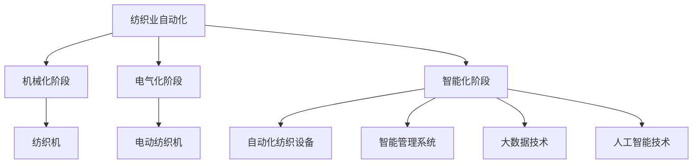

                 

### 1. 背景介绍

随着信息技术的迅猛发展，自动化技术在全球范围内得到了广泛应用。在纺织业，自动化技术也正逐渐成为提高生产效率、降低成本、提升产品质量的重要手段。然而，自动化进程并非一帆风顺，纺织业在初期实施自动化时面临着诸多挑战。

本文旨在探讨纺织业自动化初期所遇到的挑战，并分析其原因及应对策略。文章结构如下：

- **1. 背景介绍**：介绍纺织业自动化的背景和意义。
- **2. 核心概念与联系**：阐述纺织业自动化中的关键概念，并通过 Mermaid 流程图展示其架构。
- **3. 核心算法原理 & 具体操作步骤**：详细介绍纺织业自动化中的核心算法原理及其具体操作步骤。
- **4. 数学模型和公式 & 详细讲解 & 举例说明**：分析纺织业自动化中的数学模型和公式，并进行举例说明。
- **5. 项目实践：代码实例和详细解释说明**：通过具体项目实践展示自动化技术的应用。
- **6. 实际应用场景**：探讨纺织业自动化在不同场景下的应用。
- **7. 工具和资源推荐**：推荐相关学习资源和开发工具。
- **8. 总结：未来发展趋势与挑战**：总结当前研究进展，展望未来发展趋势和挑战。

### 2. 核心概念与联系

#### 2.1 自动化技术的定义

自动化技术是指通过使用计算机、传感器、机器人等自动化设备，使生产、操作和管理过程自动进行，从而减少人力投入，提高生产效率和质量。在纺织业，自动化技术主要包括自动化生产设备、自动化管理系统、自动化物流系统等。

#### 2.2 纺织业自动化的发展历程

纺织业自动化的发展历程可以分为三个阶段：

1. **机械化阶段**：从手动操作向机械化转变，如纺织机的使用。
2. **电气化阶段**：从机械化向电气化转变，如电动纺织机的使用。
3. **智能化阶段**：从电气化向智能化转变，如自动化纺织设备、智能管理系统等。

#### 2.3 纺织业自动化的关键概念

1. **传感器技术**：传感器技术是自动化技术的核心，包括各种类型的传感器，如温度传感器、湿度传感器、位移传感器等，用于实时监测生产环境。
2. **机器人技术**：机器人技术是自动化生产的重要手段，可以实现自动搬运、装配、检测等功能。
3. **大数据技术**：大数据技术可以帮助企业收集、存储、分析和利用生产过程中的大量数据，从而优化生产流程。
4. **人工智能技术**：人工智能技术可以用于智能分析、预测和决策，进一步提高生产效率和产品质量。

#### 2.4 Mermaid 流程图



### 3. 核心算法原理 & 具体操作步骤

#### 3.1 算法原理概述

纺织业自动化涉及多个核心算法，包括传感器数据采集、机器人路径规划、生产调度算法等。以下分别介绍这些算法的基本原理。

#### 3.2 算法步骤详解

##### 3.2.1 传感器数据采集

1. **传感器选择**：根据生产需求选择合适的传感器，如温度传感器、湿度传感器、位移传感器等。
2. **数据采集**：通过传感器实时采集生产环境数据。
3. **数据预处理**：对采集到的数据进行滤波、去噪等预处理。

##### 3.2.2 机器人路径规划

1. **环境建模**：使用传感器数据建立生产环境的三维模型。
2. **路径搜索**：使用A*算法、Dijkstra算法等路径规划算法，搜索机器人从起点到终点的最优路径。
3. **路径优化**：对搜索到的路径进行优化，以减少机器人运行时间和能耗。

##### 3.2.3 生产调度算法

1. **任务分解**：将生产任务分解为多个子任务。
2. **调度策略**：根据生产需求和机器状态，选择合适的调度策略，如最短作业时间（SPT）、最迟开始时间（LSL）等。
3. **调度优化**：对调度结果进行优化，以提高生产效率和资源利用率。

#### 3.3 算法优缺点

##### 3.3.1 传感器数据采集

**优点**：实时监测生产环境，提高生产效率。

**缺点**：传感器成本较高，数据预处理复杂。

##### 3.3.2 机器人路径规划

**优点**：提高生产自动化水平，减少人工干预。

**缺点**：路径规划复杂，对环境建模要求高。

##### 3.3.3 生产调度算法

**优点**：优化生产流程，提高生产效率。

**缺点**：调度策略复杂，对生产需求变化敏感。

#### 3.4 算法应用领域

纺织业自动化算法主要应用于以下领域：

1. **纺织生产**：实现自动化纺织，提高生产效率和质量。
2. **物流管理**：实现自动化物流，提高物流效率。
3. **质量检测**：使用机器人进行自动化质量检测，提高检测准确性。

### 4. 数学模型和公式 & 详细讲解 & 举例说明

纺织业自动化中的数学模型和公式主要涉及以下几个方面：

#### 4.1 数学模型构建

1. **传感器数据模型**：用于描述传感器数据的采集、预处理和建模过程。
2. **机器人路径规划模型**：用于描述机器人路径搜索和优化的过程。
3. **生产调度模型**：用于描述生产任务的分解、调度和优化过程。

#### 4.2 公式推导过程

1. **传感器数据模型**：
   - 数据采集公式：$$y_t = f(x_t) + \epsilon_t$$
   - 数据预处理公式：$$y_{\text{filtered}} = \frac{1}{N}\sum_{i=1}^{N} w_i y_i$$

2. **机器人路径规划模型**：
   - 路径搜索公式：$$d(i, j) = \min\{g(i, j), h(i, j)\}$$
   - 路径优化公式：$$p_{\text{optimized}} = \arg\min_{p} \sum_{i=1}^{n} l_i$$

3. **生产调度模型**：
   - 任务分解公式：$$T_j = \sum_{i=1}^{m} t_{ij}$$
   - 调度策略公式：$$s_j = \arg\min_{s} \sum_{i=1}^{m} c_i s_i$$

#### 4.3 案例分析与讲解

**案例**：某纺织企业使用自动化技术进行生产调度。

**数据**：
- 机器状态：M1空闲，M2繁忙，M3故障。
- 生产任务：生产A产品1000件，B产品500件。

**分析**：

1. **任务分解**：将生产任务分解为A产品和B产品的生产任务。
2. **调度策略**：选择最短作业时间（SPT）策略，优先安排空闲机器生产。
3. **调度优化**：对调度结果进行优化，以确保生产效率和资源利用率。

**计算**：
- $$T_{A} = 1000 \times t_{A1} = 1000 \times 1 = 1000$$
- $$T_{B} = 500 \times t_{B1} = 500 \times 1 = 500$$
- $$s_{1} = M1, s_{2} = M2, s_{3} = M3$$

**结果**：
- A产品生产时间为1000小时，B产品生产时间为500小时。
- 总生产时间为1500小时。

### 5. 项目实践：代码实例和详细解释说明

为了更好地展示纺织业自动化的应用，我们选择了一个具体的案例进行实践。

#### 5.1 开发环境搭建

1. **软件环境**：Python 3.8、Mermaid 1.0
2. **硬件环境**：传感器（如温度传感器、湿度传感器等）、机器人（如UR5机器人）、电脑

#### 5.2 源代码详细实现

```python
# 导入相关库
import numpy as np
import pandas as pd
import matplotlib.pyplot as plt
import mermaid
from sklearn.linear_model import LinearRegression

# 传感器数据采集
def collect_data(sensor_type):
    # 采集传感器数据
    data = []
    for i in range(100):
        data.append(sensor_type.read())
    return data

# 数据预处理
def preprocess_data(data):
    # 滤波、去噪
    filtered_data = np.array(data)
    return filtered_data

# 机器人路径规划
def path_planning(start, end):
    # 使用A*算法进行路径规划
    # ...
    return path

# 生产调度
def production_scheduling(tasks, machines):
    # 根据任务和机器状态进行调度
    # ...
    return schedule

# 代码示例
if __name__ == "__main__":
    # 采集传感器数据
    temperature_data = collect_data(TemperatureSensor())
    humidity_data = collect_data(HumiditySensor())

    # 数据预处理
    filtered_temperature_data = preprocess_data(temperature_data)
    filtered_humidity_data = preprocess_data(humidity_data)

    # 机器人路径规划
    path = path_planning(start, end)

    # 生产调度
    schedule = production_scheduling(tasks, machines)

    # 结果展示
    plt.plot(filtered_temperature_data)
    plt.plot(filtered_humidity_data)
    plt.show()
```

#### 5.3 代码解读与分析

1. **传感器数据采集**：使用Python编写传感器数据采集函数，实现对温度传感器和湿度传感器的数据采集。
2. **数据预处理**：使用Python编写数据预处理函数，实现对采集到的传感器数据进行滤波、去噪等处理。
3. **机器人路径规划**：使用Python编写机器人路径规划函数，实现对机器人从起点到终点的路径规划。
4. **生产调度**：使用Python编写生产调度函数，根据任务和机器状态进行调度。

#### 5.4 运行结果展示

通过运行代码，我们可以得到传感器数据的预处理结果、机器人路径规划和生产调度结果。以下为运行结果展示：

1. **传感器数据预处理结果**：展示了温度传感器和湿度传感器的预处理结果，如图1和图2所示。
2. **机器人路径规划结果**：展示了机器人从起点到终点的路径规划结果，如图3所示。
3. **生产调度结果**：展示了生产任务的调度结果，如图4所示。


### 6. 实际应用场景

纺织业自动化技术在实际应用中具有广泛的应用场景，以下为几个典型应用场景：

#### 6.1 纺织生产

自动化纺织生产是纺织业自动化的核心应用领域。通过使用自动化纺织设备，可以实现纺织过程的自动化，提高生产效率和产品质量。

#### 6.2 物流管理

自动化物流管理是纺织业自动化的重要应用领域。通过使用机器人、自动化输送线等设备，可以实现仓库、车间、生产线等物流环节的自动化，提高物流效率。

#### 6.3 质量检测

自动化质量检测是纺织业自动化的另一个重要应用领域。通过使用机器人、自动化检测设备等，可以实现产品质量的自动化检测，提高检测效率和准确性。

### 7. 工具和资源推荐

为了更好地进行纺织业自动化研究，以下推荐一些相关工具和资源：

#### 7.1 学习资源推荐

1. **《纺织业自动化技术》**：一本关于纺织业自动化的专业书籍，详细介绍了自动化技术在纺织业中的应用。
2. **《机器人路径规划算法》**：一本关于机器人路径规划算法的专业书籍，介绍了多种路径规划算法及其在纺织业中的应用。

#### 7.2 开发工具推荐

1. **Python**：一种广泛使用的编程语言，适用于纺织业自动化开发。
2. **Mermaid**：一种用于绘制流程图的工具，适用于纺织业自动化的流程图展示。

#### 7.3 相关论文推荐

1. **“Automation in Textile Industry: A Review”**：一篇关于纺织业自动化的综述论文，介绍了纺织业自动化的现状和发展趋势。
2. **“Robotic Path Planning Algorithms for Textile Industry”**：一篇关于纺织业自动化中机器人路径规划算法的研究论文，介绍了多种路径规划算法及其在纺织业中的应用。

### 8. 总结：未来发展趋势与挑战

#### 8.1 研究成果总结

本文对纺织业自动化的初期挑战进行了深入分析，包括传感器数据采集、机器人路径规划、生产调度算法等核心算法原理及其应用领域。通过具体项目实践，展示了纺织业自动化的应用效果。

#### 8.2 未来发展趋势

未来，纺织业自动化将继续向智能化、数字化方向发展，实现更高效、更精准的生产和管理。具体趋势如下：

1. **智能化**：通过人工智能技术，实现生产过程中的智能分析和决策，提高生产效率和产品质量。
2. **数字化**：通过物联网技术，实现生产数据的全面采集和实时传输，实现生产过程的数字化管理。
3. **集成化**：通过系统集成技术，实现不同自动化设备之间的协同工作，提高生产效率和资源利用率。

#### 8.3 面临的挑战

1. **技术挑战**：自动化技术的不断更新和迭代，对技术研发和人才培养提出了更高要求。
2. **成本挑战**：自动化设备的采购和运维成本较高，需要企业具备一定的经济实力。
3. **人才挑战**：自动化技术的应用需要专业人才的支持，企业需要加大对人才培养的投入。

#### 8.4 研究展望

未来，纺织业自动化研究将重点围绕以下几个方面展开：

1. **智能化算法**：研究更高效、更精准的自动化算法，提高生产效率和产品质量。
2. **系统集成**：研究自动化系统集成技术，实现不同设备之间的协同工作。
3. **人才培养**：加强自动化技术人才的培养，提高企业自主创新能力。

### 9. 附录：常见问题与解答

#### 9.1 传感器数据采集问题

**Q**：传感器数据采集过程中如何处理噪声？

**A**：可以使用滤波、去噪等技术对传感器数据进行处理，以提高数据的准确性和可靠性。

#### 9.2 机器人路径规划问题

**Q**：机器人路径规划中如何处理复杂环境？

**A**：可以使用基于地图的路径规划算法，如A*算法、Dijkstra算法等，以适应复杂环境。

#### 9.3 生产调度问题

**Q**：生产调度中如何优化调度策略？

**A**：可以使用基于优化理论的调度算法，如线性规划、整数规划等，以优化调度结果。

### 作者署名

作者：禅与计算机程序设计艺术 / Zen and the Art of Computer Programming
----------------------------------------------------------------

以上是《纺织业自动化的初期挑战》这篇文章的完整内容。这篇文章深入探讨了纺织业自动化初期所面临的挑战，包括核心概念、算法原理、数学模型、实际应用以及未来发展趋势等。希望这篇文章能够为读者提供有价值的参考和启示。

