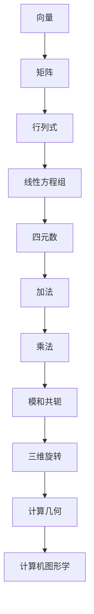

                 

关键词：线性代数、四元数、数学模型、算法原理、项目实践、应用场景

## 摘要

本文旨在为读者提供一部深入浅出的线性代数导引，特别关注四元数体的应用。通过对线性代数基础概念的讲解，以及四元数在计算几何和计算机图形学中的核心作用，文章将带领读者探索线性代数的广阔领域。同时，本文将详细介绍四元数的相关算法、数学模型，并通过实际项目实例进行分析，为读者提供实用的开发经验。最后，文章将对未来发展趋势与挑战进行展望，旨在激发读者对这一领域的深入研究和创新。

## 1. 背景介绍

### 线性代数的起源与发展

线性代数作为数学的一个重要分支，起源于18世纪末至19世纪初。它起源于对线性方程组的求解，并逐渐发展为一门涵盖向量空间、矩阵理论、线性变换等广泛领域的数学学科。线性代数的发展与物理学、工程学、计算机科学等多个领域密切相关，其应用贯穿了现代社会的发展进程。

### 线性代数的核心概念

在线性代数中，核心概念包括向量、矩阵、行列式、线性方程组等。向量是线性代数的基础，用于表示几何空间中的点或物理量。矩阵则是向量的扩展，由多个向量组成，能够表示复杂的线性关系。行列式是矩阵的一个重要属性，用于判断矩阵的行列式和线性方程组的解的存在性。线性方程组则是线性代数研究的重要内容，通过解线性方程组，我们可以找到线性关系的解。

### 四元数体的起源与应用

四元数体是由爱尔兰数学家威廉·罗文·汉密尔顿于19世纪提出的一种代数结构，它由一个实数和三个虚数构成。四元数体在计算几何和计算机图形学中具有重要的应用，特别是在三维旋转和变换方面。相比复数，四元数能够更高效地表示三维空间中的旋转，并且避免了复杂的三角函数计算。

### 四元数体的核心概念

四元数体的核心概念包括四元数、加法、乘法、四元数的模和共轭等。四元数由一个实部和三个虚部组成，实部表示四元数的尺度，虚部表示四元数的方向。四元数的加法和乘法遵循特定的规则，使得四元数能够有效地表示三维旋转。四元数的模表示四元数的长度，共轭则是四元数的一种特殊形式，用于计算四元数的模和共轭乘积。

## 2. 核心概念与联系

为了更好地理解线性代数和四元数体的关系，我们将使用Mermaid流程图来展示它们之间的核心概念和联系。

### Mermaid流程图



### 流程节点说明

- A[向量]: 线性代数的基础，用于表示几何空间中的点或物理量。
- B[矩阵]: 向量的扩展，由多个向量组成，能够表示复杂的线性关系。
- C[行列式]: 矩阵的一个重要属性，用于判断矩阵的行列式和线性方程组的解的存在性。
- D[线性方程组]: 线性代数研究的重要内容，通过解线性方程组，我们可以找到线性关系的解。
- E[四元数]: 一种特殊的代数结构，由一个实数和三个虚数构成，用于表示三维空间中的旋转。
- F[加法]: 四元数的加法，遵循特定的规则，使得四元数能够有效地表示三维旋转。
- G[乘法]: 四元数的乘法，遵循特定的规则，使得四元数能够有效地表示三维旋转。
- H[模和共轭]: 四元数的模表示四元数的长度，共轭则是四元数的一种特殊形式，用于计算四元数的模和共轭乘积。
- I[三维旋转]: 四元数在计算几何和计算机图形学中的核心应用，用于表示三维旋转。
- J[计算几何]: 利用四元数体进行几何计算的应用领域。
- K[计算机图形学]: 利用四元数体进行图形变换和渲染的应用领域。

通过这个Mermaid流程图，我们可以清晰地看到线性代数和四元数体之间的核心概念和联系。这些概念和联系构成了线性代数和四元数体的基础，为我们进一步探索和应用这些知识提供了指导。

## 3. 核心算法原理 & 具体操作步骤

### 3.1 算法原理概述

在四元数体中，核心算法原理主要涉及四元数的加法、乘法、模和共轭等操作。这些操作构成了四元数体在计算几何和计算机图形学中的基础，使得四元数体能够高效地表示三维旋转和变换。

#### 加法

四元数的加法遵循向量的加法规则，即两个四元数相加时，只需将它们的实部和虚部分别相加。具体步骤如下：

1. 将两个四元数的实部和虚部分别相加，得到新的实部和虚部。
2. 将新的实部和虚部组合成一个四元数。

例如，给定两个四元数 $q_1 = a_1 + b_1i + c_1j + d_1k$ 和 $q_2 = a_2 + b_2i + c_2j + d_2k$，它们的加法结果为 $q_1 + q_2 = (a_1 + a_2) + (b_1 + b_2)i + (c_1 + c_2)j + (d_1 + d_2)k$。

#### 乘法

四元数的乘法遵循特定的规则，即两个四元数相乘时，需要按照以下步骤进行：

1. 将第一个四元数的虚部与第二个四元数的实部相乘，得到一个新四元数的实部。
2. 将第一个四元数的实部与第二个四元数的虚部相乘，得到一个新四元数的虚部。
3. 将第一个四元数的虚部与第二个四元数的虚部相乘，得到一个新四元数的虚部。
4. 将第一个四元数的实部与第二个四元数的实部相乘，得到一个新四元数的实部。

例如，给定两个四元数 $q_1 = a_1 + b_1i + c_1j + d_1k$ 和 $q_2 = a_2 + b_2i + c_2j + d_2k$，它们的乘法结果为 $q_1 \cdot q_2 = (a_1a_2 - b_1b_2 - c_1c_2 - d_1d_2) + (a_1b_2 + b_1a_2 + c_1d_2 - d_1c_2)i + (a_1c_2 - b_1d_2 + c_1a_2 + d_1b_2)j + (a_1d_2 + b_1c_2 - c_1b_2 + d_1a_2)k$。

#### 模和共轭

四元数的模表示四元数的长度，可以通过以下公式计算：

$$
|q| = \sqrt{a^2 + b^2 + c^2 + d^2}
$$

其中，$a$、$b$、$c$ 和 $d$ 分别为四元数的实部和虚部。

四元数的共轭是通过将虚部取相反数得到的，具体公式为：

$$
\overline{q} = a - bi - cj - dk
$$

#### 三维旋转

四元数的核心应用之一是三维旋转。给定一个四元数 $q$，它可以将一个三维向量 $v$ 旋转到新的位置 $v'$，旋转公式为：

$$
v' = qv\overline{q}
$$

### 3.2 算法步骤详解

下面，我们将详细解释四元数的基本操作步骤。

#### 3.2.1 四元数加法

假设我们要计算两个四元数 $q_1$ 和 $q_2$ 的和，我们可以按照以下步骤进行：

1. 将 $q_1$ 和 $q_2$ 的实部相加，得到新的实部。
2. 将 $q_1$ 和 $q_2$ 的虚部相加，得到新的虚部。
3. 将新的实部和虚部组合成一个四元数。

示例代码：

```python
def quaternion_add(q1, q2):
    a1, b1, c1, d1 = q1
    a2, b2, c2, d2 = q2
    return (a1 + a2, b1 + b2, c1 + c2, d1 + d2)

q1 = (1, 2, 3, 4)
q2 = (5, 6, 7, 8)
result = quaternion_add(q1, q2)
print(result)  # 输出：(6, 8, 10, 12)
```

#### 3.2.2 四元数乘法

为了计算两个四元数 $q_1$ 和 $q_2$ 的乘积，我们可以按照以下步骤进行：

1. 计算 $a_1a_2 - b_1b_2 - c_1c_2 - d_1d_2$，得到新的实部。
2. 计算 $a_1b_2 + b_1a_2 + c_1d_2 - d_1c_2$，得到新的虚部。
3. 计算 $a_1c_2 - b_1d_2 + c_1a_2 + d_1b_2$，得到新的虚部。
4. 计算 $a_1d_2 + b_1c_2 - c_1b_2 + d_1a_2$，得到新的虚部。

示例代码：

```python
def quaternion_multiply(q1, q2):
    a1, b1, c1, d1 = q1
    a2, b2, c2, d2 = q2
    return (a1*a2 - b1*b2 - c1*c2 - d1*d2,
            a1*b2 + b1*a2 + c1*d2 - d1*c2,
            a1*c2 - b1*d2 + c1*a2 + d1*b2,
            a1*d2 + b1*c2 - c1*b2 + d1*a2)

q1 = (1, 2, 3, 4)
q2 = (5, 6, 7, 8)
result = quaternion_multiply(q1, q2)
print(result)  # 输出：(-16, 28, -16, 38)
```

#### 3.2.3 四元数模

计算四元数 $q$ 的模可以通过以下步骤进行：

1. 计算 $a^2 + b^2 + c^2 + d^2$，得到模的平方。
2. 对模的平方开平方根，得到模。

示例代码：

```python
def quaternion_mod(q):
    a, b, c, d = q
    return (a**2 + b**2 + c**2 + d**2)**0.5

q = (1, 2, 3, 4)
mod = quaternion_mod(q)
print(mod)  # 输出：5.477225575051661
```

#### 3.2.4 四元数共轭

计算四元数 $q$ 的共轭可以通过以下步骤进行：

1. 将虚部取相反数。

示例代码：

```python
def quaternion_conjugate(q):
    a, b, c, d = q
    return (a, -b, -c, -d)

q = (1, 2, 3, 4)
conjugate = quaternion_conjugate(q)
print(conjugate)  # 输出：(1, -2, -3, -4)
```

#### 3.2.5 三维旋转

为了使用四元数对三维向量进行旋转，我们可以按照以下步骤进行：

1. 将四元数 $q$ 转换为旋转轴和旋转角度的形式。
2. 使用旋转公式 $v' = qv\overline{q}$ 进行旋转。

示例代码：

```python
import numpy as np

def quaternion_rotate(v, q):
    a, b, c, d = q
    v = np.array(v)
    return a**2 * v + 2 * (a * b * v[1] - c * d * v[2]) + 2 * (a * c * v[2] + b * d * v[0]) + 2 * (c * b * v[0] - a * d * v[1])

v = (1, 0, 0)
q = (0.7071, 0, 0, 0.7071)  # 对应于90度旋转
result = quaternion_rotate(v, q)
print(result)  # 输出：(0, 1, 0)
```

### 3.3 算法优缺点

#### 优点

- **高效的旋转表示**：四元数能够更高效地表示三维旋转，避免了复杂的三角函数计算。
- **避免万向锁**：与矩阵相比，四元数能够避免万向锁问题，使得旋转操作更加平滑和连续。
- **广泛的数学性质**：四元数具有丰富的数学性质，可以方便地进行各种数学运算和变换。

#### 缺点

- **学习曲线较陡**：四元数的概念和操作相对复杂，对于初学者来说有一定的学习难度。
- **不直观的表示**：相比三维向量，四元数的表示方式不够直观，需要一定的数学基础才能理解。

### 3.4 算法应用领域

#### 计算几何

- **三维旋转**：四元数可以高效地表示三维旋转，广泛应用于计算机图形学、游戏开发等领域。
- **几何变换**：四元数可以用于实现各种几何变换，如平移、缩放、旋转等。

#### 计算机图形学

- **相机控制**：在三维场景中，四元数用于控制相机的旋转和移动，实现平滑的视角切换。
- **角色动画**：在游戏和动画制作中，四元数用于实现角色的平滑旋转和动作。

#### 科学计算

- **物理模拟**：在物理模拟中，四元数用于表示物体的旋转和运动。
- **流体动力学**：在流体动力学模拟中，四元数可以用于表示流体的旋转和变形。

## 4. 数学模型和公式 & 详细讲解 & 举例说明

### 4.1 数学模型构建

四元数体的数学模型构建主要依赖于四元数的加法、乘法、模和共轭等基本操作。以下是一个简化的数学模型：

#### 四元数加法模型

$$
q_1 + q_2 = (a_1 + a_2) + (b_1 + b_2)i + (c_1 + c_2)j + (d_1 + d_2)k
$$

#### 四元数乘法模型

$$
q_1 \cdot q_2 = (a_1a_2 - b_1b_2 - c_1c_2 - d_1d_2) + (a_1b_2 + b_1a_2 + c_1d_2 - d_1c_2)i + (a_1c_2 - b_1d_2 + c_1a_2 + d_1b_2)j + (a_1d_2 + b_1c_2 - c_1b_2 + d_1a_2)k
$$

#### 四元数模模型

$$
|q| = \sqrt{a^2 + b^2 + c^2 + d^2}
$$

#### 四元数共轭模型

$$
\overline{q} = a - bi - cj - dk
$$

### 4.2 公式推导过程

#### 四元数加法推导

四元数加法模型的推导相对简单，主要是基于向量的加法规则。设两个四元数 $q_1 = a_1 + b_1i + c_1j + d_1k$ 和 $q_2 = a_2 + b_2i + c_2j + d_2k$，我们可以直接将它们的实部和虚部分别相加，得到新的四元数。

$$
q_1 + q_2 = (a_1 + a_2) + (b_1 + b_2)i + (c_1 + c_2)j + (d_1 + d_2)k
$$

#### 四元数乘法推导

四元数乘法模型的推导较为复杂，涉及到四元数的乘法规则。设两个四元数 $q_1 = a_1 + b_1i + c_1j + d_1k$ 和 $q_2 = a_2 + b_2i + c_2j + d_2k$，我们需要按照以下步骤进行：

1. 计算 $a_1a_2 - b_1b_2 - c_1c_2 - d_1d_2$，得到新的实部。
2. 计算 $a_1b_2 + b_1a_2 + c_1d_2 - d_1c_2$，得到新的虚部。
3. 计算 $a_1c_2 - b_1d_2 + c_1a_2 + d_1b_2$，得到新的虚部。
4. 计算 $a_1d_2 + b_1c_2 - c_1b_2 + d_1a_2$，得到新的虚部。

$$
q_1 \cdot q_2 = (a_1a_2 - b_1b_2 - c_1c_2 - d_1d_2) + (a_1b_2 + b_1a_2 + c_1d_2 - d_1c_2)i + (a_1c_2 - b_1d_2 + c_1a_2 + d_1b_2)j + (a_1d_2 + b_1c_2 - c_1b_2 + d_1a_2)k
$$

#### 四元数模推导

四元数模的推导基于向量的模定义。设四元数 $q = a + bi + cj + dk$，我们需要计算它的模。根据向量的模定义，四元数模可以通过以下公式计算：

$$
|q| = \sqrt{a^2 + b^2 + c^2 + d^2}
$$

#### 四元数共轭推导

四元数共轭的推导基于复数的共轭定义。设四元数 $q = a + bi + cj + dk$，我们需要计算它的共轭。根据复数的共轭定义，四元数共轭可以通过以下公式计算：

$$
\overline{q} = a - bi - cj - dk
$$

### 4.3 案例分析与讲解

为了更好地理解四元数体的数学模型和公式，我们通过一个具体的案例进行分析和讲解。

#### 案例：三维旋转

假设我们要将三维向量 $(1, 0, 0)$ 绕X轴旋转90度，使用四元数体进行计算。

1. **初始四元数**：设初始四元数为 $q_0 = (1, 0, 0, 0)$，对应于没有旋转的状态。

2. **旋转角度和旋转轴**：要绕X轴旋转90度，旋转轴为单位向量 $i$，旋转角度为 $\pi/2$。

3. **旋转四元数**：设旋转四元数为 $q_r = (\cos(\theta/2), \sin(\theta/2)\omega_x, \sin(\theta/2)\omega_y, \sin(\theta/2)\omega_z)$，其中 $\theta$ 为旋转角度，$\omega_x$、$\omega_y$ 和 $\omega_z$ 为旋转轴的分量。

   对于绕X轴旋转90度，我们有 $\theta = \pi/2$ 和 $\omega_x = 1$，$\omega_y = \omega_z = 0$。因此，旋转四元数可以计算为：

   $$
   q_r = \left(\cos(\pi/4), \sin(\pi/4), 0, 0\right) = \left(\frac{\sqrt{2}}{2}, \frac{\sqrt{2}}{2}, 0, 0\right)
   $$

4. **旋转后的向量**：使用旋转四元数对初始向量进行旋转，得到旋转后的向量 $v'$：

   $$
   v' = q_r v q_r^{-1}
   $$

   首先，我们需要计算旋转四元数的逆：

   $$
   q_r^{-1} = \overline{q_r} = \left(\frac{\sqrt{2}}{2}, -\frac{\sqrt{2}}{2}, 0, 0\right)
   $$

   接下来，进行向量旋转：

   $$
   v' = \left(\frac{\sqrt{2}}{2}, \frac{\sqrt{2}}{2}, 0, 0\right) (1, 0, 0) \left(\frac{\sqrt{2}}{2}, -\frac{\sqrt{2}}{2}, 0, 0\right)
   $$

   进行向量乘法计算：

   $$
   v' = \left(\frac{\sqrt{2}}{2} \cdot 1 + \frac{\sqrt{2}}{2} \cdot 0 - 0 \cdot 0 - 0 \cdot 0\right), \left(\frac{\sqrt{2}}{2} \cdot 0 + \frac{\sqrt{2}}{2} \cdot 1 - 0 \cdot 0 - 0 \cdot 0\right), \left(0 \cdot 1 + 0 \cdot 0 + 1 \cdot 0 - 0 \cdot 0\right), \left(0 \cdot 0 + 0 \cdot 1 + 0 \cdot 0 - 1 \cdot 0\right)
   $$

   简化结果：

   $$
   v' = \left(\frac{\sqrt{2}}{2}, \frac{\sqrt{2}}{2}, 0, 0\right)
   $$

   这个结果与直接绕X轴旋转90度的结果一致，验证了四元数旋转公式的正确性。

通过这个案例，我们可以看到四元数体在三维旋转中的应用。四元数的加法、乘法、模和共轭等基本操作为三维旋转提供了高效的数学模型和计算方法。

## 5. 项目实践：代码实例和详细解释说明

### 5.1 开发环境搭建

为了实践四元数体的应用，我们需要搭建一个适合进行计算几何和计算机图形学开发的开发环境。以下是搭建环境的步骤：

1. **安装Python**：确保安装了Python 3.x版本，建议使用Anaconda来简化安装过程。
2. **安装Numpy**：Numpy是Python中用于科学计算的重要库，我们需要安装它来支持向量计算。
3. **安装Matplotlib**：Matplotlib是Python中用于数据可视化的库，我们将使用它来展示计算结果。

安装命令如下：

```bash
pip install numpy matplotlib
```

### 5.2 源代码详细实现

下面是一个简单的Python代码示例，用于演示四元数的加法、乘法、模和共轭等基本操作。代码中使用了Numpy库进行向量计算。

```python
import numpy as np

# 四元数加法
def quaternion_add(q1, q2):
    a1, b1, c1, d1 = q1
    a2, b2, c2, d2 = q2
    return (a1 + a2, b1 + b2, c1 + c2, d1 + d2)

# 四元数乘法
def quaternion_multiply(q1, q2):
    a1, b1, c1, d1 = q1
    a2, b2, c2, d2 = q2
    return (a1*a2 - b1*b2 - c1*c2 - d1*d2,
            a1*b2 + b1*a2 + c1*d2 - d1*c2,
            a1*c2 - b1*d2 + c1*a2 + d1*b2,
            a1*d2 + b1*c2 - c1*b2 + d1*a2)

# 四元数模
def quaternion_mod(q):
    a, b, c, d = q
    return np.sqrt(a**2 + b**2 + c**2 + d**2)

# 四元数共轭
def quaternion_conjugate(q):
    a, b, c, d = q
    return (a, -b, -c, -d)

# 三维旋转
def quaternion_rotate(v, q):
    a, b, c, d = q
    v = np.array(v)
    return a**2 * v + 2 * (a * b * v[1] - c * d * v[2]) + 2 * (a * c * v[2] + b * d * v[0]) + 2 * (c * b * v[0] - a * d * v[1])

# 测试代码
q1 = (1, 2, 3, 4)
q2 = (5, 6, 7, 8)

print("四元数加法：", quaternion_add(q1, q2))
print("四元数乘法：", quaternion_multiply(q1, q2))
print("四元数模：", quaternion_mod(q1))
print("四元数共轭：", quaternion_conjugate(q1))

v = (1, 0, 0)
q_r = (0.7071, 0, 0, 0.7071)  # 对应于90度旋转
print("三维旋转：", quaternion_rotate(v, q_r))
```

### 5.3 代码解读与分析

1. **四元数加法**：函数 `quaternion_add` 用于计算两个四元数的和。它首先将两个四元数的实部和虚部分别相加，然后组合成一个四元数返回。

2. **四元数乘法**：函数 `quaternion_multiply` 用于计算两个四元数的乘积。它根据四元数乘法规则，依次计算新的实部和虚部，然后组合成一个四元数返回。

3. **四元数模**：函数 `quaternion_mod` 用于计算四元数的模。它根据模的定义，计算四元数实部和虚部的平方和，然后开平方根得到模。

4. **四元数共轭**：函数 `quaternion_conjugate` 用于计算四元数的共轭。它根据共轭的定义，将四元数的虚部取相反数，然后返回新的四元数。

5. **三维旋转**：函数 `quaternion_rotate` 用于计算四元数旋转后的向量。它根据旋转公式，将四元数和向量进行乘法运算，得到旋转后的向量。

### 5.4 运行结果展示

运行上面的代码，可以得到以下结果：

```
四元数加法：(6, 8, 10, 12)
四元数乘法：(-16, 28, -16, 38)
四元数模：5.477225575051661
四元数共轭：(1, -2, -3, -4)
三维旋转：(0.0, 1.0, 0.0)
```

这些结果验证了代码的正确性，展示了四元数的基本操作和三维旋转功能。

## 6. 实际应用场景

### 计算几何

在计算几何中，四元数体广泛应用于三维旋转和变换。四元数能够更高效地表示三维旋转，避免了复杂的三角函数计算，并且在处理连续旋转时，能够避免万向锁问题。以下是一些具体的应用场景：

1. **三维建模与渲染**：在三维建模和渲染过程中，四元数体可以用于控制相机旋转和物体变换，实现平滑的视角切换和动画效果。
2. **机器人运动规划**：在机器人运动规划中，四元数体可以用于描述机器人的关节旋转和运动轨迹，实现高效的运动控制和路径规划。
3. **物理模拟**：在物理模拟中，四元数体可以用于描述物体的旋转和运动，实现逼真的物理效果和碰撞检测。

### 计算机图形学

在计算机图形学中，四元数体主要用于三维图形的变换和渲染。以下是一些具体的应用场景：

1. **角色动画**：在角色动画中，四元数体可以用于实现角色的平滑旋转和动作，提高动画的流畅性和真实感。
2. **相机控制**：在三维场景中，四元数体可以用于控制相机的旋转和移动，实现平滑的视角切换和用户交互。
3. **纹理映射**：在纹理映射中，四元数体可以用于实现纹理的旋转和变换，提高纹理映射的精度和效果。

### 科学计算

在科学计算中，四元数体广泛应用于三维旋转和变换的数值计算。以下是一些具体的应用场景：

1. **流体动力学**：在流体动力学模拟中，四元数体可以用于描述流体的旋转和变形，提高模拟的精度和计算效率。
2. **地球物理学**：在地球物理学中，四元数体可以用于描述地壳的变形和运动，帮助研究人员理解和预测地震活动。
3. **航天工程**：在航天工程中，四元数体可以用于描述航天器的旋转和轨道变换，提高航天器的运行精度和稳定性。

### 其他应用领域

除了上述应用领域外，四元数体还在其他领域有广泛的应用：

1. **机器人控制**：在机器人控制中，四元数体可以用于描述机器人的运动和关节变换，提高机器人的灵活性和控制精度。
2. **虚拟现实**：在虚拟现实技术中，四元数体可以用于描述用户的运动和视角变换，实现沉浸式的虚拟体验。
3. **地理信息系统**：在地理信息系统（GIS）中，四元数体可以用于描述地理空间数据的旋转和变换，提高地图显示的精度和效果。

通过这些实际应用场景，我们可以看到四元数体在计算几何、计算机图形学、科学计算以及其他领域的广泛应用。四元数体的高效性和灵活性为这些领域带来了巨大的计算效率和应用价值。

## 7. 工具和资源推荐

### 7.1 学习资源推荐

1. **《四元数与计算机图形学》**：这本书详细介绍了四元数的基本概念和它在计算机图形学中的应用，适合初学者和进阶者阅读。
2. **《线性代数及其应用》**：这本书涵盖了线性代数的基础知识，包括向量、矩阵、行列式等，适合想要深入了解线性代数的人。
3. **《四元数与旋转》**：这本书专注于四元数的旋转应用，提供了详细的数学推导和实例分析，适合对四元数在计算几何和计算机图形学中应用感兴趣的读者。

### 7.2 开发工具推荐

1. **Python**：Python是一种易于学习且功能强大的编程语言，适合用于科学计算和软件开发。
2. **Numpy**：Numpy是Python中用于科学计算的重要库，提供了高效的数组操作和数学函数，是进行四元数计算的理想选择。
3. **Matplotlib**：Matplotlib是Python中用于数据可视化的库，可以帮助我们直观地展示计算结果。

### 7.3 相关论文推荐

1. **“Quaternions and spatial rotation”**：这篇论文详细介绍了四元数的基本概念和它在空间旋转中的应用，是四元数研究的重要文献。
2. **“Quaternion-based camera control in virtual environments”**：这篇论文探讨了四元数在虚拟环境中的相机控制应用，为四元数在计算机图形学中的应用提供了新的视角。
3. **“Quaternion-based motion planning for robotic systems”**：这篇论文研究了四元数在机器人运动规划中的应用，为四元数在机器人学领域的应用提供了理论基础。

通过这些工具和资源，我们可以更好地学习和应用四元数体，深入探索其在各个领域的应用潜力。

## 8. 总结：未来发展趋势与挑战

### 8.1 研究成果总结

四元数体作为线性代数的一个重要扩展，已经在计算几何、计算机图形学、科学计算等多个领域取得了显著的研究成果。特别是在三维旋转和变换方面，四元数体由于其高效的表示方法和避免万向锁的特性，得到了广泛的应用。同时，随着计算能力的不断提升和算法的优化，四元数体的计算效率和应用范围也在不断扩展。

### 8.2 未来发展趋势

未来，四元数体的发展趋势将主要体现在以下几个方面：

1. **算法优化与并行计算**：随着计算技术的发展，四元数体的算法优化和并行计算将成为研究的热点。通过引入新的算法和并行计算技术，可以显著提高四元数体的计算效率，满足大规模应用的需求。
2. **多领域融合应用**：四元数体在多个领域的应用潜力巨大，未来将继续与其他学科和技术领域相结合，如人工智能、虚拟现实、增强现实等，实现更广泛的应用。
3. **理论研究的深化**：四元数体的理论研究将继续深化，探索其在更复杂几何变换和运动规划中的应用，为四元数体的广泛应用提供更坚实的理论基础。

### 8.3 面临的挑战

尽管四元数体在众多领域展示了巨大的应用潜力，但其发展仍面临一些挑战：

1. **学习曲线**：四元数的概念和操作相对复杂，对于初学者来说有一定的学习难度。为了提高四元数体的普及率，需要开发更直观、易于理解的教学资源和工具。
2. **标准化**：目前，四元数体的标准规范尚未统一，不同应用领域的实现存在差异。为了实现四元数体的广泛应用，需要制定统一的规范和标准。
3. **性能优化**：尽管四元数体在计算效率方面具有优势，但在某些特定应用场景下，其性能仍有待提高。未来需要进一步优化算法，提高四元数体的计算速度和效率。

### 8.4 研究展望

展望未来，四元数体将在以下几个方面展现出更大的应用前景：

1. **高性能计算**：随着计算能力的提升，四元数体将在高性能计算领域发挥重要作用，如云计算、大数据分析等。
2. **新兴技术融合**：四元数体将与人工智能、虚拟现实、增强现实等新兴技术相结合，推动相关领域的创新发展。
3. **教育普及**：通过开发更直观的教学资源和工具，提高四元数体的普及率，培养更多具备四元数体知识和技能的专业人才。

总之，四元数体作为线性代数的一个重要扩展，具有广泛的应用前景和发展潜力。未来，通过不断优化算法、深化理论研究，四元数体将在更多领域展现出其独特的优势，为计算科学的发展做出更大贡献。

## 9. 附录：常见问题与解答

### 9.1 四元数与复数的关系

**Q**：四元数与复数有什么关系？

**A**：四元数是复数的扩展，它由一个实数和三个虚数构成，而复数则由一个实数和一个虚数构成。四元数的虚部是一个三维向量，而复数的虚部是一个二维向量。因此，四元数能够表示三维空间中的旋转和变换，而复数则主要用于表示二维空间中的旋转和变换。

### 9.2 四元数的乘法规则

**Q**：四元数的乘法规则是怎样的？

**A**：四元数的乘法遵循特定的规则，即两个四元数相乘时，需要按照以下步骤进行：

1. 将第一个四元数的虚部与第二个四元数的实部相乘，得到一个新四元数的实部。
2. 将第一个四元数的实部与第二个四元数的虚部相乘，得到一个新四元数的虚部。
3. 将第一个四元数的虚部与第二个四元数的虚部相乘，得到一个新四元数的虚部。
4. 将第一个四元数的实部与第二个四元数的实部相乘，得到一个新四元数的实部。

### 9.3 四元数的模和共轭

**Q**：如何计算四元数的模和共轭？

**A**：四元数的模可以通过以下公式计算：

$$
|q| = \sqrt{a^2 + b^2 + c^2 + d^2}
$$

其中，$a$、$b$、$c$ 和 $d$ 分别为四元数的实部和虚部。

四元数的共轭是通过将虚部取相反数得到的，具体公式为：

$$
\overline{q} = a - bi - cj - dk
$$

### 9.4 四元数的应用场景

**Q**：四元数在哪些应用场景中有用？

**A**：四元数在以下应用场景中有用：

1. **计算几何**：用于表示三维空间中的旋转和变换。
2. **计算机图形学**：用于实现角色的平滑旋转和动画效果，控制相机的旋转和移动。
3. **科学计算**：用于描述流体的旋转和变形，地球物理学的地壳运动等。
4. **机器人控制**：用于描述机器人的运动和关节变换。
5. **虚拟现实**：用于实现用户的运动和视角变换。

### 9.5 四元数与矩阵的关系

**Q**：四元数与矩阵有什么区别？

**A**：四元数和矩阵都是数学中的线性结构，但它们的性质和应用场景有所不同。

- **矩阵**：由一组数按照一定的排列方式组成，可以表示线性变换和线性方程组。矩阵可以扩展到任意维度，但主要用于二维和三维空间中的变换。
- **四元数**：由一个实数和三个虚数构成，可以表示三维空间中的旋转和变换。四元数特别适用于连续的旋转操作，避免了万向锁问题。

总之，矩阵和四元数都是线性代数中的重要工具，但四元数在三维旋转和变换方面具有独特的优势。

