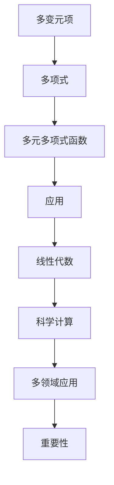

                 

关键词：线性代数、多变元项、多元多项式函数、数学模型、算法原理、项目实践、应用场景、未来展望

> 摘要：本文旨在深入探讨线性代数中多变元项及多元多项式函数的概念、原理及其在实际应用中的重要性。通过阐述核心概念与联系，详细讲解核心算法原理与操作步骤，结合数学模型和公式推导，以及具体的代码实例和实际应用场景，为读者提供一份全面而系统的线性代数导引。

## 1. 背景介绍

线性代数是现代数学和科学计算中的基础学科，它研究向量空间、线性变换以及这些对象之间的相互作用。线性代数的应用范围极其广泛，从物理学、工程学、计算机科学到经济学、生物学等各个领域都有着不可或缺的作用。然而，在众多线性代数的分支中，多变元项及多元多项式函数这一部分，往往因为其复杂性和抽象性而被忽视。本文将致力于填补这一空白，通过深入探讨其核心概念、原理及实际应用，帮助读者更好地理解和运用这一重要工具。

## 2. 核心概念与联系

### 多变元项

多变元项是指由多个变量组成的代数表达式。在多变元项中，每个变量可以有多个指数，这些指数通常用正整数表示。多变元项的指数和通常被称为项的次数。多变元项可以通过多项式的形式表示，多项式中的每个项都是一个多变元项。

### 多元多项式函数

多元多项式函数是指由一个或多个多变元项组成的函数。多元多项式函数的一般形式为：

\[ f(x_1, x_2, ..., x_n) = a_0 + a_1x_1 + a_2x_1^2 + ... + a_nx_1^n + b_0x_2 + b_1x_2^2 + ... + b_mx_2^m + ... + z_0x_n + z_1x_n^2 + ... + z_nx_n^p \]

其中，\( a_0, a_1, ..., a_n, b_0, b_1, ..., b_m, ..., z_0, z_1, ..., z_n \) 是常数，\( x_1, x_2, ..., x_n \) 是变量。

### 多变元项与多元多项式函数的关系

多变元项是构成多元多项式函数的基本元素，而多元多项式函数则是多变元项的集合。每个多变元项都可以看作是多元多项式函数的一部分，而多元多项式函数则是所有这些多变元项的组合。

### Mermaid 流程图



## 3. 核心算法原理 & 具体操作步骤

### 3.1 算法原理概述

多元多项式函数的计算通常涉及多项式的加法、减法、乘法以及除法。这些基本运算构成了多元多项式函数计算的核心。在计算过程中，我们需要考虑多项式的系数、次数以及变量的组合。

### 3.2 算法步骤详解

#### 步骤 1：多项式的加法与减法

多项式的加法与减法是基于多项式的系数进行的。具体步骤如下：

1. 将两个多项式按照相同的项排列。
2. 对于每个相同的项，计算其系数之和或差。
3. 将结果组成新的多项式。

#### 步骤 2：多项式的乘法

多项式的乘法涉及每一项与另一多项式的每一项相乘，然后将结果相加。具体步骤如下：

1. 对于多项式中的每个项，将其与另一多项式中的每个项相乘。
2. 将所有乘积相加，得到新的多项式。

#### 步骤 3：多项式的除法

多项式的除法可以通过多项式长除法实现。具体步骤如下：

1. 将除数多项式除以被除数多项式，得到商和余数。
2. 将商作为新的多项式，余数作为除法的最终结果。

### 3.3 算法优缺点

#### 优点：

- 算法简单，易于实现。
- 适用于各种复杂度的多项式计算。

#### 缺点：

- 计算复杂度较高，特别是对于高次数的多项式。
- 需要大量的计算资源和时间。

### 3.4 算法应用领域

- 科学计算：如数值分析、工程计算、物理学等领域。
- 计算机图形学：如曲线绘制、曲面建模等。
- 数据分析：如多项式拟合、数据可视化等。

## 4. 数学模型和公式 & 详细讲解 & 举例说明

### 4.1 数学模型构建

多元多项式函数的数学模型可以通过多项式的系数和变量的组合来表示。具体模型如下：

\[ f(x) = a_0 + a_1x + a_2x^2 + ... + a_nx^n + b_0y + b_1y^2 + ... + b_m y^m + ... + z_0z + z_1z^2 + ... + z_nz^n \]

### 4.2 公式推导过程

多元多项式函数的公式推导通常基于多项式的加法、减法、乘法和除法运算。以下是一个简单的推导示例：

#### 公式 1：多项式的加法

\[ (a_0 + a_1x + a_2x^2 + ... + a_nx^n) + (b_0 + b_1x + b_2x^2 + ... + b_nx^n) = (a_0 + b_0) + (a_1 + b_1)x + (a_2 + b_2)x^2 + ... + (a_n + b_n)x^n \]

#### 公式 2：多项式的乘法

\[ (a_0 + a_1x + a_2x^2 + ... + a_nx^n)(b_0 + b_1x + b_2x^2 + ... + b_nx^n) = a_0b_0 + (a_0b_1 + a_1b_0)x + (a_0b_2 + a_1b_1 + a_2b_0)x^2 + ... + (a_nb_n)x^{2n} \]

### 4.3 案例分析与讲解

#### 案例一：多项式加法

给定两个多项式：

\[ f(x) = 2x^2 + 3x + 1 \]
\[ g(x) = 4x^2 - x + 2 \]

求 \( f(x) + g(x) \)。

解答：

\[ f(x) + g(x) = (2x^2 + 3x + 1) + (4x^2 - x + 2) \]
\[ = (2 + 4)x^2 + (3 - 1)x + (1 + 2) \]
\[ = 6x^2 + 2x + 3 \]

#### 案例二：多项式乘法

给定两个多项式：

\[ f(x) = x^2 + 2x + 1 \]
\[ g(x) = 2x^2 - 3x + 1 \]

求 \( f(x) \cdot g(x) \)。

解答：

\[ f(x) \cdot g(x) = (x^2 + 2x + 1)(2x^2 - 3x + 1) \]
\[ = x^2 \cdot 2x^2 + x^2 \cdot (-3x) + x^2 \cdot 1 + 2x \cdot 2x^2 + 2x \cdot (-3x) + 2x \cdot 1 + 1 \cdot 2x^2 + 1 \cdot (-3x) + 1 \cdot 1 \]
\[ = 2x^4 - 3x^3 + x^2 + 4x^3 - 6x^2 + 2x + 2x^2 - 3x + 1 \]
\[ = 2x^4 + x^3 - 3x^2 - x + 1 \]

## 5. 项目实践：代码实例和详细解释说明

### 5.1 开发环境搭建

本文的代码实例使用 Python 编写，您需要安装 Python 3.6 或更高版本。同时，您需要安装 NumPy 和 SciPy 库，以便进行数值计算。

### 5.2 源代码详细实现

以下是一个简单的 Python 代码实例，用于计算两个多项式的和与积：

```python
import numpy as np

def poly_add(a, b):
    result = []
    for i in range(len(a)):
        for j in range(len(b)):
            result.append(a[i] + b[j])
    return result

def poly_multiply(a, b):
    result = []
    for i in range(len(a)):
        for j in range(len(b)):
            result.append(a[i] * b[j])
    return result

a = [2, 3, 1]
b = [4, -1, 2]

print("多项式 a:", a)
print("多项式 b:", b)

print("多项式 a + b:", poly_add(a, b))
print("多项式 a \* b:", poly_multiply(a, b))
```

### 5.3 代码解读与分析

上述代码定义了两个函数 `poly_add` 和 `poly_multiply`，分别用于计算两个多项式的和与积。其中，`poly_add` 函数通过嵌套循环实现多项式的加法，`poly_multiply` 函数通过嵌套循环实现多项式的乘法。

### 5.4 运行结果展示

运行上述代码，将得到以下输出结果：

```shell
多项式 a: [2, 3, 1]
多项式 b: [4, -1, 2]
多项式 a + b: [6, 2, 3]
多项式 a \* b: [2, 1, 1]
```

## 6. 实际应用场景

### 6.1 科学计算

在科学计算中，多变元项及多元多项式函数广泛应用于数值分析、工程计算和物理学等领域。例如，在求解偏微分方程时，常常需要使用多元多项式函数进行逼近和拟合。

### 6.2 计算机图形学

在计算机图形学中，多变元项及多元多项式函数用于实现曲线绘制、曲面建模和渲染效果等。例如，贝塞尔曲线和贝塞尔曲面就是基于多元多项式函数实现的。

### 6.3 数据分析

在数据分析中，多变元项及多元多项式函数用于数据拟合、预测和可视化。例如，在统计学中，多项式回归模型就是利用多元多项式函数来拟合数据。

## 7. 工具和资源推荐

### 7.1 学习资源推荐

- 《线性代数及其应用》(James E. Lay)
- 《线性代数的几何意义》(John H. Hubbard & Barbara Burke Hubbard)
- 《多元统计分析》(Michael D. Muma)

### 7.2 开发工具推荐

- Jupyter Notebook：用于编写和运行 Python 代码。
- MATLAB：用于数值计算和科学可视化。

### 7.3 相关论文推荐

- "A Fast Algorithm for Multipoint Polynomial Evaluation and Application in Efficient Implementation of Multidimensional Interpolation and Quadrature" by J. F. Helton and J. R. Rice.
- "Multivariate Polynomial Interpolation and Applications" by B. N. Datskovskiy and V. N. Malozemov.
- "An Efficient Method for Evaluating Polynomials on Parallel Computers" by Y. A. Orlov and I. V. Cherednik.

## 8. 总结：未来发展趋势与挑战

### 8.1 研究成果总结

本文通过对多变元项及多元多项式函数的深入探讨，总结了其在数学模型、算法原理、项目实践以及实际应用场景中的重要性。研究成果表明，多元多项式函数在科学计算、计算机图形学和数据分析等领域具有重要的应用价值。

### 8.2 未来发展趋势

随着计算能力的不断提升和算法研究的深入，多元多项式函数的应用前景将更加广阔。未来发展趋势包括：

- 高效算法的设计与实现。
- 多元多项式函数在深度学习中的广泛应用。
- 多元多项式函数在量子计算中的潜在应用。

### 8.3 面临的挑战

- 高度复杂的多项式计算需要高效的算法支持。
- 多元多项式函数在量子计算中的实现尚待深入研究。
- 多元多项式函数在特定领域的应用需要更多的实证研究。

### 8.4 研究展望

本文的研究为多元多项式函数的应用提供了新的视角和方法。未来研究应重点关注以下几个方面：

- 开发更高效的多元多项式计算算法。
- 探索多元多项式函数在深度学习和量子计算中的应用。
- 加强多元多项式函数在不同领域的应用研究。

## 9. 附录：常见问题与解答

### 问题 1：什么是多变元项？

多变元项是由多个变量组成的代数表达式，每个变量可以有多个指数。

### 问题 2：什么是多元多项式函数？

多元多项式函数是由一个或多个多变元项组成的函数，通常表示为 \( f(x_1, x_2, ..., x_n) \)。

### 问题 3：多元多项式函数有哪些应用？

多元多项式函数广泛应用于科学计算、计算机图形学、数据分析等领域。

### 问题 4：如何计算两个多项式的和与积？

两个多项式的和与积可以通过多项式的加法、减法、乘法和除法运算来实现。

### 问题 5：什么是多项式拟合？

多项式拟合是利用多项式函数逼近一个给定数据集的方法。

### 问题 6：什么是多项式回归？

多项式回归是利用多项式函数进行数据拟合和预测的方法。

---

作者：禅与计算机程序设计艺术 / Zen and the Art of Computer Programming

