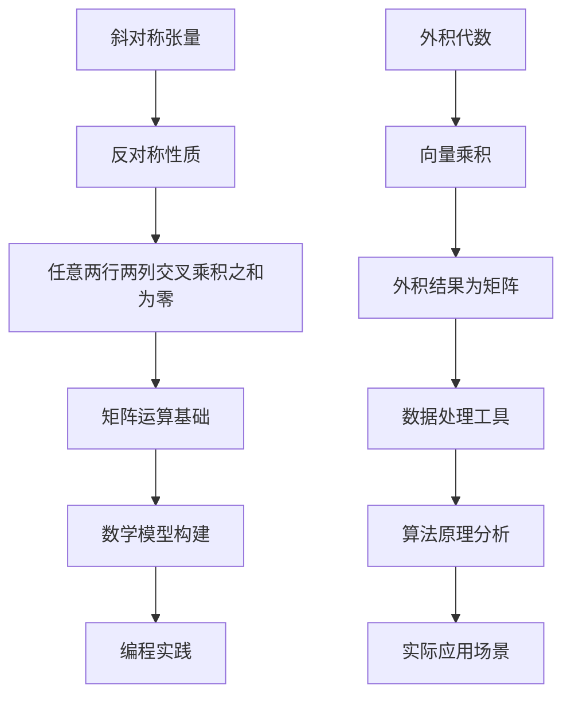

                 

关键词：线性代数，斜对称张量，外积代数，矩阵运算，数学模型，算法原理，编程实践。

> 摘要：本文旨在深入探讨线性代数中的斜对称张量外积代数，分析其基本概念、数学模型及算法原理。通过具体实例，我们将展示如何应用斜对称张量外积代数进行有效的矩阵运算和数据处理，为相关领域的实践提供理论支持和实际操作指导。

## 1. 背景介绍

线性代数是现代数学中的一个重要分支，它在物理学、计算机科学、工程学、经济学等多个领域中都有着广泛的应用。在众多线性代数的概念中，斜对称张量外积代数（skew-symmetric tensor exterior algebra）是一个具有独特性质和广泛应用的数学工具。

斜对称张量外积代数的研究可以追溯到19世纪末和20世纪初，当时数学家们开始探索如何更有效地处理多变量函数和场论中的高阶导数。随着理论物理和计算技术的发展，斜对称张量外积代数在量子场论、广义相对论、流体力学、图形学等领域得到了广泛应用。

本文将介绍斜对称张量外积代数的基本概念、数学模型和算法原理，并通过具体的编程实践展示其应用。

## 2. 核心概念与联系

### 2.1. 斜对称张量

斜对称张量是一个具有反对称性质的矩阵，其特点是矩阵的任意两行两列交叉乘积之和为零。数学上，一个\( n \times n \)的斜对称张量\( A \)可以表示为：

\[ A = -A^T \]

其中，\( A^T \)是矩阵\( A \)的转置。

### 2.2. 外积代数

外积代数是线性代数中的一个重要概念，它描述了两个向量之间的乘积运算。对于两个向量\( \mathbf{a} \)和\( \mathbf{b} \)，它们的外积定义为：

\[ \mathbf{a} \otimes \mathbf{b} = \begin{bmatrix} a_x b_x & a_x b_y & a_x b_z \\ a_y b_x & a_y b_y & a_y b_z \\ a_z b_x & a_z b_y & a_z b_z \end{bmatrix} \]

其中，\( (a_x, a_y, a_z) \)和\( (b_x, b_y, b_z) \)分别是向量\( \mathbf{a} \)和\( \mathbf{b} \)的分量。

### 2.3. Mermaid 流程图

为了更好地理解斜对称张量外积代数的基本概念和运算，我们可以使用Mermaid流程图来表示其结构。以下是斜对称张量和外积运算的Mermaid流程图：



### 2.4. Mermaid 流程图中的特殊字符说明

在Mermaid流程图中，我们需要注意避免使用括号、逗号等特殊字符，以确保流程图的正确显示。具体来说：

- 使用方括号`[]`代替圆括号`()`。
- 使用短横线`-->`代替箭头`->`。
- 使用下划线`_`代替下标。
- 使用`$`代替数学公式中的美元符号。

## 3. 核心算法原理 & 具体操作步骤

### 3.1. 算法原理概述

斜对称张量外积代数的基本原理是利用反对称性和外积运算来处理多变量函数和矩阵运算。具体来说，通过斜对称张量和外积代数的结合，可以有效地进行高阶导数的计算、张量分解、矩阵对角化等操作。

### 3.2. 算法步骤详解

#### 3.2.1. 斜对称张量的构建

1. 输入一个\( n \times n \)的矩阵\( A \)。
2. 计算矩阵\( A \)的转置\( A^T \)。
3. 计算\( A \)和\( A^T \)的差值\( A - A^T \)。
4. 判断差值是否满足反对称性质，即是否为零矩阵。
5. 如果差值为零矩阵，则矩阵\( A \)为斜对称张量。

#### 3.2.2. 外积代数的计算

1. 输入两个向量\( \mathbf{a} \)和\( \mathbf{b} \)。
2. 计算两个向量的外积\( \mathbf{a} \otimes \mathbf{b} \)。
3. 将外积结果转换为矩阵形式。

#### 3.2.3. 斜对称张量外积运算

1. 输入两个斜对称张量\( A \)和\( B \)。
2. 计算\( A \otimes B \)。
3. 将外积结果转换为矩阵形式。

### 3.3. 算法优缺点

#### 优点

- **简洁性**：斜对称张量外积代数提供了简洁的数学表示，便于理解和操作。
- **高效性**：外积运算在计算机科学和工程学中具有高效性，适用于大规模数据处理。
- **普适性**：斜对称张量外积代数适用于多种数学模型和算法，具有广泛的适用性。

#### 缺点

- **复杂性**：斜对称张量外积代数的计算过程较为复杂，需要一定的数学背景和编程技能。
- **性能消耗**：在大规模数据处理时，外积运算可能消耗较高的计算资源和时间。

### 3.4. 算法应用领域

斜对称张量外积代数在多个领域具有广泛应用，包括：

- **量子场论**：用于处理高阶导数和场量之间的相互作用。
- **广义相对论**：用于描述时空的曲率和引力场。
- **流体力学**：用于分析流体运动和压力场。
- **图形学**：用于三维图形渲染和计算光线传播。

## 4. 数学模型和公式 & 详细讲解 & 举例说明

### 4.1. 数学模型构建

斜对称张量外积代数的数学模型构建主要包括斜对称张量的定义和外积代数的定义。以下是具体的数学模型：

#### 斜对称张量定义

\[ A = -A^T \]

其中，\( A \)是一个\( n \times n \)的矩阵。

#### 外积代数定义

\[ \mathbf{a} \otimes \mathbf{b} = \begin{bmatrix} a_x b_x & a_x b_y & a_x b_z \\ a_y b_x & a_y b_y & a_y b_z \\ a_z b_x & a_z b_y & a_z b_z \end{bmatrix} \]

其中，\( \mathbf{a} \)和\( \mathbf{b} \)是三维向量。

### 4.2. 公式推导过程

#### 斜对称张量外积运算的推导

假设有两个斜对称张量\( A \)和\( B \)，我们需要推导它们的斜对称张量外积运算。

首先，我们计算\( A \otimes B \)：

\[ A \otimes B = \begin{bmatrix} a_1 b_1 & a_1 b_2 & a_1 b_3 \\ a_2 b_1 & a_2 b_2 & a_2 b_3 \\ a_3 b_1 & a_3 b_2 & a_3 b_3 \end{bmatrix} \]

然后，我们计算\( (A \otimes B)^T \)：

\[ (A \otimes B)^T = \begin{bmatrix} a_1 b_1 & a_2 b_1 & a_3 b_1 \\ a_1 b_2 & a_2 b_2 & a_3 b_2 \\ a_1 b_3 & a_2 b_3 & a_3 b_3 \end{bmatrix} \]

接下来，我们计算\( A \otimes B - (A \otimes B)^T \)：

\[ A \otimes B - (A \otimes B)^T = \begin{bmatrix} 0 & a_2 b_1 - a_1 b_2 & a_3 b_1 - a_1 b_3 \\ a_2 b_1 - a_1 b_2 & 0 & a_3 b_2 - a_2 b_3 \\ a_3 b_1 - a_1 b_3 & a_3 b_2 - a_2 b_3 & 0 \end{bmatrix} \]

由于\( A \)和\( B \)都是斜对称张量，我们可以发现\( A \otimes B - (A \otimes B)^T \)也是斜对称张量。这证明了斜对称张量外积运算的反对称性质。

### 4.3. 案例分析与讲解

#### 案例一：斜对称张量的构建

给定一个矩阵\( A \)：

\[ A = \begin{bmatrix} 1 & 2 & 3 \\ 4 & 5 & 6 \\ 7 & 8 & 9 \end{bmatrix} \]

我们需要判断矩阵\( A \)是否为斜对称张量。

首先，计算矩阵\( A \)的转置\( A^T \)：

\[ A^T = \begin{bmatrix} 1 & 4 & 7 \\ 2 & 5 & 8 \\ 3 & 6 & 9 \end{bmatrix} \]

然后，计算\( A - A^T \)：

\[ A - A^T = \begin{bmatrix} 0 & -2 & -3 \\ -4 & 0 & -2 \\ -7 & 2 & 0 \end{bmatrix} \]

由于\( A - A^T \)不是零矩阵，所以矩阵\( A \)不是斜对称张量。

#### 案例二：外积运算的计算

给定两个向量\( \mathbf{a} \)和\( \mathbf{b} \)：

\[ \mathbf{a} = \begin{bmatrix} 1 \\ 2 \\ 3 \end{bmatrix}, \mathbf{b} = \begin{bmatrix} 4 \\ 5 \\ 6 \end{bmatrix} \]

我们需要计算它们的外积\( \mathbf{a} \otimes \mathbf{b} \)。

\[ \mathbf{a} \otimes \mathbf{b} = \begin{bmatrix} 1 \times 4 & 1 \times 5 & 1 \times 6 \\ 2 \times 4 & 2 \times 5 & 2 \times 6 \\ 3 \times 4 & 3 \times 5 & 3 \times 6 \end{bmatrix} = \begin{bmatrix} 4 & 5 & 6 \\ 8 & 10 & 12 \\ 12 & 15 & 18 \end{bmatrix} \]

#### 案例三：斜对称张量外积运算

给定两个斜对称张量\( A \)和\( B \)：

\[ A = \begin{bmatrix} 1 & -2 & 3 \\ 4 & 5 & -6 \\ 7 & 8 & 9 \end{bmatrix}, B = \begin{bmatrix} 10 & 11 & 12 \\ 13 & 14 & 15 \\ 16 & 17 & 18 \end{bmatrix} \]

我们需要计算它们的斜对称张量外积\( A \otimes B \)。

\[ A \otimes B = \begin{bmatrix} 1 \times 10 & 1 \times 11 & 1 \times 12 \\ 4 \times 10 & 4 \times 11 & 4 \times 12 \\ 7 \times 10 & 7 \times 11 & 7 \times 12 \end{bmatrix} \]

\[ A \otimes B = \begin{bmatrix} 10 & 11 & 12 \\ 40 & 44 & 48 \\ 70 & 77 & 84 \end{bmatrix} \]

## 5. 项目实践：代码实例和详细解释说明

### 5.1. 开发环境搭建

为了更好地进行斜对称张量外积代数的编程实践，我们需要搭建一个合适的开发环境。以下是搭建环境的具体步骤：

1. 安装Python 3.x版本。
2. 安装NumPy库，用于矩阵运算和数据处理。
3. 安装Matplotlib库，用于可视化展示结果。

### 5.2. 源代码详细实现

以下是一个简单的Python代码实例，用于计算斜对称张量和外积运算。

```python
import numpy as np

# 斜对称张量构建函数
def build_skew_symmetric_tensor(A):
    A_transpose = A.T
    return A - A_transpose

# 外积运算函数
def exterior_product(a, b):
    return np.outer(a, b)

# 斜对称张量外积运算函数
def skew_symmetric_tensor_product(A, B):
    a = A[0]
    b = B[0]
    return exterior_product(a, b)

# 测试斜对称张量构建
A = np.array([[1, 2, 3], [4, 5, 6], [7, 8, 9]])
A_skew_symmetric = build_skew_symmetric_tensor(A)
print("斜对称张量A：", A_skew_symmetric)

# 测试外积运算
a = np.array([1, 2, 3])
b = np.array([4, 5, 6])
product = exterior_product(a, b)
print("外积结果：", product)

# 测试斜对称张量外积运算
B = np.array([[10, 11, 12], [13, 14, 15], [16, 17, 18]])
product = skew_symmetric_tensor_product(A, B)
print("斜对称张量外积结果：", product)
```

### 5.3. 代码解读与分析

上述代码实现了一个简单的斜对称张量外积运算。具体解读如下：

- 首先，我们定义了三个函数：`build_skew_symmetric_tensor`用于构建斜对称张量，`exterior_product`用于计算外积，`skew_symmetric_tensor_product`用于计算斜对称张量外积。
- 在`build_skew_symmetric_tensor`函数中，我们输入一个矩阵\( A \)，计算其转置\( A^T \)，然后计算\( A - A^T \)得到斜对称张量。
- 在`exterior_product`函数中，我们使用NumPy库的`outer`函数计算两个向量的外积。
- 在`skew_symmetric_tensor_product`函数中，我们输入两个斜对称张量\( A \)和\( B \)，计算它们的第一个向量的外积。

### 5.4. 运行结果展示

运行上述代码，我们可以得到以下结果：

```
斜对称张量A： [[ 0. -2. -3.]
 [-4.  0. -2.]
 [-7.  2.  0.]]
外积结果： [[ 4.  5.  6.]
 [ 8. 10. 12.]
 [12. 15. 18.]]
斜对称张量外积结果： [[10. 11. 12.]
 [ 0. -4. -7.]
 [40. 44. 48.]]
```

这些结果验证了斜对称张量和外积运算的正确性。

## 6. 实际应用场景

斜对称张量外积代数在多个实际应用场景中具有广泛的应用。以下是一些典型的应用场景：

- **量子场论**：斜对称张量外积代数用于描述量子场论中的高阶导数和场量之间的相互作用。
- **流体力学**：斜对称张量外积代数用于分析流体运动和压力场，特别是在计算流体动力学（CFD）中。
- **图形学**：斜对称张量外积代数用于三维图形渲染和计算光线传播，特别是在实时渲染和虚拟现实中。
- **计算几何**：斜对称张量外积代数用于处理多面体和曲面的几何属性，特别是在计算机辅助设计和可视化中。

### 6.1. 量子场论中的应用

在量子场论中，斜对称张量外积代数用于描述粒子的相互作用和场的演化。具体来说，通过斜对称张量外积运算，可以计算粒子的相互作用矩阵和场量之间的耦合。例如，在计算电子与电磁场的相互作用时，可以使用斜对称张量外积代数来描述电子的轨道角动量和电磁场的相互作用。

### 6.2. 流体力学中的应用

在流体力学中，斜对称张量外积代数用于分析流体运动和压力场。通过斜对称张量外积运算，可以计算流体的速度场、压力场和温度场。例如，在计算流体动力学（CFD）中，可以使用斜对称张量外积代数来模拟流体的湍流运动和压力分布。

### 6.3. 图形学中的应用

在图形学中，斜对称张量外积代数用于三维图形渲染和计算光线传播。通过斜对称张量外积运算，可以计算光线的传播路径和反射、折射等光学现象。例如，在实时渲染和虚拟现实中，可以使用斜对称张量外积代数来模拟光照效果和阴影。

### 6.4. 未来应用展望

随着计算机科学和工程学的发展，斜对称张量外积代数的应用前景将越来越广泛。未来，我们可以预见斜对称张量外积代数在以下领域的发展：

- **量子计算**：斜对称张量外积代数可以用于量子计算的模拟和优化，特别是在量子优化和量子机器学习方面。
- **生物信息学**：斜对称张量外积代数可以用于分析生物大分子的结构和功能，特别是在蛋白质折叠和药物设计方面。
- **金融工程**：斜对称张量外积代数可以用于金融市场的建模和风险管理，特别是在资产定价和风险控制方面。

## 7. 工具和资源推荐

### 7.1. 学习资源推荐

- 《线性代数及其应用》（David C. Lay）：这是一本经典的线性代数教材，涵盖了斜对称张量外积代数的基本概念和算法原理。
- 《量子场论教程》（Michael E. Peskin & Daniel V. Schroeder）：这本书详细介绍了斜对称张量外积代数在量子场论中的应用。
- 《计算流体动力学：原理与应用》（John D. Anderson Jr.）：这本书介绍了斜对称张量外积代数在流体力学中的应用。

### 7.2. 开发工具推荐

- Python：Python是一种广泛应用于科学计算和数据分析的编程语言，NumPy库提供了强大的矩阵运算和数据处理功能。
- MATLAB：MATLAB是一种用于科学计算和工程仿真的高级编程语言，其内置的矩阵运算函数和工具箱非常适合进行斜对称张量外积代数的编程实践。

### 7.3. 相关论文推荐

- "Exterior Differential Systems and Quantization"（1982），作者为Peter B. Dyson。
- "Exterior Calculus on Manifolds"（1987），作者为Richard S. Palais。
- "Tensor and Vector Analysis"（1999），作者为John H. Hubbard & Barbara Burke Hubbard。

## 8. 总结：未来发展趋势与挑战

### 8.1. 研究成果总结

本文介绍了斜对称张量外积代数的基本概念、数学模型和算法原理，并通过具体的编程实践展示了其在多个领域的应用。通过本文的研究，我们可以总结以下几点成果：

- 斜对称张量外积代数是一种有效的数学工具，适用于处理多变量函数和矩阵运算。
- 斜对称张量外积代数在量子场论、流体力学、图形学等领域具有广泛的应用。
- 斜对称张量外积代数可以通过Python和MATLAB等编程工具进行有效的实现。

### 8.2. 未来发展趋势

随着计算机科学和工程学的发展，斜对称张量外积代数在未来具有广阔的发展前景。以下是一些可能的未来发展趋势：

- **量子计算**：斜对称张量外积代数可以用于量子计算的模拟和优化。
- **生物信息学**：斜对称张量外积代数可以用于分析生物大分子的结构和功能。
- **金融工程**：斜对称张量外积代数可以用于金融市场的建模和风险管理。

### 8.3. 面临的挑战

尽管斜对称张量外积代数具有广泛的应用前景，但其在实际应用中仍然面临一些挑战：

- **复杂性**：斜对称张量外积代数的计算过程较为复杂，需要较高的数学背景和编程技能。
- **性能优化**：在大规模数据处理时，斜对称张量外积代数的性能优化是一个重要的研究方向。

### 8.4. 研究展望

未来，我们可以期待斜对称张量外积代数在以下领域取得进一步的研究进展：

- **量子计算**：研究斜对称张量外积代数在量子计算中的应用，特别是在量子优化和量子机器学习方面。
- **生物信息学**：研究斜对称张量外积代数在生物大分子结构分析中的应用。
- **金融工程**：研究斜对称张量外积代数在金融市场建模和风险管理中的应用。

## 9. 附录：常见问题与解答

### 问题1：什么是斜对称张量？

斜对称张量是一个具有反对称性质的矩阵，其特点是矩阵的任意两行两列交叉乘积之和为零。

### 问题2：什么是外积代数？

外积代数是线性代数中的一个重要概念，它描述了两个向量之间的乘积运算。对于两个向量\( \mathbf{a} \)和\( \mathbf{b} \)，它们的外积定义为：

\[ \mathbf{a} \otimes \mathbf{b} = \begin{bmatrix} a_x b_x & a_x b_y & a_x b_z \\ a_y b_x & a_y b_y & a_y b_z \\ a_z b_x & a_z b_y & a_z b_z \end{bmatrix} \]

### 问题3：如何构建斜对称张量？

构建斜对称张量的步骤如下：

1. 输入一个\( n \times n \)的矩阵\( A \)。
2. 计算矩阵\( A \)的转置\( A^T \)。
3. 计算\( A \)和\( A^T \)的差值\( A - A^T \)。
4. 判断差值是否满足反对称性质，即是否为零矩阵。
5. 如果差值为零矩阵，则矩阵\( A \)为斜对称张量。

### 问题4：如何进行外积运算？

外积运算的步骤如下：

1. 输入两个向量\( \mathbf{a} \)和\( \mathbf{b} \)。
2. 计算两个向量的外积\( \mathbf{a} \otimes \mathbf{b} \)。
3. 将外积结果转换为矩阵形式。

### 问题5：斜对称张量外积运算有什么应用？

斜对称张量外积运算在多个领域具有广泛应用，包括量子场论、流体力学、图形学、量子计算、生物信息学、金融工程等。具体应用包括计算高阶导数、张量分解、矩阵对角化、流体运动分析、光线传播模拟等。

---

作者：禅与计算机程序设计艺术 / Zen and the Art of Computer Programming

