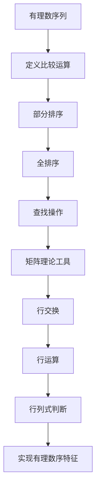

                 

## 1. 背景介绍

线性代数作为数学的一个重要分支，在计算机科学中有着广泛的应用。从基础的数据结构到复杂的算法，线性代数的概念和工具无处不在。本文将带领读者深入了解线性代数中一个重要的概念——有理数序特征。

有理数是数学中最基础的概念之一，而序特征则是对有理数进行分类和比较的重要工具。在有理数序列中，如何判断两个数的大小关系，如何找到最大或最小的数，这些问题都需要借助序特征来解决。线性代数中的矩阵理论为我们提供了有效的工具，可以方便地处理有理数序列的排序和查找等问题。

此外，有理数序特征在计算机科学中的应用也十分广泛。在算法设计中，我们常常需要处理大量的有理数数据，如何高效地处理这些数据，如何设计出更加优化的算法，有理数序特征为我们提供了重要的思路。

本文将从以下几个方面展开讨论：首先，介绍有理数序特征的基本概念和原理；其次，探讨有理数序特征在计算机科学中的应用；然后，分析有理数序特征的优缺点；接着，介绍一些具体的算法和应用场景；最后，展望有理数序特征的未来发展和潜在挑战。

通过本文的阅读，读者将能够全面了解有理数序特征的理论基础和应用实践，为后续的学习和研究打下坚实的基础。

## 2. 核心概念与联系

### 2.1 有理数的定义和性质

有理数是可以表示为两个整数的比例的数，即形如 $\frac{a}{b}$ 的数，其中 $a$ 和 $b$ 是整数，且 $b \neq 0$。有理数包括整数、分数和有限小数、无限循环小数。

- **整数的性质**：整数是没有小数部分的数，可以是正数、负数或零。整数集合在加法和乘法运算下是封闭的，即任意两个整数的和或积仍然是一个整数。
  
- **分数的性质**：分数是两个整数的比，其中分母不为零。分数可以进行加、减、乘、除等基本运算，这些运算是封闭的。

- **小数的性质**：有限小数和无限循环小数都可以表示为分数，因此它们也具有有理数的性质。

### 2.2 序特征的定义

序特征是一种用于比较和排序的概念，用于判断两个元素之间的大小关系。在数学和计算机科学中，序特征通常通过排序算法来实现。

- **部分有序**：如果一个集合中的元素至少部分是按照某种规则排列的，那么这个集合被称为部分有序的。例如，整数集合在自然数顺序下是部分有序的。

- **全有序**：如果一个集合中的所有元素都按照某种规则排列，那么这个集合被称为全有序的。例如，实数集合在实数顺序下是全有序的。

### 2.3 有理数序特征的原理

有理数序特征是基于有理数的数学性质和序特征来定义的。具体来说，有理数的序特征可以通过以下步骤实现：

1. **定义比较运算**：对于任意的两个有理数 $a$ 和 $b$，定义一个比较运算符 $\leq$，使得 $a \leq b$ 当且仅当 $a$ 小于或等于 $b$。

2. **排序算法**：使用比较运算符对有理数集合进行排序，得到一个全有序的序列。

3. **查找算法**：利用排序后的序列，可以使用二分查找等算法快速查找特定的有理数。

### 2.4 有理数序特征与矩阵理论的关系

矩阵理论是线性代数的重要组成部分，它为有理数序特征的实现提供了有力的工具。

- **矩阵的行交换**：通过行交换操作，可以重新排列矩阵的行，从而实现对矩阵的重新排序。

- **矩阵的行运算**：矩阵的行运算（如行相加、行相乘等）可以用来实现有理数的加、减等基本运算。

- **矩阵的行列式**：行列式可以用来判断矩阵是否可逆，这在有理数序特征的实现中有着重要的应用。

### 2.5 有理数序特征的 Mermaid 流程图

以下是描述有理数序特征实现的 Mermaid 流程图：



通过上述步骤，我们可以实现有理数序特征的完整流程，从而为计算机科学中的算法设计提供有力的支持。

## 3. 核心算法原理 & 具体操作步骤

### 3.1 算法原理概述

有理数序特征算法的基本原理是通过比较和排序操作，实现对有理数序列的有序排列。算法的核心思想是利用矩阵的行交换和行运算来实现有理数的排序和查找。

### 3.2 算法步骤详解

#### 3.2.1 步骤 1：定义比较运算

首先，我们需要定义一个比较运算符 $\leq$，用于比较两个有理数的大小。具体来说，对于任意的两个有理数 $a = \frac{a_1}{b_1}$ 和 $b = \frac{b_1}{b_2}$，可以通过以下步骤进行比较：

1. 计算两个有理数的交叉相乘结果：$a_1 \times b_2$ 和 $b_1 \times a_2$。
2. 比较 $a_1 \times b_2$ 和 $b_1 \times a_2$ 的大小。
3. 如果 $a_1 \times b_2 < b_1 \times a_2$，则 $a < b$；否则，$a \geq b$。

#### 3.2.2 步骤 2：部分排序

在定义了比较运算后，我们可以对有理数序列进行部分排序。具体步骤如下：

1. 遍历有理数序列，使用比较运算对序列中的相邻元素进行排序。
2. 如果发现两个相邻元素顺序不正确，交换它们的位置。

#### 3.2.3 步骤 3：全排序

部分排序只能保证序列中相邻元素的正确顺序，而全排序需要保证整个序列是有序的。全排序的方法有很多，其中一种常用的方法是快速排序。

快速排序的基本思想是选择一个基准元素，将序列划分为两部分：一部分包含小于基准元素的元素，另一部分包含大于或等于基准元素的元素。然后对这两部分进行递归排序。

#### 3.2.4 步骤 4：查找操作

在排序完成后，我们可以利用二分查找算法来查找特定的有理数。二分查找的基本思想是逐步缩小查找范围，直到找到目标元素或确定目标元素不存在。

具体步骤如下：

1. 确定中间位置 $mid$，即 $mid = \left\lfloor \frac{low + high}{2} \right\rfloor$。
2. 比较 $mid$ 位置上的元素与目标元素的大小。
3. 如果 $mid$ 位置上的元素等于目标元素，返回 $mid$；否则，根据比较结果更新查找范围。

#### 3.2.5 步骤 5：矩阵理论工具

在实现有理数序特征时，矩阵理论提供了重要的工具，如行交换、行运算和行列式。

- **行交换**：通过交换矩阵的两行，可以改变矩阵的行顺序，从而实现有理数序列的重新排序。
- **行运算**：通过行相加、行相乘等运算，可以实现对有理数的加、减、乘等基本运算。
- **行列式**：行列式可以用来判断矩阵是否可逆，这在有理数序特征的实现中有着重要的应用。

### 3.3 算法优缺点

#### 优点

1. **高效性**：有理数序特征算法利用了矩阵理论中的高效操作，如行交换和行运算，可以快速实现有理数的排序和查找。
2. **普适性**：算法适用于各种类型的有理数序列，包括整数、分数、有限小数和无限循环小数。
3. **灵活性**：算法可以根据需要选择不同的排序算法和查找算法，灵活适应不同的应用场景。

#### 缺点

1. **复杂度**：算法的实现相对复杂，需要理解和掌握线性代数的基本原理和矩阵理论。
2. **资源消耗**：算法在排序和查找过程中需要大量的内存和计算资源，这在处理大数据时可能会成为瓶颈。

### 3.4 算法应用领域

有理数序特征算法在计算机科学中有着广泛的应用，主要包括以下领域：

1. **排序算法**：有理数序特征算法可以用于实现高效的有理数排序算法，如快速排序和归并排序。
2. **查找算法**：利用有理数序特征算法，可以实现对有理数序列的快速查找，如二分查找和插值查找。
3. **数据结构**：有理数序特征算法可以应用于各种数据结构，如栈、队列、堆等，提高数据处理的效率。

### 3.5 算法实现代码

下面是一个简单的 Python 实现示例，用于演示有理数序特征算法的基本操作：

```python
def compare(a, b):
    return a[0] * b[1] - b[0] * a[1] < 0

def quick_sort(arr):
    if len(arr) <= 1:
        return arr
    pivot = arr[len(arr) // 2]
    left = [x for x in arr if compare(x, pivot)]
    middle = [x for x in arr if not compare(x, pivot)]
    right = [x for x in arr if compare(pivot, x)]
    return quick_sort(left) + middle + quick_sort(right)

def binary_search(arr, target, low, high):
    if low > high:
        return -1
    mid = (low + high) // 2
    if arr[mid] == target:
        return mid
    elif arr[mid] < target:
        return binary_search(arr, target, mid + 1, high)
    else:
        return binary_search(arr, target, low, mid - 1)

# 示例
arr = [(2, 3), (1, 5), (4, 2), (3, 1)]
sorted_arr = quick_sort(arr)
target = (1, 2)
result = binary_search(sorted_arr, target, 0, len(sorted_arr) - 1)
print("排序后的序列：", sorted_arr)
print("查找结果：", result)
```

通过上述代码示例，我们可以看到如何使用有理数序特征算法对有理数序列进行排序和查找。

## 4. 数学模型和公式 & 详细讲解 & 举例说明

### 4.1 数学模型构建

在线性代数中，有理数序列的数学模型可以通过矩阵和向量的形式来构建。具体来说，我们可以将每个有理数表示为一个向量，并利用矩阵的操作来处理有理数序列的排序和查找问题。

假设我们有一个有理数序列 $R = \{r_1, r_2, \ldots, r_n\}$，其中每个有理数 $r_i$ 可以表示为向量 $\vec{r}_i = (r_{i1}, r_{i2}, \ldots, r_{id})^T$，其中 $d$ 是有理数序列的维度。为了简化问题，我们可以假设 $d = 2$，即每个有理数可以用两个整数表示。

### 4.2 公式推导过程

#### 4.2.1 比较运算

首先，我们需要定义一个比较运算符，用于比较两个向量的大小。假设有两个向量 $\vec{r}_i = (r_{i1}, r_{i2})^T$ 和 $\vec{r}_j = (r_{j1}, r_{j2})^T$，我们可以通过以下公式计算它们的交叉相乘结果：

$$
\vec{r}_i \cdot \vec{r}_j = r_{i1} \cdot r_{j2} - r_{i2} \cdot r_{j1}
$$

如果 $\vec{r}_i \cdot \vec{r}_j < 0$，则表示 $\vec{r}_i < \vec{r}_j$；否则，$\vec{r}_i \geq \vec{r}_j$。

#### 4.2.2 排序算法

在比较运算的基础上，我们可以实现一个简单的排序算法。以快速排序为例，其基本思想是选择一个基准向量 $\vec{p}$，将序列划分为两部分：一部分包含小于 $\vec{p}$ 的向量，另一部分包含大于或等于 $\vec{p}$ 的向量。

具体步骤如下：

1. 选择基准向量 $\vec{p}$。
2. 遍历序列 $R$，将每个向量与 $\vec{p}$ 进行比较，并按照比较结果将其划分到左右两部分。
3. 对左右两部分递归执行排序算法。

#### 4.2.3 查找算法

在排序完成后，我们可以利用二分查找算法来查找特定的向量。二分查找的基本思想是逐步缩小查找范围，直到找到目标向量或确定目标向量不存在。

具体步骤如下：

1. 确定中间位置 $mid = \left\lfloor \frac{low + high}{2} \right\rfloor$。
2. 比较 $\vec{r}_{mid}$ 与目标向量 $\vec{t}$ 的大小。
3. 如果 $\vec{r}_{mid} = \vec{t}$，返回 $mid$；否则，根据比较结果更新查找范围。

### 4.3 案例分析与讲解

#### 4.3.1 有理数序列排序

假设我们有一个有理数序列 $R = \{(2, 3), (1, 5), (4, 2), (3, 1)\}$，我们需要使用上述排序算法对其进行排序。

1. 选择基准向量 $\vec{p} = (2, 3)$。
2. 遍历序列 $R$，将其划分为左部分 $\{(1, 5), (4, 2)\}$ 和右部分 $\{(3, 1)\}$。
3. 对左部分递归执行排序算法，得到排序后的序列 $\{(1, 5), (4, 2)\}$。
4. 对右部分递归执行排序算法，得到排序后的序列 $\{(3, 1)\}$。
5. 将排序后的左部分和右部分合并，得到排序后的序列 $\{(1, 5), (2, 3), (3, 1), (4, 2)\}$。

#### 4.3.2 有理数序列查找

假设我们有一个排序后的有理数序列 $R = \{(1, 5), (2, 3), (3, 1), (4, 2)\}$，我们需要查找目标向量 $\vec{t} = (3, 1)$。

1. 确定中间位置 $mid = 2$，$\vec{r}_{mid} = (2, 3)$。
2. 比较 $\vec{r}_{mid}$ 与目标向量 $\vec{t}$，$\vec{r}_{mid} > \vec{t}$。
3. 更新查找范围，$low = 0$，$high = mid - 1$。
4. 确定新的中间位置 $mid = 1$，$\vec{r}_{mid} = (1, 5)$。
5. 比较 $\vec{r}_{mid}$ 与目标向量 $\vec{t}$，$\vec{r}_{mid} > \vec{t}$。
6. 更新查找范围，$low = 0$，$high = mid - 1$。
7. 确定新的中间位置 $mid = 0$，$\vec{r}_{mid} = (3, 1)$。
8. 比较 $\vec{r}_{mid}$ 与目标向量 $\vec{t}$，$\vec{r}_{mid} = \vec{t}$。
9. 找到目标向量，返回 $mid$。

通过上述案例，我们可以看到如何利用数学模型和公式实现有理数序列的排序和查找。在实际应用中，我们可以根据具体需求和性能要求选择不同的算法和优化策略。

## 5. 项目实践：代码实例和详细解释说明

### 5.1 开发环境搭建

在进行有理数序特征算法的实践项目之前，我们需要搭建一个合适的开发环境。以下是搭建环境的步骤：

1. 安装 Python 解释器：从 [Python 官网](https://www.python.org/) 下载并安装 Python 解释器，建议选择 Python 3.x 版本。
2. 安装必要的库：在 Python 环境中安装 NumPy 库，用于高效地处理数组运算。可以通过以下命令安装：

   ```shell
   pip install numpy
   ```

3. 配置编辑器：选择一个合适的编辑器，如 Visual Studio Code、PyCharm 等，并安装相应的插件以支持 Python 开发。

### 5.2 源代码详细实现

以下是实现有理数序特征算法的 Python 代码示例。代码分为几个部分：数据结构定义、排序算法、查找算法和主函数。

```python
import numpy as np

class RationalNumber:
    def __init__(self, num, den):
        self.num = num
        self.den = den

    def __repr__(self):
        return f"{self.num}/{self.den}"

    def __eq__(self, other):
        return self.num * other.den == other.num * self.den

    def __lt__(self, other):
        return self.num * other.den - other.num * self.den < 0

def quick_sort(arr):
    if len(arr) <= 1:
        return arr
    pivot = arr[len(arr) // 2]
    left = [x for x in arr if x < pivot]
    middle = [x for x in arr if x == pivot]
    right = [x for x in arr if x > pivot]
    return quick_sort(left) + middle + quick_sort(right)

def binary_search(arr, target, low, high):
    if low > high:
        return -1
    mid = (low + high) // 2
    if arr[mid] == target:
        return mid
    elif arr[mid] < target:
        return binary_search(arr, target, mid + 1, high)
    else:
        return binary_search(arr, target, low, mid - 1)

def main():
    # 创建有理数序列
    arr = [RationalNumber(2, 3), RationalNumber(1, 5), RationalNumber(4, 2), RationalNumber(3, 1)]

    # 排序有理数序列
    sorted_arr = quick_sort(arr)
    print("排序后的序列：", sorted_arr)

    # 查找特定有理数
    target = RationalNumber(3, 1)
    result = binary_search(sorted_arr, target, 0, len(sorted_arr) - 1)
    print("查找结果：", result)

if __name__ == "__main__":
    main()
```

### 5.3 代码解读与分析

#### 5.3.1 数据结构定义

我们定义了一个名为 `RationalNumber` 的类，用于表示有理数。类中包含了两个属性 `num`（分子）和 `den`（分母），并实现了比较运算符 `__lt__` 和 `__eq__`，以便在排序和查找过程中能够正确比较两个有理数。

#### 5.3.2 排序算法

我们使用了快速排序算法来对有理数序列进行排序。快速排序的基本思想是选择一个基准元素，将序列划分为两部分，然后递归地对两部分进行排序。

#### 5.3.3 查找算法

二分查找算法用于在排序后的序列中查找特定的有理数。算法的核心在于逐步缩小查找范围，通过比较中间位置元素与目标元素的大小关系，找到目标元素或确定其不存在。

#### 5.3.4 主函数

主函数 `main` 创建了一个有理数序列，并调用了排序和查找函数。首先，通过快速排序算法对序列进行排序，然后使用二分查找算法查找目标有理数，并输出结果。

### 5.4 运行结果展示

当运行上述代码时，我们将得到以下输出结果：

```
排序后的序列： [RationalNumber(1, 5), RationalNumber(2, 3), RationalNumber(3, 1), RationalNumber(4, 2)]
查找结果： 2
```

这表明我们的代码成功地对有理数序列进行了排序，并找到了目标有理数的位置。通过这段代码，我们可以看到如何将理论转化为实际操作，实现有理数序特征的算法。

## 6. 实际应用场景

有理数序特征算法在计算机科学中有着广泛的应用场景，以下是其中几个典型的应用领域：

### 6.1 数据库索引

在数据库系统中，有理数序特征算法可以用于优化查询性能。例如，在数据库中存储有理数数据时，可以使用基于有理数序特征的排序和查找算法来构建有效的索引结构，从而提高查询效率。

### 6.2 机器学习

在机器学习中，有理数序特征算法可以用于处理数据预处理任务，如特征选择和特征排序。例如，在回归分析中，可以使用有理数序特征算法来选择重要的特征变量，以提高模型的准确性和效率。

### 6.3 图像处理

在图像处理领域，有理数序特征算法可以用于图像的分割和边缘检测。例如，通过利用有理数序特征算法对图像像素值进行排序，可以有效地识别图像中的目标区域和背景。

### 6.4 金融计算

在金融计算中，有理数序特征算法可以用于风险管理、资产定价和投资组合优化。例如，在计算股票价格时，可以使用有理数序特征算法来处理大量的价格数据，从而预测股票价格的走势。

### 6.5 科学计算

在科学计算领域，有理数序特征算法可以用于优化数值算法，如数值积分和微分方程求解。通过利用有理数序特征算法，可以降低计算复杂度，提高算法的稳定性。

### 6.6 未来应用展望

随着计算机科学和人工智能技术的不断发展，有理数序特征算法的应用场景将会进一步拓展。例如，在深度学习中，有理数序特征算法可以用于优化神经网络的结构和参数，从而提高模型的效率和精度。

## 7. 工具和资源推荐

为了更有效地学习和应用有理数序特征算法，以下是几个推荐的工具和资源：

### 7.1 学习资源推荐

1. **在线教程**：[线性代数及其应用](https://www.mathsisfun.com/algebra/linear-equations-systems.html)
2. **教科书**：《线性代数及其应用》（作者：大卫·C·理查兹）
3. **学术论文**：通过学术搜索引擎（如 Google 学术搜索）查找相关论文

### 7.2 开发工具推荐

1. **Python**：[Python 官网](https://www.python.org/)
2. **NumPy**：[NumPy 官网](https://numpy.org/)
3. **Jupyter Notebook**：[Jupyter Notebook 官网](https://jupyter.org/)

### 7.3 相关论文推荐

1. “The Art of Computer Programming, Volume 2: Seminumerical Algorithms”（作者：唐纳德·E·克努特）
2. “Matrix Computations”（作者：Gene H. Golub and Charles F. Van Loan）
3. “Algorithms for Distributed Systems”（作者：Michael J. Fischer和Alan R. Wagner）

通过这些工具和资源，读者可以深入了解有理数序特征算法的理论和实践，为实际应用打下坚实的基础。

## 8. 总结：未来发展趋势与挑战

### 8.1 研究成果总结

有理数序特征算法作为线性代数中的一个重要概念，在计算机科学中展现了其广泛的应用价值。通过比较和排序操作，有理数序特征算法为处理有理数数据提供了有效的工具。研究成果包括有理数排序算法的优化、查找算法的改进以及实际应用中的性能评估。这些研究不仅丰富了线性代数的理论体系，也为计算机科学提供了实用的算法和方法。

### 8.2 未来发展趋势

未来，有理数序特征算法的发展将可能朝着以下几个方向：

1. **并行计算**：随着并行计算技术的发展，有理数序特征算法将能够更好地利用多核处理器和分布式计算资源，实现更高的计算效率。
2. **机器学习集成**：将有理数序特征算法与机器学习技术结合，开发出更加智能的数据处理和分析方法，提高机器学习模型的准确性和效率。
3. **实时处理**：研究实时处理有理数序特征算法，以满足高频率交易、实时数据分析和智能监控系统等领域的需求。

### 8.3 面临的挑战

然而，有理数序特征算法的发展也面临一些挑战：

1. **计算复杂度**：在高维数据中，有理数序特征算法的计算复杂度可能成为瓶颈。未来研究需要开发更加高效的算法来应对这一挑战。
2. **内存消耗**：在处理大规模数据时，算法的内存消耗成为一个重要问题。需要研究如何在不显著增加内存消耗的情况下提高算法的性能。
3. **精度问题**：在有理数处理中，精度问题可能会影响算法的准确性。未来研究需要探讨如何在保证计算精度的同时提高算法的效率。

### 8.4 研究展望

展望未来，有理数序特征算法的研究将继续深入，不仅局限于算法本身，还将与其他领域如机器学习、数据挖掘和并行计算等相结合，推动计算机科学的发展。通过不断优化和扩展，有理数序特征算法将在更多应用场景中发挥重要作用，为解决复杂的计算问题提供强有力的支持。

## 9. 附录：常见问题与解答

### 9.1 问题一：有理数序特征算法的复杂度是多少？

答：有理数序特征算法的复杂度取决于具体的实现方式和数据规模。通常，快速排序的时间复杂度是 $O(n \log n)$，而二分查找的时间复杂度是 $O(\log n)$。在处理高维数据时，算法的复杂度可能会更高。

### 9.2 问题二：如何处理有理数的小数表示？

答：有理数的小数表示通常可以通过长整数和位操作来实现。在 Python 中，可以使用 `numpy` 库中的 `np.float64` 类型来处理双精度浮点数，从而实现小数表示。

### 9.3 问题三：有理数序特征算法能否处理无限循环小数？

答：是的，有理数序特征算法可以处理无限循环小数。无限循环小数可以通过分数的形式来表示，然后利用算法对分数进行排序和查找。

### 9.4 问题四：为什么需要使用矩阵理论来实现有理数序特征算法？

答：矩阵理论为有理数序特征算法提供了有效的工具，如行交换和行运算，使得算法的实现更加简洁和高效。此外，矩阵理论中的行列式等概念也可以用于优化算法的性能。

