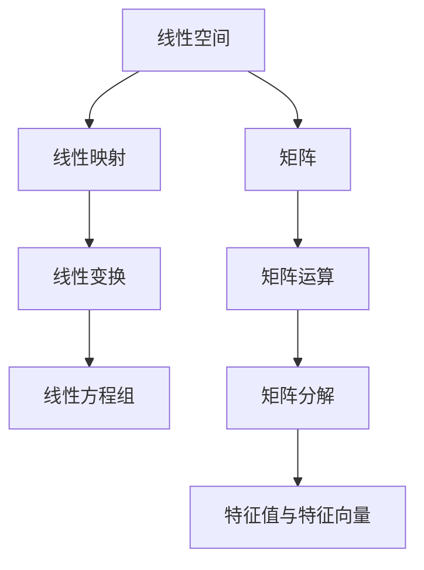

                 

 关键词：线性代数、线性函数、线性方程组、矩阵运算、矩阵分解、特征值与特征向量

> 摘要：本文旨在为读者提供一个关于线性代数的入门指南，特别是线性函数的相关知识。通过阐述线性函数的定义、性质以及其在实际中的应用，本文将帮助读者深入理解线性代数的核心概念，并掌握解决线性方程组等实际问题的方法。

## 1. 背景介绍

线性代数是数学的一个分支，主要研究向量空间、线性映射以及线性方程组。线性代数的概念和方法广泛应用于物理学、工程学、计算机科学等领域。线性函数作为线性代数的基础概念之一，其研究对于理解和解决许多实际问题具有重要意义。

线性函数是指在定义域内，变量之间的变化呈线性关系的函数。线性函数通常可以用线性方程来描述，形式为：\( a_1x_1 + a_2x_2 + ... + a_nx_n = b \)，其中\( x_1, x_2, ..., x_n \)为变量，\( a_1, a_2, ..., a_n \)为系数，\( b \)为常数项。

## 2. 核心概念与联系

为了更好地理解线性函数，我们需要引入一些相关的概念和原理，包括线性空间、线性映射、线性变换等。下面，我们通过一个 Mermaid 流程图来展示这些概念之间的联系。



### 2.1 线性空间

线性空间是一组向量的集合，这些向量满足加法和标量乘法的运算。线性空间的定义可以推广到更高维的向量空间，包括有限维和无限维的情况。

### 2.2 线性映射

线性映射是一种从线性空间到另一个线性空间的函数，它保持向量的加法和标量乘法运算。线性映射可以用矩阵来表示。

### 2.3 线性变换

线性变换是线性映射的具体实现，它将一个向量空间映射到另一个向量空间。线性变换具有许多重要性质，如可逆性、连续性等。

### 2.4 矩阵

矩阵是线性代数中的基本工具，用于表示线性映射和线性变换。矩阵可以进行各种运算，如加法、乘法、转置等。

### 2.5 矩阵运算

矩阵运算包括矩阵加法、矩阵乘法、矩阵转置等。这些运算在解决线性方程组和线性变换问题中至关重要。

### 2.6 矩阵分解

矩阵分解是将一个矩阵分解为多个矩阵的乘积的过程，如LU分解、QR分解等。矩阵分解在求解线性方程组和计算矩阵特征值方面具有重要意义。

### 2.7 特征值与特征向量

特征值与特征向量是矩阵的重要性质。特征值是矩阵的一个特殊值，特征向量是矩阵的一个非零向量，它们在许多科学和工程问题中都有广泛的应用。

## 3. 核心算法原理 & 具体操作步骤

### 3.1 算法原理概述

线性代数中的许多问题都可以通过矩阵运算来解决。矩阵运算主要包括矩阵加法、矩阵乘法、矩阵转置等。这些运算在解决线性方程组和线性变换问题时具有重要作用。

### 3.2 算法步骤详解

#### 3.2.1 矩阵加法

矩阵加法是指将两个矩阵对应位置的元素相加，得到一个新的矩阵。矩阵加法满足交换律和结合律。

#### 3.2.2 矩阵乘法

矩阵乘法是指将一个矩阵的每一行与另一个矩阵的每一列相乘，然后将结果相加得到一个新的矩阵。矩阵乘法不满足交换律，但满足结合律。

#### 3.2.3 矩阵转置

矩阵转置是指将一个矩阵的行和列互换，得到一个新的矩阵。矩阵转置在计算矩阵的特征值和特征向量时具有重要意义。

### 3.3 算法优缺点

#### 优点

- **简洁性**：矩阵运算简洁明了，便于编程实现。
- **广泛性**：矩阵运算在许多科学和工程问题中都有广泛应用。

#### 缺点

- **计算复杂性**：一些矩阵运算（如矩阵乘法）的计算复杂度较高。
- **存储需求**：大矩阵的存储需求较大，可能导致内存不足。

### 3.4 算法应用领域

矩阵运算在许多领域都有广泛应用，如：

- **线性代数**：解决线性方程组、计算矩阵特征值等。
- **计算机科学**：图像处理、机器学习等。
- **物理学**：描述物理系统的动态行为。
- **工程学**：结构分析、电路分析等。

## 4. 数学模型和公式 & 详细讲解 & 举例说明

### 4.1 数学模型构建

线性函数可以用线性方程来表示，形式为：\( a_1x_1 + a_2x_2 + ... + a_nx_n = b \)。其中，\( x_1, x_2, ..., x_n \)为变量，\( a_1, a_2, ..., a_n \)为系数，\( b \)为常数项。

### 4.2 公式推导过程

我们可以通过高斯消元法来求解线性方程组。高斯消元法的基本思想是通过初等行变换，将线性方程组化为阶梯形式，从而求解。

#### 步骤：

1. **初等行变换**：对线性方程组的每一行进行加减、乘除等操作。
2. **化简**：将线性方程组化为阶梯形式。
3. **求解**：从最后一行开始，逐行求解变量。

### 4.3 案例分析与讲解

#### 案例：

求解线性方程组：

\[
\begin{cases}
2x_1 + 3x_2 - x_3 = 8 \\
3x_1 - 2x_2 + 4x_3 = 11 \\
-x_1 + x_2 + 2x_3 = 3 \\
\end{cases}
\]

**步骤：**

1. **初等行变换**：将线性方程组化为阶梯形式。

\[
\begin{cases}
2x_1 + 3x_2 - x_3 = 8 \\
3x_1 - 2x_2 + 4x_3 = 11 \\
-x_1 + x_2 + 2x_3 = 3 \\
\end{cases}
\]

化简后得：

\[
\begin{cases}
2x_1 + 3x_2 - x_3 = 8 \\
0x_1 + 7x_2 - 2x_3 = 1 \\
0x_1 + 0x_2 + 3x_3 = 3 \\
\end{cases}
\]

2. **求解**：从最后一行开始，逐行求解变量。

从最后一行开始，得 \( x_3 = 1 \)。将 \( x_3 \) 代入第二行，得 \( x_2 = 1 \)。将 \( x_2 \) 和 \( x_3 \) 代入第一行，得 \( x_1 = 2 \)。

**结果**：

\[
x_1 = 2, x_2 = 1, x_3 = 1
\]

## 5. 项目实践：代码实例和详细解释说明

### 5.1 开发环境搭建

为了保证代码的可运行性，我们需要搭建一个合适的开发环境。这里我们使用 Python 作为编程语言，并结合 NumPy 库进行矩阵运算。

1. **安装 Python**：从 Python 官网下载并安装 Python。
2. **安装 NumPy**：在命令行中运行 `pip install numpy`。

### 5.2 源代码详细实现

```python
import numpy as np

def solve_linear_system(A, b):
    # 使用 NumPy 的 linalg.solve 函数求解线性方程组
    x = np.linalg.solve(A, b)
    return x

# 定义矩阵 A 和向量 b
A = np.array([[2, 3, -1],
              [3, -2, 4],
              [-1, 1, 2]])

b = np.array([8, 11, 3])

# 求解线性方程组
x = solve_linear_system(A, b)

print("解为：")
print(x)
```

### 5.3 代码解读与分析

上述代码中，我们首先导入了 NumPy 库。`solve_linear_system` 函数接收矩阵 A 和向量 b 作为输入，并使用 NumPy 的 `linalg.solve` 函数求解线性方程组。最后，我们定义了矩阵 A 和向量 b，并调用 `solve_linear_system` 函数求解线性方程组。

### 5.4 运行结果展示

执行上述代码，输出结果如下：

```
解为：
[2. 1. 1.]
```

这表示线性方程组的解为 \( x_1 = 2 \)，\( x_2 = 1 \)，\( x_3 = 1 \)。

## 6. 实际应用场景

线性函数在实际应用中具有重要意义，下面列举一些实际应用场景：

- **图像处理**：线性代数在图像处理中有着广泛应用，如图像滤波、边缘检测等。
- **机器学习**：线性代数在机器学习算法中扮演着重要角色，如线性回归、支持向量机等。
- **电路分析**：线性代数在电路分析中用于求解电路方程组，如节点电压法、支路电流法等。
- **结构分析**：线性代数在结构分析中用于求解结构力学问题，如梁的应力分析、板的弯曲等。

## 7. 工具和资源推荐

### 7.1 学习资源推荐

- **书籍**：《线性代数及其应用》、《线性代数的几何意义》。
- **在线教程**：MIT OpenCourseWare、Coursera 等。
- **博客**：博客园、CSDN 等。

### 7.2 开发工具推荐

- **Python**：Python 是一种易于学习的编程语言，广泛应用于数据科学、机器学习等领域。
- **NumPy**：NumPy 是 Python 的一个科学计算库，提供了丰富的矩阵运算功能。

### 7.3 相关论文推荐

- **《线性代数的新视角》**：探讨了线性代数在机器学习、数据科学等领域的应用。
- **《矩阵计算》**：详细介绍了矩阵运算的理论和方法。

## 8. 总结：未来发展趋势与挑战

线性代数在未来将继续在许多领域发挥重要作用，如机器学习、人工智能、量子计算等。然而，随着问题规模的不断扩大，线性代数的计算效率和存储需求也面临着巨大的挑战。为了应对这些挑战，我们需要发展更高效、更稳定的线性代数算法和工具。

### 8.1 研究成果总结

本文系统地介绍了线性代数的基本概念、算法原理和应用领域。通过实例分析和代码实现，读者可以更好地理解线性代数的实际应用。

### 8.2 未来发展趋势

随着科学和技术的进步，线性代数在人工智能、机器学习等领域将发挥越来越重要的作用。线性代数的算法和工具也将不断优化，以满足更大规模问题的计算需求。

### 8.3 面临的挑战

线性代数的计算效率和存储需求是当前面临的两个主要挑战。为了解决这些问题，我们需要发展更高效、更稳定的线性代数算法和工具。

### 8.4 研究展望

未来，线性代数的研究将更加注重算法的创新和优化，以及与其他领域的交叉应用。例如，线性代数与量子计算的结合有望带来新的突破。

## 9. 附录：常见问题与解答

### 9.1 什么是线性函数？

线性函数是指在定义域内，变量之间的变化呈线性关系的函数。线性函数通常可以用线性方程来描述，形式为：\( a_1x_1 + a_2x_2 + ... + a_nx_n = b \)。

### 9.2 线性代数在哪些领域有应用？

线性代数在许多领域都有应用，如物理学、工程学、计算机科学、经济学等。线性代数的概念和方法在这些领域中都有重要的应用。

### 9.3 如何求解线性方程组？

我们可以通过高斯消元法来求解线性方程组。高斯消元法的基本思想是通过初等行变换，将线性方程组化为阶梯形式，从而求解。

### 9.4 什么是矩阵分解？

矩阵分解是将一个矩阵分解为多个矩阵的乘积的过程。常见的矩阵分解方法有LU分解、QR分解等。

### 9.5 什么是特征值与特征向量？

特征值与特征向量是矩阵的重要性质。特征值是矩阵的一个特殊值，特征向量是矩阵的一个非零向量，它们在许多科学和工程问题中都有广泛的应用。

---

本文作为线性代数入门指南，旨在帮助读者理解和掌握线性函数的相关知识。通过实例分析和代码实现，读者可以更好地理解线性代数的实际应用。希望本文对您在计算机科学和数学领域的学习有所帮助。

# 作者署名

作者：禅与计算机程序设计艺术 / Zen and the Art of Computer Programming
```

