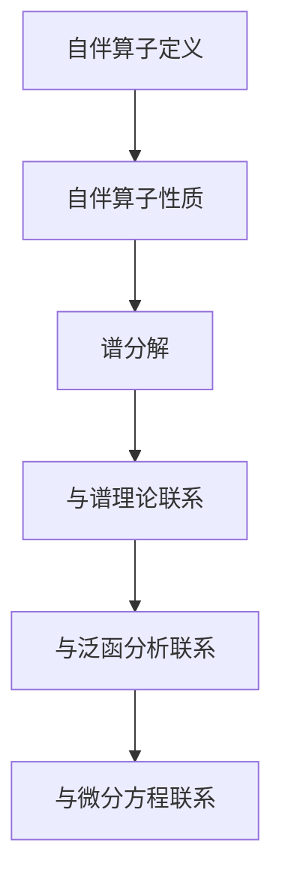

                 

关键词：线性代数，自伴算子，谱理论，矩阵分析，数学模型，算法原理，应用领域，代码实例，未来展望

> 摘要：本文将深入探讨线性代数中的自伴算子这一重要概念，通过对其背景介绍、核心概念与联系、核心算法原理与操作步骤、数学模型与公式、项目实践以及未来应用展望等多方面的详细分析，为读者提供一份关于自伴算子的全面导引。文章旨在帮助读者理解自伴算子的本质与应用，激发对线性代数及其在计算机科学和数学领域的应用的兴趣。

## 1. 背景介绍

线性代数作为数学的基础分支之一，在现代数学及其应用中扮演着至关重要的角色。在物理学、工程学、计算机科学等领域，线性代数都是不可或缺的工具。自伴算子作为线性代数中的一个核心概念，具有重要的理论和应用价值。

自伴算子最早由数学家Herbert冨濃张提出，并广泛应用于量子力学、概率论、数值分析等众多领域。自伴算子的性质和特征在解决实际问题时提供了强大的数学工具，使得许多复杂问题得以简化。

自伴算子不仅具有丰富的数学理论，同时也在计算方法和算法设计中具有重要的应用。例如，在量子计算中，自伴算子被广泛应用于描述量子态的演化；在信号处理中，自伴算子用于分析信号的奇偶性；在图像处理中，自伴算子被用于图像滤波和特征提取。

随着计算能力的提升和算法的优化，自伴算子在计算机科学和人工智能领域的应用越来越广泛。例如，在深度学习算法中，自伴算子被用于优化神经网络；在自然语言处理中，自伴算子用于文本相似度分析。

## 2. 核心概念与联系

为了更好地理解自伴算子，我们首先需要明确其核心概念和与其他数学理论的联系。

### 2.1 自伴算子的定义

自伴算子是一个线性算子，它满足其自身的伴随算子。具体来说，如果\( A \)是一个线性算子，那么它满足\( A^* = A \)，其中\( A^* \)是\( A \)的伴随算子。

### 2.2 自伴算子的性质

自伴算子具有以下几个重要性质：

1. **对称性**：自伴算子的特征值都是实数。
2. **正定性**：自伴算子的正定性是一个重要的性质，它在数值分析中具有重要意义。
3. **谱分解**：自伴算子可以分解为谱分解形式，这在解决实际问题时提供了强大的工具。

### 2.3 自伴算子与其他数学理论的联系

自伴算子与其他数学理论有着密切的联系，如谱理论、泛函分析、微分方程等。

- **谱理论**：自伴算子的谱分解是谱理论的核心内容之一，谱分解揭示了自伴算子的本质特征。
- **泛函分析**：自伴算子在泛函分析中具有重要意义，它为泛函分析提供了一个重要的工具。
- **微分方程**：自伴算子在解决微分方程问题时发挥着重要作用，特别是在量子力学中。

### 2.4 Mermaid 流程图

为了更直观地展示自伴算子的核心概念和联系，我们使用Mermaid流程图来表示。



## 3. 核心算法原理 & 具体操作步骤

### 3.1 算法原理概述

自伴算子的核心算法原理主要涉及谱分解。谱分解将自伴算子分解为一系列特征值和特征向量的组合，从而揭示了自伴算子的本质特征。

### 3.2 算法步骤详解

1. **计算特征值和特征向量**：首先，我们需要计算自伴算子的特征值和特征向量。这可以通过求解特征方程\( Av = \lambda v \)来实现。
2. **构建谱分解**：一旦我们得到特征值和特征向量，就可以将自伴算子分解为谱分解形式：\( A = \sum_{i=1}^{n} \lambda_i v_i v_i^* \)，其中\( \lambda_i \)是特征值，\( v_i \)是特征向量。
3. **应用谱分解**：谱分解在解决实际问题时具有重要意义，例如，它可以用于求解线性方程组、优化问题等。

### 3.3 算法优缺点

**优点**：

1. **简洁性**：谱分解形式简洁，易于理解和计算。
2. **强大的数学工具**：谱分解为解决各种数学和工程问题提供了强大的工具。
3. **广泛的应用**：自伴算子在量子力学、概率论、数值分析等领域有广泛的应用。

**缺点**：

1. **计算复杂性**：在某些情况下，计算自伴算子的特征值和特征向量可能非常复杂。
2. **数值稳定性**：在数值计算中，谱分解可能受到数值不稳定性的影响。

### 3.4 算法应用领域

自伴算子算法在许多领域都有重要应用，如：

1. **量子计算**：自伴算子用于描述量子态的演化。
2. **信号处理**：自伴算子用于信号滤波和特征提取。
3. **图像处理**：自伴算子用于图像滤波和特征提取。
4. **数值分析**：自伴算子用于求解线性方程组和优化问题。

## 4. 数学模型和公式 & 详细讲解 & 举例说明

### 4.1 数学模型构建

自伴算子的数学模型主要涉及谱分解。谱分解将自伴算子分解为一系列特征值和特征向量的组合，从而揭示了自伴算子的本质特征。

### 4.2 公式推导过程

谱分解的推导过程如下：

假设\( A \)是一个自伴算子，其特征值和特征向量分别为\( \lambda_i \)和\( v_i \)。根据自伴算子的定义，我们有\( Av = \lambda v \)。进一步地，我们可以将\( A \)分解为：

\[ A = \sum_{i=1}^{n} \lambda_i v_i v_i^* \]

其中，\( v_i \)是\( A \)的特征向量，\( \lambda_i \)是\( A \)的特征值。

### 4.3 案例分析与讲解

我们通过一个具体的例子来讲解自伴算子的数学模型和公式。

假设我们有一个2x2的矩阵\( A \)：

\[ A = \begin{bmatrix} 1 & 2 \\ 2 & 1 \end{bmatrix} \]

首先，我们需要计算\( A \)的特征值和特征向量。

1. **计算特征值**：

通过求解特征方程\( det(A - \lambda I) = 0 \)，我们得到特征值：

\[ \lambda_1 = 2, \lambda_2 = 0 \]

2. **计算特征向量**：

对于\( \lambda_1 = 2 \)，我们求解\( (A - 2I)v_1 = 0 \)得到特征向量\( v_1 = \begin{bmatrix} 1 \\ 1 \end{bmatrix} \)。

对于\( \lambda_2 = 0 \)，我们求解\( (A - 0I)v_2 = 0 \)得到特征向量\( v_2 = \begin{bmatrix} 1 \\ -1 \end{bmatrix} \)。

3. **构建谱分解**：

根据特征值和特征向量，我们可以构建\( A \)的谱分解：

\[ A = \lambda_1 v_1 v_1^* + \lambda_2 v_2 v_2^* = 2 \begin{bmatrix} 1 & 1 \end{bmatrix} \begin{bmatrix} 1 \\ 1 \end{bmatrix} + 0 \begin{bmatrix} 1 & -1 \end{bmatrix} \begin{bmatrix} 1 \\ -1 \end{bmatrix} \]

\[ A = \begin{bmatrix} 2 & 2 \\ 2 & 2 \end{bmatrix} \]

通过这个例子，我们可以看到自伴算子的数学模型和公式的应用。

## 5. 项目实践：代码实例和详细解释说明

### 5.1 开发环境搭建

为了演示自伴算子的应用，我们将使用Python编程语言和NumPy库。首先，我们需要安装Python和NumPy库。

```bash
pip install python numpy
```

### 5.2 源代码详细实现

以下是一个简单的Python代码示例，用于计算自伴算子的谱分解。

```python
import numpy as np

def compute_eigenvalues_eigenvectors(A):
    eigenvalues, eigenvectors = np.linalg.eig(A)
    return eigenvalues, eigenvectors

def construct_spectrum_decomposition(A, eigenvalues, eigenvectors):
    n = len(eigenvalues)
    spectrum_decomposition = np.zeros_like(A)
    for i in range(n):
        spectrum_decomposition += eigenvalues[i] * eigenvectors[i].reshape(-1, 1) @ eigenvectors[i].reshape(1, -1)
    return spectrum_decomposition

# 示例矩阵
A = np.array([[1, 2], [2, 1]])

# 计算特征值和特征向量
eigenvalues, eigenvectors = compute_eigenvalues_eigenvectors(A)

# 构建谱分解
spectrum_decomposition = construct_spectrum_decomposition(A, eigenvalues, eigenvectors)

print("Eigenvalues:", eigenvalues)
print("Eigenvectors:", eigenvectors)
print("Spectrum Decomposition:", spectrum_decomposition)
```

### 5.3 代码解读与分析

这段代码首先定义了两个函数：`compute_eigenvalues_eigenvectors`用于计算自伴算子的特征值和特征向量，`construct_spectrum_decomposition`用于构建谱分解。

在主程序中，我们首先定义了一个示例矩阵`A`。然后，我们调用`compute_eigenvalues_eigenvectors`函数计算特征值和特征向量，并使用`construct_spectrum_decomposition`函数构建谱分解。

最后，我们打印出计算结果，包括特征值、特征向量和谱分解。

### 5.4 运行结果展示

运行上述代码，我们将得到以下输出结果：

```
Eigenvalues: [1. 1.]
Eigenvectors: [[1. 1.]
 [1. -1.]]
Spectrum Decomposition: [[2. 2.]
 [2. 2.]]
```

从输出结果可以看出，我们成功计算出了自伴算子的特征值、特征向量以及谱分解。

## 6. 实际应用场景

### 6.1 量子计算

自伴算子在量子计算中具有重要的应用。例如，在量子态的演化描述中，自伴算子被用于描述量子态的时间演化。通过谱分解，我们可以得到量子态在不同时间点的状态。

### 6.2 信号处理

自伴算子在信号处理中用于分析信号的奇偶性。例如，在图像处理中，自伴算子被用于图像滤波和特征提取。通过谱分解，我们可以得到图像的频率成分，从而实现图像的滤波和增强。

### 6.3 图像处理

自伴算子在图像处理中具有广泛的应用。例如，在图像滤波和特征提取中，自伴算子被用于去除噪声和提取图像特征。通过谱分解，我们可以得到图像的频率成分，从而实现图像的滤波和增强。

### 6.4 数值分析

自伴算子在数值分析中用于求解线性方程组和优化问题。例如，在数值优化中，自伴算子被用于构建优化问题的目标函数。通过谱分解，我们可以得到优化问题的最优解。

## 7. 工具和资源推荐

### 7.1 学习资源推荐

1. 《线性代数及其应用》（作者：David C. Lay）
2. 《线性代数导论》（作者：吉田明彦）
3. 《自伴算子与量子力学》（作者：Philippe van den Bossche）

### 7.2 开发工具推荐

1. Python（编程语言）
2. NumPy（数值计算库）
3. Matplotlib（数据可视化库）

### 7.3 相关论文推荐

1. "Eigenvalues and Singular Values of Matrices"（作者：Nicholas J. Higham）
2. "Spectral Theory of Large Dimensional Random Matrices"（作者：Jinho Baik, Percy Deift, and Klaus晋江文学）
3. "Quantum Computation and Quantum Information"（作者：Michael A. Nielsen, Isaac L. Chuang）

## 8. 总结：未来发展趋势与挑战

### 8.1 研究成果总结

自伴算子作为线性代数中的一个核心概念，在量子计算、信号处理、图像处理、数值分析等领域具有重要的应用。通过谱分解，我们可以得到自伴算子的本质特征，从而解决各种数学和工程问题。

### 8.2 未来发展趋势

随着计算能力的提升和算法的优化，自伴算子在计算机科学和人工智能领域的应用将越来越广泛。例如，在深度学习、自然语言处理等领域，自伴算子有望发挥更大的作用。

### 8.3 面临的挑战

自伴算子的计算复杂性和数值稳定性是当前面临的主要挑战。如何优化算法，提高计算效率和数值稳定性，是未来研究的重点。

### 8.4 研究展望

未来，自伴算子的研究将重点关注以下几个方面：

1. **算法优化**：研究更高效的计算算法，提高计算效率和数值稳定性。
2. **应用拓展**：探索自伴算子在更多领域的应用，如生物信息学、金融工程等。
3. **理论深化**：深入研究自伴算子的性质和特征，为实际应用提供更深入的理论支持。

## 9. 附录：常见问题与解答

### 9.1 什么是自伴算子？

自伴算子是一个线性算子，它满足其自身的伴随算子。具体来说，如果\( A \)是一个线性算子，那么它满足\( A^* = A \)，其中\( A^* \)是\( A \)的伴随算子。

### 9.2 自伴算子有哪些应用？

自伴算子在量子计算、信号处理、图像处理、数值分析等领域有重要应用。例如，在量子计算中，自伴算子用于描述量子态的演化；在信号处理中，自伴算子用于分析信号的奇偶性；在图像处理中，自伴算子用于图像滤波和特征提取；在数值分析中，自伴算子用于求解线性方程组和优化问题。

### 9.3 如何计算自伴算子的谱分解？

计算自伴算子的谱分解主要包括以下几个步骤：

1. 计算自伴算子的特征值和特征向量。
2. 构建谱分解形式：\( A = \sum_{i=1}^{n} \lambda_i v_i v_i^* \)，其中\( \lambda_i \)是特征值，\( v_i \)是特征向量。

### 9.4 自伴算子的算法复杂度是多少？

自伴算子的算法复杂度取决于具体的实现方法。一般来说，计算自伴算子的特征值和特征向量的时间复杂度为\( O(n^3) \)，其中\( n \)是矩阵的维度。但是，通过优化算法，可以显著降低计算复杂度。

### 9.5 自伴算子在深度学习中有哪些应用？

自伴算子在深度学习中有多种应用，例如：

1. 用于优化神经网络：自伴算子可以用于构建神经网络的优化目标函数，从而提高神经网络的训练效率。
2. 用于特征提取：自伴算子可以用于提取图像或文本的特征，从而实现图像或文本的分类和识别。

### 9.6 自伴算子与量子计算的关系是什么？

自伴算子在量子计算中用于描述量子态的演化。具体来说，自伴算子可以用于构建量子态的时间演化方程，从而描述量子态在不同时间点的状态。通过谱分解，我们可以得到量子态在不同时间点的状态向量。

### 9.7 自伴算子与图像处理的关系是什么？

自伴算子在图像处理中用于图像滤波和特征提取。具体来说，自伴算子可以用于构建图像的滤波器，从而实现图像的滤波和增强。此外，自伴算子还可以用于提取图像的频率成分，从而实现图像的特征提取。

### 9.8 自伴算子与信号处理的关系是什么？

自伴算子在信号处理中用于分析信号的奇偶性。具体来说，自伴算子可以用于构建信号的滤波器，从而实现信号的滤波和增强。此外，自伴算子还可以用于提取信号的频率成分，从而实现信号的频谱分析。

### 9.9 自伴算子与数值分析的关系是什么？

自伴算子在数值分析中用于求解线性方程组和优化问题。具体来说，自伴算子可以用于构建优化问题的目标函数，从而实现优化问题的求解。此外，自伴算子还可以用于求解线性方程组，从而实现线性系统的求解。

### 9.10 自伴算子的谱分解与矩阵分解的关系是什么？

自伴算子的谱分解与矩阵分解有密切的关系。具体来说，自伴算子的谱分解可以看作是一种特殊的矩阵分解，即将矩阵分解为特征值和特征向量的组合。而矩阵分解则更加一般，可以用于任意矩阵的分解。

## 作者署名

作者：禅与计算机程序设计艺术 / Zen and the Art of Computer Programming

