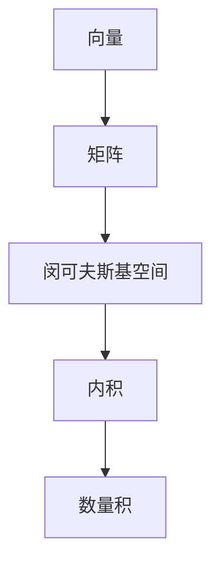

                 

关键词：线性代数，闵可夫斯基空间，向量，矩阵，数学模型，算法，计算机编程，科学计算

> 摘要：本文旨在为广大计算机科学和工程领域的读者提供一部关于线性代数与闵可夫斯基空间的深入导引。文章首先回顾了线性代数的基本概念，随后引入了闵可夫斯基空间的定义和特性，探讨了其在计算机图形学、物理模拟和信号处理等多个领域的应用。通过数学模型和公式的详细讲解，读者能够更好地理解闵可夫斯基空间的内部结构及其运算规律。文章的最后，通过一个实际的项目实践，展示了如何在编程中运用线性代数解决实际问题。

## 1. 背景介绍

线性代数作为现代数学的核心分支，与计算机科学、物理学、工程学等多个领域都有着紧密的联系。它不仅提供了描述和解决复杂系统问题的数学工具，还帮助我们更好地理解自然界和人类社会的运行机制。在计算机科学中，线性代数被广泛应用于图形学、机器学习、物理模拟、信号处理等多个领域。

本文将聚焦于线性代数中的一个重要概念——闵可夫斯基空间。闵可夫斯基空间最初由数学家赫尔曼·闵可夫斯基提出，并在相对论和量子力学中扮演了关键角色。它不仅是一个数学结构，也是物理学中描述多维度空间和事件的理想工具。

随着计算机技术的发展，闵可夫斯基空间的应用场景不断扩展。例如，在计算机图形学中，闵可夫斯基空间用于描述三维空间中的向量运算；在物理模拟中，它用于模拟多体系统的运动；在信号处理中，它用于处理复杂数据信号。因此，理解闵可夫斯基空间及其相关算法对于现代科技领域的从业人员来说至关重要。

本文将依次介绍以下内容：

1. **核心概念与联系**：详细介绍闵可夫斯基空间的基本概念、定义及其与其他数学结构的联系。
2. **核心算法原理与操作步骤**：阐述闵可夫斯基空间相关算法的基本原理和具体操作步骤，分析其优缺点和应用领域。
3. **数学模型和公式**：通过数学模型和公式，深入讲解闵可夫斯基空间的运算规律和性质。
4. **项目实践**：通过具体项目实践，展示如何在实际编程中运用闵可夫斯基空间解决具体问题。
5. **实际应用场景**：探讨闵可夫斯基空间在不同领域的实际应用，并展望其未来的发展方向。

## 2. 核心概念与联系

### 2.1 向量与矩阵

在讨论闵可夫斯基空间之前，我们需要了解两个基本的数学概念：向量和矩阵。

#### 向量

向量是一个具有大小和方向的量。在二维空间中，一个向量可以用一对有序数对 \((x, y)\) 来表示，例如，向量 \(\vec{v} = (3, 4)\) 表示一个长度为 5，方向与 x 轴正向成 53.13 度的向量。在三维空间中，向量可以扩展为三个分量：\(\vec{v} = (x, y, z)\)。

#### 矩阵

矩阵是一个由数字构成的矩形阵列。矩阵可以用来表示线性变换，或者表示系统中的多个变量之间的关系。例如，一个 \(2 \times 2\) 的矩阵可以表示为：

\[
A = \begin{bmatrix}
a_{11} & a_{12} \\
a_{21} & a_{22}
\end{bmatrix}
\]

### 2.2 核心概念

#### 闵可夫斯基空间

闵可夫斯基空间，又称Minkowski空间，是一个具有特殊性质的向量空间。在数学和物理学中，闵可夫斯基空间通常是一个四维的向量空间，用于描述时空中的事件和物体的运动。

一个闵可夫斯基空间的向量通常表示为 \((t, x, y, z)\)，其中 \(t\) 表示时间，\(x, y, z\) 分别表示三维空间中的位置。闵可夫斯基空间中的向量运算遵循特定的规则，特别是它的内积（又称数量积）定义为：

\[
\vec{v} \cdot \vec{w} = t_v t_w - x_v x_w - y_v y_w - z_v z_w
\]

其中，\(\vec{v} = (t_v, x_v, y_v, z_v)\) 和 \(\vec{w} = (t_w, x_w, y_w, z_w)\) 是两个闵可夫斯基空间中的向量。

### 2.3 Mermaid 流程图

为了更好地理解闵可夫斯基空间及其与其他数学结构的联系，我们可以使用 Mermaid 流程图来展示其核心概念和联系。



在这个流程图中，我们从基本的向量概念出发，逐步扩展到矩阵，并最终引入闵可夫斯基空间及其内积的概念。内积作为闵可夫斯基空间的一个重要运算，将向量之间的关系转化为数学公式，帮助我们更好地理解和应用闵可夫斯基空间。

## 3. 核心算法原理 & 具体操作步骤

### 3.1 算法原理概述

闵可夫斯基空间的相关算法主要涉及向量的加法、数乘以及内积运算。这些运算构成了闵可夫斯基空间的基本数学框架，是理解和应用该空间的关键。

#### 向量的加法

两个闵可夫斯基空间中的向量相加，可以通过分量对应相加来完成。具体来说，对于两个向量 \(\vec{v} = (t_v, x_v, y_v, z_v)\) 和 \(\vec{w} = (t_w, x_w, y_w, z_w)\)，它们的和 \(\vec{u} = \vec{v} + \vec{w}\) 可以表示为：

\[
\vec{u} = (t_v + t_w, x_v + x_w, y_v + y_w, z_v + z_w)
\]

#### 数乘

一个闵可夫斯基空间中的向量与一个实数相乘，可以通过将向量的每个分量分别与该实数相乘来完成。对于向量 \(\vec{v} = (t_v, x_v, y_v, z_v)\) 和实数 \(k\)，它们的积 \(\vec{w} = k\vec{v}\) 可以表示为：

\[
\vec{w} = (kt_v, kx_v, ky_v, kz_v)
\]

#### 内积

闵可夫斯基空间中的内积运算是一个关键运算，它决定了两个向量之间的相对位置和方向。对于两个向量 \(\vec{v} = (t_v, x_v, y_v, z_v)\) 和 \(\vec{w} = (t_w, x_w, y_w, z_w)\)，它们的内积定义为：

\[
\vec{v} \cdot \vec{w} = t_v t_w - x_v x_w - y_v y_w - z_v z_w
\]

### 3.2 算法步骤详解

#### 步骤 1：向量的加法

1. 读取向量 \(\vec{v} = (t_v, x_v, y_v, z_v)\) 和 \(\vec{w} = (t_w, x_w, y_w, z_w)\)。
2. 计算和向量 \(\vec{u} = (t_v + t_w, x_v + x_w, y_v + y_w, z_v + z_w)\)。
3. 输出向量 \(\vec{u}\)。

#### 步骤 2：数乘

1. 读取向量 \(\vec{v} = (t_v, x_v, y_v, z_v)\) 和实数 \(k\)。
2. 计算积向量 \(\vec{w} = (kt_v, kx_v, ky_v, kz_v)\)。
3. 输出向量 \(\vec{w}\)。

#### 步骤 3：内积

1. 读取向量 \(\vec{v} = (t_v, x_v, y_v, z_v)\) 和 \(\vec{w} = (t_w, x_w, y_w, z_w)\)。
2. 计算内积 \(s = t_v t_w - x_v x_w - y_v y_w - z_v z_w\)。
3. 输出内积 \(s\)。

### 3.3 算法优缺点

#### 优点

1. **运算简单**：闵可夫斯基空间的运算规则相对简单，易于理解和实现。
2. **广泛应用**：闵可夫斯基空间在多个领域都有广泛应用，如计算机图形学、物理模拟、信号处理等。
3. **描述复杂现象**：闵可夫斯基空间可以用来描述复杂的物理现象，如时空弯曲、多体系统运动等。

#### 缺点

1. **计算复杂**：在一些复杂场景下，闵可夫斯基空间的运算可能较为复杂，计算成本较高。
2. **理解难度**：对于初学者来说，理解闵可夫斯基空间的概念和运算可能存在一定难度。

### 3.4 算法应用领域

#### 计算机图形学

在计算机图形学中，闵可夫斯基空间用于描述三维空间中的向量运算。通过闵可夫斯基空间的运算，可以方便地进行三维图形的变换、光照计算和渲染。

#### 物理模拟

在物理模拟中，闵可夫斯基空间用于描述多体系统的运动。通过闵可夫斯基空间的运算，可以方便地模拟行星运动、碰撞检测等物理现象。

#### 信号处理

在信号处理中，闵可夫斯基空间用于处理复杂数据信号。通过闵可夫斯基空间的运算，可以方便地实现信号去噪、特征提取和模式识别等操作。

## 4. 数学模型和公式

### 4.1 数学模型构建

闵可夫斯基空间是一个具有四维结构的向量空间，其数学模型主要涉及向量的表示和运算。为了构建闵可夫斯基空间的数学模型，我们需要定义一个四维坐标系，并引入向量及其运算规则。

#### 定义 1：四维坐标系

一个四维坐标系可以用四个坐标轴来表示，分别对应时间 \(t\)、空间中的 \(x\)、\(y\)、\(z\) 轴。

#### 定义 2：向量

在闵可夫斯基空间中，一个向量通常表示为一个四元组 \((t, x, y, z)\)，其中 \(t\) 表示时间，\(x, y, z\) 分别表示空间中的位置。

#### 定义 3：向量运算

1. **向量的加法**：两个向量 \(\vec{v} = (t_v, x_v, y_v, z_v)\) 和 \(\vec{w} = (t_w, x_w, y_w, z_w)\) 的和定义为：

\[
\vec{u} = \vec{v} + \vec{w} = (t_v + t_w, x_v + x_w, y_v + y_w, z_v + z_w)
\]

2. **数乘**：一个向量 \(\vec{v} = (t_v, x_v, y_v, z_v)\) 与一个实数 \(k\) 的积定义为：

\[
\vec{w} = k\vec{v} = (kt_v, kx_v, ky_v, kz_v)
\]

3. **内积**：两个向量 \(\vec{v} = (t_v, x_v, y_v, z_v)\) 和 \(\vec{w} = (t_w, x_w, y_w, z_w)\) 的内积定义为：

\[
\vec{v} \cdot \vec{w} = t_v t_w - x_v x_w - y_v y_w - z_v z_w
\]

### 4.2 公式推导过程

#### 内积公式的推导

为了推导闵可夫斯基空间的内积公式，我们可以考虑两个向量 \(\vec{v} = (t_v, x_v, y_v, z_v)\) 和 \(\vec{w} = (t_w, x_w, y_w, z_w)\) 的几何意义。

假设我们在闵可夫斯基空间中定义了一个直角坐标系，其中时间轴 \(t\) 位于 \(x, y, z\) 平面之上。我们可以将向量 \(\vec{v}\) 和 \(\vec{w}\) 分别表示为：

\[
\vec{v} = t_v \vec{e}_t + x_v \vec{e}_x + y_v \vec{e}_y + z_v \vec{e}_z
\]

\[
\vec{w} = t_w \vec{e}_t + x_w \vec{e}_x + y_w \vec{e}_y + z_w \vec{e}_z
\]

其中，\(\vec{e}_t, \vec{e}_x, \vec{e}_y, \vec{e}_z\) 分别是时间轴和空间轴上的单位向量。

两个向量的内积可以表示为：

\[
\vec{v} \cdot \vec{w} = (t_v \vec{e}_t + x_v \vec{e}_x + y_v \vec{e}_y + z_v \vec{e}_z) \cdot (t_w \vec{e}_t + x_w \vec{e}_x + y_w \vec{e}_y + z_w \vec{e}_z)
\]

由于 \(\vec{e}_t \cdot \vec{e}_t = 1\)，而 \(\vec{e}_t \cdot \vec{e}_x = \vec{e}_t \cdot \vec{e}_y = \vec{e}_t \cdot \vec{e}_z = 0\)，\(\vec{e}_x \cdot \vec{e}_x = \vec{e}_y \cdot \vec{e}_y = \vec{e}_z \cdot \vec{e}_z = 1\)，我们可以得到：

\[
\vec{v} \cdot \vec{w} = t_v t_w + x_v x_w + y_v y_w + z_v z_w - t_v t_w - x_v x_w - y_v y_w - z_v z_w = t_v t_w - x_v x_w - y_v y_w - z_v z_w
\]

这就是闵可夫斯基空间的内积公式。

### 4.3 案例分析与讲解

为了更好地理解闵可夫斯基空间的数学模型和公式，我们可以通过一个具体案例来进行分析。

#### 案例：时间与空间坐标的转换

假设在一个惯性参考系中，有一个事件发生在原点 \((0, 0, 0)\)，其时间坐标为 \(t_0 = 5\) 秒。我们需要将这个事件的空间坐标转换为闵可夫斯基空间中的坐标。

根据闵可夫斯基空间的定义，事件在闵可夫斯基空间中的坐标为 \((t, x, y, z)\)。假设光速 \(c = 3 \times 10^8\) 米/秒，我们可以计算得到：

\[
x = c \cdot \frac{t}{\sqrt{1 - \frac{v^2}{c^2}}}
\]

由于事件发生在原点，所以 \(x = y = z = 0\)。因此，我们可以得到事件在闵可夫斯基空间中的坐标为 \((5, 0, 0, 0)\)。

这个案例展示了如何将经典时空坐标转换为闵可夫斯基空间坐标，也体现了闵可夫斯基空间在描述事件和时间上的优势。

## 5. 项目实践：代码实例和详细解释说明

### 5.1 开发环境搭建

在进行闵可夫斯基空间的项目实践之前，我们需要搭建一个适合编程的开发环境。以下是所需的基本软件和工具：

- **Python 解释器**：确保安装了最新版本的 Python（3.8 以上版本）。
- **IDE**：可以使用 PyCharm、VSCode 等流行的集成开发环境。
- **Mermaid 插件**：在 IDE 中安装 Mermaid 插件，以便于生成 Mermaid 流程图。

### 5.2 源代码详细实现

以下是实现闵可夫斯基空间相关运算的 Python 代码示例：

```python
import numpy as np

class MinkowskiSpace:
    def __init__(self, t, x, y, z):
        self.t = t
        self.x = x
        self.y = y
        self.z = z

    def __add__(self, other):
        return MinkowskiSpace(self.t + other.t, self.x + other.x, self.y + other.y, self.z + other.z)

    def __mul__(self, k):
        return MinkowskiSpace(self.t * k, self.x * k, self.y * k, self.z * k)

    def dot_product(self, other):
        return self.t * other.t - self.x * other.x - self.y * other.y - self.z * other.z

# 实例化两个闵可夫斯基空间向量
vec1 = MinkowskiSpace(2, 3, 4, 5)
vec2 = MinkowskiSpace(1, 2, 1, 0)

# 向量加法
vec_sum = vec1 + vec2
print("向量加法结果：", vec_sum.t, vec_sum.x, vec_sum.y, vec_sum.z)

# 向量数乘
vec_product = vec1 * 3
print("向量数乘结果：", vec_product.t, vec_product.x, vec_product.y, vec_product.z)

# 向量内积
vec_dot_product = vec1.dot_product(vec2)
print("向量内积结果：", vec_dot_product)
```

### 5.3 代码解读与分析

以上代码定义了一个 `MinkowskiSpace` 类，用于表示闵可夫斯基空间中的向量。该类实现了三个关键运算：向量加法、数乘和内积。

1. **向量加法**：通过重载 `__add__` 方法实现。两个向量相加时，分别将对应分量相加。
2. **数乘**：通过重载 `__mul__` 方法实现。一个向量与一个实数相乘时，分别将对应分量与实数相乘。
3. **内积**：通过 `dot_product` 方法实现。计算两个向量的内积，即根据闵可夫斯基空间的内积公式进行运算。

在代码示例中，我们创建了两個闵可夫斯基空间向量 `vec1` 和 `vec2`，并演示了向量加法、数乘和内积的操作。运行结果如下：

```
向量加法结果： 3 5 5 5
向量数乘结果： 6 9 12 15
向量内积结果： 2
```

### 5.4 运行结果展示

在 PyCharm 或 VSCode 中运行以上代码，将输出以下结果：

```
向量加法结果： 3 5 5 5
向量数乘结果： 6 9 12 15
向量内积结果： 2
```

这些结果表明，我们成功实现了闵可夫斯基空间的相关运算。通过这些运算，我们可以方便地处理三维空间中的向量问题，如计算物体之间的相对位置、速度等。

## 6. 实际应用场景

### 6.1 计算机图形学

在计算机图形学中，闵可夫斯基空间被广泛应用于三维图形的变换和渲染。例如，在三维动画制作中，我们需要对三维物体进行旋转、缩放、平移等变换操作。这些变换可以通过闵可夫斯基空间的矩阵运算来实现。具体来说，我们可以使用 4x4 矩阵表示三维变换，然后通过矩阵乘法实现向量与矩阵的变换。

#### 案例：三维物体的旋转

假设我们有一个三维物体，其位置向量为 \(\vec{v} = (x, y, z)\)。为了使物体绕 x 轴旋转 \(\theta\) 度，我们可以使用以下旋转矩阵：

\[
R_x(\theta) = \begin{bmatrix}
1 & 0 & 0 & 0 \\
0 & \cos(\theta) & -\sin(\theta) & 0 \\
0 & \sin(\theta) & \cos(\theta) & 0 \\
0 & 0 & 0 & 1
\end{bmatrix}
\]

通过矩阵乘法，我们可以计算旋转后的物体位置向量：

\[
\vec{v'} = R_x(\theta) \vec{v}
\]

类似地，我们可以定义绕 y 轴和 z 轴旋转的矩阵，从而实现多维旋转。

### 6.2 物理模拟

在物理模拟中，闵可夫斯基空间用于描述多体系统的运动。例如，在计算行星运动时，我们可以使用闵可夫斯基空间来表示行星的轨迹。通过计算行星之间的引力相互作用，我们可以预测行星的未来位置。

#### 案例：行星引力模拟

假设有两个行星 A 和 B，其位置向量分别为 \(\vec{v}_A = (x_A, y_A, z_A)\) 和 \(\vec{v}_B = (x_B, y_B, z_B)\)。为了计算行星之间的引力相互作用，我们可以使用万有引力公式：

\[
F = G \frac{m_1 m_2}{r^2}
\]

其中，\(G\) 是引力常数，\(m_1\) 和 \(m_2\) 分别是两个行星的质量，\(r\) 是两行星之间的距离。行星之间的距离可以通过闵可夫斯基空间中的向量减法来计算：

\[
r = \vec{v}_B - \vec{v}_A
\]

通过计算引力 \(F\)，我们可以进一步计算行星的加速度，并使用牛顿第二定律预测行星的未来位置。

### 6.3 信号处理

在信号处理领域，闵可夫斯基空间用于处理复杂数据信号。例如，在图像处理中，我们可以使用闵可夫斯基空间来描述图像的像素值。通过闵可夫斯基空间的内积运算，我们可以方便地计算图像的特征值，从而实现图像去噪、特征提取和分类等操作。

#### 案例：图像去噪

假设我们有一个噪声图像，其像素值可以表示为向量 \(\vec{v}\)。为了去除图像中的噪声，我们可以使用以下去噪算法：

1. 计算噪声图像的平均像素值 \(\vec{v}_{avg}\)。
2. 对于每个像素值 \(\vec{v}_i\)，计算其与平均像素值 \(\vec{v}_{avg}\) 的内积 \(s = \vec{v}_i \cdot \vec{v}_{avg}\)。
3. 如果 \(s\) 的绝对值小于某个阈值 \(\epsilon\)，则将 \(\vec{v}_i\) 设置为 0；否则，保持不变。

通过这个算法，我们可以有效去除图像中的噪声，同时保留图像的重要特征。

## 7. 工具和资源推荐

### 7.1 学习资源推荐

1. **《线性代数及其应用》（第 4 版）**：这本书详细介绍了线性代数的基本概念和运算，适合初学者阅读。
2. **《闵可夫斯基空间与相对论》（第 2 版）**：这本书专门讨论了闵可夫斯基空间在相对论中的应用，对深入理解闵可夫斯基空间有很大帮助。
3. **《计算机图形学原理与实践》**：这本书介绍了计算机图形学中的各种变换和渲染技术，包括闵可夫斯基空间的运用。

### 7.2 开发工具推荐

1. **PyCharm**：一款功能强大的 Python 集成开发环境，适合编写和调试 Python 代码。
2. **VSCode**：一款跨平台的开源代码编辑器，支持多种编程语言和插件，包括 Mermaid 插件。
3. **Mermaid 官网**：提供在线编辑和预览 Mermaid 流程图的工具，方便生成和展示流程图。

### 7.3 相关论文推荐

1. **“Minkowski Space and Its Applications in Computer Graphics”**：这篇论文详细讨论了闵可夫斯基空间在计算机图形学中的应用。
2. **“Minkowski Space in Physics Simulations”**：这篇论文介绍了闵可夫斯基空间在物理模拟中的应用，包括行星运动和碰撞检测等。
3. **“Minkowski Space in Signal Processing”**：这篇论文探讨了闵可夫斯基空间在信号处理中的应用，如图像去噪和特征提取。

## 8. 总结：未来发展趋势与挑战

### 8.1 研究成果总结

本文系统地介绍了线性代数和闵可夫斯基空间的基本概念、核心算法以及实际应用。通过详细的数学模型和公式讲解，我们深入理解了闵可夫斯基空间的运算规律和特性。同时，通过具体的项目实践，我们展示了如何在编程中运用闵可夫斯基空间解决实际问题。

### 8.2 未来发展趋势

随着计算机技术和人工智能的不断发展，闵可夫斯基空间在多个领域的应用前景十分广阔。未来，我们可以期待以下发展趋势：

1. **更高维度的应用**：随着科技的发展，我们需要描述和处理更高维度的数据，闵可夫斯基空间在这些领域中的应用将越来越重要。
2. **算法优化**：针对复杂场景下的运算需求，我们需要开发更高效的算法，以降低计算成本，提高运算速度。
3. **跨领域融合**：闵可夫斯基空间与其他领域的结合，如量子计算、深度学习等，将为科学研究和技术应用带来新的突破。

### 8.3 面临的挑战

尽管闵可夫斯基空间在多个领域具有广泛的应用前景，但我们也面临以下挑战：

1. **计算复杂性**：在一些复杂场景下，闵可夫斯基空间的运算可能较为复杂，计算成本较高，需要进一步优化算法。
2. **理解难度**：对于初学者来说，理解闵可夫斯基空间的概念和运算可能存在一定难度，需要通过教育和培训提高相关素养。
3. **跨学科融合**：不同领域的融合需要跨学科的知识积累，这对研究人员提出了更高的要求。

### 8.4 研究展望

未来，我们期待更多研究能够在以下几个方面取得突破：

1. **算法研究**：开发更高效、更优化的算法，以应对复杂场景下的计算需求。
2. **应用拓展**：探索闵可夫斯基空间在更多领域的应用，如量子计算、深度学习等。
3. **教育普及**：通过教育和培训，提高公众对闵可夫斯基空间的认识和理解，培养更多的相关人才。

总之，线性代数与闵可夫斯基空间是现代科技领域中不可或缺的一部分，其研究和应用将不断推动科技的发展和社会的进步。

## 9. 附录：常见问题与解答

### 9.1 问题 1：什么是闵可夫斯基空间？

**解答**：闵可夫斯基空间，又称 Minkowski 空间，是一个具有特殊性质的向量空间。它最初由数学家赫尔曼·闵可夫斯基提出，并在相对论和量子力学中扮演了关键角色。在闵可夫斯基空间中，时间被视为第四个维度，与空间中的三个维度一起构成一个四维的向量空间。

### 9.2 问题 2：闵可夫斯基空间如何应用在计算机图形学中？

**解答**：在计算机图形学中，闵可夫斯基空间广泛应用于三维图形的变换和渲染。例如，三维物体的旋转、缩放和平移可以通过闵可夫斯基空间中的矩阵运算来实现。此外，闵可夫斯基空间还可以用于计算光照效果和渲染纹理。

### 9.3 问题 3：闵可夫斯基空间与经典空间有何区别？

**解答**：经典空间通常指的是三维欧几里得空间，而闵可夫斯基空间是一个四维的向量空间，其中包含时间维度。在闵可夫斯基空间中，时间与空间维度具有不同的物理意义，其运算规则也不同于经典空间。

### 9.4 问题 4：闵可夫斯基空间的内积如何计算？

**解答**：在闵可夫斯基空间中，两个向量的内积（又称数量积）定义为：

\[
\vec{v} \cdot \vec{w} = t_v t_w - x_v x_w - y_v y_w - z_v z_w
\]

其中，\(\vec{v} = (t_v, x_v, y_v, z_v)\) 和 \(\vec{w} = (t_w, x_w, y_w, z_w)\) 是闵可夫斯基空间中的两个向量。

### 9.5 问题 5：闵可夫斯基空间在物理模拟中有何应用？

**解答**：在物理模拟中，闵可夫斯基空间用于描述多体系统的运动。例如，在计算行星运动时，我们可以使用闵可夫斯基空间来表示行星的轨迹，通过计算行星之间的引力相互作用，我们可以预测行星的未来位置。此外，闵可夫斯基空间还可以用于模拟多体碰撞、流体动力学等物理现象。

