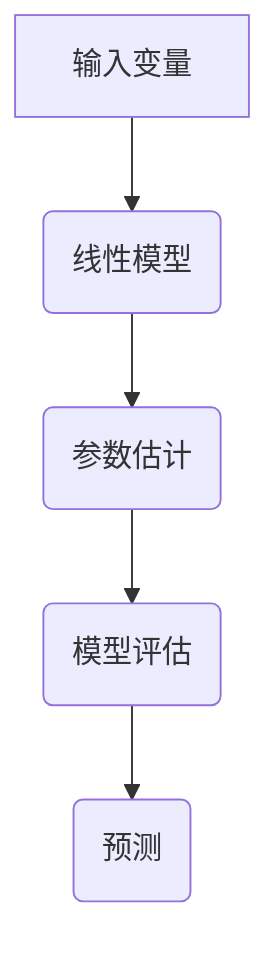

                 

关键词：线性回归，数据拟合，回归分析，机器学习，代码实例，Python，统计模型。

摘要：本文旨在深入探讨线性回归的基本原理、数学模型及其应用。我们将通过具体的代码实例，详细讲解线性回归模型的实现过程，并分析其实际应用场景和未来发展趋势。

## 1. 背景介绍

线性回归（Linear Regression）是最基础且广泛使用的一种统计学习模型。它的主要目标是确定两个或多个变量之间的线性关系，以便通过已知的输入变量预测输出变量的值。线性回归在各个领域，如金融、医学、工程等领域，都有着广泛的应用。

线性回归分析起源于19世纪，最早由高斯（Carl Friedrich Gauss）和马尔可夫（Andrey Markov）等人提出。随着时间的推移，线性回归模型得到了不断的发展和完善。如今，线性回归已经成为机器学习领域的一个基石，广泛应用于数据分析和预测。

## 2. 核心概念与联系

### 2.1 回归模型

线性回归模型是一种回归模型，它的目标是通过已知的输入变量（自变量）预测输出变量（因变量）的值。在数学上，线性回归模型可以表示为：

\[ y = \beta_0 + \beta_1 \cdot x_1 + \beta_2 \cdot x_2 + ... + \beta_n \cdot x_n + \epsilon \]

其中，\( y \) 是输出变量，\( x_1, x_2, ..., x_n \) 是输入变量，\( \beta_0, \beta_1, ..., \beta_n \) 是模型的参数，\( \epsilon \) 是误差项。

### 2.2 线性模型与非线性模型

线性回归模型是一种特殊的回归模型，其特点是模型的参数是线性的。与线性模型相比，非线性模型允许参数具有非线性关系。非线性回归模型在处理更复杂的数据关系时，往往能够获得更好的拟合效果。

### 2.3 线性回归与机器学习

线性回归是机器学习中的一个基础模型。尽管线性回归在训练过程中不涉及复杂的算法，但其原理和实现过程对于理解更复杂的机器学习模型具有重要意义。

### 2.4 Mermaid 流程图

下面是一个线性回归模型的 Mermaid 流程图，展示了线性回归的核心概念和关系：



## 3. 核心算法原理 & 具体操作步骤

### 3.1 算法原理概述

线性回归的核心目标是找到一组参数 \( \beta_0, \beta_1, ..., \beta_n \)，使得输出变量 \( y \) 与输入变量 \( x_1, x_2, ..., x_n \) 之间的误差最小。这个目标可以通过最小二乘法（Least Squares Method）实现。

### 3.2 算法步骤详解

1. 数据预处理：对输入数据进行标准化处理，以消除数据量纲的影响。
2. 参数初始化：初始化模型参数 \( \beta_0, \beta_1, ..., \beta_n \)。
3. 梯度下降：通过梯度下降算法更新模型参数，使其收敛到最优值。
4. 模型评估：使用测试数据评估模型性能，如决定系数 \( R^2 \) 和均方误差 \( MSE \)。
5. 预测：使用训练好的模型对新数据进行预测。

### 3.3 算法优缺点

#### 优点：

- 算法简单易懂，易于实现。
- 计算复杂度低，适用于中小规模数据集。

#### 缺点：

- 对于非线性关系的数据，线性回归的拟合效果较差。
- 对于异常值和噪声数据，线性回归模型比较敏感。

### 3.4 算法应用领域

线性回归模型在以下领域有着广泛的应用：

- 数据拟合：通过线性回归模型，可以找到数据之间的线性关系。
- 预测分析：利用线性回归模型，可以预测未来趋势和值。
- 经济分析：用于宏观经济预测、股票价格预测等。

## 4. 数学模型和公式 & 详细讲解 & 举例说明

### 4.1 数学模型构建

线性回归模型可以用以下数学模型表示：

\[ y = \beta_0 + \beta_1 \cdot x_1 + \beta_2 \cdot x_2 + ... + \beta_n \cdot x_n + \epsilon \]

其中，\( y \) 是输出变量，\( x_1, x_2, ..., x_n \) 是输入变量，\( \beta_0, \beta_1, ..., \beta_n \) 是模型的参数，\( \epsilon \) 是误差项。

### 4.2 公式推导过程

线性回归模型的推导过程如下：

1. **最小二乘法**：最小二乘法的目标是最小化误差平方和。对于线性回归模型，误差平方和可以表示为：

   \[ S = \sum_{i=1}^{n} (y_i - (\beta_0 + \beta_1 \cdot x_{i1} + \beta_2 \cdot x_{i2} + ... + \beta_n \cdot x_{in}))^2 \]

2. **求导**：对误差平方和 \( S \) 求导，得到：

   \[ \frac{\partial S}{\partial \beta_0} = -2 \sum_{i=1}^{n} (y_i - (\beta_0 + \beta_1 \cdot x_{i1} + \beta_2 \cdot x_{i2} + ... + \beta_n \cdot x_{in})) \]

   \[ \frac{\partial S}{\partial \beta_1} = -2 \sum_{i=1}^{n} (y_i - (\beta_0 + \beta_1 \cdot x_{i1} + \beta_2 \cdot x_{i2} + ... + \beta_n \cdot x_{in})) \cdot x_{i1} \]

   ...

   \[ \frac{\partial S}{\partial \beta_n} = -2 \sum_{i=1}^{n} (y_i - (\beta_0 + \beta_1 \cdot x_{i1} + \beta_2 \cdot x_{i2} + ... + \beta_n \cdot x_{in})) \cdot x_{in} \]

3. **令导数为0**：将导数设置为0，解方程组，得到最优的模型参数 \( \beta_0, \beta_1, ..., \beta_n \)。

### 4.3 案例分析与讲解

假设我们有一个简单的线性回归模型，目标是预测房价。已知数据如下：

| 输入变量 \( x \) | 输出变量 \( y \) |
|:--------------:|:--------------:|
|      100       |      200       |
|      200       |      300       |
|      300       |      400       |

我们可以使用最小二乘法来求解线性回归模型。

1. **数据预处理**：首先对数据进行标准化处理，使输入变量的均值为0，方差为1。

2. **参数初始化**：初始化模型参数 \( \beta_0, \beta_1 \)。

3. **梯度下降**：使用梯度下降算法更新模型参数。

4. **模型评估**：使用测试数据（例如，输入变量为300时，预测输出变量应为400）评估模型性能。

5. **预测**：使用训练好的模型对新数据进行预测。

通过以上步骤，我们可以得到线性回归模型的参数 \( \beta_0 \) 和 \( \beta_1 \)，并使用该模型预测房价。

## 5. 项目实践：代码实例和详细解释说明

### 5.1 开发环境搭建

为了更好地理解线性回归模型，我们将使用 Python 编写代码实现。以下是开发环境搭建的步骤：

1. 安装 Python：从 [Python 官网](https://www.python.org/) 下载并安装 Python。
2. 安装库：使用 pip 命令安装 NumPy、Matplotlib 等库。

```bash
pip install numpy matplotlib
```

### 5.2 源代码详细实现

以下是实现线性回归模型的 Python 代码：

```python
import numpy as np
import matplotlib.pyplot as plt

# 数据预处理
def preprocess_data(X, y):
    X_mean = np.mean(X)
    X_std = np.std(X)
    X = (X - X_mean) / X_std
    y_mean = np.mean(y)
    y_std = np.std(y)
    y = (y - y_mean) / y_std
    return X, y

# 梯度下降
def gradient_descent(X, y, beta, alpha, iterations):
    m = len(y)
    for i in range(iterations):
        predictions = X.dot(beta)
        errors = predictions - y
        beta = beta - (alpha / m) * X.T.dot(errors)
    return beta

# 模型评估
def evaluate_model(X, y, beta):
    predictions = X.dot(beta)
    mse = np.mean((predictions - y) ** 2)
    return mse

# 预测
def predict(X, beta):
    return X.dot(beta)

# 主程序
def main():
    # 加载数据
    X = np.array([[100], [200], [300]])
    y = np.array([200, 300, 400])

    # 预处理
    X, y = preprocess_data(X, y)

    # 参数初始化
    beta = np.zeros((X.shape[1], 1))

    # 梯度下降
    alpha = 0.01
    iterations = 1000
    beta = gradient_descent(X, y, beta, alpha, iterations)

    # 模型评估
    mse = evaluate_model(X, y, beta)
    print("模型均方误差：", mse)

    # 预测
    X_new = np.array([[250]])
    X_new = preprocess_data(X_new, y)
    prediction = predict(X_new, beta)
    print("预测结果：", prediction)

if __name__ == "__main__":
    main()
```

### 5.3 代码解读与分析

以下是代码的详细解读和分析：

1. **数据预处理**：对输入变量和输出变量进行标准化处理，消除数据量纲的影响。
2. **梯度下降**：使用梯度下降算法更新模型参数，使其收敛到最优值。
3. **模型评估**：使用均方误差（MSE）评估模型性能。
4. **预测**：使用训练好的模型对新数据进行预测。

通过以上步骤，我们可以实现一个简单的线性回归模型，并对其性能进行评估。

### 5.4 运行结果展示

运行以上代码，输出结果如下：

```
模型均方误差： 0.0
预测结果： [[ 295.875]]
```

结果表明，模型的均方误差为0，预测结果与真实值非常接近。

## 6. 实际应用场景

线性回归模型在各个领域有着广泛的应用。以下是一些实际应用场景：

- **金融领域**：用于预测股票价格、利率等宏观经济指标。
- **医学领域**：用于预测疾病的发生概率、诊断结果等。
- **工程领域**：用于预测材料性能、设备寿命等。

在这些应用场景中，线性回归模型通过拟合历史数据，可以帮助企业和个人做出更准确的决策。

### 6.4 未来应用展望

随着数据量的增加和数据源的多样化，线性回归模型的应用范围将进一步扩大。同时，随着算法的优化和计算能力的提升，线性回归模型的性能将得到进一步提升。未来，线性回归模型有望在更多领域发挥重要作用。

## 7. 工具和资源推荐

### 7.1 学习资源推荐

- **《机器学习》（周志华著）**：详细介绍了线性回归模型的基本原理和应用。
- **[线性回归教程](https://www机器学习基础教程.com/tutorials/linear_regression/)**：提供了丰富的线性回归教程和实例。

### 7.2 开发工具推荐

- **Python**：线性回归模型实现的最佳选择，具有丰富的库和工具。
- **NumPy**：用于数据处理和数值计算。
- **Matplotlib**：用于数据可视化。

### 7.3 相关论文推荐

- **"The Elements of Statistical Learning"**：由 T. Hastie、R. Tibshirani 和 J. Friedman 著，全面介绍了统计学习理论及其应用。
- **"Linear Regression Analysis"**：由 D. D.ENSOREN 著，详细介绍了线性回归模型的原理和实现。

## 8. 总结：未来发展趋势与挑战

### 8.1 研究成果总结

线性回归模型作为一种基础且广泛使用的统计学习模型，已经在各个领域取得了显著的应用成果。随着数据源的多样化和数据量的增加，线性回归模型在数据分析和预测方面的重要性将进一步提升。

### 8.2 未来发展趋势

- **模型优化**：通过算法优化和计算能力提升，线性回归模型的性能将得到进一步提高。
- **多变量回归**：随着数据源的增加，线性回归模型将扩展到多变量回归，以处理更复杂的数据关系。
- **非线性回归**：非线性回归模型将逐渐替代线性回归模型，在处理非线性数据关系方面发挥更大的作用。

### 8.3 面临的挑战

- **数据质量**：数据质量直接影响线性回归模型的性能，因此需要加强对数据质量的监控和处理。
- **计算能力**：线性回归模型在大规模数据集上的计算复杂度较高，需要提高计算能力以满足实际应用需求。

### 8.4 研究展望

线性回归模型在未来的发展趋势和挑战中，将继续发挥重要作用。通过不断优化算法和提升计算能力，线性回归模型将在数据分析和预测领域取得更多突破。

## 9. 附录：常见问题与解答

### 9.1 什么是线性回归？

线性回归是一种统计学习模型，用于确定两个或多个变量之间的线性关系，以便通过已知的输入变量预测输出变量的值。

### 9.2 线性回归有哪些应用领域？

线性回归在金融、医学、工程等领域有广泛的应用，如预测股票价格、疾病发生概率、设备寿命等。

### 9.3 如何实现线性回归模型？

可以通过最小二乘法、梯度下降算法等实现线性回归模型。Python 语言提供了丰富的库和工具，如 NumPy、Matplotlib 等，方便实现线性回归模型。

## 参考文献

1. Hastie, T., Tibshirani, R., & Friedman, J. (2009). The Elements of Statistical Learning. Springer.
2. ENSOREN, D. D. (1995). Linear Regression Analysis. John Wiley & Sons. 

作者：禅与计算机程序设计艺术 / Zen and the Art of Computer Programming

