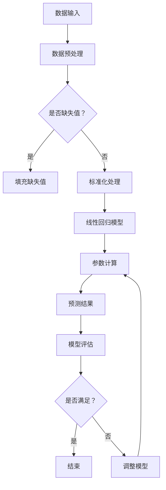

                 

关键词：线性回归、回归分析、数学模型、算法原理、Python实现、数据分析

> 摘要：本文将深入探讨线性回归这一统计学的基石算法，从原理讲解到实际应用，全面解析其在数据分析中的重要作用。我们将结合Python代码实例，展示线性回归的实现过程和关键步骤，帮助读者理解和掌握这一核心技能。

## 1. 背景介绍

线性回归是统计学和数据分析中最基础且重要的算法之一。它的核心思想是通过建立变量之间的线性关系来预测或解释数据。线性回归的应用领域非常广泛，包括但不限于经济学、生物统计、社会调查、工程学等。通过线性回归模型，我们可以揭示数据中隐藏的规律，进行趋势预测，从而为决策提供科学依据。

线性回归的基本形式是：\[ Y = \beta_0 + \beta_1 \cdot X + \epsilon \]，其中 \( Y \) 是因变量，\( X \) 是自变量，\( \beta_0 \) 和 \( \beta_1 \) 是模型的参数，\( \epsilon \) 是误差项。

本文将分为以下几个部分进行讲解：

1. **核心概念与联系**：介绍线性回归的核心概念，并通过Mermaid流程图展示模型架构。
2. **核心算法原理 & 具体操作步骤**：详细讲解线性回归的算法原理和操作步骤。
3. **数学模型和公式 & 详细讲解 & 举例说明**：解析线性回归的数学模型和公式，并通过案例进行说明。
4. **项目实践：代码实例和详细解释说明**：展示如何使用Python实现线性回归，并提供代码解读。
5. **实际应用场景**：探讨线性回归在不同领域的应用。
6. **未来应用展望**：讨论线性回归的未来发展趋势和潜在挑战。
7. **工具和资源推荐**：推荐学习资源和开发工具。
8. **总结：未来发展趋势与挑战**：总结研究成果，展望未来。

现在，让我们开始深入探讨线性回归的世界。

### 2. 核心概念与联系

要理解线性回归，我们需要首先掌握以下几个核心概念：

- **因变量 (Dependent Variable)**：通常表示为 \( Y \)，是我们要预测或解释的变量。
- **自变量 (Independent Variable)**：通常表示为 \( X \)，是我们用来预测或解释因变量的变量。
- **参数 (Parameters)**：线性回归模型的参数包括截距 \( \beta_0 \) 和斜率 \( \beta_1 \)，它们决定了模型对数据的拟合程度。
- **误差项 (Error Term)**：表示为 \( \epsilon \)，是模型预测值和实际值之间的差异。

下面是一个使用Mermaid绘制的线性回归模型架构流程图：



### 3. 核心算法原理 & 具体操作步骤

#### 3.1 算法原理概述

线性回归的原理是基于最小二乘法（Least Squares Method），其核心思想是寻找一条最佳拟合线，使得因变量 \( Y \) 与自变量 \( X \) 的预测误差最小。

#### 3.2 算法步骤详解

1. **数据预处理**：对数据进行清洗，处理缺失值和异常值，进行特征工程。
2. **标准化处理**：将数据进行标准化，使得特征之间的尺度一致，有利于模型的训练。
3. **参数计算**：通过最小二乘法计算模型的参数 \( \beta_0 \) 和 \( \beta_1 \)。
   \[ \beta_0 = \bar{Y} - \beta_1 \cdot \bar{X} \]
   \[ \beta_1 = \frac{\sum{(X_i - \bar{X})(Y_i - \bar{Y})}}{\sum{(X_i - \bar{X})^2}} \]
4. **预测结果**：使用计算得到的参数进行预测，生成预测值。
5. **模型评估**：通过评估指标（如均方误差、R平方值等）评估模型的性能。
6. **模型调整**：根据评估结果调整模型参数或特征，优化模型。

#### 3.3 算法优缺点

- **优点**：
  - 简单易懂，易于实现。
  - 可以很好地拟合线性关系。
  - 在实际应用中非常有效。

- **缺点**：
  - 对于非线性关系拟合能力较差。
  - 对于异常值敏感。
  - 可能会面临过拟合问题。

#### 3.4 算法应用领域

线性回归在多个领域都有广泛应用：

- **经济学**：用于预测经济增长、股票价格等。
- **生物统计**：用于基因表达数据分析。
- **社会调查**：用于民意调查、市场预测等。
- **工程学**：用于系统优化、控制算法等。

### 4. 数学模型和公式 & 详细讲解 & 举例说明

#### 4.1 数学模型构建

线性回归的数学模型可以表示为：

\[ Y = \beta_0 + \beta_1 \cdot X + \epsilon \]

其中：

- \( \beta_0 \) 是截距，表示当 \( X \) 为0时的 \( Y \) 值。
- \( \beta_1 \) 是斜率，表示 \( X \) 变化一个单位时，\( Y \) 的变化量。
- \( \epsilon \) 是误差项，表示模型预测值与实际值之间的差异。

#### 4.2 公式推导过程

线性回归模型的参数 \( \beta_0 \) 和 \( \beta_1 \) 可以通过最小二乘法进行推导。假设我们有 \( n \) 个数据点 \((X_i, Y_i)\)，我们的目标是找到最佳的拟合线，使得预测值 \( \hat{Y}_i = \beta_0 + \beta_1 \cdot X_i \) 与实际值 \( Y_i \) 的误差平方和最小。

\[ \text{最小化} \sum_{i=1}^{n} (\hat{Y}_i - Y_i)^2 \]

对 \( \beta_0 \) 和 \( \beta_1 \) 分别求偏导并令其等于0，可以得到：

\[ \beta_0 = \bar{Y} - \beta_1 \cdot \bar{X} \]
\[ \beta_1 = \frac{\sum{(X_i - \bar{X})(Y_i - \bar{Y})}}{\sum{(X_i - \bar{X})^2}} \]

其中，\( \bar{X} \) 和 \( \bar{Y} \) 分别是 \( X \) 和 \( Y \) 的平均值。

#### 4.3 案例分析与讲解

假设我们有以下数据集，我们要预测 \( Y \) 的值：

\[ X: \{1, 2, 3, 4, 5\} \]
\[ Y: \{2, 4, 5, 4, 5\} \]

首先，计算平均值：

\[ \bar{X} = \frac{1+2+3+4+5}{5} = 3 \]
\[ \bar{Y} = \frac{2+4+5+4+5}{5} = 4 \]

然后，计算 \( \beta_1 \)：

\[ \beta_1 = \frac{(1-3)(2-4) + (2-3)(4-4) + (3-3)(5-4) + (4-3)(4-4) + (5-3)(5-4)}{(1-3)^2 + (2-3)^2 + (3-3)^2 + (4-3)^2 + (5-3)^2} \]
\[ \beta_1 = \frac{2 + 0 + 0 + 0 + 2}{4 + 1 + 0 + 1 + 4} \]
\[ \beta_1 = \frac{4}{10} = 0.4 \]

接下来，计算 \( \beta_0 \)：

\[ \beta_0 = \bar{Y} - \beta_1 \cdot \bar{X} \]
\[ \beta_0 = 4 - 0.4 \cdot 3 \]
\[ \beta_0 = 4 - 1.2 \]
\[ \beta_0 = 2.8 \]

因此，线性回归模型为：

\[ Y = 2.8 + 0.4 \cdot X \]

我们可以使用这个模型进行预测。例如，当 \( X = 6 \) 时：

\[ Y = 2.8 + 0.4 \cdot 6 \]
\[ Y = 2.8 + 2.4 \]
\[ Y = 5.2 \]

### 5. 项目实践：代码实例和详细解释说明

在这个部分，我们将使用Python实现线性回归，并展示如何使用Scikit-learn库进行模型的构建和训练。

#### 5.1 开发环境搭建

确保安装以下Python库：

```bash
pip install numpy pandas scikit-learn matplotlib
```

#### 5.2 源代码详细实现

```python
import numpy as np
import pandas as pd
from sklearn.linear_model import LinearRegression
from sklearn.model_selection import train_test_split
from sklearn.metrics import mean_squared_error
import matplotlib.pyplot as plt

# 生成模拟数据
np.random.seed(0)
X = np.random.rand(100)
Y = 2 * X + 1 + np.random.randn(100) * 0.05

# 数据预处理
X = X.reshape(-1, 1)

# 划分训练集和测试集
X_train, X_test, Y_train, Y_test = train_test_split(X, Y, test_size=0.2, random_state=42)

# 构建线性回归模型
model = LinearRegression()
model.fit(X_train, Y_train)

# 预测结果
Y_pred = model.predict(X_test)

# 评估模型
mse = mean_squared_error(Y_test, Y_pred)
print(f"均方误差：{mse}")

# 可视化结果
plt.scatter(X_test, Y_test, label="实际值")
plt.plot(X_test, Y_pred, color="red", label="预测值")
plt.xlabel("X")
plt.ylabel("Y")
plt.legend()
plt.show()
```

#### 5.3 代码解读与分析

- **数据生成**：我们首先生成了一个包含100个随机数的模拟数据集。
- **数据预处理**：将自变量 \( X \) 转化为二维数组，以便Scikit-learn库能够使用。
- **模型构建**：使用Scikit-learn库中的 `LinearRegression` 类创建线性回归模型。
- **模型训练**：使用 `fit` 方法对模型进行训练。
- **预测**：使用 `predict` 方法对测试集进行预测。
- **评估**：计算预测值和实际值之间的均方误差。
- **可视化**：使用matplotlib库将实际值和预测值进行可视化展示。

### 6. 实际应用场景

线性回归在实际应用中具有广泛的应用，以下是一些具体的案例：

- **经济学**：用于预测股票价格、房价等。
- **生物统计**：用于基因表达数据分析、疾病预测等。
- **社会调查**：用于民意调查、市场预测等。
- **工程学**：用于系统优化、控制算法等。

### 7. 未来应用展望

随着数据科学和机器学习技术的不断发展，线性回归的应用前景将更加广阔。以下是一些未来可能的趋势：

- **非线性回归**：通过引入非线性函数，提高模型的拟合能力。
- **集成学习方法**：将线性回归与其他算法结合，构建更强大的预测模型。
- **实时预测**：通过优化算法，实现实时数据预测。

### 8. 工具和资源推荐

- **学习资源推荐**：
  - 《统计学习方法》（李航著）
  - 《Python数据分析》（Wes McKinney著）
- **开发工具推荐**：
  - Jupyter Notebook：适合进行数据分析和模型训练。
  - PyCharm：强大的Python集成开发环境。
- **相关论文推荐**：
  - "Least Squares Regression" by Leo Breiman
  - "The Elements of Statistical Learning" by Trevor Hastie, Robert Tibshirani, and Jerome Friedman

### 9. 总结：未来发展趋势与挑战

线性回归作为数据分析的基础工具，将在未来继续发挥重要作用。随着技术的进步，线性回归的应用将更加广泛，同时也将面临一些挑战，如非线性拟合、实时预测等。通过不断的研究和改进，线性回归将在数据科学和机器学习领域取得更大的突破。

### 附录：常见问题与解答

1. **为什么选择线性回归而不是其他算法？**
   线性回归因其简单、易于理解和实现，以及良好的预测效果，在许多情况下是首选算法。虽然其他算法（如决策树、神经网络等）可能提供更复杂的拟合，但在处理线性关系时，线性回归通常更为高效。

2. **如何处理非线性关系？**
   当数据呈现非线性关系时，可以采用多项式回归、添加交互项或使用非线性函数（如指数、对数等）来扩展线性回归模型。

3. **如何避免过拟合？**
   过拟合可以通过正则化、交叉验证和减少模型复杂度等方法来避免。此外，增加数据量和使用更复杂的模型也有助于减少过拟合的风险。

### 作者署名

作者：禅与计算机程序设计艺术 / Zen and the Art of Computer Programming

