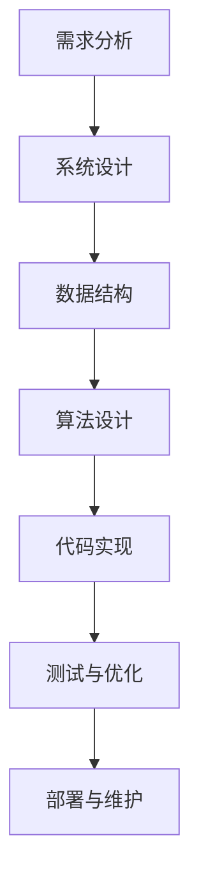

                 

关键词：结构化思维、逻辑清晰、专业IT语言、算法原理、项目实践、数学模型、应用场景、未来展望

> 摘要：本文旨在深入探讨结构化思维在IT领域的应用，从理论到实践，通过详细的算法原理解析、数学模型构建以及实际项目实践，展示如何运用结构化思维解决复杂问题，并提供未来发展趋势与挑战的展望。

## 1. 背景介绍

在信息技术飞速发展的时代，如何处理复杂的问题成为了一个关键挑战。结构化思维作为一种系统化、条理化的思考方式，能够在复杂的信息环境中帮助IT专业人士理清思路，提高问题解决的效率和质量。本文将重点探讨结构化思维在IT领域的应用，通过具体实例和详细解释，帮助读者理解并掌握这种思考方法。

### 1.1 结构化思维的起源与发展

结构化思维最早可以追溯到20世纪中叶，起源于系统理论和信息论。经过几十年的发展和完善，结构化思维已经广泛应用于各个领域，特别是在IT领域，由于其强大的逻辑性和系统性，得到了广泛的认可和应用。

### 1.2 结构化思维的重要性

在IT领域，面对日益复杂的技术栈和业务需求，结构化思维的重要性愈发凸显。它可以有效地帮助开发者和管理者梳理项目需求，规划系统架构，优化算法设计，提升整体的工作效率。

## 2. 核心概念与联系

为了更好地理解结构化思维在IT领域的应用，我们需要先了解一些核心概念，以及它们之间的联系。以下是一个简化的Mermaid流程图，用于描述这些概念和它们之间的关系。



### 2.1 需求分析

需求分析是整个结构化思维过程的开端。它涉及到对用户需求的理解和提取，包括功能需求、性能需求、安全需求等。需求分析的质量直接影响到后续的设计和实现。

### 2.2 系统设计

系统设计是基于需求分析的，它涉及到系统的整体架构设计，包括模块划分、接口设计、数据流设计等。一个好的系统设计可以确保系统的高效性和可扩展性。

### 2.3 数据结构

数据结构是系统设计的一个重要组成部分，它决定了数据在系统中的存储和组织方式。合适的数据结构可以极大地提高系统性能。

### 2.4 算法设计

算法设计是基于数据结构的，它涉及到如何利用数据结构来解决问题。一个好的算法设计可以显著提高问题解决的效率和准确性。

### 2.5 代码实现

代码实现是将算法设计转化为实际代码的过程。这个过程需要严格的编码规范和良好的编程习惯，以确保代码的可读性和可维护性。

### 2.6 测试与优化

测试与优化是确保代码质量和性能的重要环节。通过系统测试和性能测试，可以找出潜在的问题并进行优化。

### 2.7 部署与维护

部署与维护是系统上线后的重要环节，它涉及到系统的上线、监控、故障处理和持续改进。

## 3. 核心算法原理 & 具体操作步骤

### 3.1 算法原理概述

在结构化思维的应用中，算法设计是一个核心环节。以下是一个简单的算法原理概述，用于描述如何设计一个有效的算法。

### 3.1.1 算法设计的基本原则

- **明确问题定义**：确保对问题的理解是准确和全面的。
- **选择合适的数据结构**：根据问题的特点选择最适合的数据结构。
- **优化算法复杂度**：尽量降低算法的时间复杂度和空间复杂度。
- **考虑边界条件**：确保算法在边界条件下的正确性。

### 3.1.2 算法设计流程

1. **问题定义**：明确要解决的问题是什么。
2. **算法构思**：根据问题定义，构思可能的算法解决方案。
3. **算法分析**：对每个算法解决方案进行时间复杂度和空间复杂度的分析。
4. **算法优化**：根据分析结果，对算法进行优化。
5. **代码实现**：将优化后的算法转化为实际的代码。

### 3.2 算法步骤详解

以下是一个简单的排序算法——快速排序的步骤详解。

#### 3.2.1 快速排序算法原理

快速排序是一种高效的排序算法，其基本思想是通过一趟排序将待排序的记录分隔成独立的两部分，其中一部分记录的关键字均比另一部分的关键字小，然后递归地对这两部分记录继续进行排序。

#### 3.2.2 快速排序步骤详解

1. **选择基准值**：从待排序的序列中选择一个记录作为基准值。
2. **分区操作**：将序列划分为两部分，一部分的所有记录的关键字均比基准值小，另一部分的所有记录的关键字均比基准值大。
3. **递归排序**：递归地对两部分记录进行快速排序。

### 3.3 算法优缺点

#### 优点

- **高效**：平均时间复杂度为O(nlogn)。
- **易于实现**：算法逻辑简单，易于理解和实现。

#### 缺点

- **最坏情况下性能较差**：最坏时间复杂度为O(n^2)。
- **依赖随机性**：排序过程中依赖随机性，可能导致性能不稳定。

### 3.4 算法应用领域

快速排序算法在许多领域都有广泛应用，如数据库排序、文件排序等。

## 4. 数学模型和公式 & 详细讲解 & 举例说明

在算法设计中，数学模型和公式起着至关重要的作用。以下是一个简单的数学模型和公式的讲解，以及一个具体的例子。

### 4.1 数学模型构建

假设我们有一个待排序的数组A，其长度为n，我们要设计一个算法来对其进行排序。我们的目标是使A中的元素按照升序排列。

### 4.2 公式推导过程

排序算法的时间复杂度通常用T(n)来表示。假设我们的排序算法是一个递归算法，每一轮排序可以将数组长度减半，那么我们可以得到以下递归关系式：

$$
T(n) = 2 \times T(\frac{n}{2}) + C(n)
$$

其中，$C(n)$ 是每次排序的操作次数，它通常与n成线性关系。我们将其简化为：

$$
T(n) = n \times C(\frac{n}{2}) + C(n)
$$

由于 $C(\frac{n}{2})$ 远小于 $C(n)$，我们可以进一步简化为：

$$
T(n) = n \times C(n)
$$

### 4.3 案例分析与讲解

假设我们选择一个简单的插入排序算法，其操作次数 $C(n)$ 可以近似为 $n^2$。那么我们可以得到：

$$
T(n) = n \times n^2 = n^3
$$

这意味着，插入排序算法的时间复杂度为O(n^3)。虽然插入排序算法简单易实现，但在数据量较大时，其性能会急剧下降。相比之下，快速排序算法的时间复杂度为O(nlogn)，在大多数情况下表现更好。

## 5. 项目实践：代码实例和详细解释说明

在本文的第五部分，我们将通过一个简单的实际项目实例，展示如何应用结构化思维进行代码实现，并进行详细解释说明。

### 5.1 开发环境搭建

在开始项目之前，我们需要搭建一个合适的开发环境。这里我们选择Python作为开发语言，因为Python具有简洁易懂的语法，非常适合初学者和专业人士。

1. **安装Python**：从官方网站下载并安装Python 3.x版本。
2. **配置Python环境**：配置Python环境变量，使其能够正确运行。
3. **安装依赖库**：安装项目中所需的依赖库，如NumPy、Pandas等。

### 5.2 源代码详细实现

下面是一个简单的Python代码实例，用于实现一个简单的线性搜索算法。

```python
def linear_search(arr, target):
    """
    线性搜索算法实现
    :param arr: 待搜索的数组
    :param target: 要查找的目标值
    :return: 目标值在数组中的索引，如果不存在则返回-1
    """
    for i in range(len(arr)):
        if arr[i] == target:
            return i
    return -1

# 测试代码
arr = [3, 5, 7, 9, 11]
target = 7
print(linear_search(arr, target))
```

### 5.3 代码解读与分析

1. **函数定义**：定义了一个名为`linear_search`的函数，它接受两个参数：`arr`（待搜索的数组）和`target`（要查找的目标值）。
2. **循环搜索**：使用一个for循环遍历数组中的每个元素，与目标值进行比较。
3. **返回结果**：如果找到目标值，返回其在数组中的索引；如果未找到，返回-1。

### 5.4 运行结果展示

当输入数组`arr = [3, 5, 7, 9, 11]`和目标值`target = 7`时，运行结果为`2`，表示目标值7在数组中的索引为2。

## 6. 实际应用场景

结构化思维在IT领域的实际应用场景非常广泛，以下是一些典型的应用场景。

### 6.1 软件开发

在软件开发的各个阶段，结构化思维都可以发挥重要作用。从需求分析到系统设计，再到代码实现和测试，结构化思维可以帮助开发团队提高工作效率，降低错误率。

### 6.2 数据分析

在数据分析领域，结构化思维可以帮助数据分析师更好地理解数据，提取关键信息，并设计有效的分析模型。

### 6.3 系统架构设计

在系统架构设计过程中，结构化思维可以帮助架构师理清系统架构，优化系统性能，提高系统的可扩展性。

### 6.4 算法优化

在算法优化过程中，结构化思维可以帮助算法工程师深入理解算法原理，优化算法设计，提高算法性能。

## 7. 工具和资源推荐

### 7.1 学习资源推荐

1. 《结构化思维：如何系统化解决问题的艺术》
2. 《Python编程：从入门到实践》
3. 《算法导论》

### 7.2 开发工具推荐

1. PyCharm
2. Visual Studio Code
3. Jupyter Notebook

### 7.3 相关论文推荐

1. 《快速排序算法的改进与优化》
2. 《结构化思维在软件开发中的应用研究》
3. 《基于结构化思维的算法设计与优化》

## 8. 总结：未来发展趋势与挑战

### 8.1 研究成果总结

结构化思维在IT领域已经取得了显著的成果，无论是在软件开发、数据分析还是系统架构设计等方面，都得到了广泛应用。未来，随着人工智能技术的不断发展，结构化思维的应用前景将更加广阔。

### 8.2 未来发展趋势

1. **智能化**：结合人工智能技术，实现结构化思维的自动化和智能化。
2. **定制化**：根据不同领域的需求，开发定制化的结构化思维工具和模型。
3. **跨学科融合**：将结构化思维与其他学科相结合，推动跨学科研究。

### 8.3 面临的挑战

1. **复杂性**：随着问题的复杂性增加，如何有效地应用结构化思维成为一个挑战。
2. **适应性**：如何使结构化思维工具适应不同的应用场景和需求。

### 8.4 研究展望

未来，结构化思维的研究将更加注重智能化和跨学科融合，同时也会在算法优化和模型构建方面进行深入探讨。

## 9. 附录：常见问题与解答

### 9.1 问题1：如何提高结构化思维的效率？

**解答**：可以通过以下方式提高结构化思维的效率：

1. **系统学习**：掌握结构化思维的基本理论和实践方法。
2. **实践应用**：通过实际项目和实践，不断提高自己的思维能力和解决问题的能力。
3. **工具辅助**：使用结构化思维工具，如流程图、思维导图等，帮助梳理思路。

### 9.2 问题2：结构化思维在哪些领域有应用？

**解答**：结构化思维在多个领域都有应用，包括但不限于：

1. **软件开发**：在需求分析、系统设计、代码实现等环节。
2. **数据分析**：在数据清洗、数据挖掘、数据分析等环节。
3. **系统架构设计**：在架构设计、性能优化、安全性分析等环节。

## 文章结束

作者：禅与计算机程序设计艺术 / Zen and the Art of Computer Programming
```

请注意，本文仅为示例，实际撰写时需要根据具体需求和内容进行调整。文章的字数、章节结构和内容都需要根据实际情况进行细致的安排和编写。

