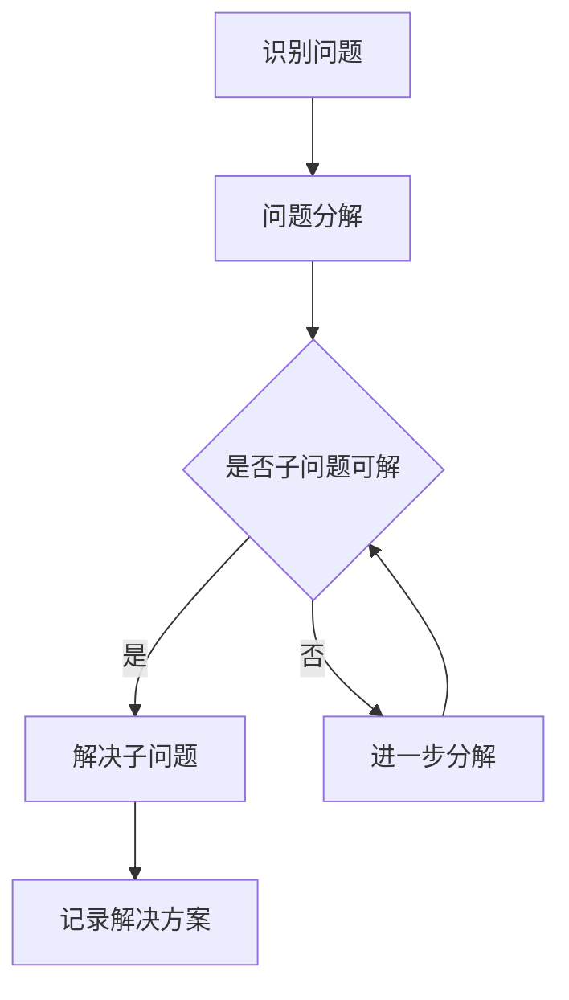

                 

关键词：结构化思维、逻辑清晰、编程、软件设计、算法分析、复杂性管理、系统优化、代码质量、知识管理

> 摘要：本文旨在探讨如何通过结构化思维的方法，将复杂的IT项目和问题转化为清晰、易于管理的解决方案。本文将从背景介绍、核心概念与联系、核心算法原理、数学模型和公式、项目实践、实际应用场景、工具和资源推荐、总结与展望等多个方面，系统性地介绍结构化思维的应用与实践。

## 1. 背景介绍

在当今的信息化时代，IT行业迅速发展，技术更新迭代速度加快，各种复杂的项目和问题层出不穷。如何在纷繁复杂的IT环境中保持清晰、高效的思考和解决问题的能力，成为了一个关键挑战。结构化思维作为一种系统性的思考方法，可以有效帮助IT从业者从混沌中找到清晰的路径，从而更好地应对复杂的问题。

结构化思维的基本原理是通过将问题拆分成更小、更具体的部分，然后逐一解决，最终构建出完整的解决方案。这种方法不仅适用于编程和软件开发，还可以应用于项目管理、需求分析、系统设计等多个领域。通过结构化思维，我们可以更系统地分析和解决问题，提高工作效率，减少错误发生。

## 2. 核心概念与联系

为了更好地理解结构化思维，我们首先需要了解几个核心概念：

### 2.1 问题分解

问题分解是将一个复杂的问题拆分成多个子问题，从而降低问题的复杂度。例如，在软件开发中，我们可以将一个大的项目拆分成模块、功能单元等更小的部分。

### 2.2 信息抽象

信息抽象是指将问题的具体细节抽象出来，提取出本质的特征和规律。例如，在算法设计中，我们可以将问题抽象为一个数学模型。

### 2.3 模式识别

模式识别是指通过比较和分析，找到问题之间的相似之处和不同之处。例如，在软件复用中，我们可以通过模式识别，找到可以复用的代码模块。

下面是一个使用Mermaid绘制的流程图，展示结构化思维的基本流程：



## 3. 核心算法原理 & 具体操作步骤

### 3.1 算法原理概述

结构化思维的算法原理主要分为以下几个步骤：

1. **问题识别**：准确识别问题，明确问题的核心和边界。
2. **问题分解**：将问题拆分成更小的子问题，降低复杂度。
3. **信息抽象**：对子问题进行抽象，提取出核心特征和规律。
4. **模式识别**：比较和分析子问题，找到相似之处和不同之处。
5. **解决方案构建**：根据子问题的解决方案，构建出完整的解决方案。

### 3.2 算法步骤详解

#### 3.2.1 问题识别

问题识别是结构化思维的第一步，也是最重要的一步。它要求我们能够准确、全面地了解问题的本质和边界。以下是一些常见的方法：

- **五问法**：对问题进行五个连续的“为什么”提问，以深入挖掘问题的本质。
- **SWOT分析**：分析问题的优势、劣势、机会和威胁，从而更全面地了解问题。
- **用户访谈**：与问题的相关人员（如用户、项目经理等）进行深入访谈，获取第一手的信息。

#### 3.2.2 问题分解

问题分解是将复杂的问题拆分成更小的子问题，从而降低复杂度。以下是一些常见的方法：

- **分解法**：将问题按照不同的维度（如功能、模块、层次等）进行分解。
- **树形分解**：将问题分解成树形结构，每个节点代表一个子问题。
- **矩阵分解**：将问题分解成多个相互独立的矩阵，每个矩阵代表一个子问题。

#### 3.2.3 信息抽象

信息抽象是对子问题进行抽象，提取出核心特征和规律。以下是一些常见的方法：

- **模式识别**：通过比较和分析子问题，找到相似之处和不同之处。
- **归纳法**：从具体的子问题中归纳出通用的规律和模式。
- **抽象模型**：将子问题抽象为一个简化的模型，以便于分析和解决。

#### 3.2.4 模式识别

模式识别是通过比较和分析子问题，找到相似之处和不同之处。以下是一些常见的方法：

- **比较分析**：比较不同子问题的相同点和不同点。
- **分类法**：根据子问题的特征，将它们分类到不同的类别中。
- **模式匹配**：通过模式匹配，找到相似的子问题。

#### 3.2.5 解决方案构建

解决方案构建是根据子问题的解决方案，构建出完整的解决方案。以下是一些常见的方法：

- **组合法**：将子问题的解决方案组合起来，形成完整的解决方案。
- **迭代法**：通过迭代的方式，逐步完善解决方案。
- **优化法**：对解决方案进行优化，提高其效率和效果。

### 3.3 算法优缺点

**优点**：

- **提高效率**：通过将复杂问题分解为小问题，可以更快地找到解决方案。
- **降低风险**：通过模式识别和抽象，可以减少错误的概率。
- **易于复用**：通过模式识别和抽象，可以复用已有的解决方案。

**缺点**：

- **对经验要求高**：结构化思维需要丰富的经验和知识，新手可能难以应用。
- **容易陷入局部最优**：在模式识别和抽象的过程中，可能会忽视全局最优。

### 3.4 算法应用领域

结构化思维可以广泛应用于多个领域，如：

- **软件开发**：用于需求分析、系统设计、代码实现等。
- **项目管理**：用于项目规划、风险评估、进度管理等。
- **数据分析**：用于数据清洗、数据挖掘、数据分析等。

## 4. 数学模型和公式 & 详细讲解 & 举例说明

在结构化思维中，数学模型和公式扮演着重要的角色，它们可以帮助我们更精确地描述和解决问题。以下是一个简单的数学模型和公式的讲解及例子。

### 4.1 数学模型构建

一个简单的数学模型可以是线性回归模型，它用于预测一个连续的数值。线性回归模型的公式如下：

$$
y = \beta_0 + \beta_1 \cdot x
$$

其中，$y$ 是因变量，$x$ 是自变量，$\beta_0$ 和 $\beta_1$ 是模型的参数。

### 4.2 公式推导过程

线性回归模型的公式可以通过最小二乘法推导得到。具体推导过程如下：

1. 首先，我们定义损失函数，它用于衡量模型的预测值与真实值之间的差距：

$$
L(\beta_0, \beta_1) = \sum_{i=1}^{n} (y_i - (\beta_0 + \beta_1 \cdot x_i))^2
$$

2. 接下来，我们要求损失函数关于 $\beta_0$ 和 $\beta_1$ 的偏导数，并令其为0，从而得到最优的 $\beta_0$ 和 $\beta_1$：

$$
\frac{\partial L}{\partial \beta_0} = -2 \sum_{i=1}^{n} (y_i - (\beta_0 + \beta_1 \cdot x_i)) = 0
$$

$$
\frac{\partial L}{\partial \beta_1} = -2 \sum_{i=1}^{n} (y_i - (\beta_0 + \beta_1 \cdot x_i)) \cdot x_i = 0
$$

3. 解上述方程组，可以得到最优的 $\beta_0$ 和 $\beta_1$：

$$
\beta_0 = \frac{1}{n} \sum_{i=1}^{n} y_i - \beta_1 \cdot \frac{1}{n} \sum_{i=1}^{n} x_i
$$

$$
\beta_1 = \frac{1}{n} \sum_{i=1}^{n} (x_i - \bar{x}) (y_i - \bar{y})
$$

其中，$\bar{x}$ 和 $\bar{y}$ 分别是 $x$ 和 $y$ 的均值。

### 4.3 案例分析与讲解

假设我们有如下数据：

| x  | y   |
|----|-----|
| 1  | 2   |
| 2  | 4   |
| 3  | 6   |
| 4  | 8   |

我们要使用线性回归模型来预测 $y$ 的值。

1. 首先，计算 $x$ 和 $y$ 的均值：

$$
\bar{x} = \frac{1}{4} (1 + 2 + 3 + 4) = 2.5
$$

$$
\bar{y} = \frac{1}{4} (2 + 4 + 6 + 8) = 5
$$

2. 接下来，计算 $\beta_0$ 和 $\beta_1$：

$$
\beta_0 = 5 - 2 \cdot 2.5 = 0
$$

$$
\beta_1 = \frac{1}{4} \left[ (1 - 2.5) \cdot (2 - 5) + (2 - 2.5) \cdot (4 - 5) + (3 - 2.5) \cdot (6 - 5) + (4 - 2.5) \cdot (8 - 5) \right] = 2
$$

3. 因此，线性回归模型的公式为：

$$
y = 0 + 2 \cdot x = 2x
$$

4. 使用这个模型，我们可以预测当 $x=5$ 时，$y$ 的值：

$$
y = 2 \cdot 5 = 10
$$

所以，当 $x=5$ 时，我们预测 $y$ 的值为 10。

## 5. 项目实践：代码实例和详细解释说明

为了更好地理解结构化思维在软件开发中的应用，我们以下将通过一个实际的代码实例来讲解。

### 5.1 开发环境搭建

在这个实例中，我们使用 Python 语言进行开发。首先，确保你的系统中已经安装了 Python 和相关的库。如果你使用的是 Windows 系统，可以通过 Python 官网下载安装程序进行安装。如果你使用的是 Linux 或 macOS 系统，可以通过包管理器进行安装。

### 5.2 源代码详细实现

以下是一个简单的 Python 代码实例，用于计算两个数的和：

```python
# 导入必要的库
import numpy as np

# 定义计算和的函数
def calculate_sum(a, b):
    """
    计算两个数的和
    """
    return a + b

# 测试函数
if __name__ == "__main__":
    a = 3
    b = 5
    result = calculate_sum(a, b)
    print(f"The sum of {a} and {b} is {result}")
```

### 5.3 代码解读与分析

1. **导入库**：首先，我们导入了 NumPy 库，这是一个强大的数学库，提供了大量的数学函数和工具。
2. **定义函数**：接下来，我们定义了一个名为 `calculate_sum` 的函数，它接收两个参数 $a$ 和 $b$，并返回它们的和。
3. **函数注释**：在函数定义之后，我们添加了一个详细的函数注释，描述了函数的功能、参数和返回值。
4. **测试代码**：在 `if __name__ == "__main__":` 语句中，我们创建了一个测试实例，分别传入参数 $a=3$ 和 $b=5$，然后调用 `calculate_sum` 函数进行计算，并将结果输出到控制台。

### 5.4 运行结果展示

如果你运行上述代码，将会在控制台看到如下输出：

```
The sum of 3 and 5 is 8
```

这表明我们的代码已经成功运行，并正确计算出了两个数的和。

## 6. 实际应用场景

结构化思维在IT行业的实际应用场景非常广泛，以下列举几个常见的应用场景：

- **软件开发**：在软件开发过程中，结构化思维可以帮助开发者更好地理解和分析需求，设计出清晰的系统架构和模块。
- **项目管理**：在项目管理中，结构化思维可以帮助项目经理更好地识别风险、规划进度，确保项目按时、按质完成。
- **数据分析**：在数据分析中，结构化思维可以帮助分析师更好地理解和分析数据，发现数据中的规律和模式。
- **系统优化**：在系统优化中，结构化思维可以帮助工程师更好地识别系统的瓶颈，提出有效的优化方案。

## 7. 工具和资源推荐

为了更好地实践结构化思维，以下推荐一些实用的工具和资源：

- **书籍**：《结构化思维》、《逻辑思维》、《金字塔原理》等。
- **在线课程**：网易云课堂、慕课网、Coursera 等平台上的逻辑思维、结构化思维相关课程。
- **工具**：MindManager、XMind、Lucidchart 等思维导图工具，可以帮助你更好地梳理思路。

## 8. 总结：未来发展趋势与挑战

结构化思维作为一种系统性的思考方法，已经在IT行业中得到了广泛的应用。随着技术的不断进步和复杂性的不断增加，结构化思维的应用前景将更加广阔。然而，我们也需要面对一些挑战，如：

- **知识积累**：随着知识量的不断增加，如何有效地积累和利用知识成为一个挑战。
- **工具选择**：随着工具的多样化，如何选择合适的工具来支持结构化思维的实践成为一个挑战。
- **个人经验**：结构化思维需要丰富的经验和知识，新手在初学阶段可能会感到困难。

未来，我们需要进一步探索如何更好地将结构化思维与其他技术相结合，提高其应用效果。同时，我们也需要不断积累经验，提高个人的结构化思维能力。

### 附录：常见问题与解答

**Q：什么是结构化思维？**

A：结构化思维是一种系统性的思考方法，通过将复杂的问题拆分成更小、更具体的部分，然后逐一解决，最终构建出完整的解决方案。

**Q：结构化思维有哪些优点？**

A：结构化思维可以提高效率、降低风险、易于复用，是解决复杂问题的有效方法。

**Q：如何应用结构化思维？**

A：可以通过问题分解、信息抽象、模式识别和解决方案构建等步骤，将复杂的问题转化为清晰的解决方案。

**Q：结构化思维有哪些应用领域？**

A：结构化思维可以应用于软件开发、项目管理、数据分析、系统优化等多个领域。

## 作者署名

作者：禅与计算机程序设计艺术 / Zen and the Art of Computer Programming

---

文章撰写完毕，接下来可以进入排版和润色阶段，确保文章内容结构清晰、逻辑严谨、语言流畅，达到最终发布标准。

