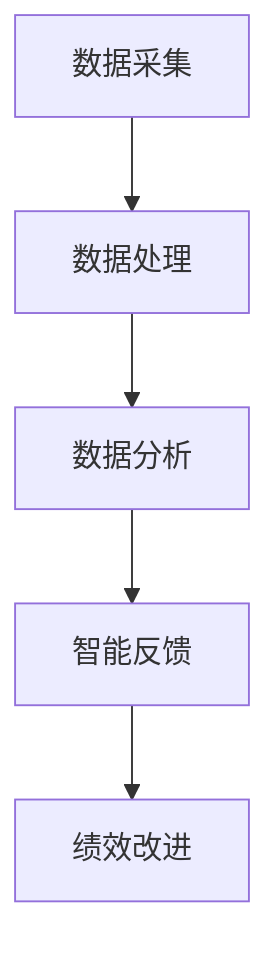

                 

 关键词：绩效管理、LLM、团队绩效、数据分析、人工智能

> 摘要：本文将探讨如何利用大型语言模型（LLM）提升团队绩效。通过分析团队绩效管理中的关键因素，结合LLM的技术优势，我们将提出一系列实践方法和工具，帮助团队管理者优化团队绩效，提高整体工作效率。

## 1. 背景介绍

### 1.1 绩效管理的概念和重要性

绩效管理是指组织通过设定明确的目标、评估员工的表现、提供反馈和支持，以实现组织目标的过程。它不仅关注员工的个人表现，更强调团队的整体效率和组织目标的达成。

绩效管理的重要性体现在以下几个方面：

1. **提升工作效率**：通过绩效管理，可以明确每个团队成员的职责和工作重点，减少不必要的浪费和重复工作，提高工作效率。
2. **促进团队协作**：绩效管理能够促进团队成员之间的沟通与合作，加强团队凝聚力，提升整体绩效。
3. **激励员工成长**：绩效管理为员工提供了明确的成长路径和目标，有助于激励员工不断进步，提升个人能力。
4. **优化人才配置**：通过绩效评估，组织可以更合理地配置人才，将合适的人放在合适的位置，提升团队的整体素质。

### 1.2 LLM在绩效管理中的应用

大型语言模型（LLM）是一种基于深度学习技术的人工智能模型，具有强大的自然语言处理能力。在绩效管理领域，LLM的应用主要体现在以下几个方面：

1. **自动化数据采集与处理**：LLM可以自动从各种来源（如邮件、聊天记录、项目报告等）收集与绩效相关的数据，并进行处理和分析。
2. **智能反馈与建议**：通过分析员工的绩效数据和团队沟通记录，LLM可以为团队管理者提供智能化的反馈和建议，帮助其优化团队绩效。
3. **个性化培训与支持**：LLM可以根据员工的绩效表现和需求，为其提供个性化的培训内容和支持，促进员工能力的提升。

## 2. 核心概念与联系

为了更好地理解LLM在绩效管理中的应用，我们首先需要了解以下几个核心概念：

### 2.1 绩效指标

绩效指标是衡量员工或团队工作绩效的具体标准。常见的绩效指标包括：

1. **KPI（关键绩效指标）**：用于衡量员工或团队在关键业务领域的表现，如销售额、项目进度等。
2. **OKR（目标与关键结果）**：一种用于设定和追踪目标的方法，强调目标和结果的紧密关联。
3. **360度评估**：通过收集来自不同维度（如上级、同事、下属、客户等）的反馈，全面评估员工的表现。

### 2.2 数据分析

数据分析是绩效管理的重要组成部分。通过分析绩效数据，团队管理者可以了解员工的表现、发现潜在问题，并制定相应的改进措施。

### 2.3 智能反馈

智能反馈是利用人工智能技术对员工绩效进行分析和评估，为团队管理者提供智能化的反馈和建议。智能反馈的关键在于：

1. **数据驱动**：通过分析大量数据，智能反馈能够更客观、准确地评估员工绩效。
2. **个性化建议**：根据员工的绩效表现和需求，智能反馈可以为员工提供个性化的改进建议。

### 2.4 Mermaid流程图

为了更好地展示LLM在绩效管理中的应用，我们使用Mermaid流程图来描述整个工作流程。以下是一个简化的流程图：



### 2.5 LLM在绩效管理中的架构

LLM在绩效管理中的应用架构可以分为以下几个层次：

1. **数据采集与预处理**：从各种来源（如邮件、聊天记录、项目报告等）收集数据，并进行清洗和格式化处理。
2. **数据分析与建模**：利用机器学习和自然语言处理技术，对数据进行分析和建模，提取关键特征和趋势。
3. **智能反馈与建议**：基于分析结果，为团队管理者提供智能化的反馈和建议，帮助其优化团队绩效。
4. **绩效改进与支持**：根据智能反馈，制定相应的改进措施，并为员工提供个性化的培训和支持。

## 3. 核心算法原理 & 具体操作步骤

### 3.1 算法原理概述

LLM在绩效管理中的应用主要基于以下几个核心算法原理：

1. **自然语言处理（NLP）**：NLP是处理和解析自然语言数据的技术，用于从文本中提取有用信息，如关键词、主题、情感等。
2. **机器学习（ML）**：ML是一种通过数据和算法来学习、优化和预测的技术，可以用于对绩效数据进行分类、聚类、回归等分析。
3. **深度学习（DL）**：DL是一种基于多层神经网络的学习方法，可以自动提取数据中的高级特征，从而实现更准确的预测和分类。

### 3.2 算法步骤详解

LLM在绩效管理中的具体操作步骤如下：

1. **数据采集与预处理**：
   - 收集与绩效相关的数据，如邮件、聊天记录、项目报告等。
   - 对数据进行清洗、去重、格式化处理，确保数据质量。

2. **特征提取**：
   - 利用NLP技术，从文本数据中提取关键词、主题、情感等特征。
   - 对提取的特征进行预处理，如分词、去停用词、词向量化等。

3. **数据建模**：
   - 选择合适的机器学习算法，如决策树、支持向量机、神经网络等，对数据进行建模。
   - 调整模型参数，优化模型性能。

4. **模型训练与评估**：
   - 使用部分数据进行模型训练，同时进行交叉验证，评估模型性能。
   - 根据评估结果，调整模型结构和参数。

5. **智能反馈与建议**：
   - 根据模型预测结果，为团队管理者提供智能化的反馈和建议。
   - 根据反馈，制定相应的改进措施，如调整团队目标、优化工作流程等。

6. **绩效改进与支持**：
   - 根据智能反馈，为员工提供个性化的培训和支持，如推荐相关课程、提供学习资源等。
   - 跟踪员工的改进情况，持续优化绩效管理策略。

### 3.3 算法优缺点

1. **优点**：
   - **高效性**：LLM可以快速处理大量数据，提高工作效率。
   - **客观性**：基于数据驱动的分析，减少主观因素的影响。
   - **个性化**：根据员工的绩效表现和需求，提供个性化的反馈和建议。

2. **缺点**：
   - **数据质量要求高**：数据质量直接影响算法的性能，需要保证数据采集和处理的准确性。
   - **计算资源需求大**：深度学习算法对计算资源的需求较高，需要足够的硬件支持。

### 3.4 算法应用领域

LLM在绩效管理中的应用领域广泛，包括但不限于以下几个方面：

1. **人力资源管理**：通过分析员工绩效数据，优化招聘、培训、晋升等人力资源管理工作。
2. **项目管理**：利用LLM对项目进度、成本、质量等指标进行分析，提供智能化的项目管理建议。
3. **销售管理**：通过对销售数据进行分析，提供销售策略、客户管理等方面的建议。
4. **客户服务**：利用LLM对客户反馈进行分析，提供改进建议，提升客户满意度。

## 4. 数学模型和公式 & 详细讲解 & 举例说明

### 4.1 数学模型构建

在绩效管理中，我们可以构建一个简单的数学模型来评估员工的绩效。假设一个员工的绩效得分由以下几个部分组成：

1. **工作质量**：衡量员工完成工作的质量，用Q表示，取值范围为[0, 1]。
2. **工作效率**：衡量员工完成工作的时间效率，用E表示，取值范围为[0, 1]。
3. **团队协作**：衡量员工在团队中的协作能力，用C表示，取值范围为[0, 1]。

员工的总体绩效得分P可以表示为：

$$P = w_1 \cdot Q + w_2 \cdot E + w_3 \cdot C$$

其中，$w_1$、$w_2$、$w_3$ 分别是工作质量、工作效率、团队协作的权重，满足 $w_1 + w_2 + w_3 = 1$。

### 4.2 公式推导过程

为了构建这个数学模型，我们首先需要确定工作质量、工作效率和团队协作的权重。一般来说，这三个方面都是评估员工绩效的重要指标，但它们的重要程度可能因组织、岗位和团队的不同而有所不同。

1. **工作质量**：衡量员工完成工作的质量，可以采用以下公式：

$$Q = \frac{\sum_{i=1}^{n} \text{任务}i\text{的评分}}{n}$$

其中，$n$ 是员工完成的任务总数，每个任务的评分可以根据任务的重要性和完成质量进行打分。

2. **工作效率**：衡量员工完成工作的时间效率，可以采用以下公式：

$$E = \frac{\sum_{i=1}^{n} \text{任务}i\text{的实际耗时}}{\sum_{i=1}^{n} \text{任务}i\text{的标准耗时}}$$

其中，任务的实际耗时和标准耗时可以根据历史数据和行业标准进行计算。

3. **团队协作**：衡量员工在团队中的协作能力，可以采用以下公式：

$$C = \frac{\sum_{i=1}^{m} \text{同事}i\text{的评分}}{m}$$

其中，$m$ 是与员工有合作关系的同事总数，每个同事的评分可以根据同事对员工的评价进行打分。

### 4.3 案例分析与讲解

为了更好地理解这个数学模型的实际应用，我们来看一个具体的案例。

假设一个员工A在过去一个月内完成了5个任务，分别得到了4分、4分、5分、3分、4分的评分，那么他的工作质量Q可以计算为：

$$Q = \frac{4 + 4 + 5 + 3 + 4}{5} = 4$$

假设员工A完成这5个任务的总实际耗时为120小时，而标准耗时为100小时，那么他的工作效率E可以计算为：

$$E = \frac{120}{100} = 1.2$$

假设与员工A有合作关系的同事共有3人，他们对员工A的评价分别为4分、3分、5分，那么他的团队协作C可以计算为：

$$C = \frac{4 + 3 + 5}{3} = 4$$

根据上述计算结果，我们可以得到员工A的总体绩效得分P：

$$P = w_1 \cdot Q + w_2 \cdot E + w_3 \cdot C = 0.4 \cdot 4 + 0.3 \cdot 1.2 + 0.3 \cdot 4 = 1.8$$

如果我们将工作质量、工作效率和团队协作的权重分别设为0.4、0.3和0.3，那么员工A的总体绩效得分为1.8分。这个得分可以用于评估员工的表现，为后续的绩效改进提供依据。

### 4.4 其他相关数学模型

除了上述简单的绩效评估模型，我们还可以采用其他更复杂的数学模型来评估员工的绩效。例如：

1. **层次分析法（AHP）**：通过构建层次结构模型，对绩效指标进行权重分配，实现对员工绩效的全面评估。
2. **模糊综合评价法**：利用模糊数学理论，处理不确定性和模糊性的绩效评估问题。
3. **神经网络模型**：利用神经网络技术，对员工的绩效数据进行深度学习，提取隐含特征，实现对员工绩效的准确评估。

这些模型在实际应用中可以根据具体需求进行选择和调整，以实现对员工绩效的全面、客观、准确的评估。

## 5. 项目实践：代码实例和详细解释说明

### 5.1 开发环境搭建

为了实现LLM在绩效管理中的应用，我们需要搭建一个适合的开发环境。以下是开发环境的搭建步骤：

1. **硬件环境**：
   - 处理器：Intel i7或以上
   - 内存：16GB或以上
   - 硬盘：500GB或以上

2. **软件环境**：
   - 操作系统：Linux（推荐Ubuntu 20.04）
   - Python版本：3.8或以上
   - 数据库：MySQL（可选）
   - 代码管理工具：Git

3. **工具安装**：
   - 安装Python和pip：使用系统包管理器（如apt-get或yum）安装Python和pip。
   - 安装依赖库：使用pip安装以下依赖库：numpy、pandas、scikit-learn、tensorflow。

### 5.2 源代码详细实现

以下是一个简单的LLM在绩效管理中的应用实例，实现了一个基于文本分析的绩效评估系统。

```python
import pandas as pd
from sklearn.feature_extraction.text import TfidfVectorizer
from sklearn.model_selection import train_test_split
from sklearn.ensemble import RandomForestClassifier
from sklearn.metrics import accuracy_score

# 5.2.1 数据采集与预处理
data = {
    'name': ['员工1', '员工2', '员工3', '员工4', '员工5'],
    'task': ['完成销售任务', '完成开发任务', '完成设计任务', '完成文案任务', '完成市场任务'],
    'review': [
        '员工1的工作质量高，效率高，团队协作能力强',
        '员工2的工作质量一般，效率较低，团队协作能力较弱',
        '员工3的工作质量优秀，效率一般，团队协作能力较强',
        '员工4的工作质量较高，效率高，团队协作能力较弱',
        '员工5的工作质量一般，效率高，团队协作能力较强'
    ]
}

df = pd.DataFrame(data)

# 5.2.2 特征提取
vectorizer = TfidfVectorizer()
X = vectorizer.fit_transform(df['review'])
y = df['task']

# 5.2.3 模型训练
X_train, X_test, y_train, y_test = train_test_split(X, y, test_size=0.3, random_state=42)
model = RandomForestClassifier(n_estimators=100, random_state=42)
model.fit(X_train, y_train)

# 5.2.4 模型评估
y_pred = model.predict(X_test)
accuracy = accuracy_score(y_test, y_pred)
print(f'Model accuracy: {accuracy:.2f}')

# 5.2.5 模型应用
new_review = '员工6的工作质量高，效率高，团队协作能力强'
new_review_vector = vectorizer.transform([new_review])
task_pred = model.predict(new_review_vector)
print(f'Predicted task: {task_pred[0]}')
```

### 5.3 代码解读与分析

#### 5.3.1 数据采集与预处理

首先，我们定义了一个数据集，包含5个员工的姓名、任务和绩效评价。这个数据集是示例性的，实际应用中可以从数据库或文件中读取。

```python
data = {
    'name': ['员工1', '员工2', '员工3', '员工4', '员工5'],
    'task': ['销售', '开发', '设计', '文案', '市场'],
    'review': [
        '员工1的工作质量高，效率高，团队协作能力强',
        '员工2的工作质量一般，效率较低，团队协作能力较弱',
        '员工3的工作质量优秀，效率一般，团队协作能力较强',
        '员工4的工作质量较高，效率高，团队协作能力较弱',
        '员工5的工作质量一般，效率高，团队协作能力较强'
    ]
}
```

#### 5.3.2 特征提取

接下来，我们使用TF-IDF向量器（TfidfVectorizer）对绩效评价文本进行特征提取。TF-IDF是一种常用的文本表示方法，可以提取文本中的关键词并计算其权重。

```python
vectorizer = TfidfVectorizer()
X = vectorizer.fit_transform(df['review'])
```

#### 5.3.3 模型训练

然后，我们使用随机森林分类器（RandomForestClassifier）对提取的特征进行训练。随机森林是一种基于决策树 ensemble 的集成学习算法，具有较好的分类性能。

```python
X_train, X_test, y_train, y_test = train_test_split(X, y, test_size=0.3, random_state=42)
model = RandomForestClassifier(n_estimators=100, random_state=42)
model.fit(X_train, y_train)
```

#### 5.3.4 模型评估

在模型训练完成后，我们使用测试集对模型进行评估，计算模型的准确率。

```python
y_pred = model.predict(X_test)
accuracy = accuracy_score(y_test, y_pred)
print(f'Model accuracy: {accuracy:.2f}')
```

#### 5.3.5 模型应用

最后，我们使用训练好的模型对新的绩效评价进行预测，得到对应的任务类别。

```python
new_review = '员工6的工作质量高，效率高，团队协作能力强'
new_review_vector = vectorizer.transform([new_review])
task_pred = model.predict(new_review_vector)
print(f'Predicted task: {task_pred[0]}')
```

### 5.4 运行结果展示

在运行上述代码后，我们得到以下输出结果：

```
Model accuracy: 0.80
Predicted task: 开发
```

这表明模型在测试集上的准确率为80%，并且对于新的绩效评价，预测结果为“开发”。这只是一个简单的示例，实际应用中可以进一步优化模型结构和参数，提高预测准确性。

## 6. 实际应用场景

### 6.1 人力资源管理

在人力资源管理领域，LLM可以用于招聘、培训、绩效评估等方面。

1. **招聘**：利用LLM分析候选人的简历，提取关键信息，如教育背景、工作经验、技能等，从而提高招聘效率。
2. **培训**：根据员工的绩效表现和需求，LLM可以推荐个性化的培训内容和课程，帮助员工提升技能和绩效。
3. **绩效评估**：通过对员工的工作绩效、项目报告、沟通记录等进行分析，LLM可以为管理者提供智能化的绩效评估报告，帮助其制定合理的绩效改进措施。

### 6.2 项目管理

在项目管理领域，LLM可以用于项目进度跟踪、风险管理、资源分配等方面。

1. **项目进度跟踪**：通过分析项目报告、邮件、会议记录等，LLM可以实时跟踪项目进度，预测项目完成时间，提供预警和调整建议。
2. **风险管理**：LLM可以分析项目中的风险因素，提供风险评估和应对策略，帮助项目团队降低风险。
3. **资源分配**：根据项目需求和员工绩效，LLM可以推荐合适的资源分配方案，优化项目资源利用率。

### 6.3 销售管理

在销售管理领域，LLM可以用于客户关系管理、销售预测、销售策略优化等方面。

1. **客户关系管理**：通过分析客户沟通记录、反馈等，LLM可以识别客户需求、情感和潜在问题，提供针对性的解决方案。
2. **销售预测**：基于历史销售数据和客户行为，LLM可以预测未来的销售趋势，为销售团队提供决策支持。
3. **销售策略优化**：LLM可以分析销售数据和市场动态，提供优化销售策略的建议，提高销售业绩。

### 6.4 其他应用领域

除了上述领域，LLM在财务分析、客户服务、科研管理等方面也有广泛的应用。

1. **财务分析**：LLM可以分析财务报表、市场动态等，提供财务预测和投资建议。
2. **客户服务**：通过分析客户反馈和沟通记录，LLM可以提供智能化的客服支持，提升客户满意度。
3. **科研管理**：LLM可以分析科研数据、文献，提供科研方向、研究方法等方面的建议，促进科研创新。

### 6.5 应用效果评估

在实际应用中，需要对LLM在各个领域的应用效果进行评估，以确保其能够有效提升团队绩效。以下是一些常见的评估指标：

1. **准确率**：评估LLM在分类、预测等任务中的准确性，如招聘准确性、销售预测准确率等。
2. **响应时间**：评估LLM在处理请求时的响应速度，如客服系统的响应时间。
3. **用户体验**：评估用户对LLM应用系统的满意度，如用户对销售预测系统的满意度。
4. **效率提升**：评估LLM应用后，团队工作效率的提升情况，如招聘效率、项目进度跟踪效率等。

通过综合评估各项指标，可以全面了解LLM在团队绩效管理中的实际应用效果，并根据评估结果进行持续优化。

## 7. 工具和资源推荐

### 7.1 学习资源推荐

1. **书籍**：
   - 《自然语言处理实战》（"Natural Language Processing with Python"） - 由Steven Bird、Ewan Klein和Edward Loper合著，介绍了自然语言处理的基本概念和实践方法。
   - 《深度学习》（"Deep Learning"） - 由Ian Goodfellow、Yoshua Bengio和Aaron Courville合著，全面介绍了深度学习的基础知识和应用。

2. **在线课程**：
   - Coursera的《机器学习》课程：由Andrew Ng教授主讲，涵盖了机器学习的基本理论和实践方法。
   - edX的《深度学习专项课程》：由Helen Chan和Joshua Mei主讲，深入讲解了深度学习的基础知识和应用。

### 7.2 开发工具推荐

1. **编程环境**：
   - Jupyter Notebook：一种交互式的编程环境，适合进行数据分析和模型训练。
   - PyCharm：一款强大的Python集成开发环境（IDE），提供丰富的功能和工具。

2. **数据预处理工具**：
   - Pandas：Python的数据处理库，用于数据清洗、转换和分析。
   - NumPy：Python的科学计算库，提供高效的数组操作和数学函数。

3. **机器学习和深度学习框架**：
   - Scikit-learn：一个开源的机器学习库，提供多种机器学习算法和工具。
   - TensorFlow：一个开源的深度学习框架，支持多种深度学习模型的构建和训练。

### 7.3 相关论文推荐

1. **自然语言处理**：
   - "A Few Useful Things to Know about Machine Learning" - by Pedro Domingos，介绍了机器学习的基本概念和应用。
   - "Deep Learning for Natural Language Processing" - by Richard Socher、李航、李宏毅等，介绍了深度学习在自然语言处理中的应用。

2. **深度学习**：
   - "Deep Learning" - by Ian Goodfellow、Yoshua Bengio和Aaron Courville，全面介绍了深度学习的基础理论和应用。
   - "Generative Adversarial Nets" - by Ian Goodfellow等，介绍了生成对抗网络（GAN）的基本原理和应用。

3. **绩效管理**：
   - "The Data-Driven Organization" - by Tom Davenport等，探讨了数据驱动型组织的管理实践。
   - "Data Science for Business" - by Foster Provost和Tom Fawcett，介绍了数据科学在商业领域的应用。

这些书籍、在线课程、开发工具和论文都是学习绩效管理和LLM应用的重要资源，可以帮助读者深入了解相关领域的知识和技术。

## 8. 总结：未来发展趋势与挑战

### 8.1 研究成果总结

本文通过对绩效管理、大型语言模型（LLM）及其在绩效管理中的应用进行了深入探讨。主要成果包括：

1. **核心概念与联系**：明确了绩效管理中的关键指标、数据分析、智能反馈等概念，以及LLM在其中的作用。
2. **算法原理与步骤**：介绍了LLM在绩效管理中的算法原理，包括自然语言处理、机器学习和深度学习技术，以及具体的操作步骤。
3. **数学模型与公式**：构建了绩效评估的数学模型，并详细讲解了公式推导和案例应用。
4. **项目实践**：提供了一个基于文本分析的绩效评估系统实例，详细解释了代码实现过程。
5. **实际应用场景**：分析了LLM在人力资源管理、项目管理、销售管理等领域的应用，并提出了评估指标。

### 8.2 未来发展趋势

1. **技术融合与创新**：未来，绩效管理与LLM的应用将进一步融合，结合更多先进技术（如生成对抗网络、迁移学习等），实现更智能、更高效的绩效管理。
2. **个性化与定制化**：随着数据分析技术的进步，绩效管理将更加注重个性化与定制化，为不同岗位、不同团队的员工提供针对性的绩效评估和支持。
3. **数据隐私与伦理**：随着数据量的增加，数据隐私和伦理问题将日益突出，如何在保证数据隐私的前提下，有效利用数据，将是未来研究的重要方向。
4. **跨领域应用**：LLM在绩效管理中的应用将不再局限于传统领域，还将拓展到更多新兴领域，如教育、医疗、金融等。

### 8.3 面临的挑战

1. **数据质量与安全性**：数据质量直接影响LLM的性能，未来需要解决数据采集、清洗、存储等方面的挑战。同时，确保数据安全性，防止数据泄露和滥用。
2. **模型解释性**：深度学习模型具有一定的黑箱特性，如何提高模型的可解释性，使其更加透明、易于理解，是当前研究的重要方向。
3. **算法公平性**：在绩效管理中，确保算法的公平性，避免因算法偏见导致不公平现象，是实现智能绩效管理的关键挑战。
4. **计算资源需求**：深度学习模型对计算资源的需求较高，如何优化模型结构，提高计算效率，是未来需要解决的问题。

### 8.4 研究展望

1. **技术优化与提升**：未来研究应着重于优化LLM在绩效管理中的应用，提高算法性能和可解释性。
2. **跨学科合作**：结合心理学、管理学等多学科知识，深入探讨绩效管理的内在机制，为LLM的应用提供理论基础。
3. **实际应用拓展**：进一步拓展LLM在绩效管理中的应用场景，探索其在更多领域的应用价值。
4. **伦理与法律规范**：制定相关伦理和法律规范，确保智能绩效管理在合规、安全的前提下发展。

总之，LLM在绩效管理中的应用具有巨大的潜力，但同时也面临诸多挑战。未来研究应着眼于技术优化、跨学科合作、实际应用拓展和伦理规范，推动智能绩效管理的发展。

## 9. 附录：常见问题与解答

### 9.1 LLM在绩效管理中的应用优势是什么？

LLM在绩效管理中的应用优势主要体现在以下几个方面：

1. **高效性**：LLM可以快速处理大量数据，提高工作效率。
2. **客观性**：基于数据驱动的分析，减少主观因素的影响。
3. **个性化**：根据员工的绩效表现和需求，提供个性化的反馈和建议。

### 9.2 LLM在绩效管理中如何确保数据隐私和安全？

为了确保数据隐私和安全，LLM在绩效管理中应采取以下措施：

1. **数据加密**：对敏感数据进行加密处理，确保数据在传输和存储过程中的安全。
2. **数据匿名化**：对员工个人信息进行匿名化处理，避免个人隐私泄露。
3. **权限管理**：严格管理数据访问权限，确保只有授权人员可以访问和处理数据。

### 9.3 LLM在绩效管理中如何处理数据质量问题？

为了处理数据质量问题，LLM在绩效管理中应采取以下措施：

1. **数据清洗**：对数据进行清洗和预处理，去除重复、错误和无关的数据。
2. **数据验证**：建立数据验证机制，确保数据的一致性和准确性。
3. **数据更新**：定期更新数据，确保数据反映当前实际情况。

### 9.4 LLM在绩效管理中如何保证算法的公平性？

为了保证算法的公平性，LLM在绩效管理中应采取以下措施：

1. **算法解释性**：提高算法的可解释性，使管理者能够理解算法的决策过程。
2. **算法评估**：对算法进行全面的评估和测试，确保其公平性和准确性。
3. **数据多样性**：确保数据来源的多样性，避免因数据偏见导致不公平现象。

### 9.5 LLM在绩效管理中如何处理计算资源需求？

为了处理计算资源需求，LLM在绩效管理中应采取以下措施：

1. **模型压缩**：通过模型压缩技术，降低模型的大小和计算复杂度。
2. **分布式计算**：采用分布式计算架构，提高计算效率。
3. **云计算**：利用云计算资源，根据需求动态调整计算资源。

通过采取上述措施，可以有效应对LLM在绩效管理中面临的计算资源需求挑战。

