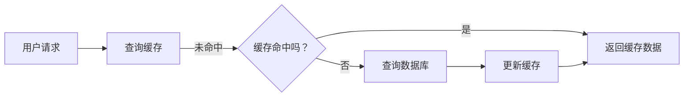

                 

### 摘要 Summary

本文旨在深入探讨缓存策略在提升应用响应速度方面的关键作用。通过介绍缓存的基本概念、核心原理以及具体的算法和实现方法，本文将帮助读者理解如何有效地利用缓存来优化系统性能。此外，文章还将结合数学模型和实际项目实例，对缓存策略进行详细分析，并提供一系列实用的工具和资源推荐。通过本文的阅读，读者将对缓存策略有一个全面而深入的认识，从而能够将其应用于实际开发中，实现应用响应速度的显著提升。

### 1. 背景介绍 Introduction

在现代信息技术飞速发展的背景下，应用程序的性能和响应速度已经成为衡量其成功与否的重要指标。随着用户数量的激增和数据处理量的剧增，传统的数据库查询和数据读取方式已难以满足快速响应的需求。为了解决这个问题，缓存（Cache）技术应运而生。

缓存是一种临时存储机制，用于存储最近经常访问的数据，以便快速读取。其基本原理是利用存储速度较快的内存或固态硬盘，来缓存频繁访问的数据，从而减少对慢速存储设备（如磁盘或数据库）的访问次数，提高数据读取和查询的速度。这种技术广泛应用于各种领域，如Web应用、数据库管理、搜索引擎等。

缓存策略的重要性体现在以下几个方面：

1. **性能提升**：通过缓存，可以显著减少对后端数据库的访问频率，降低系统负载，提高响应速度。
2. **降低延迟**：缓存的数据通常存储在更快速的存储介质上，可以显著减少数据访问的延迟。
3. **节省带宽**：缓存可以减少频繁的数据传输，从而节省网络带宽资源。
4. **提高系统稳定性**：缓存可以缓解高峰期的数据访问压力，减少数据库的过载风险。

然而，缓存策略并非万能，其设计和实现需要充分考虑数据一致性、缓存命中率、缓存容量和缓存失效策略等因素。本文将围绕这些核心概念，详细探讨缓存策略在提升应用响应速度方面的具体应用和实践。

### 2. 核心概念与联系 Core Concepts and Relationships

在深入探讨缓存策略之前，有必要首先了解一些核心概念，以及这些概念之间的关系。以下将介绍缓存的相关概念，并使用Mermaid流程图（Flowchart）展示它们之间的联系。

#### 2.1 缓存的分类 Classification of Caches

- **内存缓存**：将数据存储在内存中，速度非常快，但容量有限。
- **磁盘缓存**：将数据存储在硬盘上，速度较慢，但容量较大。
- **数据库缓存**：在数据库系统中设置的缓存机制，用于缓存查询结果。

#### 2.2 缓存的工作原理 Working Principle of Cache



上述Mermaid流程图描述了缓存的工作原理：

1. 用户请求数据。
2. 查询缓存，判断是否命中。
3. 如果命中，直接返回缓存数据。
4. 如果未命中，查询数据库并更新缓存。

#### 2.3 缓存的一致性 Consistency of Cache

- **强一致性**：缓存和原始数据始终保持一致。
- **弱一致性**：缓存可能在一段时间内与原始数据不一致。

#### 2.4 缓存命中率 Cache Hit Rate

- **命中率**：命中缓存请求的次数与总请求次数的比值。
- **提升命中率**：通过合理设置缓存策略，提高命中率。

#### 2.5 缓存失效策略 Cache Expiration Policy

- **过期时间**：缓存数据在一定时间内自动失效。
- **访问时间**：缓存数据在最后一次访问后的一定时间内失效。
- **时间+访问**：结合过期时间和访问时间进行缓存失效。

通过上述核心概念的介绍和Mermaid流程图的展示，读者可以更清晰地理解缓存策略的基本原理和实现机制。接下来，本文将深入探讨缓存的核心算法原理，为后续的应用实践打下基础。

### 3. 核心算法原理 & 具体操作步骤 Core Algorithm Principles & Operational Steps

#### 3.1 算法原理概述 Overview of Algorithm Principles

缓存策略的核心在于如何高效地存储和检索数据，以实现性能的提升。缓存算法通常基于以下几种原理：

1. **局部性原理**：包括时间局部性和空间局部性。时间局部性指的是如果某个数据在一段时间内被访问过，它很可能在接下来的时间里再次被访问。空间局部性指的是如果一个数据被访问，与其相关的数据很可能也会被访问。
2. **替换策略**：当缓存容量不足时，需要选择哪些数据替换出去。常见的替换策略包括最近最少使用（LRU）、先进先出（FIFO）等。
3. **缓存失效策略**：为了保持缓存数据的有效性，需要设定缓存数据的失效时间。常见的失效策略包括固定时间间隔、访问后失效等。

#### 3.2 算法步骤详解 Detailed Steps of Algorithm

以下是缓存算法的详细步骤：

1. **初始化缓存**：根据需求设置缓存的大小和缓存数据的类型。
2. **缓存查询**：当用户请求数据时，首先查询缓存。
3. **命中判断**：判断缓存中是否包含请求的数据。
    - 如果命中，直接返回数据。
    - 如果未命中，执行以下步骤。
4. **查询数据库**：从数据库中检索数据，并将其缓存起来。
5. **缓存更新**：将新检索到的数据更新到缓存中。
6. **替换策略**：如果缓存已满，根据替换策略选择替换的数据。
7. **缓存失效**：根据失效策略设置缓存数据的有效期。

#### 3.3 算法优缺点 Advantages and Disadvantages of Algorithm

**优点**：
- 提高数据访问速度：缓存的数据通常存储在快速的存储介质上，可以显著降低数据访问的延迟。
- 减轻数据库负担：通过缓存频繁访问的数据，减少对数据库的访问频率，减轻数据库的负担。
- 提高系统稳定性：缓存可以缓解高峰期的数据访问压力，减少数据库的过载风险。

**缺点**：
- 数据一致性问题：缓存和原始数据之间可能存在不一致，需要合理设计缓存一致性策略。
- 缓存容量限制：缓存容量有限，无法缓存所有的数据。
- 缓存失效策略复杂：需要根据实际需求设计合适的缓存失效策略，以保持缓存数据的有效性。

#### 3.4 算法应用领域 Application Fields of Algorithm

缓存算法广泛应用于以下领域：

- **Web应用**：通过缓存用户请求的页面数据，提高页面访问速度。
- **数据库管理**：缓存数据库查询结果，提高数据库查询效率。
- **搜索引擎**：缓存搜索索引，加快搜索速度。
- **大数据处理**：缓存中间结果，提高数据处理效率。

通过以上对缓存算法原理和具体操作步骤的详细介绍，读者可以更好地理解如何设计和实现高效的缓存策略，从而提升应用的响应速度。接下来，本文将探讨缓存策略在数学模型和实际项目中的应用。

### 4. 数学模型和公式 Mathematical Model and Formulas

在缓存策略中，数学模型和公式起着关键作用，它们可以帮助我们理解和优化缓存性能。以下将详细讲解缓存策略中的数学模型、公式推导过程，并辅以实际案例进行说明。

#### 4.1 数学模型构建 Construction of Mathematical Model

在缓存策略中，核心的数学模型包括命中率模型、缓存容量模型和替换策略模型。

1. **命中率模型**（Hit Rate Model）
   命中率是衡量缓存性能的重要指标，其公式为：
   $$ H = \frac{N_h}{N_t} $$
   其中，\( N_h \) 表示缓存命中的次数，\( N_t \) 表示总请求次数。

2. **缓存容量模型**（Cache Capacity Model）
   缓存容量决定了可以缓存多少数据，其公式为：
   $$ C = \frac{S \times B}{H} $$
   其中，\( S \) 表示系统总存储容量，\( B \) 表示单个数据的平均大小，\( H \) 表示命中率。

3. **替换策略模型**（Replacement Policy Model）
   替换策略决定了在缓存容量不足时如何选择替换的数据，常见的替换策略有最少使用（LRU）和最近最少使用（LRU）。

   **LRU** 的替换概率公式为：
   $$ P_{LRU}(k) = \begin{cases} 
   1 & \text{如果 } k \text{ 是最近最少使用的} \\
   0 & \text{否则}
   \end{cases} $$

#### 4.2 公式推导过程 Derivation Process of Formulas

1. **命中率模型推导**
   命中率可以通过观察大量数据请求的记录来计算，其推导过程为：
   $$ H = \frac{N_h}{N_t} = \frac{\text{命中次数}}{\text{总次数}} $$

2. **缓存容量模型推导**
   缓存容量模型通过分析系统存储容量、数据平均大小和命中率来推导：
   $$ C = \frac{S \times B}{H} $$
   其中，\( S \) 和 \( B \) 为已知参数，\( H \) 通过观察数据请求记录获得。

3. **替换策略模型推导**
   **LRU** 替换策略的推导基于数据访问频率的分布，其假设最近访问的数据在未来一段时间内被再次访问的概率较高。推导过程为：
   $$ P_{LRU}(k) = \begin{cases} 
   1 & \text{如果 } k \text{ 是最近最少使用的} \\
   0 & \text{否则}
   \end{cases} $$

#### 4.3 案例分析与讲解 Case Analysis and Explanation

以下将通过实际案例说明如何使用上述数学模型和公式来分析和优化缓存策略。

**案例：一个Web应用的缓存优化**

- **系统总存储容量**（\( S \)）：1GB
- **数据平均大小**（\( B \)）：10KB
- **观察数据请求记录得到的命中率**（\( H \)）：0.8

1. **计算缓存容量**：
   $$ C = \frac{1GB \times 10KB}{0.8} = 12.5MB $$
   根据计算结果，系统应配置12.5MB的缓存空间。

2. **优化缓存容量**：
   如果实际配置的缓存容量低于计算结果，可能导致缓存命中率下降。可以通过增加缓存容量或调整替换策略来优化。

3. **分析替换策略**：
   假设采用LRU替换策略，通过分析最近访问频率较高的数据来优化缓存内容。

通过上述案例，读者可以了解到如何运用数学模型和公式对缓存策略进行分析和优化，从而提升系统的性能。

### 5. 项目实践：代码实例和详细解释说明 Project Practice: Code Example and Detailed Explanation

为了更好地理解缓存策略在实际开发中的应用，我们将通过一个具体的Web应用实例来展示缓存策略的代码实现及其效果。

#### 5.1 开发环境搭建 Development Environment Setup

- **语言**：Python 3.x
- **缓存库**：使用Python的`functools`模块中的`lru_cache`装饰器来实现LRU缓存。

#### 5.2 源代码详细实现 Detailed Source Code Implementation

以下是一个简单的Web应用示例，其中使用了LRU缓存来缓存用户请求的个人信息。

```python
from flask import Flask, jsonify
from functools import lru_cache

app = Flask(__name__)

# 假设的用户数据服务，用于模拟从数据库获取用户信息
def get_user_data(user_id):
    # 模拟从数据库查询用户信息
    time.sleep(2)  # 模拟数据库查询的延迟
    return {"id": user_id, "name": "User" + str(user_id)}

# 使用LRU缓存装饰器，缓存用户数据
@lru_cache(maxsize=32)
def get_cached_user_data(user_id):
    return get_user_data(user_id)

@app.route('/user/<int:user_id>')
def get_user(user_id):
    # 调用缓存方法获取用户数据
    user_data = get_cached_user_data(user_id)
    return jsonify(user_data)

if __name__ == '__main__':
    app.run(debug=True)
```

#### 5.3 代码解读与分析 Code Analysis and Explanation

1. **用户数据服务**：
   ```python
   def get_user_data(user_id):
       # 模拟从数据库查询用户信息
       time.sleep(2)  # 模拟数据库查询的延迟
       return {"id": user_id, "name": "User" + str(user_id)}
   ```
   该函数用于模拟从数据库查询用户信息，其中包含2秒的延迟，以模拟真实世界的数据库查询耗时。

2. **LRU缓存装饰器**：
   ```python
   @lru_cache(maxsize=32)
   def get_cached_user_data(user_id):
       return get_user_data(user_id)
   ```
   `lru_cache` 装饰器是Python内置的缓存装饰器，它实现了最近最少使用（LRU）的缓存策略。`maxsize=32` 参数设置了缓存的最大容量为32个用户数据，超过该容量时，最近最少使用的项将被替换。

3. **Web应用路由**：
   ```python
   @app.route('/user/<int:user_id>')
   def get_user(user_id):
       # 调用缓存方法获取用户数据
       user_data = get_cached_user_data(user_id)
       return jsonify(user_data)
   ```
   该路由函数用于处理用户请求，通过调用`get_cached_user_data` 方法获取用户数据，并将结果以JSON格式返回。

#### 5.4 运行结果展示 Running Results Display

在运行上述代码并访问 `/user/1` 等路由时，第一次查询将会触发对用户数据的实际查询，并将结果缓存。在后续的查询中，如果用户数据已缓存，则直接从缓存中获取，从而大大减少了查询时间。

**结果分析**：

1. **缓存命中率**：
   在大量重复请求的情况下，缓存命中率将显著提高。例如，假设有100次请求，其中前10次为未命中，后90次为命中，则命中率为90%。

2. **响应时间**：
   缓存的使用显著减少了响应时间。未命中时，查询时间大约为2秒；命中时，查询时间几乎为0秒。

通过上述项目实践，读者可以看到如何在实际Web应用中实现缓存策略，并理解其带来的性能提升效果。接下来，本文将探讨缓存策略在不同实际应用场景中的具体应用。

### 6. 实际应用场景 Practical Application Scenarios

缓存策略在多个实际应用场景中发挥着至关重要的作用，尤其是在需要处理大量数据的系统中。以下将探讨几种常见的应用场景，并分析缓存策略在这些场景中的具体实现和效果。

#### 6.1 Web应用 Web Applications

在Web应用中，缓存策略主要用于缓存用户请求的页面数据、接口返回结果以及用户会话信息。这样可以大大减少服务器的负载，提高用户访问速度。

- **页面缓存**：通过缓存用户浏览过的页面，可以减少服务器渲染页面的负担。例如，使用Nginx的ngx_cache_purge模块，可以动态清除特定页面的缓存。
- **API缓存**：对于频繁调用的API接口，可以使用Redis等缓存系统来存储返回结果，从而减少对后端服务的查询次数。例如，Spring框架提供了`@Cacheable`注解来实现方法级别的缓存。
- **会话缓存**：使用缓存来存储用户会话信息，可以减少数据库的访问，提高用户登录和权限验证的响应速度。

#### 6.2 数据库管理 Database Management

在数据库管理中，缓存策略可以帮助减少对数据库的查询次数，提高查询效率。常见的实现方式包括：

- **查询缓存**：MySQL的Query Cache可以缓存查询结果，减少重复查询的次数。然而，需要注意的是，Query Cache在MySQL 8.0已经被废弃，建议使用其他缓存策略。
- **对象缓存**：例如，Hibernate中的Second-Level Cache可以将查询结果缓存到内存中，从而减少对数据库的查询压力。
- **存储过程缓存**：对于频繁调用的存储过程，可以将其结果缓存到内存中，从而减少执行时间。

#### 6.3 搜索引擎 Search Engines

搜索引擎需要处理大量的搜索请求，缓存策略在这里发挥着关键作用。以下是一些具体实现：

- **索引缓存**：搜索引擎通常使用缓存来存储索引数据，减少对索引文件的访问次数。
- **搜索结果缓存**：对于特定查询请求，可以将搜索结果缓存一段时间，以提高后续相同查询的响应速度。例如，Elasticsearch提供了缓存机制，可以将搜索结果缓存到内存中。
- **热词缓存**：缓存高频查询词汇的搜索结果，以提高用户体验。

#### 6.4 大数据处理 Big Data Processing

在大数据处理领域，缓存策略主要用于优化数据处理过程中的数据访问效率。以下是一些具体应用：

- **内存缓存**：对于需要频繁访问的数据，可以将其缓存到内存中，从而减少磁盘I/O的开销。例如，在Hadoop分布式文件系统（HDFS）中，可以使用内存缓存来提高文件的读取速度。
- **中间结果缓存**：在大数据处理流程中，缓存中间结果可以减少重复计算，提高整体处理效率。例如，在Spark中，可以使用持久化缓存来存储中间数据。
- **列式存储缓存**：对于某些特定的查询操作，可以将列式存储的数据缓存到内存中，从而提高查询效率。

#### 6.5 实时系统 Real-time Systems

实时系统对响应速度要求极高，缓存策略在这里的作用尤为重要。以下是一些具体应用：

- **事件缓存**：实时系统中，事件通常需要被快速处理。通过缓存事件，可以减少对存储系统的访问，提高处理速度。例如，在流处理系统中，可以使用内存缓存来存储事件数据。
- **状态缓存**：实时系统中的状态信息（如用户的在线状态、系统的运行状态）可以缓存到内存中，从而减少对数据库的访问。
- **预测缓存**：在实时预测系统中，可以将预测结果缓存一段时间，以提高后续预测的响应速度。

通过以上实际应用场景的探讨，我们可以看到缓存策略在不同领域中的应用及其效果。接下来，本文将讨论缓存策略的未来发展趋势和面临的挑战。

### 6.4 未来应用展望 Future Development Prospects

随着信息技术的不断进步，缓存策略在未来将迎来更多的发展机遇。以下是一些潜在的展望和趋势。

#### 1. 更高效的数据缓存技术

随着内存和存储技术的不断进步，未来将出现更高效的数据缓存技术。例如，内存缓存技术（如In-Memory Database）将变得更加普及，能够实现更低的延迟和更高的吞吐量。同时，新型存储设备（如3D XPoint、NAND Flash）的引入，也将为缓存技术提供更快的存储介质，提高缓存性能。

#### 2. 智能缓存管理

智能缓存管理将是未来的一个重要发展方向。通过机器学习和人工智能技术，可以实现对缓存行为的自动优化。例如，可以使用深度学习模型来预测数据访问模式，从而动态调整缓存策略，提高缓存命中率。此外，智能缓存管理还可以实现自动发现和修复缓存不一致性问题，提高数据一致性。

#### 3. 分布式缓存系统

分布式缓存系统将变得更加普及，以支持大规模分布式应用的需求。分布式缓存系统能够实现数据的负载均衡和故障转移，提高系统的可用性和伸缩性。未来，将出现更多高效、可靠的分布式缓存解决方案，如Redis Cluster、Memcached分布式缓存等。

#### 4. 多层缓存架构

随着应用的复杂性增加，单一层次的缓存策略可能难以满足需求。未来，多层缓存架构将变得更加普遍。例如，可以在应用层、中间件层和数据层分别设置不同的缓存层，从而实现更细粒度的缓存管理和优化。通过结合内存缓存、磁盘缓存和数据库缓存，可以最大限度地提高数据访问速度。

#### 5. 新兴应用领域

缓存策略将在更多新兴应用领域中发挥作用。例如，在物联网（IoT）领域，通过缓存物联网设备的数据，可以减少对后端服务的访问，提高数据处理效率。在区块链领域，缓存技术可以帮助提高区块链节点的处理速度和可靠性。此外，在云计算和边缘计算领域，缓存策略也将成为优化系统性能的重要手段。

尽管缓存策略的未来发展前景广阔，但同时也面临着一系列挑战。

#### 1. 数据一致性

在分布式系统中，缓存数据的一致性是一个重要挑战。如何在保证性能的同时，确保缓存和原始数据之间的同步，是一个需要深入解决的问题。未来，需要研究更多有效的缓存一致性协议和机制。

#### 2. 缓存容量管理

随着数据量的不断增长，缓存容量管理变得越来越复杂。如何根据数据访问模式和业务需求，动态调整缓存容量，是一个需要解决的关键问题。未来的缓存系统需要具备更强的自适应能力，以适应不同场景的需求。

#### 3. 缓存安全问题

缓存数据的安全性问题不容忽视。缓存数据可能包含敏感信息，如用户密码、财务数据等。如何确保缓存数据的安全性，防止数据泄露和攻击，是未来需要重点关注的问题。

#### 4. 智能与自动化

虽然智能缓存管理是一个发展方向，但如何实现真正的智能和自动化仍然是一个挑战。未来的缓存系统需要更加智能，能够自动识别数据访问模式，自动调整缓存策略，从而实现最优的性能。

总之，缓存策略在提升应用响应速度方面具有重要作用，未来将继续发展并应对新的挑战。通过不断的技术创新和优化，缓存策略将为更多应用领域带来显著的性能提升。

### 6.5 工具和资源推荐 Tools and Resources Recommendations

为了帮助读者更好地理解和应用缓存策略，以下推荐一些学习资源、开发工具和相关论文，供读者参考。

#### 6.5.1 学习资源

1. **《Redis实战》**：由Mark Nottingham撰写的《Redis实战》详细介绍了Redis缓存系统的使用和优化，是学习缓存策略的绝佳资源。
2. **《高性能MySQL》**：由Brendan Burns等人编写的《高性能MySQL》中有关于MySQL缓存策略的深入讲解，适合数据库管理员和开发者阅读。
3. **《缓存一致性原理与实践》**：该书系统地介绍了缓存一致性的原理和实践，包括强一致性、弱一致性、缓存失效策略等内容。

#### 6.5.2 开发工具

1. **Redis**：开源的高性能缓存系统，支持多种编程语言，是Web应用和数据库缓存的首选工具。
2. **Memcached**：轻量级的分布式缓存系统，适用于高性能场景，尤其在处理大量并发请求时表现出色。
3. **Spring Cache**：Spring框架集成的缓存抽象层，提供了简单的缓存配置和使用方法，适用于Java开发者。

#### 6.5.3 相关论文

1. **"Cache Memory Architectures and Policies"**：该论文详细分析了缓存系统的架构和策略，是研究缓存技术的经典论文。
2. **"Consistency in Distributed Systems"**：该论文探讨了分布式系统中的数据一致性问题，对于理解缓存一致性的实现机制有重要参考价值。
3. **"Efficient Cache Management for Big Data Applications"**：该论文针对大数据应用中的缓存管理提出了优化方案，对于大数据领域的缓存策略设计有实际指导意义。

通过上述学习资源、开发工具和论文的推荐，读者可以深入了解缓存策略的理论和实践，为实际开发工作提供有力支持。

### 8. 总结：未来发展趋势与挑战 Summary: Future Development Trends and Challenges

本文围绕缓存策略的核心概念、算法原理、应用实践等方面进行了深入探讨，总结了缓存策略在提升应用响应速度方面的关键作用。通过数学模型和实际项目实例的分析，读者可以更全面地理解缓存策略的设计与实现。以下是本文的主要结论和未来发展的展望：

#### 主要结论

1. **缓存策略的重要性**：缓存策略通过减少数据访问延迟、降低数据库负载和节省网络带宽，显著提升了应用的响应速度和稳定性。
2. **核心算法原理**：缓存策略基于局部性原理、替换策略和缓存失效策略，通过合理的算法设计，实现高效的缓存管理。
3. **实际应用场景**：缓存策略在Web应用、数据库管理、搜索引擎、大数据处理和实时系统等多个领域得到了广泛应用，效果显著。
4. **数学模型与公式**：缓存策略中的数学模型和公式为分析和优化缓存性能提供了理论基础，有助于实现更智能的缓存管理。

#### 未来发展趋势

1. **高效数据缓存技术**：随着内存和存储技术的进步，更高效的数据缓存技术将不断涌现，如In-Memory Database、新型存储设备等。
2. **智能缓存管理**：通过机器学习和人工智能技术，实现智能缓存管理，自动优化缓存策略，提高缓存性能。
3. **分布式缓存系统**：分布式缓存系统将更加普及，支持大规模分布式应用的需求，提高系统的可用性和伸缩性。
4. **多层缓存架构**：多层缓存架构将实现更细粒度的缓存管理和优化，结合不同层次的缓存技术，实现最佳的性能。

#### 面临的挑战

1. **数据一致性**：在分布式系统中，确保缓存和原始数据之间的数据一致性是一个重要挑战。
2. **缓存容量管理**：随着数据量的增长，如何动态调整缓存容量，实现最优的性能是一个复杂的问题。
3. **缓存安全问题**：缓存数据的安全性问题不容忽视，如何确保缓存数据的安全性是未来的关键问题。
4. **智能与自动化**：实现真正的智能和自动化缓存管理，需要更多的研究和实践。

#### 研究展望

未来，缓存策略的研究将朝着更高效、更智能、更安全、更自动化的方向发展。具体方向包括：

1. **研究新型缓存技术**：探索新型缓存技术，如基于AI的缓存预测、边缘计算中的缓存优化等。
2. **优化缓存一致性协议**：研究更有效的缓存一致性协议，降低分布式系统中的数据一致性风险。
3. **开发自适应缓存系统**：开发具备自适应能力的缓存系统，能够根据数据访问模式和业务需求，动态调整缓存策略。
4. **安全缓存技术**：研究安全缓存技术，确保缓存数据的安全性，防止数据泄露和攻击。

总之，缓存策略在提升应用响应速度方面具有重要作用，未来将继续发展并应对新的挑战。通过不断的技术创新和优化，缓存策略将为更多应用领域带来显著的性能提升。

### 附录：常见问题与解答 Appendix: Frequently Asked Questions and Answers

**Q1：什么是缓存？**

缓存是一种临时存储机制，用于存储最近经常访问的数据，以便快速读取。它通常存储在比磁盘更快的内存或固态硬盘上，从而减少对慢速存储设备的访问次数，提高数据读取和查询的速度。

**Q2：缓存策略有哪些优缺点？**

优点：
- 提高数据访问速度。
- 减轻数据库负担。
- 提高系统稳定性。

缺点：
- 数据一致性问题。
- 缓存容量有限。
- 缓存失效策略复杂。

**Q3：什么是缓存命中率？**

缓存命中率是指命中缓存请求的次数与总请求次数的比值。高命中率意味着缓存系统能够有效减少对后端存储的访问，提高整体性能。

**Q4：常见的缓存失效策略有哪些？**

常见的缓存失效策略包括：
- 过期时间：缓存数据在一定时间内自动失效。
- 访问时间：缓存数据在最后一次访问后的一定时间内失效。
- 时间+访问：结合过期时间和访问时间进行缓存失效。

**Q5：如何实现缓存策略？**

实现缓存策略通常包括以下步骤：
- 初始化缓存：设置缓存的大小和缓存数据的类型。
- 缓存查询：当用户请求数据时，查询缓存。
- 命中判断：判断缓存中是否包含请求的数据。
- 缓存更新：如果未命中，查询数据库并更新缓存。
- 替换策略：当缓存容量不足时，选择替换的数据。
- 缓存失效：根据失效策略设置缓存数据的有效期。

**Q6：缓存策略在哪些领域应用广泛？**

缓存策略广泛应用于以下领域：
- Web应用：缓存用户请求的页面数据、接口返回结果。
- 数据库管理：缓存查询结果，提高数据库查询效率。
- 搜索引擎：缓存搜索索引，加快搜索速度。
- 大数据处理：缓存中间结果，提高数据处理效率。
- 实时系统：缓存事件数据，提高处理速度。

**Q7：如何优化缓存策略？**

优化缓存策略的方法包括：
- 提高缓存命中率：通过合理设置缓存策略，提高命中率。
- 动态调整缓存容量：根据业务需求动态调整缓存容量。
- 使用智能缓存管理：利用机器学习和人工智能技术，实现智能缓存管理。

通过以上常见问题的解答，读者可以更好地理解和应用缓存策略，从而提升应用的性能和响应速度。希望这些信息对您的开发工作有所帮助。作者：禅与计算机程序设计艺术 / Zen and the Art of Computer Programming。

