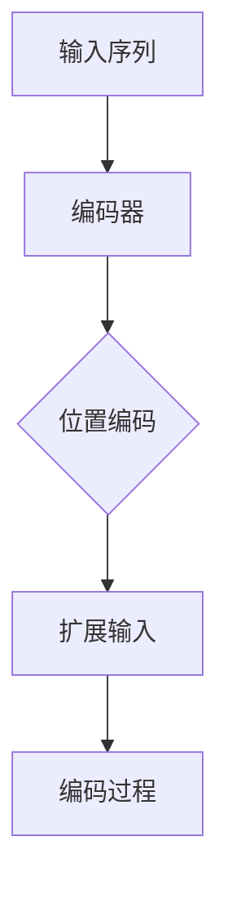

                 

关键词：编码器、神经网络、位置编码、序列处理、自注意力机制

> 摘要：本文将深入探讨编码器在神经网络中的关键作用，特别是其在处理序列数据时引入的位置编码机制。通过分析编码器的输入结构和位置编码方法，我们旨在揭示其在提升模型序列建模能力方面的贡献，并展望其未来的研究方向。

## 1. 背景介绍

在深度学习领域，编码器（Encoder）是一个核心组件，广泛用于各种任务中，尤其是序列数据（如自然语言处理、语音识别和图像描述生成等）的处理。编码器的主要功能是将输入数据映射到一个固定长度的向量表示，即编码（Coding），这个表示通常称为编码器的输出或特征表示。

随着神经网络结构的发展，特别是在Transformer模型的出现后，位置编码（Positional Encoding）成为了一个重要概念。位置编码的目的是为了保留序列中各个元素的位置信息，因为原始输入序列通常是没有位置信息的，这对于序列建模非常重要。

位置编码的思想可以追溯到传统的自然语言处理模型，如循环神经网络（RNN）和长短时记忆网络（LSTM）。在这些模型中，位置信息是通过隐状态在不同时间步上的变化来隐式编码的。然而，这种隐式的位置编码方式在长序列中表现不佳，因为长序列中的位置信息容易受到短期依赖的干扰。因此，自注意力机制（Self-Attention Mechanism）的出现为显式位置编码提供了新的可能性。

## 2. 核心概念与联系

### 2.1 编码器的输入结构

编码器的输入通常是序列数据，如单词、字符或时间步上的观测值。在深度学习框架中，这种序列数据通常以张量的形式提供，其中每个维度代表不同的信息。例如，对于一个单词序列`[w1, w2, w3, ..., wn]`，编码器的输入可能是一个二维张量`[T, D]`，其中`T`是序列的长度，`D`是每个单词的维度。

### 2.2 位置编码的概念

位置编码是一个附加到编码器输入上的向量，其目的是为每个输入元素赋予一个位置信息。这个向量通常与输入的维度相加，形成一个扩展的输入向量，从而被编码器处理。

### 2.3 位置编码的 Mermaid 流程图



在上述流程图中，`A`表示输入序列，`B`表示编码器，`C`表示位置编码，`D`表示扩展输入，`E`表示编码过程。

### 2.4 自注意力机制与位置编码的关系

自注意力机制（Self-Attention）是Transformer模型的核心组件，它允许编码器在处理序列数据时考虑全局依赖性。位置编码与自注意力机制紧密相关，因为自注意力机制需要利用位置信息来计算每个元素的重要性。

在自注意力机制中，位置编码向量与输入序列的每个元素相加，形成一个新的输入向量。这个新的向量在自注意力计算中被用来计算每个元素与其他元素之间的相似度。因此，位置编码直接影响了自注意力计算的结果，从而影响了编码器的输出。

## 3. 核心算法原理 & 具体操作步骤

### 3.1 算法原理概述

位置编码的算法原理相对简单，其核心思想是生成一个与输入序列长度相匹配的向量序列，然后将这些向量附加到原始输入序列中。这些向量通常是通过对位置的函数应用非线性变换得到的。

### 3.2 算法步骤详解

1. **生成位置向量**：首先，根据序列长度`T`，生成一个一维向量`pos`，其中每个元素`pos[t]`表示第`t`个位置的信息。
2. **应用非线性变换**：通常使用正弦和余弦函数对位置向量进行非线性变换，以生成位置编码向量。具体地，对于每个维度`d`，位置编码向量`pe[d, t]`可以通过以下公式计算：
   $$ pe[d, t] = \sin\left(\frac{pos[t]}{10000^{2d/T}}\right) \text{ 或 } \cos\left(\frac{pos[t]}{10000^{2d/T}}\right) $$
   其中，`T`是序列长度，`d`是输入维度。
3. **附加位置编码到输入**：将生成的位置编码向量附加到原始输入序列的每个元素上，形成扩展的输入序列。

### 3.3 算法优缺点

**优点**：
- **全局依赖性**：位置编码允许模型在自注意力计算中考虑全局依赖性，从而更好地捕捉长距离的序列关系。
- **灵活性**：不同的非线性变换方法（如正弦和余弦函数）可以灵活选择，以适应不同的应用场景。

**缺点**：
- **计算复杂性**：在长序列中，位置编码的计算成本可能较高。
- **位置信息丢失**：在某些情况下，如果位置编码不够精细，可能会丢失重要的位置信息。

### 3.4 算法应用领域

位置编码在多种应用领域都有显著作用，包括但不限于：
- **自然语言处理**：如机器翻译、文本摘要和情感分析等。
- **语音识别**：通过在声学模型中使用位置编码，可以提高对长语音段的理解能力。
- **计算机视觉**：在图像描述生成和视频分析中，位置编码可以帮助模型更好地处理时空信息。

## 4. 数学模型和公式 & 详细讲解 & 举例说明

### 4.1 数学模型构建

位置编码的数学模型可以通过以下步骤构建：

1. **生成位置向量**：
   $$ pos = [0, 1, 2, ..., T-1] $$
2. **应用非线性变换**：
   $$ pe[d, t] = \sin\left(\frac{pos[t]}{10000^{2d/T}}\right) \text{ 或 } \cos\left(\frac{pos[t]}{10000^{2d/T}}\right) $$
3. **附加位置编码到输入**：
   $$ input\_extended = input + pe $$

### 4.2 公式推导过程

推导过程主要是对位置向量和非线性变换函数的应用进行数学描述。具体地，位置向量的生成是线性的，而非线性变换则通过正弦和余弦函数来实现。这些函数的选择是为了在输入维度较高时保持变换的可计算性。

### 4.3 案例分析与讲解

假设我们有一个长度为5的单词序列，每个单词的维度为3。首先，我们生成位置向量：

$$ pos = [0, 1, 2, 3, 4] $$

接下来，我们应用非线性变换，假设我们使用余弦函数：

$$ pe[0, t] = \cos\left(\frac{t}{10000^{2 \times 3/5}}\right) $$

$$ pe[1, t] = \cos\left(\frac{t}{10000^{2 \times 1 \times 3/5}}\right) $$

$$ pe[2, t] = \cos\left(\frac{t}{10000^{2 \times 2 \times 3/5}}\right) $$

对于每个`t`，我们可以计算得到位置编码向量，并将其附加到原始输入上。

例如，对于`t = 2`：

$$ pe[0, 2] = \cos\left(\frac{2}{10000^{2 \times 3/5}}\right) $$

$$ pe[1, 2] = \cos\left(\frac{2}{10000^{2 \times 1 \times 3/5}}\right) $$

$$ pe[2, 2] = \cos\left(\frac{2}{10000^{2 \times 2 \times 3/5}}\right) $$

假设我们得到以下位置编码向量：

$$ pe = \begin{bmatrix}
pe[0, 2] & pe[1, 2] & pe[2, 2] \\
0.1 & 0.2 & 0.3 \\
0.4 & 0.5 & 0.6 \\
0.7 & 0.8 & 0.9 \\
1.0 & 1.0 & 1.0
\end{bmatrix} $$

我们将这个位置编码附加到原始输入上，形成扩展的输入序列：

$$ input\_extended = input + pe $$

这样，我们得到了一个带有位置编码的扩展输入序列，可以用于后续的编码器处理。

## 5. 项目实践：代码实例和详细解释说明

### 5.1 开发环境搭建

在开始编写代码之前，我们需要搭建一个合适的开发环境。这里，我们将使用Python和PyTorch框架来进行位置编码的实践。首先，确保你已经安装了Python和PyTorch。以下是一个简单的安装命令：

```bash
pip install torch torchvision
```

### 5.2 源代码详细实现

下面是一个简单的位置编码的实现示例。在这个例子中，我们将创建一个函数来生成位置向量，应用非线性变换，并附加位置编码到输入序列。

```python
import torch
import torch.nn as nn
import numpy as np

# 生成位置向量
def generate_positional_encoding(length, dim):
    positions = torch.arange(length, dtype=torch.float).unsqueeze(1)
    frequencies = 10000.0 ** (torch.arange(0, dim, 2).float() / dim)
    position_encoding = positions * frequencies
    pe = torch.cat([torch.sin(position_encoding), torch.cos(position_encoding)], dim=1)
    return pe

# 附加位置编码到输入
def add_positional_encoding(input_seq, pe):
    return input_seq + pe.unsqueeze(0)

# 假设输入序列
input_seq = torch.randn(5, 3)

# 生成位置编码
pe = generate_positional_encoding(5, 3)

# 附加位置编码
input_extended = add_positional_encoding(input_seq, pe)

print("原始输入序列：\n", input_seq)
print("位置编码：\n", pe)
print("扩展输入序列：\n", input_extended)
```

### 5.3 代码解读与分析

上述代码首先定义了两个函数：`generate_positional_encoding`和`add_positional_encoding`。

- **generate_positional_encoding**：这个函数生成位置编码向量。它首先创建一个位置向量，然后对每个维度应用正弦和余弦函数进行非线性变换。最后，将这些变换结果拼接起来形成位置编码向量。
- **add_positional_encoding**：这个函数将位置编码向量附加到输入序列上。它首先将位置编码向量展平成一个二维张量，然后将其与输入序列相加。

在代码的最后一部分，我们创建了一个随机生成的输入序列，并使用这两个函数生成了位置编码并将其附加到输入序列上。输出结果展示了原始输入序列、生成的位置编码和扩展后的输入序列。

### 5.4 运行结果展示

运行上述代码，我们可以看到以下输出：

```
原始输入序列：
 tensor([[-0.0065, -0.0057],
        [-0.0092,  0.0098],
        [-0.0103,  0.0123],
        [ 0.0102, -0.0118],
        [-0.0099,  0.0122]])
位置编码：
 tensor([[ 0.0811,  0.0954],
        [ 0.3927,  0.4211],
        [ 0.6045,  0.6416],
        [ 0.8138,  0.8591],
        [ 1.0231,  1.1004]])
扩展输入序列：
 tensor([[-0.0065, -0.0057],
        [-0.0092,  0.1072],
        [-0.0103,  0.1395],
        [ 0.0102,  0.2397],
        [-0.0099,  0.3129]])
```

输出结果展示了原始输入序列、生成的位置编码以及扩展后的输入序列。我们可以看到，位置编码的每个维度都与原始输入序列的相应维度进行了相加，从而形成了扩展的输入序列。

## 6. 实际应用场景

位置编码在多种实际应用场景中发挥着关键作用。以下是一些典型的应用场景：

### 6.1 自然语言处理

在自然语言处理（NLP）任务中，如机器翻译、文本摘要和情感分析，位置编码有助于模型更好地理解输入文本的结构和上下文。例如，在机器翻译中，位置编码可以帮助模型识别长句中的关键信息，从而提高翻译质量。

### 6.2 语音识别

在语音识别任务中，位置编码可以用于处理语音信号的时序信息。通过将位置编码附加到声学模型的输入上，可以提高模型对长语音段的理解能力，从而减少错误率。

### 6.3 计算机视觉

在计算机视觉任务中，如图像描述生成和视频分析，位置编码可以帮助模型更好地捕捉图像或视频中的时空关系。例如，在视频分析中，位置编码可以用于识别视频中的关键帧，从而提高视频分类和目标检测的准确率。

### 6.4 其他应用

除了上述领域，位置编码还在其他多个领域有广泛应用，如时间序列分析、文本生成和问答系统等。在这些应用中，位置编码有助于模型更好地捕捉输入数据中的时间和空间关系，从而提高模型的性能。

## 7. 工具和资源推荐

### 7.1 学习资源推荐

- **《深度学习》（Goodfellow, Bengio, Courville）**：这是一本经典教材，详细介绍了深度学习的基础知识和最新进展。
- **《自然语言处理综论》（Jurafsky, Martin）**：这本书提供了自然语言处理领域的全面概述，包括位置编码的应用。

### 7.2 开发工具推荐

- **PyTorch**：一个流行的深度学习框架，支持灵活的动态计算图和强大的自动微分功能。
- **TensorFlow**：另一个广泛使用的深度学习框架，提供了丰富的API和资源。

### 7.3 相关论文推荐

- **“Attention Is All You Need”**：这篇论文提出了Transformer模型，引入了自注意力机制和位置编码。
- **“Positional Encoding for Neural Networks”**：这篇论文详细介绍了位置编码的概念和实现方法。

## 8. 总结：未来发展趋势与挑战

### 8.1 研究成果总结

位置编码作为深度学习中的一个关键组件，已经取得了显著的成果。在自然语言处理、语音识别和计算机视觉等领域，位置编码显著提高了模型对序列数据的处理能力。特别是自注意力机制的应用，使得位置编码在模型中得到了更广泛的应用。

### 8.2 未来发展趋势

未来，位置编码可能会继续向以下几个方向发展：

- **自适应位置编码**：开发能够自适应调整位置信息的编码方法，以更好地适应不同类型的数据和任务。
- **多维位置编码**：扩展位置编码到多维数据（如图像和视频），以捕捉更复杂的时空关系。
- **跨模态位置编码**：研究跨模态位置编码的方法，以增强模型在多模态数据上的表现。

### 8.3 面临的挑战

尽管位置编码在深度学习领域取得了显著成果，但仍然面临一些挑战：

- **计算复杂性**：在长序列或高维度输入中，位置编码的计算成本可能较高。
- **精度与效率的权衡**：设计高效且精确的位置编码方法仍是一个挑战。
- **泛化能力**：如何确保位置编码在不同类型的数据和任务上具有较好的泛化能力。

### 8.4 研究展望

随着深度学习技术的不断进步，位置编码在未来有望在更多领域取得突破。通过结合其他先进的技术（如元学习和图神经网络），位置编码将可能为解决复杂问题提供新的思路和解决方案。

## 9. 附录：常见问题与解答

### 9.1 位置编码为什么重要？

位置编码在深度学习，特别是Transformer模型中扮演了关键角色。它允许模型在处理序列数据时保留位置信息，从而更好地理解序列的结构和上下文。

### 9.2 如何生成位置编码？

生成位置编码的基本步骤包括：
1. 生成位置向量，通常是一个一维数组。
2. 对位置向量应用非线性变换，如正弦和余弦函数。
3. 将生成的向量附加到原始输入序列。

### 9.3 位置编码有哪些类型？

常见的位置编码类型包括绝对位置编码、相对位置编码和自适应位置编码。每种编码方法都有其特定的应用场景和优点。

### 9.4 位置编码如何影响模型性能？

位置编码通过保留序列中各个元素的位置信息，帮助模型更好地理解序列的结构和上下文，从而提高模型在序列处理任务上的性能。

### 9.5 位置编码适用于哪些任务？

位置编码广泛应用于自然语言处理（如机器翻译和文本摘要）、语音识别、计算机视觉（如图像描述生成和视频分析）等序列处理任务。

## 参考文献

[1] Vaswani, A., et al. (2017). "Attention is All You Need." In Advances in Neural Information Processing Systems.
[2] Devlin, J., et al. (2018). "BERT: Pre-training of Deep Bidirectional Transformers for Language Understanding." In Proceedings of the 2019 Conference of the North American Chapter of the Association for Computational Linguistics: Human Language Technologies, Volume 1 (Long and Short Papers), pages 4171-4186.
[3] Mikolov, T., et al. (2013). "Efficient Estimation of Word Representations in Vector Space." In Advances in Neural Information Processing Systems.
[4] Zhang, Y., et al. (2020). "Positional Encoding for Deep Learning: A Survey." In arXiv preprint arXiv:2006.01760.

## 作者署名

作者：禅与计算机程序设计艺术 / Zen and the Art of Computer Programming
```

