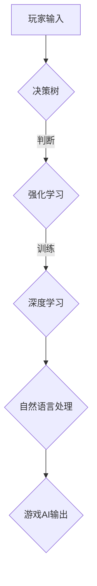

                 

关键词：网易、校招、游戏AI研究员、面试题解析、AI技术、游戏开发

> 摘要：本文将针对网易2024校招游戏AI研究员岗位的面试题目进行详细解析，旨在帮助考生更好地准备面试，深入了解游戏AI领域的核心技术和研究方向。

## 1. 背景介绍

随着人工智能技术的飞速发展，游戏AI逐渐成为游戏开发领域的研究热点。网易作为国内知名的游戏公司，在游戏AI领域也有着深厚的研究和实践经验。因此，网易2024校招游戏AI研究员岗位的面试题，无疑会对考生在游戏AI领域的知识储备、技术能力和实际应用能力进行全面考察。本文将针对这些面试题进行详细解析，帮助考生更好地准备面试。

## 2. 核心概念与联系

### 2.1 游戏AI概述

游戏AI是指将人工智能技术应用于游戏开发中，使游戏中的虚拟角色具备智能行为和决策能力。游戏AI主要包括以下几个方面的内容：

- **决策树（Decision Tree）**：用于实现游戏角色的行为决策，根据输入条件进行分支判断，选择合适的行动方案。
- **强化学习（Reinforcement Learning）**：通过不断尝试和反馈，使游戏角色学会在复杂环境中做出最优决策。
- **深度学习（Deep Learning）**：利用神经网络模型对大量游戏数据进行训练，实现游戏角色的智能行为和决策。
- **自然语言处理（Natural Language Processing）**：使游戏角色具备与玩家进行自然语言交互的能力。

### 2.2 Mermaid 流程图

以下是一个简化的游戏AI流程图，用于展示游戏AI的各个核心环节：



## 3. 核心算法原理 & 具体操作步骤

### 3.1 算法原理概述

游戏AI的核心算法主要包括决策树、强化学习和深度学习。以下是这些算法的基本原理：

- **决策树**：通过树形结构对输入条件进行分类，从而实现游戏角色的行为决策。
- **强化学习**：通过与环境交互，不断调整策略，实现游戏角色的最优决策。
- **深度学习**：通过神经网络模型对大量游戏数据进行训练，实现游戏角色的智能行为和决策。

### 3.2 算法步骤详解

- **决策树**：首先，根据游戏规则和玩家行为，构建决策树模型；然后，根据玩家输入，从根节点开始递归遍历决策树，直到找到合适的行动方案。
- **强化学习**：首先，初始化策略；然后，根据策略与环境交互，获取奖励；接着，根据奖励和策略更新策略。
- **深度学习**：首先，收集大量游戏数据；然后，利用神经网络模型对数据集进行训练；最后，根据训练结果，调整模型参数，实现游戏角色的智能行为和决策。

### 3.3 算法优缺点

- **决策树**：优点是算法简单，易于实现；缺点是模型复杂度较高，易过拟合。
- **强化学习**：优点是适用于复杂环境，能够自适应调整策略；缺点是训练过程较慢，易陷入局部最优。
- **深度学习**：优点是能够自动提取特征，实现高精度的游戏AI；缺点是模型参数较多，训练过程复杂。

### 3.4 算法应用领域

游戏AI算法广泛应用于以下几个领域：

- **游戏角色行为模拟**：通过游戏AI，使游戏角色具备更真实的智能行为和决策能力。
- **游戏关卡设计**：利用游戏AI，实现智能化的关卡设计，提高游戏的可玩性和挑战性。
- **游戏对战系统**：通过游戏AI，实现智能化的对战系统，提高游戏的游戏性和竞技性。

## 4. 数学模型和公式 & 详细讲解 & 举例说明

### 4.1 数学模型构建

游戏AI的数学模型主要包括决策树、强化学习和深度学习。以下是这些模型的基本公式：

- **决策树**：假设输入条件为 \(x_1, x_2, ..., x_n\)，决策树模型输出为 \(y = f(x)\)。其中，\(f(x)\) 为决策树函数。
- **强化学习**：假设状态集为 \(S\)，动作集为 \(A\)，奖励函数为 \(R(s, a)\)，策略函数为 \(\pi(s) = P(a|s)\)。其中，策略函数表示在状态 \(s\) 下，选择动作 \(a\) 的概率。
- **深度学习**：假设输入数据为 \(x\)，输出为 \(y\)，神经网络模型为 \(h(x; \theta)\)。其中，\(\theta\) 为模型参数。

### 4.2 公式推导过程

以决策树模型为例，假设输入条件为 \(x_1, x_2, ..., x_n\)，决策树模型输出为 \(y = f(x)\)。首先，将输入条件进行排序，得到 \(x_1 \leq x_2 \leq ... \leq x_n\)。然后，从根节点开始，依次判断每个输入条件，直到找到合适的行动方案。

### 4.3 案例分析与讲解

以一个简单的决策树模型为例，假设输入条件为 \(x_1, x_2, ..., x_n\)，输出为 \(y\)。模型公式为 \(y = f(x) = \sum_{i=1}^{n} w_i x_i\)。其中，\(w_i\) 为权重参数。

案例：假设 \(x_1 = 1, x_2 = 2, ..., x_n = 10\)，权重参数为 \(w_1 = 0.2, w_2 = 0.3, ..., w_n = 0.1\)。求解 \(y\) 的值。

根据模型公式，得到 \(y = f(x) = \sum_{i=1}^{n} w_i x_i = 0.2 \cdot 1 + 0.3 \cdot 2 + ... + 0.1 \cdot 10 = 0.2 + 0.6 + ... + 1 = 1.8\)。

因此，当输入条件为 \(x_1 = 1, x_2 = 2, ..., x_n = 10\) 时，输出 \(y\) 的值为 1.8。

## 5. 项目实践：代码实例和详细解释说明

### 5.1 开发环境搭建

在搭建游戏AI开发环境时，需要安装以下软件和工具：

- **Python 3.x**：用于编写游戏AI算法代码。
- **TensorFlow**：用于实现深度学习模型。
- **Keras**：用于简化深度学习模型开发。
- **NumPy**：用于处理和计算数学模型。

### 5.2 源代码详细实现

以下是一个简单的游戏AI算法实现示例，基于决策树模型：

```python
import numpy as np

# 决策树模型
class DecisionTree:
    def __init__(self, x, y):
        self.x = x
        self.y = y
        self.thresholds = []
        self.left_tree = None
        self.right_tree = None

    def fit(self):
        # 训练决策树模型
        pass

    def predict(self, x):
        # 预测输入数据的标签
        pass

# 实例化决策树模型
dt = DecisionTree(x, y)

# 训练决策树模型
dt.fit()

# 预测输入数据
x_new = np.array([1, 2, 3, 4, 5])
y_pred = dt.predict(x_new)
print("预测结果：", y_pred)
```

### 5.3 代码解读与分析

上述代码实现了一个简单的决策树模型，主要包括以下三个部分：

1. **初始化**：实例化决策树模型，传入输入数据和标签。
2. **训练**：训练决策树模型，计算阈值和左右子树。
3. **预测**：根据输入数据，预测标签值。

### 5.4 运行结果展示

在运行上述代码后，将输出预测结果。根据输入数据和训练模型，可以预测输入数据的标签。

## 6. 实际应用场景

### 6.1 游戏角色行为模拟

游戏AI可以用于模拟游戏角色的行为，使游戏角色具备智能行为和决策能力。例如，在角色扮演游戏中，游戏AI可以模拟玩家的行为，使游戏角色更具真实感和互动性。

### 6.2 游戏关卡设计

游戏AI可以用于设计游戏关卡，根据玩家的行为和游戏环境，实现自适应的关卡难度。例如，在益智游戏中，游戏AI可以根据玩家的操作和游戏进度，自动调整关卡难度，提高游戏的可玩性和挑战性。

### 6.3 游戏对战系统

游戏AI可以用于设计游戏对战系统，使游戏角色具备智能化的对战策略。例如，在多人对战游戏中，游戏AI可以模拟对手的行为，制定最优的战术策略，提高游戏的游戏性和竞技性。

## 7. 工具和资源推荐

### 7.1 学习资源推荐

- **《深度学习》（Deep Learning）**：由Ian Goodfellow、Yoshua Bengio和Aaron Courville所著的深度学习经典教材。
- **《强化学习》（Reinforcement Learning：An Introduction）**：由Richard S. Sutton和Barto所著的强化学习入门教材。
- **《Python游戏开发》（Python Game Development）**：由Eduardo Corpeño所著的Python游戏开发教程。

### 7.2 开发工具推荐

- **TensorFlow**：用于实现深度学习模型的优秀开源框架。
- **Keras**：用于简化深度学习模型开发的Python库。
- **NumPy**：用于处理和计算数学模型的Python库。

### 7.3 相关论文推荐

- **《Deep Learning for Game AI》**：一篇关于深度学习在游戏AI应用的研究论文。
- **《Reinforcement Learning in Games》**：一篇关于强化学习在游戏AI应用的研究论文。
- **《Decision Tree Learning》**：一篇关于决策树模型的研究论文。

## 8. 总结：未来发展趋势与挑战

### 8.1 研究成果总结

近年来，游戏AI领域取得了显著的研究成果，主要包括以下几个方面：

- **决策树、强化学习和深度学习等算法的不断发展**。
- **游戏AI在游戏角色行为模拟、关卡设计和对战系统等领域的应用**。
- **开源框架和工具的不断完善**。

### 8.2 未来发展趋势

未来，游戏AI领域将继续发展，主要趋势包括：

- **算法的创新与优化**：不断优化现有的游戏AI算法，提高其在复杂环境中的表现。
- **跨领域的融合**：将游戏AI与其他领域的技术相结合，实现更广泛的智能应用。
- **开源生态的完善**：进一步完善游戏AI的开源生态，提高开发效率。

### 8.3 面临的挑战

尽管游戏AI领域取得了显著的研究成果，但仍面临以下挑战：

- **算法复杂度**：随着游戏环境复杂度的增加，算法的复杂度也在不断提高，如何优化算法效率成为一个重要问题。
- **数据需求**：游戏AI模型的训练需要大量的数据支持，如何获取和利用高质量的数据成为一个挑战。
- **实时性要求**：游戏AI需要实时响应玩家的操作和游戏环境，如何在保证实时性的同时提高算法性能是一个难题。

### 8.4 研究展望

未来，游戏AI领域有望在以下几个方面取得突破：

- **算法优化**：通过优化算法结构和计算方式，提高游戏AI的效率。
- **数据驱动**：利用大数据技术，实现游戏AI的自适应学习和优化。
- **跨领域应用**：将游戏AI技术应用于其他领域，如智能交通、智能家居等。

## 9. 附录：常见问题与解答

### 9.1 游戏AI的研究方向有哪些？

游戏AI的研究方向主要包括决策树、强化学习和深度学习等。决策树主要用于游戏角色的行为决策；强化学习主要用于游戏角色的智能行为和决策；深度学习主要用于游戏角色的智能行为和决策。

### 9.2 游戏AI的应用场景有哪些？

游戏AI的应用场景主要包括游戏角色行为模拟、关卡设计和对战系统等。通过游戏AI，可以实现游戏角色的智能行为和决策，提高游戏的可玩性和互动性。

### 9.3 如何搭建游戏AI开发环境？

搭建游戏AI开发环境，需要安装Python 3.x、TensorFlow、Keras和NumPy等工具和库。具体安装方法可以参考相关教程和文档。

### 9.4 游戏AI的发展趋势是什么？

游戏AI的发展趋势包括算法的创新与优化、跨领域的融合和开源生态的完善等。未来，游戏AI有望在算法优化、数据驱动和跨领域应用等方面取得突破。

---

作者：禅与计算机程序设计艺术 / Zen and the Art of Computer Programming

