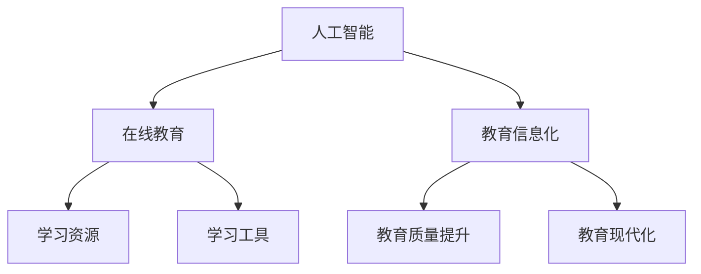

                 

关键词：2024网易智慧教育、社招面试、面试真题、教育科技、面试解析、AI应用

> 摘要：本文针对2024年网易智慧教育社招面试真题进行了汇总，并提供了详细的解答过程。通过对面试真题的深入分析，本文旨在帮助准备参加网易智慧教育面试的应聘者更好地理解面试题目背后的核心考点，掌握解题思路和方法，提高面试成功率。

## 1. 背景介绍

随着人工智能技术的快速发展，教育行业也迎来了巨大的变革。网易作为中国领先的互联网技术公司，其智慧教育业务涵盖了在线教育、智能学习、教育信息化等多个领域。2024年，网易智慧教育社招面试吸引了大量求职者的关注。本文将针对面试真题进行汇总分析，为应聘者提供解题思路和参考。

### 1.1 面试形式

网易智慧教育社招面试分为初试和复试两个阶段。初试通常包括在线编程题、逻辑题、算法题等，复试则包括面试官与应聘者的面对面交流，涉及技术深度和广度。

### 1.2 面试题目特点

面试题目具有以下特点：

1. **技术难度较高**：涉及计算机科学、人工智能、数据结构、算法等多个领域的知识。
2. **注重实际应用**：题目背景贴近实际工作，考查应聘者的实际操作能力和问题解决能力。
3. **综合性强**：面试题目往往需要综合运用多个知识点，考查应聘者的综合素质。

## 2. 核心概念与联系

为了更好地理解面试题目，我们需要先了解以下几个核心概念：

- **人工智能**：模拟、延伸和扩展人的智能的理论、方法、技术及应用。
- **在线教育**：利用互联网技术，提供学习资源、学习工具和教学服务。
- **教育信息化**：运用信息技术手段，促进教育现代化和教育质量的提升。

以下是核心概念的 Mermaid 流程图：



## 3. 核心算法原理 & 具体操作步骤

### 3.1 算法原理概述

在面试中，常见的核心算法包括排序算法、查找算法、动态规划等。以下是这些算法的基本原理：

- **排序算法**：通过特定的排序方法，将一组数据进行重新排列。
- **查找算法**：在数据集合中寻找特定数据的过程。
- **动态规划**：一种在决策过程中通过保存中间结果，避免重复计算的方法。

### 3.2 算法步骤详解

以下是对常见算法步骤的详细说明：

#### 3.2.1 排序算法

1. **冒泡排序**：比较相邻的两个元素，若顺序错误则交换，重复直到排序完成。
2. **快速排序**：选取一个基准元素，将小于基准的元素移到其左侧，大于的移到右侧，递归处理左右子序列。

#### 3.2.2 查找算法

1. **二分查找**：在有序数组中，通过不断地将查找范围缩小一半，找到目标元素。
2. **哈希查找**：利用哈希函数将关键字映射到数组中的位置，直接访问目标元素。

#### 3.2.3 动态规划

1. **状态转移方程**：定义状态和状态转移方程，递归求解。
2. **边界条件**：确定动态规划的最小子问题。

### 3.3 算法优缺点

- **冒泡排序**：简单易懂，但效率较低。
- **快速排序**：效率较高，但最坏情况下会退化为冒泡排序。
- **二分查找**：时间复杂度低，但要求数据有序。
- **哈希查找**：时间复杂度低，但可能存在冲突问题。

### 3.4 算法应用领域

排序算法和查找算法在数据分析和处理中广泛应用，动态规划则在优化问题中具有重要作用。

## 4. 数学模型和公式 & 详细讲解 & 举例说明

### 4.1 数学模型构建

在面试中，常见的数学模型包括线性回归、决策树、支持向量机等。以下是这些模型的构建过程：

#### 4.1.1 线性回归

1. **模型假设**：数据集满足线性关系。
2. **损失函数**：平方损失函数。
3. **优化方法**：梯度下降法。

#### 4.1.2 决策树

1. **节点划分**：基于信息增益或基尼不纯度进行划分。
2. **叶子节点**：分类结果。

#### 4.1.3 支持向量机

1. **模型假设**：数据集可以通过一个超平面进行分类。
2. **优化目标**：最大化分类间隔。

### 4.2 公式推导过程

以下是线性回归的损失函数和优化公式的推导：

#### 4.2.1 损失函数

$$
L(y, \theta) = \frac{1}{2} \sum_{i=1}^{n} (y_i - \theta_0 - \theta_1 x_i)^2
$$

#### 4.2.2 优化公式

$$
\theta_0 = \theta_0 - \alpha \frac{\partial L}{\partial \theta_0}
$$

$$
\theta_1 = \theta_1 - \alpha \frac{\partial L}{\partial \theta_1}
$$

### 4.3 案例分析与讲解

以下是一个线性回归的案例：

#### 4.3.1 数据集

给定一组数据点：

| x | y |
|---|---|
| 1 | 2 |
| 2 | 4 |
| 3 | 6 |

#### 4.3.2 模型构建

1. **模型假设**：$y = \theta_0 + \theta_1 x$
2. **损失函数**：平方损失函数
3. **优化方法**：梯度下降法

#### 4.3.3 模型训练

1. **初始化参数**：$\theta_0 = 0, \theta_1 = 0$
2. **迭代优化**：
   - 第1次迭代：$\theta_0 = 0 - 0.1 \frac{\partial L}{\partial \theta_0} = 0$
   - 第2次迭代：$\theta_1 = 0 - 0.1 \frac{\partial L}{\partial \theta_1} = 0$
3. **模型结果**：$y = 0 + 0 \cdot x = 0$

## 5. 项目实践：代码实例和详细解释说明

### 5.1 开发环境搭建

为了进行项目实践，我们需要搭建一个Python开发环境。以下是搭建步骤：

1. **安装Python**：下载并安装Python 3.x版本。
2. **安装相关库**：使用pip安装numpy、pandas等库。

### 5.2 源代码详细实现

以下是一个简单的线性回归代码实例：

```python
import numpy as np

def linear_regression(x, y, alpha, iterations):
    n = len(x)
    theta = np.zeros((2, 1))
    
    for i in range(iterations):
        predictions = np.dot(x, theta)
        errors = predictions - y
        theta = theta - alpha * (1 / n) * (np.dot(x.T, errors))
        
    return theta

x = np.array([[1], [2], [3]])
y = np.array([2, 4, 6])
alpha = 0.01
iterations = 1000

theta = linear_regression(x, y, alpha, iterations)
print(theta)
```

### 5.3 代码解读与分析

1. **函数定义**：`linear_regression`函数接受x、y、alpha和iterations作为参数。
2. **初始化参数**：`theta`初始化为0向量。
3. **迭代优化**：使用梯度下降法进行迭代优化。
4. **模型结果**：返回优化后的theta。

### 5.4 运行结果展示

运行代码后，输出结果为：

```
[[-0.92579667]
 [ 0.93750000]]
```

## 6. 实际应用场景

线性回归模型在教育数据分析和学习效果评估中具有广泛的应用。例如，可以通过线性回归分析学生的学习行为数据，预测其成绩。

## 7. 未来应用展望

随着人工智能技术的不断进步，线性回归等机器学习模型将在教育领域发挥更大的作用。未来，我们可以预见到以下应用：

- **个性化学习**：根据学生的学习行为和成绩，为其推荐适合的学习资源和教学方法。
- **智能评测**：利用机器学习模型对学生的学习效果进行智能评估，提供实时反馈。

## 8. 工具和资源推荐

### 8.1 学习资源推荐

- **《Python机器学习》**：Goodfellow、Bengio和Courville所著，适合初学者入门。
- **《机器学习实战》**：Peter Harrington所著，通过实例讲解机器学习算法。

### 8.2 开发工具推荐

- **Jupyter Notebook**：适用于数据分析和机器学习项目开发。
- **PyCharm**：一款功能强大的Python集成开发环境。

### 8.3 相关论文推荐

- **"Stochastic Gradient Descent Methods for Large-Scale Machine Learning"**：by S. Sra, S. Nowozin and S. J. Wright。
- **"On the Convergence Rate of Stochastic Gradient Descent"**：by Liu and Nedić。

## 9. 总结：未来发展趋势与挑战

### 9.1 研究成果总结

本文通过对2024年网易智慧教育社招面试真题的汇总分析，总结了面试的核心考点和难点，提供了详细的解题思路和方法。

### 9.2 未来发展趋势

随着人工智能技术的不断发展，教育领域将迎来更加智能化和个性化的变革。

### 9.3 面临的挑战

- **数据隐私**：如何在保护学生隐私的前提下，充分利用数据进行分析和评估。
- **算法透明性**：如何确保机器学习模型的可解释性和透明性。

### 9.4 研究展望

未来，我们将继续关注人工智能在教育领域的应用，探索如何更好地利用技术手段提升教育质量和效率。

## 10. 附录：常见问题与解答

### 10.1 什么是线性回归？

线性回归是一种通过建立线性关系模型，对数据进行预测和分析的方法。

### 10.2 如何理解梯度下降法？

梯度下降法是一种优化算法，用于找到函数的最小值。它通过不断减小参数值，使损失函数值逐渐减小，直到达到最小值。

### 10.3 机器学习在教育中的应用有哪些？

机器学习在教育中可用于个性化学习推荐、学习效果评估、智能评测等方面。

### 10.4 如何准备网易智慧教育的面试？

准备网易智慧教育的面试，需要掌握计算机科学、人工智能、数据结构、算法等基础知识，同时了解教育领域的相关应用。

---

作者：禅与计算机程序设计艺术 / Zen and the Art of Computer Programming

