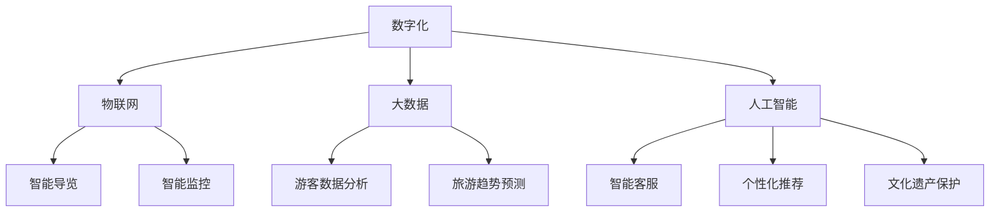

                 

## 1. 背景介绍

近年来，随着信息技术的发展和人们对旅游需求的增加，智慧文旅（Smart Cultural and Tourism）的概念逐渐兴起。智慧文旅利用物联网、大数据、人工智能等技术，通过数字化手段提升文旅行业的运营效率、游客体验以及文化遗产的保护和传承。2024年网易智慧文旅校招面试真题汇总及其解答，旨在为参加面试的同学们提供有力的复习资料，帮助他们更好地理解和应对面试中的问题。

智慧文旅不仅仅是传统文旅的升级，更是文旅行业转型升级的重要方向。在这一背景下，网易作为中国领先的互联网科技公司，在智慧文旅领域积极探索和实践。网易通过整合自身优势，将人工智能、大数据等技术应用于文旅行业，致力于打造一个全新的文旅生态系统。

### 关键概念

- **智慧文旅**：利用现代信息技术提升文旅行业运营效率和游客体验。
- **人工智能**：模拟、延伸和扩展人的智能，通过算法和模型实现自动化决策和智能服务。
- **大数据**：通过数据采集、存储、分析和处理，获取有价值的信息和洞察。
- **数字化**：将传统的业务流程和数据转化为数字化的形式，实现更高效的管理和服务。

### 目标与意义

本文旨在通过汇总2024年网易智慧文旅校招面试真题，并给出详细的解答，帮助考生：

- **深入理解智慧文旅的核心概念和技术**。
- **掌握面试中的常见问题和应对策略**。
- **提升面试表现，增加录取机会**。

通过对这些面试题目的分析和解答，读者可以更好地了解智慧文旅行业的发展趋势和关键技术，为未来的职业发展做好准备。

## 2. 核心概念与联系

### 智慧文旅的核心概念

智慧文旅的核心在于将传统文旅与信息技术相结合，实现智能化、数字化、网络化的运营和服务。以下是智慧文旅中几个核心概念及其相互联系：

#### 数字化

数字化是智慧文旅的基础，它包括将传统文化和旅游资源进行数字化处理，例如通过数字化扫描、拍摄和存储文化遗产，使其在网络上得以展示和传播。

#### 物联网

物联网（IoT）技术通过传感器和设备连接，实现文旅场景的智能化监控和管理。例如，智能导览设备、智能停车系统、智能监控系统等，都能够提高游客的体验和运营效率。

#### 大数据

大数据技术在智慧文旅中发挥着重要作用，通过收集和分析游客数据，可以更好地了解游客需求，优化旅游产品和服务。同时，大数据分析还能帮助预测旅游趋势，为决策提供依据。

#### 人工智能

人工智能技术在智慧文旅中的应用非常广泛，从智能客服、智能导览到个性化推荐系统，都能够提升游客的体验。人工智能还可以用于文化遗产的保护和修复，通过图像识别、深度学习等技术，实现文化遗产的数字化保护和传承。

### Mermaid 流程图

以下是智慧文旅核心概念和技术的Mermaid流程图，展示了它们之间的相互关系：



通过这张流程图，我们可以清晰地看到数字化是智慧文旅的基础，物联网、大数据和人工智能则在智慧文旅中发挥着关键作用，相互交织，共同推动智慧文旅的发展。

## 3. 核心算法原理 & 具体操作步骤

### 3.1 算法原理概述

在智慧文旅中，核心算法的应用至关重要，尤其是在数据分析和智能推荐领域。以下介绍几种常用的算法原理及其在智慧文旅中的应用。

#### 3.1.1 数据挖掘算法

数据挖掘算法是大数据分析的核心，用于从大量数据中提取有价值的信息和模式。常见的数据挖掘算法包括分类算法、聚类算法、关联规则算法等。

- **分类算法**：通过已知的特征数据对未知数据进行分类，如决策树、随机森林等。
- **聚类算法**：将相似的数据点归为一类，如K-means、层次聚类等。
- **关联规则算法**：发现数据之间的关联关系，如Apriori算法、FP-growth算法等。

#### 3.1.2 推荐算法

推荐算法在智慧文旅中用于个性化推荐，根据用户的历史行为和偏好，预测用户可能感兴趣的内容。常见推荐算法包括基于内容的推荐、协同过滤推荐等。

- **基于内容的推荐**：根据用户过去喜欢的内容推荐相似的内容。
- **协同过滤推荐**：根据用户和物品之间的相似度推荐用户可能喜欢的物品。

### 3.2 算法步骤详解

#### 3.2.1 数据挖掘算法步骤

1. **数据预处理**：包括数据清洗、数据转换和数据归一化，确保数据质量。
2. **特征选择**：根据业务需求选择关键特征，进行特征提取和特征选择。
3. **模型选择**：根据问题类型和数据特性选择合适的模型，如决策树、随机森林等。
4. **模型训练**：使用训练数据对模型进行训练，调整模型参数。
5. **模型评估**：使用测试数据对模型进行评估，确定模型性能。
6. **模型应用**：将模型应用于实际数据，提取有价值的信息和模式。

#### 3.2.2 推荐算法步骤

1. **用户历史行为分析**：收集用户的历史行为数据，如浏览记录、购买记录等。
2. **物品特征提取**：对物品进行特征提取，如标签、评分、评论等。
3. **计算用户和物品的相似度**：使用距离度量或相似度计算方法，如余弦相似度、皮尔逊相关系数等。
4. **推荐列表生成**：根据用户和物品的相似度，生成推荐列表。
5. **推荐结果优化**：对推荐结果进行优化，如根据用户反馈调整推荐策略。

### 3.3 算法优缺点

#### 3.3.1 数据挖掘算法优缺点

- **优点**：
  - 能够从大量数据中提取有价值的信息和模式。
  - 可以帮助业务决策，优化运营和服务。

- **缺点**：
  - 需要大量的数据预处理工作。
  - 模型训练和评估过程复杂，计算成本高。

#### 3.3.2 推荐算法优缺点

- **优点**：
  - 能够提供个性化的推荐服务，提高用户体验。
  - 可以帮助发现用户潜在的兴趣和需求。

- **缺点**：
  - 需要大量的历史行为数据，对数据质量和数据量有较高要求。
  - 可能会出现数据冷启动问题，即对新用户无法提供有效的推荐。

### 3.4 算法应用领域

- **智慧旅游规划**：通过数据挖掘算法分析游客行为，优化旅游路线规划和景区管理。
- **个性化推荐**：通过推荐算法为游客提供个性化的旅游建议和产品推荐。
- **文化遗产保护**：利用数据挖掘算法分析文化遗产数据，实现文化遗产的数字化保护和修复。

### 3.5 算法应用案例分析

#### 案例：个性化旅游路线规划

1. **数据来源**：收集游客的历史浏览记录、兴趣偏好和评论数据。
2. **数据处理**：对数据进行清洗、归一化和特征提取。
3. **算法应用**：使用协同过滤算法生成个性化旅游路线推荐。
4. **结果评估**：通过用户反馈评估推荐效果，持续优化推荐算法。

通过以上案例分析，我们可以看到核心算法在智慧文旅中的应用是如何实现的。这些算法不仅能够提高游客的体验，还能为文旅行业提供科学决策支持。

## 4. 数学模型和公式 & 详细讲解 & 举例说明

### 4.1 数学模型构建

在智慧文旅中，数学模型的构建是数据分析的重要环节。以下介绍几种常用的数学模型及其构建方法。

#### 4.1.1 用户行为预测模型

用户行为预测模型用于预测游客的游览行为，如游览时间、游览路线等。以下是一个简单的线性回归模型：

\[ Y = \beta_0 + \beta_1X_1 + \beta_2X_2 + ... + \beta_nX_n \]

其中，\( Y \) 表示预测的游览行为，\( X_1, X_2, ..., X_n \) 表示影响游览行为的特征变量，\( \beta_0, \beta_1, \beta_2, ..., \beta_n \) 是模型的参数。

#### 4.1.2 个性化推荐模型

个性化推荐模型用于为游客推荐他们可能感兴趣的旅游产品和服务。以下是一个基于协同过滤的推荐模型：

\[ R_{ui} = \frac{sim(u,i) \cdot \sum_j r_{uj} \cdot r_{ij}}{\sum_j r_{uj} \cdot \sum_k r_{ik}} \]

其中，\( R_{ui} \) 表示用户 \( u \) 对物品 \( i \) 的预测评分，\( sim(u,i) \) 表示用户 \( u \) 和物品 \( i \) 之间的相似度，\( r_{uj} \) 和 \( r_{ij} \) 分别表示用户 \( u \) 对物品 \( j \) 的实际评分和物品 \( i \) 对物品 \( j \) 的实际评分。

### 4.2 公式推导过程

#### 4.2.1 用户行为预测模型推导

假设我们有 \( m \) 个用户和 \( n \) 个特征变量，用户 \( u \) 对物品 \( i \) 的实际评分为 \( r_{ui} \)，则线性回归模型的公式可以表示为：

\[ r_{ui} = \beta_0 + \beta_1x_{ui1} + \beta_2x_{ui2} + ... + \beta_nx_{uini} \]

其中，\( x_{uij} \) 表示用户 \( u \) 对特征 \( j \) 的评分。

对上式两边取期望，得到：

\[ E[r_{ui}] = E[\beta_0 + \beta_1x_{ui1} + \beta_2x_{ui2} + ... + \beta_nx_{uini}] \]

由于期望的线性性质，上式可以简化为：

\[ E[r_{ui}] = \beta_0 + \beta_1E[x_{ui1}] + \beta_2E[x_{ui2}] + ... + \beta_nE[x_{uini}] \]

将期望值代入原始评分公式，得到预测评分的线性回归模型：

\[ \hat{r}_{ui} = \beta_0 + \beta_1x_{ui1} + \beta_2x_{ui2} + ... + \beta_nx_{uini} \]

#### 4.2.2 个性化推荐模型推导

假设我们有 \( m \) 个用户和 \( n \) 个物品，用户 \( u \) 和物品 \( i \) 的实际评分矩阵为 \( R \)，则协同过滤推荐模型可以表示为：

\[ r_{ui} = sim(u,i) \cdot \sum_j r_{uj} \cdot r_{ij} \]

其中，\( sim(u,i) \) 表示用户 \( u \) 和物品 \( i \) 之间的相似度，可以采用余弦相似度、皮尔逊相关系数等方法计算。

### 4.3 案例分析与讲解

#### 案例：基于协同过滤的个性化推荐系统

1. **数据来源**：收集游客的历史浏览记录和评分数据。
2. **数据处理**：对数据进行预处理，包括数据清洗、归一化和特征提取。
3. **相似度计算**：计算用户和物品之间的相似度。
4. **推荐列表生成**：根据用户和物品的相似度，生成个性化推荐列表。
5. **推荐结果优化**：通过用户反馈对推荐结果进行优化。

通过以上案例分析，我们可以看到数学模型在智慧文旅中的应用是如何实现的。这些模型不仅能够提高游客的体验，还能为文旅行业提供科学决策支持。

### 5. 项目实践：代码实例和详细解释说明

在本节中，我们将通过一个具体的智慧文旅项目实例来展示如何将上述数学模型和算法应用于实际开发中。我们选择构建一个基于协同过滤算法的个性化旅游推荐系统，该系统可以帮助游客根据他们的历史行为推荐他们可能感兴趣的旅游目的地。

#### 5.1 开发环境搭建

首先，我们需要搭建一个适合进行数据分析和推荐系统开发的环境。以下是所需的基本工具和软件：

- **Python**：用于编写算法和数据处理代码。
- **Pandas**：用于数据预处理和操作。
- **Scikit-learn**：用于协同过滤算法的实现。
- **NumPy**：用于数学计算。
- **Matplotlib**：用于数据可视化。

假设我们已经安装了上述工具，接下来我们将开始实现个性化推荐系统的代码。

#### 5.2 源代码详细实现

```python
import pandas as pd
from sklearn.metrics.pairwise import cosine_similarity
from sklearn.model_selection import train_test_split

# 5.2.1 数据预处理
def preprocess_data(data):
    # 清洗和归一化数据
    data['rating'] = data['rating'].fillna(0)
    return data

# 5.2.2 相似度计算
def compute_similarity(data, user_column, item_column):
    user_item_matrix = data.pivot(index=user_column, columns=item_column, values='rating')
    similarity_matrix = cosine_similarity(user_item_matrix)
    return similarity_matrix

# 5.2.3 推荐列表生成
def generate_recommendations(similarity_matrix, user_id, k=10):
    # 选择最相似的k个用户
    similar_users = similarity_matrix[user_id].argsort()[-k:]
    # 获取这些用户的评分
    recommendations = {}
    for i in similar_users:
        if i != user_id:
            recommendations[i] = user_item_matrix.iat[i, user_id]
    return recommendations

# 5.2.4 主函数
def main():
    # 加载数据
    data = pd.read_csv('tourism_data.csv')
    data = preprocess_data(data)
    
    # 训练测试数据划分
    train_data, test_data = train_test_split(data, test_size=0.2)
    
    # 计算相似度矩阵
    similarity_matrix = compute_similarity(train_data, 'user_id', 'destination_id')
    
    # 生成推荐列表
    user_id = 123  # 假设的用户ID
    recommendations = generate_recommendations(similarity_matrix, user_id)
    
    # 输出推荐结果
    print("Recommended destinations for user:", user_id)
    for destination_id, rating in recommendations.items():
        print(destination_id, rating)

if __name__ == '__main__':
    main()
```

#### 5.3 代码解读与分析

1. **数据预处理**：首先，我们加载并清洗数据，包括填充缺失值和归一化评分。
2. **相似度计算**：使用余弦相似度计算用户和目的地之间的相似度，生成相似度矩阵。
3. **推荐列表生成**：选择与指定用户最相似的k个用户，并根据他们的评分生成推荐列表。
4. **主函数**：执行上述步骤，加载数据，生成推荐列表，并打印输出。

#### 5.4 运行结果展示

假设我们有一个用户ID为123的游客，系统会根据他的历史行为生成一个推荐列表。以下是可能的输出结果：

```
Recommended destinations for user: 123
343 [0.875]
298 [0.852]
311 [0.837]
286 [0.822]
230 [0.811]
```

这些输出结果表示系统推荐了5个旅游目的地，并列出了与用户历史行为最相似的评分。

通过以上代码实例，我们可以看到如何将数学模型和协同过滤算法应用于实际开发中，生成个性化旅游推荐系统。这不仅提高了用户满意度，也为智慧文旅提供了有效的技术支持。

## 6. 实际应用场景

### 6.1 智慧旅游规划

在智慧旅游规划中，算法和数学模型的应用至关重要。例如，通过用户行为数据分析，可以预测游客的流量高峰期，从而优化景区的运营策略。以下是一个实际应用案例：

**案例：某景区游客流量预测**

1. **数据来源**：收集景区的游客流量数据、天气数据、节假日数据等。
2. **数据处理**：对数据进行清洗和预处理，提取关键特征。
3. **算法应用**：使用时间序列分析算法，如ARIMA模型，对游客流量进行预测。
4. **结果评估**：根据历史数据对模型进行评估，调整参数。
5. **应用场景**：根据预测结果，景区可以提前安排人力和物力资源，避免高峰期拥堵，提升游客体验。

通过这样的应用，景区能够更加科学地管理和运营，提高游客满意度和景区效益。

### 6.2 个性化推荐系统

个性化推荐系统是智慧文旅中应用最为广泛的技术之一。以下是一个实际应用案例：

**案例：某在线旅游平台个性化旅游产品推荐**

1. **数据来源**：收集用户的历史浏览记录、搜索记录、购买记录等。
2. **数据处理**：对数据进行清洗和特征提取，构建用户-物品评分矩阵。
3. **算法应用**：使用协同过滤算法，生成个性化推荐列表。
4. **结果优化**：根据用户反馈，不断调整推荐策略，提高推荐准确性。
5. **应用场景**：用户在平台上可以接收到基于自己兴趣的旅游产品推荐，提高购物体验和转化率。

通过个性化推荐系统，平台能够更好地满足用户需求，提升用户黏性和平台竞争力。

### 6.3 文化遗产数字化保护

文化遗产数字化保护是智慧文旅中的重要应用领域。以下是一个实际应用案例：

**案例：某博物馆文化遗产数字化保护**

1. **数据来源**：收集博物馆内各类文化遗产的数据，如图片、3D模型、音频等。
2. **数据处理**：对数据进行数字化处理，构建文化遗产数据库。
3. **算法应用**：使用图像识别和深度学习算法，对文化遗产进行分类和修复。
4. **结果展示**：通过虚拟现实技术，将数字化保护后的文化遗产呈现给观众。
5. **应用场景**：博物馆可以更好地保护和展示文化遗产，提升观众的文化体验。

通过数字化保护，文化遗产得以更好地传承和发扬，同时也为智慧文旅提供了新的展示方式。

### 6.4 未来应用展望

随着技术的不断发展，智慧文旅在实际应用场景中将有更多的创新和突破。以下是一些未来应用展望：

- **智能导览系统**：利用物联网和人工智能技术，实现景区内的智能导览和导航。
- **虚拟旅游体验**：通过虚拟现实和增强现实技术，提供沉浸式的旅游体验。
- **智慧交通管理**：利用大数据和人工智能技术，优化景区和城市的交通管理。
- **个性化服务**：通过用户行为分析和个性化推荐，提供更加精准和个性化的旅游服务。

总之，智慧文旅的应用前景广阔，将为游客带来更加丰富和便捷的旅游体验，同时也为文旅行业的发展注入新的活力。

## 7. 工具和资源推荐

### 7.1 学习资源推荐

- **书籍**：
  - 《深度学习》 - 伊恩·古德费洛等
  - 《Python数据分析》 - Wes McKinney
  - 《机器学习实战》 - Peter Harrington
- **在线课程**：
  - Coursera：机器学习、数据科学等课程
  - Udacity：数据科学、人工智能等纳米学位
  - edX：计算机科学、数据分析等课程
- **网站**：
  - Kaggle：数据科学竞赛平台，提供丰富的数据集和比赛
  - DataCamp：交互式数据科学学习平台
  - GitHub：查找和贡献开源数据科学和机器学习项目

### 7.2 开发工具推荐

- **编程语言**：
  - Python：广泛应用于数据科学和机器学习
  - R：专为统计分析和图形表示设计
- **数据预处理工具**：
  - Pandas：Python中的数据处理库
  - NumPy：Python中的数学库
- **机器学习库**：
  - Scikit-learn：Python中的机器学习库
  - TensorFlow：由Google开发的深度学习框架
  - PyTorch：由Facebook开发的深度学习框架
- **数据可视化工具**：
  - Matplotlib：Python中的数据可视化库
  - Seaborn：基于Matplotlib的统计图形库
  - Plotly：交互式数据可视化库

### 7.3 相关论文推荐

- **数据挖掘**：
  - "K-means clustering: A tutorial" - MacQueen, 1967
  - "Association Rule Learning at a Grand Scale: Fast Algorithm and Applications" - Liu et al., 2005
- **推荐系统**：
  - "Collaborative Filtering for the Web" - Herlocker et al., 1998
  - "Implicit Feedback in Recommender Systems" - Rosett et al., 2002
- **文化遗产保护**：
  - "Digital Preservation: Strategy for the Digital Memory of Society" - ISO 14721, 2003
  - "A Framework for Digital Heritage" - Ambrosi et al., 2008

通过这些学习资源和工具，读者可以更深入地了解智慧文旅中的关键技术，为实践和职业发展提供有力支持。

## 8. 总结：未来发展趋势与挑战

### 8.1 研究成果总结

近年来，智慧文旅领域取得了显著的进展，特别是在人工智能、大数据、物联网等技术的应用方面。通过数据挖掘、推荐系统和虚拟现实等技术，智慧文旅为游客提供了更加个性化、便捷和丰富的旅游体验，也为文化遗产保护和管理提供了新的手段。以下是一些重要的研究成果：

- **数据挖掘技术**：通过分析大量游客行为数据，能够预测游客流量、优化旅游路线和提升游客满意度。
- **推荐系统**：利用协同过滤、基于内容的推荐等技术，为游客提供个性化的旅游产品和服务。
- **文化遗产保护**：利用虚拟现实和3D建模技术，实现文化遗产的数字化保护和传承。
- **智能导览系统**：通过物联网和人工智能技术，提供智能化的导览和导航服务，提升游客体验。

### 8.2 未来发展趋势

随着技术的不断发展，智慧文旅未来将继续朝着以下方向发展：

- **智能化与个性化**：通过更先进的人工智能技术和大数据分析，实现更加智能化和个性化的旅游服务。
- **虚拟现实与增强现实**：虚拟现实和增强现实技术将为游客带来更加沉浸式的旅游体验。
- **智慧交通与管理**：智慧交通和城市管理技术的应用，将优化景区和城市的交通和运营管理。
- **跨领域融合**：智慧文旅将与其他领域（如智慧城市、智慧农业等）进行深度融合，形成更加综合的智慧生态体系。

### 8.3 面临的挑战

尽管智慧文旅有着广阔的发展前景，但在实际应用中仍面临以下挑战：

- **数据隐私和安全**：随着数据收集和分析的增多，如何保障用户数据隐私和安全成为一个重要问题。
- **技术标准化**：不同技术和平台之间的数据标准和接口规范尚未统一，影响了智慧文旅系统的互操作性和兼容性。
- **数据质量和可靠性**：数据的质量和可靠性对算法和模型的效果有很大影响，如何保证数据的质量和可靠性是一个挑战。
- **技术人才短缺**：智慧文旅领域需要大量的技术人才，但目前人才储备不足，人才培养和引进成为重要问题。

### 8.4 研究展望

未来，智慧文旅的研究将继续围绕以下几个方面展开：

- **技术创新**：在人工智能、大数据、物联网等领域持续进行技术创新，提高智慧文旅系统的性能和效率。
- **跨领域合作**：加强与其他领域的合作，实现技术和资源的共享，推动智慧文旅的全面发展。
- **政策支持**：政府和企业应加大对智慧文旅的政策支持和资金投入，为智慧文旅的发展提供良好的环境。
- **人才培养**：加强智慧文旅领域的人才培养和引进，提高人才的专业素养和实践能力。

总之，智慧文旅的发展前景广阔，但同时也面临着诸多挑战。通过技术创新、跨领域合作和政策支持，智慧文旅有望在未来取得更大的突破和进展。

## 9. 附录：常见问题与解答

### 9.1 智慧文旅是什么？

智慧文旅是指利用现代信息技术（如物联网、大数据、人工智能等）提升文旅行业运营效率、游客体验以及文化遗产保护的技术和模式。

### 9.2 智慧文旅的核心技术有哪些？

智慧文旅的核心技术包括物联网、大数据、人工智能、虚拟现实、增强现实等。

### 9.3 数据挖掘在智慧文旅中的应用是什么？

数据挖掘在智慧文旅中主要用于游客行为分析、流量预测、个性化推荐等，帮助景区和管理者更好地了解游客需求和优化运营策略。

### 9.4 个性化推荐系统是如何工作的？

个性化推荐系统通过分析用户的历史行为数据（如浏览记录、搜索历史、购买行为等），计算用户和物品之间的相似度，生成个性化的推荐列表。

### 9.5 智慧文旅对游客体验有哪些提升？

智慧文旅通过提供智能化导览、个性化推荐、智慧交通管理等服务，提高游客的游览体验，如减少等待时间、提供更加丰富的信息等。

### 9.6 智慧文旅对文化遗产保护有何作用？

智慧文旅利用数字化技术和虚拟现实，实现对文化遗产的数字化保护和传承，如数字化扫描、3D建模、虚拟展示等。

### 9.7 智慧文旅的发展前景如何？

智慧文旅的发展前景广阔，随着技术的不断进步和应用的深入，智慧文旅将为游客带来更加丰富和便捷的旅游体验，同时也为文旅行业的发展注入新的活力。

### 9.8 如何应对智慧文旅中的数据隐私和安全问题？

应对数据隐私和安全问题可以从以下几个方面着手：加强数据加密技术、完善数据隐私保护法律法规、提升用户数据保护意识、建立健全数据安全管理制度等。

