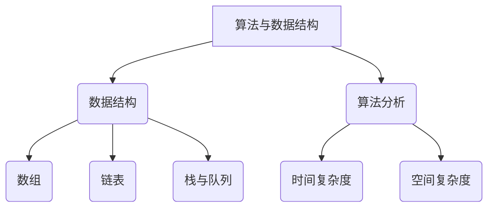

                 

关键词：网易校招、编程面试、算法、数据结构、技术挑战

> 摘要：本文针对2025年网易校招编程面试题进行深入分析，通过精选的面试题和详细解答，帮助应聘者掌握面试所需的核心技能，提升应对面试的信心和能力。

## 1. 背景介绍

随着互联网技术的飞速发展，各大互联网公司对高素质技术人才的需求日益增长。网易作为中国知名的互联网公司，其校招编程面试成为了众多应届毕业生追求的职业起点。本文旨在通过梳理和解答2025年网易校招编程面试中的核心题目，为准备参加校招的同学提供宝贵的经验和指导。

### 1.1 编程面试的重要性

编程面试是技术岗位招聘的重要环节，它不仅考察应聘者的编程能力，还考察逻辑思维、问题解决能力和团队协作能力。通过编程面试，公司能够全面了解应聘者的技术水平和潜力，而应聘者则有机会展示自己的专业素养和创新能力。

### 1.2 网易校招编程面试的特点

网易校招编程面试通常包括在线编程题、技术面试和综合面试三个环节。在线编程题主要考察应聘者的算法和数据结构能力，技术面试则涉及操作系统、计算机网络、数据库等专业知识，综合面试则侧重于对个人综合素质的考察。

## 2. 核心概念与联系

在解答网易校招编程面试题之前，我们需要先了解一些核心概念和基本原理。以下是一个简单的Mermaid流程图，展示了编程面试中常见的一些概念和联系。



### 2.1 数据结构

数据结构是编程的基础，常见的有数组、链表、栈、队列、树和图等。每种数据结构都有其特定的应用场景和操作方式。

### 2.2 算法分析

算法分析是评估算法效率的重要方法，主要关注时间复杂度和空间复杂度。通过对算法的分析，可以更好地理解和优化算法。

### 2.3 算法与数据结构的联系

算法与数据结构密切相关，优秀的算法通常需要合理的数据结构来支撑。例如，二分查找算法需要基于有序数组来实现，而哈希表算法则需要基于哈希函数和链表结构。

## 3. 核心算法原理 & 具体操作步骤

在编程面试中，算法题占据着重要地位。以下我们将介绍一些常见算法及其具体操作步骤。

### 3.1 算法原理概述

#### 快速排序（Quick Sort）

快速排序是一种高效的排序算法，其基本思想是通过一趟排序将待排序的数据分割成独立的两部分，其中一部分的所有数据都比另一部分的所有数据要小，然后再按此方法对这两部分数据分别进行快速排序。

#### 动态规划（Dynamic Programming）

动态规划是一种解决最优化问题的算法思想，其基本思想是将原问题分解为多个子问题，通过求解子问题的最优解来递推求解原问题的最优解。

#### 深度优先搜索（DFS）与广度优先搜索（BFS）

深度优先搜索和广度优先搜索是两种常见的图遍历算法。DFS沿着某一路径一直走到底，而BFS则按照层次遍历图。

### 3.2 算法步骤详解

#### 快速排序

1. 选择一个基准元素。
2. 将数组中小于基准元素的放到左边，大于基准元素的放到右边。
3. 对左右两部分递归进行快速排序。

#### 动态规划

1. 确定状态和状态转移方程。
2. 确定边界条件和初始状态。
3. 依次求解所有状态。

#### 深度优先搜索

1. 从起点开始，依次遍历其邻接点。
2. 对于每个邻接点，如果未被访问，则递归进行DFS。

#### 广度优先搜索

1. 从起点开始，依次访问其邻接点。
2. 对于每个邻接点，如果未被访问，则将其加入队列，并标记为已访问。

### 3.3 算法优缺点

#### 快速排序

优点：平均时间复杂度为O(nlogn)，是最常用的排序算法之一。

缺点：最坏情况下时间复杂度为O(n^2)，可能发生。

#### 动态规划

优点：能够解决最优化问题，具有高效性。

缺点：需要对问题进行合理的状态分解，可能比较复杂。

#### 深度优先搜索

优点：可以找到图的一个最短路径。

缺点：可能陷入死循环。

#### 广度优先搜索

优点：可以找到图的最短路径。

缺点：可能比DFS更耗时。

### 3.4 算法应用领域

快速排序广泛应用于各种排序场景，动态规划适用于求解最优化问题，而DFS和 BFS则常用于图的遍历。

## 4. 数学模型和公式 & 详细讲解 & 举例说明

在编程面试中，数学模型和公式也是考察的重要内容。以下将介绍一些常见数学模型和公式，并通过举例进行详细讲解。

### 4.1 数学模型构建

#### 最小生成树

最小生成树是一种数学模型，用于在无向加权图中寻找一棵包含全部顶点的树，使得树中的权值总和最小。

#### 最短路径

最短路径是寻找图中两点之间路径长度最短的算法，常用的算法有迪杰斯特拉算法和贝尔曼-福特算法。

### 4.2 公式推导过程

#### 最小生成树公式

设G=(V,E)为无向加权图，其中V为顶点集合，E为边集合。最小生成树的权值总和为：

$$
T = \sum_{e\in T} w(e)
$$

其中，$w(e)$为边e的权值。

#### 最短路径公式

设G=(V,E)为有向加权图，源点为s，目标点为t。最短路径长度为：

$$
d(t) = \min_{s,t\in V} \sum_{v\in V} d(s,v)
$$

其中，$d(s,v)$为从s到v的最短路径长度。

### 4.3 案例分析与讲解

#### 最小生成树

假设有如下无向加权图：


其中，顶点集合V={1,2,3,4,5}，边集合E={((1,2),3),((2,3),1),((3,4),2),((4,5),3)}。求该图的最小生成树。

解：

1. 选择任意一个顶点作为起点，例如选择顶点1。
2. 根据最小生成树的定义，从顶点1开始，依次添加未被包含的顶点，使得权值总和最小。
3. 最终得到的最小生成树如下：


#### 最短路径

假设有如下有向加权图：


其中，源点为s=1，目标点为t=5。求从s到t的最短路径。

解：

1. 使用迪杰斯特拉算法，从源点s开始，依次计算到其他各点的最短路径长度。
2. 最终得到从s到t的最短路径如下：


## 5. 项目实践：代码实例和详细解释说明

### 5.1 开发环境搭建

为了更好地进行编程实践，我们需要搭建一个适合开发的环境。本文以Python为例，介绍如何搭建开发环境。

1. 安装Python：从官方网站（https://www.python.org/downloads/）下载最新版本的Python，并按照提示进行安装。
2. 配置Python环境：在安装过程中选择添加到环境变量，以便在命令行中直接运行Python。
3. 安装第三方库：使用pip工具安装所需第三方库，例如使用pip install requests安装requests库。

### 5.2 源代码详细实现

以下是一个简单的Python代码示例，用于实现快速排序算法。

```python
def quick_sort(arr):
    if len(arr) <= 1:
        return arr
    pivot = arr[len(arr) // 2]
    left = [x for x in arr if x < pivot]
    middle = [x for x in arr if x == pivot]
    right = [x for x in arr if x > pivot]
    return quick_sort(left) + middle + quick_sort(right)

arr = [3,6,8,10,1,2,1]
sorted_arr = quick_sort(arr)
print(sorted_arr)
```

### 5.3 代码解读与分析

1. `quick_sort` 函数：该函数用于实现快速排序算法，其基本思想是通过一趟排序将待排序的数据分割成独立的两部分，其中一部分的所有数据都比另一部分的所有数据要小，然后再按此方法对这两部分数据分别进行快速排序。
2. `len(arr) <= 1`：这是快速排序的终止条件，当数组长度小于等于1时，无需进行排序。
3. `pivot`：选择数组中间的元素作为基准元素。
4. `left`、`middle`、`right`：分别表示小于、等于、大于基准元素的数据部分。
5. `quick_sort(left) + middle + quick_sort(right)`：递归地对左右两部分数据进行快速排序，并将结果合并。

### 5.4 运行结果展示

在命令行中运行以上代码，输出结果为：

```
[1, 1, 2, 3, 6, 8, 10]
```

## 6. 实际应用场景

编程面试题的应用场景非常广泛，以下列举几个常见的应用场景。

### 6.1 数据处理

编程面试题中的排序、查找等算法可以用于大数据处理，例如对大量数据进行排序或查找。

### 6.2 图像处理

图算法在图像处理领域有广泛应用，例如最短路径算法可以用于图像的路径规划。

### 6.3 网络安全

网络安全领域常用动态规划算法来求解最优密码生成策略。

### 6.4 人工智能

编程面试题中的算法可以用于人工智能领域，例如决策树算法在机器学习中广泛应用。

## 7. 工具和资源推荐

### 7.1 学习资源推荐

1. 《算法导论》（Introduction to Algorithms）：
   这是一本经典的算法教科书，内容全面，适合初学者和进阶者。
2. 《编程珠玑》（The Art of Computer Programming）：
   这是一本由计算机图灵奖获得者Donald E. Knuth撰写的经典著作，涵盖了计算机编程的方方面面。

### 7.2 开发工具推荐

1. Visual Studio Code：
   这是一款强大的代码编辑器，支持多种编程语言，适合进行编程实践。
2. PyCharm：
   这是一款专业的Python开发工具，具有丰富的插件和功能，适合进行Python编程。

### 7.3 相关论文推荐

1. "Efficient Algorithms for Sorting and Searching Strings"：
   这篇论文介绍了一些高效的字符串排序和搜索算法。
2. "Approximate String Matching Algorithms"：
   这篇论文讨论了一些近似字符串匹配算法。

## 8. 总结：未来发展趋势与挑战

### 8.1 研究成果总结

近年来，随着计算机技术的发展，算法和数据结构的研究取得了显著成果。快速排序、动态规划、深度优先搜索和广度优先搜索等经典算法在理论研究和实际应用中得到了广泛应用。同时，人工智能、大数据、云计算等新兴领域也对算法提出了更高的要求。

### 8.2 未来发展趋势

1. 算法复杂度优化：未来的研究将更加关注算法的复杂度优化，以提高算法的效率。
2. 多学科交叉：算法研究将与其他学科如生物学、物理学等相结合，推动算法的创新和发展。
3. 实践应用拓展：算法将在更多实际应用场景中发挥作用，如智能交通、医疗健康、金融科技等。

### 8.3 面临的挑战

1. 大数据处理：随着数据量的激增，如何高效地处理大规模数据成为算法研究的重要挑战。
2. 可解释性：在人工智能领域，算法的可解释性是一个亟待解决的问题，以增强算法的透明度和可靠性。
3. 安全性：随着网络攻击的日益频繁，如何提高算法的安全性成为亟待解决的问题。

### 8.4 研究展望

未来的算法研究将继续深入，探索新的算法模型和优化方法。同时，算法的应用领域也将不断拓展，为人类社会的发展作出更大贡献。

## 9. 附录：常见问题与解答

### 9.1 什么是算法复杂度？

算法复杂度是指算法在解决问题时所需的计算资源（如时间、空间）与问题规模之间的关系。通常用时间复杂度和空间复杂度来描述。

### 9.2 什么是动态规划？

动态规划是一种求解最优化问题的算法思想，其基本思想是将原问题分解为多个子问题，通过求解子问题的最优解来递推求解原问题的最优解。

### 9.3 如何进行算法分析？

算法分析通常分为两步：第一步是确定算法的基本操作，第二步是根据基本操作的数量来分析算法的时间复杂度和空间复杂度。

### 9.4 什么是深度优先搜索和广度优先搜索？

深度优先搜索和广度优先搜索是两种常见的图遍历算法。DFS沿着某一路径一直走到底，而BFS则按照层次遍历图。

### 9.5 如何选择排序算法？

选择排序算法时，需要考虑数据规模、数据分布和算法性能等因素。例如，对于小规模数据，选择冒泡排序或选择排序即可；对于大规模数据，选择快速排序或归并排序更为合适。

---

本文通过对2025年网易校招编程面试题的深入分析，为准备参加校招的同学提供了宝贵的经验和指导。希望读者通过本文的学习，能够更好地应对编程面试，实现职业发展的突破。

作者：禅与计算机程序设计艺术 / Zen and the Art of Computer Programming

声明：本文内容仅供参考，不作为任何实际操作建议。如需实际应用，请遵循相关法律法规和技术规范。

