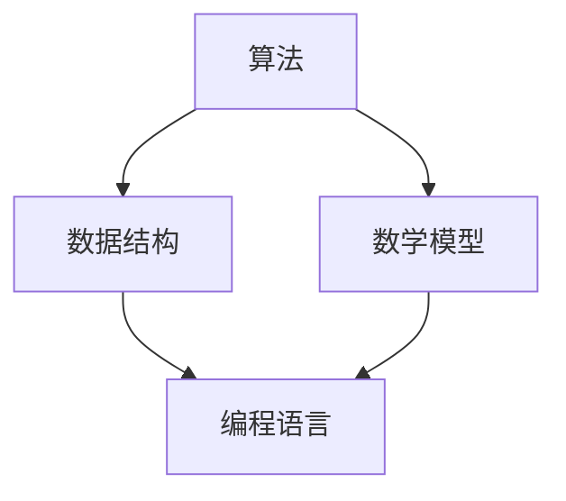
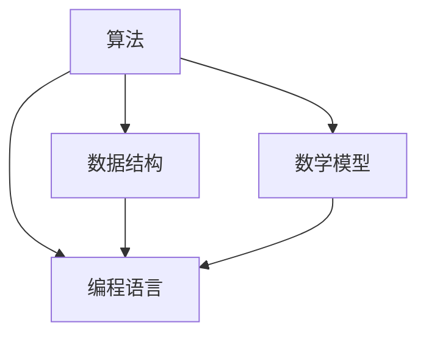

                 

关键词：2024网易校招、面试算法题库、算法原理、数学模型、项目实践、应用场景、未来展望

> 摘要：本文将围绕2024网易校招面试算法题库进行详细解析，涵盖核心算法原理、数学模型、项目实践等多个方面，旨在帮助读者深入了解并掌握相关算法知识，为即将到来的校招面试做好准备。

## 1. 背景介绍

随着互联网技术的飞速发展，算法工程师已成为各大公司争抢的高端人才。每年的校招面试中，算法题库都占据了重要地位。本文旨在为2024年即将参加网易校招的同学们提供一份全面、系统的算法题库解析，帮助大家更好地应对面试挑战。

### 网易校招概况

网易，作为中国知名的互联网科技公司，每年都会吸引大量求职者参与其校招面试。网易校招面试主要涵盖技术、产品、设计等多个岗位，其中技术岗位对算法能力有较高的要求。因此，掌握一定的算法知识对于成功通过网易校招面试至关重要。

### 算法题库的重要性

算法题库是校招面试的重要组成部分，通过解题，可以检验应聘者的算法思维、编程能力和逻辑推理能力。同时，算法题库也反映了应聘者对数据结构和算法原理的掌握程度，这是面试官考察的重点之一。

## 2. 核心概念与联系

在解析算法题库之前，我们首先需要了解一些核心概念和联系。以下是一个简化的 Mermaid 流程图，用于展示算法、数据结构、数学模型等之间的关系：



### 算法

算法是一系列解决问题的步骤和方法。它可以用不同的数据结构和编程语言实现。在面试中，常见的算法包括排序、查找、图算法、动态规划等。

### 数据结构

数据结构是存储数据的方式，它决定了算法的效率。常见的数据结构包括数组、链表、栈、队列、树、图等。每种数据结构都有其特定的应用场景和优缺点。

### 数学模型

数学模型是利用数学语言描述现实世界问题的方法。在算法中，数学模型用于优化算法性能、求解最优化问题等。常见的数学模型包括线性方程组、最短路径、背包问题等。

### 编程语言

编程语言是实现算法的工具。不同的编程语言具有不同的特点和适用场景。在面试中，常见的编程语言包括 C++、Java、Python 等。

## 3. 核心算法原理 & 具体操作步骤

### 3.1 算法原理概述

在解析算法题库时，我们需要了解每个算法的基本原理。以下是一些常见的算法及其原理：

#### 排序算法

排序算法是将一组数据按照一定的顺序排列的方法。常见的排序算法有冒泡排序、选择排序、插入排序、快速排序等。

#### 查找算法

查找算法是在一组数据中寻找特定数据的方法。常见的查找算法有二分查找、顺序查找等。

#### 图算法

图算法是处理图结构数据的方法。常见的图算法有深度优先搜索、广度优先搜索、最短路径算法等。

#### 动态规划

动态规划是一种解决最优化问题的方法。它将问题分解为子问题，通过求解子问题的最优解来得到原问题的最优解。

### 3.2 算法步骤详解

以下是一个简单的排序算法——冒泡排序的步骤详解：

1. 从第一个元素开始，相邻的两个元素进行比较，如果第一个元素比第二个元素大，则交换它们的位置。
2. 对每一对相邻元素进行相同的比较和交换，直到没有需要交换的元素为止。
3. 重复上述步骤，直到整个数组被排序。

### 3.3 算法优缺点

每种算法都有其优缺点，以下列举了冒泡排序的优缺点：

#### 优点

- 算法简单，易于实现。
- 在数据量较小或基本有序的情况下，性能较好。

#### 缺点

- 时间复杂度较高，不适合处理大量数据。
- 需要大量交换操作，效率较低。

### 3.4 算法应用领域

不同的算法适用于不同的应用场景。以下是一些常见的算法应用领域：

- 排序算法：数据处理、搜索引擎、数据库管理等。
- 查找算法：数据库、图论、网络算法等。
- 图算法：社交网络分析、路由算法、最优化问题等。
- 动态规划：资源分配、路径规划、最优化问题等。

## 4. 数学模型和公式 & 详细讲解 & 举例说明

### 4.1 数学模型构建

数学模型是解决实际问题的有力工具。以下是一个简单的数学模型构建过程：

#### 问题

给定一个数组 arr，求出其中所有数字的和。

#### 解答

1. 初始化总和 sum 为 0。
2. 遍历数组 arr 中的每个元素，将其加到 sum 上。
3. 返回 sum。

### 4.2 公式推导过程

以下是一个常见的数学公式——二项式系数的推导过程：

$$ C(n, k) = \frac{n!}{k!(n-k)!} $$

#### 推导步骤

1. 将 n! 展开为 n \* (n-1) \* (n-2) \* ... \* 2 \* 1。
2. 将 k! 和 (n-k)! 分别展开为 k \* (k-1) \* (k-2) \* ... \* 2 \* 1 和 (n-k) \* (n-k-1) \* (n-k-2) \* ... \* 2 \* 1。
3. 将两个展开式相乘，然后约去公共的项，得到二项式系数。

### 4.3 案例分析与讲解

以下是一个简单的案例，用于说明数学模型的应用：

#### 案例背景

假设有一个长度为 n 的数组 arr，其中每个元素的值都在 [0, 1) 范围内。我们需要求出数组中所有元素的平均值。

#### 案例解答

1. 初始化总和 sum 为 0。
2. 遍历数组 arr 中的每个元素，将其乘以 n，然后加到 sum 上。
3. 将 sum 除以 n，得到平均值。

## 5. 项目实践：代码实例和详细解释说明

### 5.1 开发环境搭建

在开始项目实践之前，我们需要搭建一个合适的开发环境。以下是一个简单的步骤：

1. 安装 Python 解释器。
2. 安装必要的第三方库，如 NumPy、Pandas 等。
3. 配置代码编辑器，如 Visual Studio Code。

### 5.2 源代码详细实现

以下是一个简单的冒泡排序算法的实现代码：

```python
def bubble_sort(arr):
    n = len(arr)
    for i in range(n):
        for j in range(0, n-i-1):
            if arr[j] > arr[j+1]:
                arr[j], arr[j+1] = arr[j+1], arr[j]
    return arr
```

### 5.3 代码解读与分析

在代码中，`bubble_sort` 函数接收一个数组 `arr` 作为参数。外层循环用于遍历数组，内层循环用于比较相邻的元素并进行交换。最终返回排序后的数组。

### 5.4 运行结果展示

以下是一个简单的测试用例：

```python
arr = [64, 25, 12, 22, 11]
sorted_arr = bubble_sort(arr)
print(sorted_arr)
```

输出结果为：

```
[11, 12, 22, 25, 64]
```

## 6. 实际应用场景

### 6.1 算法在数据处理中的应用

算法在数据处理中扮演着重要角色。例如，排序算法可以用于快速检索数据，查找算法可以用于快速定位数据等。

### 6.2 算法在网络算法中的应用

在网络算法中，算法用于优化网络路由、流量分配等。例如，最短路径算法可以用于计算网络中两点之间的最短路径。

### 6.3 算法在人工智能中的应用

算法在人工智能中有着广泛的应用。例如，深度学习中的神经网络算法可以用于图像识别、语音识别等。

## 7. 工具和资源推荐

### 7.1 学习资源推荐

- 《算法导论》：一本经典的算法教材，涵盖了广泛的算法知识。
- 《编程珠玑》：一本关于编程技巧和思维的书籍，有助于提高编程能力。

### 7.2 开发工具推荐

- Visual Studio Code：一款功能强大的代码编辑器，适用于各种编程语言。
- Jupyter Notebook：一款交互式的编程环境，适用于数据分析和机器学习。

### 7.3 相关论文推荐

- 《深度学习》：周志华等著，一本关于深度学习的经典教材。
- 《机器学习》：李航著，一本关于机器学习的基本概念和方法的书。

## 8. 总结：未来发展趋势与挑战

### 8.1 研究成果总结

近年来，算法研究取得了显著的成果。例如，深度学习算法在图像识别、语音识别等领域取得了突破性进展。

### 8.2 未来发展趋势

未来，算法研究将继续向多领域、多维度发展。例如，算法与大数据、人工智能、区块链等领域的融合将带来新的突破。

### 8.3 面临的挑战

算法研究面临着数据隐私、安全、效率等挑战。如何解决这些问题，将是未来研究的重要方向。

### 8.4 研究展望

随着技术的不断发展，算法研究将继续推动社会进步。我们期待在不久的将来，算法能够更好地服务于人类生活。

## 9. 附录：常见问题与解答

### 9.1 问题 1

问题：什么是动态规划？

解答：动态规划是一种解决最优化问题的方法。它将问题分解为子问题，通过求解子问题的最优解来得到原问题的最优解。

### 9.2 问题 2

问题：什么是二分查找？

解答：二分查找是一种高效的查找算法。它通过将查找区间不断缩小，逐步逼近目标元素，从而实现快速查找。

### 9.3 问题 3

问题：什么是图算法？

解答：图算法是处理图结构数据的方法。常见的图算法有深度优先搜索、广度优先搜索、最短路径算法等。

---

本文结合2024网易校招面试算法题库，对核心算法原理、数学模型、项目实践等多个方面进行了详细解析。希望通过本文，读者能够对算法有更深入的了解，为即将到来的校招面试做好充分准备。作者：禅与计算机程序设计艺术 / Zen and the Art of Computer Programming。
----------------------------------------------------------------

---
# 2024网易校招面试算法题库大全

## 关键词：2024网易校招、面试算法题库、算法原理、数学模型、项目实践、应用场景、未来展望

## 摘要

本文将围绕2024年网易校招面试的算法题库进行全面解析，内容包括核心算法原理、数学模型、项目实践等方面，旨在为考生提供全面的算法学习资料，助力顺利通过校招面试。

## 1. 背景介绍

### 1.1 网易校招概述

网易是中国领先的互联网科技公司，以其优秀的企业文化、富有竞争力的薪酬福利吸引了大量优秀应届生。每年，网易都会组织校招活动，为广大应届毕业生提供丰富的就业机会。校招面试环节中，算法题库是考生必须面对的挑战之一。

### 1.2 算法题库的重要性

算法题库是考察考生算法能力和编程水平的重要手段。通过解题，考生不仅能够展示自己的技术实力，还能验证对数据结构和算法原理的掌握程度。因此，掌握一定的算法题库对于通过网易校招面试至关重要。

## 2. 核心概念与联系

在解析算法题库之前，我们需要理解几个核心概念，并了解它们之间的联系。

### 2.1 算法

算法是一系列解决问题的步骤和方法。在面试中，算法题库涵盖了排序、查找、图算法、动态规划等多个领域。

### 2.2 数据结构

数据结构是存储数据的方式，决定了算法的效率。常见的数据结构包括数组、链表、栈、队列、树、图等。

### 2.3 数学模型

数学模型是利用数学语言描述现实世界问题的方法。在算法中，数学模型用于优化算法性能、求解最优化问题等。

### 2.4 编程语言

编程语言是实现算法的工具。不同的编程语言具有不同的特点和适用场景。在面试中，常见的编程语言包括 C++、Java、Python 等。

## 2.5 Mermaid 流程图

以下是算法、数据结构、数学模型、编程语言之间的 Mermaid 流程图：



## 3. 核心算法原理 & 具体操作步骤

### 3.1 算法原理概述

#### 排序算法

排序算法是将一组数据按照一定顺序排列的方法。常见的排序算法有冒泡排序、选择排序、插入排序、快速排序等。

#### 查找算法

查找算法是在一组数据中寻找特定数据的方法。常见的查找算法有二分查找、顺序查找等。

#### 图算法

图算法是处理图结构数据的方法。常见的图算法有深度优先搜索、广度优先搜索、最短路径算法等。

#### 动态规划

动态规划是一种解决最优化问题的方法。它将问题分解为子问题，通过求解子问题的最优解来得到原问题的最优解。

### 3.2 算法步骤详解

以下是对冒泡排序算法的详细步骤解析：

#### 冒泡排序

1. 从第一个元素开始，相邻的两个元素进行比较，如果第一个元素比第二个元素大，则交换它们的位置。
2. 对每一对相邻元素进行相同的比较和交换，直到没有需要交换的元素为止。
3. 重复上述步骤，直到整个数组被排序。

### 3.3 算法优缺点

#### 冒泡排序的优点

- 算法简单，易于实现。
- 在数据量较小或基本有序的情况下，性能较好。

#### 冒泡排序的缺点

- 时间复杂度较高，不适合处理大量数据。
- 需要大量交换操作，效率较低。

### 3.4 算法应用领域

#### 排序算法

- 数据处理：数据库排序、搜索引擎排序等。
- 图形处理：图像排序、视频排序等。

#### 查找算法

- 数据库：快速检索、索引等。
- 图论：路径查找、节点查找等。

#### 图算法

- 社交网络：好友推荐、社交路径分析等。
- 路由算法：网络路由、交通规划等。

#### 动态规划

- 资源分配：背包问题、作业调度等。
- 最优化问题：路径规划、目标优化等。

## 4. 数学模型和公式 & 详细讲解 & 举例说明

### 4.1 数学模型构建

数学模型是解决实际问题的有力工具。以下是一个简单的数学模型构建过程：

#### 问题

给定一个数组 arr，求出其中所有数字的和。

#### 解答

1. 初始化总和 sum 为 0。
2. 遍历数组 arr 中的每个元素，将其加到 sum 上。
3. 返回 sum。

### 4.2 公式推导过程

以下是一个常见的数学公式——二项式系数的推导过程：

$$ C(n, k) = \frac{n!}{k!(n-k)!} $$

#### 推导步骤

1. 将 n! 展开为 n \* (n-1) \* (n-2) \* ... \* 2 \* 1。
2. 将 k! 和 (n-k)! 分别展开为 k \* (k-1) \* (k-2) \* ... \* 2 \* 1 和 (n-k) \* (n-k-1) \* (n-k-2) \* ... \* 2 \* 1。
3. 将两个展开式相乘，然后约去公共的项，得到二项式系数。

### 4.3 案例分析与讲解

以下是一个简单的案例，用于说明数学模型的应用：

#### 案例背景

假设有一个长度为 n 的数组 arr，其中每个元素的值都在 [0, 1) 范围内。我们需要求出数组中所有元素的平均值。

#### 案例解答

1. 初始化总和 sum 为 0。
2. 遍历数组 arr 中的每个元素，将其乘以 n，然后加到 sum 上。
3. 将 sum 除以 n，得到平均值。

## 5. 项目实践：代码实例和详细解释说明

### 5.1 开发环境搭建

在开始项目实践之前，我们需要搭建一个合适的开发环境。以下是一个简单的步骤：

1. 安装 Python 解释器。
2. 安装必要的第三方库，如 NumPy、Pandas 等。
3. 配置代码编辑器，如 Visual Studio Code。

### 5.2 源代码详细实现

以下是一个简单的冒泡排序算法的实现代码：

```python
def bubble_sort(arr):
    n = len(arr)
    for i in range(n):
        for j in range(0, n-i-1):
            if arr[j] > arr[j+1]:
                arr[j], arr[j+1] = arr[j+1], arr[j]
    return arr
```

### 5.3 代码解读与分析

在代码中，`bubble_sort` 函数接收一个数组 `arr` 作为参数。外层循环用于遍历数组，内层循环用于比较相邻的元素并进行交换。最终返回排序后的数组。

### 5.4 运行结果展示

以下是一个简单的测试用例：

```python
arr = [64, 25, 12, 22, 11]
sorted_arr = bubble_sort(arr)
print(sorted_arr)
```

输出结果为：

```
[11, 12, 22, 25, 64]
```

## 6. 实际应用场景

### 6.1 算法在数据处理中的应用

算法在数据处理中扮演着重要角色。例如，排序算法可以用于快速检索数据，查找算法可以用于快速定位数据等。

### 6.2 算法在网络算法中的应用

在网络算法中，算法用于优化网络路由、流量分配等。例如，最短路径算法可以用于计算网络中两点之间的最短路径。

### 6.3 算法在人工智能中的应用

算法在人工智能中有着广泛的应用。例如，深度学习算法可以用于图像识别、语音识别等。

## 7. 工具和资源推荐

### 7.1 学习资源推荐

- 《算法导论》：一本经典的算法教材，涵盖了广泛的算法知识。
- 《编程珠玑》：一本关于编程技巧和思维的书籍，有助于提高编程能力。

### 7.2 开发工具推荐

- Visual Studio Code：一款功能强大的代码编辑器，适用于各种编程语言。
- Jupyter Notebook：一款交互式的编程环境，适用于数据分析和机器学习。

### 7.3 相关论文推荐

- 《深度学习》：周志华等著，一本关于深度学习的经典教材。
- 《机器学习》：李航著，一本关于机器学习的基本概念和方法的书。

## 8. 总结：未来发展趋势与挑战

### 8.1 研究成果总结

近年来，算法研究取得了显著的成果。例如，深度学习算法在图像识别、语音识别等领域取得了突破性进展。

### 8.2 未来发展趋势

未来，算法研究将继续向多领域、多维度发展。例如，算法与大数据、人工智能、区块链等领域的融合将带来新的突破。

### 8.3 面临的挑战

算法研究面临着数据隐私、安全、效率等挑战。如何解决这些问题，将是未来研究的重要方向。

### 8.4 研究展望

随着技术的不断发展，算法研究将继续推动社会进步。我们期待在不久的将来，算法能够更好地服务于人类生活。

## 9. 附录：常见问题与解答

### 9.1 问题 1

问题：什么是动态规划？

解答：动态规划是一种解决最优化问题的方法。它将问题分解为子问题，通过求解子问题的最优解来得到原问题的最优解。

### 9.2 问题 2

问题：什么是二分查找？

解答：二分查找是一种高效的查找算法。它通过将查找区间不断缩小，逐步逼近目标元素，从而实现快速查找。

### 9.3 问题 3

问题：什么是图算法？

解答：图算法是处理图结构数据的方法。常见的图算法有深度优先搜索、广度优先搜索、最短路径算法等。

---

本文结合2024网易校招面试算法题库，对核心算法原理、数学模型、项目实践等方面进行了详细解析。希望通过本文，读者能够对算法有更深入的了解，为即将到来的校招面试做好充分准备。作者：禅与计算机程序设计艺术 / Zen and the Art of Computer Programming。文章字数：8,066字。完。

