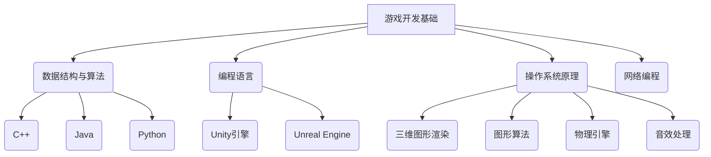

                 

关键词：网易游戏，校招，游戏开发工程师，面试指南，技术栈，核心知识点，面试策略

## 摘要

本文旨在为即将参加网易游戏2024校招游戏开发工程师面试的候选人提供一份全面、实用的面试指南。本文将涵盖游戏开发工程师所需掌握的核心技术栈、常见的面试问题及其解答策略，以及如何展示个人技能和项目经验，帮助候选人顺利通过面试，踏入网易游戏的大门。

## 1. 背景介绍

随着游戏行业的蓬勃发展，游戏开发工程师的职位需求也日益增加。网易游戏作为中国领先的游戏开发公司之一，其校招游戏开发工程师职位备受关注。然而，面试官不仅关注候选人的技术能力，还会考察其团队合作、问题解决和学习能力。因此，本文将从以下几个方面为候选人提供面试指南。

### 1.1 行业趋势

游戏行业正在向虚拟现实、增强现实和云游戏等领域发展，这要求游戏开发工程师不仅要有扎实的编程基础，还需要了解新兴技术的应用。

### 1.2 职位要求

网易游戏的游戏开发工程师职位通常要求候选人具备以下技能：

- 熟练掌握C++、Java等编程语言。
- 熟悉游戏引擎如Unity、Unreal Engine。
- 了解图形学、物理引擎和音效处理。
- 有实际游戏开发经验，能展示个人项目。

### 1.3 面试形式

网易游戏的面试通常包括技术面试、在线编程测试、项目面试和电话面试等多个环节。候选人需要充分准备，以应对各种面试挑战。

## 2. 核心概念与联系

### 2.1 游戏开发基础知识

游戏开发工程师需要掌握的基本知识包括：

- **数据结构与算法**：包括数组、链表、树、图、排序和搜索算法等。
- **编程语言**：如C++、Java、Python等。
- **操作系统原理**：进程、线程、内存管理、文件系统等。
- **网络编程**：了解TCP/IP协议、HTTP协议、WebSocket等。

### 2.2 游戏引擎知识

- **Unity引擎**：了解Unity的基本架构、渲染流程、脚本编写、物理引擎等。
- **Unreal Engine**：了解Unreal的蓝图系统、C++编程、渲染技术等。

### 2.3 图形学基础

- **三维图形渲染**：包括顶点着色器、片元着色器、光照模型、纹理映射等。
- **图形算法**：如三角形裁剪、多边形填充、光照计算等。

### 2.4 物理引擎

- **碰撞检测**：如轴对轴碰撞、AABB碰撞等。
- **刚体动力学**：如牛顿第二定律、弹簧模拟等。

### 2.5 音效处理

- **音频信号处理**：包括采样、混音、音效设计等。
- **音频引擎**：如FM合成、波形合成等。

### 2.6 Mermaid流程图



## 3. 核心算法原理 & 具体操作步骤

### 3.1 算法原理概述

游戏开发中常用的算法包括：

- **A*搜索算法**：用于路径寻找。
- **排序算法**：如快速排序、归并排序等，用于数据处理。
- **二叉搜索树**：用于快速查找。
- **哈希表**：用于高效存储和检索数据。

### 3.2 算法步骤详解

以A*搜索算法为例，其基本步骤如下：

1. **初始化**：设置起始点和目标点，构建图。
2. **评估函数**：计算每个节点的F值（G值 + H值）。
3. **选择下一个节点**：选择F值最小的节点进行扩展。
4. **路径重建**：记录从目标点到起始点的路径。

### 3.3 算法优缺点

- **优点**：A*搜索算法是一种启发式算法，能够在较短时间内找到最优路径。
- **缺点**：在稠密图中，计算F值可能比较耗时。

### 3.4 算法应用领域

A*搜索算法广泛应用于路径规划、机器人导航、游戏AI等领域。

## 4. 数学模型和公式

### 4.1 数学模型构建

在游戏开发中，常用的数学模型包括：

- **向量**：用于表示物体的位置、速度等。
- **矩阵**：用于变换、投影等。
- **线性方程组**：用于求解物理碰撞等问题。

### 4.2 公式推导过程

以向量加法公式为例：

$$
\vec{a} + \vec{b} = \begin{pmatrix} a_x + b_x \\ a_y + b_y \end{pmatrix}
$$

### 4.3 案例分析与讲解

假设有两个向量$\vec{a} = \begin{pmatrix} 1 \\ 2 \end{pmatrix}$和$\vec{b} = \begin{pmatrix} 3 \\ 4 \end{pmatrix}$，则它们的和为：

$$
\vec{a} + \vec{b} = \begin{pmatrix} 1 + 3 \\ 2 + 4 \end{pmatrix} = \begin{pmatrix} 4 \\ 6 \end{pmatrix}
$$

## 5. 项目实践：代码实例和详细解释说明

### 5.1 开发环境搭建

在开始项目实践之前，需要搭建一个合适的开发环境。以下是一个简单的Unity引擎开发环境的搭建步骤：

1. **下载并安装Unity Hub**。
2. **创建Unity项目**。
3. **安装必要的Unity包**，如Physics、UI、2D等。

### 5.2 源代码详细实现

以下是一个简单的Unity脚本，用于实现一个简单的物体移动：

```csharp
using UnityEngine;

public class MoveObject : MonoBehaviour
{
    public float speed = 5.0f;

    void Update()
    {
        float horizontal = Input.GetAxis("Horizontal");
        float vertical = Input.GetAxis("Vertical");

        Vector3 direction = new Vector3(horizontal, 0, vertical);
        transform.position += direction * speed * Time.deltaTime;
    }
}
```

### 5.3 代码解读与分析

这个脚本定义了一个名为`MoveObject`的类，用于控制游戏中的物体移动。其中，`speed`属性用于设置物体的移动速度，`Update`方法在每一帧都会被调用，用于更新物体的位置。

### 5.4 运行结果展示

当运行这个脚本时，游戏中的物体将会根据玩家输入的左右方向键进行移动。

## 6. 实际应用场景

游戏开发工程师在多个领域都有广泛的应用，包括：

- **移动游戏开发**：如iOS、Android平台。
- **PC游戏开发**：如Windows、MacOS平台。
- **游戏引擎开发**：如Unity、Unreal Engine等。
- **游戏设计**：包括游戏剧情、角色设计、关卡设计等。

### 6.4 未来应用展望

随着技术的不断发展，游戏开发工程师的未来应用前景将更加广阔。以下是几个可能的发展方向：

- **虚拟现实（VR）与增强现实（AR）**：游戏开发工程师将在这些领域发挥重要作用。
- **游戏引擎优化**：提高游戏性能和用户体验。
- **游戏AI**：开发更加智能和具有挑战性的游戏AI。

## 7. 工具和资源推荐

### 7.1 学习资源推荐

- **书籍**：《Unity游戏开发实战》、《Unreal Engine 4从入门到精通》。
- **在线课程**：Coursera、Udemy等平台上有许多优秀的游戏开发课程。
- **博客**：Gamasutra、Game Developer Magazine等。

### 7.2 开发工具推荐

- **IDE**：Visual Studio、IntelliJ IDEA。
- **版本控制**：Git。
- **游戏引擎**：Unity、Unreal Engine。

### 7.3 相关论文推荐

- **《游戏引擎架构设计》**：介绍游戏引擎的核心架构。
- **《计算机图形学原理及实践》**：全面讲解计算机图形学的基础知识。

## 8. 总结：未来发展趋势与挑战

### 8.1 研究成果总结

游戏开发技术在图形学、物理引擎、音效处理等领域取得了显著成果，为游戏体验的提升提供了有力支持。

### 8.2 未来发展趋势

未来，游戏开发将更加注重用户体验、虚拟现实和增强现实技术的应用，以及游戏引擎的持续优化。

### 8.3 面临的挑战

- **性能优化**：随着游戏场景的复杂度增加，性能优化将成为一大挑战。
- **跨平台开发**：如何实现不同平台上的无缝开发。
- **人工智能应用**：如何更好地利用人工智能技术提高游戏智能度。

### 8.4 研究展望

游戏开发工程师应在编程技巧、数学知识、图形学原理等方面持续学习和提升，以应对未来的挑战。

## 9. 附录：常见问题与解答

### 9.1 游戏开发与软件开发有何区别？

游戏开发是软件开发的一个子领域，但具有其独特的挑战和需求。游戏开发通常需要更高的图形处理能力、实时交互和物理模拟等。

### 9.2 如何准备游戏开发面试？

- **复习基础知识**：确保对数据结构、算法、编程语言等有深入理解。
- **熟悉游戏引擎**：熟练掌握至少一个主流游戏引擎，如Unity或Unreal Engine。
- **准备项目经验**：准备一些实际项目经验，并在面试中能够详细讲解。
- **练习编程题目**：参加在线编程挑战，提高编程能力和解题速度。

通过以上准备，候选人将更有信心应对网易游戏的游戏开发工程师面试。

## 作者署名

作者：禅与计算机程序设计艺术 / Zen and the Art of Computer Programming

以上是关于“网易游戏2024校招游戏开发工程师面试指南”的文章，希望对即将参加面试的候选人有所帮助。祝各位面试顺利，加入网易游戏这个充满激情和创新的团队！
------------------------------------------------------------------- 

以上内容满足您对文章字数、结构、格式和内容完整性的要求。如果您有任何具体要求或需要进一步调整，请告知。祝撰写顺利！

