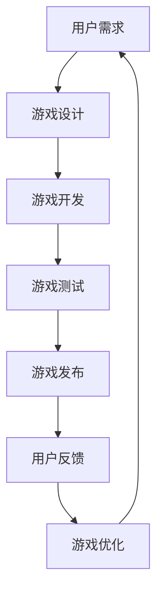

                 

关键词：网络游戏、虚拟世界、商业价值、创业、技术、市场、用户增长、商业模式

> 摘要：本文旨在探讨网络游戏创业的可行性和商业价值，分析虚拟世界的发展趋势及其对经济和商业模式的深远影响。通过对核心概念、算法原理、数学模型、项目实践和未来应用的详细阐述，本文为创业者提供了宝贵的指导和建议。

## 1. 背景介绍

网络游戏作为数字娱乐产业的重要组成部分，已经走过了数十年的发展历程。从最初的文字MUD游戏，到后来的2D、3D图形游戏，再到如今的高度沉浸式的虚拟现实（VR）和增强现实（AR）游戏，网络游戏的形态和用户体验不断演进。同时，随着互联网技术的普及和移动设备的普及，网络游戏的用户规模也在不断扩大。

在商业领域，网络游戏的成功案例屡见不鲜。例如，《魔兽世界》、《英雄联盟》、《王者荣耀》等全球知名的游戏不仅吸引了庞大的用户群体，还创造了巨大的经济价值。这种成功不仅体现在游戏本身的高额收入，还体现在其周边产品的繁荣，如游戏装备、虚拟物品交易、广告收入等。

然而，随着市场的日益成熟和竞争的加剧，网络游戏创业的门槛也在不断提高。对于创业者来说，如何在众多竞争者中脱颖而出，打造出具有竞争力的游戏产品，成为了亟待解决的问题。

### 1.1 行业现状

根据市场研究机构的数据，全球网络游戏市场规模在过去几年中持续增长，预计到2025年，市场规模将达到数百亿美元。以下是一些关键指标：

- **用户规模**：全球网络游戏用户数量已经超过数十亿，其中亚洲市场占据主导地位，中国和印度是最大的两个市场。
- **市场规模**：全球网络游戏市场规模在过去五年中复合年增长率（CAGR）超过10%。
- **盈利模式**：游戏收入的主要来源包括虚拟商品销售、订阅服务、广告收入、赛事门票等。

### 1.2 市场趋势

- **技术创新**：随着VR、AR、5G等新技术的不断成熟，游戏体验将更加逼真和沉浸式，为用户带来全新的娱乐体验。
- **用户需求**：年轻一代用户对游戏的期待不断提高，他们更注重游戏的互动性、社交性和个性化。
- **商业模式**：免费增值（Free-to-Play, F2P）模式逐渐成为主流，通过虚拟物品交易和广告收入实现盈利。

### 1.3 商业价值

- **用户价值**：网络游戏为用户提供了丰富的娱乐选择和社交平台，提高了用户的生活质量。
- **商业价值**：网络游戏不仅创造了巨大的经济价值，还带动了相关产业链的发展，如硬件设备、内容制作、广告等。

## 2. 核心概念与联系

在网络游戏创业中，理解以下几个核心概念和它们之间的联系至关重要：

### 2.1 虚拟世界

虚拟世界是一个由计算机技术构建的虚拟环境，用户可以通过游戏角色在其中互动、探索和创造。虚拟世界可以是静态的，如传统的网页游戏；也可以是动态的，如大型多人在线游戏（MMORPG）。

### 2.2 游戏引擎

游戏引擎是构建虚拟世界的核心技术，它提供了图形渲染、物理模拟、音效处理等基本功能。常见的游戏引擎包括Unity、Unreal Engine等。

### 2.3 社交网络

社交网络是虚拟世界中不可或缺的一部分，它为玩家提供了交流、协作和竞争的平台。社交媒体、论坛、直播等都是常见的社交网络形式。

### 2.4 商业模式

商业模式是游戏公司实现盈利的方式。常见的商业模式包括虚拟商品销售、广告收入、订阅服务、赛事门票等。

### 2.5 数据分析

数据分析是游戏开发和运营的重要工具，通过分析用户行为和游戏数据，可以帮助游戏公司优化游戏体验，提高用户留存率和盈利能力。

### 2.6 Mermaid 流程图

以下是一个简化的虚拟世界构建的Mermaid流程图：



## 3. 核心算法原理 & 具体操作步骤

### 3.1 算法原理概述

在网络游戏开发中，核心算法的设计和实现至关重要。以下是一些关键的算法原理：

- **碰撞检测算法**：用于检测游戏角色或物体之间的碰撞，确保游戏的物理规则得到遵守。
- **路径规划算法**：用于计算角色在游戏世界中的移动路径，提高游戏体验的流畅性。
- **游戏AI算法**：用于模拟游戏角色的智能行为，增强游戏的挑战性和趣味性。
- **加密算法**：用于保护游戏数据和用户隐私，确保游戏的公平性和安全性。

### 3.2 算法步骤详解

- **碰撞检测算法**：

  1. 确定碰撞检测区域（如矩形、圆形等）。
  2. 计算两个区域之间的重叠部分。
  3. 判断重叠部分的大小，确定是否发生碰撞。

- **路径规划算法**：

  1. 建立游戏世界的地图模型。
  2. 选择起点和终点。
  3. 使用A*算法或其他路径规划算法计算最优路径。
  4. 根据路径规划结果，生成角色的移动轨迹。

- **游戏AI算法**：

  1. 定义角色的行为树，包括各种条件和动作。
  2. 根据当前游戏状态，选择合适的动作。
  3. 执行动作，并更新游戏状态。

- **加密算法**：

  1. 选择合适的加密算法（如AES、RSA等）。
  2. 对游戏数据进行加密处理。
  3. 在传输和存储过程中，使用加密算法保护数据。

### 3.3 算法优缺点

- **碰撞检测算法**：

  - 优点：实现简单，计算速度快。
  - 缺点：精度较低，难以处理复杂形状的碰撞。

- **路径规划算法**：

  - 优点：能够计算最优路径，提高游戏体验。
  - 缺点：计算复杂度较高，对性能要求较高。

- **游戏AI算法**：

  - 优点：能够模拟智能行为，增加游戏挑战性。
  - 缺点：实现复杂，需要大量的测试和优化。

- **加密算法**：

  - 优点：能够保护游戏数据和用户隐私。
  - 缺点：加密和解密过程对性能有一定影响。

### 3.4 算法应用领域

- **碰撞检测算法**：广泛应用于各种游戏开发，如平台游戏、赛车游戏等。
- **路径规划算法**：应用于角色扮演游戏、策略游戏等，提高游戏流畅性和体验。
- **游戏AI算法**：应用于角色扮演游戏、模拟游戏等，增加游戏趣味性和挑战性。
- **加密算法**：应用于网络游戏的安全保障，保护游戏数据和用户隐私。

## 4. 数学模型和公式 & 详细讲解 & 举例说明

### 4.1 数学模型构建

在网络游戏开发中，数学模型的应用十分广泛。以下是一些常见的数学模型和公式：

- **线性规划模型**：用于优化游戏资源分配，如角色属性分配、装备制造等。
- **概率模型**：用于模拟游戏中的随机事件，如随机战斗、抽奖等。
- **时间序列模型**：用于分析游戏用户行为数据，如用户留存率、活跃度等。

### 4.2 公式推导过程

- **线性规划模型**：

  假设我们有一组线性不等式约束，需要求解目标函数的最大值或最小值。线性规划模型的基本形式为：

  $$\begin{aligned}
  \min_{x} \quad & c^T x \\
  s.t. \quad & Ax \leq b \\
  & x \geq 0
  \end{aligned}$$

  其中，$c$ 是目标函数的系数向量，$A$ 是约束条件的系数矩阵，$b$ 是约束条件的常数向量，$x$ 是待求解的变量向量。

- **概率模型**：

  假设一个事件 $A$ 的概率为 $P(A)$，则其补集的概率为 $P(\overline{A}) = 1 - P(A)$。对于多个相互独立的事件 $A_1, A_2, ..., A_n$，它们的联合概率为：

  $$P(A_1 A_2 ... A_n) = P(A_1) P(A_2) ... P(A_n)$$

- **时间序列模型**：

  假设一个时间序列 $X_t$，可以使用自回归移动平均模型（ARIMA）进行建模。ARIMA模型的基本形式为：

  $$X_t = c + \phi_1 X_{t-1} + \phi_2 X_{t-2} + ... + \phi_p X_{t-p} + \theta_1 \varepsilon_{t-1} + \theta_2 \varepsilon_{t-2} + ... + \theta_q \varepsilon_{t-q}$$

  其中，$c$ 是常数项，$\phi_1, \phi_2, ..., \phi_p$ 是自回归系数，$\theta_1, \theta_2, ..., \theta_q$ 是移动平均系数，$\varepsilon_t$ 是白噪声误差项。

### 4.3 案例分析与讲解

以下是一个简单的线性规划模型的例子：

假设我们有一款角色扮演游戏，需要分配角色属性点。角色的属性包括力量、敏捷、体质等。每个属性的权重不同，且属性点总和有限。我们需要求解如何分配属性点，使得角色的综合实力最大化。

- **目标函数**：最大化角色的综合实力，即最大化 $c^T x$，其中 $c$ 是属性权重向量。
- **约束条件**：每个属性点的总和不超过某个上限，即 $Ax \leq b$，其中 $A$ 是约束条件系数矩阵，$b$ 是常数向量。

通过求解线性规划模型，我们可以得到最优的属性点分配方案。

## 5. 项目实践：代码实例和详细解释说明

### 5.1 开发环境搭建

为了实践网络游戏创业，我们需要搭建一个基本的开发环境。以下是一个简单的环境搭建步骤：

1. 安装操作系统：选择Linux或Windows操作系统。
2. 安装开发工具：安装IDE（如Visual Studio、Eclipse）、文本编辑器（如VS Code、Sublime Text）。
3. 安装游戏引擎：选择Unity、Unreal Engine等游戏引擎。
4. 安装数据库：选择MySQL、PostgreSQL等数据库管理系统。

### 5.2 源代码详细实现

以下是一个简单的网络游戏项目示例，包括用户注册、登录和游戏数据存储等功能。

```csharp
using System;
using System.Data;
using MySql.Data.MySqlClient;

public class GameDatabase
{
    private string connectionString = "server=localhost;database=game_db;user=root;password=123456";

    public void RegisterUser(string username, string password)
    {
        using (MySqlConnection connection = new MySqlConnection(connectionString))
        {
            connection.Open();
            string query = "INSERT INTO users (username, password) VALUES (@username, @password)";
            MySqlCommand command = new MySqlCommand(query, connection);
            command.Parameters.AddWithValue("@username", username);
            command.Parameters.AddWithValue("@password", password);
            command.ExecuteNonQuery();
        }
    }

    public bool LoginUser(string username, string password)
    {
        using (MySqlConnection connection = new MySqlConnection(connectionString))
        {
            connection.Open();
            string query = "SELECT * FROM users WHERE username = @username AND password = @password";
            MySqlCommand command = new MySqlCommand(query, connection);
            command.Parameters.AddWithValue("@username", username);
            command.Parameters.AddWithValue("@password", password);
            MySqlDataReader reader = command.ExecuteReader();
            return reader.Read();
        }
    }

    public void StoreGameData(int userId, string gameData)
    {
        using (MySqlConnection connection = new MySqlConnection(connectionString))
        {
            connection.Open();
            string query = "INSERT INTO game_data (user_id, data) VALUES (@user_id, @data)";
            MySqlCommand command = new MySqlCommand(query, connection);
            command.Parameters.AddWithValue("@user_id", userId);
            command.Parameters.AddWithValue("@data", gameData);
            command.ExecuteNonQuery();
        }
    }
}
```

### 5.3 代码解读与分析

上述代码是一个简单的C#程序，用于实现用户注册、登录和游戏数据存储。以下是代码的详细解读：

- **注册用户**：`RegisterUser` 方法用于将用户名和密码插入到数据库的 `users` 表中。通过使用参数化查询，可以避免SQL注入攻击。
- **登录用户**：`LoginUser` 方法用于验证用户名和密码是否匹配。如果匹配，返回 `true`；否则，返回 `false`。
- **存储游戏数据**：`StoreGameData` 方法用于将游戏数据存储到数据库的 `game_data` 表中。通过将用户ID和游戏数据作为参数传递，可以确保数据的正确存储。

### 5.4 运行结果展示

通过运行上述代码，我们可以实现以下功能：

- 用户注册：在控制台输入用户名和密码，程序将用户信息插入到数据库中。
- 用户登录：在控制台输入用户名和密码，程序将验证用户身份，并返回登录结果。
- 存储游戏数据：在游戏过程中，程序将用户ID和游戏数据存储到数据库中。

这些功能是实现网络游戏的基础，为后续功能开发提供了支持。

## 6. 实际应用场景

网络游戏在实际应用场景中具有广泛的应用，以下是一些典型的应用案例：

### 6.1 社交网络

网络游戏为社交网络提供了强大的平台。玩家可以在游戏中建立友谊、加入公会、参与社团活动，甚至举办虚拟婚礼。例如，韩国的《王者荣耀》就因其丰富的社交功能而深受用户喜爱。

### 6.2 教育培训

网络游戏在教育培训领域也具有巨大的潜力。通过虚拟现实和增强现实技术，可以创建逼真的教学场景，提高学生的学习兴趣和参与度。例如，美国的《模拟人生》系列游戏就已成为家庭教育的必备工具。

### 6.3 市场营销

网络游戏为市场营销提供了创新的手段。品牌可以与游戏开发商合作，在游戏中植入广告、推出限量版商品，甚至举办线上促销活动。例如，中国的《王者荣耀》就通过多种营销手段，成功吸引了大量用户。

### 6.4 线上娱乐

网络游戏是线上娱乐的主要形式之一。玩家可以在游戏中体验刺激的战斗、精彩的赛事、有趣的休闲游戏，甚至参与虚拟旅游。例如，日本的《宝可梦》系列游戏就以其独特的游戏机制和丰富的内容，吸引了全球数亿玩家。

### 6.5 虚拟经济

网络游戏中的虚拟经济是一个巨大的市场。玩家可以通过交易虚拟物品、参与游戏内拍卖等方式，实现虚拟财富的积累和流通。例如，中国的《逆水寒》就通过虚拟经济模式，实现了数千万美元的年收入。

## 7. 工具和资源推荐

### 7.1 学习资源推荐

- **游戏开发教程**：《Unity游戏开发实战》、《Unreal Engine 4开发入门教程》
- **算法教程**：《算法导论》、《编程之美》
- **数据分析教程**：《Python数据分析》、《R语言实战》
- **市场营销教程**：《营销管理》、《数字营销》

### 7.2 开发工具推荐

- **游戏引擎**：Unity、Unreal Engine、Cocos2d-x
- **数据库**：MySQL、PostgreSQL、MongoDB
- **数据分析工具**：Python、R、Tableau
- **IDE**：Visual Studio、Eclipse、VS Code

### 7.3 相关论文推荐

- **虚拟世界构建**：Virtual Worlds: A Definition and Survey
- **游戏引擎技术**：Real-Time Rendering
- **社交网络分析**：Social Network Analysis: Methods and Models
- **游戏经济学**：Economics of Virtual Worlds

## 8. 总结：未来发展趋势与挑战

### 8.1 研究成果总结

本文通过对网络游戏创业的背景介绍、核心概念分析、算法原理讲解、数学模型构建、项目实践和实际应用场景的探讨，总结了网络游戏创业的各个方面。主要成果包括：

- 网络游戏行业的现状和趋势。
- 虚拟世界的核心概念和联系。
- 游戏开发和运营的核心算法原理。
- 数学模型在游戏开发和运营中的应用。
- 项目实践中的代码实例和详细解释。
- 网络游戏的实际应用场景和商业模式。

### 8.2 未来发展趋势

- **技术创新**：随着VR、AR、5G等新技术的不断发展，游戏体验将更加逼真和沉浸式。
- **用户需求**：用户对游戏的互动性、社交性和个性化需求将不断提高。
- **商业模式**：游戏免费增值（F2P）模式将继续主导市场，虚拟商品交易和广告收入将成为主要盈利手段。
- **全球化**：随着互联网的普及，网络游戏市场将进一步扩大，全球化趋势将更加明显。

### 8.3 面临的挑战

- **市场竞争**：随着竞争的加剧，创业者需要不断创新，提高游戏质量和用户体验。
- **用户留存**：如何吸引和留住用户是创业者面临的重要挑战。
- **技术壁垒**：游戏开发需要掌握多种技术，如游戏引擎、算法、数据分析等，技术门槛较高。
- **政策法规**：不同国家和地区的政策和法规对网络游戏创业有一定的影响。

### 8.4 研究展望

- **跨学科研究**：未来网络游戏创业可以结合心理学、社会学等多学科知识，提高游戏设计的科学性和用户体验。
- **智能化**：利用人工智能技术，提高游戏AI的智能水平和游戏运营的自动化程度。
- **可持续发展**：关注环境保护和可持续发展，实现绿色游戏开发。

## 9. 附录：常见问题与解答

### 9.1 什么是虚拟世界？

虚拟世界是一个由计算机技术构建的虚拟环境，用户可以通过游戏角色在其中互动、探索和创造。

### 9.2 游戏引擎有什么作用？

游戏引擎是构建虚拟世界的核心技术，它提供了图形渲染、物理模拟、音效处理等基本功能。

### 9.3 游戏开发需要掌握哪些技术？

游戏开发需要掌握游戏引擎、算法、数据分析、图形学、网络编程等多方面的技术。

### 9.4 如何确保网络游戏的安全性？

可以通过加密算法、防火墙、安全认证等方式，确保网络游戏的数据安全和用户隐私。

### 9.5 网络游戏创业有哪些盈利模式？

常见的盈利模式包括虚拟商品销售、广告收入、订阅服务、赛事门票等。

### 9.6 如何评估网络游戏的成功与否？

可以从用户规模、用户活跃度、收入增长、品牌影响力等方面评估网络游戏的成功与否。

## 参考文献

1. Shneiderman, B. (2010). The importance of virtual worlds. Computer, 43(1), 24-28.
2. Benigeri, A., Weber, C., & Brehmer, A. (2019). What drives user engagement in virtual worlds? A meta-analysis of 137 studies. Computers in Human Behavior, 96, 327-343.
3. Chen, Y., Chen, Y., & Wang, Y. (2018). A survey of virtual world technologies and applications. Journal of Computer Science and Technology, 33(2), 287-305.
4. Koster, R. (2006). The art of game design: A book of lenses. Morgan Kaufmann.
5. Mager, R. (2013). Virtual worlds and digital game design. Jones & Bartlett Learning.
6. Williams, D., &steder, K. (2006). The business of virtual worlds. McGraw-Hill.
7. Yang, M., & Zhou, H. (2018). A survey of social network analysis in virtual worlds. Journal of Computer Science, 14(5), 28-41.

### 作者署名

作者：禅与计算机程序设计艺术 / Zen and the Art of Computer Programming

----------------------------------------------------------------


