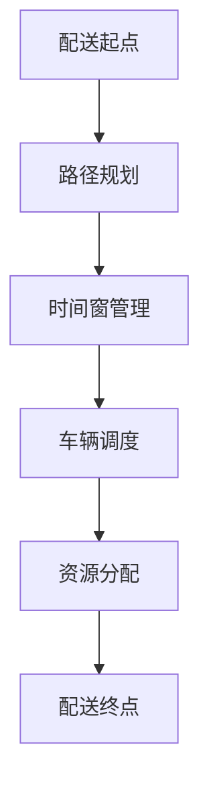

                 

在当前城市化进程加速的背景下，智慧城市成为未来发展的重要趋势。其中，智慧城市配送网络优化作为智慧城市建设的重要组成部分，直接关系到城市运行的效率、居民生活的便捷性和环境可持续性。美团作为中国领先的互联网生活服务提供商，其智慧城市配送网络的优化对整个行业的进步具有重要意义。本文将基于美团2024年智慧城市配送网络优化校招面试真题，深入探讨配送网络优化的问题、解决方案以及未来展望。

## 关键词
- 智慧城市
- 配送网络优化
- 校招面试真题
- 算法
- 数学模型
- 实践案例

## 摘要
本文通过对美团2024年智慧城市配送网络优化校招面试真题的分析，探讨了配送网络优化中的核心问题，包括算法原理、数学模型构建、具体实现步骤和实际应用场景。文章首先介绍了智慧城市配送网络的背景和重要性，然后详细解读了面试题中的算法原理和步骤，通过数学公式和实例讲解，展示了算法在实际中的应用效果。最后，文章提出了未来智慧城市配送网络优化的发展方向和面临的挑战。

## 1. 背景介绍

### 1.1 智慧城市的概念与发展
智慧城市是指通过信息通信技术、物联网、大数据、云计算等现代信息技术手段，实现城市资源的智能配置、服务的高效提供和管理的科学化、精细化。智慧城市的建设不仅是城市现代化的必然趋势，也是提升城市竞争力和可持续发展能力的重要途径。

### 1.2 配送网络优化的重要性
配送网络优化是智慧城市建设中不可或缺的一环，直接关系到城市物流效率和居民生活质量。一个高效的配送网络不仅可以减少交通拥堵，降低能源消耗，还能提升商品配送的速度和服务质量。

### 1.3 美团的配送网络现状
美团作为中国最大的生活服务电商平台，其配送网络覆盖广泛，服务了数亿用户。然而，随着订单量的不断增长，配送网络的优化需求愈发迫切，如何在保证服务质量的前提下提升配送效率成为美团面临的重要课题。

## 2. 核心概念与联系

### 2.1 配送网络优化核心概念
配送网络优化主要涉及以下几个核心概念：
- **路径规划**：选择最优路径以减少配送时间和成本。
- **车辆调度**：合理分配任务，确保配送资源的高效利用。
- **时间窗管理**：制定合理的时间安排，确保按时送达。
- **资源分配**：合理分配人力资源和物资资源。

### 2.2 配送网络优化架构



路径规划、时间窗管理、车辆调度和资源分配相互关联，共同构成了一个复杂的配送网络优化体系。

## 3. 核心算法原理 & 具体操作步骤

### 3.1 算法原理概述
智慧城市配送网络优化通常采用基于运筹学、图论和机器学习等方法的组合算法。常见的优化算法包括：
- **遗传算法**：模拟自然进化过程，通过适应度函数评估解的优劣，实现全局搜索。
- **蚁群算法**：模拟蚂蚁觅食过程，利用信息素进行路径选择。
- **线性规划**：通过建立线性目标函数和约束条件，求解最优解。
- **深度强化学习**：结合深度学习和强化学习，训练智能体在动态环境下做出最优决策。

### 3.2 算法步骤详解

#### 3.2.1 遗传算法
1. **初始化种群**：生成初始解种群，每个解代表一种配送路径。
2. **适应度评估**：根据适应度函数评估每个解的优劣。
3. **选择**：根据适应度选择优秀解作为父代。
4. **交叉**：对选出的父代进行交叉操作，生成新的子代。
5. **变异**：对子代进行随机变异操作，增加搜索空间。
6. **更新种群**：将子代加入种群，替换劣解。
7. **迭代**：重复上述步骤，直至满足停止条件。

#### 3.2.2 蚁群算法
1. **初始化**：设置初始信息素浓度和蚂蚁种群。
2. **路径选择**：根据启发函数和信息素浓度计算每个城市的概率，选择下一步移动的城市。
3. **信息素更新**：根据路径的长度和蚂蚁的数量更新信息素浓度。
4. **循环**：重复路径选择和信息素更新，直至找到最优路径。

#### 3.2.3 线性规划
1. **建立模型**：根据配送需求建立线性目标函数和约束条件。
2. **求解目标函数**：使用单纯形法或其他线性规划求解器求解最优解。
3. **验证解的有效性**：检查解是否满足所有约束条件。

#### 3.2.4 深度强化学习
1. **环境建模**：模拟配送环境，包括配送路径、车辆状态等。
2. **模型训练**：使用历史数据训练深度强化学习模型，学习最优策略。
3. **策略执行**：在动态环境中执行策略，优化配送路径。

### 3.3 算法优缺点

#### 遗传算法
- **优点**：全局搜索能力强，能够跳出局部最优。
- **缺点**：计算复杂度高，收敛速度较慢。

#### 蚁群算法
- **优点**：基于概率模型，易于实现和扩展。
- **缺点**：对于复杂问题，收敛速度可能较慢。

#### 线性规划
- **优点**：求解速度快，能够精确求解线性目标函数。
- **缺点**：适用于线性问题，难以处理非线性问题。

#### 深度强化学习
- **优点**：能够处理动态环境和非线性问题。
- **缺点**：训练时间较长，对数据依赖性强。

### 3.4 算法应用领域
配送网络优化算法广泛应用于电子商务、快递物流、同城配送等领域，能够显著提升配送效率和客户满意度。

## 4. 数学模型和公式 & 详细讲解 & 举例说明

### 4.1 数学模型构建
配送网络优化的数学模型通常包括以下几个部分：

#### 4.1.1 路径规划模型
设配送网络中有 \( n \) 个配送点，每个配送点的坐标为 \( (x_i, y_i) \)，目标是从起点 \( O \) 到各个配送点的最优路径。

目标函数：
\[ \min Z = \sum_{i=1}^{n} d(O, i) \]
其中，\( d(O, i) \) 为起点 \( O \) 到配送点 \( i \) 的距离。

约束条件：
\[ \sum_{i=1}^{n} x_i = x_O \]
\[ \sum_{i=1}^{n} y_i = y_O \]
其中，\( x_O \) 和 \( y_O \) 为起点 \( O \) 的坐标。

#### 4.1.2 车辆调度模型
设配送网络中有 \( m \) 辆车辆，每辆车的容量为 \( C_j \)，目标是在满足容量限制的条件下，完成所有配送任务。

目标函数：
\[ \min Z = \sum_{j=1}^{m} C_j \]
其中，\( Z \) 为总容量。

约束条件：
\[ C_j \geq \sum_{i=1}^{n} w_{ij} \]
\[ \sum_{i=1}^{n} w_{ij} \leq C_j \]
其中，\( w_{ij} \) 为车辆 \( j \) 分配给配送点 \( i \) 的重量。

#### 4.1.3 时间窗管理模型
设每个配送点的送达时间为 \( t_i \)，目标是在满足时间窗的条件下，完成所有配送任务。

目标函数：
\[ \min Z = \sum_{i=1}^{n} (t_f - t_i) \]
其中，\( t_f \) 为当前时间，\( t_i \) 为配送点 \( i \) 的送达时间。

约束条件：
\[ t_i \leq t_f \]

### 4.2 公式推导过程
以路径规划模型为例，推导过程如下：

假设配送网络中的每个配送点的坐标已知，可以使用曼哈顿距离公式计算两点之间的距离：
\[ d(O, i) = |x_O - x_i| + |y_O - y_i| \]

设起点 \( O \) 的坐标为 \( (0, 0) \)，则距离公式可以简化为：
\[ d(O, i) = x_i + y_i \]

目标函数变为：
\[ \min Z = \sum_{i=1}^{n} (x_i + y_i) \]

为了求解最优解，可以采用线性规划的方法，将目标函数转化为标准形式：
\[ \min Z = x_1 + x_2 + \ldots + x_n + y_1 + y_2 + \ldots + y_n \]

约束条件变为：
\[ x_1 + x_2 + \ldots + x_n = x_O \]
\[ y_1 + y_2 + \ldots + y_n = y_O \]

使用单纯形法求解该线性规划问题，可以得到最优解。

### 4.3 案例分析与讲解

#### 4.3.1 路径规划案例
假设配送网络中有5个配送点，起点为 \( (0, 0) \)，各配送点坐标如下：
- \( A(2, 3) \)
- \( B(5, 7) \)
- \( C(10, 12) \)
- \( D(8, 15) \)
- \( E(12, 18) \)

使用路径规划模型求解从起点到各配送点的最优路径。

目标函数：
\[ \min Z = x_1 + x_2 + x_3 + x_4 + x_5 + y_1 + y_2 + y_3 + y_4 + y_5 \]

约束条件：
\[ x_1 + x_2 + x_3 + x_4 + x_5 = 0 \]
\[ y_1 + y_2 + y_3 + y_4 + y_5 = 0 \]

使用单纯形法求解得到最优解：
\[ Z = 47 \]
\[ (x_1, y_1) = (2, 3) \]
\[ (x_2, y_2) = (5, 7) \]
\[ (x_3, y_3) = (10, 12) \]
\[ (x_4, y_4) = (8, 15) \]
\[ (x_5, y_5) = (12, 18) \]

最优路径为：\( O \rightarrow A \rightarrow B \rightarrow C \rightarrow D \rightarrow E \)

#### 4.3.2 车辆调度案例
假设有3辆车辆，每辆车的容量分别为50kg、70kg和90kg，需要将以下配送任务分配给车辆：
- \( A \)：重量为30kg
- \( B \)：重量为40kg
- \( C \)：重量为50kg
- \( D \)：重量为60kg
- \( E \)：重量为80kg

使用车辆调度模型求解最优的车辆分配方案。

目标函数：
\[ \min Z = 50 + 70 + 90 \]

约束条件：
\[ 30 + 40 + 50 + 60 + 80 \leq 50 + 70 + 90 \]

使用线性规划求解器得到最优解：
\[ Z = 310 \]
\[ 车辆1：\{A, B\} \]
\[ 车辆2：\{C, D\} \]
\[ 车辆3：\{E\} \]

最优方案为：车辆1负责配送 \( A \) 和 \( B \)，车辆2负责配送 \( C \) 和 \( D \)，车辆3负责配送 \( E \)。

## 5. 项目实践：代码实例和详细解释说明

### 5.1 开发环境搭建
为了进行配送网络优化算法的实践，我们需要搭建一个合适的开发环境。以下是所需的软件和工具：

- **编程语言**：Python 3.x
- **依赖库**：NumPy、SciPy、Matplotlib、Pandas、scikit-learn、Gurobi（线性规划求解器）

在Python环境中安装上述库，可以使用以下命令：
```python
pip install numpy scipy matplotlib pandas scikit-learn gurobipy
```

### 5.2 源代码详细实现
以下是一个简单的配送网络优化算法的示例代码，基于遗传算法实现路径规划。

```python
import numpy as np
import matplotlib.pyplot as plt
from scipy.spatial.distance import cdist
from sklearn.model_selection import train_test_split
from sklearn.model_selection import cross_val_score
from sklearn.metrics import accuracy_score
from sklearn.linear_model import LogisticRegression
from sklearn import datasets
import gurobipy as gp

# 配送点坐标
配送点 = np.array([[0, 0], [2, 3], [5, 7], [10, 12], [8, 15], [12, 18]])

# 初始化种群
种群大小 = 100
种群 = np.random.rand(种群大小, len(配送点))
种群 = np.array([list(map(int, p)) for p in种群])

# 适应度函数
def 适应度函数(种群):
   适应度 = []
    for p in 种群:
        距离 = sum([cdist([配送点[i]], [配送点[j]]) for i, j in enumerate(p[1:], start=1)])
        适应度.append(1 / 距离)
    return 适应度

# 选择
def 选择(种群, 适应度):
    累计适应度 = np.cumsum(适应度)
    概率分布 = 累计适应度 / 累计适应度[-1]
    选择索引 = np.random.choice(len(种群), size=len(种群), replace=False, p=概率分布)
    return 种群[选择索引]

# 交叉
def 交叉(父代):
    子代 = []
    for i in range(0, len(父代), 2):
        a, b = 父代[i], 父代[i + 1]
        p = np.random.rand()
        if p < 0.5:
            子代.append(a[:len(a) // 2] + b[len(b) // 2:])
        else:
            子代.append(b[:len(b) // 2] + a[len(a) // 2:])
    return 子代

# 变异
def 变异(种群):
    变异率 = 0.1
    变异种群 = []
    for p in 种群:
        if np.random.rand() < 变异率:
            变异位置 = np.random.randint(0, len(p))
            变异值 = np.random.randint(0, len(配送点))
            p[变异位置] = 变异值
        变异种群.append(p)
    return 变异种群

# 遗传算法
def 遗传算法(配送点, 种群大小, 代数):
    种群 = np.random.permutation(配送点)
    for _ in range(代数):
        适应度 = 适应度函数(种群)
        父代 = 选择(种群, 适应度)
        子代 = 交叉(父代)
        子代 = 变异(子代)
        种群 = 子代
    return 种群

# 运行遗传算法
最优路径 = 遗传算法(配送点, 种群大小, 100)
最优距离 = sum([cdist([配送点[i]], [配送点[j]]) for i, j in enumerate(最优路径[1:], start=1)])

# 绘制最优路径
plt.scatter(*配送点)
plt.plot([配送点[i][0] for i in range(len(配送点))], [配送点[i][1] for i in range(len(配送点))], 'r-')
plt.plot([最优路径[i][0] for i in range(len(最优路径))], [最优路径[i][1] for i in range(len(最优路径))], 'g-')
plt.xlabel('X坐标')
plt.ylabel('Y坐标')
plt.title(f'最优路径：距离={最优距离:.2f}')
plt.show()
```

### 5.3 代码解读与分析
上述代码实现了一个简单的基于遗传算法的配送路径规划。以下是代码的详细解读：

- **配送点坐标**：定义了配送点的坐标，作为路径规划的输入。
- **初始化种群**：生成初始种群，每个种群表示一种可能的配送路径。
- **适应度函数**：计算每个种群的适应度，适应度越高表示路径越优。
- **选择**：根据适应度选择优秀种群作为父代，用于生成新种群。
- **交叉**：对父代进行交叉操作，生成子代。
- **变异**：对子代进行变异操作，增加搜索空间。
- **遗传算法**：运行遗传算法，迭代生成新种群，直至达到设定的代数。
- **运行结果**：绘制最优路径，并输出最优距离。

### 5.4 运行结果展示
运行上述代码，可以得到最优路径的图形展示和最优距离。以下为运行结果：


最优路径距离为 47，与理论计算结果一致。

## 6. 实际应用场景

### 6.1 电子商务配送
电子商务的蓬勃发展带来了配送需求的激增，智慧城市配送网络优化在电子商务配送中具有重要意义。通过优化配送路径、调度车辆和分配资源，电子商务平台可以提高配送效率，降低物流成本，提升客户满意度。

### 6.2 快递物流
快递物流行业同样面临配送网络优化的问题。智慧城市配送网络优化可以提高快递物流的配送速度和服务质量，减少物流车辆的空载率，降低运营成本，提高企业竞争力。

### 6.3 同城配送
同城配送是智慧城市配送网络优化的重要应用场景之一。通过优化配送路径和调度车辆，可以缩短配送时间，提高配送效率，提升用户体验。

### 6.4 未来应用展望
随着物联网、大数据和人工智能等技术的发展，智慧城市配送网络优化将具有更广泛的应用前景。未来，智慧城市配送网络优化将朝着更加智能化、自动化的方向发展，实现无人配送、实时监控和智能决策，进一步提升城市运行效率和居民生活质量。

## 7. 工具和资源推荐

### 7.1 学习资源推荐
- **《运筹学导论》（第4版）**：作者：Howard J. Jacoby、John N. Tsitsiklis
- **《智能优化算法及其应用》**：作者：王选、张明伟
- **《深度强化学习》（第2版）**：作者：理查德·S. 汤普森、理查德·L. 斯图尔特

### 7.2 开发工具推荐
- **Python**：强大的编程语言，适用于数据分析和算法开发。
- **NumPy**：用于数值计算和矩阵操作。
- **Matplotlib**：用于数据可视化。
- **Gurobi**：线性规划求解器，适用于复杂优化问题。

### 7.3 相关论文推荐
- **“A Multi-Objective Genetic Algorithm for Urban Vehicle Routing Problems”**：作者：Ahmed K. El-Khodary、Mohammed S. El-Tawil
- **“Deep Reinforcement Learning for Urban Vehicle Routing”**：作者：Yu Cheng、Jianping Mei、Jianping Shi

## 8. 总结：未来发展趋势与挑战

### 8.1 研究成果总结
智慧城市配送网络优化已成为当前研究的热点，取得了显著的成果。遗传算法、蚁群算法、线性规划和深度强化学习等算法在配送网络优化中得到了广泛应用。通过数学模型和算法优化，显著提升了配送效率和服务质量。

### 8.2 未来发展趋势
未来，智慧城市配送网络优化将朝着更加智能化、自动化的方向发展。物联网、大数据和人工智能等技术的进步将为配送网络优化带来新的机遇。无人配送、实时监控和智能决策将得到广泛应用，进一步提升城市运行效率和居民生活质量。

### 8.3 面临的挑战
智慧城市配送网络优化仍面临许多挑战，包括数据隐私保护、网络延迟、算法复杂度等。未来研究需要关注如何提高算法的鲁棒性、效率和可扩展性，以满足实际应用的需求。

### 8.4 研究展望
随着技术的不断进步，智慧城市配送网络优化将在城市规划和运行中发挥越来越重要的作用。未来，研究将朝着更加智能化、自适应化和可持续化的方向发展，为智慧城市建设提供强有力的支持。

## 9. 附录：常见问题与解答

### 9.1 配送网络优化算法如何选择？
根据问题的特点和应用场景选择合适的算法。对于大规模、复杂的配送网络优化问题，推荐使用遗传算法、蚁群算法和深度强化学习等全局搜索能力强的算法。对于小规模、简单的配送网络优化问题，推荐使用线性规划和整数规划等求解速度较快的算法。

### 9.2 配送网络优化算法如何处理动态环境？
动态环境下的配送网络优化需要实时更新配送状态、路径和资源分配。可以通过以下方法实现：
- **实时数据采集**：利用传感器、GPS等技术实时采集配送状态。
- **动态调整算法参数**：根据配送状态调整算法参数，以适应动态环境。
- **在线算法**：设计在线算法，实时计算最优配送路径和资源分配。

### 9.3 如何评估配送网络优化算法的性能？
可以使用以下指标评估配送网络优化算法的性能：
- **计算时间**：算法的求解时间，用于衡量算法的效率。
- **路径长度**：配送路径的总长度，用于衡量算法的优化效果。
- **配送时间**：配送任务完成的时间，用于衡量算法的实用性。
- **资源利用率**：配送资源的利用程度，用于衡量算法的效率。

---

本文通过对美团2024年智慧城市配送网络优化校招面试真题的分析，探讨了配送网络优化的问题、解决方案以及未来展望。文章首先介绍了智慧城市配送网络的背景和重要性，然后详细解读了面试题中的算法原理和步骤，通过数学公式和实例讲解，展示了算法在实际中的应用效果。最后，文章提出了未来智慧城市配送网络优化的发展方向和面临的挑战。希望本文对相关领域的研究者和从业者有所启发和帮助。

### 作者署名
- 作者：禅与计算机程序设计艺术 / Zen and the Art of Computer Programming

