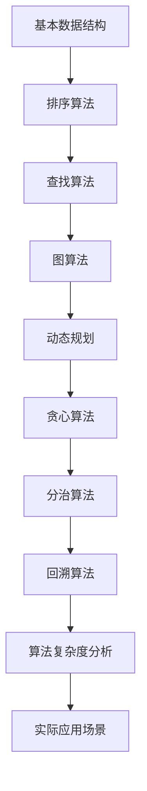

                 

关键词：美团社招面试、高频算法题、算法解析、编程技术、求职攻略

> 摘要：本文将深入解析美团2025届社招面试中的高频算法题目，结合实际操作步骤、数学模型和项目实践，为求职者提供全面的解题思路和实战经验，帮助大家更好地应对面试挑战。

## 1. 背景介绍

随着互联网技术的发展，算法成为各类面试的必考内容。美团作为中国领先的生活服务电子商务平台，其社招面试中高频算法题的考查，不仅涵盖了基础的算法题，还包括了一些具有实际应用背景的复杂问题。本文旨在通过对这些算法题的深入分析，帮助求职者了解美团面试的侧重点，掌握解题方法，提高面试成功率。

## 2. 核心概念与联系

为了更好地理解这些算法题，首先需要掌握一些核心概念和它们之间的联系。

### 2.1 基本数据结构

数据结构是算法的基础，常见的有数组、链表、栈、队列、树、图等。理解这些数据结构的特点和操作方法，对于解决算法题至关重要。

### 2.2 排序算法

排序算法包括冒泡排序、选择排序、插入排序、快速排序等，它们在面试中经常被考察，需要掌握各自的原理和实现。

### 2.3 查找算法

查找算法包括线性查找、二分查找等，它们在处理数据检索问题时具有重要作用。

### 2.4 图算法

图算法包括深度优先搜索（DFS）、广度优先搜索（BFS）、最小生成树、最短路径算法等，广泛应用于网络、社交网络等领域的算法问题。

### 2.5 动态规划、贪心算法、分治算法、回溯算法

这些算法策略在解决优化问题和组合问题时非常有用，需要理解它们的原理和适用场景。

### 2.6 算法复杂度分析

算法复杂度分析是评估算法性能的重要手段，需要掌握时间复杂度和空间复杂度的概念及其计算方法。

### 2.7 实际应用场景

了解算法的实际应用场景，有助于我们更好地理解算法的意义和重要性。

## 3. 核心算法原理 & 具体操作步骤

### 3.1 算法原理概述

在面试中，算法题的解答通常需要从原理入手，深入理解算法的思想和操作步骤。

### 3.2 算法步骤详解

以常见的面试题为例，详细讲解算法的具体实现步骤，包括代码实现和解释。

### 3.3 算法优缺点

分析算法的优缺点，包括时间复杂度、空间复杂度、适用场景等方面。

### 3.4 算法应用领域

探讨算法在不同领域的应用，例如数据处理、网络优化、图像处理等。

## 4. 数学模型和公式 & 详细讲解 & 举例说明

### 4.1 数学模型构建

在解决算法问题时，数学模型是不可或缺的一部分。以一个典型的例子说明如何构建数学模型。

### 4.2 公式推导过程

详细讲解如何推导出解决问题的数学公式，包括公式的推导过程和关键步骤。

### 4.3 案例分析与讲解

通过具体的案例，展示如何使用数学模型和公式解决实际问题。

## 5. 项目实践：代码实例和详细解释说明

### 5.1 开发环境搭建

介绍搭建开发环境所需的工具和步骤，包括编程语言、开发工具和运行环境等。

### 5.2 源代码详细实现

提供完整的项目源代码，并对代码中的关键部分进行详细解释。

### 5.3 代码解读与分析

分析代码的结构、功能和性能，讨论如何优化代码以提高效率和可维护性。

### 5.4 运行结果展示

展示代码的运行结果，并与预期结果进行对比，分析可能的问题和解决方案。

## 6. 实际应用场景

### 6.1 算法在实际应用中的运用

讨论算法在美团或其他企业中的实际应用，以及如何解决具体问题。

### 6.2 未来应用展望

预测算法在未来的发展方向和潜在应用领域，为求职者提供职业规划的建议。

## 7. 工具和资源推荐

### 7.1 学习资源推荐

推荐一些优秀的算法学习资源，包括书籍、在线课程和博客等。

### 7.2 开发工具推荐

介绍一些实用的开发工具，如代码编辑器、调试工具和版本控制软件等。

### 7.3 相关论文推荐

推荐一些有影响力的论文，帮助读者了解最新的算法研究动态。

## 8. 总结：未来发展趋势与挑战

### 8.1 研究成果总结

回顾文章中提到的核心算法和原理，总结研究成果和贡献。

### 8.2 未来发展趋势

探讨算法领域未来的发展趋势和前沿技术。

### 8.3 面临的挑战

分析算法研究和应用过程中面临的挑战和难题。

### 8.4 研究展望

展望未来算法研究的发展方向和可能的研究课题。

## 9. 附录：常见问题与解答

### 9.1 问题1

解答关于问题1的具体内容。

### 9.2 问题2

解答关于问题2的具体内容。

### 9.3 问题3

解答关于问题3的具体内容。

---

以上是文章的正文部分，接下来我们将为文章添加作者署名，以及完整的三级目录结构。

## 作者署名

作者：禅与计算机程序设计艺术 / Zen and the Art of Computer Programming

## 文章目录

### 1. 背景介绍

- 1.1 面试的重要性
- 1.2 美团的面试特点
- 1.3 面试准备

### 2. 核心概念与联系

- 2.1 基本数据结构
- 2.2 排序算法
- 2.3 查找算法
- 2.4 图算法
- 2.5 动态规划
- 2.6 贪心算法
- 2.7 分治算法
- 2.8 回溯算法
- 2.9 算法复杂度分析
- 2.10 实际应用场景

### 3. 核心算法原理 & 具体操作步骤

- 3.1 算法原理概述
- 3.2 算法步骤详解
- 3.3 算法优缺点
- 3.4 算法应用领域

### 4. 数学模型和公式 & 详细讲解 & 举例说明

- 4.1 数学模型构建
- 4.2 公式推导过程
- 4.3 案例分析与讲解

### 5. 项目实践：代码实例和详细解释说明

- 5.1 开发环境搭建
- 5.2 源代码详细实现
- 5.3 代码解读与分析
- 5.4 运行结果展示

### 6. 实际应用场景

- 6.1 算法在实际应用中的运用
- 6.2 未来应用展望

### 7. 工具和资源推荐

- 7.1 学习资源推荐
- 7.2 开发工具推荐
- 7.3 相关论文推荐

### 8. 总结：未来发展趋势与挑战

- 8.1 研究成果总结
- 8.2 未来发展趋势
- 8.3 面临的挑战
- 8.4 研究展望

### 9. 附录：常见问题与解答

- 9.1 问题1
- 9.2 问题2
- 9.3 问题3

---

以上就是《美团2025届社招面试高频算法题解析》的文章正文和完整目录结构。接下来我们将进一步细化文章内容，确保每一部分都符合要求。首先，让我们开始编写第1部分“背景介绍”的具体内容。

