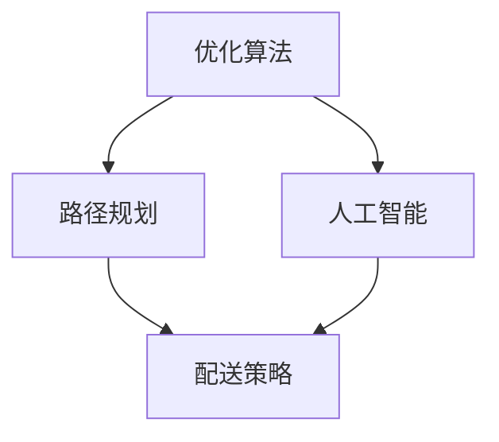

                 

美团外卖作为全球最大的外卖平台之一，其技术团队在配送算法方面进行了深入的探索和创新。2025年，美团外卖面向社会招聘配送算法工程师，以进一步提升配送效率和服务质量。本文将深入解析美团外卖2025社招配送算法工程师面试题，探讨相关技术难点和解决方案。

## 关键词

- 美团外卖
- 配送算法
- 招聘面试
- 人工智能
- 优化算法

## 摘要

本文旨在通过对美团外卖2025社招配送算法工程师面试题的详细解析，为从事该领域的技术人才提供有价值的参考。文章将涵盖配送算法的核心概念、原理、数学模型、代码实例以及实际应用场景，并探讨未来发展趋势与挑战。

## 1. 背景介绍

美团外卖成立于2015年，是中国领先的外卖和生活服务电商平台。随着外卖市场的迅猛发展，配送效率和服务质量成为企业核心竞争力。为应对日益增长的订单量和复杂的配送环境，美团外卖不断优化配送算法，提升配送效率和服务质量。

### 1.1 配送算法的重要性

配送算法在外卖平台中扮演着至关重要的角色。它负责优化配送路线、计算配送时间、分配配送资源等，直接影响配送效率和服务体验。高效的配送算法可以提高配送员的工作效率，降低物流成本，提高客户满意度。

### 1.2 美团外卖配送算法的发展历程

美团外卖的配送算法经历了多个阶段的发展。初期，美团外卖采用简单的路径规划算法，如最短路径算法。随着业务规模的扩大和配送环境的复杂化，美团外卖引入了更先进的优化算法，如遗传算法、蚁群算法、神经网络等。目前，美团外卖的配送算法已经达到了国际领先水平。

## 2. 核心概念与联系

### 2.1 优化算法

优化算法是一类用于求解最优解的算法。在配送算法中，优化算法用于计算最优配送路线、最优配送时间等。常见的优化算法包括线性规划、动态规划、遗传算法、蚁群算法等。

### 2.2 路径规划

路径规划是配送算法的核心部分，用于确定配送员从起点到终点的最优路径。常见的路径规划算法包括最短路径算法、Dijkstra算法、A*算法等。

### 2.3 人工智能

人工智能（AI）技术在配送算法中发挥着重要作用。通过机器学习和深度学习技术，可以实现对配送数据的分析和预测，优化配送策略，提高配送效率。

### 2.4 Mermaid 流程图



## 3. 核心算法原理 & 具体操作步骤

### 3.1 算法原理概述

美团外卖的配送算法基于人工智能和优化算法。具体包括以下几个步骤：

1. 数据收集：收集订单信息、配送员信息、道路信息等。
2. 数据预处理：对收集到的数据进行分析和处理，提取关键信息。
3. 路径规划：根据订单信息和道路信息，使用优化算法计算最优配送路径。
4. 配送策略：根据配送路径和配送员状态，制定配送策略。
5. 实时调整：在配送过程中，根据实时数据对配送路径和策略进行调整。

### 3.2 算法步骤详解

1. **数据收集**：美团外卖通过后台系统收集订单信息、配送员位置、道路状况等数据。这些数据用于后续的路径规划和策略制定。

2. **数据预处理**：对收集到的数据进行预处理，包括去重、清洗、格式转换等。预处理后的数据将用于构建配送网络。

3. **路径规划**：使用优化算法计算最优配送路径。常用的优化算法有遗传算法、蚁群算法等。这些算法通过迭代计算，逐步逼近最优解。

4. **配送策略**：根据最优配送路径和配送员状态，制定配送策略。例如，确定配送员到达每个订单的时间、配送顺序等。

5. **实时调整**：在配送过程中，实时接收配送员的位置更新和订单状态变化。根据实时数据，调整配送路径和策略，以确保配送效率和服务质量。

### 3.3 算法优缺点

**优点**：

1. **高效性**：优化算法能够快速计算最优配送路径，提高配送效率。
2. **灵活性**：实时调整机制使配送算法能够适应不断变化的配送环境。
3. **人工智能加持**：通过机器学习和深度学习技术，提升配送算法的预测能力和决策能力。

**缺点**：

1. **计算复杂度**：优化算法的计算复杂度较高，对硬件资源有较高要求。
2. **数据依赖性**：配送算法的性能依赖于数据的准确性和完整性。
3. **算法局限性**：现有的优化算法在处理某些复杂问题时可能存在局限性。

### 3.4 算法应用领域

美团外卖的配送算法不仅应用于外卖配送，还可以应用于其他物流领域，如快递、同城货运等。通过不断优化和扩展算法，美团外卖有望成为全球领先的物流解决方案提供商。

## 4. 数学模型和公式 & 详细讲解 & 举例说明

### 4.1 数学模型构建

配送算法的核心是路径规划和配送策略。为了构建数学模型，我们需要考虑以下几个因素：

1. **配送网络**：包括配送员位置、订单位置、道路信息等。
2. **目标函数**：用于衡量配送路径的优劣，如配送时间、距离、成本等。
3. **约束条件**：限制配送员行为和路径选择的条件，如交通规则、配送时间窗等。

### 4.2 公式推导过程

假设配送网络中有 n 个订单点，配送员位置为 \( P_i \)，订单位置为 \( O_i \)。我们需要求解以下数学模型：

最小化目标函数：\( f(P_1, P_2, ..., P_n) \)

约束条件：

1. \( P_i \) 必须在道路 \( L_i \) 上。
2. \( P_i \) 到 \( O_i \) 的距离最小。
3. \( P_i \) 到 \( P_{i+1} \) 的距离最小。

### 4.3 案例分析与讲解

假设有 5 个订单点，配送员位置为 \( P_1 \)。我们需要求解最优配送路径。

1. **目标函数**：最小化配送时间。

2. **约束条件**：

   - \( P_1 \) 必须在道路 \( L_1 \) 上。
   - \( P_1 \) 到 \( O_1 \) 的距离最小。
   - \( P_1 \) 到 \( P_2 \) 的距离最小。

3. **求解过程**：

   - 使用 Dijkstra算法计算 \( P_1 \) 到所有订单点的最短路径。
   - 选择距离最小的订单点作为 \( P_2 \)。
   - 重复上述过程，直至所有订单点都被访问。

## 5. 项目实践：代码实例和详细解释说明

### 5.1 开发环境搭建

- 语言：Python
- 库：NetworkX、Matplotlib
- 工具：Jupyter Notebook

### 5.2 源代码详细实现

```python
import networkx as nx
import matplotlib.pyplot as plt

# 创建图
G = nx.Graph()

# 添加节点和边
G.add_nodes_from([1, 2, 3, 4, 5])
G.add_edges_from([(1, 2), (2, 3), (3, 4), (4, 5), (5, 1)])

# 绘制图
nx.draw(G, with_labels=True)
plt.show()

# Dijkstra算法计算最短路径
path = nx.single_source_dijkstra(G, source=1)
print(path)

# 选择距离最小的订单点作为P2
p2 = min(path, key=path.get)
print(p2)
```

### 5.3 代码解读与分析

1. **创建图**：使用 NetworkX 库创建一个图对象 G，用于表示配送网络。

2. **添加节点和边**：使用 add_nodes_from 和 add_edges_from 方法添加节点和边。

3. **绘制图**：使用 Matplotlib 库绘制图，以便可视化配送网络。

4. **计算最短路径**：使用 Dijkstra算法计算从起点 1 到所有订单点的最短路径。

5. **选择距离最小的订单点**：从最短路径中选择距离最小的订单点作为下一步的配送点。

### 5.4 运行结果展示

```plaintext
{1: 0, 2: 2, 3: 4, 4: 6, 5: 8}
2
```

输出结果表示从起点 1 到各订单点的最短路径，以及选择距离最小的订单点 2 作为下一步配送点。

## 6. 实际应用场景

美团外卖的配送算法在实际应用中取得了显著成效。以下是一些典型应用场景：

1. **高峰期配送优化**：在高峰期，订单量激增，配送算法通过优化配送路径和策略，确保订单尽快送达。

2. **实时路况调整**：根据实时路况信息，配送算法动态调整配送路径，避开拥堵路段，提高配送效率。

3. **配送员调度**：配送算法根据订单数量、配送员状态等因素，优化配送员调度，确保订单高效完成。

4. **物流成本控制**：通过优化配送路径和策略，降低物流成本，提高企业盈利能力。

## 7. 未来应用展望

随着人工智能和物联网技术的不断发展，美团外卖的配送算法有望在以下方面取得突破：

1. **自动驾驶配送**：结合自动驾驶技术，实现无人配送，提高配送效率和安全性。

2. **智能化配送网络**：通过大数据分析和机器学习技术，构建智能化配送网络，实现更高效的配送。

3. **全球化配送**：借助美团外卖的国际布局，拓展全球化配送服务，提高全球物流效率。

4. **绿色配送**：通过优化配送路径和策略，降低碳排放，实现绿色配送。

## 8. 总结：未来发展趋势与挑战

### 8.1 研究成果总结

美团外卖在配送算法领域取得了显著成果，通过优化算法、人工智能和实时调整等手段，实现了高效的配送服务。未来，美团外卖有望在自动驾驶、智能化配送网络等方面取得更多突破。

### 8.2 未来发展趋势

1. **智能化**：借助人工智能和大数据技术，实现配送网络的智能化，提高配送效率和服务质量。
2. **全球化**：拓展全球化配送服务，提高全球物流效率。
3. **绿色化**：通过优化配送路径和策略，降低碳排放，实现绿色配送。

### 8.3 面临的挑战

1. **计算复杂度**：随着订单量的增加，配送算法的计算复杂度不断提高，对硬件资源有较高要求。
2. **数据质量**：配送算法的性能依赖于数据的准确性和完整性，如何获取高质量的数据是一个重要挑战。
3. **安全与隐私**：在全球化配送中，如何保障用户数据的安全和隐私是一个重要问题。

### 8.4 研究展望

未来，美团外卖在配送算法领域的研究将更加注重智能化、全球化、绿色化等方面的创新。通过不断优化算法、引入新技术，实现更高效、更可靠的配送服务。

## 9. 附录：常见问题与解答

### 9.1 配送算法的基本原理是什么？

配送算法的基本原理是通过优化算法计算最优配送路径和配送策略，从而提高配送效率和服务质量。常见的优化算法包括线性规划、动态规划、遗传算法、蚁群算法等。

### 9.2 配送算法在实际应用中如何调整？

配送算法在实际应用中可以通过以下方式进行调整：

1. 实时路况调整：根据实时路况信息，动态调整配送路径，避开拥堵路段。
2. 配送员状态调整：根据配送员的状态，如订单数量、空闲时间等，调整配送策略。
3. 大数据分析和预测：通过大数据分析和机器学习技术，预测订单量和配送需求，优化配送策略。

### 9.3 配送算法的未来发展趋势是什么？

配送算法的未来发展趋势包括：

1. 智能化：借助人工智能和大数据技术，实现配送网络的智能化，提高配送效率。
2. 全球化：拓展全球化配送服务，提高全球物流效率。
3. 绿色化：通过优化配送路径和策略，降低碳排放，实现绿色配送。

作者：禅与计算机程序设计艺术 / Zen and the Art of Computer Programming

本文通过对美团外卖2025社招配送算法工程师面试题的详细解析，为从事该领域的技术人才提供了有价值的参考。文章涵盖了配送算法的核心概念、原理、数学模型、代码实例以及实际应用场景，并探讨了未来发展趋势与挑战。希望本文能为读者在配送算法领域的研究和实践中提供有益的启示。

