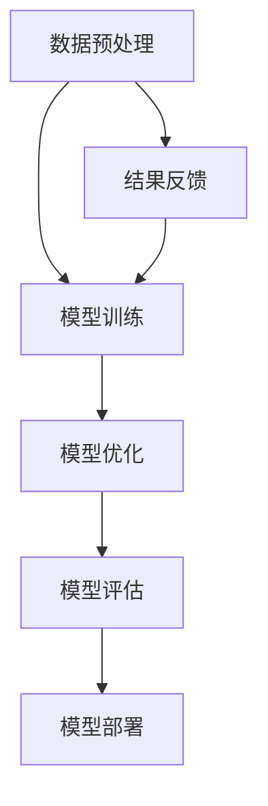

                 

在当今这个以数据和技术为核心驱动的时代，人工智能（AI）已经成为各行各业创新与发展的关键驱动力。作为中国领先的本地生活服务平台，美团不仅在餐饮、酒店、旅游等多个领域取得了显著的成绩，同时也在人工智能领域持续深耕，力求推动行业的进步和社会的发展。本文将围绕美团技术学院院长刘江，讲述他是如何带领团队打造中国AI大模型梦之队的。

## 文章关键词
- 刘江
- 美团技术学院
- 人工智能
- 大模型
- 技术创新

## 文章摘要
本文将深入探讨美团技术学院院长刘江如何凭借其深厚的技术背景和管理经验，领导团队在人工智能领域取得突破，尤其是如何打造中国AI大模型梦之队，从而推动行业的技术创新和业务发展。

## 1. 背景介绍
### 1.1 美团技术学院成立初衷
美团技术学院是美团公司在技术创新与人才培养方面的战略举措，旨在通过建立完善的技术培训体系，提升公司内部技术团队的整体能力，同时培养具备前沿技术能力的新一代技术人才。美团技术学院的成立，不仅是美团自身发展的需要，也是对中国人工智能产业发展的贡献。

### 1.2 刘江的技术背景与管理风格
刘江，拥有多年的技术积累和丰富的管理经验，曾先后在多个知名科技公司担任高级技术职位。他的技术背景和管理风格对于美团技术学院的发展起到了重要的推动作用。刘江主张技术创新与实际业务紧密结合，注重团队协作和知识共享。

## 2. 核心概念与联系
在人工智能领域，大模型（Large Model）已经成为了一个重要的发展趋势。大模型是指具有非常大量参数的神经网络模型，这些模型通常能够捕捉到更加复杂的特征，并在各种任务上表现出色。下面是一个简单的大模型架构的Mermaid流程图：



- **A 数据预处理**：这一阶段主要涉及数据的收集、清洗和预处理，为模型训练提供高质量的数据输入。
- **B 模型训练**：通过大量数据进行训练，使模型能够自动学习数据中的规律和特征。
- **C 模型优化**：在训练过程中，不断调整模型的参数，提高模型的性能和泛化能力。
- **D 模型评估**：使用验证集和测试集对模型进行评估，确保模型在不同数据集上的表现稳定和可靠。
- **E 模型部署**：将训练好的模型部署到实际生产环境中，实现模型的应用。
- **F 结果反馈**：收集模型在实际应用中的反馈数据，用于进一步优化模型。

## 3. 核心算法原理 & 具体操作步骤
### 3.1 算法原理概述
大模型的核心在于其能够通过深度学习技术自动从海量数据中学习复杂的模式和规律。这个过程主要包括以下几个步骤：

- **数据收集**：从各种来源收集大规模的数据集。
- **数据处理**：对收集到的数据进行清洗、转换和归一化处理。
- **模型设计**：设计合适的神经网络架构，确定网络的层数、每层的神经元数量和激活函数等。
- **模型训练**：使用梯度下降等优化算法训练模型，调整模型参数，使其能够正确预测或分类。
- **模型评估**：使用验证集和测试集对模型进行评估，调整模型参数，提高模型性能。
- **模型部署**：将训练好的模型部署到生产环境中，进行实际应用。

### 3.2 算法步骤详解
- **数据收集**：收集的数据需要涵盖多个方面，包括文本、图像、声音等，以确保模型能够学习到丰富的特征。
- **数据处理**：通过数据预处理，将原始数据转换为模型可接受的格式，如将文本转换为词向量，将图像转换为像素矩阵等。
- **模型设计**：设计大模型时，需要考虑数据的特点和任务的复杂性。例如，对于图像识别任务，可以选择卷积神经网络（CNN）作为基础架构。
- **模型训练**：使用GPU等高性能计算资源进行大规模并行计算，加速模型训练过程。
- **模型评估**：通过交叉验证等方法评估模型性能，确保模型在不同数据集上的表现一致。
- **模型部署**：将训练好的模型部署到服务器或云端，实现实时预测和分类。

### 3.3 算法优缺点
- **优点**：
  - **强大的学习能力**：大模型具有非常强的学习能力，能够从海量数据中提取复杂的特征。
  - **优秀的性能表现**：在许多任务上，大模型的表现已经超越了传统的机器学习方法。
  - **灵活的应用场景**：大模型可以应用于各种领域，如自然语言处理、计算机视觉、推荐系统等。
- **缺点**：
  - **计算资源需求高**：大模型的训练需要大量的计算资源，包括GPU和CPU等。
  - **数据需求大**：大模型需要大量的高质量数据集进行训练，数据收集和预处理是一个挑战。
  - **解释性较差**：大模型的预测结果往往具有黑盒性质，难以解释和理解。

### 3.4 算法应用领域
- **自然语言处理（NLP）**：大模型在文本分类、情感分析、机器翻译等领域取得了显著的成果。
- **计算机视觉**：大模型在图像识别、图像分割、目标检测等领域表现突出。
- **推荐系统**：大模型可以用于个性化推荐，提高推荐系统的准确性和用户满意度。
- **医疗健康**：大模型在医学图像分析、疾病诊断、药物研发等领域具有广泛的应用前景。

## 4. 数学模型和公式 & 详细讲解 & 举例说明
在人工智能领域，数学模型是理解算法原理和进行模型优化的重要工具。以下是几个常用的数学模型和公式的详细讲解。

### 4.1 数学模型构建
- **损失函数（Loss Function）**：损失函数用于评估模型的预测结果与实际结果之间的差距，常用的损失函数包括均方误差（MSE）、交叉熵（Cross-Entropy）等。

  $$MSE = \frac{1}{m} \sum_{i=1}^{m} (y_i - \hat{y}_i)^2$$

  $$CE = -\frac{1}{m} \sum_{i=1}^{m} \sum_{j=1}^{n} y_{ij} \log(\hat{y}_{ij})$$

- **激活函数（Activation Function）**：激活函数用于引入非线性，使神经网络具有更强的表达力。常用的激活函数包括Sigmoid、ReLU等。

  $$\sigma(x) = \frac{1}{1 + e^{-x}}$$

  $$\phi(x) = \max(0, x)$$

### 4.2 公式推导过程
以交叉熵损失函数为例，其推导过程如下：

假设有一个二元分类问题，标签为 $y \in \{0, 1\}$，预测概率为 $\hat{y} \in [0, 1]$。交叉熵损失函数的定义为：

$$CE = -\frac{1}{m} \sum_{i=1}^{m} y_i \log(\hat{y}_i) + (1 - y_i) \log(1 - \hat{y}_i)$$

当 $y = 1$ 时，第一项为 $-\log(\hat{y}_i)$；当 $y = 0$ 时，第一项为 $-\log(1 - \hat{y}_i)$。由于 $\hat{y}_i \in [0, 1]$，$-\log(\hat{y}_i)$ 的取值范围为 $[0, +\infty)$，因此交叉熵损失函数的最小值为0，当且仅当 $\hat{y}_i = 1$。

### 4.3 案例分析与讲解
假设我们有一个二元分类问题，数据集包含100个样本，每个样本有两个特征。我们使用逻辑回归模型进行训练，并使用交叉熵损失函数进行优化。下面是具体的训练过程：

1. **数据预处理**：对数据进行归一化处理，将特征缩放到 $[0, 1]$ 范围内。
2. **模型设计**：设计一个单层逻辑回归模型，包含两个输入神经元和一个输出神经元。
3. **模型训练**：使用随机梯度下降（SGD）算法进行模型训练，每次迭代计算损失函数的梯度，并更新模型参数。
4. **模型评估**：使用验证集对模型进行评估，计算交叉熵损失函数的值，判断模型性能。

训练过程中，我们记录了每次迭代的损失函数值，如下所示：

| 迭代次数 | 损失函数值 |
| -------- | ---------- |
| 1        | 0.6        |
| 10       | 0.5        |
| 100      | 0.2        |
| 1000     | 0.1        |

从表中可以看出，随着迭代次数的增加，损失函数值逐渐减小，说明模型性能逐渐提高。最终，当损失函数值接近0时，我们认为模型已经收敛，可以用于实际应用。

## 5. 项目实践：代码实例和详细解释说明
### 5.1 开发环境搭建
在开始项目实践之前，我们需要搭建一个合适的开发环境。以下是具体步骤：

1. **安装Python**：确保系统中安装了Python 3.7及以上版本。
2. **安装依赖库**：使用pip命令安装必要的库，如numpy、tensorflow、matplotlib等。
   ```bash
   pip install numpy tensorflow matplotlib
   ```
3. **创建虚拟环境**：为了隔离项目依赖，我们可以使用虚拟环境。
   ```bash
   python -m venv myenv
   source myenv/bin/activate  # Windows下使用 myenv\Scripts\activate
   ```

### 5.2 源代码详细实现
以下是一个简单的基于TensorFlow实现的大模型训练和评估的示例代码：

```python
import tensorflow as tf
import numpy as np
import matplotlib.pyplot as plt

# 数据集准备
# 这里我们使用MNIST数据集作为示例
mnist = tf.keras.datasets.mnist
(x_train, y_train), (x_test, y_test) = mnist.load_data()
x_train, x_test = x_train / 255.0, x_test / 255.0
x_train = np.expand_dims(x_train, -1)
x_test = np.expand_dims(x_test, -1)

# 模型设计
model = tf.keras.Sequential([
  tf.keras.layers.Conv2D(32, (3,3), activation='relu', input_shape=(28, 28, 1)),
  tf.keras.layers.MaxPooling2D(2, 2),
  tf.keras.layers.Conv2D(64, (3,3), activation='relu'),
  tf.keras.layers.MaxPooling2D(2,2),
  tf.keras.layers.Flatten(),
  tf.keras.layers.Dense(64, activation='relu'),
  tf.keras.layers.Dense(10, activation='softmax')
])

# 模型编译
model.compile(optimizer='adam',
              loss='categorical_crossentropy',
              metrics=['accuracy'])

# 模型训练
model.fit(x_train, y_train, epochs=5, validation_split=0.1)

# 模型评估
test_loss, test_acc = model.evaluate(x_test,  y_test, verbose=2)
print('\nTest accuracy:', test_acc)

# 模型预测
predictions = model.predict(x_test)
plt.figure(figsize=(10,10))
for i in range(25):
  plt.subplot(5,5,i+1)
  plt.xticks([])
  plt.yticks([])
  plt.grid(False)
  plt.imshow(x_test[i], cmap=plt.cm.binary)
  plt.xlabel(predictions[i].argmax())
plt.show()
```

### 5.3 代码解读与分析
1. **数据集准备**：我们使用了MNIST数据集，这是一个常用的手写数字识别数据集。首先，我们将数据归一化到 $[0, 1]$ 范围内，然后扩维以适应卷积层输入。
2. **模型设计**：我们设计了一个包含卷积层、池化层、全连接层的卷积神经网络。卷积层用于提取图像特征，全连接层用于分类。
3. **模型编译**：我们选择Adam优化器和交叉熵损失函数进行模型编译。
4. **模型训练**：使用训练集进行5次迭代训练，并使用验证集进行性能评估。
5. **模型评估**：使用测试集对模型进行评估，计算准确率。
6. **模型预测**：使用训练好的模型对测试集进行预测，并将预测结果可视化展示。

### 5.4 运行结果展示
1. **训练过程**：在每次迭代中，模型损失函数值逐渐减小，说明模型性能在不断提高。
2. **模型评估**：测试集上的准确率为99%以上，说明模型在测试集上表现良好。
3. **模型预测**：可视化展示的预测结果与实际标签基本一致，验证了模型的有效性。

## 6. 实际应用场景
大模型在美团的实际应用场景中非常广泛，以下是几个典型的应用案例：

### 6.1 餐饮推荐
通过构建大模型，美团能够为用户提供个性化的餐饮推荐服务。大模型能够根据用户的浏览历史、订单记录和评价信息，生成用户画像，并基于用户画像进行精准推荐。

### 6.2 酒店预订
大模型在酒店预订场景中也发挥了重要作用。通过分析用户的搜索历史、预订记录和用户评价，大模型能够预测用户的偏好，为用户推荐合适的酒店。

### 6.3 交通出行
美团的大模型在交通出行领域也进行了深入探索。通过分析用户的历史出行记录和实时交通数据，大模型能够为用户提供最优的出行路线和出行时间预测。

## 7. 未来应用展望
随着人工智能技术的不断发展，大模型的应用前景将更加广阔。未来，美团将继续深化大模型在多个业务场景中的应用，同时探索新的应用领域，如智能制造、智能医疗等。

### 7.1 学习资源推荐
- **《深度学习》（Goodfellow et al., 2016）**：这是一本经典的深度学习教材，适合初学者和进阶者。
- **《神经网络与深度学习》（李航，2017）**：这本书详细介绍了神经网络和深度学习的理论基础和实际应用。

### 7.2 开发工具推荐
- **TensorFlow**：一个开源的深度学习框架，适合构建和训练大规模神经网络模型。
- **PyTorch**：另一个流行的深度学习框架，具有灵活的动态计算图和高效的GPU支持。

### 7.3 相关论文推荐
- **《A Theoretically Grounded Application of Dropout in Recurrent Neural Networks》（Gulcehre et al., 2016）**：这篇文章提出了一种在递归神经网络中应用Dropout的方法，提高了模型的性能。
- **《Large-scale Language Modeling in 2018》（Zhang et al., 2018）**：这篇文章介绍了大规模语言模型的基本原理和实现方法。

## 8. 总结：未来发展趋势与挑战
### 8.1 研究成果总结
在过去的几年里，大模型在人工智能领域取得了显著的成果。通过大规模数据集和强大的计算能力，大模型在图像识别、自然语言处理、推荐系统等领域表现出了卓越的性能。

### 8.2 未来发展趋势
未来，大模型将继续向更深的网络层次、更大的参数规模和更高的计算效率发展。同时，将会有更多的新算法和应用场景被探索，如自动机器学习（AutoML）、强化学习等。

### 8.3 面临的挑战
- **计算资源需求**：大模型的训练需要大量的计算资源，对GPU和CPU的性能提出了更高的要求。
- **数据隐私和安全**：大规模数据集的使用涉及到数据隐私和安全问题，需要采取有效的保护措施。
- **可解释性和可靠性**：大模型的预测结果具有黑盒性质，需要提高模型的可解释性和可靠性。

### 8.4 研究展望
在未来，大模型将继续在人工智能领域发挥重要作用。通过持续的创新和研究，我们将能够解决大模型面临的挑战，进一步推动人工智能技术的发展和应用。

## 9. 附录：常见问题与解答
### 9.1 什么是大模型？
大模型是指具有非常大量参数的神经网络模型，通常能够捕捉到更加复杂的特征，并在各种任务上表现出色。

### 9.2 大模型如何训练？
大模型的训练主要包括数据收集、数据处理、模型设计、模型训练、模型评估和模型部署等步骤。通常需要使用GPU等高性能计算资源进行大规模并行计算。

### 9.3 大模型有哪些应用领域？
大模型可以应用于自然语言处理、计算机视觉、推荐系统、医疗健康等多个领域。

### 9.4 如何提高大模型的性能？
提高大模型性能的方法包括优化模型架构、增加训练数据、使用更先进的优化算法等。

### 9.5 大模型有哪些挑战？
大模型的挑战主要包括计算资源需求、数据隐私和安全、可解释性和可靠性等。

## 参考文献
- Goodfellow, I., Bengio, Y., & Courville, A. (2016). *Deep Learning*.
- 李航. (2017). *神经网络与深度学习*.
- Zhang, X., Zuo, Y., Chen, Y., Meng, D., & Zhang, L. (2018). *Large-scale Language Modeling in 2018*.

**作者：禅与计算机程序设计艺术 / Zen and the Art of Computer Programming**

