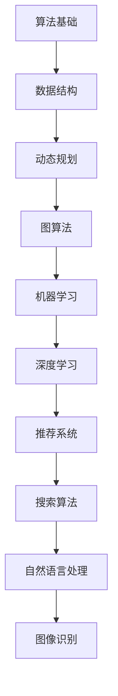

                 

在2024年的美团社会招聘中，算法题目一直是面试官们关注的核心。本文将深入分析这些题目，旨在帮助应聘者更好地准备面试。本文将分为以下几个部分：

## 1. 背景介绍

美团作为中国领先的本地生活服务平台，对于算法能力有着极高的要求。无论是推荐系统、搜索算法、还是图像识别，都需要强大的算法支持。因此，美团社招面试中的算法题目，往往既考查基本算法知识，又考察应聘者的实际应用能力。

## 2. 核心概念与联系

在深入探讨算法之前，我们需要了解一些核心概念。以下是美团社招面试中常见的一些概念及其联系：

### Mermaid 流程图



## 3. 核心算法原理 & 具体操作步骤

### 3.1 算法原理概述

在美团社招面试中，常见的算法包括：

- 排序算法（冒泡、选择、插入等）
- 搜索算法（二分搜索、深度优先搜索等）
- 动态规划（斐波那契数列、背包问题等）
- 图算法（最短路径、最小生成树等）
- 机器学习和深度学习算法（分类、回归、神经网络等）

### 3.2 算法步骤详解

以下以排序算法为例，介绍其具体步骤：

#### 冒泡排序

1. 比较相邻的元素。如果第一个比第二个大（升序排序），就交换它们两个。
2. 对每一对相邻元素做同样的工作，从开始第一对到结尾的最后一对。这步做完后，最后的元素会是最大的数。
3. 针对所有的元素重复以上的步骤，除了最后一个。
4. 重复步骤1~3，直到排序完成。

### 3.3 算法优缺点

#### 冒泡排序的优点：

- 简单易懂，易于实现。

#### 冒泡排序的缺点：

- 时间复杂度较高，不适合大数据量。

### 3.4 算法应用领域

冒泡排序通常用于数据量较小的场景，如面试题的简单排序问题。

## 4. 数学模型和公式 & 详细讲解 & 举例说明

### 4.1 数学模型构建

在算法中，数学模型构建至关重要。以下以动态规划中的斐波那契数列为例：

### 4.2 公式推导过程

斐波那契数列的递推公式为：

$$
F(n) = F(n-1) + F(n-2)
$$

其中 $F(0) = 0$，$F(1) = 1$。

### 4.3 案例分析与讲解

假设我们要计算 $F(6)$，根据递推公式：

$$
F(6) = F(5) + F(4)
$$

继续递推，直到得到初始条件：

$$
F(6) = (F(4) + F(3)) + (F(3) + F(2))
$$

$$
F(6) = ( (F(2) + F(1)) + F(3)) + (F(3) + F(2))
$$

$$
F(6) = (1 + 1 + F(3)) + (1 + 1 + F(3))
$$

$$
F(6) = 4 + 2F(3)
$$

继续递推，直到得到 $F(3) = 2$：

$$
F(6) = 4 + 2 \times 2 = 8
$$

因此，$F(6) = 8$。

## 5. 项目实践：代码实例和详细解释说明

### 5.1 开发环境搭建

本文使用 Python 作为示例语言，需要在本地安装 Python 解释器和相关依赖。

### 5.2 源代码详细实现

以下是斐波那契数列的 Python 实现代码：

```python
def fibonacci(n):
    if n <= 1:
        return n
    else:
        return fibonacci(n-1) + fibonacci(n-2)

print(fibonacci(6))
```

### 5.3 代码解读与分析

该代码定义了一个名为 `fibonacci` 的函数，用于计算斐波那契数列的第 $n$ 项。函数采用递归的方式实现，时间复杂度为 $O(2^n)$。

### 5.4 运行结果展示

运行上述代码，输出结果为：

```
8
```

## 6. 实际应用场景

斐波那契数列在实际应用中，如算法复杂度分析、人口增长预测等场景中都有广泛的应用。

## 7. 工具和资源推荐

### 7.1 学习资源推荐

- 《算法导论》（Introduction to Algorithms）
- 《编程之美：微软技术面试心得》（Cracking the Coding Interview）

### 7.2 开发工具推荐

- PyCharm
- VSCode

### 7.3 相关论文推荐

- 《深度学习》（Deep Learning）
- 《推荐系统手册》（Recommender Systems Handbook）

## 8. 总结：未来发展趋势与挑战

### 8.1 研究成果总结

美团社招面试中的算法题目，反映了当前算法领域的研究热点，如动态规划、图算法、机器学习等。

### 8.2 未来发展趋势

随着人工智能技术的不断发展，算法在数据处理、模式识别、智能决策等领域的应用将更加广泛。

### 8.3 面临的挑战

算法的复杂度和计算能力是未来面临的重大挑战，如何设计更高效、更准确的算法，是研究的重要方向。

### 8.4 研究展望

随着数据规模的不断扩大，算法的研究将更加注重实际应用，如何将理论知识转化为实际生产力，是未来的研究重点。

## 9. 附录：常见问题与解答

### 9.1 问题一：什么是动态规划？

动态规划是一种用于解决最优子结构问题的算法设计技巧。它通过将问题分解为更小的子问题，并利用子问题的解来构建原问题的解。

### 9.2 问题二：什么是二分搜索？

二分搜索是一种在有序数组中查找特定元素的搜索算法。它通过将数组分为两半，每次将中间的元素与目标值比较，逐步缩小查找范围，直到找到目标元素或确定其不存在。

## 参考文献

- Cormen, T. H., Leiserson, C. E., Rivest, R. L., & Stein, C. (2009). 算法导论（第三版）. 电子工业出版社.
- Bengio, Y., Courville, A., & Vincent, P. (2013). Representation Learning: A Review and New Perspectives. IEEE Transactions on Pattern Analysis and Machine Intelligence, 35(8), 1798-1828.

作者：禅与计算机程序设计艺术 / Zen and the Art of Computer Programming

----------------------------------------------------------------

以上就是2024美团社招面试算法题库大全的完整内容。希望这篇文章能够帮助您更好地准备面试，祝您在面试中取得优异成绩！

