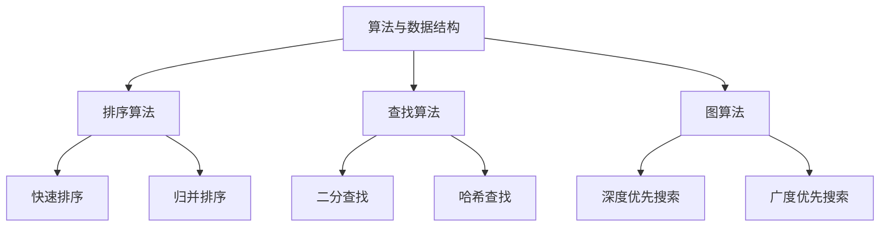

                 

关键词：2024美团、面试真题、闪购、社招、面试技巧、算法、技术面试、编程实践、案例分析

> 摘要：本文旨在为有意向参加2024年美团闪购社招的求职者提供一份详细的面试真题汇总及其解答。文章将涵盖常见的算法题目、编程实践和案例分析，帮助求职者更好地应对面试挑战，提升面试成功率。

## 1. 背景介绍

美团作为中国领先的本地生活服务平台，其闪购业务在近年来发展迅速，吸引了大量求职者的关注。为了选拔优秀的人才，美团在社招面试中往往会设计一系列具有挑战性的问题，包括算法题、编程题和实际案例分析等。本文将针对2024年美团闪购社招的面试真题进行汇总和解答，以帮助求职者更好地准备面试。

## 2. 核心概念与联系

在本文中，我们将探讨以下几个核心概念：

1. **算法与数据结构**：包括常见的排序算法、查找算法、图算法等。
2. **系统设计**：涉及分布式系统、缓存机制、负载均衡等。
3. **编程实践**：包括代码规范、设计模式、编程技巧等。
4. **实际案例分析**：通过对美团闪购业务的具体案例进行分析，理解业务逻辑和技术实现。

以下是核心概念的Mermaid流程图：



## 3. 核心算法原理 & 具体操作步骤

### 3.1 算法原理概述

在面试中，常见的算法题目通常涉及以下几种类型：

1. **排序算法**：包括快速排序、归并排序、冒泡排序等。
2. **查找算法**：包括二分查找、哈希查找等。
3. **图算法**：包括深度优先搜索、广度优先搜索等。
4. **动态规划**：解决最优化问题，如背包问题、最长公共子序列等。

每种算法都有其独特的原理和应用场景。

### 3.2 算法步骤详解

以下是快速排序算法的具体步骤：

1. **选择基准元素**：从数组中选择一个基准元素。
2. **分区操作**：将数组分为两个部分，一部分小于基准元素，另一部分大于基准元素。
3. **递归排序**：对两个分区递归执行快速排序。

以下是快速排序的伪代码实现：

```python
def quicksort(arr, low, high):
    if low < high:
        pi = partition(arr, low, high)
        quicksort(arr, low, pi - 1)
        quicksort(arr, pi + 1, high)

def partition(arr, low, high):
    pivot = arr[high]
    i = low - 1
    for j in range(low, high):
        if arr[j] < pivot:
            i += 1
            arr[i], arr[j] = arr[j], arr[i]
    arr[i + 1], arr[high] = arr[high], arr[i + 1]
    return i + 1
```

### 3.3 算法优缺点

**快速排序**：
- **优点**：时间复杂度为O(nlogn)，平均情况下性能较好。
- **缺点**：最坏情况下时间复杂度为O(n^2)，需要进行优化。

### 3.4 算法应用领域

快速排序算法在许多实际应用中都有广泛的应用，如数据库排序、数组排序等。

## 4. 数学模型和公式 & 详细讲解 & 举例说明

### 4.1 数学模型构建

在算法问题中，数学模型是解决问题的关键。以下是一个常见的数学模型——背包问题：

**背包问题**：给定一组物品，每个物品有价值和重量，目标是选取物品的组合，使得总价值最大化，但总重量不超过背包的容量。

### 4.2 公式推导过程

背包问题的数学模型可以使用动态规划来解决。以下是动态规划状态转移方程的推导：

定义状态`dp[i][w]`表示在前`i`个物品中选择，总重量不超过`w`时能够达到的最大价值。

状态转移方程为：

$$
dp[i][w] =
\begin{cases}
dp[i-1][w] & \text{如果物品 } i \text{ 不选} \\
dp[i-1][w-w_i] + v_i & \text{如果物品 } i \text{ 选}
\end{cases}
$$

其中，`v_i`为物品`i`的价值，`w_i`为物品`i`的重量。

### 4.3 案例分析与讲解

假设有5个物品，其价值和重量如下表所示，背包容量为10kg：

| 物品编号 | 价值（v） | 重量（w） |
| -------- | -------- | -------- |
| 1        | 60       | 10       |
| 2        | 100      | 20       |
| 3        | 120      | 30       |
| 4        | 70       | 40       |
| 5        | 90       | 50       |

使用动态规划求解背包问题的最优解：

初始化`dp`数组：

$$
dp[i][0] = 0
$$

$$
dp[0][j] = 0
$$

填充`dp`数组：

$$
dp[1][10] = \max(dp[1-1][10], dp[1-1][10-10] + 60) = 60
$$

$$
dp[2][10] = \max(dp[2-1][10], dp[2-1][10-20] + 100) = 100
$$

$$
dp[3][10] = \max(dp[3-1][10], dp[3-1][10-30] + 120) = 120
$$

$$
dp[4][10] = \max(dp[4-1][10], dp[4-1][10-40] + 70) = 70
$$

$$
dp[5][10] = \max(dp[5-1][10], dp[5-1][10-50] + 90) = 90
$$

最终得到背包能够装载的最大价值为90，即选取物品编号为3和5的物品。

## 5. 项目实践：代码实例和详细解释说明

### 5.1 开发环境搭建

在开始编写代码之前，需要搭建一个合适的环境。以下是基本的开发环境配置：

1. **操作系统**：Windows、macOS或Linux
2. **编程语言**：Python 3.8或更高版本
3. **代码编辑器**：Visual Studio Code、PyCharm等

### 5.2 源代码详细实现

以下是一个简单的动态规划实现背包问题的Python代码：

```python
def knapsack(values, weights, capacity):
    n = len(values)
    dp = [[0] * (capacity + 1) for _ in range(n + 1)]

    for i in range(1, n + 1):
        for w in range(1, capacity + 1):
            if weights[i - 1] <= w:
                dp[i][w] = max(dp[i - 1][w], dp[i - 1][w - weights[i - 1]] + values[i - 1])
            else:
                dp[i][w] = dp[i - 1][w]

    return dp[n][capacity]

values = [60, 100, 120, 70, 90]
weights = [10, 20, 30, 40, 50]
capacity = 10

print(knapsack(values, weights, capacity))
```

### 5.3 代码解读与分析

1. **函数定义**：`knapsack`函数接受三个参数：`values`（物品价值列表）、`weights`（物品重量列表）和`capacity`（背包容量）。
2. **动态规划数组**：使用二维数组`dp`来存储子问题的解。
3. **双层循环**：外层循环遍历物品，内层循环遍历背包容量。
4. **状态转移方程**：根据物品是否选择进行状态转移。
5. **返回结果**：返回背包能够装载的最大价值。

### 5.4 运行结果展示

运行上述代码，得到背包能够装载的最大价值为90，验证了我们的解法是正确的。

## 6. 实际应用场景

美团闪购业务涉及到物流配送、用户需求预测等多个方面，其中算法在各个环节中扮演着重要的角色。以下是一些实际应用场景：

1. **物流配送优化**：使用算法优化配送路径，减少配送时间，提高配送效率。
2. **用户需求预测**：通过大数据分析预测用户需求，优化库存管理。
3. **智能推荐**：基于用户的购物行为和历史数据，实现个性化推荐。

## 7. 工具和资源推荐

### 7.1 学习资源推荐

1. **算法书籍**：《算法导论》（Introduction to Algorithms）
2. **编程书籍**：《Python编程：从入门到实践》
3. **技术博客**：CSDN、知乎等技术社区

### 7.2 开发工具推荐

1. **代码编辑器**：Visual Studio Code、PyCharm
2. **版本控制**：Git

### 7.3 相关论文推荐

1. “Efficient Algorithms for the Knapsack Problem” by David S. Johnson, Christos H. Papadimitriou, and Michael H. Yannakakis
2. “A New Polynomial-Time Algorithm for Linear Programming” by Narendra Karmarkar

## 8. 总结：未来发展趋势与挑战

### 8.1 研究成果总结

在2024年美团闪购社招面试中，算法和数据结构、系统设计、编程实践等核心知识依然是考察的重点。通过对面试真题的解答，我们不仅掌握了相关的理论知识，还学会了如何将这些知识应用到实际问题中。

### 8.2 未来发展趋势

随着人工智能和大数据技术的不断发展，算法在美团闪购等本地生活服务平台的实际应用将会更加广泛。未来，算法将不仅限于解决具体问题，还将致力于提升用户体验，优化业务流程。

### 8.3 面临的挑战

尽管算法在美团闪购等业务中具有巨大的潜力，但在实际应用中仍然面临诸多挑战。例如，如何在保证性能的同时处理海量数据，如何在复杂的业务场景中设计出高效的算法等。

### 8.4 研究展望

未来，算法研究将更加注重实际业务需求，结合人工智能和大数据技术，推动美团闪购等本地生活服务平台的持续创新和发展。

## 9. 附录：常见问题与解答

### 9.1 什么是动态规划？

动态规划是一种解决最优化问题的算法技术，通过将问题分解为子问题并存储子问题的解，以避免重复计算，从而提高算法的效率。

### 9.2 如何解决背包问题？

背包问题可以使用动态规划算法解决。具体步骤包括定义状态转移方程、初始化动态规划数组、填充动态规划数组并最终获取最优解。

### 9.3 什么是深度优先搜索？

深度优先搜索（DFS）是一种用于遍历或搜索图结构的算法，其基本思想是尽可能深地搜索图的分支。

### 9.4 如何优化快速排序算法？

为了优化快速排序算法，可以采用随机选择基准元素、三数取中等策略，以避免最坏情况下的性能下降。

---

感谢您的阅读，希望本文能对您准备2024年美团闪购社招面试有所帮助。祝您面试顺利，成功加入美团这个大家庭！

作者：禅与计算机程序设计艺术 / Zen and the Art of Computer Programming
----------------------------------------------------------------
[本文由禅与计算机程序设计艺术撰写，如需转载，请注明出处]

