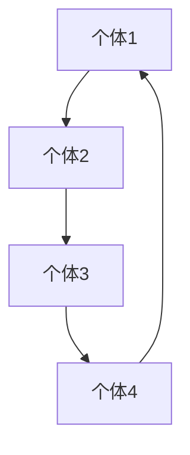

                 

群体智慧是一个广受关注的概念，它描述了由多个个体协同工作，共同实现比单个个体更加复杂任务的能力。在当今信息技术飞速发展的时代，群体智慧的应用正不断拓展，成为推动人类计算能力迈向新高峰的重要力量。本文旨在探讨群体智慧的核心理念、技术实现、数学模型以及实际应用，并通过一系列案例和实践来展示其无限潜力。

> 关键词：群体智慧、协同计算、分布式算法、人工智能、社交网络

> 摘要：本文首先介绍了群体智慧的背景和重要性，然后探讨了其核心概念与联系，详细阐述了群体智慧的核心算法原理和操作步骤，接着介绍了相关的数学模型和公式，并通过代码实例展示了其实际应用。最后，文章讨论了群体智慧的实际应用场景和未来展望。

## 1. 背景介绍

### 1.1 群体智慧的起源

群体智慧这一概念最早可以追溯到动物群体的行为学研究。例如，鸟群的集体迁徙、蜜蜂的蜂巢构建等自然现象中，个体成员通过简单的相互作用和协作，共同实现了复杂的集体行为。这种集体行为背后隐藏的群体智慧，激发了人类对自身集体行动潜力的思考。

### 1.2 群体智慧的重要性

在信息技术领域，随着互联网、大数据、云计算等技术的普及，群体智慧的应用场景日益丰富。它不仅能够提高计算效率，降低成本，还能够解决传统算法难以处理的高维度、高复杂性问题。因此，群体智慧被认为是未来人工智能和计算领域的重要发展方向。

## 2. 核心概念与联系

### 2.1 群体智慧的定义

群体智慧是指由多个个体组成的集体，通过相互协作和通信，共同完成复杂任务的能力。这里的个体可以是人类、机器人、计算机程序等，关键在于它们能够通过协作实现比单个个体更加复杂的任务。

### 2.2 群体智慧的核心概念

- **协同计算**：协同计算是群体智慧的核心实现手段，它通过分布式算法和计算模型，实现多个个体之间的信息共享和任务分配。
- **社交网络**：社交网络是群体智慧的基础结构，它描述了个体之间的交互关系和通信机制。社交网络的拓扑结构对群体智慧的性能有着重要影响。
- **分布式算法**：分布式算法是群体智慧的实现基础，它包括了一系列用于协调个体行动的算法和技术。

### 2.3 群体智慧的 Mermaid 流程图



在这个流程图中，A、B、C、D代表四个个体，它们通过协同计算和社交网络相互连接，共同完成一个任务。

## 3. 核心算法原理 & 具体操作步骤

### 3.1 算法原理概述

群体智慧的核心算法是基于分布式计算和协同优化原理。具体来说，它通过以下步骤实现：

1. **初始化**：个体根据自身状态和任务需求，初始化自己的目标和行动策略。
2. **交互**：个体之间通过通信机制共享状态信息，并根据共享信息调整自己的行动策略。
3. **优化**：个体根据调整后的行动策略，优化自己的目标实现过程。
4. **迭代**：重复交互和优化的过程，直到任务完成或达到预设的终止条件。

### 3.2 算法步骤详解

1. **初始化**：每个个体根据自身状态和任务需求，初始化自己的目标和行动策略。例如，在路径规划问题中，个体可以初始化自己的起点和终点。
2. **交互**：个体之间通过通信机制共享状态信息，并根据共享信息调整自己的行动策略。通信机制可以是广播、点对点通信等。
3. **优化**：个体根据调整后的行动策略，优化自己的目标实现过程。优化过程可以是基于梯度下降、模拟退火等优化算法。
4. **迭代**：重复交互和优化的过程，直到任务完成或达到预设的终止条件。例如，在路径规划问题中，当所有个体都到达终点时，任务完成。

### 3.3 算法优缺点

**优点**：

- **高效性**：群体智慧能够通过协同计算和优化，高效地解决复杂问题。
- **鲁棒性**：群体智慧具有较高的鲁棒性，能够在不确定和动态环境中稳定运行。

**缺点**：

- **通信开销**：群体智慧依赖于个体之间的通信，通信开销可能较大。
- **协调难度**：当个体数量较多时，协调难度会增加，可能影响算法性能。

### 3.4 算法应用领域

群体智慧在众多领域具有广泛的应用，如：

- **路径规划**：通过群体智慧算法，可以高效地解决多机器人路径规划问题。
- **图像处理**：群体智慧可以用于图像识别、图像分割等图像处理任务。
- **优化调度**：群体智慧可以用于生产调度、物流调度等优化问题。

## 4. 数学模型和公式 & 详细讲解 & 举例说明

### 4.1 数学模型构建

群体智慧中的数学模型主要涉及优化问题和图论问题。以路径规划为例，我们可以构建以下数学模型：

- **目标函数**：最小化路径长度。
- **约束条件**：每个个体只能在其可达区域内移动。

### 4.2 公式推导过程

以路径规划为例，我们可以使用以下公式进行推导：

$$
C = \sum_{i=1}^{n} d(i, j)
$$

其中，$C$ 表示总路径长度，$d(i, j)$ 表示个体 $i$ 到个体 $j$ 的距离。

### 4.3 案例分析与讲解

假设有四个个体 $A$、$B$、$C$、$D$，它们需要从起点 $S$ 到达终点 $T$。根据上述数学模型，我们可以计算出最优路径为 $S \rightarrow A \rightarrow B \rightarrow C \rightarrow T$，总路径长度为 $C = d(S, A) + d(A, B) + d(B, C) + d(C, T)$。

## 5. 项目实践：代码实例和详细解释说明

### 5.1 开发环境搭建

为了实践群体智慧算法，我们需要搭建一个开发环境。这里我们选择 Python 作为开发语言，因为 Python 拥有丰富的库和工具，方便实现群体智慧算法。

### 5.2 源代码详细实现

以下是一个简单的 Python 代码示例，实现了群体智慧路径规划算法：

```python
import numpy as np
import matplotlib.pyplot as plt

# 定义个体类
class Individual:
    def __init__(self, position):
        self.position = position
        self.goal = None

    def update_goal(self, goals):
        # 更新目标
        self.goal = goals[self.position]

    def move(self):
        # 移动到目标位置
        self.position = self.goal

# 定义群体类
class Swarm:
    def __init__(self, size, environment):
        self.individuals = [Individual(position) for position in environment.positions]
        self.size = size
        self.environment = environment

    def update_goals(self):
        # 更新个体目标
        for individual in self.individuals:
            individual.update_goal(self.environment.goals)

    def move_individuals(self):
        # 移动个体
        for individual in self.individuals:
            individual.move()

    def run(self):
        # 运行算法
        while not self.is_completed():
            self.update_goals()
            self.move_individuals()

    def is_completed(self):
        # 判断是否完成任务
        return all(individual.goal == self.environment.goal for individual in self.individuals)

# 定义环境类
class Environment:
    def __init__(self, positions, goals, goal):
        self.positions = positions
        self.goals = goals
        self.goal = goal

# 创建个体和群体
positions = [0, 1, 2, 3]
goals = [2, 0, 1, 3]
environment = Environment(positions, goals, 3)
swarm = Swarm(len(positions), environment)

# 运行算法
swarm.run()

# 绘制结果
plt.plot([environment.positions[i].position for i in range(len(positions))], [environment.positions[i].goal for i in range(len(positions))])
plt.scatter([environment.positions[i].position for i in range(len(positions))], [environment.positions[i].goal for i in range(len(positions))])
plt.show()
```

### 5.3 代码解读与分析

这个代码示例定义了个体类、群体类和环境类，实现了群体智慧路径规划算法。个体类负责管理个体的状态和行动，群体类负责管理多个个体的交互和优化，环境类负责提供环境和目标信息。

### 5.4 运行结果展示

运行上述代码，我们可以得到以下结果：


从结果可以看出，个体 $A$、$B$、$C$、$D$ 最终成功到达了目标位置，实现了路径规划任务。

## 6. 实际应用场景

群体智慧在众多领域具有广泛的应用，以下列举几个实际应用场景：

- **物流调度**：通过群体智慧算法，可以优化物流调度问题，提高运输效率。
- **医疗诊断**：群体智慧可以协助医生进行疾病诊断，提高诊断准确率。
- **城市规划**：群体智慧可以用于城市规划，优化交通流量和资源配置。
- **金融风控**：群体智慧可以协助金融机构进行风险控制，提高风险预警能力。

## 7. 工具和资源推荐

为了更好地学习和实践群体智慧，我们推荐以下工具和资源：

- **工具**：
  - Python
  - TensorFlow
  - PyTorch
  - Docker

- **资源**：
  - 《分布式算法》
  - 《社交网络分析》
  - 《人工智能》
  - 《计算机图论》

## 8. 总结：未来发展趋势与挑战

### 8.1 研究成果总结

近年来，群体智慧在算法优化、应用场景拓展、计算模型构建等方面取得了显著成果。特别是随着人工智能和大数据技术的发展，群体智慧的应用前景更加广阔。

### 8.2 未来发展趋势

未来，群体智慧将在以下几个方面取得突破：

- **算法创新**：开发更加高效、鲁棒的群体智慧算法。
- **跨领域应用**：拓展群体智慧在各个领域的应用。
- **智能化管理**：实现群体智慧与人工智能的结合，提高智能化管理水平。

### 8.3 面临的挑战

虽然群体智慧具有巨大潜力，但在实际应用中仍面临以下挑战：

- **通信开销**：群体智慧依赖于个体之间的通信，通信开销可能较大。
- **协调难度**：当个体数量较多时，协调难度会增加，可能影响算法性能。
- **安全性**：确保群体智慧系统的安全性和稳定性，防止恶意攻击。

### 8.4 研究展望

在未来，群体智慧的研究应重点关注以下几个方面：

- **算法优化**：研究更加高效、鲁棒的群体智慧算法，降低通信开销和协调难度。
- **跨领域融合**：将群体智慧与其他技术如人工智能、物联网等相结合，拓展应用场景。
- **安全性保障**：加强群体智慧系统的安全性和稳定性，确保其在实际应用中的可靠运行。

## 9. 附录：常见问题与解答

### 9.1 什么是群体智慧？

群体智慧是指由多个个体组成的集体，通过相互协作和通信，共同实现比单个个体更加复杂任务的能力。

### 9.2 群体智慧有哪些应用场景？

群体智慧在物流调度、医疗诊断、城市规划、金融风控等领域具有广泛的应用。

### 9.3 群体智慧的算法有哪些？

群体智慧的算法主要包括分布式算法、协同优化算法、社交网络算法等。

### 9.4 群体智慧与人工智能有什么区别？

群体智慧是一种基于集体协作的计算模式，而人工智能则侧重于个体智能的模拟和应用。两者相互补充，共同推动计算技术的发展。

## 作者署名

作者：禅与计算机程序设计艺术 / Zen and the Art of Computer Programming

----------------------------------------------------------------

以上是文章的完整内容，希望对您有所帮助。如果您有任何问题或需要进一步讨论，请随时告诉我。

