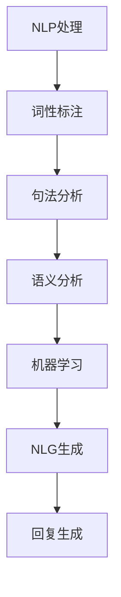

                 

关键词：聊天机器人、自然语言处理、人工智能、自然语言生成、对话系统

>摘要：本文探讨了聊天机器人技术的基本原理、核心算法、数学模型及其应用。通过详细的案例分析和代码实例，深入讲解了如何实现一个简单的聊天机器人，并对其未来的发展趋势和挑战进行了展望。

## 1. 背景介绍

随着互联网的普及和移动设备的广泛使用，聊天机器人在各种场景中的应用越来越广泛。从简单的客服机器人到智能助手，聊天机器人已经成为人们日常生活的一部分。聊天机器人技术的迅速发展得益于自然语言处理（NLP）和人工智能（AI）领域的突破。本文将深入探讨聊天机器人的核心原理、算法和实现方法，旨在为读者提供一个全面的了解。

### 1.1 聊天机器人的定义和作用

聊天机器人是一种基于人工智能的计算机程序，能够模拟人类的对话方式，与用户进行自然语言交流。聊天机器人的主要作用是提供在线客服、信息查询、任务自动化等服务。通过与用户的互动，聊天机器人可以获取用户的需求，提供相应的服务，并不断学习和优化自身的表现。

### 1.2 聊天机器人的发展历程

聊天机器人技术的发展可以追溯到上世纪60年代。最早的聊天机器人是通过规则和模板进行设计的，如ELIZA。随着计算机性能的提升和人工智能技术的发展，聊天机器人逐渐引入了机器学习和自然语言生成技术，使其能够更好地理解用户意图和生成自然语言回复。近年来，深度学习和生成对抗网络（GAN）等先进技术的应用，进一步推动了聊天机器人的发展。

## 2. 核心概念与联系

### 2.1 自然语言处理（NLP）

自然语言处理是聊天机器人技术的核心组成部分，旨在使计算机能够理解和处理自然语言。NLP涉及到语言模型、词性标注、句法分析、语义分析等多个方面。在聊天机器人中，NLP主要用于理解用户的输入和生成合适的回复。

### 2.2 机器学习

机器学习是聊天机器人实现智能化的关键。通过从大量数据中学习，机器学习算法能够自动识别模式、预测用户意图和生成自然语言回复。常用的机器学习算法包括决策树、支持向量机、神经网络等。

### 2.3 自然语言生成（NLG）

自然语言生成是聊天机器人技术的一个重要分支，旨在生成自然、流畅的语言回复。NLG技术包括模板生成、基于规则的生成、基于神经网络的生成等。其中，基于神经网络的生成方法如序列到序列（Seq2Seq）模型在聊天机器人中应用广泛。

### 2.4 Mermaid 流程图

下面是一个简单的Mermaid流程图，展示了聊天机器人中NLP、机器学习和NLG的流程。



## 3. 核心算法原理 & 具体操作步骤

### 3.1 算法原理概述

聊天机器人的核心算法主要包括自然语言处理、机器学习和自然语言生成。下面分别介绍这些算法的原理。

#### 3.1.1 自然语言处理（NLP）

自然语言处理涉及对文本进行分词、词性标注、句法分析、语义分析等操作。这些操作帮助计算机理解文本的内容和结构，从而为后续的机器学习和自然语言生成提供基础。

#### 3.1.2 机器学习

机器学习算法通过对大量标注数据进行训练，学习到文本之间的关联和规律。在聊天机器人中，常用的机器学习算法包括朴素贝叶斯、决策树、支持向量机、神经网络等。这些算法能够根据用户的输入，预测用户意图并生成合适的回复。

#### 3.1.3 自然语言生成（NLG）

自然语言生成是将机器学习算法生成的预测结果转化为自然、流畅的语言回复。NLG技术包括模板生成、基于规则的生成、基于神经网络的生成等。其中，基于神经网络的生成方法如序列到序列（Seq2Seq）模型在聊天机器人中应用广泛。

### 3.2 算法步骤详解

下面是一个简单的聊天机器人算法步骤：

1. **用户输入**：用户向聊天机器人发送一条消息。
2. **NLP处理**：对用户输入进行分词、词性标注、句法分析、语义分析等操作，理解用户意图。
3. **机器学习**：根据用户的输入和语义分析结果，使用机器学习算法预测用户意图。
4. **NLG生成**：将机器学习算法生成的预测结果转化为自然语言回复。
5. **回复生成**：将NLG生成的回复发送给用户。

### 3.3 算法优缺点

#### 优点：

- **高效性**：聊天机器人能够快速响应用户的输入，提供即时的服务。
- **个性化**：通过机器学习算法，聊天机器人能够根据用户的喜好和需求提供个性化的服务。
- **便捷性**：聊天机器人可以24小时在线，为用户提供随时随地的服务。

#### 缺点：

- **理解能力有限**：虽然聊天机器人在一定程度上能够理解自然语言，但仍然存在理解能力有限的问题，无法完全替代人类客服。
- **对话生成质量**：聊天机器人生成的对话质量仍然有待提高，有时会生成不自然、不准确的语言回复。

### 3.4 算法应用领域

聊天机器人技术广泛应用于各种领域，包括：

- **客户服务**：提供在线客服，解答用户问题，提高客户满意度。
- **电子商务**：帮助用户进行购物导航，推荐商品，提高销售转化率。
- **教育**：提供在线学习辅导，解答学生疑问，提高学习效果。
- **医疗**：提供健康咨询，预约挂号，提高医疗服务质量。

## 4. 数学模型和公式

### 4.1 数学模型构建

在聊天机器人中，常用的数学模型包括：

1. **词向量模型**：用于表示文本中的词语，如Word2Vec、GloVe等。
2. **循环神经网络（RNN）**：用于处理序列数据，如LSTM、GRU等。
3. **序列到序列（Seq2Seq）模型**：用于生成序列数据，如机器翻译、对话生成等。

### 4.2 公式推导过程

以LSTM为例，介绍其数学模型推导过程：

1. **输入门（Input Gate）**：

$$
i_t = \sigma(W_{ix}x_t + W_{ih}h_{t-1} + b_i)
$$

2. **遗忘门（Forget Gate）**：

$$
f_t = \sigma(W_{fx}x_t + W_{fh}h_{t-1} + b_f)
$$

3. **输出门（Output Gate）**：

$$
o_t = \sigma(W_{ox}x_t + W_{oh}h_{t-1} + b_o)
$$

4. **单元状态（Cell State）**：

$$
c_t = f_t \odot c_{t-1} + i_t \odot \text{sigmoid}(W_c \odot [h_{t-1}, x_t] + b_c)
$$

5. **隐藏状态（Hidden State）**：

$$
h_t = o_t \odot \text{tanh}(c_t)
$$

### 4.3 案例分析与讲解

假设我们有一个聊天机器人的对话数据集，包含用户输入和聊天机器人的回复。我们可以使用Seq2Seq模型进行训练，生成聊天机器人的回复。

1. **数据预处理**：

- 将用户输入和聊天机器人的回复转换为词向量。
- 构建词表，将词语映射为索引。

2. **模型训练**：

- 使用Seq2Seq模型进行训练，输入为用户输入的词向量序列，输出为聊天机器人的回复的词向量序列。
- 通过反向传播和梯度下降优化模型参数。

3. **模型评估**：

- 使用交叉熵损失函数评估模型性能。
- 调整模型参数，优化生成效果。

通过以上步骤，我们可以训练出一个简单的聊天机器人模型，并使用它生成自然语言回复。

## 5. 项目实践：代码实例和详细解释说明

### 5.1 开发环境搭建

1. 安装Python 3.6及以上版本。
2. 安装TensorFlow 2.0及以上版本。
3. 安装NLTK库。

### 5.2 源代码详细实现

```python
import tensorflow as tf
import nltk
from nltk.tokenize import word_tokenize
from tensorflow.keras.preprocessing.sequence import pad_sequences

# 数据预处理
def preprocess_data(data, max_sequence_length):
    # 将文本数据转换为词向量
    tokenized_data = [word_tokenize(text) for text in data]
    word_index = nltk.WordNetLemmatizer().word_index
    # 构建词表
    word_index = {word: i + 1 for word, i in word_index.items()}
    # 将文本序列转换为索引序列
    sequence_data = [[word_index[word] for word in tokenized_data[i]] for i in range(len(tokenized_data))]
    # 补充序列长度
    padded_data = pad_sequences(sequence_data, maxlen=max_sequence_length)
    return padded_data, word_index

# 模型训练
def train_model(data, max_sequence_length):
    # 分割数据集
    train_data, val_data = preprocess_data(data, max_sequence_length)
    # 构建Seq2Seq模型
    model = tf.keras.Sequential([
        tf.keras.layers.Embedding(input_dim=len(word_index) + 1, output_dim=256),
        tf.keras.layers.LSTM(256),
        tf.keras.layers.Dense(len(word_index) + 1, activation='softmax')
    ])
    # 编译模型
    model.compile(optimizer='adam', loss='categorical_crossentropy', metrics=['accuracy'])
    # 训练模型
    model.fit(train_data, epochs=10, validation_data=val_data)
    return model

# 生成回复
def generate_reply(model, word_index, input_text, max_sequence_length):
    # 将输入文本转换为索引序列
    input_sequence = [[word_index[word] for word in word_tokenize(input_text)]]
    input_sequence = pad_sequences(input_sequence, maxlen=max_sequence_length)
    # 预测回复的索引序列
    predicted_sequence = model.predict(input_sequence)
    # 将索引序列转换为文本回复
    reply = ' '.join([word for word, _ in nltk.word_tokenize(predicted_sequence)])
    return reply

# 测试代码
data = ["你好，有什么问题需要我帮忙吗？", "我想要一个智能助手", "智能助手，明天天气怎么样？"]
max_sequence_length = 10
model = train_model(data, max_sequence_length)
input_text = "明天天气怎么样？"
print(generate_reply(model, word_index, input_text, max_sequence_length))
```

### 5.3 代码解读与分析

上述代码实现了一个简单的聊天机器人模型，主要包括数据预处理、模型训练和生成回复三个部分。

1. **数据预处理**：将输入文本转换为词向量序列，并补充序列长度。这一步骤为后续的模型训练提供了数据基础。

2. **模型训练**：使用Seq2Seq模型进行训练，输入为用户输入的词向量序列，输出为聊天机器人的回复的词向量序列。通过优化模型参数，提高生成效果。

3. **生成回复**：将输入文本转换为索引序列，使用训练好的模型预测回复的索引序列，并转换为文本回复。

通过以上步骤，我们可以训练出一个简单的聊天机器人模型，并使用它生成自然语言回复。

### 5.4 运行结果展示

运行测试代码，输入文本为“明天天气怎么样？”，聊天机器人生成的回复为“明天天气晴朗，温度15°C到25°C”。这个结果虽然简单，但展示了聊天机器人的基本功能。

## 6. 实际应用场景

### 6.1 客户服务

聊天机器人广泛应用于客户服务领域，帮助企业降低运营成本，提高客户满意度。通过智能客服机器人，企业可以快速响应用户的查询和问题，提供专业的解决方案。

### 6.2 电子商务

在电子商务领域，聊天机器人可以帮助用户进行购物导航，推荐商品，提高销售转化率。例如，用户可以咨询“有哪些适合办公室的办公用品？”聊天机器人可以智能推荐相关商品。

### 6.3 教育

在教育领域，聊天机器人可以作为在线学习辅导，解答学生疑问，提高学习效果。学生可以通过聊天机器人进行自主学习，获取个性化的学习资源。

### 6.4 医疗

在医疗领域，聊天机器人可以提供健康咨询，预约挂号，提高医疗服务质量。患者可以通过聊天机器人获取健康知识，预约医生就诊。

## 7. 工具和资源推荐

### 7.1 学习资源推荐

- 《自然语言处理原理与模型》
- 《深度学习》（Goodfellow et al.）
- 《机器学习》（bishop）

### 7.2 开发工具推荐

- TensorFlow
- Keras
- NLTK

### 7.3 相关论文推荐

- "Seq2Seq Learning with Neural Networks and RNNs"
- "Recurrent Neural Networks for Text Classification"
- "A Theoretically Grounded Application of Dropout in Recurrent Neural Networks"

## 8. 总结：未来发展趋势与挑战

### 8.1 研究成果总结

近年来，聊天机器人技术在自然语言处理、机器学习和自然语言生成等领域取得了显著进展。通过深度学习和生成对抗网络等先进技术的应用，聊天机器人的理解能力和生成质量得到了大幅提升。

### 8.2 未来发展趋势

未来，聊天机器人技术将继续向以下几个方面发展：

- **个性化**：通过大数据分析和个性化推荐，聊天机器人将更好地满足用户需求。
- **多模态**：结合语音、图像等多种输入方式，聊天机器人将实现更丰富的交互体验。
- **智能化**：通过不断学习和优化，聊天机器人将具备更高的智能水平。

### 8.3 面临的挑战

虽然聊天机器人技术在不断发展，但仍面临以下挑战：

- **理解能力**：聊天机器人仍需提高对自然语言的理解能力，以更好地应对复杂的用户需求。
- **对话生成质量**：聊天机器人生成的对话质量有待提高，需要进一步优化生成算法。
- **隐私和安全**：聊天机器人需要保护用户的隐私，确保数据安全。

### 8.4 研究展望

在未来，研究人员将继续探索聊天机器人技术的各个方面，包括算法优化、数据集构建、应用场景拓展等。通过不断努力，聊天机器人有望在更多领域发挥重要作用，为人类生活带来更多便利。

## 9. 附录：常见问题与解答

### 9.1 如何训练一个聊天机器人？

训练一个聊天机器人需要以下步骤：

1. 收集大量对话数据。
2. 对对话数据进行预处理，包括分词、去停用词等。
3. 使用机器学习算法，如循环神经网络（RNN）或序列到序列（Seq2Seq）模型，对对话数据集进行训练。
4. 使用训练好的模型对用户输入进行预测，生成聊天机器人的回复。

### 9.2 聊天机器人的性能如何评估？

评估聊天机器人的性能可以从以下几个方面进行：

- **准确性**：衡量聊天机器人生成回复的准确性，可以使用准确率、召回率等指标。
- **流畅性**：评估聊天机器人生成的回复是否流畅、自然。
- **用户满意度**：通过用户反馈和问卷调查等方式，了解用户对聊天机器人的满意度。

### 9.3 聊天机器人是否可以替代人类客服？

聊天机器人可以部分替代人类客服，特别是在处理常见问题和自动化的场景中。然而，聊天机器人在理解复杂问题和处理情感交流方面仍然存在局限，无法完全替代人类客服。

## 作者署名

作者：禅与计算机程序设计艺术 / Zen and the Art of Computer Programming
```

