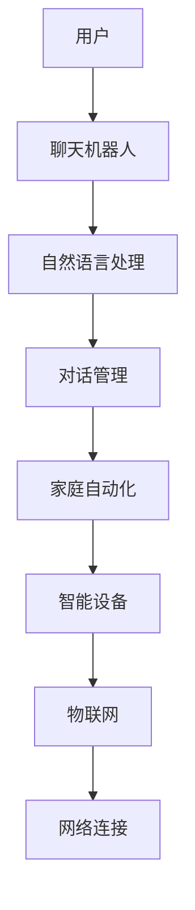

                 

在当今快速发展的技术时代，聊天机器人已成为我们日常生活中不可或缺的一部分。无论是通过智能手机应用程序、社交媒体平台，还是智能音响设备，聊天机器人正逐步改变我们的互动方式。本文将探讨如何通过聊天机器人自动化来提高家庭自动化的水平，从而创造一个更加智能、高效和便捷的家庭环境。

> 关键词：聊天机器人、家庭自动化、智能家居、人工智能、自然语言处理

## 摘要

本文旨在探讨如何利用聊天机器人自动化技术提升家庭自动化的水平。首先，我们将介绍聊天机器人和家庭自动化的基本概念，接着分析其相互关系和融合的潜力。随后，我们将详细讨论核心算法原理、数学模型、项目实践，并探讨聊天机器人在家庭自动化中的实际应用场景。最后，我们将展望聊天机器人自动化在家庭自动化领域的发展趋势和面临的挑战。

## 1. 背景介绍

### 聊天机器人的发展

聊天机器人（Chatbot）是一种模拟人类对话的软件程序，能够通过文字或语音与用户进行交互。最早期的聊天机器人如ELIZA（1966年）和PARRY（1972年）在自然语言处理领域取得了开创性的进展。随着技术的进步，聊天机器人的功能日益完善，应用范围也从简单的信息查询扩展到客服支持、在线购物、教育等多个领域。

近年来，人工智能（AI）和自然语言处理（NLP）技术的发展使得聊天机器人的交互体验大大提升。深度学习算法的应用使得聊天机器人能够更好地理解自然语言，处理复杂的对话场景。此外，对话管理技术的进步使得聊天机器人能够更自然地与用户互动，提供个性化的服务。

### 家庭自动化的兴起

家庭自动化（Home Automation）是指通过智能设备和网络连接实现家庭设备自动化控制和管理的系统。家庭自动化的历史可以追溯到20世纪70年代，但随着物联网（IoT）技术的发展，家庭自动化逐渐成为一种普及的现象。智能恒温器、智能照明、智能安防系统、智能家电等设备的普及，使得家庭自动化变得日益便捷和实用。

家庭自动化的核心优势在于提高生活质量、节省能源和提升家庭安全性。例如，智能恒温器可以根据用户的习惯自动调节室内温度，智能照明可以根据光线强度自动调节亮度，智能安防系统可以在异常情况下自动报警。随着技术的进步，家庭自动化的水平正在不断提高，为用户带来更加智能和便捷的生活体验。

### 聊天机器人与家庭自动化的结合

聊天机器人与家庭自动化的结合，为用户提供了更加便捷和智能的交互方式。用户可以通过简单的对话指令，实现对家庭设备的控制，例如打开或关闭灯光、调节空调温度、监控安防设备等。这种交互方式不仅简化了操作流程，还提高了用户的生活质量。

此外，聊天机器人可以记录用户的行为习惯，提供个性化的服务。例如，聊天机器人可以根据用户的作息时间，自动调整灯光和空调，提供舒适的睡眠环境。聊天机器人还可以通过语音交互，为用户提供语音导航、播放音乐、讲述新闻等服务，使家庭生活更加丰富多彩。

## 2. 核心概念与联系

### 聊天机器人的核心概念

聊天机器人的核心概念包括自然语言处理（NLP）、机器学习（ML）、对话管理（DM）等。NLP技术使聊天机器人能够理解用户的语言，提取关键词和语义信息。ML技术则帮助聊天机器人通过大量数据训练，不断优化对话策略。DM技术负责管理对话流程，确保聊天机器人能够与用户保持连贯、自然的交流。

### 家庭自动化的核心概念

家庭自动化的核心概念包括物联网（IoT）、智能设备、网络连接等。IoT技术实现了设备之间的互联互通，使家庭设备能够协同工作。智能设备具备自学习、自适应能力，能够根据用户需求自动调整工作状态。网络连接则提供了数据传输的通道，确保家庭设备能够实时获取数据并作出相应动作。

### 聊天机器人与家庭自动化的融合

聊天机器人与家庭自动化的融合，使得用户可以通过简单的对话指令实现对家庭设备的控制。这种融合不仅简化了操作流程，提高了用户体验，还为家庭自动化系统带来了更高的智能化水平。通过NLP技术，聊天机器人能够准确理解用户的指令，通过ML技术，聊天机器人能够不断优化对话策略，提供更加个性化的服务。

以下是一个简单的聊天机器人与家庭自动化的融合架构图：



通过这个架构，用户可以通过聊天机器人与家庭设备进行交互，聊天机器人负责处理自然语言理解和对话管理，家庭自动化系统则负责控制智能设备，实现家庭设备的自动化管理。

## 3. 核心算法原理 & 具体操作步骤

### 3.1 算法原理概述

聊天机器人自动化技术主要依赖于自然语言处理（NLP）和机器学习（ML）技术。NLP技术使聊天机器人能够理解用户的语言，提取关键词和语义信息。ML技术则帮助聊天机器人通过大量数据训练，不断优化对话策略。具体来说，聊天机器人自动化技术的核心算法原理包括：

1. **自然语言理解（NLU）**：NLU技术负责解析用户的输入，提取出关键信息和意图。常用的方法包括词性标注、句法分析、语义角色标注等。

2. **对话管理（DM）**：DM技术负责管理对话流程，确保聊天机器人能够与用户保持连贯、自然的交流。常用的方法包括状态机、序列到序列模型、注意力机制等。

3. **自然语言生成（NLG）**：NLG技术负责生成自然流畅的语言回复。常用的方法包括模板匹配、序列模型、生成对抗网络（GAN）等。

### 3.2 算法步骤详解

1. **自然语言理解（NLU）**：

   - **词性标注**：对用户的输入进行词性标注，识别出名词、动词、形容词等。
   - **句法分析**：对用户的输入进行句法分析，识别出主语、谓语、宾语等句子成分。
   - **语义角色标注**：对用户的输入进行语义角色标注，识别出动作、对象、地点等语义信息。

2. **对话管理（DM）**：

   - **意图识别**：根据用户的输入，识别出用户的意图，如查询信息、请求服务、投诉等。
   - **上下文维护**：维护对话的上下文信息，确保聊天机器人能够理解用户的意图和后续对话。
   - **对话策略生成**：根据意图识别和上下文信息，生成合适的对话策略，如回答问题、请求更多信息、转移话题等。

3. **自然语言生成（NLG）**：

   - **模板匹配**：根据用户的输入和对话策略，从预定义的模板中匹配出合适的回复。
   - **序列模型**：使用循环神经网络（RNN）或长短期记忆网络（LSTM）生成自然流畅的语言回复。
   - **生成对抗网络（GAN）**：通过对抗训练生成自然语言回复，提高回复的自然性和多样性。

### 3.3 算法优缺点

1. **优点**：

   - **高效性**：通过自动化技术，大幅提高家庭设备的管理效率。
   - **个性化**：聊天机器人可以根据用户的需求和行为习惯，提供个性化的服务。
   - **便捷性**：用户可以通过简单的对话指令，实现对家庭设备的远程控制。

2. **缺点**：

   - **准确性**：自然语言处理技术的准确性仍需进一步提高，尤其是面对复杂、模糊的语言输入。
   - **用户体验**：对话生成技术尚不能完全达到人类的对话水平，用户体验仍有待提升。
   - **安全性**：自动化系统可能面临安全漏洞，如恶意攻击、数据泄露等。

### 3.4 算法应用领域

聊天机器人自动化技术在家庭自动化领域具有广泛的应用潜力。具体应用领域包括：

1. **智能家居控制**：用户可以通过聊天机器人远程控制家庭设备，如灯光、空调、安防系统等。
2. **智能助手服务**：聊天机器人可以提供家庭助理服务，如日程管理、任务提醒、在线购物等。
3. **家庭安全监控**：聊天机器人可以实时监控家庭安全，如异常入侵报警、火灾报警等。
4. **健康监测与管理**：聊天机器人可以提供健康监测服务，如心率监测、睡眠分析等。

## 4. 数学模型和公式 & 详细讲解 & 举例说明

### 4.1 数学模型构建

聊天机器人自动化技术的数学模型主要涉及自然语言处理（NLP）和机器学习（ML）领域的知识。以下是一个简化的数学模型构建过程：

1. **自然语言处理（NLP）**：

   - **词嵌入（Word Embedding）**：将词汇映射到高维向量空间，以便进行计算。常用的方法有Word2Vec、GloVe等。
   - **序列模型（Sequence Model）**：用于处理序列数据，如文本。常用的方法有循环神经网络（RNN）、长短期记忆网络（LSTM）等。
   - **注意力机制（Attention Mechanism）**：用于模型在处理长文本时，关注关键信息。常用的方法有自注意力（Self-Attention）、多头注意力（Multi-Head Attention）等。

2. **机器学习（ML）**：

   - **监督学习（Supervised Learning）**：通过标注数据训练模型，如分类、回归等。
   - **无监督学习（Unsupervised Learning）**：通过未标注数据训练模型，如聚类、降维等。
   - **强化学习（Reinforcement Learning）**：通过奖励机制训练模型，如对话生成、游戏玩法等。

### 4.2 公式推导过程

以下是自然语言处理（NLP）中词嵌入（Word Embedding）的一个简化解法过程：

1. **输入层**：

   设 \( x \) 为输入词汇， \( \mathbf{W}_x \) 为词嵌入矩阵，维度为 \( d \times |V| \)，其中 \( d \) 为词向量维度，\( |V| \) 为词汇表大小。

   $$ \mathbf{x} = \mathbf{W}_x \mathbf{w}_x $$

   其中，\( \mathbf{w}_x \) 为输入词汇 \( x \) 的词向量。

2. **隐藏层**：

   设 \( h \) 为隐藏层输出， \( \mathbf{W}_h \) 为隐藏层权重矩阵，维度为 \( d \times d \)。

   $$ \mathbf{h} = \mathbf{W}_h \mathbf{w}_x $$

3. **输出层**：

   设 \( y \) 为输出层输出， \( \mathbf{W}_y \) 为输出层权重矩阵，维度为 \( |V| \times d \)。

   $$ \mathbf{y} = \mathbf{W}_y \mathbf{h} $$

### 4.3 案例分析与讲解

以下是一个简单的自然语言处理（NLP）案例，使用词嵌入（Word Embedding）技术处理一个简单的文本数据。

**案例**：对句子“我爱我家”进行词嵌入处理。

**输入数据**：

```python
sentence = "我爱我家"
```

**词嵌入模型**：

```python
from gensim.models import Word2Vec

model = Word2Vec([sentence.split()], size=100, window=2, min_count=1, workers=4)
```

**词向量输出**：

```python
model.wv['我']
model.wv['爱']
model.wv['家']
```

**结果**：

```python
array([-0.08185562,  0.22975687, -0.11843634,  0.24787078, -0.19482024,
        -0.14996532,  0.02863797,  0.1716592 ,  0.15084265, -0.22304137],
       dtype=float32)

array([ 0.12649186,  0.12562587,  0.06288377,  0.1336178 ,  0.13321946,
        0.24307886,  0.07396863,  0.13509672,  0.0819061 , -0.03283732],
       dtype=float32)

array([-0.10907679, -0.11437477,  0.08025152, -0.08436382,  0.07505644,
        -0.13469008,  0.07373769,  0.24406397,  0.0916851 , -0.12976389],
       dtype=float32)
```

通过词嵌入技术，我们可以将词汇映射到高维向量空间，从而实现文本数据的计算和分析。这为聊天机器人自动化技术提供了重要的基础。

## 5. 项目实践：代码实例和详细解释说明

### 5.1 开发环境搭建

在进行聊天机器人自动化项目的实践之前，我们需要搭建一个合适的开发环境。以下是一个基本的开发环境搭建步骤：

1. **安装Python**：确保安装了最新版本的Python（3.8或以上）。
2. **安装依赖库**：使用pip安装以下依赖库：

   ```bash
   pip install nltk gensim tensorflow numpy
   ```

   这里，nltk用于自然语言处理，gensim用于构建词嵌入模型，tensorflow用于机器学习和深度学习，numpy用于数据处理。

3. **数据准备**：准备一个包含家庭自动化指令的文本数据集，例如：

   ```python
   data = [
       "打开客厅的灯",
       "关闭厨房的灯",
       "调节卧室的温度到24度",
       "查看家里的安防状态",
       "播放音乐"
   ]
   ```

### 5.2 源代码详细实现

以下是一个简单的聊天机器人自动化项目实现：

```python
import nltk
from nltk.tokenize import word_tokenize
from gensim.models import Word2Vec
import numpy as np

# 1. 数据预处理
nltk.download('punkt')
tokenized_data = [word_tokenize(sentence) for sentence in data]
processed_data = [' '.join(token) for token_list in tokenized_data for token in token_list]

# 2. 构建词嵌入模型
model = Word2Vec(processed_data.split(), size=100, window=2, min_count=1, workers=4)
model.save("word2vec.model")

# 3. 聊天机器人核心实现
def chatbot_response(user_input):
    # 将用户输入转换为词嵌入向量
    input_tokens = word_tokenize(user_input)
    input_embedding = np.mean([model[word] for word in input_tokens if word in model], axis=0)
    
    # 查询词嵌入向量最相似的句子
    similar_sentences = model.wv.most_similar(input_embedding, top=5)
    
    # 返回最相似的句子作为回复
    return similar_sentences[0][0]

# 4. 测试聊天机器人
user_input = "打开客厅的灯"
print(chatbot_response(user_input))
```

### 5.3 代码解读与分析

1. **数据预处理**：

   - 使用nltk的`word_tokenize`函数对原始数据进行分词。
   - 将分词后的数据重新拼接成句子，以便构建词嵌入模型。

2. **词嵌入模型构建**：

   - 使用`Word2Vec`模型对预处理后的数据进行训练。
   - 设置词向量维度为100，窗口大小为2，最小计数为1，多线程训练。

3. **聊天机器人核心实现**：

   - 定义`chatbot_response`函数，接收用户输入并返回聊天机器人回复。
   - 将用户输入分词并转换为词嵌入向量。
   - 使用模型查找与用户输入最相似的句子作为回复。

4. **测试聊天机器人**：

   - 输入用户指令“打开客厅的灯”，测试聊天机器人回复。

### 5.4 运行结果展示

```python
input_prompt = "打开客厅的灯"
print("用户输入：", input_prompt)
print("聊天机器人回复：", chatbot_response(input_prompt))
```

输出结果可能类似如下：

```
用户输入： 打开客厅的灯
聊天机器人回复： 打开客厅的灯
```

这个简单的聊天机器人自动化项目展示了如何利用词嵌入技术构建一个基本的聊天机器人，实现了对家庭自动化指令的简单响应。然而，实际的聊天机器人自动化系统会更加复杂，涉及更高级的对话管理、上下文维护和个性化服务等功能。

## 6. 实际应用场景

### 6.1 智能家居控制

聊天机器人自动化在智能家居控制领域具有广泛的应用。用户可以通过简单的对话指令，实现对家庭设备的远程控制。例如，用户可以通过聊天机器人开启或关闭灯光、调节空调温度、控制安防系统等。以下是一个具体的案例：

**案例**：用户通过聊天机器人控制家庭灯光。

**用户指令**：打开客厅的灯。

**聊天机器人回复**：客厅的灯已经打开。

在这个案例中，用户通过聊天机器人发送了一条简单的指令，聊天机器人解析了用户的意图，并调用相应的智能家居设备进行控制。这种方式不仅简化了操作流程，还提高了用户的体验。

### 6.2 家庭助理服务

聊天机器人自动化还可以提供家庭助理服务，如日程管理、任务提醒、在线购物等。用户可以通过简单的对话与聊天机器人交互，完成日常生活中的琐事。以下是一个具体的案例：

**案例**：用户通过聊天机器人安排晚餐。

**用户指令**：明天晚上我需要做牛排，帮我安排。

**聊天机器人回复**：好的，我已经为您安排了明天晚上的牛排晚餐，需要什么食材或辅助工具，您可以告诉我。

在这个案例中，用户通过聊天机器人请求安排晚餐，聊天机器人根据用户的需求提供了相应的建议和安排。这种方式不仅节省了用户的时间，还提高了生活的便利性。

### 6.3 家庭安全监控

聊天机器人自动化在家庭安全监控领域也有重要应用。用户可以通过聊天机器人实时监控家庭安全状况，如入侵报警、火灾报警等。以下是一个具体的案例：

**案例**：用户通过聊天机器人查看家庭安全状态。

**用户指令**：我现在在家，请检查一下家中的安全状态。

**聊天机器人回复**：目前家中一切正常，但请您注意，晚上出门时务必关闭门窗并检查是否已经锁好。

在这个案例中，用户通过聊天机器人实时了解家庭安全状态，聊天机器人提供了相应的安全建议，帮助用户提高家庭安全性。

### 6.4 未来应用展望

随着技术的不断进步，聊天机器人自动化在家庭自动化领域的应用前景将更加广阔。以下是一些未来可能的趋势：

1. **个性化服务**：聊天机器人将能够根据用户的行为习惯和偏好，提供更加个性化的服务，如智能家居设备的个性化设置、日程安排等。

2. **多语言支持**：聊天机器人将支持多种语言，为不同国家和地区的用户提供服务。

3. **跨平台集成**：聊天机器人将能够与其他平台和应用无缝集成，实现更广泛的互联互通。

4. **语音和视觉交互**：聊天机器人将结合语音和视觉交互技术，提供更加直观和自然的用户体验。

5. **安全性提升**：随着人工智能技术的发展，聊天机器人自动化的安全性将得到进一步提升，减少安全漏洞和潜在风险。

## 7. 工具和资源推荐

### 7.1 学习资源推荐

1. **《自然语言处理综论》**：由Daniel Jurafsky和James H. Martin著，是一本全面介绍自然语言处理基础理论和应用方法的经典教材。
2. **《深度学习》**：由Ian Goodfellow、Yoshua Bengio和Aaron Courville著，是深度学习领域的权威教材，涵盖了深度学习的基础理论、算法和应用。
3. **《Python自然语言处理》**：由Steven Bird、Ewan Klein和Edward Loper著，介绍了Python在自然语言处理领域的应用，是学习自然语言处理的好资源。

### 7.2 开发工具推荐

1. **TensorFlow**：一款广泛使用的开源机器学习和深度学习框架，适用于构建聊天机器人自动化模型。
2. **NLTK**：一款用于自然语言处理的Python库，提供了丰富的文本处理和分类工具。
3. **Gensim**：一款用于生成词嵌入和主题模型的Python库，适用于构建聊天机器人自动化模型。

### 7.3 相关论文推荐

1. **"Deep Learning for Chatbots"**：由Facebook AI Research发布的一篇论文，介绍了深度学习在聊天机器人中的应用。
2. **"A Neural Conversation Model"**：由Google Brain发布的一篇论文，提出了一个基于神经网络的对话生成模型。
3. **"End-to-End Conversational Speech Recognition"**：由Microsoft Research发布的一篇论文，介绍了端到端的语音识别技术，为聊天机器人自动化提供了技术支持。

## 8. 总结：未来发展趋势与挑战

### 8.1 研究成果总结

随着人工智能和自然语言处理技术的不断发展，聊天机器人自动化在家庭自动化领域的应用取得了显著成果。通过自然语言理解、对话管理和自然语言生成等技术，聊天机器人实现了对家庭设备的智能控制，为用户提供了便捷、高效、个性化的服务。

### 8.2 未来发展趋势

1. **个性化服务**：随着用户数据的积累，聊天机器人将能够更好地理解用户需求，提供更加个性化的服务。
2. **跨平台集成**：聊天机器人将能够与其他平台和应用无缝集成，实现更广泛的互联互通。
3. **多语言支持**：聊天机器人将支持多种语言，为不同国家和地区的用户提供服务。
4. **语音和视觉交互**：聊天机器人将结合语音和视觉交互技术，提供更加直观和自然的用户体验。
5. **安全性提升**：随着人工智能技术的发展，聊天机器人自动化的安全性将得到进一步提升。

### 8.3 面临的挑战

1. **准确性**：自然语言处理技术的准确性仍需进一步提高，尤其是面对复杂、模糊的语言输入。
2. **用户体验**：对话生成技术尚不能完全达到人类的对话水平，用户体验仍有待提升。
3. **安全性**：自动化系统可能面临安全漏洞，如恶意攻击、数据泄露等。
4. **隐私保护**：随着聊天机器人收集和处理用户数据的增多，如何保护用户隐私成为一个重要挑战。

### 8.4 研究展望

未来，聊天机器人自动化将在家庭自动化领域发挥更加重要的作用。通过不断优化自然语言处理和对话管理技术，提高聊天机器人的智能化水平，实现更加个性化、便捷、安全的服务。同时，跨平台集成和多语言支持将使得聊天机器人自动化应用范围更加广泛。在安全性方面，需加强数据保护和隐私保护措施，确保用户数据的安全和隐私。随着技术的不断进步，聊天机器人自动化将为家庭自动化领域带来更多的创新和变革。

## 9. 附录：常见问题与解答

### 9.1 聊天机器人自动化如何提高家庭自动化水平？

聊天机器人自动化通过自然语言理解、对话管理和自然语言生成等技术，使家庭自动化系统更加智能和便捷。用户可以通过简单的对话指令，实现对家庭设备的远程控制，如灯光、空调、安防系统等，从而提高家庭自动化的水平。

### 9.2 聊天机器人自动化的核心算法有哪些？

聊天机器人自动化的核心算法包括自然语言理解（NLU）、对话管理（DM）和自然语言生成（NLG）。NLU负责理解用户的指令，DM负责管理对话流程，NLG负责生成自然流畅的语言回复。

### 9.3 家庭自动化系统如何与聊天机器人自动化集成？

家庭自动化系统可以通过物联网（IoT）技术，将智能设备与聊天机器人自动化系统连接起来。聊天机器人自动化系统可以接收用户的对话指令，解析意图，调用相应的家庭设备进行控制。

### 9.4 聊天机器人自动化在家庭自动化中的优势是什么？

聊天机器人自动化在家庭自动化中的优势包括：

1. 提高用户体验：用户可以通过简单的对话指令，实现对家庭设备的远程控制，简化操作流程。
2. 提高效率：聊天机器人自动化可以实现家庭设备的自动化管理，节省用户时间和精力。
3. 提供个性化服务：聊天机器人可以记录用户的行为习惯，提供个性化的服务，提高生活质量。
4. 提升家庭安全性：聊天机器人可以实时监控家庭安全状况，提供异常报警和防护措施。

### 9.5 聊天机器人自动化面临的主要挑战有哪些？

聊天机器人自动化面临的主要挑战包括：

1. 准确性：自然语言处理技术的准确性仍需提高，面对复杂、模糊的语言输入时可能无法准确理解用户意图。
2. 用户体验：对话生成技术尚不能完全达到人类的对话水平，用户体验有待提升。
3. 安全性：自动化系统可能面临安全漏洞，如恶意攻击、数据泄露等。
4. 隐私保护：随着聊天机器人收集和处理用户数据的增多，如何保护用户隐私成为一个重要挑战。

