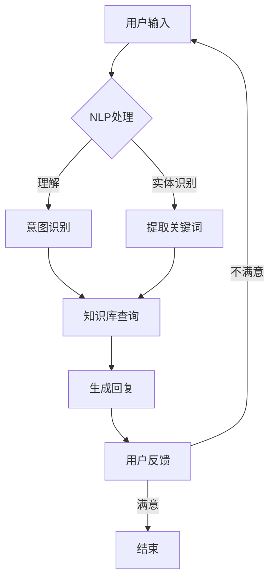

                 

关键词：聊天机器人，人工智能，客户服务，购物体验，效率提升

> 摘要：本文将深入探讨聊天机器人在现代商业中的应用，特别是在提升客户服务效率和改善购物体验方面的作用。通过分析聊天机器人的核心概念、算法原理、数学模型以及实际应用案例，我们希望揭示这一技术如何改变商业运作方式，并探讨其未来的发展趋势与挑战。

## 1. 背景介绍

在数字化转型的浪潮中，客户服务效率和购物体验成为了商业竞争的关键因素。传统的客户服务方式，如电话客服和在线支持，已经难以满足消费者日益增长的需求。客户期望能够快速、方便地获取信息，解决疑问，而商家则需要降低服务成本，提高客户满意度。

### 1.1 客户服务面临的挑战

- **响应速度**：随着市场竞争的加剧，客户期望能够立即得到响应。
- **个性化服务**：每位客户的需求都是独一无二的，如何提供个性化的服务成为了挑战。
- **成本控制**：客户服务的成本占企业运营成本的一大部分，如何降低成本是企业的核心问题。

### 1.2 购物体验的重要性

- **用户粘性**：良好的购物体验能够增加用户对平台的忠诚度。
- **转化率**：优质的购物体验能够提高客户的购买转化率。
- **口碑传播**：满意的客户更愿意分享他们的购物体验，从而带来新的客户。

## 2. 核心概念与联系

聊天机器人是一种基于人工智能技术的自动对话系统，能够模拟人类的对话方式，与用户进行交互。其核心概念包括自然语言处理（NLP）、机器学习和用户交互设计。

### 2.1 自然语言处理（NLP）

NLP是聊天机器人的核心技术之一，它使计算机能够理解、解释和生成自然语言。NLP的核心任务是文本分类、情感分析、命名实体识别和语义理解。

### 2.2 机器学习

机器学习是聊天机器人自我改进的重要手段。通过训练模型，机器人可以识别常见的客户问题，并提供准确的答案。机器学习包括监督学习、无监督学习和强化学习。

### 2.3 用户交互设计

用户交互设计决定了聊天机器人的用户体验。一个好的聊天机器人不仅能够理解用户的问题，还要能够以一种自然、流畅的方式与用户互动。

### 2.4 Mermaid 流程图

下面是一个简化的聊天机器人架构的 Mermaid 流程图：



## 3. 核心算法原理 & 具体操作步骤

### 3.1 算法原理概述

聊天机器人的核心算法主要包括自然语言处理（NLP）、意图识别、对话管理和回复生成。

- **NLP**：用于将用户的自然语言输入转换为计算机可以理解的形式。
- **意图识别**：通过分析用户的输入，确定用户的意图。
- **对话管理**：根据用户的意图，决定如何继续对话，并管理对话的流程。
- **回复生成**：根据对话管理和知识库的信息，生成合适的回复。

### 3.2 算法步骤详解

1. **用户输入**：用户通过文本、语音等方式与聊天机器人交互。
2. **NLP处理**：将用户输入的文本转换为计算机可以理解的形式，包括词法分析、句法分析和语义分析。
3. **意图识别**：通过机器学习模型，识别用户的意图。
4. **对话管理**：根据意图识别的结果，决定如何继续对话，包括查询知识库、提出问题或提供解决方案。
5. **回复生成**：根据对话管理的结果，生成合适的回复，并将其转化为自然语言。

### 3.3 算法优缺点

- **优点**：提高客户服务效率，降低人力成本，提供24/7的服务。
- **缺点**：在处理复杂问题时可能不够智能，用户体验可能不如人工客服。

### 3.4 算法应用领域

- **客户服务**：提供自动化的客户支持，解答常见问题。
- **电子商务**：帮助用户找到商品信息，提供购物建议。
- **金融行业**：自动处理客户咨询，提高交易效率。

## 4. 数学模型和公式 & 详细讲解 & 举例说明

### 4.1 数学模型构建

聊天机器人的核心算法涉及到多个数学模型，包括NLP模型、意图识别模型和回复生成模型。

- **NLP模型**：通常采用循环神经网络（RNN）或其变体，如长短期记忆网络（LSTM）。
- **意图识别模型**：通常采用分类模型，如朴素贝叶斯、支持向量机（SVM）或深度神经网络。
- **回复生成模型**：通常采用序列到序列（Seq2Seq）模型或生成对抗网络（GAN）。

### 4.2 公式推导过程

- **RNN模型**：假设输入序列为\( x_1, x_2, ..., x_T \)，隐藏状态为\( h_1, h_2, ..., h_T \)，输出序列为\( y_1, y_2, ..., y_T \)。RNN的基本公式为：

$$
h_t = \sigma(W_h h_{t-1} + W_x x_t + b_h)
$$

$$
y_t = \sigma(W_y h_t + b_y)
$$

其中，\( \sigma \)是激活函数，\( W_h \)、\( W_x \)、\( W_y \)是权重矩阵，\( b_h \)、\( b_y \)是偏置项。

- **意图识别模型**：假设有\( C \)个类别，输入特征为\( x \)，输出概率分布为\( \hat{y} \)。SVM的公式为：

$$
\min_{\omega, b} \frac{1}{2} ||\omega||^2 + C \sum_{i=1}^N \max(0, 1 - y_i (\omega^T x_i + b))
$$

其中，\( \omega \)是权重向量，\( b \)是偏置项，\( C \)是正则化参数。

### 4.3 案例分析与讲解

假设我们有一个简单的聊天机器人，用于回答用户关于天气的查询。用户输入“今天天气怎么样？”机器人需要识别意图（查询天气）并生成回复。

- **意图识别**：我们使用朴素贝叶斯分类器，假设天气的标签（是/否）为\( y \)，特征向量为\( x = (x_1, x_2, ..., x_N) \)。朴素贝叶斯模型的公式为：

$$
P(y | x) = \frac{P(x | y) P(y)}{P(x)}
$$

通过计算条件概率，我们得到每个类别的概率，选择概率最大的类别作为意图。

- **回复生成**：根据意图，我们查询知识库，生成回复。例如，如果意图是查询天气，我们可能生成回复“今天天气晴朗，气温18摄氏度。”

## 5. 项目实践：代码实例和详细解释说明

### 5.1 开发环境搭建

在Python中实现聊天机器人，需要安装以下库：

- `tensorflow`：用于构建和训练模型
- `nltk`：用于自然语言处理
- `chatterbot`：用于构建聊天机器人

安装命令如下：

```bash
pip install tensorflow nltk chatterbot
```

### 5.2 源代码详细实现

下面是一个简单的聊天机器人代码实例：

```python
from chatterbot import ChatBot
from chatterbot.trainers import ChatterBotCorpusTrainer

# 创建聊天机器人
chatbot = ChatBot(
    'MyChatBot',
    storage_adapter='chatterbot.storage.SQLStorageAdapter',
    database_uri='sqlite:///database.sqlite3'
)

# 训练聊天机器人
trainer = ChatterBotCorpusTrainer(chatbot)
trainer.train(
    'chatterbot.corpus.english'
)

# 开始对话
while True:
    try:
        user_input = input("您说：")
        bot_response = chatbot.get_response(user_input)
        print("机器人说：", bot_response)
    except (KeyboardInterrupt, EOFError, SystemExit):
        break
```

### 5.3 代码解读与分析

- **创建聊天机器人**：使用`ChatBot`类创建一个聊天机器人，指定存储适配器和数据库URI。
- **训练聊天机器人**：使用`ChatterBotCorpusTrainer`类训练聊天机器人，使用英文语料库。
- **开始对话**：在循环中接收用户输入，并使用`get_response`方法获取聊天机器人的回复。

### 5.4 运行结果展示

输入：“你好！”

输出：“你好，有什么可以帮助你的吗？”

## 6. 实际应用场景

### 6.1 客户服务

- **自动回答常见问题**：如产品说明、退货政策等。
- **智能推荐**：根据用户历史记录，推荐相关产品或服务。

### 6.2 购物体验

- **购物导航**：帮助用户快速找到所需商品。
- **个性化推荐**：根据用户偏好推荐商品。

### 6.3 未来应用展望

- **跨平台集成**：聊天机器人将更好地集成到多种平台和设备中。
- **更高级的情感识别**：通过机器学习和深度学习，提高情感识别的准确性。

## 7. 工具和资源推荐

### 7.1 学习资源推荐

- 《自然语言处理综论》（Jurafsky and Martin）
- 《深度学习》（Goodfellow, Bengio, Courville）

### 7.2 开发工具推荐

- TensorFlow：用于构建和训练深度学习模型
- ChatterBot：用于构建聊天机器人

### 7.3 相关论文推荐

- “A Few Useful Things to Know About Machine Learning”（ Pedro Domingos）
- “Attention Is All You Need”（Vaswani et al.）

## 8. 总结：未来发展趋势与挑战

### 8.1 研究成果总结

聊天机器人在提升客户服务效率和改善购物体验方面取得了显著成果。通过自然语言处理、机器学习和用户交互设计，聊天机器人能够提供快速、个性化的服务。

### 8.2 未来发展趋势

- **更高级的情感识别**：通过深度学习和多模态数据，提高情感识别的准确性。
- **跨平台集成**：更好地集成到多种平台和设备中。

### 8.3 面临的挑战

- **数据隐私与安全**：如何保护用户数据，防止数据泄露。
- **用户体验**：如何提供更自然、更流畅的交互体验。

### 8.4 研究展望

聊天机器人的发展将朝着更智能、更个性化、更安全的方向前进。随着技术的进步，聊天机器人将在未来扮演更加重要的角色，成为企业数字化转型的重要工具。

## 9. 附录：常见问题与解答

### 9.1 如何训练聊天机器人？

训练聊天机器人需要准备大量的对话数据，并使用机器学习算法进行训练。常用的方法包括监督学习、无监督学习和强化学习。

### 9.2 聊天机器人是否可以取代人工客服？

聊天机器人可以处理大量简单的查询，但无法完全取代人工客服。在处理复杂问题时，人工客服仍然是不可或缺的。

### 9.3 聊天机器人的成本是多少？

聊天机器人的成本取决于多个因素，如开发时间、维护成本和所需功能。一般来说，聊天机器人的初始成本相对较高，但随着规模的扩大，其性价比会逐渐提高。

---

本文由禅与计算机程序设计艺术撰写，旨在探讨聊天机器人在现代商业中的应用，特别是其在提升客户服务效率和改善购物体验方面的作用。通过分析核心概念、算法原理、数学模型和实际应用案例，我们揭示了这一技术如何改变商业运作方式，并展望了其未来的发展趋势与挑战。

