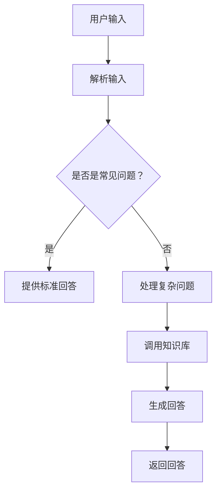

                 

关键词：聊天机器人、AI、客户服务、效率、用户问题解决

> 摘要：本文将深入探讨聊天机器人的发展和应用，分析其如何通过人工智能技术提升客户服务效率和解决用户问题，同时展望未来发展趋势和面临的挑战。

## 1. 背景介绍

随着互联网技术的飞速发展和智能手机的普及，在线客户服务已成为企业运营的重要组成部分。然而，传统的客户服务方式往往存在响应时间长、处理效率低、人力资源成本高等问题。为了解决这些问题，越来越多的企业开始引入聊天机器人这一创新技术，以提升客户服务质量和效率。

### 聊天机器人的定义

聊天机器人，也称为虚拟助手或聊天bots，是一种通过自然语言处理技术实现与用户互动的计算机程序。它们能够模拟人类对话，理解用户的意图并给出相应的回答，从而在客户服务领域发挥重要作用。

### 聊天机器人的发展历程

聊天机器人的发展可以追溯到20世纪50年代，当时科学家们开始研究如何通过计算机程序模拟人类对话。随着人工智能技术的进步，聊天机器人的能力逐渐增强，不仅能够处理简单的查询，还能够进行复杂的对话和情感分析。

## 2. 核心概念与联系

在了解聊天机器人的工作原理之前，我们需要先了解几个核心概念：自然语言处理（NLP）、机器学习和深度学习。

### 自然语言处理（NLP）

自然语言处理是人工智能的一个分支，旨在使计算机能够理解、解释和生成人类语言。NLP技术包括文本解析、语义分析、情感分析和语言生成等。

### 机器学习

机器学习是人工智能的核心技术之一，它通过从数据中学习模式，使计算机能够做出预测和决策。在聊天机器人中，机器学习用于训练模型，使其能够更好地理解用户意图和提供准确回答。

### 深度学习

深度学习是机器学习的一个子领域，它使用多层神经网络对大量数据进行分析和建模。在聊天机器人中，深度学习技术被广泛应用于情感分析和意图识别，以提高对话的准确性和自然度。

### Mermaid 流程图

以下是一个简单的聊天机器人工作流程的Mermaid流程图：



## 3. 核心算法原理 & 具体操作步骤

### 3.1 算法原理概述

聊天机器人的核心算法主要包括意图识别、实体抽取和回答生成。意图识别用于理解用户的请求类型，实体抽取用于提取用户请求中的关键信息，回答生成则根据意图和实体信息生成合适的回答。

### 3.2 算法步骤详解

1. **意图识别**：通过机器学习模型，分析用户的输入语句，识别用户意图。
2. **实体抽取**：从用户的输入语句中提取关键信息，如产品名称、时间、地点等。
3. **回答生成**：根据意图和实体信息，生成符合用户需求的回答。

### 3.3 算法优缺点

**优点**：
- **高效性**：聊天机器人可以同时处理大量用户请求，提升客户服务效率。
- **稳定性**：聊天机器人不会因情绪波动而影响服务质量。
- **低成本**：相比于人工客服，聊天机器人的人力成本较低。

**缺点**：
- **准确性**：对于复杂的用户请求，聊天机器人的理解能力有限。
- **交互体验**：机器人的交互体验可能不如人类客服自然。

### 3.4 算法应用领域

聊天机器人广泛应用于客服、销售、客户支持等多个领域，如电商客服、银行客服、酒店预订等。

## 4. 数学模型和公式 & 详细讲解 & 举例说明

### 4.1 数学模型构建

聊天机器人的核心数学模型主要包括决策树、神经网络和支持向量机等。

### 4.2 公式推导过程

以下是一个简单的神经网络模型的推导过程：

$$
y = \sigma(W_1 \cdot x + b_1)
$$

其中，$y$ 是输出，$\sigma$ 是激活函数，$W_1$ 是权重矩阵，$x$ 是输入，$b_1$ 是偏置。

### 4.3 案例分析与讲解

以电商客服为例，用户输入：“我想购买一件红色T恤。” 通过意图识别，聊天机器人将其归类为“购买请求”。接着，实体抽取会提取出关键词“红色T恤”。最后，回答生成会生成回答：“您好，以下是您搜索的红色T恤，请您查看。”

## 5. 项目实践：代码实例和详细解释说明

### 5.1 开发环境搭建

开发环境搭建主要包括安装Python、安装必要的库和设置开发环境。

### 5.2 源代码详细实现

以下是一个简单的聊天机器人实现示例：

```python
import nltk
from nltk.chat.util import Chat, reflections

pairs = [
    [
        r"我是谁？",
        ["你好，我是一个聊天机器人。", "我是你的虚拟助手。"]
    ],
    [
        r"你叫什么名字？",
        ["我叫ChatBot。", "你可以叫我ChatBot。"]
    ]
]

chatbot = Chat(pairs, reflections)

chatbot.converse()
```

### 5.3 代码解读与分析

这段代码首先导入了nltk库，然后定义了一个名为Chat的类，该类用于处理聊天对话。接下来，我们定义了一个名为pairs的列表，其中包含了聊天机器人的回答和对应的问题。最后，我们创建了一个Chatbot实例，并调用其converse方法开始对话。

### 5.4 运行结果展示

运行这段代码后，聊天机器人会进入对话模式，用户可以输入问题，聊天机器人会根据预设的回答给出回应。

## 6. 实际应用场景

### 6.1 在电商领域的应用

电商客服是聊天机器人最常见的应用场景之一。通过聊天机器人，用户可以随时咨询商品信息、购买流程、售后服务等，提升用户体验。

### 6.2 在金融领域的应用

银行和金融机构可以利用聊天机器人提供24/7的客户服务，解答用户的金融问题，如贷款咨询、理财产品介绍等。

### 6.3 在医疗领域的应用

医疗客服机器人可以帮助用户解答医疗咨询问题，提供健康建议，甚至引导用户进行在线挂号。

## 7. 未来应用展望

随着人工智能技术的不断进步，聊天机器人的应用前景将更加广阔。未来，聊天机器人将不仅仅是提供基本的问答服务，还将具备更高级的智能对话能力，如情感分析、个性化推荐等。

## 8. 工具和资源推荐

### 8.1 学习资源推荐

- 《自然语言处理原理与语音识别》
- 《深度学习》

### 8.2 开发工具推荐

- TensorFlow
- PyTorch

### 8.3 相关论文推荐

- "A Neural Conversation Model"
- "Dialogue Generation with Recurrent Neural Networks"

## 9. 总结：未来发展趋势与挑战

### 9.1 研究成果总结

近年来，聊天机器人在客户服务领域取得了显著成果，其应用范围不断扩大，服务效率显著提升。

### 9.2 未来发展趋势

未来，聊天机器人将向更智能、更个性化的方向发展，逐步替代部分传统客户服务岗位。

### 9.3 面临的挑战

然而，聊天机器人仍面临诸多挑战，如提高对话的准确性、增强情感理解和处理复杂问题等。

### 9.4 研究展望

为了实现聊天机器人的广泛应用，我们需要在算法、数据集和工程实践等方面进行持续研究和优化。

## 附录：常见问题与解答

### Q：聊天机器人是否会替代人工客服？

A：聊天机器人可以替代部分简单、重复性的客服工作，但复杂、情感需求较高的客服仍需要人工客服的介入。

### Q：如何提高聊天机器人的服务质量？

A：可以通过不断优化算法、增加高质量的训练数据和进行持续的用户反馈来提高聊天机器人的服务质量。

### Q：聊天机器人在隐私保护方面有哪些挑战？

A：聊天机器人在处理用户数据时需要严格遵守隐私保护法规，避免数据泄露和滥用。

[作者：禅与计算机程序设计艺术 / Zen and the Art of Computer Programming]
```

