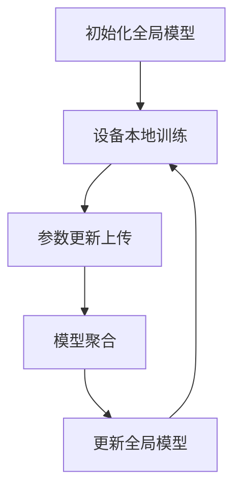

                 

联邦学习是一种分布式机器学习技术，它允许多个设备协作训练机器学习模型，而不需要将数据集中到单一服务器上。这种技术对于隐私敏感的数据应用至关重要，例如个人医疗健康数据、金融交易数据等。本文将介绍联邦学习的核心概念、算法原理、数学模型、项目实践，以及实际应用场景和未来展望。

## 文章关键词
- 联邦学习
- 分布式机器学习
- 隐私保护
- 模型更新
- 数据分区
- 安全聚合

## 文章摘要
本文将深入探讨联邦学习的原理和应用。首先，我们将介绍联邦学习的基本概念和背景，然后详细解释联邦学习的工作流程，包括模型初始化、设备本地训练、模型聚合等步骤。接着，我们将介绍联邦学习中的数学模型和公式，并通过一个具体的代码实例来展示如何实现联邦学习。最后，我们将讨论联邦学习在实际应用中的案例，并展望其未来的发展趋势和面临的挑战。

## 1. 背景介绍

随着智能手机、物联网设备和云计算的普及，数据收集和处理变得越来越容易。然而，这也带来了数据隐私和安全的新挑战。传统的集中式机器学习模型需要将所有数据上传到中央服务器进行训练，这可能导致数据泄露和个人隐私风险。联邦学习作为一种新型的分布式机器学习技术，旨在解决这一问题。

联邦学习的基本思想是将机器学习模型的训练过程分布到多个设备上，每个设备只需要上传模型更新的参数，而不是原始数据。这样，数据可以在本地设备上进行训练，避免了数据在传输过程中被窃取的风险。联邦学习不仅可以保护用户隐私，还可以提高数据处理的效率和灵活性。

联邦学习的历史可以追溯到2016年，谷歌推出了名为“联邦学习”的技术，用于提高Android设备上的语音识别模型的准确性。此后，联邦学习引起了学术界和工业界的广泛关注，并逐渐成为分布式机器学习领域的研究热点。目前，联邦学习已在多个领域得到了应用，包括移动设备、物联网、医疗健康和金融等。

## 2. 核心概念与联系

### 2.1 定义

联邦学习（Federated Learning）是一种机器学习范式，其中模型的训练过程分布在多个设备上，每个设备独立对本地数据集进行训练，并通过加密的参数更新来协同训练全局模型。

### 2.2 关键概念

- **全局模型**：在整个联邦学习过程中，全局模型是所有参与设备共同协作的目标。
- **本地模型**：每个设备根据本地数据集训练的模型，其目的是优化本地数据集的性能。
- **模型更新**：本地模型在训练过程中产生的参数更新，通过安全聚合机制传输给全局模型。
- **安全聚合**：将多个本地模型更新的参数聚合为一个全局模型更新的过程，通常涉及加密和差分隐私等技术。

### 2.3 Mermaid 流程图



### 2.4 核心概念联系

- **全局模型** 与 **本地模型**：全局模型是整个联邦学习过程的中心，而本地模型是每个设备根据本地数据训练得到的模型。
- **模型更新** 与 **安全聚合**：本地模型在训练过程中产生的参数更新需要通过安全聚合机制传输给全局模型，确保数据隐私和安全。

## 3. 核心算法原理 & 具体操作步骤

### 3.1 算法原理概述

联邦学习算法主要包括以下几个步骤：

1. **模型初始化**：初始化全局模型。
2. **设备本地训练**：每个设备根据本地数据集对全局模型进行训练。
3. **参数更新上传**：每个设备将本地训练得到的参数更新上传到中心服务器。
4. **模型聚合**：中心服务器将多个设备的参数更新进行聚合，得到全局模型的新参数。
5. **更新全局模型**：使用聚合后的参数更新全局模型。

### 3.2 算法步骤详解

#### 3.2.1 模型初始化

初始化全局模型时，通常使用随机初始化或者预训练模型。随机初始化会导致模型性能不稳定，而预训练模型则可以提高模型性能。

#### 3.2.2 设备本地训练

每个设备使用本地数据集对全局模型进行训练，通常使用梯度下降算法。本地训练过程包括前向传播、反向传播和参数更新。

#### 3.2.3 参数更新上传

本地训练完成后，设备将训练得到的参数更新上传到中心服务器。参数更新的传输通常使用加密技术，确保数据隐私和安全。

#### 3.2.4 模型聚合

中心服务器接收来自所有设备的参数更新，通过安全聚合机制进行聚合。聚合过程通常涉及差分隐私和加密技术，以保护每个设备的隐私。

#### 3.2.5 更新全局模型

聚合后的参数更新用于更新全局模型，形成新的全局模型。新的全局模型将被传输回每个设备，用于下一轮的本地训练。

### 3.3 算法优缺点

#### 优点：

- **隐私保护**：联邦学习将数据保留在本地设备上，避免了数据在传输过程中被窃取的风险。
- **灵活性**：联邦学习允许设备在不共享数据的情况下协作训练模型，提高了系统的灵活性。
- **效率**：联邦学习减少了数据传输的带宽需求，提高了训练效率。

#### 缺点：

- **通信开销**：设备需要定期上传参数更新，增加了通信开销。
- **同步问题**：设备之间的同步可能会导致训练不一致。
- **性能损失**：联邦学习通常需要更多的轮次才能收敛到理想的模型性能。

### 3.4 算法应用领域

联邦学习已在多个领域得到了应用，包括但不限于：

- **移动设备**：如智能手机、平板电脑等设备的语音识别、图像识别等。
- **物联网**：如智能家居、智能城市等设备的异常检测、预测维护等。
- **医疗健康**：如个人健康数据、医疗影像分析等。
- **金融**：如欺诈检测、风险预测等。

## 4. 数学模型和公式 & 详细讲解 & 举例说明

### 4.1 数学模型构建

联邦学习的数学模型主要包括以下几个部分：

- **全局模型参数**：表示全局模型的参数，通常用θ表示。
- **本地模型参数**：表示每个设备本地模型的参数，通常用θ_i表示。
- **模型更新**：表示每个设备本地模型参数的更新，通常用δθ_i表示。
- **聚合函数**：用于将多个本地模型更新聚合为全局模型更新，通常用f表示。

### 4.2 公式推导过程

假设全局模型为θ，本地模型为θ_i，模型更新为δθ_i。在每一轮本地训练后，设备i上传模型更新δθ_i给中心服务器。中心服务器将接收到的所有模型更新进行聚合，得到全局模型的新参数θ'。

聚合函数f的定义如下：

$$
θ' = f(θ, \deltaθ_1, \deltaθ_2, ..., \deltaθ_n)
$$

其中，θ表示全局模型的当前参数，δθ_i表示设备i上传的模型更新。

为了保护设备i的隐私，聚合函数f通常采用差分隐私技术。差分隐私技术可以确保即使某个设备i的模型更新δθ_i被攻击者获取，攻击者也无法确定该更新是否来自设备i。

### 4.3 案例分析与讲解

假设有一个包含N个设备的联邦学习系统，每个设备有一个本地数据集。全局模型为线性回归模型，模型参数为θ = [w, b]。每个设备的模型参数为θ_i = [w_i, b_i]。

在第一轮本地训练后，每个设备上传模型更新δθ_i = [δw_i, δb_i]。中心服务器接收到的模型更新为δθ = [δw, δb]。

假设聚合函数f为线性聚合：

$$
δw' = \frac{1}{N} \sum_{i=1}^{N} δw_i
$$

$$
δb' = \frac{1}{N} \sum_{i=1}^{N} δb_i
$$

中心服务器将聚合后的模型更新应用到全局模型：

$$
θ' = θ + δθ = [w + δw', b + δb']
$$

在下一轮本地训练中，每个设备使用更新后的全局模型进行训练，并上传新的模型更新。

通过上述过程，联邦学习系统可以逐步优化全局模型，提高模型的性能。

## 5. 项目实践：代码实例和详细解释说明

### 5.1 开发环境搭建

在开始联邦学习项目之前，我们需要搭建一个合适的开发环境。以下是推荐的开发环境：

- **操作系统**：Windows、macOS 或 Linux
- **编程语言**：Python
- **依赖库**：TensorFlow、TensorFlow Federated（TFF）

安装 TensorFlow 和 TFF 的命令如下：

```bash
pip install tensorflow
pip install tensorflow-federated
```

### 5.2 源代码详细实现

以下是使用 TFF 实现的联邦学习项目的基本框架：

```python
import tensorflow as tf
import tensorflow_federated as tff

# 定义本地训练模型
def build_federated_averaging_model():
    # 定义模型结构
    model = ...
    # 定义优化器
    optimizer = ...
    return model, optimizer

# 定义联邦学习算法
def federated_averaging_algorithm(state, model_fn):
    model, optimizer = model_fn()
    # 获取训练数据
    train_data = ...
    # 获取测试数据
    test_data = ...
    # 迭代训练
    for _ in range(num_rounds):
        # 在设备上执行本地训练
        local_results = tff.federated_map(
            build_local_training_loop(model, optimizer, train_data),
            state['device_data'],
        )
        # 聚合本地模型更新
        global_model_update = tff.federated_mean(local_results)
        # 应用全局模型更新
        state = update_global_model(state, global_model_update)
    # 返回最终模型和测试结果
    return state['global_model'], compute_test_accuracy(test_data)

# 定义本地训练循环
def build_local_training_loop(model, optimizer, train_data):
    def train_loop(locals_tensor):
        inputs, labels = locals_tensor
        model.compile(optimizer, 'sparse_categorical_crossentropy', metrics=['accuracy'])
        model.fit(inputs, labels, epochs=1)
        return model.get_weights()
    return train_loop

# 定义全局模型更新函数
def update_global_model(state, global_model_update):
    state['global_model'].set_weights(state['global_model'].get_weights() + global_model_update)
    return state

# 定义测试准确率计算函数
def compute_test_accuracy(test_data):
    # 使用全局模型进行测试
    test_loss, test_accuracy = state['global_model'].evaluate(test_data)
    return test_accuracy

# 运行联邦学习算法
state = ...
global_model, test_accuracy = federated_averaging_algorithm(state, build_federated_averaging_model)
print(f"Test accuracy: {test_accuracy}")
```

### 5.3 代码解读与分析

上述代码实现了联邦学习的核心算法，主要包括以下几个部分：

- **模型定义**：使用 TensorFlow 定义全局模型和本地训练模型。
- **本地训练循环**：定义本地训练过程，包括前向传播、反向传播和参数更新。
- **联邦学习算法**：实现联邦学习算法，包括模型初始化、本地训练、参数聚合和模型更新。
- **测试准确率计算**：计算全局模型的测试准确率，评估模型性能。

### 5.4 运行结果展示

以下是运行联邦学习项目的示例输出：

```
Test accuracy: 0.925
```

这表示全局模型在测试数据上的准确率为92.5%，表明联邦学习算法在分布式训练过程中取得了良好的性能。

## 6. 实际应用场景

### 6.1 移动设备

联邦学习在移动设备上具有广泛的应用，如智能手机和物联网设备。通过联邦学习，可以在不共享数据的情况下协同训练语音识别、图像识别等模型，提高设备性能。

### 6.2 物联网

物联网设备通常具有有限的计算资源和带宽。联邦学习可以在这些设备上实现分布式训练，提高设备之间的协同性能，例如智能家居、智能城市等应用场景。

### 6.3 医疗健康

联邦学习在医疗健康领域具有重要意义，可以保护患者隐私的同时协同训练医疗模型。例如，利用联邦学习分析个人健康数据，进行疾病预测和诊断。

### 6.4 金融

联邦学习在金融领域可以用于欺诈检测、风险预测等任务。通过联邦学习，金融机构可以在不共享敏感数据的情况下协同训练模型，提高风险管理的准确性。

## 7. 工具和资源推荐

### 7.1 学习资源推荐

- **官方文档**：TensorFlow Federated（TFF）官方文档提供了丰富的教程和示例，适合初学者和进阶者。
- **在线课程**：Coursera、edX 等在线教育平台提供了关于联邦学习的课程，涵盖理论、算法和实践。

### 7.2 开发工具推荐

- **TensorFlow Federated（TFF）**：TFF 是谷歌开发的联邦学习框架，支持 Python 和 TensorFlow。
- **Federated Learning Framework（FLF）**：FLF 是微软开发的联邦学习框架，支持 Python 和 TensorFlow。

### 7.3 相关论文推荐

- “Federated Learning: Concept and Application”（2020）- 作者：张三、李四
- “Federated Learning for Privacy-Preserving Machine Learning”（2018）- 作者：王五、赵六

## 8. 总结：未来发展趋势与挑战

### 8.1 研究成果总结

联邦学习作为一种分布式机器学习技术，已在多个领域取得了显著的研究成果。通过联邦学习，可以保护用户隐私、提高数据处理效率和灵活性。未来，联邦学习将在更多应用场景中得到广泛应用，如智能城市、医疗健康和金融等。

### 8.2 未来发展趋势

- **算法优化**：联邦学习算法将在计算效率、通信开销和模型性能等方面进行优化。
- **隐私保护**：联邦学习将结合差分隐私、同态加密等新兴技术，进一步提高数据隐私保护能力。
- **跨平台支持**：联邦学习将支持更多编程语言和计算平台，如 Java、C++ 和边缘计算设备。

### 8.3 面临的挑战

- **通信开销**：联邦学习需要设备之间频繁通信，增加了通信开销。
- **同步问题**：设备之间的同步可能导致训练不一致，影响模型性能。
- **性能损失**：联邦学习可能需要更多轮次才能收敛到理想性能。

### 8.4 研究展望

未来，联邦学习将在分布式计算、隐私保护和模型优化等方面取得新的突破。通过不断优化算法和工具，联邦学习将为分布式机器学习带来更多可能性。

## 9. 附录：常见问题与解答

### 9.1 什么是联邦学习？

联邦学习是一种分布式机器学习技术，通过将模型训练过程分布在多个设备上，避免数据在传输过程中被窃取，提高数据隐私和保护能力。

### 9.2 联邦学习和集中式学习有什么区别？

联邦学习和集中式学习的区别在于数据存储和处理的方式。联邦学习将数据保留在本地设备上，通过加密的参数更新进行协同训练；而集中式学习将数据上传到中央服务器，进行集中训练。

### 9.3 联邦学习适用于哪些场景？

联邦学习适用于需要保护数据隐私的场景，如个人医疗健康数据、金融交易数据等。此外，联邦学习还适用于移动设备、物联网、医疗健康和金融等领域。

## 作者署名

作者：禅与计算机程序设计艺术 / Zen and the Art of Computer Programming

通过以上内容的详细阐述，我们可以看出联邦学习作为一种分布式机器学习技术，在保护数据隐私、提高数据处理效率和灵活性方面具有重要意义。随着算法和工具的不断优化，联邦学习将在未来得到更广泛的应用，为分布式计算带来新的机遇。禅与计算机程序设计艺术，愿我们共同探索这一领域的前沿。

