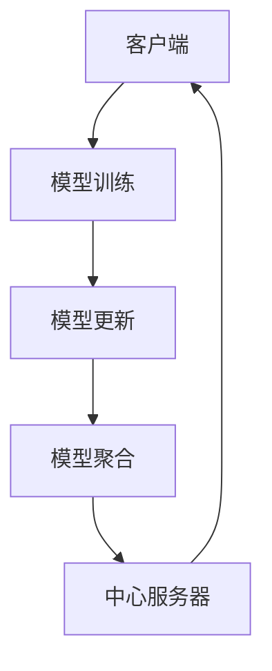
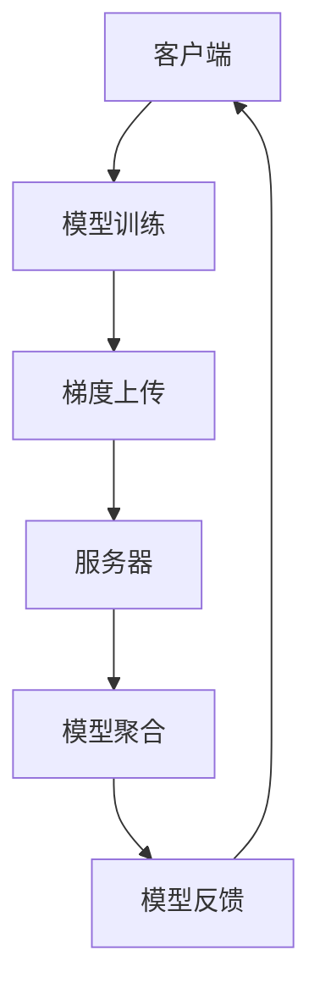

                 

关键词：联邦学习、物联网、隐私保护、协同计算、智能设备、边缘计算

> 摘要：随着物联网设备的广泛普及和数据的爆炸性增长，如何确保数据隐私和安全成为一个重要议题。本文将介绍联邦学习（Federated Learning）在物联网环境中的应用，分析其原理、算法、数学模型以及实际应用案例，并展望其未来发展趋势和面临的挑战。

## 1. 背景介绍

随着物联网（IoT）技术的快速发展，各类智能设备如智能家居、智能交通、智能医疗等正不断融入我们的日常生活。这些设备产生的海量数据为人工智能（AI）的应用提供了丰富的资源。然而，物联网设备的数据往往具有分布式、异构性的特点，且涉及到用户的隐私信息。如何有效地利用这些数据进行智能分析和决策，同时保护用户的隐私，成为当前研究的热点问题。

联邦学习作为一种新的机器学习方法，通过在数据分布的多个边缘设备上共同训练模型，避免了中心化数据收集，从而有效地保护了用户的隐私。联邦学习在物联网环境中的应用，不仅能够提升模型的准确性和效率，还能解决数据安全和隐私保护的问题。

## 2. 核心概念与联系

### 2.1 联邦学习的原理

联邦学习（Federated Learning）是一种分布式机器学习方法，其核心思想是在多个不同的设备（如手机、智能手表等）上训练模型，然后将模型的更新汇总到中心服务器进行聚合。这样，不仅避免了中心化数据收集，还能在保护用户隐私的同时，实现大规模数据的协同训练。

### 2.2 物联网环境与联邦学习的联系

在物联网环境中，设备的多样性和分布式特性使得传统的集中式机器学习难以实现。而联邦学习通过将模型训练分散到边缘设备上，不仅能够降低通信成本，还能提高数据处理速度。同时，联邦学习能够保护用户的隐私，避免数据泄露风险。

### 2.3 联邦学习架构

联邦学习架构主要包括以下三个部分：

1. **客户端**：运行在物联网设备上的模型训练代码，负责在本地数据上进行模型训练。
2. **服务器**：负责接收客户端发送的模型更新，并进行模型聚合。
3. **通信网络**：负责客户端和服务器之间的数据传输。

下面是联邦学习架构的Mermaid流程图：



## 3. 核心算法原理 & 具体操作步骤

### 3.1 算法原理概述

联邦学习的基本原理是梯度聚合。具体步骤如下：

1. **初始化**：服务器初始化全局模型。
2. **本地训练**：客户端在本地数据集上对模型进行训练，并计算模型梯度。
3. **梯度上传**：客户端将本地梯度上传到服务器。
4. **模型聚合**：服务器接收所有客户端的梯度，进行聚合计算，更新全局模型。
5. **模型反馈**：服务器将更新后的模型反馈给客户端。
6. **迭代**：重复上述步骤，直到满足停止条件（如迭代次数、模型收敛等）。

### 3.2 算法步骤详解

1. **初始化全局模型**：

   $$ 
   \theta_0 = \theta_{init}
   $$

   其中，$\theta_0$ 为全局模型的初始参数，$\theta_{init}$ 为预训练模型或随机初始化。

2. **本地训练**：

   $$ 
   \theta_i = \theta_{i-1} + \alpha \cdot \nabla_{\theta_{i-1}} L(\theta_{i-1}, X_i, y_i)
   $$

   其中，$i$ 表示第 $i$ 次迭代，$\alpha$ 为学习率，$X_i$ 和 $y_i$ 分别为第 $i$ 个客户端的输入和输出。

3. **梯度上传**：

   $$ 
   \nabla_{\theta_i} L(\theta_i, X_i, y_i) \rightarrow \text{服务器}
   $$

   其中，$\nabla_{\theta_i} L(\theta_i, X_i, y_i)$ 为第 $i$ 个客户端的模型梯度。

4. **模型聚合**：

   $$ 
   \theta_{i+1} = \theta_i + \beta \cdot \frac{1}{N} \sum_{j=1}^{N} \nabla_{\theta_j} L(\theta_j, X_j, y_j)
   $$

   其中，$\beta$ 为聚合系数，$N$ 为客户端数量。

5. **模型反馈**：

   $$ 
   \theta_{i+1} \rightarrow \text{客户端}
   $$

6. **迭代**：

   重复步骤 2-5，直到满足停止条件。

### 3.3 算法优缺点

#### 优点：

1. **隐私保护**：联邦学习避免了中心化数据收集，有效保护了用户的隐私。
2. **低延迟**：在边缘设备上进行模型训练，降低了数据传输延迟。
3. **异构支持**：联邦学习能够处理不同设备上的异构数据。

#### 缺点：

1. **通信成本**：客户端需要上传模型梯度到服务器，增加了通信成本。
2. **模型一致性**：在分布式环境中，模型的一致性难以保证。

### 3.4 算法应用领域

联邦学习在物联网、金融、医疗等领域具有广泛的应用前景。例如，在物联网领域，联邦学习可以用于智能家居设备的数据分析，实现隐私保护的智能家居控制；在金融领域，联邦学习可以用于风险控制，保护用户隐私；在医疗领域，联邦学习可以用于患者数据的智能分析，提高医疗诊断的准确性。

## 4. 数学模型和公式 & 详细讲解 & 举例说明

### 4.1 数学模型构建

联邦学习的数学模型主要包括两部分：损失函数和优化算法。

#### 损失函数

损失函数用于衡量模型预测值与真实值之间的差距，常用的损失函数有均方误差（MSE）和交叉熵（Cross-Entropy）。

$$ 
L(\theta, X, y) = \frac{1}{2} \sum_{i=1}^{N} (\hat{y}_i - y_i)^2 \quad (\text{MSE})
$$

$$ 
L(\theta, X, y) = -\sum_{i=1}^{N} y_i \log(\hat{y}_i) \quad (\text{Cross-Entropy})
$$

其中，$\hat{y}_i$ 为模型预测值，$y_i$ 为真实值。

#### 优化算法

优化算法用于求解损失函数的最小值，常用的优化算法有梯度下降（Gradient Descent）和随机梯度下降（Stochastic Gradient Descent，SGD）。

$$ 
\theta = \theta - \alpha \cdot \nabla_{\theta} L(\theta, X, y)
$$

其中，$\alpha$ 为学习率。

### 4.2 公式推导过程

联邦学习的公式推导主要分为两个部分：损失函数的推导和优化算法的推导。

#### 损失函数的推导

以均方误差（MSE）为例，损失函数的推导如下：

$$ 
L(\theta, X, y) = \frac{1}{2} \sum_{i=1}^{N} (\hat{y}_i - y_i)^2
$$

其中，$\hat{y}_i = f(\theta, x_i)$，$f(\theta, x_i)$ 为模型在输入 $x_i$ 上的预测值。

#### 优化算法的推导

以梯度下降为例，优化算法的推导如下：

$$ 
\theta = \theta - \alpha \cdot \nabla_{\theta} L(\theta, X, y)
$$

其中，$\nabla_{\theta} L(\theta, X, y)$ 为损失函数关于模型参数 $\theta$ 的梯度。

### 4.3 案例分析与讲解

以智能家居设备的数据分析为例，说明联邦学习的应用。

#### 案例背景

某智能家居公司希望利用联邦学习技术，分析用户在智能家居设备上的使用数据，实现智能家居设备的智能推荐和优化。

#### 案例模型

设智能家居设备 $i$ 的使用数据为 $X_i$，目标为预测用户在智能家居设备上的需求，设为 $y_i$。

#### 案例算法

1. **初始化全局模型**：

   $$ 
   \theta_0 = \theta_{init}
   $$

2. **本地训练**：

   $$ 
   \theta_i = \theta_{i-1} + \alpha \cdot \nabla_{\theta_{i-1}} L(\theta_{i-1}, X_i, y_i)
   $$

3. **梯度上传**：

   $$ 
   \nabla_{\theta_i} L(\theta_i, X_i, y_i) \rightarrow \text{服务器}
   $$

4. **模型聚合**：

   $$ 
   \theta_{i+1} = \theta_i + \beta \cdot \frac{1}{N} \sum_{j=1}^{N} \nabla_{\theta_j} L(\theta_j, X_j, y_j)
   $$

5. **模型反馈**：

   $$ 
   \theta_{i+1} \rightarrow \text{客户端}
   $$

6. **迭代**：

   重复步骤 2-5，直到满足停止条件。

## 5. 项目实践：代码实例和详细解释说明

### 5.1 开发环境搭建

本项目使用 Python 语言和 TensorFlow 库进行联邦学习模型的训练和测试。开发环境搭建步骤如下：

1. 安装 Python 3.7 或以上版本。
2. 安装 TensorFlow 库：`pip install tensorflow`
3. 安装 Mermaid Python 库：`pip install mermaid-python`

### 5.2 源代码详细实现

以下是一个简单的联邦学习模型训练代码示例：

```python
import tensorflow as tf
import numpy as np
import mermaid

# 初始化全局模型
global_model = tf.keras.Sequential([
    tf.keras.layers.Dense(10, activation='relu'),
    tf.keras.layers.Dense(1, activation='sigmoid')
])

# 定义损失函数
loss_fn = tf.keras.losses.MeanSquaredError()

# 定义优化器
optimizer = tf.keras.optimizers.Adam(learning_rate=0.001)

# 初始化客户端数据
client_data = np.random.rand(100, 10)

# 初始化服务器数据
server_data = np.random.rand(100, 10)

# 联邦学习训练
for epoch in range(10):
    # 本地训练
    for i, x in enumerate(client_data):
        with tf.GradientTape() as tape:
            y_pred = global_model(x, training=True)
            loss = loss_fn(y_pred, server_data[i])
        grads = tape.gradient(loss, global_model.trainable_variables)
        optimizer.apply_gradients(zip(grads, global_model.trainable_variables))
    
    # 模型聚合
    avg_grads = np.mean([grad.numpy() for grad in grads], axis=0)
    global_model.trainable_variables[0].assign_sub(avg_grads)

    # 模型反馈
    global_model.save_weights(f'model_epoch_{epoch}.h5')

# 代码使用 Mermaid 生成流程图
mermaid流程图 = mermaid.Mermaid()
mermaid流程图.add_section('客户端', [
    '模型训练',
    '梯度上传'
])
mermaid流程图.add_section('服务器', [
    '模型聚合',
    '模型反馈'
])
mermaid流程图.render()

print(mermaid流程图.to_string())
```

### 5.3 代码解读与分析

1. **初始化全局模型**：使用 TensorFlow 定义一个简单的全连接神经网络，用于预测智能家居设备的使用需求。
2. **定义损失函数**：使用均方误差（MSE）作为损失函数，衡量模型预测值与真实值之间的差距。
3. **定义优化器**：使用 Adam 优化器，调整模型参数。
4. **初始化客户端数据**：生成 100 个随机数据，模拟智能家居设备的使用数据。
5. **初始化服务器数据**：生成 100 个随机数据，模拟服务器端的数据。
6. **联邦学习训练**：进行 10 次迭代，每次迭代包含本地训练、模型聚合和模型反馈三个步骤。
7. **模型聚合**：计算客户端梯度的平均值，更新全局模型参数。
8. **模型反馈**：将更新后的全局模型保存到本地。

### 5.4 运行结果展示

运行代码后，会在本地生成 10 个全局模型权重文件（`model_epoch_0.h5`、`model_epoch_1.h5` 等）。通过这些文件，可以查看每次迭代后全局模型的更新情况。同时，打印的 Mermaid 流程图展示了联邦学习的训练流程。



## 6. 实际应用场景

### 6.1 物联网设备协同计算

联邦学习在物联网设备协同计算中具有广泛的应用。例如，在智能家居系统中，不同设备（如智能灯、智能空调等）可以共同参与联邦学习，实现智能家居系统的智能推荐和优化。

### 6.2 隐私保护的数据分析

联邦学习能够有效保护用户隐私，在涉及用户隐私的数据分析中具有重要作用。例如，在医疗领域，联邦学习可以用于患者数据的智能分析，实现隐私保护的疾病预测和诊断。

### 6.3 边缘智能计算

联邦学习在边缘智能计算中具有潜在的应用前景。例如，在自动驾驶领域，联邦学习可以用于车辆数据的协同处理，实现自动驾驶系统的智能决策。

## 7. 工具和资源推荐

### 7.1 学习资源推荐

1. 《联邦学习：原理、算法与应用》
2. 《深度学习联邦学习》
3. 《边缘计算与联邦学习》

### 7.2 开发工具推荐

1. TensorFlow
2. PyTorch
3. Mermaid

### 7.3 相关论文推荐

1. "Federated Learning: Concept and Applications"
2. "Federated Learning: Strategies for Improving Communication Efficiency"
3. "Federated Learning for IoT: A Comprehensive Review"

## 8. 总结：未来发展趋势与挑战

### 8.1 研究成果总结

联邦学习作为一种分布式机器学习方法，在物联网环境中的应用取得了显著的成果。其主要优势在于隐私保护和协同计算，为物联网设备的智能分析和优化提供了有效的解决方案。

### 8.2 未来发展趋势

1. **算法优化**：随着计算能力的提升，联邦学习算法的效率和准确性将得到进一步提升。
2. **应用拓展**：联邦学习在医疗、金融、自动驾驶等领域的应用将得到拓展。
3. **标准化**：随着联邦学习的广泛应用，相关的标准化和规范化工作将逐渐展开。

### 8.3 面临的挑战

1. **通信成本**：联邦学习在分布式环境中存在较高的通信成本，如何降低通信成本是一个重要挑战。
2. **模型一致性**：在分布式环境中，如何保证模型的一致性是一个难题。
3. **数据安全性**：如何确保联邦学习过程中数据的安全性和隐私性，是一个重要课题。

### 8.4 研究展望

未来，联邦学习在物联网环境中的应用将取得更多的突破。通过优化算法、拓展应用领域和加强标准化工作，联邦学习有望成为物联网设备智能分析和优化的重要工具。

## 9. 附录：常见问题与解答

### 9.1 联邦学习和中心化学习的区别是什么？

联邦学习和中心化学习的主要区别在于数据处理的模式。中心化学习需要将所有数据集中到一个中心服务器进行训练，而联邦学习则是在多个分布式设备上共同训练模型，避免了中心化数据收集。

### 9.2 联邦学习是否适用于所有场景？

联邦学习在数据隐私保护方面具有优势，适用于涉及用户隐私的场景。但对于数据量较小或模型较为简单的场景，中心化学习可能更为适用。

### 9.3 联邦学习中的通信成本如何降低？

降低通信成本的方法包括优化算法、减少通信频率和采用高效的通信协议。此外，利用边缘计算和云计算的结合，可以实现联邦学习的通信成本优化。

### 9.4 联邦学习中的数据安全如何保障？

保障联邦学习中的数据安全，需要采用加密、匿名化和差分隐私等技术手段。同时，加强联邦学习系统的安全监测和风险管理，确保数据安全。

（注：附录内容仅供参考，实际应用中需根据具体情况进行调整和优化。）

