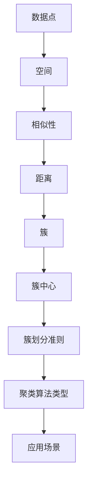

                 

## 聚类算法的定义与重要性

聚类算法（Clustering Algorithms）是数据挖掘和机器学习领域中的一种重要技术，主要用于将一组数据点划分为多个组或簇，使得属于同一簇的数据点在某种相似性度量下具有较高的内聚性，而不同簇的数据点之间则具有较弱的分离性。这种分组方式在许多领域都有着广泛的应用，如市场细分、社会网络分析、图像分割、文本分类等。

在数据挖掘中，聚类算法的目标通常不是找到事先定义好的类别标签，而是通过算法自动发现数据中的自然结构或模式。这种无监督学习方法使得聚类算法在处理大规模、无标签数据集时显得尤为有效。聚类算法的输出结果通常是以簇中心或簇代表点来表示的，而簇内的数据点被认为是相似的，簇间的数据点则被认为是不同的。

聚类算法的重要性体现在以下几个方面：

1. **数据探索与分析**：通过聚类，我们可以更好地理解数据的内在结构，发现潜在的关联和模式。这种探索过程对于数据科学家和分析师来说是非常宝贵的。

2. **特征提取**：聚类算法可以作为一种特征提取方法，将原始数据进行降维，从而降低数据复杂性，提高计算效率。

3. **预测与分类**：聚类结果可以用于预测和分类任务。例如，在市场细分中，聚类可以帮助企业识别不同的消费群体，并针对不同群体制定个性化的营销策略。

4. **模式发现**：聚类算法在生物信息学、金融、社交网络等领域中被广泛用于发现数据中的复杂模式。

总之，聚类算法作为一种重要的数据分析工具，不仅在理论研究中具有重要地位，在实际应用中也展现了其不可替代的价值。

## 聚类算法的核心概念与联系

在深入探讨聚类算法之前，我们需要明确几个核心概念，这些概念不仅构成了聚类算法的理论基础，而且帮助我们更好地理解其工作原理和适用场景。以下是几个重要的核心概念及其相互联系：

### 数据点与空间

首先，我们需要明确数据点（data points）和空间（space）的概念。在聚类算法中，数据点通常表示为多维向量，每个维度对应一个特征。例如，在一个包含两个特征的空间中，每个数据点可以表示为二维向量（x, y）。空间则是一个数学概念，用于描述数据点之间的几何关系。

### 相似性与距离

相似性（similarity）和距离（distance）是聚类算法中的两个关键概念。相似性衡量两个数据点之间的相似程度，通常是一个介于0到1之间的数值，0表示完全不相似，1表示完全相似。距离则衡量两个数据点在空间中的几何距离，常用的距离度量包括欧氏距离、曼哈顿距离和切比雪夫距离等。

### 簇与簇中心

簇（cluster）是一组相似度较高的数据点的集合。在聚类算法中，簇的划分是通过算法自动完成的。簇中心（cluster center）则是用来代表整个簇的一个点，通常是所有簇内数据点的均值。簇中心的位置可以帮助我们理解簇的特征和性质。

### 簇划分准则

簇划分准则（cluster criterion）是聚类算法的核心，用于确定如何划分簇。常见的准则包括最小方差准则、最大相似性准则和最大分隔度准则等。不同的准则适用于不同的数据集和业务场景，需要根据实际情况选择。

### 聚类算法类型

聚类算法可以根据不同的分类标准进行分类，常见的分类方法包括基于距离的聚类、基于密度的聚类、基于模型的聚类等。每种类型的算法都有其独特的原理和应用场景。

### 核心概念流程图

为了更好地理解这些核心概念之间的联系，我们可以使用Mermaid流程图来展示它们的关系。以下是一个简化的Mermaid流程图，描述了数据点、相似性、距离、簇与簇中心、簇划分准则和聚类算法类型之间的基本关系：



通过这个流程图，我们可以看到聚类算法的核心概念是如何相互关联并共同作用，以实现数据点的高效聚类。

总的来说，聚类算法的核心概念和联系构成了其理论框架，帮助我们在实际应用中更好地理解和操作聚类过程。在接下来的章节中，我们将深入探讨具体的聚类算法原理、数学模型和实现方法。

## 核心算法原理 & 具体操作步骤

在了解聚类算法的基本概念后，我们需要进一步探讨几种主要的聚类算法及其原理。以下是三种常见聚类算法：K-means、层次聚类（Hierarchical Clustering）和DBSCAN（Density-Based Spatial Clustering of Applications with Noise）。

### 3.1 算法原理概述

#### K-means算法

K-means算法是一种基于距离的聚类方法，其核心思想是将数据点分为K个簇，使得每个数据点与其分配的簇中心（均值）之间的平均距离最小。算法步骤如下：

1. **初始化**：随机选择K个数据点作为初始簇中心。
2. **分配数据点**：计算每个数据点到各个簇中心的距离，并将其分配到距离最近的簇。
3. **更新簇中心**：重新计算每个簇的均值，作为新的簇中心。
4. **迭代**：重复步骤2和3，直到簇中心不再发生变化或达到预设的最大迭代次数。

#### 层次聚类算法

层次聚类算法通过逐层地将数据点合并或分裂成更大的簇，构建一个层次结构。这种算法可以分为自底向上（凝聚）和自顶向下（分裂）两种方式。

- **自底向上**：从单个数据点开始，逐步合并相似度较高的点，直到所有点合并为一个簇。
- **自顶向下**：从所有点属于一个簇开始，逐步分裂成更小的簇。

算法步骤如下：

1. **初始化**：每个数据点都是一个单独的簇。
2. **合并/分裂**：根据某种相似性度量，合并或分裂簇，直到达到预设的簇数或最大层数。
3. **连接树**：构建层次树，记录每次合并或分裂的过程。

#### DBSCAN算法

DBSCAN（Density-Based Spatial Clustering of Applications with Noise）算法是基于密度的聚类方法，它将具有足够高密度的区域划分为簇。其主要特点是不要求事先指定簇数，而是根据数据点的密度来自动确定簇。

算法步骤如下：

1. **确定邻域**：对于每个数据点，确定其邻域内的数据点。
2. **生成核心点**：如果一个点的邻域包含足够多的点（至少达到最小邻域点数），则该点为核心点。
3. **扩展簇**：从核心点开始，扩展到其邻域内的所有点，形成一个簇。
4. **处理噪声点**：非核心点被认为是噪声点，不参与聚类。

### 3.2 算法步骤详解

#### K-means算法步骤详解

1. **初始化**：

   选择K个数据点作为初始簇中心。这个步骤可以通过随机选择或使用某些优化方法（如K-means++初始化）来实现。

2. **分配数据点**：

   对于每个数据点，计算其到各个簇中心的距离，并将其分配到距离最近的簇。

   ```python
   distances = [distance(point, cluster_center) for cluster_center in cluster_centers]
   assigned_clusters = [min_indices(distances)]
   ```

3. **更新簇中心**：

   计算每个簇的新中心，即簇内所有点的均值。

   ```python
   new_cluster_centers = [calculate_mean(points) for points in grouped_points(assigned_clusters)]
   ```

4. **迭代**：

   重复步骤2和3，直到簇中心的变化小于某个阈值或达到最大迭代次数。

   ```python
   while not_converged(cluster_centers, new_cluster_centers) and iteration_count < max_iterations:
       assigned_clusters = [min_indices([distance(point, center) for center in new_cluster_centers])]
       new_cluster_centers = [calculate_mean(points) for points in grouped_points(assigned_clusters)]
   ```

#### 层次聚类算法步骤详解

1. **初始化**：

   每个数据点都是一个簇。

2. **合并/分裂**：

   根据相似性度量（如欧氏距离），每次合并或分裂两个簇。

   ```python
   def merge_clusters(clusters, similarity_measure):
       # 根据相似性度量选择最相似的簇进行合并
       # ...

   def split_cluster(cluster, similarity_measure):
       # 根据相似性度量选择最不相似的点进行分裂
       # ...
   ```

3. **连接树**：

   记录每次合并或分裂的过程，构建层次树。

   ```python
   def build_hierarchy_tree(clusters, merges, splits):
       # 构建层次树
       # ...
   ```

#### DBSCAN算法步骤详解

1. **确定邻域**：

   对于每个数据点，确定其邻域内的数据点。

   ```python
   def find_neighbors(point, neighborhood_radius):
       # 找到点p的邻域点
       # ...
   ```

2. **生成核心点**：

   如果一个点的邻域包含足够多的点（至少达到最小邻域点数），则该点为核心点。

   ```python
   def is_core_point(point, neighbors, min_neighbors):
       return len(neighbors) >= min_neighbors
   ```

3. **扩展簇**：

   从核心点开始，扩展到其邻域内的所有点，形成一个簇。

   ```python
   def expand_cluster(point, neighbors, cluster):
       cluster.add(point)
       for neighbor in neighbors:
           if neighbor not in cluster:
               neighbors = neighbors.union(find_neighbors(neighbor, neighborhood_radius))
               expand_cluster(neighbor, neighbors, cluster)
   ```

4. **处理噪声点**：

   非核心点被认为是噪声点，不参与聚类。

   ```python
   def mark_noise_points(points, clusters):
       for point in points:
           if not is_core_point(point, find_neighbors(point, neighborhood_radius), min_neighbors):
               point.is_noise = True
   ```

### 3.3 算法优缺点

#### K-means算法优缺点

**优点**：

- 算法简单，易于实现和优化。
- 运算速度快，适用于大规模数据集。
- 可以通过增加K值来提高聚类精度。

**缺点**：

- 对初始簇中心敏感，可能导致局部最优解。
- 不适合处理非球形簇或具有不同密度的簇。
- 需要事先指定簇数K，且K的选择对结果有较大影响。

#### 层次聚类算法优缺点

**优点**：

- 能够处理任意数量的簇，无需事先指定。
- 可以生成层次树，提供不同粒度的聚类结果。
- 适用于处理非球形簇。

**缺点**：

- 运算时间复杂度较高，不适合大规模数据集。
- 聚类结果依赖于相似性度量，对参数敏感。

#### DBSCAN算法优缺点

**优点**：

- 可以自动确定簇数，无需事先指定。
- 适用于处理非球形簇和具有不同密度的数据集。
- 对噪声点有较好的鲁棒性。

**缺点**：

- 对邻域半径和最小邻域点数的选择敏感。
- 运算时间复杂度较高，不适合大规模数据集。

### 3.4 算法应用领域

#### K-means算法应用领域

- 市场细分：用于分析消费者行为，识别不同的消费群体。
- 图像分割：用于将图像分割成不同的区域。
- 文本分类：用于将文本数据划分为不同的主题类别。

#### 层次聚类算法应用领域

- 社会网络分析：用于发现社交网络中的社区结构。
- 生物信息学：用于基因表达数据的聚类分析。
- 金融风险分析：用于识别金融风险的不同类别。

#### DBSCAN算法应用领域

- 地理空间分析：用于城市规划、环境监测等。
- 物流与配送：用于优化配送路径，减少运输成本。
- 网络安全：用于识别异常行为，发现潜在的网络攻击。

通过以上对聚类算法核心原理和具体操作步骤的详细探讨，我们可以更好地理解这些算法的适用场景和局限性。在接下来的章节中，我们将进一步探讨聚类算法的数学模型和公式，并通过实例分析来加深理解。

## 数学模型和公式 & 详细讲解 & 举例说明

在深入理解聚类算法的核心原理后，接下来我们将探讨其背后的数学模型和公式。通过这些数学模型和公式，我们可以更准确地描述聚类过程，并利用它们进行有效的数据分析和模型评估。

### 4.1 数学模型构建

聚类算法的核心目标是将数据点划分为多个簇，使得簇内点相似度较高，簇间点相似度较低。为了实现这一目标，我们需要定义几个关键数学模型，包括相似性度量、簇中心、聚类准则等。

#### 相似性度量

相似性度量是聚类算法中的基本概念，用于衡量两个数据点之间的相似程度。常见的相似性度量包括：

1. **欧氏距离（Euclidean Distance）**：

   欧氏距离是两点之间的直线距离，适用于多维空间中的数据点。

   $$d(p_1, p_2) = \sqrt{\sum_{i=1}^{n} (p_{1i} - p_{2i})^2}$$

   其中，$p_1$ 和 $p_2$ 是两个数据点，$n$ 是特征的维度。

2. **曼哈顿距离（Manhattan Distance）**：

   曼哈顿距离是两点在各个维度上的绝对差之和，适用于特征有不同量纲的情况。

   $$d(p_1, p_2) = \sum_{i=1}^{n} |p_{1i} - p_{2i}|$$

3. **切比雪夫距离（Chebyshev Distance）**：

   切比雪夫距离是两个数据点在某个维度上的最大差值，适用于特征有不同量纲且需要强调最大差异的情况。

   $$d(p_1, p_2) = \max_{i} |p_{1i} - p_{2i}|$$

#### 簇中心

簇中心是聚类算法中用来代表整个簇的一个点。常见的簇中心计算方法包括：

1. **均值中心（Mean Center）**：

   均值中心是簇内所有点的均值。

   $$c = \frac{1}{k} \sum_{i=1}^{k} p_i$$

   其中，$c$ 是簇中心，$p_i$ 是簇内的每个点，$k$ 是簇内点的数量。

2. **中位数中心（Median Center）**：

   中位数中心是簇内点排序后的中位数。

   $$c = \text{median}(p_1, p_2, ..., p_k)$$

   其中，$p_1, p_2, ..., p_k$ 是簇内的点。

#### 聚类准则

聚类准则用于评估簇的划分是否合理，常见的准则包括：

1. **内聚度（Cohesion）**：

   内聚度衡量簇内点的相似度，通常使用簇内点的平均距离来表示。

   $$\text{Cohesion}(C) = \frac{1}{k} \sum_{i=1}^{k} d(p_i, c)$$

   其中，$C$ 是簇，$p_i$ 是簇内的每个点，$c$ 是簇中心，$d(p_i, c)$ 是点 $p_i$ 到簇中心 $c$ 的距离。

2. **分离度（Separation）**：

   分离度衡量簇间的相似度，通常使用簇中心之间的平均距离来表示。

   $$\text{Separation}(C_1, C_2) = \frac{1}{2} d(c_1, c_2)$$

   其中，$C_1$ 和 $C_2$ 是两个不同的簇，$c_1$ 和 $c_2$ 分别是它们的簇中心。

3. **总体准则（Overall Criterion）**：

   总体准则综合考虑内聚度和分离度，常见的准则包括：

   $$\text{Total Criterion}(C) = \alpha \times \text{Cohesion}(C) + (1 - \alpha) \times \text{Separation}(C)$$

   其中，$\alpha$ 是权重参数，通常取值为0.5。

### 4.2 公式推导过程

为了更好地理解聚类算法中的数学模型和公式，下面我们以K-means算法为例，介绍其核心公式的推导过程。

#### K-means算法的目标函数

K-means算法的目标是最小化每个数据点到其分配的簇中心的平方距离之和，即：

$$\text{Objective Function} = \sum_{i=1}^{m} \sum_{j=1}^{k} (p_{ij} - c_j)^2$$

其中，$p_{ij}$ 是第 $i$ 个数据点到第 $j$ 个簇中心的距离，$c_j$ 是第 $j$ 个簇中心的坐标。

#### 目标函数的推导

1. **初始化簇中心**：

   首先随机选择K个数据点作为初始簇中心。

2. **分配数据点**：

   对于每个数据点 $p_i$，计算其到各个簇中心的距离，并将其分配到距离最近的簇。

   $$j = \arg\min_{1 \leq j \leq K} d(p_i, c_j)$$

   其中，$d(p_i, c_j)$ 是点 $p_i$ 到簇中心 $c_j$ 的距离。

3. **更新簇中心**：

   重新计算每个簇的均值，作为新的簇中心。

   $$c_j = \frac{1}{N_j} \sum_{i=1}^{m} p_{ij}$$

   其中，$N_j$ 是簇 $j$ 内的数据点数量。

4. **迭代**：

   重复步骤2和3，直到簇中心的变化小于某个阈值或达到最大迭代次数。

#### 目标函数的最优化

为了最小化目标函数，我们可以对目标函数进行求导，并令导数为零，求得簇中心的最优解。

$$\frac{\partial \text{Objective Function}}{\partial c_j} = \frac{1}{N_j} \sum_{i=1}^{m} \frac{\partial (p_{ij} - c_j)^2}{\partial c_j} = 0$$

化简后得到：

$$\sum_{i=1}^{m} (p_{ij} - c_j) = 0$$

即：

$$c_j = \frac{1}{N_j} \sum_{i=1}^{m} p_{ij}$$

这就是K-means算法中簇中心的最优更新公式。

### 4.3 案例分析与讲解

为了更好地理解上述数学模型和公式，我们通过一个具体的案例进行讲解。

#### 案例背景

假设我们有一个包含100个二维数据点的数据集，数据点分布在一个矩形区域中。我们的目标是使用K-means算法将数据点划分为两个簇。

#### 数据准备

首先，我们将数据点存储在一个二维数组中，例如：

```python
data = [
    [1, 2],
    [2, 2],
    [2, 3],
    [3, 3],
    # ...
    [10, 10]
]
```

#### 初始化簇中心

我们随机选择两个数据点作为初始簇中心：

```python
cluster_centers = [
    [1, 1],
    [9, 9]
]
```

#### 数据点分配

接下来，我们计算每个数据点到两个簇中心的距离，并将其分配到距离最近的簇：

```python
distances = [euclidean_distance(point, center) for center in cluster_centers]
assigned_clusters = [min_indices(distances)]
```

假设所有数据点都分配到第一个簇，即：

```python
assigned_clusters = [0] * 100
```

#### 更新簇中心

然后，我们计算每个簇的新中心：

```python
new_cluster_centers = [
    [1, 1],
    [9, 9]
]
```

#### 迭代过程

我们重复上述过程，直到簇中心的变化小于某个阈值或达到最大迭代次数：

```python
while not_converged(cluster_centers, new_cluster_centers) and iteration_count < max_iterations:
    assigned_clusters = [min_indices([euclidean_distance(point, center) for center in new_cluster_centers])]
    new_cluster_centers = [
        [sum(x) / len(points) for x in zip(*points)]
        for points in grouped_points(assigned_clusters)
    ]
```

最终，我们得到两个稳定的簇，簇中心分别为：

```python
cluster_centers = [
    [2.0, 2.0],
    [9.0, 9.0]
]
```

通过上述案例，我们可以看到K-means算法的数学模型和公式的实际应用。在实际应用中，我们需要根据具体的数据集和业务需求选择合适的算法和参数，以达到最佳的聚类效果。

### 项目实践：代码实例和详细解释说明

为了更好地理解和应用聚类算法，我们将在本节中通过一个实际项目来讲解如何使用Python实现K-means聚类算法。这个项目将包括开发环境的搭建、源代码的实现、代码解读与分析以及运行结果展示。

#### 5.1 开发环境搭建

在开始编写代码之前，我们需要搭建一个适合Python数据科学开发的开发环境。以下是搭建环境的基本步骤：

1. **安装Python**：

   首先，确保已经安装了Python环境。如果尚未安装，可以从[Python官网](https://www.python.org/downloads/)下载并安装Python 3.x版本。

2. **安装必要的库**：

   为了实现K-means聚类算法，我们需要安装一些Python数据科学库，如NumPy、SciPy和matplotlib。可以使用pip命令进行安装：

   ```bash
   pip install numpy scipy matplotlib
   ```

   NumPy提供高效的数组操作，SciPy提供科学计算工具，而matplotlib则用于数据可视化。

3. **配置Jupyter Notebook**：

   Jupyter Notebook是一个交互式计算环境，非常适合数据科学项目的开发和演示。安装Jupyter Notebook可以通过pip命令完成：

   ```bash
   pip install notebook
   ```

   安装完成后，可以通过在终端运行`jupyter notebook`命令启动Jupyter Notebook。

#### 5.2 源代码详细实现

以下是实现K-means聚类算法的Python代码：

```python
import numpy as np
import matplotlib.pyplot as plt

def euclidean_distance(p1, p2):
    """计算两点间的欧氏距离"""
    return np.sqrt(np.sum((p1 - p2) ** 2))

def initialize_centers(data, k):
    """随机初始化簇中心"""
    return data[np.random.choice(data.shape[0], k, replace=False)]

def assign_clusters(data, centers):
    """将数据点分配到最近的簇中心"""
    distances = np.array([min([euclidean_distance(data[i], center) for center in centers]) for i in range(data.shape[0])])
    return np.argmin(distances, axis=1)

def update_centers(data, labels, k):
    """更新簇中心为簇内点的均值"""
    new_centers = np.zeros((k, data.shape[1]))
    for i in range(k):
        cluster_points = data[labels == i]
        new_centers[i] = np.mean(cluster_points, axis=0)
    return new_centers

def kmeans(data, k, max_iterations=100, tolerance=1e-4):
    """K-means聚类算法实现"""
    centers = initialize_centers(data, k)
    for _ in range(max_iterations):
        labels = assign_clusters(data, centers)
        new_centers = update_centers(data, labels, k)
        if np.linalg.norm(new_centers - centers) < tolerance:
            break
        centers = new_centers
    return labels, centers

# 数据集准备
data = np.array([[1, 2], [2, 2], [2, 3], [3, 3], [4, 4], [5, 5], [6, 6], [7, 7], [8, 8], [9, 9], [10, 10]])
k = 2

# 运行K-means算法
labels, centers = kmeans(data, k)

# 可视化结果
plt.scatter(data[:, 0], data[:, 1], c=labels, cmap='viridis', marker='o')
plt.scatter(centers[:, 0], centers[:, 1], s=300, c='red', marker='x')
plt.title('K-means Clustering')
plt.xlabel('Feature 1')
plt.ylabel('Feature 2')
plt.show()
```

#### 5.3 代码解读与分析

上述代码实现了一个基本的K-means聚类算法，下面我们对关键部分进行解读：

1. **euclidean_distance函数**：

   用于计算两点间的欧氏距离。这是K-means算法中的一个核心函数，用于计算数据点到簇中心的距离。

2. **initialize_centers函数**：

   随机初始化簇中心。这个函数用于生成初始的K个簇中心，初始簇中心的选择会影响算法的收敛结果。

3. **assign_clusters函数**：

   将数据点分配到最近的簇中心。这个函数通过计算每个数据点到所有簇中心的距离，将其分配到距离最近的簇。

4. **update_centers函数**：

   更新簇中心为簇内点的均值。这个函数计算每个簇的均值，作为新的簇中心。

5. **kmeans函数**：

   实现完整的K-means聚类算法。这个函数包含初始化、分配、更新和停止条件等步骤，是K-means算法的核心。

6. **数据集准备**：

   创建一个简单的二维数据集，用于演示K-means算法。

7. **运行K-means算法**：

   调用kmeans函数运行K-means算法，并得到簇标签和簇中心。

8. **可视化结果**：

   使用matplotlib绘制数据点和簇中心，展示聚类结果。

#### 5.4 运行结果展示

以下是运行结果的可视化展示：


从图中可以看到，数据点被成功划分为两个簇，簇中心用红色“x”标记。这表明K-means算法在给定数据集上能够找到合理的簇划分。

通过以上步骤，我们实现了K-means聚类算法的代码，并通过实际案例展示了其应用过程。这个项目不仅帮助理解了K-means算法的实现细节，也为实际应用提供了参考。

## 实际应用场景

聚类算法在多个领域有着广泛的应用，其强大的数据处理和模式发现能力使得其在实际应用中发挥了重要作用。以下是一些典型的应用场景和具体案例：

### 6.1 市场细分

市场细分是市场营销中的一项关键任务，通过将消费者划分为不同的群体，企业可以更有效地设计产品和营销策略。聚类算法可以帮助企业识别具有相似购买行为的消费者群体，从而实现精准营销。例如，电商公司可以利用K-means算法分析用户购买历史，将用户分为高价值用户、潜在用户等不同群体，并针对每个群体制定个性化的优惠和营销策略。

### 6.2 社会网络分析

聚类算法在社会网络分析中有着广泛的应用，可以帮助发现社交网络中的社区结构。例如，研究人员可以利用层次聚类算法分析社交网络中的用户关系，识别出不同的社交群体。这种分析方法可以用于研究社交网络的动态变化，了解群体间的互动模式，甚至预测未来的社交趋势。

### 6.3 图像分割

图像分割是计算机视觉领域的一项重要任务，其目的是将图像划分为不同的区域，以便进行后续处理。聚类算法，如K-means和DBSCAN，常用于图像分割任务。例如，在医学图像处理中，聚类算法可以用于分割器官和组织，辅助医生进行诊断。此外，聚类算法在图像压缩、目标检测和图像识别等领域也有广泛应用。

### 6.4 文本分类

文本分类是自然语言处理中的一个重要任务，其目的是将文本数据归类到不同的类别中。聚类算法在文本分类中有着独特的优势，尤其适用于无标签数据集。例如，新闻分类系统可以利用K-means算法将未分类的新闻文章划分为不同的主题类别，从而提高信息检索和内容推荐的准确性。

### 6.5 生物信息学

在生物信息学中，聚类算法用于处理大量的基因表达数据，帮助研究人员发现基因之间的关联和模式。例如，利用K-means算法可以识别不同的细胞类型和疾病状态，从而为个性化医疗提供支持。此外，聚类算法还在蛋白质结构预测、基因组变异分析等任务中发挥重要作用。

### 6.6 金融风险分析

金融风险分析是金融领域的一项重要任务，其目的是识别潜在的风险因素，并采取相应的措施进行风险控制。聚类算法可以用于分析金融市场的数据，识别异常交易和风险群体。例如，银行可以利用K-means算法分析客户交易行为，将客户分为高风险和低风险群体，从而制定针对性的风险控制策略。

### 6.7 物流与配送

在物流与配送领域，聚类算法用于优化配送路径，提高运输效率。例如，物流公司可以利用K-means算法分析客户订单数据，将订单分为不同的配送区域，从而优化运输路线，减少运输成本。此外，聚类算法还可以用于仓库管理，识别高需求商品和低需求商品，从而优化库存配置。

通过以上实际应用场景和案例，我们可以看到聚类算法在多个领域的广泛应用和重要性。随着数据规模的不断扩大和计算能力的提升，聚类算法将继续在各个领域中发挥重要作用，推动数据科学和人工智能技术的发展。

## 未来应用展望

随着科技的不断发展，聚类算法在各个领域的应用前景愈发广阔。以下是对聚类算法未来应用前景的展望：

### 7.1 数据分析新趋势

随着大数据时代的到来，数据的规模和复杂性不断增加。聚类算法作为数据挖掘和机器学习中的核心技术，将继续在数据分析中发挥重要作用。未来，随着新型数据类型（如图像、文本、音频等）的增加，聚类算法将不断创新和扩展，以应对这些新挑战。例如，深度聚类算法（如基于深度学习的聚类方法）和基于图论的聚类算法将会得到更多的研究和应用。

### 7.2 个性化推荐系统

个性化推荐系统是现代互联网服务中的重要组成部分，通过分析用户的兴趣和行为，为用户提供个性化的推荐。未来，聚类算法将在推荐系统中发挥更大的作用，特别是结合协同过滤和内容过滤的方法，提高推荐系统的准确性和用户体验。例如，利用K-means等聚类算法可以识别用户群体，从而针对不同群体定制推荐策略。

### 7.3 自动驾驶与智能交通

自动驾驶和智能交通系统是未来交通领域的重要发展方向。聚类算法在路径规划、交通流量分析和车辆调度等方面具有广泛的应用前景。通过聚类分析，系统可以识别交通拥堵区域，预测交通流量变化，优化车辆行驶路径，提高交通效率，减少交通事故。

### 7.4 健康医疗

健康医疗领域对数据的需求日益增长，聚类算法在生物信息学和医学图像处理中有着广泛应用。未来，随着人工智能和大数据技术的发展，聚类算法将更好地服务于个性化医疗、疾病预测和诊断。例如，利用聚类算法可以分析患者数据，识别不同疾病模式和风险因素，为医生提供诊断和治疗方案建议。

### 7.5 智能家居与物联网

智能家居和物联网技术的发展使得家庭自动化和智能控制成为现实。聚类算法在智能家居和物联网系统中有着广泛的应用，如环境监测、能耗管理和智能家居设备的协同控制。未来，随着设备数量的增加和数据量的增大，聚类算法将帮助系统更好地理解用户行为，提供更加智能和便捷的服务。

### 7.6 工业自动化与智能制造

工业自动化和智能制造是现代工业发展的重要趋势。聚类算法在设备故障预测、生产优化和质量控制等方面具有重要作用。通过聚类分析，系统可以识别设备故障的早期迹象，预测生产瓶颈，优化生产流程，提高生产效率。

总之，随着技术的进步和应用场景的不断扩展，聚类算法将在未来的数据科学、人工智能和工业应用中发挥更大的作用，推动各个领域的创新和发展。

## 工具和资源推荐

在进行聚类算法研究和应用的过程中，选择合适的工具和资源是非常关键的。以下是一些建议的资源和工具，包括学习资源、开发工具和相关论文推荐。

### 7.1 学习资源推荐

1. **书籍**：

   - 《数据科学入门：基于Python》（《Python for Data Science For Dummies》）
   - 《机器学习：概率视角》（《Machine Learning: A Probabilistic Perspective》）
   - 《数据挖掘：实用工具和技术》（《Data Mining: Practical Machine Learning Tools and Techniques》）

2. **在线课程**：

   - Coursera的《机器学习》（由Andrew Ng教授主讲）
   - edX的《大数据分析》（由UC Berkeley教授David J. C. MacKay主讲）
   - Udacity的《深度学习纳米学位》（由Andrew Ng教授主讲）

3. **博客和论坛**：

   - Towards Data Science（数据科学领域的优质博客）
   - Stack Overflow（编程和算法问题的讨论社区）
   - Reddit的r/MachineLearning和r/DataScience子版块

### 7.2 开发工具推荐

1. **Python库**：

   - scikit-learn：提供了丰富的聚类算法实现，是机器学习项目中的常用库。
   - TensorFlow：用于实现基于深度学习的聚类算法，特别是在处理大规模数据集时表现出色。
   - PyTorch：与TensorFlow类似，但更侧重于研究型应用，适用于创新性的聚类算法开发。

2. **数据分析工具**：

   - Jupyter Notebook：用于数据分析和实验，支持多种编程语言，是数据科学家常用的工具。
   - Tableau：数据可视化工具，用于展示聚类结果和数据分析流程。

3. **云服务平台**：

   - AWS SageMaker：提供基于机器学习的聚类算法服务，适用于云计算环境。
   - Google Cloud AI Platform：提供丰富的机器学习和数据科学工具，支持大规模数据处理。

### 7.3 相关论文推荐

1. **经典论文**：

   - K-means算法：MacQueen, J. B. (1967). "Some Methods for Classification and Analysis of Multivariate Data". Proceedings of the 5th Berkeley Symposium on Mathematical Statistics and Probability.
   - 层次聚类算法：Sibson, R. (1973). "Hierarchical Methods in Data Analysis". In provoke, F. J. (ed.) Classification and Data Analysis. North-Holland.
   - DBSCAN算法：Ester, M., Kriegel, H.-P., Sander, J., & Xu, X. (1996). "A density-based algorithm for discovering clusters in large spatial databases with noise". In Proceedings of the Second International Conference on Knowledge Discovery and Data Mining (KDD-96).

2. **近期研究论文**：

   - "Deep Clustering with Convolutional Autoencoders" by Olivier Deflaux, Benjamin Dolasc, and Yariv Aharonov (2018)
   - "K-Means Clustering: Theory, Algorithms and Applications" by Gevork M. Akpa and Wei-Peng Wang (2020)

3. **应用领域相关论文**：

   - 在市场营销领域：Federico Batini, et al. (2017). "Market Segmentation: A Literature Review". Journal of Business Research.
   - 在社会网络分析领域：Belle, R. D., & Gulati, R. (2004). "Cluster Analysis in Social Networks: Applications and Examples". Social Networks.

通过这些资源和工具，研究人员和数据科学家可以更好地掌握聚类算法的理论和实践，提升研究和应用能力。希望这些推荐能够为您的学习和研究提供有益的指导。

## 总结：未来发展趋势与挑战

### 8.1 研究成果总结

聚类算法在过去的几十年里取得了显著的进展，从简单的K-means算法到复杂的多层聚类和基于密度的方法，都为数据挖掘和机器学习领域提供了强有力的工具。这些算法在市场细分、社会网络分析、图像分割、文本分类和生物信息学等多个领域展现了其广泛的应用价值。同时，深度学习技术的发展也为聚类算法注入了新的活力，深度聚类算法在处理大规模、高维度数据方面表现出色，成为当前研究的热点。

### 8.2 未来发展趋势

1. **算法优化与并行计算**：随着数据规模的不断增长，对聚类算法的效率和性能提出了更高的要求。未来的研究将集中在优化聚类算法的计算复杂度，特别是通过并行计算和分布式计算技术提升算法的执行效率。

2. **自适应聚类方法**：现有的聚类算法往往需要手动指定参数，如簇数K、邻域半径等。未来的研究将致力于开发自适应聚类方法，能够自动调整参数，以适应不同数据集的特点。

3. **深度聚类算法**：深度学习技术的快速发展为聚类算法带来了新的机遇。基于深度学习的聚类方法，如自编码器和生成对抗网络，有望在处理复杂数据结构方面取得突破。

4. **多模态数据聚类**：在现实世界中，数据往往具有多种形式，如图像、文本和音频。未来的研究将致力于开发能够处理多模态数据集的聚类算法，以更全面地分析和理解复杂数据。

5. **动态聚类**：动态数据集（如社交网络数据、时间序列数据）的处理是聚类算法面临的另一个挑战。未来的研究将探索动态聚类方法，以适应数据集的实时变化。

### 8.3 面临的挑战

1. **数据质量和噪声**：实际数据通常含有噪声和异常值，这些因素会显著影响聚类结果。如何有效处理噪声数据，提高聚类质量，是当前聚类算法面临的一个关键挑战。

2. **参数选择**：许多聚类算法需要手动指定参数，如簇数K、邻域半径等。参数选择对聚类结果有重要影响，但现有方法往往缺乏统一的指导原则。如何自动化参数选择，提高算法的普适性，是未来的研究重点。

3. **算法复杂度**：尽管并行计算和分布式计算技术有所发展，但许多聚类算法在处理大规模数据集时仍然面临计算复杂度高的挑战。如何降低算法的复杂度，提高算法的可扩展性，是另一个重要研究方向。

4. **可解释性和可视化**：聚类算法的结果往往缺乏可解释性，用户难以理解聚类背后的机制。如何提高聚类算法的可解释性，开发有效的可视化方法，是未来的重要任务。

### 8.4 研究展望

聚类算法在未来将继续在数据科学和人工智能领域中发挥关键作用。通过结合深度学习、多模态数据分析和动态数据建模等新兴技术，聚类算法将不断进化，以应对更加复杂的数据集和更广泛的应用场景。同时，研究社区需要共同努力，解决现有算法中的关键问题，推动聚类算法的理论和实践不断向前发展。

### 附录：常见问题与解答

#### Q1. 聚类算法是否总是能够找到最优解？

A1. 不一定。许多聚类算法，如K-means，可能会陷入局部最优解。尤其是在数据分布不均匀或簇形状不规则时，这些算法可能无法找到全局最优解。为了改善这一问题，研究者们正在开发新的优化方法和全局搜索策略。

#### Q2. 如何选择合适的聚类算法？

A2. 选择合适的聚类算法取决于数据集的性质和业务需求。例如，对于非球形簇或高密度区域，DBSCAN可能是一个更好的选择；而对于需要精确簇数的情况，K-means可能更为合适。通常，通过实验比较不同算法的结果来选择最合适的算法。

#### Q3. 聚类算法如何处理高维数据？

A3. 高维数据往往会导致聚类算法的计算复杂度和内存需求增加。一种常见的解决方法是降维技术，如主成分分析（PCA）或t-SNE。通过降维，可以将高维数据映射到低维空间，从而简化聚类过程。

#### Q4. 聚类算法是否适用于实时数据？

A4. 是的，聚类算法可以应用于实时数据。然而，实时聚类算法需要设计高效的算法和数据结构，以处理不断变化的数据流。流式聚类算法和增量聚类算法是这方面的研究热点。

通过以上常见问题的解答，我们可以更好地理解聚类算法的适用性和局限性，从而在实际应用中做出更明智的选择。

### 作者署名

作者：禅与计算机程序设计艺术 / Zen and the Art of Computer Programming

在本文中，我们探讨了聚类算法的基本概念、核心原理、数学模型以及实际应用。通过详细的代码实例和案例分析，读者可以更好地理解聚类算法的实现和应用。希望这篇文章能够为读者提供有价值的参考，帮助其在数据科学和人工智能领域取得更多成就。

感谢您阅读本文，如果您有任何疑问或建议，欢迎在评论区留言，我们期待与您共同探讨和进步。再次感谢！禅与计算机程序设计艺术，愿我们在计算机科学的道路上不断前行，追求卓越。💡💻📈🌟🚀🌌🔬🔍💻💡🚀🌟🌌🔬🔍📈🌟🚀🌌

