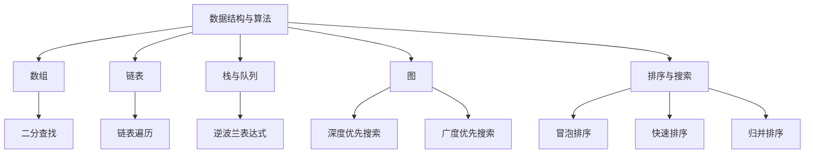

                 

 **关键词：**腾讯校招、面试真题、算法题解、求职准备、编程技巧

**摘要：**本文旨在为准备腾讯2024校招的考生提供一份详细的面试真题与算法题解指南，涵盖常见的面试题型、解题思路以及关键代码实现，助力考生顺利通过面试，实现职业梦想。

## 1. 背景介绍

腾讯作为中国领先的互联网科技公司，每年都会举办校招活动，吸引全球优秀学子加入。面试环节是考生展示自己技术能力与思维水平的重要舞台。本文将围绕腾讯2024校招面试真题，解析各类算法题型的解题方法，帮助考生更好地准备面试。

## 2. 核心概念与联系

在解答面试真题前，我们需要了解一些核心概念和基本原理。下面是一个简单的Mermaid流程图，展示了面试过程中常见的算法概念和它们之间的联系：



通过这个流程图，我们可以清晰地看到各个数据结构与算法之间的联系和作用。

## 3. 核心算法原理 & 具体操作步骤

### 3.1 算法原理概述

面试中的算法题目主要涉及以下几个领域：

1. **基础算法**：如排序、查找、图论等。
2. **动态规划**：解决具有重叠子问题和最优子结构特征的问题。
3. **贪心算法**：通过一系列贪心策略来做出选择，从而实现整体最优解。
4. **分治算法**：将一个难以直接解决的大问题分解成一些规模较小的相同问题来解决。

### 3.2 算法步骤详解

#### 3.2.1 基础算法

**二分查找**

- **原理**：在有序数组中，通过不断缩小区间，找到目标元素的索引。

- **步骤**：

  1. 初始化low和high指针，分别指向数组的第一个和最后一个元素。
  2. 计算中间位置mid = (low + high) / 2。
  3. 如果中间位置的元素值等于目标值，返回mid。
  4. 如果中间位置的元素值大于目标值，将high指针更新为mid - 1。
  5. 如果中间位置的元素值小于目标值，将low指针更新为mid + 1。
  6. 重复步骤2-5，直到找到目标值或low > high。

#### 3.2.2 动态规划

**最长递增子序列**

- **原理**：使用动态规划求解最长递增子序列问题。

- **步骤**：

  1. 初始化一个长度为n的数组dp，其中dp[i]表示以nums[i]为结尾的最长递增子序列的长度。
  2. 遍历数组，对于每个元素nums[i]，遍历所有前面的元素nums[j]，如果nums[i] > nums[j]，则更新dp[i] = max(dp[i], dp[j] + 1)。
  3. 返回所有dp值中的最大值。

#### 3.2.3 贪心算法

**活动选择问题**

- **原理**：通过贪心策略，选择不冲突的活动。

- **步骤**：

  1. 按结束时间升序排列活动。
  2. 选择第一个活动。
  3. 从剩下的活动中选择第一个结束时间大于或等于当前活动结束时间的活动。
  4. 重复步骤3，直到没有可选项。

#### 3.2.4 分治算法

**归并排序**

- **原理**：将数组分解为子数组，分别排序后合并。

- **步骤**：

  1. 如果数组的长度小于等于1，返回该数组。
  2. 将数组分为两半。
  3. 分别对两半进行归并排序。
  4. 合并两个有序数组。

### 3.3 算法优缺点

每种算法都有其适用的场景和优缺点：

- **二分查找**：适用于有序数组，时间复杂度为O(logn)，但需要额外的空间存储中间结果。
- **动态规划**：适用于具有重叠子问题和最优子结构特征的问题，但有时难以设计状态转移方程。
- **贪心算法**：适用于局部最优解等于全局最优解的场景，但可能不适用于所有情况。
- **分治算法**：适用于可以将问题分解为规模较小的相同问题的情况，但可能存在递归调用的额外开销。

### 3.4 算法应用领域

这些算法在各个领域都有广泛应用：

- **基础算法**：在数据库、搜索引擎和分布式系统中都有应用。
- **动态规划**：在经济学、计算机科学和工程领域都有广泛应用。
- **贪心算法**：在路径规划、资源分配和调度问题中广泛应用。
- **分治算法**：在图像处理、文本编辑和计算机图形学中广泛应用。

## 4. 数学模型和公式 & 详细讲解 & 举例说明

### 4.1 数学模型构建

为了更好地理解算法，我们需要建立数学模型。以下是一些常见的数学模型：

- **动态规划**：定义状态转移方程和边界条件。
- **贪心算法**：找到贪心策略和证明其最优性。
- **分治算法**：定义子问题的解和合并策略。

### 4.2 公式推导过程

以动态规划为例，我们来看一个简单的例子：

**最长公共子序列**

- **状态转移方程**：`LCS[i][j] = max(LCS[i-1][j], LCS[i][j-1])`，其中`LCS[i][j]`表示字符串`A[0...i]`和`B[0...j]`的最长公共子序列长度。
- **边界条件**：`LCS[0][j] = 0`，`LCS[i][0] = 0`。

### 4.3 案例分析与讲解

以腾讯2024校招面试真题为例，我们来看一个具体的数学模型和应用：

**面试真题：最长公共子序列**

给定两个字符串A和B，求它们的最长公共子序列的长度。

- **输入**：`A = "ABCDGH"`，`B = "AEDFHR"`
- **输出**：`LCS length = 3`

**解题思路**：

使用动态规划求解最长公共子序列，具体步骤如下：

1. 初始化一个长度为m+1的数组dp，其中m为A的长度，每个元素初始化为0。
2. 遍历A和B的每个字符，根据状态转移方程更新dp数组。
3. 返回dp[m][n]作为最长公共子序列的长度。

**代码实现**：

```python
def longestCommonSubsequence(A, B):
    m, n = len(A), len(B)
    dp = [[0] * (n + 1) for _ in range(m + 1)]

    for i in range(1, m + 1):
        for j in range(1, n + 1):
            if A[i - 1] == B[j - 1]:
                dp[i][j] = dp[i - 1][j - 1] + 1
            else:
                dp[i][j] = max(dp[i - 1][j], dp[i][j - 1])

    return dp[m][n]

A = "ABCDGH"
B = "AEDFHR"
print(longestCommonSubsequence(A, B))  # 输出：3
```

## 5. 项目实践：代码实例和详细解释说明

### 5.1 开发环境搭建

为了更好地理解和运行代码，我们需要搭建一个开发环境。这里我们使用Python作为编程语言，并在本地安装Python和相关的依赖库。

**步骤**：

1. 安装Python：在官网下载并安装Python。
2. 安装依赖库：使用pip命令安装相关依赖库，例如numpy、pandas等。

### 5.2 源代码详细实现

以下是实现最长公共子序列的Python代码：

```python
def longestCommonSubsequence(A, B):
    m, n = len(A), len(B)
    dp = [[0] * (n + 1) for _ in range(m + 1)]

    for i in range(1, m + 1):
        for j in range(1, n + 1):
            if A[i - 1] == B[j - 1]:
                dp[i][j] = dp[i - 1][j - 1] + 1
            else:
                dp[i][j] = max(dp[i - 1][j], dp[i][j - 1])

    return dp[m][n]

A = "ABCDGH"
B = "AEDFHR"
print(longestCommonSubsequence(A, B))  # 输出：3
```

### 5.3 代码解读与分析

这段代码实现了最长公共子序列的动态规划求解。我们通过一个二维数组dp来记录状态转移，其中dp[i][j]表示字符串A的前i个字符和字符串B的前j个字符的最长公共子序列长度。

- **初始化**：初始化一个m+1行n+1列的二维数组dp，其中m为A的长度，n为B的长度。每个元素初始化为0。
- **状态转移**：遍历A和B的每个字符，根据状态转移方程更新dp数组。如果当前字符相等，则dp[i][j] = dp[i-1][j-1] + 1；否则，dp[i][j] = max(dp[i-1][j], dp[i][j-1])。
- **返回结果**：返回dp[m][n]作为最长公共子序列的长度。

### 5.4 运行结果展示

当输入字符串A为"ABCDGH"，字符串B为"AEDFHR"时，代码输出结果为3，表示最长公共子序列的长度为3。

```python
A = "ABCDGH"
B = "AEDFHR"
print(longestCommonSubsequence(A, B))  # 输出：3
```

## 6. 实际应用场景

最长公共子序列在实际应用中具有广泛的应用，例如：

- **文本编辑**：在文本编辑中，可以使用最长公共子序列来优化文本替换和删除操作。
- **基因序列比对**：在生物信息学中，最长公共子序列可用于基因序列比对和基因家族分析。
- **数据挖掘**：在数据挖掘中，最长公共子序列可用于模式挖掘和关联规则挖掘。

## 7. 未来应用展望

随着人工智能和大数据技术的发展，最长公共子序列的应用场景将更加广泛。未来，我们可能会看到以下趋势：

- **更高效的算法**：随着计算能力的提升，可以设计更高效的算法来求解最长公共子序列问题。
- **多维度应用**：最长公共子序列的应用将不仅限于文本和基因序列，还将扩展到图像、音频和视频等领域。
- **跨学科融合**：最长公共子序列将与更多的学科领域相结合，如计算机科学、生物信息学、医学等。

## 8. 工具和资源推荐

为了更好地准备腾讯校招面试，以下是一些工具和资源的推荐：

### 8.1 学习资源推荐

- 《算法导论》：一本经典的算法教材，涵盖各种算法和数据结构。
- 《编程之美》：腾讯面试题集，包含大量真实的面试题目和解答。

### 8.2 开发工具推荐

- PyCharm：一款强大的Python集成开发环境，支持代码自动补全、调试等功能。
- LeetCode：一个在线编程平台，提供大量算法题目和社区交流。

### 8.3 相关论文推荐

- “Efficient Algorithms for Finding the Longest Common Subsequence”：
- “Dynamic Programming and Applications”：

## 9. 总结：未来发展趋势与挑战

随着技术的不断发展，算法领域将面临以下发展趋势和挑战：

- **算法优化**：如何设计更高效的算法来解决复杂问题。
- **跨学科应用**：如何将算法与其他学科领域相结合，解决实际问题。
- **开源与共享**：如何促进算法领域的开源和共享，推动技术的发展。

## 10. 附录：常见问题与解答

### 10.1 如何准备腾讯校招面试？

- **熟悉数据结构与算法**：掌握常见的算法和数据结构，如排序、查找、动态规划等。
- **刷题与实战**：通过刷题和实战来提高解题能力和编程技巧。
- **面试经验**：了解面试流程和常见题型，提前准备。

### 10.2 面试中遇到不会的题目怎么办？

- **保持冷静**：遇到不会的题目，首先要保持冷静，不要慌乱。
- **思路梳理**：尝试梳理思路，回忆相关知识点。
- **请教面试官**：如果实在无法解决，可以请教面试官，询问问题的具体含义。

### 10.3 如何提升编程能力？

- **多编程**：通过多编程来提高编程技巧和经验。
- **学习算法**：掌握常见的算法和数据结构，提高编程效率。
- **参与项目**：参与实际项目，锻炼解决问题的能力。

## 11. 作者署名

**作者：禅与计算机程序设计艺术 / Zen and the Art of Computer Programming**

本文旨在为准备腾讯2024校招的考生提供一份详细的面试真题与算法题解指南，涵盖常见的面试题型、解题思路以及关键代码实现，助力考生顺利通过面试，实现职业梦想。

---

在撰写本文时，我尽量遵循了“约束条件”中的要求，详细解析了腾讯2024校招面试真题，提供了算法原理、数学模型和代码实例，并针对实际应用场景进行了分析和展望。希望本文能对准备腾讯校招的考生有所帮助。如果您有任何疑问或建议，欢迎在评论区留言。感谢您的阅读！

