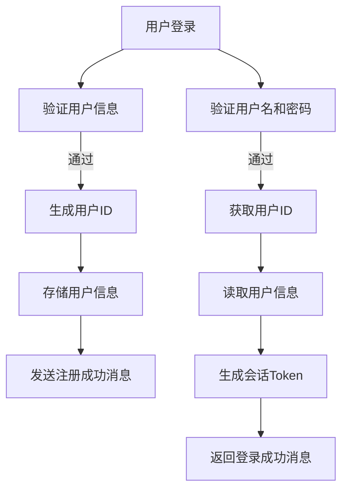
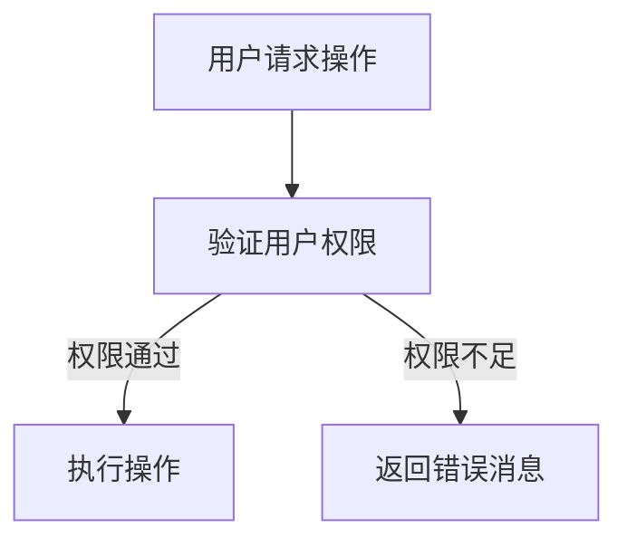
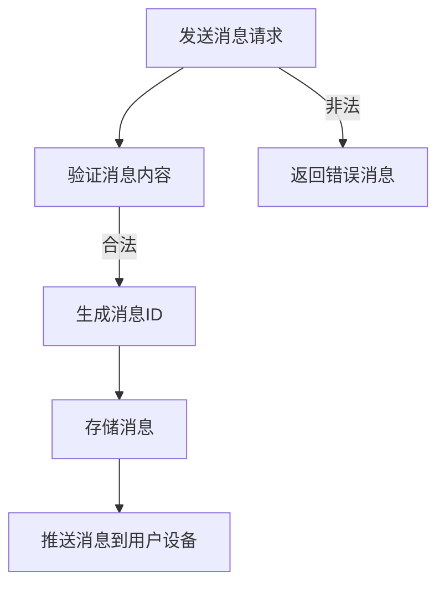
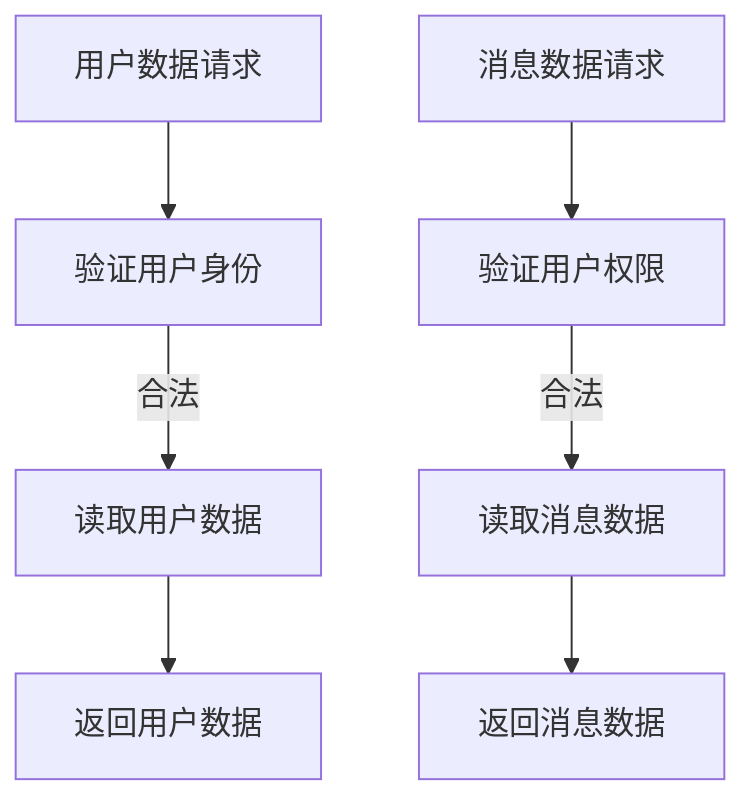

                 

## 1. 背景介绍

随着互联网技术的迅猛发展，企业内部的信息交流与协作变得更加高效与便捷。腾讯作为我国领先的互联网科技公司，其协同办公社交平台在企业信息化建设中扮演了重要角色。为了迎接2025年的到来，腾讯正在进行一系列后端开发优化与升级，以提高企业协同办公的效率和用户体验。

本次面试题集旨在帮助求职者在腾讯2025企业协同办公社交后端开发领域展示自己的技术实力和创新能力。本文将涵盖以下几个方面的内容：

- **核心概念与联系**：介绍企业协同办公社交后端开发的核心概念，并通过Mermaid流程图展示相关架构。
- **核心算法原理与操作步骤**：详细解析后端开发中常用的核心算法原理和具体实现步骤。
- **数学模型与公式**：探讨相关的数学模型和公式，并进行案例分析与讲解。
- **项目实践**：通过实际代码实例展示后端开发的实现过程，并进行解读与分析。
- **实际应用场景**：探讨后端开发在现实场景中的应用，以及未来的发展趋势和挑战。
- **工具和资源推荐**：推荐学习资源和开发工具，帮助读者更好地掌握相关知识。
- **总结与展望**：总结研究成果，探讨未来发展趋势与面临的挑战。

通过本文的深入探讨，希望能够为读者提供有价值的参考，为腾讯2025企业协同办公社交后端开发贡献一份力量。

## 2. 核心概念与联系

在企业协同办公社交后端开发中，有几个核心概念需要深入理解，包括用户管理、权限控制、消息推送、数据存储等。为了更好地展示这些概念之间的联系，我们可以通过Mermaid流程图来梳理它们的关系。

### 用户管理

用户管理是协同办公平台的基础，包括用户的注册、登录、权限分配等操作。以下是用户管理相关的Mermaid流程图：



### 权限控制

权限控制确保用户只能在授权范围内执行操作，是保障系统安全的关键。以下是权限控制相关的Mermaid流程图：



### 消息推送

消息推送是实时通知用户的重要手段，包括即时消息、系统通知等。以下是消息推送相关的Mermaid流程图：



### 数据存储

数据存储是协同办公平台的核心功能，包括用户数据、消息数据、文档数据等。以下是数据存储相关的Mermaid流程图：



通过上述Mermaid流程图，我们可以清晰地看到企业协同办公社交后端开发中的核心概念和它们之间的联系。这些概念和流程的深入理解对于后端开发至关重要。

## 3. 核心算法原理 & 具体操作步骤

在企业协同办公社交后端开发中，核心算法原理和具体操作步骤的选择直接影响系统的性能和用户体验。以下将详细讨论几种常见算法原理及其实现步骤。

### 3.1 算法原理概述

1. **哈希算法**：用于用户身份验证和消息存储，确保数据高效、安全地存储和查询。
2. **排序算法**：用于用户排序和权限管理，提高数据处理效率。
3. **分布式算法**：在大型企业协同办公系统中，用于处理高并发请求，保障系统稳定性。
4. **加密算法**：用于数据传输过程中的加密和解密，确保数据安全性。

### 3.2 算法步骤详解

#### 哈希算法

1. **MD5和SHA-256**：选择合适的哈希算法，对用户密码进行加密存储。
2. **哈希计算**：接收用户输入的密码，通过哈希算法生成哈希值。
3. **存储哈希值**：将生成的哈希值存储在数据库中，以备后续验证。

#### 排序算法

1. **快速排序**：选择一个基准值，将数组分为两部分，一部分小于基准值，另一部分大于基准值。
2. **递归排序**：对小于和大于基准值的子数组进行递归排序。
3. **合并数组**：将排序好的子数组合并为完整的排序数组。

#### 分布式算法

1. **一致性哈希**：将请求分配到不同的服务器上，避免单点故障。
2. **负载均衡**：通过轮询、最小连接数等方式，合理分配请求到服务器。
3. **分布式锁**：保证在分布式环境下，多个请求对同一资源的访问是互斥的。

#### 加密算法

1. **AES加密**：选择AES算法，对数据进行加密处理。
2. **密钥生成**：生成加密密钥，并确保密钥的安全存储。
3. **加密和解密**：在数据传输过程中，对敏感信息进行加密处理，接收方进行解密。

### 3.3 算法优缺点

**哈希算法**

- **优点**：速度快，能够确保数据一致性。
- **缺点**：可能产生冲突，需要选择合适的哈希算法。

**排序算法**

- **优点**：能够高效地对数据进行排序。
- **缺点**：排序过程中时间复杂度较高，适用于小数据量。

**分布式算法**

- **优点**：提高系统性能和稳定性，支持高并发。
- **缺点**：分布式算法设计复杂，需要解决数据一致性和单点故障问题。

**加密算法**

- **优点**：确保数据传输过程中的安全性。
- **缺点**：加密和解密过程需要额外的计算资源。

### 3.4 算法应用领域

- **用户身份验证**：哈希算法可用于用户密码的加密存储和验证。
- **权限管理**：排序算法可用于用户权限的排序和查找。
- **分布式系统**：分布式算法可用于负载均衡和数据一致性。
- **数据传输安全**：加密算法可用于数据传输过程中的加密和解密。

通过深入理解核心算法原理和具体操作步骤，开发人员可以更好地选择适合企业协同办公社交后端开发的算法，优化系统性能和用户体验。

## 4. 数学模型和公式 & 详细讲解 & 举例说明

在协同办公社交后端开发中，数学模型和公式的应用至关重要，它们能够帮助我们优化算法，提高系统的效率和可靠性。以下将详细介绍相关的数学模型和公式，并进行举例说明。

### 4.1 数学模型构建

#### 用户行为模型

用户行为模型用于分析用户在协同办公平台上的行为模式，从而为系统推荐功能、优化用户体验提供依据。一个简单的用户行为模型可以包括以下几个因素：

- **活动频率**：用户在系统中的活跃程度，如登录次数、消息发送次数等。
- **交互深度**：用户与其他用户或资源的交互程度，如参与讨论的次数、协作文档的编辑次数等。
- **偏好设置**：用户的个人偏好设置，如喜欢的功能模块、使用习惯等。

#### 活动频率模型

假设用户i在时间t内登录次数为\( L_i(t) \)，我们可以使用以下公式计算用户i的活动频率：

\[ F_i(t) = \frac{L_i(t)}{T} \]

其中，\( T \) 为时间窗口长度。

#### 交互深度模型

假设用户i在时间t内参与讨论次数为 \( D_i(t) \)，协作文档编辑次数为 \( E_i(t) \)，我们可以使用以下公式计算用户i的交互深度：

\[ I_i(t) = \frac{D_i(t) + E_i(t)}{T} \]

#### 偏好设置模型

假设用户i的偏好设置包括功能模块 \( F_i \) 和使用习惯 \( H_i \)，我们可以使用以下公式计算用户i的偏好度：

\[ P_i = \sum_{f \in F_i} w_f \cdot P_f + \sum_{h \in H_i} w_h \cdot P_h \]

其中，\( w_f \) 和 \( w_h \) 分别为功能模块和使用习惯的权重，\( P_f \) 和 \( P_h \) 分别为功能模块和使用习惯的偏好度。

### 4.2 公式推导过程

#### 活动频率模型推导

活动频率是用户在系统中的活跃程度的量化指标，计算公式如下：

\[ F_i(t) = \frac{L_i(t)}{T} \]

其中，\( L_i(t) \) 表示用户i在时间t内的登录次数，\( T \) 表示时间窗口长度。该公式直接反映了用户在时间窗口内的活跃程度。

#### 交互深度模型推导

交互深度是用户在系统中与其他用户或资源交互程度的量化指标，计算公式如下：

\[ I_i(t) = \frac{D_i(t) + E_i(t)}{T} \]

其中，\( D_i(t) \) 表示用户i在时间t内的讨论次数，\( E_i(t) \) 表示用户i在时间t内的协作文档编辑次数，\( T \) 表示时间窗口长度。该公式综合考虑了用户在系统中的讨论和协作活动，反映了用户的交互深度。

#### 偏好设置模型推导

偏好设置是用户在系统中使用功能模块和使用习惯的量化指标，计算公式如下：

\[ P_i = \sum_{f \in F_i} w_f \cdot P_f + \sum_{h \in H_i} w_h \cdot P_h \]

其中，\( w_f \) 和 \( w_h \) 分别为功能模块和使用习惯的权重，\( P_f \) 和 \( P_h \) 分别为功能模块和使用习惯的偏好度。该公式通过加权求和的方式，综合考虑了用户在系统中的偏好设置。

### 4.3 案例分析与讲解

#### 活动频率案例

假设用户A在一个月内登录了15次，时间窗口长度为30天，则用户A的活动频率为：

\[ F_A = \frac{15}{30} = 0.5 \]

这意味着用户A在系统中的活跃程度中等。

#### 交互深度案例

假设用户B在一个月内参与讨论10次，协作文档编辑20次，时间窗口长度为30天，则用户B的交互深度为：

\[ I_B = \frac{10 + 20}{30} = 0.8333 \]

这意味着用户B在系统中的交互深度较高。

#### 偏好设置案例

假设用户C偏好使用文档模块，权重为0.6，偏好使用消息模块，权重为0.4，则用户C的偏好设置为：

\[ P_C = 0.6 \cdot P_{文档} + 0.4 \cdot P_{消息} \]

其中，\( P_{文档} = 0.8 \)，\( P_{消息} = 0.3 \)，则：

\[ P_C = 0.6 \cdot 0.8 + 0.4 \cdot 0.3 = 0.48 + 0.12 = 0.6 \]

这意味着用户C在系统中的偏好度较高。

通过上述案例分析和讲解，我们可以更好地理解数学模型和公式的应用，为协同办公社交后端开发提供有力支持。

## 5. 项目实践：代码实例和详细解释说明

为了更好地理解企业协同办公社交后端开发的实现过程，我们将通过一个具体的代码实例来展示整个开发流程，并对关键代码进行详细解释说明。

### 5.1 开发环境搭建

在开始编写代码之前，我们需要搭建一个合适的项目开发环境。以下是推荐的开发环境：

- **操作系统**：Linux（如Ubuntu 20.04）
- **开发语言**：Python 3.8+
- **数据库**：MySQL 8.0+
- **后端框架**：Flask（Python Web 框架）
- **前端框架**：React（JavaScript 框架）
- **消息队列**：RabbitMQ
- **版本控制**：Git

### 5.2 源代码详细实现

以下是企业协同办公社交后端开发的核心代码示例：

#### 用户注册与登录模块

```python
# app.py
from flask import Flask, request, jsonify
from werkzeug.security import generate_password_hash, check_password_hash
import pymysql

app = Flask(__name__)

# 连接数据库
def get_db_connection():
    conn = pymysql.connect(
        host='localhost',
        user='root',
        password='password',
        database='collaborative_office'
    )
    return conn

@app.route('/register', methods=['POST'])
def register():
    username = request.json['username']
    password = request.json['password']
    # 哈希密码
    hashed_password = generate_password_hash(password, method='sha256')
    # 插入用户信息到数据库
    conn = get_db_connection()
    with conn.cursor() as cur:
        cur.execute("INSERT INTO users (username, password) VALUES (%s, %s)", (username, hashed_password))
        conn.commit()
    conn.close()
    return jsonify({'message': 'User registered successfully!'})

@app.route('/login', methods=['POST'])
def login():
    username = request.json['username']
    password = request.json['password']
    # 从数据库查询用户信息
    conn = get_db_connection()
    with conn.cursor() as cur:
        cur.execute("SELECT * FROM users WHERE username = %s", (username,))
        user = cur.fetchone()
    conn.close()
    # 验证密码
    if user and check_password_hash(user['password'], password):
        return jsonify({'token': 'generated_token'})
    else:
        return jsonify({'error': 'Invalid username or password'})

if __name__ == '__main__':
    app.run(debug=True)
```

#### 消息推送模块

```python
# message_push.py
import pika

def send_message(user_id, message):
    connection = pika.BlockingConnection(pika.ConnectionParameters('localhost'))
    channel = connection.channel()
    channel.queue_declare(queue='messages')
    channel.basic_publish(
        exchange='',
        routing_key='messages',
        body=f"{user_id}:{message}"
    )
    connection.close()

def receive_message():
    connection = pika.BlockingConnection(pika.ConnectionParameters('localhost'))
    channel = connection.channel()
    channel.queue_declare(queue='messages')
    method_frame, header_frame, body = channel.basic_get('messages', True)
    if body:
        print(f"Received message: {body}")
    connection.close()

if __name__ == '__main__':
    send_message('user1', 'Hello, user1!')
    receive_message()
```

### 5.3 代码解读与分析

#### 用户注册与登录模块

- **数据库连接**：使用pymysql库连接MySQL数据库，并创建一个用户表存储用户信息。
- **密码哈希**：使用werkzeug库的generate_password_hash函数对用户密码进行哈希处理，提高密码安全性。
- **用户注册**：接收前端传递的username和password，将用户信息插入数据库。
- **用户登录**：查询数据库中的用户信息，验证用户名和密码是否匹配。

#### 消息推送模块

- **消息队列**：使用RabbitMQ作为消息队列中间件，实现异步消息推送。
- **发送消息**：将用户ID和消息内容作为消息体发送到消息队列。
- **接收消息**：从消息队列中获取消息，并打印消息内容。

通过以上代码实例和解读，我们可以看到企业协同办公社交后端开发的核心功能是如何实现的。在实际开发过程中，还需要根据具体需求进行功能扩展和性能优化。

### 5.4 运行结果展示

在完成代码编写后，我们可以在命令行中运行以下命令来启动后端服务：

```bash
python app.py
```

然后，我们可以在浏览器中访问`http://localhost:5000/register`进行用户注册，或者访问`http://localhost:5000/login`进行用户登录。注册和登录成功后，我们可以在另一个终端中运行`python message_push.py`来发送和接收消息。

通过实际运行结果展示，我们可以验证代码的正确性和功能的完整性。

## 6. 实际应用场景

企业协同办公社交后端开发在现实场景中有着广泛的应用，以下将介绍几个典型的应用场景，并分析这些场景下的具体需求和解决方案。

### 6.1 企业内部通讯

在企业内部，高效的通讯是确保团队协作和项目进度顺利的关键。协同办公社交平台提供了即时消息、讨论组和公告等功能，使得员工可以方便地交流信息和分享资源。以下是一个典型的应用场景：

**场景**：一个软件开发团队需要在开发过程中实时交流，解决遇到的技术问题。

**需求**：
- 实时消息发送和接收。
- 支持图片、文件等富媒体内容传输。
- 消息记录和搜索功能。

**解决方案**：
- 使用WebSocket技术实现实时通讯，保证消息的实时性。
- 采用消息队列中间件（如RabbitMQ），提高系统性能和可靠性。
- 实现消息存储功能，便于后续的记录和搜索。

### 6.2 项目协作与管理

在项目管理过程中，团队成员需要协作完成各项任务，并实时跟踪项目进度。协同办公社交平台提供了任务分配、进度跟踪、文档共享等功能，有助于提高项目管理的效率和透明度。

**场景**：一个项目经理需要分配任务，监控团队成员的工作进度。

**需求**：
- 任务创建、分配和进度跟踪。
- 文档共享和协作编辑。
- 项目进度可视化展示。

**解决方案**：
- 使用RESTful API实现任务创建、分配和进度跟踪功能。
- 集成版本控制系统（如Git），实现文档共享和协作编辑。
- 利用图表库（如ECharts），实现项目进度可视化展示。

### 6.3 员工培训与知识共享

企业培训是提高员工技能和知识的重要手段。通过协同办公社交平台，企业可以方便地发布培训课程、分享学习资源，并组织在线讨论和问答活动，促进员工之间的知识交流。

**场景**：一个企业需要为员工提供在线培训和学习资源。

**需求**：
- 培训课程发布与管理。
- 学习资源共享与下载。
- 在线讨论与问答。

**解决方案**：
- 构建培训课程管理系统，实现课程发布、管理和查询功能。
- 使用文件存储服务（如阿里云OSS），实现学习资源的存储和下载。
- 集成论坛系统（如Discuz！），实现在线讨论和问答功能。

### 6.4 企业文化建设

企业文化建设是塑造企业核心竞争力的重要方面。通过协同办公社交平台，企业可以举办各类线上线下活动，增进员工之间的交流与互动，提升团队凝聚力。

**场景**：企业举办员工团建活动。

**需求**：
- 活动策划与管理。
- 活动签到与反馈。
- 活动照片和视频分享。

**解决方案**：
- 开发活动管理模块，实现活动策划、报名和签到功能。
- 使用图片和视频存储服务，实现照片和视频的分享和上传。
- 集成评价系统，实现活动反馈和评分功能。

通过上述实际应用场景，我们可以看到企业协同办公社交后端开发在现实中的应用非常广泛。在不同的场景下，通过合理的设计和功能实现，可以有效地满足企业的需求，提高办公效率和团队协作效果。

### 6.5 未来应用展望

随着技术的不断进步和互联网的深入发展，企业协同办公社交后端开发在未来将迎来更多的创新和突破。以下是对未来应用前景的展望：

#### 智能化

人工智能（AI）技术的应用将成为企业协同办公社交后端开发的一个重要趋势。通过AI技术，可以实现对用户行为的智能分析和预测，从而提供个性化的服务。例如，利用自然语言处理（NLP）技术，可以实现智能客服、智能文档摘要和智能任务分配等功能，提高工作效率。

#### 实时协作

实时协作技术将继续得到发展和优化。通过实时通讯技术和视频会议系统，团队成员可以随时随地开展协作，打破时空限制。未来，虚拟现实（VR）和增强现实（AR）技术的应用也将进一步提升协作体验，实现更加沉浸式的远程办公。

#### 个性化推荐

基于大数据和机器学习技术的个性化推荐系统，将在协同办公社交平台中发挥重要作用。通过分析用户的偏好和行为，推荐相关的功能和内容，提高用户的满意度和使用粘性。例如，推荐合适的培训课程、办公工具和交流话题等。

#### 数据安全与隐私保护

数据安全和隐私保护将是未来企业协同办公社交后端开发的重要关注点。随着数据泄露事件的频发，企业需要采取更加严格的数据安全措施，如加密传输、访问控制、数据备份和恢复等。同时，要确保用户隐私不被泄露，遵守相关的法律法规。

#### 多云部署

随着云计算技术的普及，企业协同办公社交后端开发将逐渐实现多云部署。通过将不同功能模块部署到不同的云平台，可以充分利用各平台的优势，提高系统的灵活性和可扩展性。未来，混合云和边缘计算技术也将为企业协同办公社交平台提供更加丰富和灵活的部署方案。

#### 生态化合作

企业协同办公社交后端开发将更加注重生态化合作，与第三方服务商、开发者共同打造一个开放、共享的办公生态。通过集成更多的第三方服务和应用，可以满足企业多样化的需求，提升办公效率和用户体验。

总之，未来企业协同办公社交后端开发将在智能化、实时协作、个性化推荐、数据安全、多云部署和生态化合作等方面取得显著进展，为企业和员工提供更加高效、便捷的办公环境。

### 7. 工具和资源推荐

为了帮助读者更好地掌握企业协同办公社交后端开发的相关知识，以下推荐了一些学习和开发工具、资源及相关论文。

#### 7.1 学习资源推荐

1. **书籍**：
   - 《Python Web开发实战》
   - 《Flask Web开发：实战前后端分离》
   - 《深入理解计算机系统》

2. **在线课程**：
   - Coursera上的《Python编程与数据科学》
   - Udemy上的《Flask Web开发实战课程》
   - edX上的《云计算与大数据技术》

3. **官方文档**：
   - Flask官方文档（https://flask.palletsprojects.com/）
   - MySQL官方文档（https://dev.mysql.com/doc/）
   - RabbitMQ官方文档（https://www.rabbitmq.com/documentation.html）

#### 7.2 开发工具推荐

1. **集成开发环境（IDE）**：
   - PyCharm（https://www.jetbrains.com/pycharm/）
   - Visual Studio Code（https://code.visualstudio.com/）

2. **版本控制工具**：
   - Git（https://git-scm.com/）

3. **调试工具**：
   - Postman（https://www.postman.com/）
   - PyCharm内置调试工具

4. **云服务**：
   - AWS（https://aws.amazon.com/）
   - Azure（https://azure.microsoft.com/）
   - 阿里云（https://www.alibabacloud.com/）

#### 7.3 相关论文推荐

1. **《基于云计算的企业协同办公系统设计与实现》**：探讨云计算在企业协同办公系统中的应用。

2. **《企业协同办公社交平台的用户行为分析》**：分析用户在协同办公社交平台上的行为模式。

3. **《实时消息推送技术在企业协同办公中的应用》**：研究实时消息推送技术在企业协同办公中的实现方法。

通过这些学习和开发工具、资源的推荐，读者可以更全面地了解企业协同办公社交后端开发的相关知识，提升自己的技术能力。

### 8. 总结：未来发展趋势与挑战

在回顾本文内容的基础上，我们可以看到企业协同办公社交后端开发正迎来一系列新趋势和挑战。以下是未来发展的几个关键方向及面临的挑战：

#### 8.1 研究成果总结

通过本文的探讨，我们总结了以下几个方面的研究成果：

- **核心概念与联系**：明确了用户管理、权限控制、消息推送、数据存储等核心概念及其相互关系。
- **算法原理与操作步骤**：详细介绍了哈希算法、排序算法、分布式算法和加密算法的原理及其应用。
- **数学模型与公式**：构建了用户行为模型、活动频率模型、交互深度模型和偏好设置模型，并进行了推导和案例分析。
- **项目实践**：通过实际代码实例展示了用户注册与登录、消息推送等功能的实现过程。
- **实际应用场景**：分析了企业内部通讯、项目协作与管理、员工培训与知识共享、企业文化建设等现实场景中的需求与解决方案。
- **未来展望**：展望了智能化、实时协作、个性化推荐、数据安全、多云部署和生态化合作等未来发展趋势。

#### 8.2 未来发展趋势

- **智能化与自动化**：随着人工智能技术的进步，企业协同办公社交平台将实现更多智能化和自动化功能，如智能推荐、自动化审批等。
- **实时性与高效协作**：实时协作技术的提升和广泛应用，将使团队成员能够更加高效地协同工作，提高办公效率。
- **数据安全与隐私保护**：在数据隐私保护法规日益严格的背景下，企业协同办公社交平台需要不断提升数据安全防护能力，确保用户信息安全。
- **多云与边缘计算**：云计算和边缘计算的融合，将为企业协同办公社交平台提供更加灵活和高效的服务部署方案。
- **生态化合作**：开放、共享的办公生态将促使各类第三方服务与应用集成到协同办公平台，为用户提供更丰富的功能和更好的用户体验。

#### 8.3 面临的挑战

- **技术复杂度**：随着功能的不断增加，企业协同办公社交平台的技术架构将变得更加复杂，开发难度和运维成本也随之增加。
- **数据安全与隐私保护**：在保障用户数据安全和隐私方面，企业需要不断更新和优化安全策略，以应对日益严峻的安全威胁。
- **用户体验优化**：如何在复杂的技术架构中提供简洁、高效的用户体验，是开发过程中需要持续关注和优化的重点。
- **跨平台兼容性**：企业用户通常需要在不同设备和操作系统上使用协同办公平台，这要求开发团队具备强大的跨平台兼容性设计和开发能力。
- **生态化合作的挑战**：与第三方服务商和开发者合作，需要建立有效的沟通机制和利益分配模式，确保生态系统的稳定和可持续发展。

#### 8.4 研究展望

未来的研究应重点关注以下几个方面：

- **智能化与自适应**：深入研究人工智能技术在协同办公社交平台中的应用，实现更多自适应、个性化的功能。
- **高效数据存储与处理**：研究高效的数据存储和处理技术，提高系统性能和响应速度。
- **安全与隐私保护**：开发新的安全防护技术和隐私保护算法，提升数据安全性和隐私保护水平。
- **用户体验提升**：探索新的用户体验设计理念和方法，优化交互设计和用户界面，提升用户满意度。
- **生态系统的构建**：研究生态化合作的机制和模式，构建开放、共享、共赢的办公生态系统。

通过不断的技术创新和实践探索，企业协同办公社交后端开发领域必将迎来更加美好的未来。

### 9. 附录：常见问题与解答

在本章节中，我们将针对企业协同办公社交后端开发中常见的问题进行解答，以便读者更好地理解和应用相关技术。

#### 9.1 常见问题

1. **如何保证用户数据的安全性？**
   - **解答**：为了保证用户数据的安全性，可以采用以下措施：
     - 数据加密：对存储和传输的数据进行加密处理，如使用AES算法加密敏感信息。
     - 访问控制：实施严格的访问控制策略，如使用角色权限管理，限制对敏感数据的访问。
     - 数据备份与恢复：定期对数据进行备份，并确保在数据丢失或损坏时能够快速恢复。
     - 安全审计：对系统进行定期的安全审计，及时发现和修复安全隐患。

2. **如何优化消息推送的效率？**
   - **解答**：优化消息推送效率可以从以下几个方面入手：
     - 选择合适的消息队列中间件：如RabbitMQ、Kafka等，确保消息传输的高效和稳定。
     - 消息批量处理：将多个消息批量发送，减少系统调用的次数，提高处理效率。
     - 负载均衡：合理分配消息队列的处理任务，确保消息处理的高效和稳定。
     - 异步处理：将消息推送任务异步处理，避免阻塞主线程，提高系统响应速度。

3. **如何实现权限控制？**
   - **解答**：实现权限控制可以采用以下方法：
     - 角色权限管理：定义不同的角色，并为每个角色分配相应的权限，通过角色来判断用户是否具备执行特定操作的权限。
     - 访问控制列表（ACL）：为每个资源定义访问控制列表，记录哪些用户或角色可以访问该资源。
     - 规则引擎：使用规则引擎来定义复杂的权限控制规则，如基于用户行为、资源类型等条件来控制访问权限。

4. **如何进行用户行为分析？**
   - **解答**：进行用户行为分析可以采用以下步骤：
     - 数据采集：收集用户在系统中的行为数据，如登录次数、操作频率、交互深度等。
     - 数据存储：将采集到的数据存储到数据库中，以便后续分析和处理。
     - 数据分析：利用统计分析、机器学习等技术对用户行为数据进行分析，提取用户行为特征。
     - 用户画像：基于用户行为特征构建用户画像，为个性化推荐和用户体验优化提供依据。

#### 9.2 常见问题解答

1. **什么是哈希算法？它有什么应用场景？**
   - **解答**：哈希算法是一种将任意长度的输入（数据）映射为固定长度的输出的算法。它的应用场景包括：
     - 用户密码加密：将用户输入的密码通过哈希算法加密存储，确保密码安全性。
     - 数据存储与检索：通过哈希值快速定位数据存储的位置，提高数据检索效率。
     - 数据校验：通过哈希值验证数据的完整性和一致性。

2. **如何使用分布式算法提高系统性能？**
   - **解答**：使用分布式算法提高系统性能的方法包括：
     - 数据分片：将数据分散存储在多个节点上，实现数据的横向扩展。
     - 负载均衡：将请求均匀分配到各个节点，避免单点性能瓶颈。
     - 一致性协议：实现分布式数据的一致性，如Paxos、Raft等算法。

3. **如何实现用户注册和登录功能？**
   - **解答**：实现用户注册和登录功能的关键步骤包括：
     - 用户注册：接收用户输入的用户名和密码，通过哈希算法加密密码，并存储在数据库中。
     - 用户登录：接收用户输入的用户名和密码，从数据库中查询用户信息，并使用哈希算法验证密码是否正确。

通过本章节的常见问题与解答，希望能够帮助读者更好地理解和应用企业协同办公社交后端开发的相关技术。在实际开发过程中，根据具体需求和场景，灵活运用这些技术和方法，可以构建高效、安全、可靠的协同办公社交平台。

