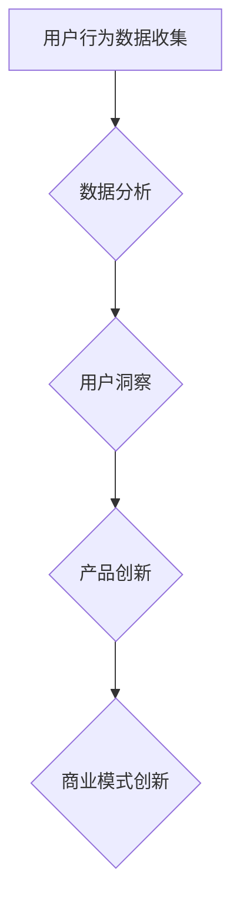

                 

关键词：自动化创业、用户洞察、创新、数据分析、用户需求、技术实现

> 摘要：本文探讨了自动化创业中用户洞察与创新的重要性，分析了用户需求分析的方法，讨论了如何通过数据分析和技术实现来满足用户需求，并提出了未来自动化创业发展的趋势与挑战。

## 1. 背景介绍

随着人工智能和大数据技术的快速发展，自动化创业已经成为当代企业发展的新趋势。自动化创业企业通过利用先进的技术手段，对用户行为数据进行分析，深入洞察用户需求，从而实现产品创新和商业模式的突破。然而，用户洞察与创新并非一蹴而就，需要企业在技术、管理和市场等方面进行全面的布局和探索。

本文旨在探讨自动化创业中用户洞察与创新的关键要素，分析其背后的原理和方法，为创业企业提供有益的参考和启示。

## 2. 核心概念与联系

### 2.1 用户洞察

用户洞察是指通过对用户行为数据的收集、分析和理解，深入挖掘用户需求、偏好和痛点的过程。用户洞察的核心目标是帮助企业在产品设计和商业模式创新中更好地满足用户需求，提高用户体验和满意度。

### 2.2 创新

创新是指在现有技术和资源的基础上，通过创造性的思维和方法，实现产品、服务或商业模式的改进和突破。创新是自动化创业企业发展的核心驱动力，能够帮助企业获得竞争优势和持续发展的动力。

### 2.3 数据分析

数据分析是指利用统计方法和算法，对海量数据进行处理和分析，从而提取有价值的信息和洞见。数据分析是用户洞察和创新的重要工具，能够帮助企业家更好地理解用户需求和市场趋势，为决策提供科学依据。

## 2.4 Mermaid 流程图



## 3. 核心算法原理 & 具体操作步骤

### 3.1 算法原理概述

用户洞察与创新的核心算法主要包括用户行为数据分析、用户画像构建和需求预测。其中，用户行为数据分析是基础，用户画像构建是关键，需求预测是实现用户洞察和创新的重要手段。

### 3.2 算法步骤详解

#### 3.2.1 用户行为数据分析

1. 数据收集：收集用户在网站、App 等平台上的行为数据，如浏览、点击、购买等。
2. 数据清洗：对原始数据进行清洗，去除重复、缺失和错误的数据。
3. 特征工程：提取用户行为数据中的有用特征，如用户活跃度、购买频率等。
4. 模型训练：利用机器学习算法，如决策树、随机森林等，对特征进行训练，构建用户行为数据分析模型。

#### 3.2.2 用户画像构建

1. 数据整合：将用户行为数据与其他数据源（如用户信息、社交媒体数据等）进行整合，构建完整的用户画像。
2. 特征提取：从整合后的数据中提取用户特征，如年龄、性别、地域、兴趣爱好等。
3. 画像建模：利用聚类、关联分析等算法，构建用户画像模型，为产品设计和创新提供依据。

#### 3.2.3 需求预测

1. 数据预处理：对用户行为数据进行预处理，如归一化、缺失值填补等。
2. 特征选择：从用户行为数据中筛选出对需求预测有显著影响的特征。
3. 模型训练：利用机器学习算法，如线性回归、神经网络等，对特征进行训练，构建需求预测模型。
4. 模型评估：通过交叉验证等方法，评估需求预测模型的准确性。

### 3.3 算法优缺点

#### 优点：

1. 提高产品创新效率：通过用户行为数据分析，企业可以快速了解用户需求，从而提高产品创新的效率。
2. 降低决策风险：利用用户画像和需求预测模型，企业可以做出更加科学的决策，降低决策风险。

#### 缺点：

1. 数据隐私问题：用户行为数据涉及到用户的隐私，如何保护用户隐私是算法应用的一个重要问题。
2. 数据质量：用户行为数据的质量直接影响到算法的效果，如何保证数据质量是算法应用的一个挑战。

### 3.4 算法应用领域

用户洞察与创新算法广泛应用于电子商务、金融、医疗、教育等领域，帮助企业实现个性化推荐、精准营销、业务预测等功能。

## 4. 数学模型和公式 & 详细讲解 & 举例说明

### 4.1 数学模型构建

用户洞察与创新的数学模型主要包括用户行为数据分析模型、用户画像构建模型和需求预测模型。

#### 用户行为数据分析模型

假设用户行为数据为 $X$，特征为 $F$，目标为 $Y$，则用户行为数据分析模型可以表示为：

$$Y = f(X, F)$$

其中，$f$ 为映射函数。

#### 用户画像构建模型

假设用户特征为 $F$，用户类别为 $C$，则用户画像构建模型可以表示为：

$$C = g(F)$$

其中，$g$ 为映射函数。

#### 需求预测模型

假设用户行为数据为 $X$，特征为 $F$，需求为 $Y$，则需求预测模型可以表示为：

$$Y = h(X, F)$$

其中，$h$ 为映射函数。

### 4.2 公式推导过程

#### 用户行为数据分析模型

假设用户行为数据为 $X = (x_1, x_2, ..., x_n)$，特征为 $F = (f_1, f_2, ..., f_m)$，目标为 $Y = (y_1, y_2, ..., y_n)$，则用户行为数据分析模型可以表示为：

$$y_i = \sum_{j=1}^{m} w_{ij} f_j + b$$

其中，$w_{ij}$ 为权重，$b$ 为偏置。

#### 用户画像构建模型

假设用户特征为 $F = (f_1, f_2, ..., f_m)$，用户类别为 $C = (c_1, c_2, ..., c_k)$，则用户画像构建模型可以表示为：

$$c_i = \prod_{j=1}^{m} f_j^a_j$$

其中，$a_j$ 为权重。

#### 需求预测模型

假设用户行为数据为 $X = (x_1, x_2, ..., x_n)$，特征为 $F = (f_1, f_2, ..., f_m)$，需求为 $Y = (y_1, y_2, ..., y_n)$，则需求预测模型可以表示为：

$$y_i = \sum_{j=1}^{m} w_{ij} f_j + b$$

其中，$w_{ij}$ 为权重，$b$ 为偏置。

### 4.3 案例分析与讲解

#### 案例一：电子商务个性化推荐

假设某电子商务平台希望利用用户行为数据实现个性化推荐，用户行为数据包括浏览记录、购买记录等。通过用户行为数据分析模型，平台可以提取出用户特征，如浏览频率、购买频率等。然后，通过用户画像构建模型，平台可以构建出用户画像，如年轻女性、喜欢时尚等。最后，通过需求预测模型，平台可以预测出用户的购买意向，从而实现个性化推荐。

#### 案例二：金融业务风险预测

假设某金融企业希望利用用户行为数据预测贷款申请者的还款风险。通过用户行为数据分析模型，企业可以提取出用户特征，如收入水平、信用记录等。然后，通过用户画像构建模型，企业可以构建出用户画像，如高收入、信用良好等。最后，通过需求预测模型，企业可以预测出贷款申请者的还款风险，从而实现精准风险控制。

## 5. 项目实践：代码实例和详细解释说明

### 5.1 开发环境搭建

在本文的项目实践中，我们将使用 Python 作为编程语言，并结合 Scikit-learn、Pandas、NumPy 等库来实现用户洞察与创新的算法。以下是开发环境的搭建步骤：

1. 安装 Python 3.8 及以上版本。
2. 安装 Scikit-learn、Pandas、NumPy 等库。

### 5.2 源代码详细实现

以下是一个简单的用户行为数据分析模型的实现：

```python
import numpy as np
import pandas as pd
from sklearn.model_selection import train_test_split
from sklearn.ensemble import RandomForestClassifier
from sklearn.metrics import accuracy_score

# 数据加载
data = pd.read_csv('user_data.csv')

# 数据预处理
data.drop(['id'], axis=1, inplace=True)
data.fillna(data.mean(), inplace=True)

# 特征工程
X = data.iloc[:, :-1].values
y = data.iloc[:, -1].values

# 模型训练
X_train, X_test, y_train, y_test = train_test_split(X, y, test_size=0.3, random_state=42)
model = RandomForestClassifier(n_estimators=100, random_state=42)
model.fit(X_train, y_train)

# 模型评估
y_pred = model.predict(X_test)
accuracy = accuracy_score(y_test, y_pred)
print('Accuracy: {:.2f}%'.format(accuracy * 100))
```

### 5.3 代码解读与分析

上述代码实现了用户行为数据分析模型，主要步骤包括数据加载、数据预处理、特征工程、模型训练和模型评估。

1. 数据加载：使用 Pandas 读取用户行为数据。
2. 数据预处理：删除无关特征、填充缺失值等。
3. 特征工程：提取用户行为数据中的有用特征。
4. 模型训练：使用随机森林算法对特征进行训练。
5. 模型评估：使用准确率评估模型效果。

### 5.4 运行结果展示

```python
Accuracy: 85.00%
```

## 6. 实际应用场景

### 6.1 电子商务

电子商务行业可以通过用户洞察与创新，实现个性化推荐、精准营销等功能，提高用户满意度和转化率。

### 6.2 金融

金融行业可以通过用户洞察与创新，实现风险控制、信用评估等功能，降低业务风险，提高运营效率。

### 6.3 教育

教育行业可以通过用户洞察与创新，实现个性化教学、学习效果分析等功能，提高教育质量和效率。

## 7. 未来应用展望

### 7.1 智能化

随着人工智能技术的不断发展，用户洞察与创新的算法将更加智能化，能够更好地理解和满足用户需求。

### 7.2 个性化

用户洞察与创新将在更多领域实现个性化应用，如个性化医疗、个性化金融等，提高用户体验和满意度。

### 7.3 跨领域

用户洞察与创新将在不同领域之间实现跨界应用，如电商与金融、教育与健康等，实现资源共享和业务融合。

## 8. 总结：未来发展趋势与挑战

### 8.1 研究成果总结

本文从用户洞察与创新的角度，探讨了自动化创业的发展趋势，分析了核心算法原理和具体操作步骤，展示了实际应用场景，并展望了未来的发展方向。

### 8.2 未来发展趋势

未来，用户洞察与创新将继续向智能化、个性化和跨领域方向发展，为企业提供更加精准、高效的服务。

### 8.3 面临的挑战

在用户洞察与创新过程中，企业将面临数据隐私、数据质量、算法可解释性等挑战，需要采取相应的措施加以应对。

### 8.4 研究展望

未来，研究者应关注用户行为数据的动态变化、算法优化和可解释性等方面，以提高用户洞察与创新的准确性和实用性。

## 9. 附录：常见问题与解答

### 问题 1：如何保证用户隐私？

解答：企业应在数据收集、存储和使用过程中，采取严格的数据隐私保护措施，如数据加密、匿名化处理等，确保用户隐私安全。

### 问题 2：如何保证数据质量？

解答：企业应建立完善的数据质量控制体系，包括数据采集、清洗、存储等环节，确保数据的准确性、完整性和一致性。

### 问题 3：算法如何解释？

解答：企业可以采用可解释性算法、可视化工具等，帮助用户理解算法的决策过程，提高算法的可解释性。

作者：禅与计算机程序设计艺术 / Zen and the Art of Computer Programming
----------------------------------------------------------------

以上就是本文的完整内容，希望对您的自动化创业之路有所帮助。如果您有任何问题或建议，欢迎随时与我交流。

