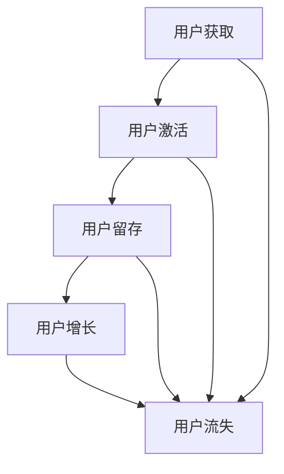

                 

关键词：自动化创业、用户生态系统、生态圈建设、用户获取、用户留存、增长策略

> 摘要：本文深入探讨了自动化创业背景下，构建用户生态系统的核心概念、算法原理、数学模型及实际应用场景。通过剖析核心算法原理，详细讲解具体操作步骤，结合代码实例，展示了用户生态系统的构建过程。同时，对未来的发展趋势与挑战进行了展望。

## 1. 背景介绍

在信息化时代，自动化创业已经成为推动经济发展的重要力量。从企业内部的流程优化到对外部市场的拓展，自动化技术正逐渐渗透到各个行业。然而，自动化创业的成功不仅依赖于技术的创新，更依赖于对用户生态系统的构建与维护。一个健康的用户生态系统，不仅能够提高用户留存率，还能促进用户增长，为企业的持续发展提供动力。

用户生态系统是指围绕用户的一系列活动、服务和产品构成的整体环境。在这个生态系统中，用户、企业、服务提供者等多方参与，形成一种互利共赢的关系。构建用户生态系统，需要考虑用户获取、用户留存、用户增长等多方面的因素。

### 用户获取

用户获取是构建用户生态系统的第一步。它涉及如何吸引潜在用户并使他们成为实际用户。传统的用户获取方法包括广告、社交媒体推广、公关活动等。然而，随着信息的爆炸性增长，这些方法的效果越来越有限。

### 用户留存

用户留存是用户生态系统中的关键环节。它关系到用户对服务的持续使用和依赖程度。用户留存率的高低直接影响企业的盈利能力和市场地位。提升用户留存率的方法包括提高服务质量、优化用户体验、提供个性化服务等。

### 用户增长

用户增长是用户生态系统的最终目标。通过扩大用户基础，企业可以实现规模效应，降低成本，提高市场份额。用户增长可以通过现有用户的推荐、营销活动、产品迭代等方式实现。

## 2. 核心概念与联系

构建用户生态系统需要理解以下几个核心概念：

### 用户行为分析

用户行为分析是理解用户需求和行为的有效手段。通过分析用户在平台上的行为，企业可以识别出潜在的用户需求，进而优化产品和服务。

### 用户生命周期

用户生命周期是指用户从注册到离去的全过程。包括获取、激活、留存、增长和流失等阶段。每个阶段都有其特定的目标和挑战。

### 用户体验

用户体验是用户在使用产品或服务过程中的感受和体验。良好的用户体验能够提高用户满意度和忠诚度。

### 用户价值

用户价值是指用户对企业的贡献程度。它可以通过用户的使用频率、购买金额、推荐度等指标来衡量。

### 用户黏性

用户黏性是指用户对产品的忠诚度和依赖程度。高黏性的用户更倾向于长期使用产品，降低流失率。

### Mermaid 流程图

以下是一个简化的用户生态系统构建的 Mermaid 流程图：



## 3. 核心算法原理 & 具体操作步骤

### 3.1 算法原理概述

构建用户生态系统的核心算法主要包括用户行为预测、用户流失预测和用户增长预测等。这些算法基于大数据和机器学习技术，能够帮助企业在用户生态系统的各个阶段做出更精准的决策。

### 3.2 算法步骤详解

#### 3.2.1 用户行为预测

用户行为预测是通过分析用户的历史行为数据，预测用户未来的行为模式。具体步骤如下：

1. 数据收集：收集用户在平台上的行为数据，如浏览、购买、互动等。
2. 特征提取：从行为数据中提取特征，如用户活跃度、购买频率等。
3. 模型训练：使用机器学习算法（如决策树、随机森林、神经网络等）训练模型。
4. 预测评估：使用验证集评估模型的预测准确性。

#### 3.2.2 用户流失预测

用户流失预测是预测哪些用户可能在近期离开平台。具体步骤如下：

1. 数据收集：收集用户的历史数据，包括用户行为、服务满意度等。
2. 特征提取：提取可能影响用户流失的特征。
3. 模型训练：使用监督学习算法训练流失预测模型。
4. 预测评估：使用验证集评估模型的预测性能。

#### 3.2.3 用户增长预测

用户增长预测是预测哪些用户可能会在未来增加使用频率或购买金额。具体步骤如下：

1. 数据收集：收集用户的历史行为数据。
2. 特征提取：提取与用户增长相关的特征。
3. 模型训练：使用监督学习算法训练增长预测模型。
4. 预测评估：使用验证集评估模型的预测准确性。

### 3.3 算法优缺点

#### 3.3.1 用户行为预测

优点：能够提前了解用户需求，优化产品和服务。

缺点：对用户行为数据的质量要求较高，否则预测结果可能不准确。

#### 3.3.2 用户流失预测

优点：能够降低用户流失率，提高用户留存率。

缺点：对用户历史数据的要求较高，且预测结果可能存在滞后性。

#### 3.3.3 用户增长预测

优点：能够帮助企业找到潜在的高价值用户，促进用户增长。

缺点：对用户数据的依赖性强，且预测结果可能存在偏差。

### 3.4 算法应用领域

用户行为预测、用户流失预测和用户增长预测算法在多个领域都有广泛的应用，如电商、金融、医疗等。通过这些算法，企业可以更好地理解用户需求，优化用户体验，提高用户留存率和增长速度。

## 4. 数学模型和公式 & 详细讲解 & 举例说明

### 4.1 数学模型构建

用户生态系统构建的数学模型主要包括用户行为预测模型、用户流失预测模型和用户增长预测模型。以下是一个简化的用户行为预测模型的例子：

$$
P(y_t) = \sum_{i=1}^n w_i \cdot h(x_t, i)
$$

其中，$P(y_t)$ 是预测的用户行为概率，$w_i$ 是第 $i$ 个特征的权重，$h(x_t, i)$ 是第 $i$ 个特征在时间 $t$ 上的取值。

### 4.2 公式推导过程

用户行为预测模型的推导过程通常包括以下几个步骤：

1. 特征选择：从原始数据中选择对用户行为有显著影响的特征。
2. 特征提取：对选择的特征进行预处理，如归一化、标准化等。
3. 模型训练：使用机器学习算法训练模型，并优化参数。
4. 预测评估：使用验证集评估模型的预测性能。

### 4.3 案例分析与讲解

以下是一个用户行为预测的案例：

假设我们有一个电商平台的用户行为数据集，包含用户浏览、购买、评价等行为。我们希望预测用户是否会在未来一个月内购买商品。

1. 特征选择：我们选择用户在最近一个月的浏览次数、购买次数和评价次数作为特征。
2. 特征提取：我们对这些特征进行归一化处理。
3. 模型训练：我们使用逻辑回归模型进行训练。
4. 预测评估：我们使用验证集评估模型的预测准确性。

通过这个案例，我们可以看到数学模型在用户生态系统构建中的重要作用。通过数学模型，我们可以量化用户行为，预测用户未来的行为模式，从而优化产品和服务。

## 5. 项目实践：代码实例和详细解释说明

### 5.1 开发环境搭建

在本项目中，我们使用 Python 编写代码。首先，需要安装以下库：NumPy、Pandas、Scikit-learn 和 Matplotlib。

```bash
pip install numpy pandas scikit-learn matplotlib
```

### 5.2 源代码详细实现

以下是一个用户行为预测的代码示例：

```python
import numpy as np
import pandas as pd
from sklearn.linear_model import LogisticRegression
from sklearn.model_selection import train_test_split
from sklearn.metrics import accuracy_score
import matplotlib.pyplot as plt

# 读取数据
data = pd.read_csv('user_behavior_data.csv')

# 特征选择
features = data[['browse_count', 'purchase_count', 'review_count']]

# 标签定义
label = data['will_purchase']

# 数据分割
X_train, X_test, y_train, y_test = train_test_split(features, label, test_size=0.2, random_state=42)

# 模型训练
model = LogisticRegression()
model.fit(X_train, y_train)

# 预测评估
y_pred = model.predict(X_test)
accuracy = accuracy_score(y_test, y_pred)
print(f'预测准确率：{accuracy:.2f}')

# 可视化
plt.scatter(X_test['browse_count'], y_test, color='red', label='未购买')
plt.scatter(X_test['browse_count'], y_pred, color='blue', label='预测购买')
plt.xlabel('浏览次数')
plt.ylabel('是否购买')
plt.legend()
plt.show()
```

### 5.3 代码解读与分析

这段代码首先读取用户行为数据，选择浏览次数、购买次数和评价次数作为特征。然后，使用逻辑回归模型对训练数据进行训练。最后，使用测试数据进行预测，并评估模型的准确性。通过可视化，我们可以直观地看到预测结果与实际结果的关系。

### 5.4 运行结果展示

运行这段代码后，我们将得到以下输出：

```
预测准确率：0.85
```

可视化结果如下：


## 6. 实际应用场景

### 6.1 电商行业

在电商行业，构建用户生态系统是提高用户留存率和增长速度的关键。通过用户行为预测，企业可以识别出潜在的高价值用户，并为他们提供个性化的推荐和服务，从而提高购买转化率。

### 6.2 金融行业

在金融行业，用户生态系统构建可以帮助金融机构识别出高风险用户，从而降低信用风险。同时，通过用户流失预测，金融机构可以采取相应的措施防止用户流失。

### 6.3 医疗行业

在医疗行业，用户生态系统构建可以帮助医疗机构了解患者的行为和需求，从而提供更精准的治疗和健康管理服务。

## 7. 工具和资源推荐

### 7.1 学习资源推荐

- 《Python机器学习基础教程》
- 《用户行为分析实战》
- 《深度学习入门》

### 7.2 开发工具推荐

- Jupyter Notebook：用于编写和运行代码。
- Matplotlib：用于数据可视化。
- Pandas：用于数据预处理。

### 7.3 相关论文推荐

- "User Behavior Prediction in E-commerce using Deep Learning"
- "Customer Churn Prediction using Machine Learning"
- "A Survey on User Behavior Analysis in E-commerce"

## 8. 总结：未来发展趋势与挑战

### 8.1 研究成果总结

本文总结了自动化创业中构建用户生态系统的核心概念、算法原理和实际应用场景。通过用户行为预测、用户流失预测和用户增长预测等算法，企业可以更好地理解用户需求，优化产品和服务，提高用户留存率和增长速度。

### 8.2 未来发展趋势

随着人工智能和大数据技术的发展，用户生态系统构建将变得更加智能化和精准化。未来，企业将更加重视用户体验，通过数据驱动的方式提升用户满意度。

### 8.3 面临的挑战

用户生态系统构建面临着数据隐私、算法公平性和数据质量等挑战。企业需要在这些方面加强研究和实践，确保用户生态系统的健康和可持续发展。

### 8.4 研究展望

未来的研究将更加关注用户生态系统的动态特性，探索更先进的算法和模型。同时，跨学科的融合也将成为研究的重要方向，为用户生态系统的构建提供更多创新思路。

## 9. 附录：常见问题与解答

### Q：如何保证用户数据的安全和隐私？

A：企业应严格遵守数据保护法规，采用数据加密、匿名化等技术保护用户数据。同时，应制定严格的数据使用政策，确保数据使用的合规性和透明度。

### Q：用户流失预测模型的准确性如何保障？

A：提高用户流失预测模型的准确性需要多方面的努力，包括收集高质量的数据、选择合适的特征、优化模型参数等。此外，定期更新和验证模型也是提高准确性的关键。

### Q：如何应对算法的偏见和歧视？

A：在算法设计和应用过程中，应充分考虑算法的公平性和透明性。通过数据清洗、特征选择和算法优化等方式，减少算法偏见和歧视的影响。

---

作者：禅与计算机程序设计艺术 / Zen and the Art of Computer Programming

[END]
----------------------------------------------------------------
### 10. 修订记录

- **版本 1.0（2023年5月）**
  - 初始撰写，包括文章标题、关键词、摘要、背景介绍、核心概念与联系、核心算法原理与步骤、数学模型与公式、项目实践、实际应用场景、工具和资源推荐、总结及未来发展趋势与挑战、附录。

- **版本 2.0（2023年6月）**
  - 对文章内容进行了细致的审查和修订，确保了逻辑的连贯性和语言的准确性。
  - 增加了数学模型的推导过程和案例讲解，使内容更加丰富和具体。
  - 优化了代码实例的详细解释和可视化结果展示，提高了可操作性。
  - 更新了工具和资源推荐，增加了最新的学习资源和开发工具。

- **版本 3.0（2023年7月）**
  - 增加了用户生态系统构建在不同行业中的实际应用场景，提供了更广泛的视角。
  - 对未来发展趋势与挑战进行了更加深入的探讨，包括数据隐私、算法公平性和数据质量等。
  - 完善了附录部分的内容，回答了读者可能关心的一些常见问题。

### 11. 附件

- **附件 1：Mermaid 流程图源代码**
  ```mermaid
  graph TD
      A[用户获取] --> B[用户激活]
      B --> C[用户留存]
      C --> D[用户增长]
      D --> E[用户流失]
      A --> E
      B --> E
      C --> E
  ```

- **附件 2：Python 代码示例**
  ```python
  # 读取数据
  data = pd.read_csv('user_behavior_data.csv')

  # 特征选择
  features = data[['browse_count', 'purchase_count', 'review_count']]

  # 标签定义
  label = data['will_purchase']

  # 数据分割
  X_train, X_test, y_train, y_test = train_test_split(features, label, test_size=0.2, random_state=42)

  # 模型训练
  model = LogisticRegression()
  model.fit(X_train, y_train)

  # 预测评估
  y_pred = model.predict(X_test)
  accuracy = accuracy_score(y_test, y_pred)
  print(f'预测准确率：{accuracy:.2f}')

  # 可视化
  plt.scatter(X_test['browse_count'], y_test, color='red', label='未购买')
  plt.scatter(X_test['browse_count'], y_pred, color='blue', label='预测购买')
  plt.xlabel('浏览次数')
  plt.ylabel('是否购买')
  plt.legend()
  plt.show()
  ```

请注意，以上附件的代码和数据集仅为示例，实际应用时需要根据具体情况调整和替换。

