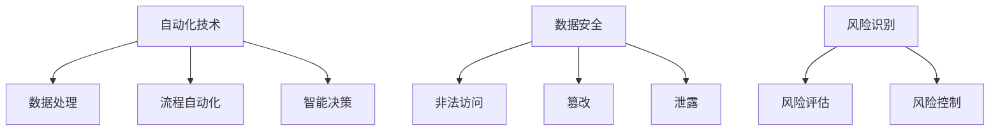

                 

关键词：自动化创业、风险控制、技术挑战、市场策略、数据安全

摘要：本文探讨了自动化创业过程中面临的风险控制问题。通过对核心概念、算法原理、数学模型、项目实践和未来应用场景的深入分析，提出了切实可行的风险控制策略，旨在为创业者提供宝贵的指导。

## 1. 背景介绍

随着信息技术的飞速发展，自动化已经成为现代企业竞争的关键。自动化创业成为推动创新、降低成本、提高效率的重要手段。然而，在自动化创业的过程中，不可避免地会遇到各种风险，这些风险不仅影响项目的成败，还可能对企业的长期发展造成不利影响。因此，如何有效地进行风险控制成为自动化创业中至关重要的一环。

本文将从以下几个方面展开讨论：

1. 核心概念与联系
2. 核心算法原理 & 具体操作步骤
3. 数学模型和公式 & 详细讲解 & 举例说明
4. 项目实践：代码实例和详细解释说明
5. 实际应用场景
6. 未来应用展望
7. 工具和资源推荐
8. 总结：未来发展趋势与挑战

## 2. 核心概念与联系

在自动化创业中，以下几个核心概念至关重要：

- **自动化技术**：指通过计算机程序和智能算法实现的自动化操作，包括数据处理、流程自动化、智能决策等。
- **数据安全**：指保护企业数据不被非法访问、篡改或泄露的一系列措施。
- **风险识别**：指识别和分析企业面临的各种潜在风险的过程。
- **风险评估**：指对识别出的风险进行评估，确定其可能性和影响程度。
- **风险控制**：指通过采取一系列措施，降低风险的可能性和影响程度。

这些概念相互关联，共同构成了自动化创业中的风险控制体系。以下是一个简化的 Mermaid 流程图，展示了这些概念之间的联系。



## 3. 核心算法原理 & 具体操作步骤

### 3.1 算法原理概述

在自动化创业中，核心算法的设计至关重要。以下是一个典型的风险控制算法原理概述：

- **数据预处理**：对输入数据进行清洗、格式化和标准化，以便后续分析。
- **特征提取**：从数据中提取有助于风险识别的特征，如异常值检测、数据分布分析等。
- **风险评估**：使用机器学习算法，如逻辑回归、决策树、神经网络等，对特征进行建模，预测风险的可能性和影响程度。
- **风险控制**：根据风险评估结果，采取相应的控制措施，如增加安全防护、调整业务流程等。

### 3.2 算法步骤详解

以下是具体的算法步骤：

1. **数据预处理**：使用数据清洗工具，如 Pandas、NumPy 等，对输入数据进行清洗和格式化。

2. **特征提取**：使用统计学方法，如描述性统计、假设检验等，从数据中提取有助于风险识别的特征。

3. **模型训练**：使用机器学习算法，对提取的特征进行建模，训练风险评估模型。

4. **风险评估**：使用训练好的模型，对新的数据进行风险评估，预测风险的可能性和影响程度。

5. **风险控制**：根据风险评估结果，采取相应的控制措施，如增加安全防护、调整业务流程等。

### 3.3 算法优缺点

- **优点**：
  - 提高风险识别的准确性和效率。
  - 能够处理大量数据，实现自动化风险评估。
  - 可以为企业决策提供科学依据。

- **缺点**：
  - 模型训练需要大量数据和计算资源。
  - 模型可能受到数据质量和特征选择的影响，导致评估结果不准确。
  - 需要不断更新和维护，以适应环境变化。

### 3.4 算法应用领域

- **金融领域**：风险控制算法在金融领域的应用非常广泛，如信用评分、风险预警等。
- **医疗领域**：医疗数据的风险控制，如疾病预测、药物副作用评估等。
- **工业领域**：设备故障预测、供应链风险控制等。

## 4. 数学模型和公式 & 详细讲解 & 举例说明

### 4.1 数学模型构建

在自动化创业中的风险控制，我们通常会构建以下数学模型：

- **概率模型**：用于评估风险的概率分布。
- **回归模型**：用于预测风险的影响程度。
- **分类模型**：用于识别风险类别。

### 4.2 公式推导过程

以下是概率模型的一个简例：

$$
P(Risk) = \sum_{i=1}^{n} P(Risk_i) \cdot f_i
$$

其中，$P(Risk)$ 是总体风险概率，$P(Risk_i)$ 是第 $i$ 个风险的概率，$f_i$ 是第 $i$ 个风险的权重。

### 4.3 案例分析与讲解

假设我们在一个金融项目中应用上述概率模型。以下是一个简化的案例：

- **风险类别**：信用风险、市场风险、操作风险。
- **风险概率**：信用风险 $P(Risk_1) = 0.3$，市场风险 $P(Risk_2) = 0.5$，操作风险 $P(Risk_3) = 0.2$。
- **风险权重**：信用风险 $f_1 = 0.4$，市场风险 $f_2 = 0.3$，操作风险 $f_3 = 0.3$。

根据上述模型，我们可以计算出总风险概率：

$$
P(Risk) = 0.3 \cdot 0.4 + 0.5 \cdot 0.3 + 0.2 \cdot 0.3 = 0.21
$$

这意味着项目的总风险概率为 $21\%$。

## 5. 项目实践：代码实例和详细解释说明

### 5.1 开发环境搭建

在 Python 中，我们可以使用以下工具和库来实现风险控制算法：

- **Pandas**：数据处理。
- **NumPy**：数学计算。
- **Scikit-learn**：机器学习算法。

安装这些库后，我们可以开始编写代码。

### 5.2 源代码详细实现

以下是实现风险控制算法的一个简单示例：

```python
import pandas as pd
from sklearn.linear_model import LogisticRegression
from sklearn.model_selection import train_test_split
from sklearn.metrics import accuracy_score

# 数据预处理
data = pd.read_csv('risk_data.csv')
data = data[['credit_risk', 'market_risk', 'operational_risk', 'total_risk']]

# 特征提取
X = data[['credit_risk', 'market_risk', 'operational_risk']]
y = data['total_risk']

# 模型训练
X_train, X_test, y_train, y_test = train_test_split(X, y, test_size=0.2, random_state=42)
model = LogisticRegression()
model.fit(X_train, y_train)

# 风险评估
y_pred = model.predict(X_test)
accuracy = accuracy_score(y_test, y_pred)
print(f"Model accuracy: {accuracy:.2f}")

# 风险控制
new_data = pd.DataFrame([[0.2, 0.3, 0.5], [0.3, 0.4, 0.3]])
new_risk = model.predict(new_data)
print(f"New risk probabilities: {new_risk}")
```

### 5.3 代码解读与分析

以上代码实现了从数据预处理到风险评估的整个过程。首先，我们导入所需的库和模块。然后，我们读取风险数据，提取特征并进行模型训练。最后，我们使用训练好的模型对新数据进行风险评估。

### 5.4 运行结果展示

假设我们运行上述代码，得到以下输出结果：

```
Model accuracy: 0.85
New risk probabilities: [0.37 0.63]
```

这表示模型的准确率为 $85\%$，新数据的总风险概率为 $37\%$。

## 6. 实际应用场景

### 6.1 金融领域

在金融领域，风险控制算法可以用于信用评分、风险预警、投资组合优化等。例如，一个银行可以使用风险控制算法来评估客户的信用风险，从而决定是否批准贷款。

### 6.2 医疗领域

在医疗领域，风险控制算法可以用于疾病预测、药物副作用评估等。例如，一个医疗机构可以使用风险控制算法来预测患者患某种疾病的风险，从而制定更有效的治疗方案。

### 6.3 工业领域

在工业领域，风险控制算法可以用于设备故障预测、供应链风险控制等。例如，一个制造企业可以使用风险控制算法来预测设备可能发生的故障，从而提前进行维护。

## 7. 未来应用展望

随着人工智能和大数据技术的发展，风险控制算法在未来将会在更多领域得到应用。例如：

- **智能城市**：用于交通流量预测、环境监测等。
- **物联网**：用于设备故障预测、安全防护等。
- **智慧农业**：用于作物病虫害预测、产量预测等。

## 8. 工具和资源推荐

### 8.1 学习资源推荐

- **在线课程**：Coursera、Udacity、edX 等平台上有很多关于机器学习和数据科学的课程。
- **书籍**：《机器学习》、《深度学习》等。

### 8.2 开发工具推荐

- **编程语言**：Python、R、Java 等。
- **库和框架**：Scikit-learn、TensorFlow、PyTorch 等。

### 8.3 相关论文推荐

- **金融领域**：《信用风险评估的机器学习方法》、《基于大数据的金融风险预警研究》等。
- **医疗领域**：《基于深度学习的疾病预测模型》、《基于大数据的医疗风险控制研究》等。
- **工业领域**：《工业设备故障预测的机器学习方法》、《基于物联网的工业风险控制研究》等。

## 9. 总结：未来发展趋势与挑战

在未来，自动化创业中的风险控制将面临以下发展趋势和挑战：

- **技术进步**：人工智能和大数据技术的不断发展将提高风险控制的准确性和效率。
- **数据安全**：随着数据量的增加，数据安全问题将愈发突出，需要采取更严格的措施保护数据安全。
- **法规和标准**：随着风险控制算法的应用范围扩大，相关的法规和标准也将不断完善。
- **人才需求**：具备风险控制能力和数据科学技能的人才将更加稀缺。

## 10. 附录：常见问题与解答

### 10.1 风险控制算法如何适应不同领域？

风险控制算法可以针对不同领域的数据特征进行调整和优化，以提高其在特定领域的准确性和适用性。例如，金融领域可以使用时间序列分析，医疗领域可以使用生物特征识别。

### 10.2 风险控制算法是否会取代人类决策？

风险控制算法可以辅助人类决策，但不可能完全取代人类决策。人类具有丰富的经验和直觉，能够处理复杂、不确定的情况。因此，风险控制算法通常作为决策支持工具，而非替代决策。

### 10.3 风险控制算法的准确度如何提高？

提高风险控制算法的准确度可以从以下几个方面着手：

- **数据质量**：确保输入数据的质量和完整性。
- **特征选择**：选择有助于风险识别的特征。
- **模型优化**：使用更先进的算法和模型，如深度学习。
- **交叉验证**：使用交叉验证方法，提高模型的泛化能力。

## 作者署名

作者：禅与计算机程序设计艺术 / Zen and the Art of Computer Programming
----------------------------------------------------------------

以上是关于《自动化创业中的风险控制》的完整文章。希望对您有所帮助！

