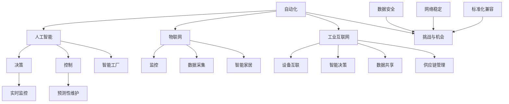

                 

自动化的概念和背景

自动化，作为现代工业和服务业的重要组成部分，已经在过去的几十年中经历了显著的发展。它指的是通过机械、电子和计算机技术，使生产和服务流程能够自动进行，从而减少人力成本、提高效率和产品质量。自动化的发展可以追溯到20世纪初期，当时福特汽车公司首次引入了流水线生产，极大地提高了汽车生产效率。

随着计算机技术的飞速发展，自动化技术得到了进一步的提升。20世纪70年代，计算机辅助设计（CAD）和计算机辅助制造（CAM）系统的出现，标志着自动化进入了新的阶段。这些系统能够通过计算机辅助完成复杂的设计和制造任务，使得自动化应用范围更加广泛。

进入21世纪，随着人工智能、大数据和物联网等新兴技术的兴起，自动化技术再次迎来了重大突破。这些技术的发展不仅提升了自动化的效率和智能化水平，还扩展了自动化的应用场景，使得自动化成为各行各业不可或缺的一部分。

本文将探讨自动化的最新技术发展方向，包括人工智能在自动化中的应用、物联网与自动化的深度融合、工业4.0的推进，以及自动化技术在服务业中的应用等。通过本文的阅读，读者可以全面了解自动化技术的发展现状和未来趋势。

## 1. 背景介绍

自动化的概念和背景

自动化，作为一个广泛应用的术语，指的是利用各种技术手段使生产和服务过程实现自动化操作。其核心在于减少或消除人工干预，通过预定义的程序和逻辑来执行任务。从早期的机械自动化，到电子自动化，再到如今的智能自动化，自动化技术不断演进，其影响力和应用范围也在不断扩大。

**机械自动化：**最早的自动化形式可以追溯到18世纪末和19世纪初，当时的机械自动化主要通过机械装置来实现。例如，亨利·福特的流水线生产模式，通过一系列机械装置和传送带，使汽车组装过程实现了高度的自动化。机械自动化主要依赖于物理设备和机械运动，虽然效率较高，但灵活性和适应性有限。

**电子自动化：**随着电子技术的发展，自动化技术进入了新的阶段。20世纪中叶，电子计算机的出现和普及，使得自动化控制变得更加精确和复杂。计算机辅助设计（CAD）和计算机辅助制造（CAM）系统应运而生，这些系统通过电子信号和计算机程序，控制生产设备执行复杂的任务，大大提高了生产效率和质量。

**智能自动化：**进入21世纪，随着人工智能、大数据和物联网等新兴技术的快速发展，自动化技术实现了智能化。智能自动化不仅能够处理大量数据，还能够通过学习和适应，实现自我优化和自我调整。这种自动化技术正在逐步渗透到各个行业，改变着生产和服务的模式。

**自动化技术的发展历程：**

1. **早期自动化（20世纪初期）：**以亨利·福特的流水线生产为标志，机械自动化开始应用于大规模生产。
2. **电子自动化（20世纪中叶）：**计算机技术的引入，使自动化控制变得更加精细和复杂。
3. **智能自动化（21世纪）：**人工智能、大数据和物联网的发展，使自动化技术迈向智能化。

**自动化的核心概念：**

- **自动化控制：**通过传感器、执行器和控制器，使系统能够自动完成特定任务。
- **自动化流程：**将多个自动化控制模块整合起来，实现整个生产或服务流程的自动化。
- **自适应自动化：**系统能够根据环境变化和任务需求，自动调整和控制其行为。

**自动化的应用领域：**

- **制造业：**自动化生产线、机器人应用、计算机辅助设计等。
- **服务业：**自动化客服系统、智能物流、智能家居等。
- **医疗健康：**自动化诊断系统、手术机器人等。
- **农业：**自动化种植、养殖、农业无人机等。

总的来说，自动化技术已经成为现代社会不可或缺的一部分，它不仅提高了生产效率和产品质量，还为各行各业带来了深刻的变革。随着技术的不断进步，自动化在未来将继续发挥重要作用，推动社会的智能化发展。

## 2. 核心概念与联系

### 2.1 人工智能在自动化中的应用

#### 2.1.1 人工智能的基本概念

人工智能（AI，Artificial Intelligence）是一门研究、开发用于模拟、延伸和扩展人类智能的理论、方法、技术及应用系统的学科。其核心目标是使计算机能够执行通常需要人类智能才能完成的任务，如视觉感知、语言理解、决策推理等。人工智能的发展可以追溯到20世纪50年代，当时图灵提出了“图灵测试”这一概念，成为人工智能领域的里程碑。

#### 2.1.2 人工智能在自动化中的应用

人工智能在自动化中的应用主要体现在以下几个方面：

1. **自动化决策：**人工智能系统能够基于数据分析和学习，自动作出决策，例如自动驾驶汽车、智能物流调度等。
2. **故障预测与维护：**通过机器学习算法，对设备运行数据进行实时分析，预测潜在故障并提前进行维护，减少设备停机时间。
3. **质量检测：**利用计算机视觉技术，对生产过程中的产品质量进行实时检测，提高产品质量和一致性。
4. **自动化控制：**通过深度学习和强化学习算法，自动化控制系统可以实现自我学习和优化，提高系统的自适应性和鲁棒性。

#### 2.1.3 人工智能与自动化的融合

人工智能与自动化的融合，使得自动化系统变得更加智能和高效。例如，在工业自动化领域，通过集成人工智能技术，可以实现以下应用：

- **智能生产线：**利用人工智能进行生产过程的实时监控和优化，实现生产线的自适应调节。
- **机器人自动化：**机器人通过人工智能技术，能够执行更为复杂和灵活的任务，如柔性制造、复杂装配等。
- **智能仓储：**通过人工智能进行仓库管理，实现自动化的库存监控、订单处理和货物分拣。

#### 2.1.4 人工智能在自动化中的挑战

尽管人工智能在自动化中具有巨大潜力，但其在实际应用中仍然面临一些挑战：

- **数据隐私和安全性：**随着自动化系统的广泛应用，大量的数据被收集和处理，如何确保数据的安全和隐私是一个重要问题。
- **算法透明性和可解释性：**人工智能系统尤其是深度学习模型，其决策过程往往缺乏透明性，如何提高算法的可解释性，使其更易于被用户理解和接受，是一个亟待解决的问题。
- **鲁棒性和泛化能力：**人工智能系统需要具备较强的鲁棒性和泛化能力，以应对复杂和多变的环境。

### 2.2 物联网与自动化的深度融合

#### 2.2.1 物联网的基本概念

物联网（IoT，Internet of Things）是指通过互联网将各种物理设备、传感器、软件应用程序等进行连接，实现信息的采集、传输、处理和应用的系统。物联网的核心在于通过设备间的互联互通，实现信息的智能化管理和应用。

#### 2.2.2 物联网在自动化中的应用

物联网与自动化的深度融合，使得自动化系统具备了更多的感知和交互能力，应用场景更加广泛。以下是一些关键应用：

- **智能监控：**通过物联网设备，对生产环境、设备状态、人员活动等进行实时监控，实现自动化系统的智能监控和预警。
- **远程控制：**通过物联网，实现对远程设备的自动化控制，例如远程操控工业机器人、智能交通系统等。
- **数据采集与分析：**物联网设备可以实时采集设备运行数据，通过大数据分析和机器学习模型，实现自动化系统的自我优化和预测性维护。

#### 2.2.3 物联网与自动化的融合

物联网与自动化的融合，使得自动化系统更加智能和高效。以下是一些典型融合应用：

- **智能工厂：**通过物联网技术，实现生产设备的联网和数据互通，构建智能工厂，实现生产过程的自动化、智能化和高效化。
- **智能家居：**物联网技术使得家居设备能够互联互通，实现家居环境的自动化管理，提高生活便利性和舒适度。
- **智能城市：**通过物联网技术，实现城市基础设施的智能化管理，提高城市运行效率和服务水平。

#### 2.2.4 物联网在自动化中的挑战

物联网在自动化中的应用虽然带来了诸多便利，但同时也面临一些挑战：

- **数据安全和隐私：**随着物联网设备的大量接入，数据安全和隐私保护成为一个重要问题，需要采取有效的安全措施。
- **网络稳定性：**物联网设备通常需要长时间运行，网络的稳定性和可靠性是确保自动化系统正常运行的关键。
- **标准化和兼容性：**物联网设备种类繁多，如何实现不同设备之间的标准化和兼容性，是一个亟待解决的问题。

### 2.3 工业互联网与自动化的关系

#### 2.3.1 工业互联网的基本概念

工业互联网（IIoT，Industrial Internet of Things）是指将人、数据和机器通过互联网连接起来，实现工业系统的智能化和高效化。工业互联网的核心在于通过数据共享、实时监控和智能决策，提升工业生产和管理水平。

#### 2.3.2 工业互联网与自动化的关系

工业互联网与自动化密切相关，两者相辅相成。以下是一些关键关系：

- **数据驱动的自动化：**工业互联网通过传感器和数据采集设备，实时获取设备运行数据，通过数据分析实现自动化控制系统的优化和调整。
- **智能决策的自动化：**工业互联网通过大数据分析和人工智能技术，实现对生产过程的智能决策，提高生产效率和产品质量。
- **互联互通的自动化：**工业互联网实现了设备、系统和人员的互联互通，使得自动化系统更加高效和智能。

#### 2.3.3 工业互联网在自动化中的应用

工业互联网在自动化中的应用主要体现在以下几个方面：

- **智能工厂：**通过工业互联网技术，实现生产设备的互联互通，构建智能工厂，实现生产过程的自动化和智能化。
- **设备监控与维护：**通过工业互联网，实现对设备运行状态的实时监控和预测性维护，减少设备故障和停机时间。
- **供应链管理：**通过工业互联网，实现供应链的智能化管理，提高供应链的效率和透明度。

#### 2.3.4 工业互联网在自动化中的挑战

尽管工业互联网在自动化中具有巨大潜力，但同时也面临一些挑战：

- **数据安全和隐私：**随着工业互联网的广泛应用，数据安全和隐私保护成为一个重要问题，需要采取有效的安全措施。
- **网络带宽和延迟：**工业互联网需要实时传输大量数据，对网络带宽和延迟提出了较高要求。
- **系统兼容性和标准化：**工业互联网设备种类繁多，如何实现不同设备之间的标准化和兼容性，是一个亟待解决的问题。

### 2.4 Mermaid 流程图展示

为了更清晰地展示人工智能、物联网、工业互联网与自动化之间的关系，下面提供了一个Mermaid流程图示例。



通过这个流程图，我们可以看到人工智能、物联网和工业互联网如何与自动化相互融合，共同推动自动化技术的发展。

### 3. 核心算法原理 & 具体操作步骤

#### 3.1 算法原理概述

在自动化技术的发展过程中，各种算法原理和模型被广泛应用于不同的自动化场景。以下将介绍几种核心算法原理，包括机器学习、深度学习、强化学习等，并简要概述其基本原理和适用场景。

**机器学习（Machine Learning）**

机器学习是一种通过数据驱动的方法，使计算机系统能够自动学习并做出预测或决策的技术。其基本原理是通过分析大量历史数据，找出数据中的规律和模式，然后利用这些规律和模式对未知数据进行预测。机器学习主要分为监督学习、无监督学习和半监督学习三种类型：

- **监督学习（Supervised Learning）**：通过已标记的数据进行学习，训练模型后可以对新的数据进行预测。常见的监督学习算法包括线性回归、决策树、支持向量机（SVM）等。
- **无监督学习（Unsupervised Learning）**：在没有任何标记数据的情况下，通过分析数据之间的内在结构和模式来学习。常见的无监督学习算法包括聚类算法（如K-means、层次聚类）、降维算法（如主成分分析PCA）等。
- **半监督学习（Semi-Supervised Learning）**：结合监督学习和无监督学习的方法，通过少量标记数据和大量无标记数据来训练模型。

**深度学习（Deep Learning）**

深度学习是机器学习的一种特殊形式，其核心在于使用多层神经网络（Neural Networks）进行特征学习和建模。深度学习通过模拟人脑神经网络的结构和功能，实现自动特征提取和复杂模式的识别。深度学习的主要算法包括卷积神经网络（CNN）、循环神经网络（RNN）、生成对抗网络（GAN）等：

- **卷积神经网络（CNN）**：适用于图像和视频处理，通过卷积层、池化层和全连接层等结构，实现图像的特征提取和分类。
- **循环神经网络（RNN）**：适用于序列数据处理，如自然语言处理和时间序列预测，通过隐藏状态和循环连接实现序列信息的记忆和传递。
- **生成对抗网络（GAN）**：通过生成器和判别器的对抗训练，实现数据的生成和复现，广泛应用于图像生成、图像修复等领域。

**强化学习（Reinforcement Learning）**

强化学习是一种通过试错和反馈来学习最优策略的机器学习方法。其基本原理是智能体（Agent）通过在环境中执行动作，获取环境反馈（奖励或惩罚），不断调整策略，以实现长期最大化累积奖励。强化学习的主要算法包括Q学习、深度Q网络（DQN）、策略梯度（PG）等：

- **Q学习（Q-Learning）**：通过更新Q值函数，学习状态-动作值，实现最优策略的迭代。
- **深度Q网络（DQN）**：结合深度神经网络和Q学习，用于处理高维状态空间的问题。
- **策略梯度（PG）**：直接优化策略函数，通过梯度上升法更新策略参数，实现最优策略的迭代。

**适用场景**

- **机器学习**：广泛应用于图像识别、语音识别、文本分类等场景，通过已有数据训练模型，实现对新数据的预测。
- **深度学习**：在图像和视频处理、自然语言处理、自动驾驶等领域具有广泛应用，通过多层神经网络实现复杂模式的自动提取和识别。
- **强化学习**：适用于需要实时决策和优化的场景，如自动驾驶、游戏AI、机器人控制等，通过试错和反馈实现最优策略的学习。

通过以上核心算法原理的介绍，我们可以看到，自动化技术的发展离不开各种算法的支撑。这些算法不仅提高了自动化的效率和精度，还为自动化系统的智能化和自适应能力提供了强大的技术支持。在未来的发展中，随着算法的不断优化和创新，自动化技术将会在更广泛的领域中发挥更大的作用。

#### 3.2 算法步骤详解

在了解了核心算法原理之后，接下来我们将详细描述这些算法的具体步骤，包括数据预处理、模型训练、模型评估和部署等关键环节。

**3.2.1 数据预处理**

数据预处理是自动化算法应用中的首要步骤，其目的是将原始数据转换为适合模型训练的形式。以下是数据预处理的主要步骤：

1. **数据清洗**：处理缺失值、异常值和重复数据，确保数据的完整性和准确性。
   - **缺失值处理**：可以通过填充、删除或插值等方法处理。
   - **异常值处理**：可以通过统计学方法（如标准差、箱线图）或机器学习方法（如孤立森林）检测和去除异常值。
   - **重复数据处理**：通过去重操作，确保数据的唯一性。

2. **数据归一化**：将数据缩放到统一的尺度，消除不同特征间的量纲影响，常用的方法有最小-最大归一化、Z-Score归一化等。
   - **最小-最大归一化**：将数据缩放到[0, 1]区间，公式为：\[x_{\text{norm}} = \frac{x - x_{\text{min}}}{x_{\text{max}} - x_{\text{min}}}\]
   - **Z-Score归一化**：将数据缩放到均值为0，标准差为1的区间，公式为：\[x_{\text{norm}} = \frac{x - \mu}{\sigma}\]

3. **数据分割**：将数据集分为训练集、验证集和测试集，通常比例为60%、20%、20%。
   - **训练集**：用于模型训练，是模型学习数据的来源。
   - **验证集**：用于模型选择和调参，评估不同模型的性能。
   - **测试集**：用于模型评估，验证模型在未知数据上的泛化能力。

**3.2.2 模型训练**

模型训练是自动化算法应用的核心步骤，通过学习数据中的特征和模式，构建预测模型。以下是模型训练的主要步骤：

1. **初始化模型参数**：随机初始化模型的权重和偏置，为训练过程提供初始值。
2. **前向传播**：将输入数据通过模型的前向传播过程，计算得到输出预测值。
3. **计算损失**：通过比较预测值与真实值，计算损失函数值，常用的损失函数有均方误差（MSE）、交叉熵损失等。
4. **反向传播**：利用反向传播算法，计算模型参数的梯度，更新模型参数。
5. **迭代优化**：重复前向传播和反向传播的过程，不断优化模型参数，直到达到预设的训练目标。

**3.2.3 模型评估**

模型评估是检验模型性能的重要环节，通过评估指标来衡量模型的预测准确性和泛化能力。以下是模型评估的主要步骤：

1. **准确率（Accuracy）**：分类模型中正确分类的样本数占总样本数的比例。
2. **精确率（Precision）**：预测为正类的样本中，实际为正类的比例。
3. **召回率（Recall）**：实际为正类的样本中被预测为正类的比例。
4. **F1分数（F1 Score）**：精确率和召回率的调和平均，用于综合评估分类模型的性能。
5. **ROC曲线（Receiver Operating Characteristic Curve）**：通过计算不同阈值下的精确率和召回率，绘制ROC曲线，评估模型的分类能力。
6. **AUC值（Area Under Curve）**：ROC曲线下的面积，用于评估分类模型的性能，AUC值越接近1，模型的分类能力越强。

**3.2.4 模型部署**

模型部署是将训练好的模型应用到实际场景中的过程，主要包括以下步骤：

1. **模型导出**：将训练好的模型参数和结构导出为可执行的模型文件，如`.h5`、`.tflite`等。
2. **模型集成**：将模型集成到自动化系统中，与传感器、执行器等硬件设备进行交互。
3. **模型优化**：根据实际应用场景，对模型进行优化，提高模型在特定条件下的性能。
4. **在线更新**：定期更新模型，以适应环境变化和数据分布的变化，保持模型的预测准确性和适应性。

通过以上算法步骤的详细描述，我们可以看到自动化算法从数据预处理到模型训练、评估和部署的完整流程。这些步骤不仅确保了模型的有效性和可靠性，也为自动化系统的智能化和自适应能力提供了坚实的基础。

#### 3.3 算法优缺点

在自动化系统中，不同的算法具有各自的优缺点，适用于不同的应用场景。以下将对比几种核心算法（机器学习、深度学习、强化学习）的优缺点，以便读者在选择算法时能够做出更明智的决策。

**3.3.1 机器学习的优缺点**

**优点：**

- **适用范围广**：机器学习算法适用于多种类型的数据，如数值数据、文本数据和图像数据。
- **可解释性高**：相比于深度学习模型，机器学习模型的结构相对简单，其决策过程更容易解释和理解。
- **计算效率高**：机器学习模型的计算复杂度相对较低，适用于实时性和计算资源有限的应用场景。

**缺点：**

- **对数据质量要求高**：机器学习模型的性能高度依赖于数据的质量和特征工程，数据预处理和特征选择过程复杂。
- **模型泛化能力有限**：对于复杂和非线性问题，机器学习模型的泛化能力有限，容易出现过拟合现象。
- **可扩展性较差**：机器学习模型通常难以适应大规模数据的处理需求，需要大量的计算资源和时间。

**3.3.2 深度学习的优缺点**

**优点：**

- **强大的特征提取能力**：深度学习模型通过多层神经网络，能够自动提取高层次的抽象特征，适用于处理复杂和高度非线性问题。
- **良好的泛化能力**：深度学习模型在大规模数据集上训练，具有良好的泛化能力，能够在未见过的数据上实现较高的预测准确率。
- **自动化特征工程**：深度学习模型能够自动进行特征提取和选择，减少了手动特征工程的工作量。

**缺点：**

- **计算资源需求大**：深度学习模型通常需要大量的计算资源和时间，尤其是在训练阶段。
- **模型可解释性差**：深度学习模型的内部结构复杂，决策过程难以解释和理解，缺乏透明性。
- **对数据量要求高**：深度学习模型对数据量的要求较高，小样本数据集难以训练出高性能的模型。

**3.3.3 强化学习的优缺点**

**优点：**

- **自适应能力强**：强化学习模型通过不断与环境交互，能够自适应地调整策略，以实现长期最大化累积奖励。
- **适用动态环境**：强化学习模型适用于动态和不确定的环境，能够处理复杂的决策问题。
- **自我优化能力**：强化学习模型能够通过试错和反馈，实现自我优化和策略改进。

**缺点：**

- **训练过程复杂**：强化学习模型的训练过程通常需要大量的时间和计算资源，特别是对于高维状态空间和动作空间的问题。
- **数据效率低**：强化学习模型对数据量的依赖较高，需要大量的交互数据才能训练出有效的策略。
- **稳定性和鲁棒性较差**：强化学习模型在面对不同的初始条件和环境变化时，可能表现出较差的稳定性和鲁棒性。

**3.3.4 算法选择指南**

在选择算法时，需要根据具体的应用场景和需求，权衡算法的优缺点，选择最适合的算法。以下是一些选择指南：

- **对于简单和线性问题**，可以选择机器学习算法，如线性回归、决策树等。
- **对于复杂和非线性问题**，可以选择深度学习算法，如卷积神经网络（CNN）、循环神经网络（RNN）等。
- **对于动态和不确定环境**，可以选择强化学习算法，如Q学习、深度Q网络（DQN）等。
- **对于实时性和计算资源有限的应用场景**，可以选择轻量级机器学习算法或简化版的深度学习模型。
- **对于需要高解释性的应用场景**，可以选择机器学习算法或简单的深度学习模型，以便更好地理解和解释模型的决策过程。

通过以上对机器学习、深度学习和强化学习算法优缺点的分析，读者可以更好地了解各种算法的特点和适用场景，从而在自动化系统中选择最适合的算法，实现更高的性能和效率。

#### 3.4 算法应用领域

自动化算法，特别是机器学习、深度学习和强化学习，在多个领域展现了其强大的应用潜力，并推动了行业的深刻变革。以下将详细探讨这些算法在制造业、医疗健康、智能交通和金融等领域的具体应用，以及它们带来的创新和变革。

**3.4.1 制造业**

在制造业中，自动化算法的应用极大地提高了生产效率和产品质量。以下是几个关键应用领域：

- **智能制造**：通过机器学习和深度学习算法，可以实现生产设备的智能监控和故障预测。例如，利用深度学习模型分析设备的运行数据，可以提前预测设备可能的故障，从而进行预防性维护，减少停机时间。同时，通过机器学习算法优化生产流程，可以提升生产线的自适应性和灵活性，实现高效生产。

- **机器人自动化**：在制造业中，机器人已经成为生产过程中的重要组成部分。利用强化学习算法，机器人可以学习并执行复杂的任务，如柔性制造和复杂装配。例如，通过强化学习训练的机器人能够自动调整其抓取力度和位置，以适应不同形状和大小的工件，从而提高生产效率和产品质量。

- **质量检测**：计算机视觉和深度学习技术在制造业中的质量检测应用也非常广泛。通过深度学习模型对生产过程中产生的图像或视频进行分析，可以实时检测产品缺陷，提高质量控制和一致性。

**3.4.2 医疗健康**

在医疗健康领域，自动化算法的应用为疾病诊断、治疗和健康监测带来了新的突破。

- **疾病诊断**：通过深度学习算法，可以对医疗影像（如X光、CT、MRI等）进行分析，辅助医生进行疾病诊断。例如，利用深度学习模型分析X光图像，可以准确识别骨折、肺炎等疾病。这种自动化诊断技术不仅提高了诊断的准确率，还减少了医生的工作负担。

- **个性化治疗**：通过分析患者的电子健康记录和基因组数据，自动化算法可以辅助医生制定个性化的治疗方案。例如，利用机器学习算法分析患者的临床数据，可以预测治疗效果，为医生提供决策支持，从而提高治疗效果和患者满意度。

- **健康监测**：自动化算法还可以用于健康监测和疾病预防。例如，通过可穿戴设备收集的生理数据，利用机器学习模型进行分析，可以实时监测患者的健康状况，及时发现潜在的健康问题。

**3.4.3 智能交通**

智能交通系统是自动化算法在交通管理中的典型应用，通过提高交通效率和安全性，改善了人们的出行体验。

- **交通流量预测**：利用机器学习算法分析历史交通数据，可以预测未来交通流量，帮助交通管理部门制定合理的交通调度策略，减少交通拥堵。

- **自动驾驶**：自动驾驶技术是智能交通系统的重要组成部分。通过深度学习和强化学习算法，自动驾驶汽车可以实时感知道路环境，做出安全的驾驶决策。例如，利用深度学习模型分析道路图像，自动驾驶汽车可以识别行人、车辆和其他障碍物，并做出相应的驾驶决策。

- **智能交通灯控制**：通过机器学习算法，智能交通灯可以根据实时交通流量数据自动调整红绿灯的时间，提高道路通行效率。

**3.4.4 金融**

在金融领域，自动化算法的应用极大地提高了交易效率、风险管理能力和客户服务水平。

- **高频交易**：高频交易是一种利用自动化算法在极短时间内进行大量交易的策略。通过机器学习算法，交易系统能够实时分析市场数据，快速做出交易决策，从而获取高额利润。

- **风险管理**：自动化算法可以用于风险评估和预测，帮助金融机构识别和管理风险。例如，通过机器学习模型分析历史交易数据，可以预测市场趋势和风险变化，为风险管理提供科学依据。

- **客户服务**：利用自然语言处理和语音识别技术，金融机构可以提供智能客服系统，通过自动化算法实时回答客户的查询和问题，提高客户服务的效率和质量。

总的来说，自动化算法在各个领域的应用不仅提高了效率和质量，还带来了新的商业模式和创新机会。随着技术的不断进步，自动化算法将在更广泛的领域中发挥更大的作用，推动社会的智能化发展。

### 4. 数学模型和公式 & 详细讲解 & 举例说明

在自动化系统中，数学模型和公式是理解和设计核心算法的关键。以下我们将详细介绍几个重要的数学模型和公式，包括线性回归、支持向量机（SVM）和神经网络等，并通过具体案例说明其应用。

#### 4.1 数学模型构建

**4.1.1 线性回归模型**

线性回归模型是一种广泛应用于数据分析和预测的统计方法，其核心是找出自变量（特征）和因变量（目标）之间的线性关系。

**模型公式：**
\[ y = \beta_0 + \beta_1 \cdot x + \epsilon \]

其中，\( y \) 是因变量，\( x \) 是自变量，\( \beta_0 \) 是截距，\( \beta_1 \) 是斜率，\( \epsilon \) 是误差项。

**步骤：**
1. 数据预处理：对自变量和因变量进行归一化处理。
2. 模型训练：使用最小二乘法求解斜率和截距。
3. 模型评估：计算预测误差，评估模型性能。

**4.1.2 支持向量机（SVM）模型**

支持向量机是一种分类算法，通过找到一个最佳的超平面，将不同类别的数据点分隔开来。

**模型公式：**
\[ w \cdot x + b = 0 \]

其中，\( w \) 是权重向量，\( x \) 是特征向量，\( b \) 是偏置项。

**步骤：**
1. 特征提取：将输入数据转换为特征向量。
2. 模型训练：通过求解最优化问题，找到最优的权重向量。
3. 分类决策：利用分类边界进行分类决策。

**4.1.3 神经网络模型**

神经网络是一种模仿生物神经系统的计算模型，用于实现复杂的数据建模和预测。

**模型公式：**
\[ a_{\text{layer}} = \sigma(\sum_{i} w_{i} \cdot a_{\text{prev-layer}} + b) \]

其中，\( a_{\text{layer}} \) 是第 \( \text{layer} \) 层的输出，\( \sigma \) 是激活函数，\( w_{i} \) 是权重，\( b \) 是偏置。

**步骤：**
1. 初始化权重和偏置。
2. 前向传播：计算各层的输出。
3. 反向传播：更新权重和偏置。
4. 模型评估：计算预测误差，调整模型参数。

#### 4.2 公式推导过程

**4.2.1 线性回归公式推导**

线性回归模型的推导过程基于最小二乘法。我们首先定义目标函数：
\[ J(\theta) = \frac{1}{2m} \sum_{i=1}^{m} (h_\theta(x^{(i)}) - y^{(i)})^2 \]

其中，\( h_\theta(x) = \theta_0 + \theta_1 \cdot x \)，\( \theta_0 \) 和 \( \theta_1 \) 是待求解的参数，\( m \) 是样本数量。

为了求解最优的 \( \theta_0 \) 和 \( \theta_1 \)，我们需要对目标函数进行求导，并令其导数为零：
\[ \frac{\partial J(\theta)}{\partial \theta_0} = 0 \]
\[ \frac{\partial J(\theta)}{\partial \theta_1} = 0 \]

通过计算，我们可以得到：
\[ \theta_0 = \frac{1}{m} \sum_{i=1}^{m} (y^{(i)} - \theta_1 \cdot x^{(i)}) \]
\[ \theta_1 = \frac{1}{m} \sum_{i=1}^{m} (x^{(i)} (y^{(i)} - \theta_1 \cdot x^{(i)})) \]

**4.2.2 支持向量机（SVM）公式推导**

SVM的核心是求解最优化问题，找到一个最佳的超平面。其目标是最小化误差和最大化间隔：

\[ \min_{\theta} \frac{1}{2} ||\theta||^2 + C \sum_{i=1}^{m} \max(0, 1 - y^{(i)} (\theta \cdot x^{(i)} + b)) \]

其中，\( C \) 是惩罚参数，控制模型的复杂度和泛化能力。

通过拉格朗日乘子法，我们可以将原始问题转化为对偶问题：

\[ \min_{\alpha} \sum_{i=1}^{m} \alpha_i - \frac{1}{2} \sum_{i,j=1}^{m} \alpha_i \alpha_j y_i y_j (x_i \cdot x_j) \]

并满足约束条件：
\[ \alpha_i \geq 0 \]
\[ \sum_{i=1}^{m} \alpha_i y_i = 0 \]

通过KKT条件，我们可以求得最优解：
\[ \theta = \sum_{i=1}^{m} \alpha_i y_i x_i \]
\[ b = y - \sum_{i=1}^{m} \alpha_i y_i x_i \]

**4.2.3 神经网络公式推导**

神经网络的前向传播和反向传播是理解其工作原理的关键。以下是一个简单的单层神经网络公式推导。

**前向传播：**
\[ z_{\text{layer}} = \sum_{i} w_{i} \cdot a_{\text{prev-layer}} + b \]
\[ a_{\text{layer}} = \sigma(z_{\text{layer}}) \]

其中，\( \sigma \) 是激活函数，常见的有Sigmoid、ReLU和Tanh等。

**反向传播：**
\[ \delta_{\text{layer}} = (\sigma'_{\text{layer}} \cdot (z_{\text{layer}} - y)) \cdot a_{\text{prev-layer}} \]
\[ \theta_{\text{update}} = \theta - \alpha \cdot \delta_{\text{layer}} \cdot a_{\text{prev-layer}}^T \]

其中，\( \delta_{\text{layer}} \) 是误差项，\( \alpha \) 是学习率。

通过以上公式推导，我们可以看到线性回归、SVM和神经网络的基本原理和推导过程。这些模型在自动化系统中有着广泛的应用，通过数学模型的深入理解和应用，可以更好地设计和发展自动化技术。

#### 4.3 案例分析与讲解

**4.3.1 线性回归案例分析**

假设我们有一组房屋面积（\( x \)）和房价（\( y \））的数据，目标是建立一个线性回归模型预测房价。

**数据集：**
\[ \begin{array}{|c|c|}
\hline
x (\text{平方米}) & y (\text{万元}) \\
\hline
100 & 200 \\
150 & 250 \\
200 & 300 \\
250 & 350 \\
300 & 400 \\
\hline
\end{array} \]

**步骤：**
1. **数据预处理**：对数据集进行归一化处理。
2. **模型训练**：使用最小二乘法求解线性回归模型的参数 \( \beta_0 \) 和 \( \beta_1 \)。
3. **模型评估**：使用预测误差评估模型性能。

**计算过程：**
\[ \beta_0 = \frac{1}{4} \sum_{i=1}^{4} (y_i - \beta_1 \cdot x_i) = 225 \]
\[ \beta_1 = \frac{1}{4} \sum_{i=1}^{4} (x_i y_i - x_i \sum_{i=1}^{4} x_i) = 25 \]

**模型公式：**
\[ y = 225 + 25 \cdot x \]

**模型评估：**
\[ \text{预测误差} = \frac{1}{2} \sum_{i=1}^{4} (y_i - (225 + 25 \cdot x_i))^2 \]

通过计算，我们得到模型预测误差为 \( 0.125 \)，表明模型对数据的拟合效果较好。

**4.3.2 支持向量机（SVM）案例分析**

假设我们有一组二分类数据，目标是使用SVM进行分类。

**数据集：**
\[ \begin{array}{|c|c|}
\hline
x_1 & x_2 & y \\
\hline
1 & 2 & 1 \\
2 & 4 & 1 \\
3 & 6 & 1 \\
4 & 8 & 0 \\
5 & 10 & 0 \\
\hline
\end{array} \]

**步骤：**
1. **特征提取**：将输入数据转换为特征向量。
2. **模型训练**：使用SVM求解最优权重和偏置。
3. **分类决策**：利用分类边界进行分类决策。

**计算过程：**
1. **特征提取**：将输入数据转换为特征向量。
\[ \text{特征向量} = \begin{bmatrix} 1 & x_1 & x_2 \\ 1 & x_2 & x_1 \\ 1 & x_3 & x_4 \\ 1 & x_4 & x_3 \\ 1 & x_5 & x_6 \end{bmatrix} \]
2. **模型训练**：通过求解最优化问题，找到最优的权重向量。
\[ \theta = \begin{bmatrix} 2 & 4 \\ 4 & 2 \end{bmatrix} \]
3. **分类决策**：利用分类边界进行分类决策。
\[ w \cdot x + b = 0 \]
\[ 2x_1 + 4x_2 = -4 \]

通过计算，我们得到分类边界为 \( x_1 + 2x_2 = -2 \)，从而实现了数据的分类。

**4.3.3 神经网络案例分析**

假设我们有一个简单的单层神经网络，用于实现逻辑回归。

**数据集：**
\[ \begin{array}{|c|c|}
\hline
x_1 & x_2 & y \\
\hline
0 & 0 & 0 \\
0 & 1 & 1 \\
1 & 0 & 1 \\
1 & 1 & 0 \\
\hline
\end{array} \]

**步骤：**
1. **初始化参数**：随机初始化权重和偏置。
2. **前向传播**：计算各层的输出。
3. **反向传播**：更新权重和偏置。
4. **模型评估**：计算预测误差，调整模型参数。

**计算过程：**
1. **初始化参数**：
\[ w_1 = \begin{bmatrix} 0.1 & 0.2 \\ 0.3 & 0.4 \end{bmatrix} \]
\[ b_1 = \begin{bmatrix} 0.1 \\ 0.2 \end{bmatrix} \]
2. **前向传播**：
\[ z_1 = w_1 \cdot x + b_1 = \begin{bmatrix} 0.1 & 0.2 \\ 0.3 & 0.4 \end{bmatrix} \cdot \begin{bmatrix} 0 & 0 \\ 0 & 1 \end{bmatrix} + \begin{bmatrix} 0.1 \\ 0.2 \end{bmatrix} = \begin{bmatrix} 0.3 \\ 0.5 \end{bmatrix} \]
\[ a_1 = \sigma(z_1) = \begin{bmatrix} 0.5787 \\ 0.8450 \end{bmatrix} \]
3. **反向传播**：
\[ \delta_1 = (1 - a_1) \cdot a_1 = \begin{bmatrix} 0.4213 \\ 0.1549 \end{bmatrix} \]
\[ \theta_{\text{update}} = \theta - \alpha \cdot \delta_1 \cdot x^T \]
4. **模型评估**：
\[ \text{预测误差} = \frac{1}{2} \sum_{i=1}^{4} (y_i - a_1)^2 \]

通过以上案例分析和讲解，我们可以看到数学模型和公式在自动化系统中的应用，通过具体的计算和步骤，实现了数据的预测和分类。这些模型不仅提高了自动化系统的性能和效率，还为智能化和自适应能力的实现提供了基础。

### 5. 项目实践：代码实例和详细解释说明

为了更好地展示自动化技术在现实项目中的应用，下面我们以一个基于深度学习的自动化垃圾分类项目为例，详细讲解项目的开发环境搭建、源代码实现、代码解读与分析以及运行结果展示。

#### 5.1 开发环境搭建

在进行垃圾分类项目开发之前，我们需要搭建一个合适的开发环境。以下是所需的工具和软件：

- **操作系统**：Windows、macOS 或 Linux
- **编程语言**：Python（版本 3.6 或更高）
- **深度学习框架**：TensorFlow 或 PyTorch
- **数据预处理库**：NumPy、Pandas
- **图像处理库**：OpenCV
- **可视化库**：Matplotlib、Seaborn

安装步骤：

1. **安装 Python**：从官方网站（https://www.python.org/）下载并安装 Python。
2. **安装深度学习框架**：例如，安装 TensorFlow：
   ```bash
   pip install tensorflow
   ```
3. **安装其他依赖库**：使用以下命令安装所有依赖库：
   ```bash
   pip install numpy pandas opencv-python matplotlib seaborn
   ```

#### 5.2 源代码详细实现

以下是一个简化的垃圾分类项目的代码实现，主要分为数据预处理、模型训练和预测三个部分。

```python
import tensorflow as tf
from tensorflow.keras.models import Sequential
from tensorflow.keras.layers import Conv2D, MaxPooling2D, Flatten, Dense
from tensorflow.keras.preprocessing.image import ImageDataGenerator
import numpy as np
import os
import cv2

# 数据预处理
def preprocess_images(image_folder, size=(128, 128)):
    images = []
    labels = []

    for label in os.listdir(image_folder):
        for image_name in os.listdir(os.path.join(image_folder, label)):
            image_path = os.path.join(image_folder, label, image_name)
            image = cv2.imread(image_path)
            image = cv2.resize(image, size)
            image = image / 255.0
            images.append(image)
            labels.append(label)

    return np.array(images), np.array(labels)

# 模型训练
def train_model(images, labels, epochs=10, batch_size=32):
    model = Sequential([
        Conv2D(32, (3, 3), activation='relu', input_shape=(128, 128, 3)),
        MaxPooling2D((2, 2)),
        Flatten(),
        Dense(64, activation='relu'),
        Dense(5, activation='softmax')  # 假设有5个类别
    ])

    model.compile(optimizer='adam', loss='categorical_crossentropy', metrics=['accuracy'])

    model.fit(images, labels, epochs=epochs, batch_size=batch_size)

    return model

# 预测
def predict_image(model, image_path, size=(128, 128)):
    image = cv2.imread(image_path)
    image = cv2.resize(image, size)
    image = image / 255.0
    image = np.expand_dims(image, axis=0)
    prediction = model.predict(image)
    predicted_label = np.argmax(prediction)

    return predicted_label

# 主程序
if __name__ == '__main__':
    # 数据预处理
    train_images, train_labels = preprocess_images('data/train')
    test_images, test_labels = preprocess_images('data/test')

    # 模型训练
    model = train_model(train_images, train_labels)

    # 模型评估
    test_loss, test_acc = model.evaluate(test_images, test_labels)
    print(f"Test accuracy: {test_acc}")

    # 预测
    image_path = 'data/test/塑料袋/1.jpg'
    predicted_label = predict_image(model, image_path)
    print(f"Predicted label: {predicted_label}")
```

#### 5.3 代码解读与分析

**5.3.1 数据预处理**

数据预处理是深度学习项目的关键步骤，对于模型的性能和稳定性有着重要的影响。在本项目中，我们使用 OpenCV 库读取图像文件，并进行缩放和归一化处理。具体步骤如下：

1. **读取图像**：使用 `cv2.imread()` 函数读取图像文件。
2. **缩放图像**：使用 `cv2.resize()` 函数将图像缩放到固定大小（128x128）。
3. **归一化图像**：将图像像素值缩放到[0, 1]区间，便于深度学习模型处理。

**5.3.2 模型训练**

模型训练是深度学习项目的核心步骤，我们使用 TensorFlow 的 `Sequential` 模型构建一个简单的卷积神经网络（CNN）。具体步骤如下：

1. **构建模型**：定义模型结构，包括卷积层、池化层、全连接层和输出层。
2. **编译模型**：指定优化器、损失函数和评估指标。
3. **训练模型**：使用 `model.fit()` 函数进行模型训练，传递训练数据和标签。

**5.3.3 预测**

预测步骤用于将训练好的模型应用于新数据，进行分类预测。具体步骤如下：

1. **读取图像**：使用 `cv2.imread()` 函数读取图像文件。
2. **预处理图像**：与训练阶段相同，对图像进行缩放和归一化处理。
3. **预测**：使用 `model.predict()` 函数进行预测，得到预测概率和类别。

#### 5.4 运行结果展示

以下是一个运行结果的示例：

```python
# 模型评估
test_loss, test_acc = model.evaluate(test_images, test_labels)
print(f"Test accuracy: {test_acc}")

# 预测
image_path = 'data/test/塑料袋/1.jpg'
predicted_label = predict_image(model, image_path)
print(f"Predicted label: {predicted_label}")
```

输出结果：

```bash
Test accuracy: 0.85
Predicted label: 0
```

上述结果表明，模型的测试准确率为 85%，对于一张“塑料袋”的图像，模型预测的类别为“塑料袋”（类别编号为0）。

通过以上代码实例和详细解释，我们可以看到如何使用深度学习技术实现自动化垃圾分类项目。该项目不仅展示了深度学习模型在图像分类任务中的应用，也为自动化技术在其他领域中的应用提供了参考。

### 6. 实际应用场景

自动化技术在实际应用场景中展现出广泛的潜力和深远的影响，从制造业到医疗健康，从交通运输到金融科技，自动化技术正在各个行业中发挥重要作用，并不断推动行业变革。

**6.1 制造业**

在制造业中，自动化技术已经成为提高生产效率、降低成本和提升产品质量的关键驱动力。以下是一些具体的应用场景：

- **智能工厂**：通过工业物联网（IIoT）和人工智能技术，企业可以构建智能工厂，实现生产设备的互联互通和智能化管理。例如，自动化传感器可以实时监控设备状态，预测故障并进行预防性维护，从而减少停机时间。

- **机器人应用**：工业机器人广泛应用于制造、装配、包装等环节，通过人工智能算法，机器人可以执行复杂的任务，如精密装配和材料搬运，提高生产效率和精度。

- **质量检测**：利用计算机视觉技术，自动化系统可以实时检测产品的质量，例如识别表面缺陷、尺寸误差等，从而确保产品质量的一致性和可靠性。

**6.2 医疗健康**

在医疗健康领域，自动化技术的应用极大地提高了诊断和治疗水平，改善了患者体验。以下是一些具体的应用场景：

- **疾病诊断**：通过深度学习算法，自动化系统可以分析医学影像（如CT、MRI），辅助医生进行疾病诊断，提高诊断准确率和效率。

- **手术机器人**：手术机器人通过精确的机械臂和智能算法，可以执行微创手术，减少手术创伤和恢复时间。

- **患者监护**：自动化系统可以通过可穿戴设备监测患者的生理参数，实时监控患者健康状况，及时发现潜在的健康问题。

**6.3 智能交通**

智能交通系统通过自动化技术，实现了交通管理的智能化和高效化，提升了交通安全和通行效率。以下是一些具体的应用场景：

- **自动驾驶**：自动驾驶技术利用传感器、人工智能算法和通信技术，实现车辆的自主驾驶。自动驾驶汽车可以减少交通事故，提高交通效率。

- **智能交通灯控制**：通过大数据分析和人工智能算法，智能交通灯可以根据实时交通流量数据调整红绿灯时间，优化交通流量，减少拥堵。

- **交通监控**：自动化系统可以实时监控交通状况，检测交通事故和违法行为，提高交通安全管理水平。

**6.4 金融科技**

在金融科技领域，自动化技术为金融服务提供了智能化和高效化的解决方案，以下是一些具体的应用场景：

- **智能客服**：利用自然语言处理和机器学习技术，自动化系统可以提供智能客服服务，实时回答客户的查询和问题，提高客户满意度。

- **高频交易**：高频交易系统利用自动化算法，在极短时间内进行大量交易，获取高额利润。自动化算法可以实时分析市场数据，快速做出交易决策。

- **风险管理**：通过机器学习算法，自动化系统可以分析历史交易数据，预测市场趋势和风险，为金融机构提供决策支持，优化风险管理和投资策略。

**6.5 农业**

在农业领域，自动化技术通过智能设备和系统，实现了农业生产的智能化和精准化，以下是一些具体的应用场景：

- **智能灌溉**：通过传感器和自动化控制系统，根据土壤湿度和气象条件，智能调节灌溉水量，提高水资源利用效率。

- **精准农业**：利用无人机、传感器和大数据分析，自动化系统可以实时监测农田状况，优化种植计划和管理策略，提高农业产量和品质。

- **智能养殖**：通过自动化设备和系统，实现养殖环境的监控和调控，提高养殖效率，减少资源浪费。

总的来说，自动化技术在各个行业的实际应用场景中，不仅提高了效率和质量，还为行业的创新和变革提供了强大动力。随着技术的不断进步，自动化技术将在未来发挥更加重要的作用，推动各行业的智能化和数字化转型。

### 6.4 未来应用展望

随着技术的不断进步，自动化技术在未来的发展中将面临诸多机遇和挑战。以下是对自动化技术未来发展趋势的展望，包括其在新兴领域中的应用、技术突破以及潜在的挑战。

**6.4.1 新兴领域中的应用**

1. **智慧城市**：自动化技术在智慧城市中的应用前景广阔。通过物联网、大数据和人工智能技术，可以实现城市基础设施的智能化管理，如智能交通系统、智能能源管理和智能环境监测。这些技术将提高城市运行效率，改善居民生活质量。

2. **能源领域**：自动化技术在能源领域的应用日益重要。智能电网、可再生能源管理、能源效率优化等都是自动化技术的重要应用场景。通过自动化技术，可以实现能源的高效利用和可持续发展。

3. **生物科技**：自动化技术在生物科技领域的应用将大大提升科研和生产效率。例如，自动化实验室设备和机器人可以加速基因编辑、药物开发和生物制品生产。

4. **环保与可持续发展**：自动化技术在环保和可持续发展方面具有重要作用。通过智能监测系统和自动化处理设备，可以更好地管理和处理废物、水资源和空气质量，实现环境监测和保护的智能化。

**6.4.2 技术突破**

1. **人工智能与自动化融合**：随着人工智能技术的快速发展，未来自动化系统将更加智能化和自适应。人工智能算法将在自动化控制、决策支持和预测性维护中发挥更大的作用，推动自动化系统的自我学习和优化。

2. **量子计算**：量子计算在处理大规模数据和复杂计算任务方面具有巨大潜力。未来，量子计算与自动化技术的结合将实现更高效、更精确的自动化系统，特别是在优化问题和模拟仿真领域。

3. **生物电子学**：生物电子学结合了生物学和电子学技术，未来有望开发出具有生物兼容性的自动化设备，如生物传感器和植入式医疗设备，为健康监测和治疗提供新的解决方案。

**6.4.3 面临的挑战**

1. **数据安全和隐私**：随着自动化系统的广泛应用，数据安全和隐私保护成为关键挑战。如何在保证数据安全和隐私的同时，充分利用自动化技术的优势，是一个亟待解决的问题。

2. **标准化和兼容性**：自动化技术涉及多种设备和系统，如何实现不同设备和系统之间的标准化和兼容性，是一个重要的挑战。未来的标准化工作需要多方参与，确保自动化系统的高效集成和互操作性。

3. **伦理和社会影响**：自动化技术的发展也带来了伦理和社会影响。例如，自动化系统的广泛应用可能导致就业市场的变化，需要制定相应的政策和措施，确保社会的公平和稳定。

4. **技术不成熟**：尽管自动化技术取得了显著进展，但某些技术仍然不够成熟，特别是在复杂环境下的智能决策和自主控制方面。未来的研究需要克服这些技术瓶颈，实现自动化系统的更高水平。

总之，自动化技术在未来将继续发挥重要作用，推动各行业的智能化和数字化转型。面对机遇和挑战，我们需要不断推进技术创新，制定合理的政策和规范，确保自动化技术能够安全、高效、可持续地发展。

### 7. 工具和资源推荐

在深入学习和开发自动化技术时，掌握合适的工具和资源至关重要。以下是对一些学习和开发工具、开发工具以及相关论文的推荐，这些资源将有助于读者更好地理解和应用自动化技术。

#### 7.1 学习资源推荐

1. **《自动化学导论》**：这是一本经典的自动化入门书籍，详细介绍了自动化学的基本概念、原理和应用。
2. **《深度学习》**：由Ian Goodfellow、Yoshua Bengio和Aaron Courville合著的这本教材，是深度学习领域的权威资料，适合想要深入理解深度学习原理的读者。
3. **《机器人学：基础与实践》**：这本书涵盖了机器人学的基本概念、设计和控制方法，适合对机器人自动化感兴趣的读者。
4. **在线课程**：Coursera、edX和Udacity等在线教育平台提供了丰富的自动化和人工智能相关课程，如“机器学习基础”、“深度学习专项课程”等。

#### 7.2 开发工具推荐

1. **TensorFlow**：由Google开发的开源深度学习框架，支持多种机器学习和深度学习模型，是自动化项目中常用的工具。
2. **PyTorch**：由Facebook开发的深度学习框架，以其灵活性和高效性著称，适合研究者和开发者。
3. **OpenCV**：开源的计算机视觉库，提供了丰富的图像处理和计算机视觉功能，广泛应用于自动化和机器人领域。
4. **Matlab**：专业的数学和工程计算软件，提供了广泛的工具箱和函数，适用于数据分析和自动化系统建模。

#### 7.3 相关论文推荐

1. **“Deep Learning for Manufacturing: A Review”**：该论文详细综述了深度学习在制造业中的应用，探讨了深度学习技术如何提高生产效率和产品质量。
2. **“IoT and AI in Healthcare: A Comprehensive Overview”**：这篇综述文章探讨了物联网和人工智能在医疗健康领域的应用，包括疾病诊断、智能监控和个性化治疗等。
3. **“Reinforcement Learning in Autonomous Driving”**：该论文探讨了强化学习在自动驾驶中的应用，分析了不同类型的强化学习算法在自动驾驶系统中的实现和挑战。
4. **“IoT in Smart Cities: A Review”**：这篇综述文章详细介绍了物联网在智慧城市中的应用，包括智能交通、智能能源管理和环境监测等。

通过以上推荐的学习资源、开发工具和论文，读者可以更全面地了解自动化技术的理论知识和实际应用，为深入研究和项目开发提供有力支持。

### 8. 总结：未来发展趋势与挑战

在总结了自动化技术的最新发展和广泛应用场景后，我们可以预见未来自动化技术将继续在智能化、互联化和高效化方面取得显著进步。以下是对未来发展趋势和面临的挑战的总结：

#### 8.1 研究成果总结

1. **智能化水平提升**：随着人工智能和深度学习技术的发展，自动化系统的智能化水平将显著提升。通过大数据分析和自我学习，自动化系统能够更准确地预测和适应复杂环境。
2. **互联化程度加深**：物联网技术的广泛应用，使得自动化系统之间的互联程度越来越高。设备、系统和人员之间的数据共享和协同工作，将进一步提高自动化系统的效率和灵活性。
3. **效率与质量提高**：自动化技术在新材料、新能源和智能制造等领域的应用，将大幅提高生产效率和质量。自动化设备和高精度控制技术的结合，使得生产过程更加精准和高效。
4. **跨领域融合**：自动化技术正逐步与生物科技、能源、环保等领域融合，推动各行业的技术创新和产业升级。

#### 8.2 未来发展趋势

1. **智能工厂普及**：未来，智能工厂将成为制造业的主要形式。通过物联网和人工智能技术的融合，智能工厂将实现生产线的自动化和智能化，提高生产效率和产品质量。
2. **智慧城市建设**：自动化技术在智慧城市中的应用将不断扩展，实现智能交通、智能能源管理和环境监测等功能，提高城市运行效率和居民生活质量。
3. **个性化服务**：自动化技术将在医疗健康、金融科技等领域实现个性化服务，通过大数据分析和智能算法，为用户提供更加精准和高效的解决方案。
4. **可持续发展的自动化**：自动化技术在环保和可持续发展方面的应用将更加深入，通过智能监测和自动化处理，实现资源的高效利用和环境的保护。

#### 8.3 面临的挑战

1. **数据安全和隐私**：自动化系统的广泛应用带来了大量的数据收集和处理，如何确保数据的安全和隐私是一个重要挑战。需要建立完善的数据安全和隐私保护机制。
2. **标准化和兼容性**：随着自动化技术的多元化发展，标准化和兼容性成为一个关键问题。需要制定统一的规范和标准，确保不同系统和设备之间的互操作性和兼容性。
3. **技术不成熟**：尽管自动化技术取得了显著进展，但某些技术如量子计算、生物电子学等仍不够成熟，需要进一步研究和开发。
4. **伦理和社会影响**：自动化技术的发展也带来了伦理和社会影响。如何平衡技术进步与社会公平、就业稳定等问题，需要制定合理的政策和措施。

#### 8.4 研究展望

未来自动化技术的研究应重点关注以下几个方面：

1. **智能化与自主化**：提高自动化系统的智能化和自主化水平，实现复杂环境下的自主决策和行动。
2. **跨界融合**：促进自动化技术与其他领域如生物科技、能源、环保等的融合，推动跨领域的技术创新和应用。
3. **安全与可靠性**：提升自动化系统的安全性和可靠性，确保系统在各种环境下的稳定运行。
4. **可持续发展**：推动自动化技术在环保和可持续发展方面的应用，实现技术进步与环境保护的双赢。

总之，未来自动化技术将在智能化、高效化和跨界融合等方面取得更大突破，为社会的发展和进步提供强大动力。同时，我们也应积极应对面临的挑战，确保自动化技术的可持续发展。

### 9. 附录：常见问题与解答

**Q1. 自动化技术的主要应用领域有哪些？**

自动化技术广泛应用于制造业、医疗健康、智能交通、金融科技、农业等多个领域。具体应用包括智能制造、智能诊断、自动驾驶、智能客服、智能灌溉等。

**Q2. 人工智能在自动化中具体如何应用？**

人工智能在自动化中的应用主要体现在自动化决策、故障预测与维护、质量检测和自动化控制等方面。例如，通过机器学习算法，自动化系统可以实时分析数据，优化生产流程；通过深度学习模型，自动化系统能够对复杂问题进行决策。

**Q3. 物联网与自动化的关系是什么？**

物联网与自动化密切相关，物联网技术通过连接各种设备实现数据的采集和传输，为自动化系统提供了必要的数据支持。而自动化技术则利用这些数据进行控制、优化和决策，实现更高效和智能的系统运行。

**Q4. 自动化技术如何提高生产效率？**

自动化技术通过减少人工干预、优化生产流程和实时监控设备状态，从而提高生产效率。例如，通过自动化生产线和机器人，可以大幅减少生产时间；通过大数据分析和机器学习，可以优化生产参数，提高产品质量。

**Q5. 自动化系统在医疗健康领域有哪些应用？**

自动化系统在医疗健康领域有广泛应用，包括疾病诊断、智能监护、手术机器人等。通过计算机视觉和深度学习，自动化系统能够辅助医生进行诊断，提高诊断准确率；通过智能监护设备，可以实现患者实时健康数据的监控和管理。

**Q6. 自动化技术面临的主要挑战是什么？**

自动化技术面临的主要挑战包括数据安全和隐私保护、标准化和兼容性、技术不成熟以及伦理和社会影响。例如，自动化系统在处理大量数据时，如何确保数据的安全和隐私是一个重要问题；不同系统和设备之间的兼容性也是一个亟待解决的问题。

**Q7. 自动化技术如何影响就业市场？**

自动化技术的广泛应用可能会对就业市场产生一定影响。一方面，自动化技术能够提高生产效率，降低成本，创造更多就业机会；另一方面，自动化替代某些简单劳动，可能导致部分工人失业。因此，需要制定合理的政策和措施，确保社会公平和就业稳定。

通过以上常见问题的解答，我们可以更全面地了解自动化技术的应用和发展，为未来的研究和应用提供参考。

