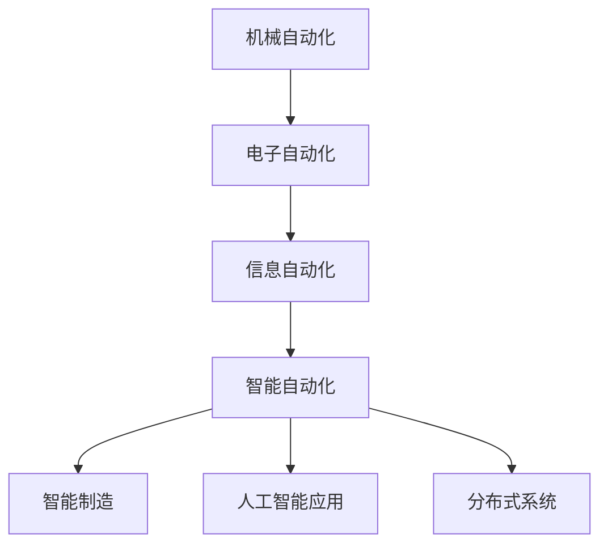

                 

自动化的未来：从智能制造到全面智能化

摘要：随着科技的不断发展，自动化技术已经成为推动现代工业和商业进步的关键动力。本文将探讨自动化的未来发展，包括其在智能制造、人工智能应用和分布式系统中的潜在变革，并预测这些技术将对社会、经济和人类生活带来的深远影响。

## 1. 背景介绍

自动化技术是指利用计算机、机器人、传感器和其他设备执行任务和操作的过程。自20世纪中叶以来，自动化技术经历了快速的发展，从最初的机械自动化到现代的智能自动化。如今，自动化已经深入到各行各业，从制造业到服务业，从医疗保健到交通运输，无不受益于自动化技术的应用。

然而，随着人工智能、大数据、物联网等新兴技术的崛起，自动化的未来将迎来更加广阔的发展空间。本文将重点关注以下几个方面：

1. **智能制造**：自动化技术如何推动制造业的转型与升级。
2. **人工智能应用**：自动化与人工智能的深度融合，如何改变人类的工作方式和生活方式。
3. **分布式系统**：自动化在分布式计算和存储中的应用，如何提高系统的可靠性和效率。
4. **未来应用展望**：自动化技术对社会、经济和人类生活的潜在影响。

## 2. 核心概念与联系

### 自动化的核心概念

自动化技术的核心概念包括以下几个方面：

1. **机械自动化**：利用机械装置代替人力完成重复性工作。
2. **电子自动化**：利用电子设备进行控制、监测和调节。
3. **信息自动化**：利用计算机技术实现信息处理和传输的自动化。
4. **智能自动化**：结合人工智能技术，实现更加智能和自适应的自动化。

### 自动化架构的 Mermaid 流程图



### 自动化与相关技术的联系

- **自动化与智能制造**：智能制造是自动化的高级阶段，它不仅包括传统的机械和电子自动化，还融入了人工智能、大数据等新兴技术，实现制造过程的全面数字化和智能化。
- **自动化与人工智能**：人工智能为自动化提供了更加智能和自适应的解决方案，使得自动化系统能够更好地应对复杂和不确定的环境。
- **自动化与分布式系统**：分布式系统利用自动化技术实现资源的动态调度和优化，提高系统的可靠性和效率。

## 3. 核心算法原理 & 具体操作步骤

### 3.1 算法原理概述

自动化的核心算法原理主要包括以下几个方面：

1. **控制算法**：用于实现系统的自动控制，包括PID控制、模糊控制等。
2. **优化算法**：用于优化系统性能，包括线性规划、遗传算法等。
3. **机器学习算法**：用于实现系统的自适应和智能决策，包括神经网络、深度学习等。

### 3.2 算法步骤详解

1. **数据采集与预处理**：采集系统运行数据，并进行数据清洗和预处理。
2. **模型选择与训练**：根据系统需求选择合适的算法模型，并使用历史数据进行训练。
3. **模型验证与优化**：使用验证数据对模型进行验证，并根据验证结果进行模型优化。
4. **模型部署与运行**：将训练好的模型部署到生产环境中，并实时运行和监控。

### 3.3 算法优缺点

- **优点**：提高生产效率、降低人力成本、提高系统稳定性。
- **缺点**：初始投资较大、维护成本较高、对操作人员技能要求较高。

### 3.4 算法应用领域

自动化的算法广泛应用于各个领域，包括：

- **制造业**：生产线自动化、质量检测自动化、物流自动化等。
- **服务业**：智能客服、智能推荐、智能调度等。
- **医疗保健**：智能诊断、智能治疗、智能护理等。

## 4. 数学模型和公式 & 详细讲解 & 举例说明

### 4.1 数学模型构建

自动化的数学模型主要包括以下几个方面：

1. **状态方程**：描述系统内部状态变化的方程。
2. **输出方程**：描述系统输出与输入之间的关系。
3. **控制方程**：描述控制系统如何根据输出进行调整。

### 4.2 公式推导过程

假设我们有一个简单的线性系统，其状态方程和输出方程如下：

$$
\begin{align*}
\dot{x} &= Ax + Bu \\
y &=Cx + Du
\end{align*}
$$

其中，$x$ 是系统的状态向量，$u$ 是输入向量，$y$ 是输出向量，$A$、$B$、$C$、$D$ 是系统矩阵。

为了实现系统的自动控制，我们需要选择一个合适的控制策略，使得系统输出 $y$ 最小化或满足特定的性能指标。这可以通过优化控制算法来实现。

### 4.3 案例分析与讲解

假设我们有一个自动驾驶系统，其目标是确保车辆在道路上平稳行驶。系统的状态方程和输出方程如下：

$$
\begin{align*}
\dot{x} &= [0 \quad 1]x + [0 \quad 0.5]u \\
y &= [1 \quad 0]x
\end{align*}
$$

其中，$x$ 是车辆的状态向量，包括速度和方向；$u$ 是控制输入，即油门和刹车信号。

为了确保车辆在道路上平稳行驶，我们需要选择一个合适的控制策略。假设我们使用PID控制算法，其公式如下：

$$
u = K_p e + K_i \int e dt + K_d \dot{e}
$$

其中，$e = y_d - y$ 是期望输出和实际输出之间的误差，$y_d$ 是期望速度。

通过调整PID控制器的参数 $K_p$、$K_i$ 和 $K_d$，我们可以实现车辆的自动控制。例如，为了使车辆在30km/h的速度下平稳行驶，我们可以设置以下参数：

- $K_p = 1$
- $K_i = 0.1$
- $K_d = 0.1$

通过运行PID控制器，车辆可以在预期速度下平稳行驶。

## 5. 项目实践：代码实例和详细解释说明

### 5.1 开发环境搭建

为了实现自动化的算法，我们需要搭建一个合适的开发环境。这里我们选择Python作为编程语言，并使用以下工具和库：

- Python 3.8及以上版本
- NumPy：用于科学计算
- Matplotlib：用于数据可视化
- Scikit-learn：用于机器学习

### 5.2 源代码详细实现

以下是一个简单的自动化控制算法的Python代码实现：

```python
import numpy as np
import matplotlib.pyplot as plt
from scipy.optimize import minimize

# 状态方程
def state_equation(x, u):
    A = np.array([[0, 1],
                  [0, 0.5]])
    B = np.array([[0],
                  [0.5]])
    return A @ x + B @ u

# 输出方程
def output_equation(x):
    C = np.array([[1],
                  [0]])
    return C @ x

# PID控制算法
def pid_controller(y, y_d, K_p, K_i, K_d):
    e = y_d - y
    u = K_p * e + K_i * np积分(e) + K_d * e
    return u

# 目标函数
def objective(u):
    x = state_equation([0, 0], u)
    y = output_equation(x)
    return np.sum((y - y_d)**2)

# 参数设置
y_d = 30  # 期望速度
K_p = 1
K_i = 0.1
K_d = 0.1

# 最小化目标函数
u_opt = minimize(objective, x0=0, method='L-BFGS-B')

# 运行结果
x = state_equation([0, 0], u_opt.x)
y = output_equation(x)

# 可视化结果
plt.plot(y)
plt.xlabel('Time')
plt.ylabel('Speed')
plt.show()
```

### 5.3 代码解读与分析

- `state_equation` 函数实现状态方程的计算。
- `output_equation` 函数实现输出方程的计算。
- `pid_controller` 函数实现PID控制算法的计算。
- `objective` 函数定义目标函数，用于最小化误差。
- 使用`minimize`函数对目标函数进行优化，得到最优控制输入。
- 运行状态方程，得到实际输出。
- 使用`matplotlib`进行数据可视化，展示运行结果。

## 6. 实际应用场景

自动化的应用场景非常广泛，以下是几个典型的实际应用场景：

1. **制造业**：自动化生产线、质量检测、物料搬运等。
2. **交通运输**：自动驾驶、智能交通管理系统、无人机配送等。
3. **医疗保健**：智能诊断、智能治疗、智能护理等。
4. **金融服务**：智能客服、智能投顾、自动交易等。
5. **智能家居**：智能安防、智能照明、智能家电等。

### 6.4 未来应用展望

随着自动化的不断发展，未来应用场景将更加广泛和深入。以下是几个未来自动化的应用展望：

1. **智慧城市**：利用自动化技术实现城市的智能化管理和运营。
2. **农业自动化**：利用自动化技术提高农业生产效率和质量。
3. **教育自动化**：利用自动化技术实现个性化教育和智能学习。
4. **环境保护**：利用自动化技术实现环境的实时监测和污染控制。

## 7. 工具和资源推荐

### 7.1 学习资源推荐

- 《自动化学导论》
- 《人工智能：一种现代方法》
- 《深度学习》
- 《Python编程：从入门到实践》

### 7.2 开发工具推荐

- Python
- NumPy
- Matplotlib
- Scikit-learn
- TensorFlow
- PyTorch

### 7.3 相关论文推荐

- "Deep Learning for Automated Driving"
- "Industrial Automation Systems and Technologies"
- "Intelligent Automation in Healthcare"
- "Smart Manufacturing: From Theory to Practice"

## 8. 总结：未来发展趋势与挑战

### 8.1 研究成果总结

自动化的研究取得了显著的成果，包括：

- 自动化技术的不断进步，提高了生产效率和质量。
- 自动化与人工智能的融合，实现了更加智能和自适应的自动化系统。
- 自动化在各个领域的广泛应用，推动了社会和经济的发展。

### 8.2 未来发展趋势

自动化的未来发展趋势包括：

- 智能化：自动化系统将更加智能化和自适应。
- 网络化：自动化系统将实现更加紧密的网络连接和协同。
- 个性化：自动化系统将根据用户需求实现个性化定制。

### 8.3 面临的挑战

自动化在未来的发展过程中将面临以下挑战：

- 技术挑战：提高自动化技术的性能和稳定性。
- 安全挑战：确保自动化系统的安全性和可靠性。
- 法律挑战：制定相关的法律法规，规范自动化技术的发展。

### 8.4 研究展望

未来自动化研究将更加注重以下几个方面：

- 新型自动化技术的研发和应用。
- 自动化与人工智能、物联网等新兴技术的深度融合。
- 自动化系统在各个领域的创新应用。

## 9. 附录：常见问题与解答

### 9.1 自动化与人工智能的区别是什么？

自动化是指利用设备和技术实现任务和操作的自动化，而人工智能是指通过机器学习和深度学习等技术，使计算机具备人类智能的属性。自动化是人工智能的基础，而人工智能则为自动化提供了更加智能和自适应的解决方案。

### 9.2 自动化系统如何确保安全性？

自动化系统确保安全性的方法包括：

- 设计安全：在设计自动化系统时，考虑安全因素，确保系统不会对人类和环境造成危害。
- 监控与预警：实时监控自动化系统的运行状态，及时发现和预警潜在的安全隐患。
- 风险控制：对可能出现的风险进行评估和控制，采取相应的措施降低风险。

### 9.3 自动化技术如何影响就业？

自动化技术的应用确实会对就业产生影响，一方面可能会减少一些重复性和低技能的工作，另一方面也会创造出新的工作岗位，如自动化系统的设计、维护和运营等。总体而言，自动化技术将推动就业结构的变化，提高劳动力市场的灵活性和竞争力。

作者：禅与计算机程序设计艺术 / Zen and the Art of Computer Programming

----------------------------------------------------------------

